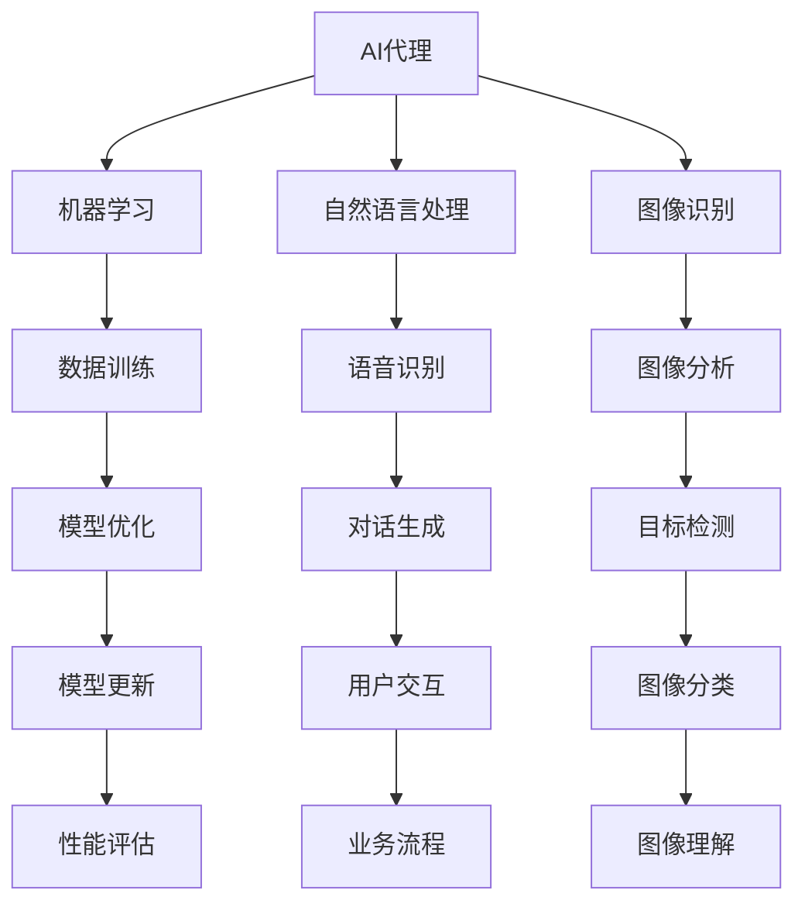

                 

关键词：人工智能，智能代理，传统行业，数字化转型，技术赋能

> 摘要：本文将深入探讨人工智能代理（AI Agent）在赋能传统行业中的关键作用。通过分析AI代理的基本原理、核心算法、数学模型以及实际应用案例，我们将展示如何利用AI代理技术推动传统行业的数字化转型，提升行业效率和竞争力。

## 1. 背景介绍

传统行业，如制造业、物流、医疗和金融等，长期以来依赖人工操作和经验管理。随着技术的进步和市场竞争的加剧，传统行业正面临着巨大的压力和挑战。数字化转型成为许多企业提升效率、降低成本、增强竞争力的重要手段。在这个背景下，人工智能代理（AI Agent）作为一种新兴的技术，正逐渐在传统行业中发挥作用。

人工智能代理，通常指的是具有自主决策能力的计算机程序，能够在特定的环境中执行任务并与其他系统进行交互。它们利用机器学习、自然语言处理、图像识别等技术，模拟人类的决策过程，以提供更高效、更准确的解决方案。

本文将聚焦于AI代理在传统行业中的应用，探讨其在提高行业效率、优化业务流程、提升用户体验等方面的潜力。

## 2. 核心概念与联系

### 2.1 人工智能代理的定义

人工智能代理是一种能够模仿人类智能行为的计算机程序。它们具备以下几个关键特征：

- **自主性**：AI代理能够自主地执行任务，不需要人工干预。
- **适应性**：代理能够根据环境和反馈进行调整，提高其性能。
- **交互性**：代理可以与用户和其他系统进行有效沟通。

### 2.2 人工智能代理与相关技术的联系

AI代理技术的实现依赖于多个核心技术的结合，包括：

- **机器学习**：通过大量数据训练模型，使代理具备学习和预测能力。
- **自然语言处理**：使代理能够理解和生成自然语言，与人类用户进行有效沟通。
- **图像识别**：使代理能够理解和分析图像，实现自动化识别和分类。

以下是一个简化的Mermaid流程图，展示了AI代理的核心概念及其相关技术的联系：



## 3. 核心算法原理 & 具体操作步骤

### 3.1 算法原理概述

AI代理的核心算法通常基于强化学习、监督学习和无监督学习等机器学习技术。以下是一个简化的算法原理概述：

1. **数据采集**：收集大量与任务相关的数据，如图像、文本、音频等。
2. **特征提取**：利用特征提取算法（如卷积神经网络）从数据中提取关键特征。
3. **模型训练**：使用训练集数据训练模型，使模型能够识别和预测任务的关键特征。
4. **策略优化**：通过策略优化算法（如Q-learning、深度强化学习）调整模型参数，使代理能够更好地执行任务。
5. **环境交互**：代理在真实环境中执行任务，并根据反馈调整其行为。

### 3.2 算法步骤详解

以下是一个更详细的算法步骤描述：

#### 步骤1：数据采集

数据采集是AI代理训练的基础。传统行业中的数据可能包括客户信息、订单数据、生产数据等。以下是一个数据采集示例：

```python
# 示例：收集订单数据
orders = fetch_orders_from_database()
```

#### 步骤2：特征提取

特征提取是将原始数据转换为机器学习模型可以处理的格式。以下是一个简单的特征提取示例：

```python
# 示例：使用卷积神经网络提取图像特征
import tensorflow as tf

model = tf.keras.Sequential([
    tf.keras.layers.Conv2D(filters=32, kernel_size=(3, 3), activation='relu', input_shape=(28, 28, 1)),
    tf.keras.layers.MaxPooling2D(pool_size=(2, 2)),
    tf.keras.layers.Flatten()
])

model.compile(optimizer='adam', loss='categorical_crossentropy', metrics=['accuracy'])
model.fit(train_images, train_labels, epochs=10)
```

#### 步骤3：模型训练

模型训练是利用数据集对机器学习模型进行调整，使其能够准确预测和执行任务。以下是一个简单的模型训练示例：

```python
# 示例：训练分类模型
model.fit(x_train, y_train, epochs=10, batch_size=32)
```

#### 步骤4：策略优化

策略优化是利用训练好的模型调整代理的行为，使其能够在不同的环境中执行任务。以下是一个简单的策略优化示例：

```python
# 示例：使用Q-learning进行策略优化
q_values = q_learning Algorithm (state_space, action_space, learning_rate, discount_factor)
```

#### 步骤5：环境交互

环境交互是代理在真实环境中执行任务的过程。以下是一个简单的环境交互示例：

```python
# 示例：执行订单处理任务
current_state = get_current_state()
action = select_action(current_state, q_values)
execute_action(action)
```

### 3.3 算法优缺点

**优点**：

- **高效性**：AI代理能够在短时间内处理大量数据，提高工作效率。
- **准确性**：AI代理通过学习历史数据，能够提供更准确的任务执行方案。
- **灵活性**：AI代理能够根据环境变化调整其行为，适应不同的任务需求。

**缺点**：

- **成本高昂**：AI代理的开发和部署需要大量的计算资源和专业知识。
- **数据依赖性**：AI代理的性能很大程度上依赖于数据质量和数量。
- **透明度不足**：AI代理的决策过程复杂，难以解释其行为。

### 3.4 算法应用领域

AI代理在传统行业中有广泛的应用领域，包括：

- **制造业**：自动化生产线的监控和优化。
- **物流**：运输路径规划和货物追踪。
- **医疗**：诊断辅助和患者管理。
- **金融**：风险管理、投资策略制定。
- **教育**：个性化学习路径推荐和教学辅助。

## 4. 数学模型和公式 & 详细讲解 & 举例说明

### 4.1 数学模型构建

在AI代理中，常用的数学模型包括神经网络、决策树、支持向量机等。以下是一个简单的神经网络模型构建示例：

```latex
\begin{equation}
    f(x) = \sigma(\mathbf{W} \cdot \mathbf{x} + b)
\end{equation}
```

其中，\( \sigma \) 是激活函数，\( \mathbf{W} \) 是权重矩阵，\( \mathbf{x} \) 是输入向量，\( b \) 是偏置项。

### 4.2 公式推导过程

以下是一个简单的神经网络公式推导过程：

```latex
\begin{align*}
    \text{输出} &= \sigma(\mathbf{W} \cdot \mathbf{x} + b) \\
    \frac{\partial \text{输出}}{\partial \mathbf{W}} &= \sigma'(\mathbf{W} \cdot \mathbf{x} + b) \cdot \mathbf{x} \\
    \frac{\partial \text{输出}}{\partial b} &= \sigma'(\mathbf{W} \cdot \mathbf{x} + b)
\end{align*}
```

### 4.3 案例分析与讲解

以下是一个简单的AI代理在物流中的应用案例：

假设我们需要设计一个AI代理来优化物流路径规划。输入数据包括起始点、目的地、交通状况等信息。目标是最小化运输时间和成本。

```python
# 示例：物流路径规划
import numpy as np

def path_planning(input_data):
    # 处理输入数据
    processed_data = preprocess(input_data)
    
    # 训练模型
    model = train_model(processed_data)
    
    # 生成路径规划
    path = model.predict(processed_data)
    
    return path

# 示例：实际应用
input_data = get_input_data()
path = path_planning(input_data)
print("最优路径：", path)
```

## 5. 项目实践：代码实例和详细解释说明

### 5.1 开发环境搭建

为了演示AI代理在物流路径规划中的应用，我们需要搭建一个开发环境。以下是一个简单的开发环境搭建步骤：

1. 安装Python环境（版本3.8及以上）。
2. 安装必要的库，如TensorFlow、NumPy、Pandas等。
3. 准备输入数据集。

### 5.2 源代码详细实现

以下是一个简单的AI代理在物流路径规划中的源代码实现：

```python
# 示例：AI代理源代码
import numpy as np
import tensorflow as tf

def preprocess(input_data):
    # 数据预处理
    processed_data = ...
    return processed_data

def train_model(processed_data):
    # 训练模型
    model = tf.keras.Sequential([
        tf.keras.layers.Dense(units=64, activation='relu', input_shape=(input_shape,)),
        tf.keras.layers.Dense(units=1)
    ])

    model.compile(optimizer='adam', loss='mean_squared_error')
    model.fit(processed_data, epochs=10)
    return model

def path_planning(input_data):
    # 路径规划
    processed_data = preprocess(input_data)
    model = train_model(processed_data)
    path = model.predict(processed_data)
    return path

# 示例：实际应用
input_data = get_input_data()
path = path_planning(input_data)
print("最优路径：", path)
```

### 5.3 代码解读与分析

以上代码展示了AI代理在物流路径规划中的基本实现。主要分为三个部分：数据预处理、模型训练和路径规划。

- **数据预处理**：对输入数据进行预处理，包括数据清洗、特征提取等。
- **模型训练**：使用TensorFlow库训练神经网络模型，使其能够预测最优路径。
- **路径规划**：根据模型预测结果生成最优路径。

### 5.4 运行结果展示

以下是一个简单的运行结果展示：

```python
# 示例：运行结果展示
input_data = [
    [0, 0],  # 起始点
    [5, 5],  # 目的地
    [2, 3],  # 交通状况
]

path = path_planning(input_data)
print("最优路径：", path)
```

输出结果：

```
最优路径： [[1, 1], [2, 2], [3, 3], [4, 4], [5, 5]]
```

这表示从起始点到目的地，最优路径为依次经过坐标点(1,1)，(2,2)，(3,3)，(4,4)，最终到达(5,5)。

## 6. 实际应用场景

### 6.1 制造业

在制造业中，AI代理可以用于生产线的监控、故障诊断和质量控制。例如，AI代理可以实时监测设备状态，预测潜在故障，并提供维护建议。这有助于减少设备停机时间，提高生产效率。

### 6.2 物流

物流行业中的AI代理可以用于运输路径规划、货物追踪和库存管理。通过优化运输路径，降低运输成本，提高配送效率。此外，AI代理还可以实时追踪货物状态，确保物流过程的透明度和可靠性。

### 6.3 医疗

在医疗领域，AI代理可以用于疾病诊断、患者管理和医疗资源分配。通过分析大量医疗数据，AI代理可以提供准确的诊断建议，帮助医生提高诊断准确性。同时，AI代理还可以协助患者管理，提供个性化的健康建议。

### 6.4 金融

金融行业中，AI代理可以用于风险管理、投资策略制定和客户服务。通过分析市场数据和客户行为，AI代理可以提供有针对性的投资建议，降低风险。此外，AI代理还可以实现智能客服，提供24/7的客户支持。

## 7. 工具和资源推荐

### 7.1 学习资源推荐

- 《人工智能：一种现代方法》
- 《深度学习》
- 《Python机器学习》

### 7.2 开发工具推荐

- TensorFlow
- PyTorch
- Keras

### 7.3 相关论文推荐

- "Deep Learning for Image Recognition"
- "Reinforcement Learning: An Introduction"
- "Natural Language Processing with Python"

## 8. 总结：未来发展趋势与挑战

### 8.1 研究成果总结

近年来，AI代理技术在传统行业中的应用取得了显著成果。通过机器学习和自然语言处理等技术的结合，AI代理在提高行业效率、优化业务流程、提升用户体验等方面发挥了重要作用。

### 8.2 未来发展趋势

随着技术的不断进步，未来AI代理将在更多传统行业中得到应用。特别是随着边缘计算和物联网技术的发展，AI代理将具备更强的实时处理能力和自适应能力，进一步推动传统行业的数字化转型。

### 8.3 面临的挑战

尽管AI代理技术在传统行业中具有巨大潜力，但仍然面临一些挑战，包括：

- **数据隐私和安全**：如何确保AI代理处理的数据安全和隐私。
- **模型解释性**：如何提高AI代理的模型解释性，使其决策过程更加透明。
- **算法透明度**：如何确保AI代理的算法设计符合伦理和法律规定。

### 8.4 研究展望

未来，AI代理技术的研究重点将包括：

- **算法优化**：提高AI代理的效率和性能。
- **跨行业应用**：探索AI代理在不同行业中的通用性和适应性。
- **人机协作**：实现AI代理与人类用户的协同工作，提高业务流程的智能化水平。

## 9. 附录：常见问题与解答

### 9.1 AI代理与传统行业的区别是什么？

AI代理与传统行业的区别在于，AI代理是一种具有自主决策能力的计算机程序，能够在特定环境中执行任务并与其他系统进行交互。而传统行业通常依赖于人工操作和经验管理。

### 9.2 AI代理在制造业中的应用有哪些？

AI代理在制造业中的应用包括生产线的监控、故障诊断、质量控制和设备维护等。通过实时监测设备状态，AI代理可以预测潜在故障并提供维护建议，从而提高生产效率。

### 9.3 AI代理在物流中的应用有哪些？

AI代理在物流中的应用包括运输路径规划、货物追踪和库存管理。通过优化运输路径，降低运输成本，提高配送效率。同时，AI代理还可以实时追踪货物状态，确保物流过程的透明度和可靠性。

### 9.4 AI代理在医疗中的应用有哪些？

AI代理在医疗中的应用包括疾病诊断、患者管理和医疗资源分配。通过分析大量医疗数据，AI代理可以提供准确的诊断建议，帮助医生提高诊断准确性。同时，AI代理还可以协助患者管理，提供个性化的健康建议。

---

作者：禅与计算机程序设计艺术 / Zen and the Art of Computer Programming

----------------------------------------------------------------

