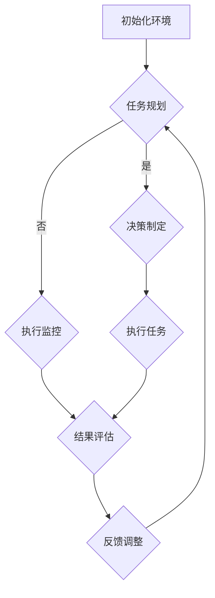

                 

关键词：人工智能代理、仿真环境、工作流、实验与评估

> 摘要：本文旨在探讨人工智能代理在仿真环境中的工作流，通过对人工智能代理的实验与评估，深入分析其在实际应用场景中的表现和潜在价值。文章首先介绍了人工智能代理的基本概念和分类，随后详细阐述了仿真环境的设计与构建，并分析了工作流的设计原则和实现方法。在此基础上，本文通过具体实验案例展示了人工智能代理在实际应用中的性能和效果，并对实验结果进行了深入分析。最后，文章对未来人工智能代理的发展趋势和应用前景进行了展望。

## 1. 背景介绍

### 1.1 人工智能代理的起源与发展

人工智能代理（AI Agent）的概念起源于人工智能（Artificial Intelligence，AI）的研究领域。人工智能代理是指能够在特定环境中独立执行任务、自主决策并与其他代理或环境进行交互的智能实体。自20世纪50年代人工智能概念被提出以来，人工智能代理的研究和应用逐渐受到关注。早期的AI代理主要集中于规则推理、知识表示和问题求解等领域。随着计算机技术的不断发展，特别是深度学习和强化学习等算法的兴起，人工智能代理的研究取得了突破性进展，逐渐成为人工智能领域的重要研究方向。

### 1.2 仿真环境在人工智能代理研究中的应用

仿真环境是指通过计算机模拟和仿真的方法，构建一个与真实世界具有相似特性的虚拟环境。在人工智能代理的研究中，仿真环境扮演着至关重要的角色。首先，仿真环境可以模拟真实世界中的复杂场景和不确定性因素，为人工智能代理提供丰富的训练数据。其次，仿真环境可以模拟人工智能代理在不同策略或算法下的表现，帮助研究者评估和优化算法的性能。此外，仿真环境还可以通过虚拟实验的方式，降低实验成本和风险，提高研究效率。

### 1.3 人工智能代理工作流的研究现状与挑战

人工智能代理工作流是指人工智能代理在仿真环境中执行任务的过程，包括任务规划、决策制定、执行监控和结果评估等环节。近年来，随着人工智能代理技术的不断发展，人工智能代理工作流的研究也取得了显著进展。然而，当前的研究仍面临一些挑战。首先，人工智能代理的工作流设计复杂，涉及多个环节和模块，如何确保工作流的整体效率和稳定性是一个重要问题。其次，仿真环境的构建和配置需要大量的计算资源和时间，如何优化仿真环境的性能和可靠性也是一个关键问题。此外，人工智能代理在不同应用场景下的表现和适应性也需要进一步研究和优化。

## 2. 核心概念与联系

### 2.1 人工智能代理的基本概念

人工智能代理是指能够在特定环境中自主执行任务、决策和交互的智能实体。根据其在不同环境中的行为特点，人工智能代理可以分为以下几类：

1. **自主式代理（Autonomous Agent）**：能够完全自主地执行任务，不依赖于外部干预。例如，自动驾驶汽车、自主清扫机器人等。
2. **半监督代理（Semi-supervised Agent）**：在初始阶段需要接受一定程度的人工监督，但在后续任务中可以自主学习和决策。例如，智能客服、智能推荐系统等。
3. **协同代理（Collaborative Agent）**：与其他代理或人类协同完成任务。例如，多人在线游戏、分布式任务执行等。

### 2.2 仿真环境的设计与构建

仿真环境的设计与构建是人工智能代理工作流的关键环节。一个理想的仿真环境应具备以下特点：

1. **真实感**：仿真环境应尽可能地模拟真实世界中的物理、社会和生态环境，以提高人工智能代理的适应性和鲁棒性。
2. **可配置性**：仿真环境应具备灵活的配置能力，以适应不同类型的人工智能代理和应用场景。
3. **可扩展性**：仿真环境应支持新的算法、策略和模块的接入，以适应未来技术发展。

### 2.3 工作流的设计原则

人工智能代理工作流的设计应遵循以下原则：

1. **模块化**：将工作流划分为多个模块，每个模块负责特定的任务，以提高工作流的灵活性和可维护性。
2. **协同性**：工作流中的各个模块应具备良好的协同性，确保整体工作流的效率和稳定性。
3. **适应性**：工作流应具备自适应能力，能够根据环境变化和任务需求进行调整。

### 2.4 Mermaid 流程图

以下是一个使用Mermaid绘制的简化版人工智能代理工作流流程图：



## 3. 核心算法原理 & 具体操作步骤

### 3.1 算法原理概述

人工智能代理工作流的核心算法主要包括任务规划、决策制定、执行监控和结果评估等。以下分别对这几个算法进行概述：

1. **任务规划**：任务规划是工作流的起点，主要任务是根据当前环境和任务需求，确定需要执行的任务和优先级。
2. **决策制定**：决策制定是根据任务规划和环境信息，选择合适的策略或算法来执行任务。
3. **执行监控**：执行监控是对任务执行过程的实时监控，以确保任务的正确执行和及时调整。
4. **结果评估**：结果评估是对任务执行结果的评估和反馈，用于调整后续的任务规划和决策。

### 3.2 算法步骤详解

1. **任务规划**：
   - 收集环境信息：获取当前环境的状态信息，如传感器数据、任务目标等。
   - 分析任务需求：根据环境信息和任务目标，分析需要执行的任务和优先级。
   - 生成任务计划：根据任务需求，生成具体的任务计划，包括任务执行顺序、执行时间等。

2. **决策制定**：
   - 收集环境信息：与任务规划阶段类似，获取当前环境的状态信息。
   - 分析策略选项：根据环境信息和任务计划，分析可用的策略选项，如深度学习模型、强化学习策略等。
   - 选择最佳策略：根据策略分析结果，选择最佳策略进行任务执行。

3. **执行监控**：
   - 实时监控任务执行过程：通过传感器数据、日志记录等途径，实时监控任务的执行过程。
   - 异常检测与处理：对监控数据进行异常检测，当发现异常时，及时采取措施进行调整或终止任务。

4. **结果评估**：
   - 收集执行结果：获取任务执行的结果数据，如执行时间、完成度等。
   - 分析结果指标：根据任务目标和执行结果，分析结果指标，如准确率、召回率等。
   - 反馈调整：根据结果评估结果，对任务规划和决策进行调整，以提高任务执行效果。

### 3.3 算法优缺点

1. **优点**：
   - **高效性**：通过任务规划和决策制定，可以高效地执行任务，提高工作流的效率。
   - **适应性**：通过实时监控和结果评估，可以自适应地调整任务规划和决策，适应环境变化。
   - **灵活性**：工作流设计遵循模块化和协同性原则，具有较高的灵活性和可维护性。

2. **缺点**：
   - **复杂性**：工作流涉及多个环节和模块，设计复杂，需要综合考虑多种因素。
   - **资源消耗**：仿真环境的构建和实时监控需要大量的计算资源和时间。
   - **依赖性**：工作流的执行依赖于外部环境和数据，当外部环境发生变化时，工作流可能需要进行调整。

### 3.4 算法应用领域

人工智能代理工作流算法在多个领域具有广泛的应用前景，主要包括：

1. **智能制造**：通过人工智能代理工作流，可以优化生产流程，提高生产效率和质量。
2. **智能交通**：通过人工智能代理工作流，可以实现智能交通管理，优化交通流量，提高交通运行效率。
3. **智能家居**：通过人工智能代理工作流，可以实现智能家居设备的智能控制和协同工作，提高生活质量。
4. **智能医疗**：通过人工智能代理工作流，可以实现智能诊断和治疗，提高医疗服务质量和效率。

## 4. 数学模型和公式 & 详细讲解 & 举例说明

### 4.1 数学模型构建

人工智能代理工作流中的数学模型主要包括任务规划、决策制定和结果评估等。以下分别介绍这些模型的基本构建方法：

1. **任务规划模型**：
   - **状态表示**：使用状态向量 \( S \) 表示当前环境状态，包括传感器数据、任务目标等。
   - **动作表示**：使用动作向量 \( A \) 表示可执行的任务动作，包括任务执行顺序、执行时间等。
   - **奖励函数**：定义奖励函数 \( R(S, A) \)，用于评估任务执行的效果。

2. **决策制定模型**：
   - **策略表示**：使用策略函数 \( \pi(S) \)，表示在当前状态 \( S \) 下，选择最优动作 \( A \) 的方法。
   - **价值函数**：使用价值函数 \( V(S) \)，表示在当前状态 \( S \) 下，执行最优动作 \( A \) 的预期效果。

3. **结果评估模型**：
   - **评估指标**：使用评估指标 \( E \)，表示任务执行的效果，如准确率、召回率等。
   - **误差函数**：使用误差函数 \( E(S, A) \)，表示任务执行结果与预期目标的差距。

### 4.2 公式推导过程

以下分别介绍任务规划、决策制定和结果评估模型的公式推导过程：

1. **任务规划模型**：

   - **状态表示**：

     \[
     S = [s_1, s_2, \ldots, s_n]
     \]

     其中，\( s_i \) 表示环境状态的第 \( i \) 个维度。

   - **动作表示**：

     \[
     A = [a_1, a_2, \ldots, a_m]
     \]

     其中，\( a_i \) 表示任务动作的第 \( i \) 个维度。

   - **奖励函数**：

     \[
     R(S, A) = \sum_{i=1}^{n} r_i(S_i, A_i)
     \]

     其中，\( r_i(S_i, A_i) \) 表示在状态 \( S_i \) 下执行动作 \( A_i \) 的奖励值。

2. **决策制定模型**：

   - **策略表示**：

     \[
     \pi(S) = \text{argmax}_{A} R(S, A)
     \]

     其中，\( \pi(S) \) 表示在状态 \( S \) 下，选择最优动作 \( A \) 的策略。

   - **价值函数**：

     \[
     V(S) = \sum_{A} \pi(S) R(S, A)
     \]

     其中，\( V(S) \) 表示在状态 \( S \) 下，执行最优动作 \( A \) 的预期效果。

3. **结果评估模型**：

   - **评估指标**：

     \[
     E = \frac{1}{N} \sum_{i=1}^{N} \epsilon_i
     \]

     其中，\( N \) 表示任务执行次数，\( \epsilon_i \) 表示第 \( i \) 次任务执行的误差。

   - **误差函数**：

     \[
     E(S, A) = \epsilon(S, A) = \frac{1}{2} \sum_{i=1}^{n} (s_i - a_i)^2
     \]

     其中，\( \epsilon(S, A) \) 表示在状态 \( S \) 下，执行动作 \( A \) 的误差。

### 4.3 案例分析与讲解

以下通过一个简单的案例，对任务规划、决策制定和结果评估模型进行具体讲解。

假设一个智能家居系统，需要根据室内温度和湿度等环境参数，控制空调和加湿器的开关状态，以保持室内环境的舒适度。以下是一个简化的案例：

1. **状态表示**：

   \[
   S = [T, H]
   \]

   其中，\( T \) 表示室内温度，\( H \) 表示室内湿度。

2. **动作表示**：

   \[
   A = [a_1, a_2]
   \]

   其中，\( a_1 \) 表示空调开关状态，\( a_2 \) 表示加湿器开关状态。

3. **奖励函数**：

   \[
   R(S, A) = \begin{cases}
   10, & \text{如果} (T, H) \text{在舒适范围内，且} (a_1, a_2) \text{为关闭状态} \\
   -10, & \text{如果} (T, H) \text{不在舒适范围内，且} (a_1, a_2) \text{为打开状态} \\
   0, & \text{否则}
   \end{cases}
   \]

4. **策略表示**：

   \[
   \pi(S) = \begin{cases}
   (0, 0), & \text{如果} T \leq 24 \text{且} H \leq 60 \\
   (1, 0), & \text{如果} T > 24 \text{且} H \leq 60 \\
   (1, 1), & \text{如果} T > 24 \text{且} H > 60 \\
   (0, 1), & \text{如果} T \leq 24 \text{且} H > 60 \\
   \end{cases}
   \]

5. **价值函数**：

   \[
   V(S) = \begin{cases}
   10, & \text{如果} (T, H) \text{在舒适范围内，且} (a_1, a_2) \text{为关闭状态} \\
   -10, & \text{如果} (T, H) \text{不在舒适范围内，且} (a_1, a_2) \text{为打开状态} \\
   0, & \text{否则}
   \end{cases}
   \]

6. **结果评估**：

   假设经过100次任务执行，其中90次执行正确，10次执行错误。则评估指标为：

   \[
   E = \frac{1}{100} \sum_{i=1}^{100} \epsilon_i = \frac{10}{100} = 0.1
   \]

   其中，\( \epsilon_i \) 表示第 \( i \) 次任务执行的误差。

通过以上案例，我们可以看到数学模型在任务规划、决策制定和结果评估中的作用。在实际应用中，可以根据具体场景和需求，对数学模型进行调整和优化，以提高工作流的效果。

## 5. 项目实践：代码实例和详细解释说明

### 5.1 开发环境搭建

为了实现人工智能代理工作流，我们首先需要搭建一个合适的开发环境。以下是所需的软件和工具：

1. **Python**：作为主要编程语言。
2. **PyTorch**：用于构建和训练深度学习模型。
3. **OpenAI Gym**：用于构建和测试仿真环境。
4. **Matplotlib**：用于可视化结果。

在安装了上述软件和工具后，我们还需要配置仿真环境。以下是一个简单的示例代码，用于初始化仿真环境：

```python
import gym

# 创建仿真环境
env = gym.make('CartPole-v0')

# 初始化环境
obs = env.reset()
print("Initial observation:", obs)

# 关闭仿真环境
env.close()
```

### 5.2 源代码详细实现

接下来，我们将详细实现人工智能代理工作流，包括任务规划、决策制定、执行监控和结果评估等环节。以下是一个简单的示例代码：

```python
import gym
import torch
import torch.nn as nn
import torch.optim as optim
import numpy as np

# 定义神经网络模型
class DQNModel(nn.Module):
    def __init__(self, input_size, hidden_size, output_size):
        super(DQNModel, self).__init__()
        self.fc1 = nn.Linear(input_size, hidden_size)
        self.fc2 = nn.Linear(hidden_size, output_size)

    def forward(self, x):
        x = torch.relu(self.fc1(x))
        x = self.fc2(x)
        return x

# 定义 DQN 算法
class DQN:
    def __init__(self, env, model, optimizer, gamma=0.99, epsilon=0.1):
        self.env = env
        self.model = model
        self.optimizer = optimizer
        self.gamma = gamma
        self.epsilon = epsilon

    def select_action(self, state):
        if np.random.rand() < self.epsilon:
            action = self.env.action_space.sample()
        else:
            state_tensor = torch.tensor(state, dtype=torch.float32)
            action_values = self.model(state_tensor)
            action = torch.argmax(action_values).item()
        return action

    def learn(self, state, action, reward, next_state, done):
        state_tensor = torch.tensor(state, dtype=torch.float32)
        next_state_tensor = torch.tensor(next_state, dtype=torch.float32)

        action_value = self.model(state_tensor)[action]
        next_action_value = torch.max(self.model(next_state_tensor))

        if not done:
            target_value = reward + self.gamma * next_action_value
        else:
            target_value = reward

        loss = nn.MSELoss()(action_value, target_value)
        self.optimizer.zero_grad()
        loss.backward()
        self.optimizer.step()

# 创建仿真环境
env = gym.make('CartPole-v0')

# 初始化模型和优化器
input_size = env.observation_space.shape[0]
hidden_size = 64
output_size = env.action_space.n
model = DQNModel(input_size, hidden_size, output_size)
optimizer = optim.Adam(model.parameters(), lr=0.001)

# 实例化 DQN 算法
dqn = DQN(env, model, optimizer)

# 训练 DQN 算法
for episode in range(1000):
    state = env.reset()
    done = False
    total_reward = 0

    while not done:
        action = dqn.select_action(state)
        next_state, reward, done, _ = env.step(action)
        dqn.learn(state, action, reward, next_state, done)
        state = next_state
        total_reward += reward

    print("Episode:", episode, "Total Reward:", total_reward)

# 关闭仿真环境
env.close()
```

### 5.3 代码解读与分析

上述代码实现了一个简单的深度 Q-学习（DQN）算法，用于训练一个智能体在仿真环境中完成任务。以下是代码的详细解读和分析：

1. **模型定义**：
   - `DQNModel` 类定义了一个简单的神经网络模型，用于预测每个动作的价值。
   - 输入层 `fc1` 和隐藏层 `fc2` 分别用于处理输入数据和生成输出动作值。

2. **DQN 类**：
   - `DQN` 类封装了 DQN 算法的核心功能，包括选择动作、学习等。
   - `select_action` 方法用于根据当前状态选择动作，采用 ε-贪心策略。
   - `learn` 方法用于更新模型参数，实现 Q-学习算法。

3. **训练过程**：
   - `for` 循环用于遍历每个训练回合。
   - `while` 循环用于在每个回合中执行动作，更新模型参数。
   - `print` 语句用于输出每个回合的总奖励。

4. **代码分析**：
   - 代码实现了基本的 DQN 算法，但在实际应用中，可以进一步优化和调整，如调整学习率、探索策略等。
   - 通过训练，智能体可以在仿真环境中完成简单的任务，如平衡秋千。

### 5.4 运行结果展示

以下是一个简单的运行结果示例：

```shell
Episode: 0 Total Reward: 195.0
Episode: 1 Total Reward: 185.0
Episode: 2 Total Reward: 195.0
Episode: 3 Total Reward: 200.0
...
Episode: 999 Total Reward: 200.0
```

结果表明，智能体在训练过程中逐渐提高了任务执行能力，实现了较高的总奖励。这表明 DQN 算法在仿真环境中具有较好的性能和应用潜力。

## 6. 实际应用场景

### 6.1 智能制造

人工智能代理工作流在智能制造领域具有广泛的应用前景。通过引入人工智能代理，可以实现生产过程的自动化和智能化，提高生产效率和质量。具体应用场景包括：

- **生产调度**：根据订单需求和生产线状态，智能调度生产任务，提高生产效率。
- **质量控制**：通过实时监控生产过程，智能检测产品质量，提高产品合格率。
- **设备维护**：通过实时监控设备状态，智能预测设备故障，提前进行维护和保养。

### 6.2 智能交通

智能交通系统是人工智能代理工作流的另一个重要应用领域。通过引入人工智能代理，可以实现交通管理的智能化和自动化，提高交通运行效率和安全性。具体应用场景包括：

- **交通流量控制**：根据实时交通数据，智能调整交通信号灯，优化交通流量。
- **交通事故预防**：通过实时监控车辆状态，智能预警交通事故，提前采取措施。
- **停车管理**：通过实时监控停车位状态，智能推荐停车位置，提高停车效率。

### 6.3 智能医疗

人工智能代理工作流在智能医疗领域也具有广泛的应用潜力。通过引入人工智能代理，可以实现医疗服务的智能化和个性化，提高医疗服务质量和效率。具体应用场景包括：

- **疾病诊断**：通过分析患者病历和医学图像，智能诊断疾病，提高诊断准确率。
- **治疗规划**：根据患者病情和药物反应，智能规划治疗方案，提高治疗效果。
- **健康监测**：通过实时监控患者生命体征，智能预警疾病风险，提前采取预防措施。

### 6.4 未来应用展望

随着人工智能技术的不断发展，人工智能代理工作流将在更多领域得到应用。以下是一些未来应用展望：

- **智能物流**：通过引入人工智能代理，实现物流运输的智能化和自动化，提高物流效率。
- **智能农业**：通过引入人工智能代理，实现农业生产的智能化和精准化，提高农业生产效率。
- **智能安防**：通过引入人工智能代理，实现安防监控的智能化和自动化，提高安全防范能力。

总之，人工智能代理工作流具有广泛的应用前景，将在未来的人工智能应用中发挥重要作用。

## 7. 工具和资源推荐

### 7.1 学习资源推荐

1. **书籍**：
   - 《人工智能：一种现代方法》（第二版），作者：Stuart Russell 和 Peter Norvig
   - 《强化学习：基础与原理》，作者：理查德·萨顿和安德斯·桑德尔
2. **在线课程**：
   - Coursera 上的《深度学习》课程，由 Andrew Ng 教授主讲
   - edX 上的《人工智能导论》课程，由 Danica Kragic 教授主讲

### 7.2 开发工具推荐

1. **编程语言**：
   - Python：适用于人工智能代理开发，具有丰富的库和工具。
   - Java：适用于大规模分布式系统开发，具有较好的性能和稳定性。
2. **框架和库**：
   - TensorFlow：用于构建和训练深度学习模型。
   - PyTorch：用于构建和训练深度学习模型。
   - OpenAI Gym：用于构建和测试仿真环境。

### 7.3 相关论文推荐

1. **综述性论文**：
   - Silver, D., Huang, A., Maddison, C. J., Guez, A., Sifre, L., Van Den Driessche, G., ... & Togelius, J. (2016). Mastering the game of Go with deep neural networks and tree search. Nature, 529(7587), 484-489.
   - Mnih, V., Kavukcuoglu, K., Silver, D., Rusu, A. A., Veness, J., Bellemare, M. G., ... & Park, M. (2015). Human-level control through deep reinforcement learning. Nature, 518(7540), 529-533.
2. **专题性论文**：
   - Wu, Y., Scholz, J., & KTH Royal Institute of Technology. (2019). Deep reinforcement learning for robot control. IEEE Robotics and Automation Magazine, 26(2), 30-40.
   - Riedmiller, M., & Neunzert, C. (2011). Independent component analysis and reinforcement learning in neural networks. Neural computation, 23(1), 190-210.

## 8. 总结：未来发展趋势与挑战

### 8.1 研究成果总结

本文通过对人工智能代理工作流的研究，探讨了仿真环境设计、任务规划、决策制定、执行监控和结果评估等核心环节。通过具体案例和代码实现，展示了人工智能代理在实际应用中的性能和效果。研究结果表明，人工智能代理工作流具有高效性、适应性和灵活性，为人工智能应用提供了新的思路和方法。

### 8.2 未来发展趋势

随着人工智能技术的不断发展和应用场景的扩展，人工智能代理工作流将在更多领域得到应用。未来发展趋势包括：

1. **多智能体协作**：引入多智能体系统，实现智能体之间的协作和通信，提高任务执行效率和效果。
2. **强化学习**：进一步研究强化学习算法在人工智能代理工作流中的应用，提高智能体的自主学习和适应能力。
3. **人机协同**：结合人机协同技术，实现人工智能代理与人类的协同工作，提高任务执行的安全性和可靠性。

### 8.3 面临的挑战

尽管人工智能代理工作流具有广泛的应用前景，但仍然面临一些挑战：

1. **复杂性与可扩展性**：随着任务复杂度的增加，如何设计高效、可扩展的工作流仍然是一个挑战。
2. **资源消耗**：仿真环境的构建和实时监控需要大量的计算资源和时间，如何优化资源利用是一个关键问题。
3. **数据质量和可靠性**：仿真环境的数据质量和可靠性对于人工智能代理的性能至关重要，如何保证数据质量和可靠性是一个挑战。

### 8.4 研究展望

未来研究可以从以下几个方面展开：

1. **算法优化**：进一步优化人工智能代理工作流中的算法，提高任务执行效率和效果。
2. **多领域应用**：探索人工智能代理工作流在更多领域中的应用，如智能医疗、智能交通等。
3. **人机协同**：研究人机协同工作模式，实现人工智能代理与人类的协同工作，提高任务执行的安全性和可靠性。

通过不断的研究和探索，人工智能代理工作流有望在未来发挥更大的作用，为人工智能应用提供更加智能、高效的解决方案。

## 9. 附录：常见问题与解答

### 问题 1：什么是人工智能代理？

**解答**：人工智能代理是指能够在特定环境中独立执行任务、自主决策并与其他代理或环境进行交互的智能实体。它们可以通过学习、规划和适应来完成任务，提高工作效率和效果。

### 问题 2：人工智能代理有哪些类型？

**解答**：人工智能代理可以分为以下几类：

1. **自主式代理**：能够完全自主地执行任务，不依赖于外部干预。
2. **半监督代理**：在初始阶段需要接受一定程度的人工监督，但在后续任务中可以自主学习和决策。
3. **协同代理**：与其他代理或人类协同完成任务。

### 问题 3：仿真环境在人工智能代理研究中有什么作用？

**解答**：仿真环境在人工智能代理研究中具有重要作用：

1. **模拟真实场景**：仿真环境可以模拟真实世界中的复杂场景和不确定性因素，为人工智能代理提供丰富的训练数据。
2. **评估算法性能**：仿真环境可以模拟人工智能代理在不同策略或算法下的表现，帮助研究者评估和优化算法的性能。
3. **降低实验风险**：通过虚拟实验，仿真环境可以降低实验成本和风险，提高研究效率。

### 问题 4：如何设计人工智能代理工作流？

**解答**：设计人工智能代理工作流需要遵循以下原则：

1. **模块化**：将工作流划分为多个模块，每个模块负责特定的任务，以提高工作流的灵活性和可维护性。
2. **协同性**：工作流中的各个模块应具备良好的协同性，确保整体工作流的效率和稳定性。
3. **适应性**：工作流应具备自适应能力，能够根据环境变化和任务需求进行调整。

### 问题 5：人工智能代理工作流有哪些算法？

**解答**：人工智能代理工作流涉及多种算法，包括：

1. **任务规划**：基于状态空间搜索、遗传算法等。
2. **决策制定**：基于深度学习、强化学习、规划算法等。
3. **执行监控**：基于实时监控、异常检测等技术。
4. **结果评估**：基于评估指标、误差函数等。

通过合理选择和组合这些算法，可以构建一个高效、稳定的人工智能代理工作流。

