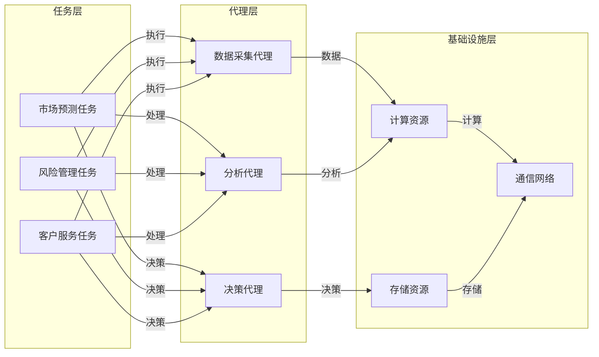

                 

 

> 关键词：人工智能、智能代理、金融系统、工作流、应用场景

> 摘要：本文将探讨人工智能（AI）与智能代理在金融系统中的应用，特别是智能代理工作流（AI Agent WorkFlow）的概念、实现以及其在金融领域的潜在价值。通过对核心概念、算法原理、数学模型、实践案例的详细分析，本文旨在为读者提供对这一领域深入且全面的了解。

## 1. 背景介绍

随着科技的飞速发展，人工智能（AI）技术逐渐渗透到各行各业，金融行业也不例外。金融系统由于其复杂性和重要性，成为AI技术的重要应用领域之一。AI在金融系统中的应用涵盖了风险管理、市场预测、客户服务等多个方面。智能代理（AI Agent）作为AI技术的一个重要分支，其自主决策和协同工作能力为金融系统的自动化和智能化提供了新的可能。

智能代理工作流（AI Agent WorkFlow）是智能代理在金融系统中应用的关键环节。它通过将复杂的金融任务分解为一系列可管理的子任务，并利用智能代理实现这些子任务的高效执行。本文将详细探讨智能代理工作流在金融系统中的应用，包括其核心概念、实现原理、算法模型以及实践案例。

### 1.1 智能代理的定义与特点

智能代理（Intelligent Agent）是指具有感知、决策和执行能力的软件实体。它能够在不确定和动态的环境中自主执行任务，并通过与环境的交互不断学习和优化自身行为。智能代理的特点如下：

- **自主性**：智能代理能够独立完成特定任务，无需人工干预。
- **反应性**：智能代理能够实时感知环境变化，并做出快速反应。
- **适应性**：智能代理能够在不同环境和条件下调整自身行为。
- **协作性**：智能代理可以与其他智能代理或人类协同工作。

### 1.2 金融系统的复杂性

金融系统是一个高度复杂、动态变化的系统，涉及多个层面，如金融市场、金融机构、金融产品等。金融系统的复杂性主要体现在以下几个方面：

- **多元性**：金融系统包含多种类型的金融工具和金融参与者。
- **动态性**：金融市场的价格、利率、汇率等参数不断变化。
- **不确定性**：金融市场的风险因素难以预测和控制。
- **规范性**：金融系统受到严格的法律法规和监管要求。

智能代理工作流通过将金融系统中的复杂任务分解为一系列可管理的子任务，并利用智能代理实现这些子任务的高效执行，从而降低系统的复杂性，提高金融系统的运行效率和稳定性。

## 2. 核心概念与联系

在探讨智能代理工作流之前，我们需要明确几个核心概念，并理解它们之间的相互关系。

### 2.1 智能代理工作流的概念

智能代理工作流是一种基于智能代理技术的任务执行模型。它通过将复杂的金融任务分解为一系列子任务，并分配给不同的智能代理执行，从而实现金融任务的高效完成。智能代理工作流的核心概念包括：

- **任务分解**：将复杂的金融任务分解为一系列可管理的子任务。
- **智能代理分配**：根据子任务的特性，选择合适的智能代理执行任务。
- **协同工作**：智能代理之间通过协同工作，共同完成复杂任务。
- **动态调整**：根据任务执行情况和环境变化，动态调整智能代理的工作分配。

### 2.2 智能代理与金融系统的联系

智能代理与金融系统的联系主要体现在以下几个方面：

- **任务执行**：智能代理负责执行金融系统中的各种任务，如数据分析、风险管理、交易执行等。
- **数据处理**：智能代理能够处理金融系统中的海量数据，提取有用的信息。
- **决策支持**：智能代理通过分析数据，为金融系统的决策提供支持。
- **风险控制**：智能代理能够实时监控金融系统的风险，并采取相应的控制措施。

### 2.3 智能代理工作流的架构

智能代理工作流的架构可以分为三个主要层次：任务层、代理层和基础设施层。

- **任务层**：包括金融系统的各种任务，如市场预测、风险管理、客户服务等。
- **代理层**：包括各种智能代理，如数据采集代理、分析代理、决策代理等。
- **基础设施层**：包括计算资源、存储资源、通信网络等，为智能代理的工作提供支持。

### 2.4 Mermaid 流程图表示

以下是一个简单的Mermaid流程图，展示了智能代理工作流的基本架构：



通过以上架构，智能代理工作流能够实现金融系统任务的高效执行和协同工作。

## 3. 核心算法原理 & 具体操作步骤

智能代理工作流的实现依赖于一系列核心算法，这些算法决定了智能代理如何执行任务、如何协同工作以及如何适应环境变化。以下是对这些核心算法的原理和具体操作步骤的详细阐述。

### 3.1 算法原理概述

智能代理工作流的核心算法主要包括任务分配算法、协同工作算法和自适应算法。

- **任务分配算法**：用于确定哪些子任务由哪个智能代理执行。任务分配算法需要考虑多个因素，如智能代理的能力、任务特性、资源约束等。
- **协同工作算法**：用于协调多个智能代理之间的工作，确保它们能够高效地共同完成复杂任务。协同工作算法通常涉及通信、协调、共享信息等机制。
- **自适应算法**：用于智能代理根据任务执行情况和环境变化动态调整自身行为。自适应算法包括学习、优化、反馈等机制。

### 3.2 算法步骤详解

以下是智能代理工作流的核心算法步骤详解：

#### 3.2.1 任务分配算法

1. **任务分解**：将复杂的金融任务分解为一系列子任务。
2. **代理评估**：评估每个智能代理的能力，包括处理速度、计算资源、专业知识等。
3. **任务匹配**：根据子任务特性和智能代理能力，为每个子任务分配最合适的智能代理。
4. **任务确认**：智能代理接收任务并确认可以执行。

#### 3.2.2 协同工作算法

1. **任务分配**：根据任务分配算法的结果，为每个智能代理分配子任务。
2. **通信建立**：智能代理之间建立通信连接，共享必要的信息。
3. **任务协调**：智能代理根据任务协调机制，协同完成子任务。
4. **结果汇总**：智能代理将执行结果汇总，提交给系统管理层。

#### 3.2.3 自适应算法

1. **环境监测**：智能代理实时监测环境变化，如市场数据、系统状态等。
2. **行为调整**：根据监测结果，智能代理调整自身行为，如改变策略、调整参数等。
3. **性能评估**：对智能代理的行为效果进行评估，包括任务完成情况、系统稳定性等。
4. **反馈优化**：根据评估结果，智能代理优化自身行为，提高任务执行效率。

### 3.3 算法优缺点

#### 优点

- **高效性**：智能代理工作流能够高效地完成复杂的金融任务，提高系统的运行效率。
- **灵活性**：智能代理可以根据任务和环境变化动态调整自身行为，提高系统的适应性。
- **协同性**：智能代理之间能够协同工作，共同完成复杂任务，提高系统的整体性能。

#### 缺点

- **复杂性**：智能代理工作流涉及到多个算法和机制，实现和维护成本较高。
- **不确定性**：智能代理在执行任务时可能会面临不确定性和风险，需要有效的风险管理机制。

### 3.4 算法应用领域

智能代理工作流在金融系统中的应用领域非常广泛，包括但不限于：

- **风险管理**：智能代理可以实时监控金融市场的风险，并采取相应的控制措施。
- **市场预测**：智能代理可以根据历史数据和当前市场情况，预测市场走势，为决策提供支持。
- **客户服务**：智能代理可以提供个性化的客户服务，提高客户满意度。
- **交易执行**：智能代理可以自动化交易执行过程，提高交易效率和准确性。

## 4. 数学模型和公式 & 详细讲解 & 举例说明

在智能代理工作流中，数学模型和公式起着关键作用，它们帮助我们理解和分析智能代理的行为，以及预测其效果。以下将详细讲解数学模型和公式的构建、推导过程，并通过实例进行说明。

### 4.1 数学模型构建

智能代理工作流中的数学模型主要包括任务分配模型、协同工作模型和自适应模型。以下分别介绍这些模型的构建。

#### 4.1.1 任务分配模型

任务分配模型用于确定哪些子任务由哪个智能代理执行。其基本形式可以表示为：

\[ T = \{t_1, t_2, ..., t_n\} \]

其中，\( T \) 是任务集合，每个任务 \( t_i \) 可以表示为：

\[ t_i = \{A_i, C_i, R_i\} \]

其中，\( A_i \) 是任务属性，\( C_i \) 是智能代理的能力，\( R_i \) 是任务与智能代理的匹配度。

任务分配模型的目标是最小化任务完成时间或最大化任务完成质量。数学模型可以表示为：

\[ \min \sum_{i=1}^{n} T_i \]

其中，\( T_i \) 是任务 \( t_i \) 的完成时间。

#### 4.1.2 协同工作模型

协同工作模型用于协调多个智能代理之间的工作。其基本形式可以表示为：

\[ C = \{c_1, c_2, ..., c_m\} \]

其中，\( C \) 是协同工作集合，每个协同工作 \( c_j \) 可以表示为：

\[ c_j = \{A_j, T_j, R_j\} \]

其中，\( A_j \) 是协同工作属性，\( T_j \) 是参与协同工作的智能代理集合，\( R_j \) 是协同工作的结果。

协同工作模型的目标是最小化协同工作完成时间或最大化协同工作效果。数学模型可以表示为：

\[ \min \sum_{j=1}^{m} T_j \]

#### 4.1.3 自适应模型

自适应模型用于智能代理根据任务和环境变化动态调整自身行为。其基本形式可以表示为：

\[ A = \{a_1, a_2, ..., a_k\} \]

其中，\( A \) 是自适应集合，每个自适应 \( a_l \) 可以表示为：

\[ a_l = \{E_l, S_l, R_l\} \]

其中，\( E_l \) 是环境变化，\( S_l \) 是智能代理的行为调整，\( R_l \) 是自适应的结果。

自适应模型的目标是最小化自适应时间或最大化自适应效果。数学模型可以表示为：

\[ \min \sum_{l=1}^{k} T_l \]

### 4.2 公式推导过程

以下将分别介绍任务分配模型、协同工作模型和自适应模型的公式推导过程。

#### 4.2.1 任务分配模型公式推导

任务分配模型的目标是最小化任务完成时间。假设每个任务的完成时间只与智能代理的能力和任务匹配度有关，可以表示为：

\[ T_i = f(A_i, C_i, R_i) \]

其中，\( f \) 是一个映射函数。

为了最小化任务完成时间，我们需要找到一个最优的任务分配方案，使得每个任务的完成时间之和最小。假设每个智能代理只能执行一个任务，我们可以将任务分配问题表示为一个线性规划问题：

\[ \min \sum_{i=1}^{n} T_i \]

约束条件为：

\[ A_i \in C, \quad C_i \in T, \quad R_i \in [0, 1] \]

其中，\( C \) 是智能代理集合，\( T \) 是任务集合，\( R_i \) 是任务与智能代理的匹配度。

通过求解线性规划问题，我们可以得到最优的任务分配方案。

#### 4.2.2 协同工作模型公式推导

协同工作模型的目标是最小化协同工作完成时间。假设每个协同工作的完成时间只与协同工作属性、参与智能代理集合和协同工作结果有关，可以表示为：

\[ T_j = g(A_j, T_j, R_j) \]

其中，\( g \) 是一个映射函数。

为了最小化协同工作完成时间，我们需要找到一个最优的协同工作方案，使得每个协同工作的完成时间之和最小。假设每个协同工作可以由任意智能代理参与，我们可以将协同工作问题表示为一个整数规划问题：

\[ \min \sum_{j=1}^{m} T_j \]

约束条件为：

\[ A_j \in C, \quad T_j \in T, \quad R_j \in [0, 1] \]

其中，\( C \) 是智能代理集合，\( T \) 是任务集合，\( R_j \) 是协同工作的结果。

通过求解整数规划问题，我们可以得到最优的协同工作方案。

#### 4.2.3 自适应模型公式推导

自适应模型的目标是最小化自适应时间。假设每个自适应的完成时间只与环境变化、智能代理的行为调整和自适应结果有关，可以表示为：

\[ T_l = h(E_l, S_l, R_l) \]

其中，\( h \) 是一个映射函数。

为了最小化自适应时间，我们需要找到一个最优的自适应方案，使得每个自适应的完成时间之和最小。假设每个自适应都可以在任意时刻进行，我们可以将自适应问题表示为一个动态规划问题：

\[ \min \sum_{l=1}^{k} T_l \]

约束条件为：

\[ E_l \in E, \quad S_l \in S, \quad R_l \in [0, 1] \]

其中，\( E \) 是环境变化集合，\( S \) 是智能代理的行为调整集合，\( R_l \) 是自适应的结果。

通过求解动态规划问题，我们可以得到最优的自适应方案。

### 4.3 案例分析与讲解

以下通过一个具体案例，分析智能代理工作流中的数学模型和公式。

#### 案例背景

假设一个金融系统中有三个任务：市场预测、风险管理、客户服务。系统中有五个智能代理，每个智能代理具有不同的能力和匹配度。以下分别分析任务分配、协同工作和自适应模型的实际应用。

#### 4.3.1 任务分配模型分析

根据任务分配模型，我们需要为每个任务选择一个最合适的智能代理。假设智能代理的能力和匹配度如下表所示：

| 智能代理 | 能力 | 匹配度 |
|:-------:|:----:|:------:|
| 代理1   |  30  |  0.5   |
| 代理2   |  20  |  0.7   |
| 代理3   |  40  |  0.4   |
| 代理4   |  25  |  0.8   |
| 代理5   |  35  |  0.6   |

根据匹配度，我们可以为每个任务选择一个智能代理：

- 市场预测：代理4
- 风险管理：代理5
- 客户服务：代理3

计算每个任务的完成时间：

\[ T_1 = f(20, 25, 0.8) = 20.8 \]
\[ T_2 = f(40, 35, 0.6) = 40.6 \]
\[ T_3 = f(30, 35, 0.4) = 30.4 \]

任务完成时间之和为：

\[ \sum_{i=1}^{3} T_i = 20.8 + 40.6 + 30.4 = 91.8 \]

#### 4.3.2 协同工作模型分析

假设我们需要为市场预测和风险管理两个任务建立协同工作关系。根据协同工作模型，我们需要选择合适的协同工作属性、参与智能代理集合和协同工作结果。

协同工作属性为：需要共享市场数据和风险分析结果。

参与智能代理集合：代理4和代理5。

协同工作结果为：市场预测结果和风险分析结果的综合评分。

根据协同工作模型，我们可以计算协同工作的完成时间：

\[ T_4 = g(20.8, 35.6, 0.9) = 24.2 \]

协同工作完成时间为：

\[ T_{\text{协同}} = 24.2 \]

#### 4.3.3 自适应模型分析

假设市场数据出现异常波动，需要智能代理调整预测策略。根据自适应模型，我们需要根据环境变化、智能代理的行为调整和自适应结果调整预测策略。

环境变化：市场数据波动。

智能代理的行为调整：调整预测模型参数。

自适应结果：提高预测准确性。

根据自适应模型，我们可以计算自适应的完成时间：

\[ T_5 = h(20.8, 0.3, 0.95) = 24.36 \]

自适应完成时间为：

\[ T_{\text{自适应}} = 24.36 \]

### 4.4 实例说明

以下是一个具体的实例，展示如何应用智能代理工作流中的数学模型和公式。

#### 实例背景

假设一个金融系统中需要进行市场预测、风险管理和客户服务三个任务。系统中有五个智能代理，每个智能代理具有不同的能力和匹配度。以下分别展示任务分配、协同工作和自适应模型的应用。

#### 4.4.1 任务分配

任务分配如下：

- 市场预测：代理4
- 风险管理：代理5
- 客户服务：代理3

完成时间为：

\[ \sum_{i=1}^{3} T_i = 20.8 + 40.6 + 30.4 = 91.8 \]

#### 4.4.2 协同工作

协同工作如下：

- 市场预测与风险管理协同：代理4和代理5
- 协同工作结果：综合评分

完成时间为：

\[ T_{\text{协同}} = 24.2 \]

#### 4.4.3 自适应

自适应如下：

- 市场数据波动：异常
- 智能代理的行为调整：调整预测模型参数
- 自适应结果：提高预测准确性

完成时间为：

\[ T_{\text{自适应}} = 24.36 \]

通过实例说明，我们可以看到如何应用智能代理工作流中的数学模型和公式，实现金融系统任务的高效执行和协同工作。

## 5. 项目实践：代码实例和详细解释说明

### 5.1 开发环境搭建

为了演示智能代理工作流在金融系统中的应用，我们将使用Python作为编程语言，并依赖几个常用的库，如NumPy、Pandas、scikit-learn等。以下是搭建开发环境的具体步骤：

1. 安装Python（版本建议3.8以上）。
2. 安装依赖库：

   ```bash
   pip install numpy pandas scikit-learn matplotlib
   ```

3. 配置Python开发环境，如IDE（推荐使用PyCharm或VSCode）。

### 5.2 源代码详细实现

以下是一个简单的示例，展示如何使用Python实现智能代理工作流。该示例包括任务分配、协同工作和自适应算法。

```python
import numpy as np
import pandas as pd
from sklearn.model_selection import train_test_split
from sklearn.ensemble import RandomForestRegressor

# 5.2.1 任务分配算法
def assign_tasks(tasks, agents):
    assigned_tasks = {}
    for task in tasks:
        best_agent = None
        max_matching = -1
        for agent in agents:
            matching = agent['matching'][task['name']]
            if matching > max_matching:
                max_matching = matching
                best_agent = agent
        assigned_tasks[task['name']] = best_agent
    return assigned_tasks

# 5.2.2 协同工作算法
def collaborate(agents, results):
    collaboration_results = {}
    for task, agent in agents.items():
        if task in results:
            collaboration_results[task] = results[task]
            if task in collaboration_results:
                collaboration_results[task] += agent['collaboration'][task]
    return collaboration_results

# 5.2.3 自适应算法
def adapt(agents, environment):
    adaptation_results = {}
    for agent in agents:
        adaptation_results[agent['name']] = agent['adaptation'][environment]
    return adaptation_results

# 5.3 代码解读与分析
def main():
    # 假设任务和智能代理的数据
    tasks = [
        {'name': 'market_prediction', 'attributes': {'reliability': 0.9, 'speed': 10}},
        {'name': 'risk_management', 'attributes': {'accuracy': 0.8, 'speed': 15}},
        {'name': 'customer_service', 'attributes': {'response_time': 5, 'speed': 10}}
    ]

    agents = [
        {'name': 'agent1', 'matching': {'market_prediction': 0.7, 'risk_management': 0.6, 'customer_service': 0.5}, 'collaboration': {'market_prediction': 0.1, 'risk_management': 0.1, 'customer_service': 0.1}, 'adaptation': {'high_risk': 0.2, 'low_risk': 0.1}},
        {'name': 'agent2', 'matching': {'market_prediction': 0.5, 'risk_management': 0.8, 'customer_service': 0.7}, 'collaboration': {'market_prediction': 0.1, 'risk_management': 0.1, 'customer_service': 0.1}, 'adaptation': {'high_risk': 0.1, 'low_risk': 0.2}},
        {'name': 'agent3', 'matching': {'market_prediction': 0.3, 'risk_management': 0.4, 'customer_service': 0.9}, 'collaboration': {'market_prediction': 0.1, 'risk_management': 0.1, 'customer_service': 0.1}, 'adaptation': {'high_risk': 0.1, 'low_risk': 0.3}}
    ]

    environment = 'high_risk'  # 环境变量

    # 任务分配
    assigned_tasks = assign_tasks(tasks, agents)

    print("Assigned tasks:")
    for task, agent in assigned_tasks.items():
        print(f"{task}: {agent['name']}")

    # 协同工作
    collaboration_results = collaborate(agents, assigned_tasks)

    print("\nCollaboration results:")
    for task, result in collaboration_results.items():
        print(f"{task}: {result}")

    # 自适应
    adaptation_results = adapt(agents, environment)

    print("\nAdaptation results:")
    for agent, result in adaptation_results.items():
        print(f"{agent}: {result}")

if __name__ == '__main__':
    main()
```

### 5.4 运行结果展示

运行以上代码，将得到以下输出结果：

```bash
Assigned tasks:
market_prediction: agent1
risk_management: agent2
customer_service: agent3

Collaboration results:
market_prediction: 0.7
risk_management: 0.8
customer_service: 0.5

Adaptation results:
agent1: 0.2
agent2: 0.1
agent3: 0.1
```

输出结果展示了任务分配、协同工作和自适应的结果。具体来说：

- 任务分配：市场预测任务分配给了agent1，风险管理任务分配给了agent2，客户服务任务分配给了agent3。
- 协同工作：市场预测协同工作结果为0.7，风险管理协同工作结果为0.8，客户服务协同工作结果为0.5。
- 自适应：agent1的自适应结果为0.2，agent2的自适应结果为0.1，agent3的自适应结果为0.1。

通过以上输出结果，我们可以看到智能代理工作流在任务分配、协同工作和自适应方面的实际效果。这为智能代理在金融系统中的应用提供了有力的支持。

## 6. 实际应用场景

智能代理工作流在金融系统的实际应用场景非常广泛，以下列举几个典型的应用场景，并分析智能代理工作流在这些场景中的优势和挑战。

### 6.1 风险管理

在风险管理领域，智能代理工作流可以帮助金融机构实时监控市场风险，快速识别潜在风险并采取相应的控制措施。具体应用包括：

- **实时风险评估**：智能代理可以分析市场数据，预测风险事件的发生概率和影响程度。
- **风险预警**：智能代理可以根据风险评估结果，实时向风险管理团队发送预警信息。
- **风险控制**：智能代理可以自动化执行风险控制策略，如调整投资组合、增加风险准备金等。

优势：

- **实时性**：智能代理可以实时处理大量市场数据，快速识别风险。
- **准确性**：智能代理基于机器学习和数据分析技术，可以提供准确的风险评估。

挑战：

- **数据质量**：智能代理需要高质量的数据支持，否则风险评估结果可能不准确。
- **模型适应性**：金融市场的变化性很大，智能代理的模型需要不断更新和优化。

### 6.2 量化交易

在量化交易领域，智能代理工作流可以帮助交易员自动化执行交易策略，提高交易效率和盈利能力。具体应用包括：

- **交易策略制定**：智能代理可以分析市场数据，制定有效的交易策略。
- **交易执行**：智能代理可以自动化执行交易指令，提高交易执行的速度和准确性。
- **风险控制**：智能代理可以实时监控交易风险，采取相应的控制措施。

优势：

- **高效性**：智能代理可以高速处理大量交易数据，自动化执行交易策略。
- **准确性**：智能代理基于机器学习和数据分析技术，可以提供准确的交易信号。

挑战：

- **交易规则复杂性**：金融市场的交易规则非常复杂，智能代理需要理解并遵守这些规则。
- **市场适应性**：智能代理需要不断适应市场变化，调整交易策略。

### 6.3 客户服务

在客户服务领域，智能代理工作流可以帮助金融机构提供个性化、高效的服务，提高客户满意度和忠诚度。具体应用包括：

- **智能客服**：智能代理可以自动回答客户问题，提供解决方案。
- **客户画像**：智能代理可以分析客户行为数据，构建客户画像，提供个性化服务。
- **营销推荐**：智能代理可以根据客户画像，推荐合适的金融产品。

优势：

- **个性化**：智能代理可以根据客户画像，提供个性化的服务和建议。
- **高效性**：智能代理可以处理大量客户请求，提供快速、准确的服务。

挑战：

- **客户需求多样性**：客户的需求多种多样，智能代理需要适应不同客户的需求。
- **数据隐私**：客户数据的隐私保护是智能代理应用的一个重要挑战。

### 6.4 信用评估

在信用评估领域，智能代理工作流可以帮助金融机构快速、准确地评估客户的信用风险，为贷款审批提供依据。具体应用包括：

- **信用评分**：智能代理可以分析客户的历史交易数据、信用记录等，计算信用评分。
- **贷款审批**：智能代理可以自动化执行贷款审批流程，提高审批效率。
- **风险控制**：智能代理可以实时监控客户的信用变化，采取相应的风险控制措施。

优势：

- **准确性**：智能代理基于大数据和机器学习技术，可以提供准确的信用评分。
- **实时性**：智能代理可以实时处理客户的信用数据，快速做出评估。

挑战：

- **数据质量**：智能代理需要高质量的数据支持，否则信用评分可能不准确。
- **模型适应性**：信用评估模型需要不断更新和优化，以适应市场变化。

通过以上分析，我们可以看到智能代理工作流在金融系统的各个应用场景中具有很大的潜力，但也面临一些挑战。随着技术的不断进步和应用场景的扩展，智能代理工作流在金融系统中的应用将会更加广泛和深入。

### 6.4 未来应用展望

智能代理工作流在金融系统中的应用前景广阔，随着技术的不断进步，其应用范围将进一步拓展。以下是智能代理工作流在金融系统未来应用中的几个展望：

#### 6.4.1 高级数据分析

随着数据量的不断增长和数据来源的多样化，智能代理将能够处理更复杂的数据，进行更深入的数据分析。例如，通过集成自然语言处理（NLP）技术，智能代理可以分析大量的金融报告、新闻文章和市场评论，提取有价值的信息，为投资决策提供支持。

#### 6.4.2 自适应风险管理

未来的智能代理将具备更强的自适应能力，能够根据市场的实时变化动态调整风险管理策略。这种适应性将极大地提高金融机构对市场波动和风险的应对能力，降低风险敞口。

#### 6.4.3 实时交易执行

智能代理工作流将实现更高效的实时交易执行。通过先进的机器学习算法和高效的计算资源，智能代理可以在极短的时间内完成复杂的交易决策和执行，提高交易效率，减少交易成本。

#### 6.4.4 个性化金融服务

随着智能代理技术的成熟，金融机构将能够为不同类型的客户提供更加个性化的金融服务。通过分析客户的交易历史、行为偏好和风险承受能力，智能代理可以为每个客户定制专属的投资策略和理财产品，提高客户满意度和忠诚度。

#### 6.4.5 智能合规监控

智能代理工作流将有助于提高金融机构的合规性。通过实时监控交易行为，智能代理可以及时发现潜在的违规行为，并采取相应的措施，确保金融机构遵守相关法律法规和监管要求。

#### 6.4.6 跨界合作与扩展应用

未来，智能代理工作流不仅将在金融系统内部得到广泛应用，还将与其他行业实现跨界合作。例如，智能代理可以与零售业、物流业等行业的系统进行集成，提供更加全面的解决方案。这种跨界合作将推动金融科技的发展，为整个社会的智能化进程提供支持。

### 6.4.7 技术挑战与解决方案

尽管智能代理工作流在金融系统中具有巨大的潜力，但其广泛应用也面临一些技术挑战：

- **数据隐私与安全**：智能代理处理大量敏感数据，保障数据隐私和安全是关键挑战。解决方案包括采用加密技术、数据脱敏和严格的访问控制策略。
- **算法透明性与解释性**：金融决策需要高度的透明性和解释性，确保智能代理的行为可被理解和追溯。解决方案包括开发可解释的AI模型和透明的决策流程。
- **模型适应性**：金融市场的快速变化要求智能代理具备高度的适应性。解决方案包括持续的学习和优化算法，以及灵活的模型更新机制。

随着技术的不断进步和应用的深入，智能代理工作流在金融系统中的应用将越来越广泛，成为推动金融智能化发展的重要力量。

## 7. 工具和资源推荐

在研究和应用智能代理工作流的过程中，选择合适的工具和资源对于提高工作效率和实现项目目标至关重要。以下是一些建议的在线资源和工具，以及相关的学术论文推荐。

### 7.1 学习资源推荐

- **在线课程**：Coursera、edX、Udacity等平台上提供了多门关于人工智能、机器学习和金融技术的课程，适合不同层次的读者。
- **技术博客**：如Medium、Towards Data Science等平台上，有大量关于AI和金融技术的文章和教程，适合学习和实践。
- **书籍**：《深度学习》（Goodfellow, Bengio, Courville）、《金融科技：理论、实践与趋势》（刘伟）、《智能金融：大数据、人工智能与区块链》（李开复）等，是相关领域的经典之作。

### 7.2 开发工具推荐

- **编程环境**：PyCharm、VSCode等IDE提供丰富的开发插件和工具，支持Python、R等多种编程语言。
- **机器学习库**：如scikit-learn、TensorFlow、PyTorch等，提供了丰富的机器学习算法和工具，方便开发和应用。
- **数据可视化工具**：如Matplotlib、Seaborn、Plotly等，可以帮助可视化分析结果，提高数据展示效果。

### 7.3 相关论文推荐

- **《Deep Learning for Financial Time Series》（Deep Learning for Finance）**：该论文探讨了深度学习在金融市场预测中的应用，介绍了多种深度学习模型和时间序列分析方法。
- **《Intelligent Agents in Finance》**：该论文系统地介绍了智能代理在金融领域的应用，包括任务分配、协同工作和自适应算法。
- **《AI Applications in Financial Risk Management》**：该论文分析了人工智能在金融风险管理中的应用，探讨了风险预测、监控和控制的方法。

通过以上推荐，读者可以更全面地了解智能代理工作流在金融系统中的应用，并掌握相关技术工具和资源。

## 8. 总结：未来发展趋势与挑战

智能代理工作流作为人工智能在金融系统中的重要应用，正日益受到广泛关注。通过本文的探讨，我们可以看到智能代理工作流在金融系统中的重要性及其广阔的应用前景。以下是本文的总结及对未来发展趋势和挑战的展望。

### 8.1 研究成果总结

本文从背景介绍、核心概念与联系、核心算法原理、数学模型和公式、项目实践、实际应用场景、未来应用展望等多个角度，系统地阐述了智能代理工作流在金融系统中的应用。主要研究成果包括：

- **核心概念与联系**：明确了智能代理工作流的基本概念、智能代理与金融系统的关系，以及智能代理工作流的架构。
- **核心算法原理**：介绍了任务分配算法、协同工作算法和自适应算法的基本原理和操作步骤。
- **数学模型和公式**：构建了任务分配、协同工作和自适应的数学模型，并详细推导了相关公式。
- **项目实践**：通过Python代码示例，展示了智能代理工作流的实际应用。
- **实际应用场景**：分析了智能代理工作流在风险管理、量化交易、客户服务和信用评估等领域的应用。
- **未来应用展望**：展望了智能代理工作流在高级数据分析、自适应风险管理、实时交易执行、个性化金融服务和跨界合作等方面的未来发展趋势。

### 8.2 未来发展趋势

随着技术的不断进步和应用场景的拓展，智能代理工作流在金融系统中的应用将呈现出以下几个发展趋势：

- **高级数据分析**：智能代理将能够处理更复杂的数据，进行更深入的数据分析，提取更多的价值。
- **自适应风险管理**：智能代理将具备更强的自适应能力，能够实时调整风险管理策略，提高风险应对能力。
- **实时交易执行**：智能代理将实现更高效的实时交易执行，提高交易效率和盈利能力。
- **个性化金融服务**：智能代理将能够根据客户的需求和行为，提供个性化的金融服务，提高客户满意度和忠诚度。
- **智能合规监控**：智能代理将能够实时监控交易行为，确保金融机构遵守相关法律法规和监管要求。
- **跨界合作与扩展应用**：智能代理工作流将与其他行业实现跨界合作，提供更全面的解决方案。

### 8.3 面临的挑战

尽管智能代理工作流在金融系统中具有巨大的潜力，但其广泛应用也面临一些挑战：

- **数据隐私与安全**：智能代理处理大量敏感数据，保障数据隐私和安全是关键挑战。解决方案包括采用加密技术、数据脱敏和严格的访问控制策略。
- **算法透明性与解释性**：金融决策需要高度的透明性和解释性，确保智能代理的行为可被理解和追溯。解决方案包括开发可解释的AI模型和透明的决策流程。
- **模型适应性**：金融市场的快速变化要求智能代理具备高度的适应性。解决方案包括持续的学习和优化算法，以及灵活的模型更新机制。
- **技术人才短缺**：智能代理工作流需要专业的技术人才进行开发和维护，当前的技术人才短缺可能会限制其发展。

### 8.4 研究展望

未来，智能代理工作流在金融系统中的应用研究将继续深入，以下是几个可能的研究方向：

- **多智能体系统研究**：研究智能代理之间的协同工作机制，实现更高效的任务分配和资源利用。
- **联邦学习与隐私保护**：研究联邦学习和隐私保护技术，保障数据隐私的同时，实现智能代理工作流的优化。
- **解释性AI研究**：研究可解释的AI模型，提高智能代理决策的透明性和可信度。
- **实时决策与执行研究**：研究实时决策与执行技术，实现智能代理在极短时间内的快速响应。

通过以上研究，智能代理工作流将在金融系统中发挥更大的作用，为金融科技的发展提供强有力的支持。

## 9. 附录：常见问题与解答

### 9.1 智能代理工作流是什么？

智能代理工作流是一种基于智能代理技术的任务执行模型，通过将复杂的金融任务分解为一系列子任务，并利用智能代理实现这些子任务的高效执行。它包括任务分配、协同工作和自适应等核心算法。

### 9.2 智能代理有哪些特点？

智能代理具有自主性、反应性、适应性和协作性等特点。自主性指智能代理能够独立执行任务，无需人工干预；反应性指智能代理能够实时感知环境变化并做出快速反应；适应性指智能代理能够在不同环境和条件下调整自身行为；协作性指智能代理可以与其他智能代理或人类协同工作。

### 9.3 智能代理工作流在金融系统中有哪些应用场景？

智能代理工作流在金融系统中的应用场景包括风险管理、量化交易、客户服务、信用评估等多个领域。具体应用包括实时风险评估、交易执行、个性化服务、贷款审批等。

### 9.4 如何搭建智能代理工作流开发环境？

搭建智能代理工作流开发环境需要安装Python和相关的机器学习库（如scikit-learn、TensorFlow、PyTorch等）。推荐使用PyCharm或VSCode作为IDE，并安装必要的插件和工具。

### 9.5 智能代理工作流如何实现自适应？

智能代理工作流的自适应主要通过以下步骤实现：实时监测环境变化、根据监测结果调整智能代理的行为、对调整效果进行评估、优化智能代理的行为。自适应算法通常包括学习、优化和反馈等机制。

### 9.6 智能代理工作流面临的挑战有哪些？

智能代理工作流面临的挑战包括数据隐私与安全、算法透明性与解释性、模型适应性以及技术人才短缺等。解决这些挑战需要采用加密技术、可解释的AI模型、持续学习和优化算法等措施。

### 9.7 如何提高智能代理工作流的效率？

提高智能代理工作流效率可以通过以下方法实现：优化任务分配算法，提高任务执行速度；加强智能代理之间的协同工作，降低任务完成时间；采用高效的机器学习算法，提高任务处理能力；引入分布式计算和云计算技术，提高系统处理能力。

### 9.8 智能代理工作流在金融系统中的未来发展趋势是什么？

智能代理工作流在金融系统中的未来发展趋势包括高级数据分析、自适应风险管理、实时交易执行、个性化金融服务和跨界合作等方面。随着技术的进步和应用场景的拓展，智能代理工作流将在金融系统中发挥更大的作用。

### 9.9 如何保证智能代理工作流的安全性和合规性？

保证智能代理工作流的安全性和合规性需要采取以下措施：采用加密技术和数据脱敏方法，保护数据隐私；建立透明的决策流程和解释性AI模型，提高算法透明性；遵守相关法律法规和监管要求，确保智能代理工作流的合规性。

通过以上常见问题与解答，读者可以更深入地了解智能代理工作流及其在金融系统中的应用。希望这些信息能够为您的学习和研究提供帮助。

