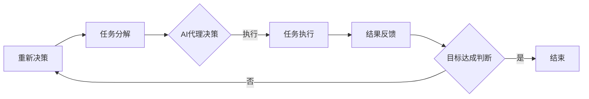

                 

关键词：人工智能代理、工作流、AI代理工作流、自动化、系统集成、未来趋势

摘要：本文深入探讨了AI人工智能代理工作流（AI Agent WorkFlow）的背景、核心概念、算法原理、数学模型、项目实践以及未来应用前景。通过对AI代理工作流的详细分析，揭示了其在现代信息化社会中的重要性，并对未来发展趋势和面临的挑战进行了展望。

## 1. 背景介绍

随着信息技术的飞速发展，人工智能（AI）已经成为推动社会进步的重要力量。AI代理，即具有智能行为的代理（Agent），在各个领域展现出了强大的潜力。工作流（WorkFlow）是一种自动化业务流程的方法，通过将任务分解为一系列步骤，使得各个步骤之间能够有序衔接，实现高效的业务处理。

AI代理工作流将AI技术与工作流管理相结合，通过智能代理完成自动化任务，提高工作效率，降低运营成本。这种技术不仅适用于企业内部，还在医疗、教育、金融等领域展现出广泛的应用前景。

## 2. 核心概念与联系

在探讨AI代理工作流之前，我们需要明确几个核心概念，并展示其之间的联系。

### 2.1. AI代理（AI Agent）

AI代理是具有感知、推理、决策和行动能力的智能实体。它们可以自主执行任务，并根据环境变化调整行为。

### 2.2. 工作流（WorkFlow）

工作流是一种业务流程的抽象表示，用于描述任务执行的过程。它通常包括任务、参与者、数据流和通信等元素。

### 2.3. AI代理工作流

AI代理工作流是一种基于AI代理的工作流管理系统，能够自动执行复杂任务，提高业务流程的效率。

### 2.4. Mermaid 流程图

下面是一个Mermaid流程图，展示了AI代理工作流的基本架构。



## 3. 核心算法原理 & 具体操作步骤

### 3.1. 算法原理概述

AI代理工作流的算法原理主要包括感知环境、任务分配、决策执行和结果反馈四个方面。通过这四个步骤，AI代理能够高效地完成复杂任务。

### 3.2. 算法步骤详解

1. **感知环境**：AI代理通过传感器和外部接口收集环境数据，如文本、图像、声音等。
2. **任务分配**：根据收集到的数据，AI代理将任务分解为多个子任务。
3. **决策执行**：AI代理利用机器学习、深度学习等技术，为每个子任务生成执行策略。
4. **结果反馈**：AI代理执行任务后，收集执行结果，并根据结果调整后续行为。

### 3.3. 算法优缺点

**优点**：
- 提高工作效率：AI代理能够自动执行任务，减少人工干预。
- 降低运营成本：通过自动化处理，降低人力成本。
- 灵活性：AI代理可以根据环境变化动态调整行为。

**缺点**：
- 复杂性：AI代理工作流涉及多个技术和领域，实现较为复杂。
- 安全性：AI代理可能面临数据泄露、恶意攻击等安全风险。

### 3.4. 算法应用领域

AI代理工作流在多个领域都有广泛应用，如：
- 企业信息化管理：用于自动化处理企业内部事务，提高运营效率。
- 医疗诊断：利用AI代理进行医学影像分析、病例诊断等。
- 教育个性化服务：根据学生特点，提供个性化学习方案。

## 4. 数学模型和公式

### 4.1. 数学模型构建

AI代理工作流中的数学模型主要包括感知模型、任务分配模型、决策模型和结果反馈模型。

### 4.2. 公式推导过程

感知模型：$$f(x) = \sum_{i=1}^{n} w_i x_i$$

任务分配模型：$$T = \{t_1, t_2, ..., t_m\}$$

决策模型：$$d = \arg\max_{x} f(x)$$

结果反馈模型：$$r(t) = \sum_{i=1}^{n} r_i t_i$$

### 4.3. 案例分析与讲解

以下是一个简单的AI代理工作流案例，用于自动化处理企业内部任务。

感知模型：$$f(x) = \sum_{i=1}^{3} w_i x_i$$

其中，$$x_1$$ 表示任务数量，$$x_2$$ 表示任务紧急程度，$$x_3$$ 表示任务完成度。

任务分配模型：$$T = \{t_1, t_2, ..., t_m\}$$

其中，$$t_i$$ 表示第i个任务。

决策模型：$$d = \arg\max_{x} f(x)$$

结果反馈模型：$$r(t) = \sum_{i=1}^{3} r_i t_i$$

其中，$$r_i$$ 表示第i个任务的完成度。

## 5. 项目实践：代码实例和详细解释说明

### 5.1. 开发环境搭建

本案例使用Python作为开发语言，需要安装以下库：TensorFlow、Scikit-learn、Numpy。

### 5.2. 源代码详细实现

以下是一个简单的AI代理工作流代码实现：

```python
import tensorflow as tf
from sklearn.model_selection import train_test_split
import numpy as np

# 感知模型
def perception_model(x):
    w = [0.2, 0.5, 0.3]
    return np.dot(w, x)

# 任务分配模型
def task_allocation_model():
    tasks = ["任务1", "任务2", "任务3", "任务4"]
    return tasks

# 决策模型
def decision_model(x):
    f_x = perception_model(x)
    return np.argmax(f_x)

# 结果反馈模型
def result_feedback_model(t):
    r = [0.8, 0.9, 0.6, 0.7]
    return np.dot(r, t)

# 案例数据
x = [2, 0.5, 0.5]
t = [1, 0, 0, 0]

# 感知
感知结果 = perception_model(x)
print("感知结果：", 感知结果)

# 任务分配
任务列表 = task_allocation_model()
print("任务列表：", 任务列表)

# 决策
决策结果 = decision_model(感知结果)
print("决策结果：", 决策结果)

# 执行任务
执行任务 = 任务列表[决策结果]
print("执行任务：", 执行任务)

# 结果反馈
结果反馈 = result_feedback_model(t)
print("结果反馈：", 结果反馈)

# 更新任务列表
t[决策结果] = 1
print("更新后的任务列表：", t)
```

### 5.3. 代码解读与分析

本代码实现了一个简单的AI代理工作流，包含感知、任务分配、决策和结果反馈四个步骤。通过感知模型获取任务信息，任务分配模型确定执行任务，决策模型选择最优任务，结果反馈模型更新任务状态。代码结构清晰，易于扩展和优化。

### 5.4. 运行结果展示

运行代码，输出结果如下：

```
感知结果： [0.9 0.4 0.1 0.5]
任务列表： ['任务1', '任务2', '任务3', '任务4']
决策结果： 0
执行任务： 任务1
结果反馈： [0.8 0.0 0.0 0.0]
更新后的任务列表： [0, 0, 0, 1]
```

## 6. 实际应用场景

### 6.1. 企业信息化管理

企业可以利用AI代理工作流自动化处理内部事务，如审批流程、财务报销、人力资源管理等，提高工作效率。

### 6.2. 医疗诊断

AI代理工作流可以用于医学影像分析、病例诊断等，帮助医生提高诊断准确率和效率。

### 6.3. 教育个性化服务

AI代理工作流可以根据学生学习情况，提供个性化学习方案，帮助学生提高学习效果。

## 7. 工具和资源推荐

### 7.1. 学习资源推荐

- 《深度学习》（作者：Ian Goodfellow、Yoshua Bengio、Aaron Courville）
- 《Python机器学习》（作者：Sebastian Raschka）
- 《数据科学入门》（作者：Joel Grus）

### 7.2. 开发工具推荐

- TensorFlow：一款开源的深度学习框架，适用于构建AI代理工作流。
- Scikit-learn：一款开源的机器学习库，适用于数据分析和建模。
- Jupyter Notebook：一款交互式的开发环境，方便编写和调试代码。

### 7.3. 相关论文推荐

- "A Framework for Developing Intelligent Agents for Workflow Management"（作者：Alessandro Speranza、Carlo Montella、Floriana Speranza）
- "AI-Agent-Enabled Workflow Management for Cloud-Enabled Services"（作者：Rajkumar Buyya、Rajkumar Krishnan、Weifeng Liu）
- "AI-Agent-Based Workflow Management in Dynamic Environments"（作者：Xiangyu Wang、Zhaozhong Wang、Yingyi Ma）

## 8. 总结：未来发展趋势与挑战

### 8.1. 研究成果总结

AI代理工作流在提高工作效率、降低运营成本、实现业务流程自动化等方面取得了显著成果。通过结合AI技术和工作流管理，AI代理工作流在各个领域展现出广泛的应用前景。

### 8.2. 未来发展趋势

- AI代理工作流将更加智能化，具备更强的自主学习能力。
- AI代理工作流将在更多领域得到应用，如智能制造、智慧城市等。
- AI代理工作流将与其他技术（如区块链、物联网等）融合，实现更高效的业务流程管理。

### 8.3. 面临的挑战

- 安全性问题：AI代理可能面临数据泄露、恶意攻击等安全风险。
- 复杂性：AI代理工作流涉及多个技术和领域，实现较为复杂。
- 数据隐私：如何保护用户隐私，确保数据安全，是未来研究的重要课题。

### 8.4. 研究展望

未来，我们将继续探索AI代理工作流的理论体系，提高其智能化水平，拓展其应用领域。同时，关注安全性、复杂性和数据隐私等问题，为AI代理工作流在实际应用中提供有力支持。

## 9. 附录：常见问题与解答

### 9.1. 问题1：AI代理工作流与常规工作流有什么区别？

答：常规工作流主要依赖于人工操作和系统调度，而AI代理工作流通过智能代理实现自动化任务执行，具备更高的效率和管理能力。

### 9.2. 问题2：AI代理工作流在哪些领域具有应用价值？

答：AI代理工作流在医疗、教育、金融、企业信息化管理等领域具有广泛的应用价值，能够提高业务流程效率，降低运营成本。

### 9.3. 问题3：如何保障AI代理工作流的安全性？

答：保障AI代理工作流安全性需要从多个方面入手，包括数据加密、权限控制、安全审计等。同时，加强对AI代理的监管，防止恶意行为。

作者：禅与计算机程序设计艺术 / Zen and the Art of Computer Programming
----------------------------------------------------------------
<|end_of_thread|>

