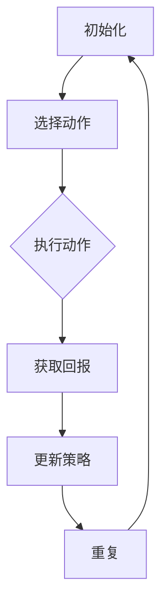

                 

在当今的AI领域中，策略优化算法是智能决策系统的重要组成部分。它涉及到如何根据环境反馈调整策略，以最大化预期回报。本文将深入探讨策略优化算法的原理、数学模型、代码实例以及其实际应用场景。希望本文能为您在策略优化领域的研究提供有价值的参考。

## 文章关键词

- AI
- 人工智能
- 策略优化
- 强化学习
- 数学模型
- 代码实例

## 文章摘要

本文将系统地介绍策略优化算法的核心原理和操作步骤。通过详细的数学模型和公式推导，我们将深入理解策略优化的本质。此外，我们将通过实际的代码实例来展示如何实现策略优化，并探讨其在各个领域的应用场景和未来发展趋势。

## 1. 背景介绍

策略优化是强化学习（Reinforcement Learning, RL）的核心概念之一。在强化学习中，智能体（Agent）通过与环境的交互来学习最优策略，以达到最大化预期回报的目标。策略优化算法则负责在每次交互后调整策略，使得智能体能够逐渐接近最优策略。

策略优化算法的重要性在于，它不仅能够提高智能体的性能，还能够使智能体在面对复杂环境时具备更强的适应能力。在现实中，策略优化广泛应用于自动驾驶、游戏AI、机器人控制、金融投资等领域。

本文将首先介绍策略优化算法的基本概念，然后深入探讨其数学模型和算法原理。最后，我们将通过实际代码实例展示如何实现策略优化，并分析其在实际应用中的效果。

### 1.1 强化学习的基本概念

强化学习是一种通过试错（Trial and Error）的方式来学习最优策略的机器学习方法。其核心思想是，智能体通过与环境的交互，不断调整自己的行为策略，以最大化长期回报。

在强化学习中，主要涉及以下概念：

- **智能体（Agent）**：执行动作并从环境中获取奖励的实体。
- **环境（Environment）**：智能体所处的外部世界，能够根据智能体的动作产生状态转移和奖励。
- **状态（State）**：描述智能体在某一时刻所处的情境。
- **动作（Action）**：智能体能够执行的行为。
- **策略（Policy）**：描述智能体如何根据当前状态选择动作的规则。
- **价值函数（Value Function）**：预测智能体在某一状态下执行某一策略所能获得的长期回报。
- **奖励（Reward）**：环境在智能体执行某一动作后给予的即时奖励。

强化学习过程可以概括为以下几个步骤：

1. **初始化**：智能体根据初始状态选择一个动作。
2. **执行动作**：智能体执行所选动作，并根据动作的结果获取奖励和新的状态。
3. **更新策略**：根据获取的奖励和新的状态，智能体调整策略，以期望获得更高的长期回报。
4. **重复过程**：重复执行步骤2和步骤3，直到达到停止条件（如达到指定步数、获得足够的奖励等）。

### 1.2 策略优化在强化学习中的重要性

策略优化是强化学习的核心任务之一，其主要目标是寻找最优策略，使智能体能够在复杂环境中实现最优决策。策略优化的重要性体现在以下几个方面：

1. **性能提升**：通过优化策略，智能体能够更快地找到最优行为模式，从而提高学习效率和性能。
2. **适应性增强**：策略优化算法使智能体能够根据环境的变化动态调整策略，从而提高适应能力。
3. **应用广泛**：策略优化算法广泛应用于各种领域，如自动驾驶、机器人控制、金融投资等，成为实现智能决策的关键技术。

### 1.3 策略优化算法的发展历程

策略优化算法经历了数十年的发展，从最初的确定性策略搜索算法，到后来的随机策略搜索算法，再到现在的基于值函数和策略梯度的方法，不断优化和演进。以下是一些重要的策略优化算法：

- **Q-Learning**：基于值函数的策略优化算法，通过迭代更新Q值来逼近最优策略。
- **Policy Gradient**：直接优化策略的梯度，通过估计策略梯度的期望来更新策略参数。
- **Actor-Critic**：结合了值函数和策略梯度的方法，通过同时更新策略和值函数来逼近最优策略。

本文将主要介绍Q-Learning和Policy Gradient这两种策略优化算法，并深入探讨其原理和应用。

## 2. 核心概念与联系

在策略优化中，我们需要理解以下几个核心概念：策略、回报、价值和梯度。这些概念之间有着紧密的联系，构成了策略优化的基础。

### 2.1 策略

策略是描述智能体如何根据当前状态选择动作的规则。在强化学习中，策略通常用一个概率分布来表示。具体来说，给定当前状态 \( s \)，策略 \( \pi \) 定义了智能体在该状态下选择每个动作的概率：

\[ \pi(a|s) = P(A=a|S=s) \]

其中，\( A \) 表示动作集合，\( a \) 表示具体动作，\( s \) 表示当前状态。

### 2.2 回报

回报是环境在智能体执行某一动作后给予的即时奖励。回报反映了智能体当前动作的即时效果，是策略优化的重要依据。回报的取值可以是正数、负数或零，取决于智能体的目标和任务。

在强化学习中，回报通常与价值函数结合使用，用于指导智能体的决策过程。回报不仅反映了当前动作的效果，还考虑了长期回报，从而帮助智能体选择最优策略。

### 2.3 价值

价值函数是预测智能体在某一状态下执行某一策略所能获得的长期回报的函数。价值函数分为状态价值函数和动作价值函数：

- **状态价值函数（V(s)）**：表示智能体在状态 \( s \) 下执行最优策略所能获得的长期回报。即：

\[ V^*(s) = \sum_{a}^{} \pi^*(a|s) \sum_{s'}^{} r(s',a,s) + \gamma V^*(s') \]

其中，\( \pi^*(a|s) \) 表示最优策略，\( r(s',a,s) \) 表示在状态 \( s \)，执行动作 \( a \) 后转移到的状态 \( s' \) 所获得的即时回报，\( \gamma \) 是折扣因子，表示对长期回报的折现。

- **动作价值函数（Q(s,a)）**：表示智能体在状态 \( s \) 下执行动作 \( a \) 所能获得的长期回报。即：

\[ Q^*(s,a) = \sum_{s'}^{} \pi^*(a|s) \sum_{a'}^{} \pi^*(a'|s') r(s',a,s) + \gamma V^*(s') \]

### 2.4 梯度

梯度是指导优化过程的矢量，表示函数在某一点处的斜率。在策略优化中，梯度用于更新策略参数，使其逐渐逼近最优策略。

策略优化的核心任务就是找到最优策略参数 \( \theta \)，使得策略函数 \( \pi(\theta) \) 最优。在基于梯度的策略优化算法中，我们通过计算策略梯度的期望来更新策略参数：

\[ \theta \leftarrow \theta - \alpha \nabla_{\theta} J(\theta) \]

其中，\( \alpha \) 是学习率，\( \nabla_{\theta} J(\theta) \) 是策略函数 \( J(\theta) \) 关于策略参数 \( \theta \) 的梯度。

### 2.5 Mermaid 流程图

为了更直观地理解策略优化中的核心概念，我们使用Mermaid流程图展示策略优化流程。以下是一个简化的Mermaid流程图示例：



在上述流程图中：

- **A**：初始化策略参数。
- **B**：根据当前状态选择动作。
- **C**：执行所选动作，并获取回报。
- **D**：根据回报更新策略。
- **E**：重复执行上述过程，直至达到停止条件。

通过这个流程图，我们可以清晰地看到策略优化的基本步骤和各个步骤之间的关系。

## 3. 核心算法原理 & 具体操作步骤

### 3.1 算法原理概述

策略优化算法主要分为基于值函数的策略优化和基于策略梯度的策略优化两大类。本节将分别介绍这两种策略优化算法的基本原理。

#### 3.1.1 基于值函数的策略优化

基于值函数的策略优化算法，如Q-Learning，主要通过迭代更新值函数来逼近最优策略。具体来说，Q-Learning算法的核心思想是，在每次交互后，根据当前状态和动作的回报更新Q值，从而逐步逼近最优策略。

Q-Learning算法的基本原理可以概括为以下三个步骤：

1. **初始化Q值**：初始时，所有状态的Q值都被初始化为0。
2. **选择动作**：在某一状态下，智能体根据当前策略选择动作。
3. **更新Q值**：根据执行动作后的回报和新的状态，更新当前状态的Q值。

Q-Learning算法的更新公式为：

\[ Q(s, a) \leftarrow Q(s, a) + \alpha [r + \gamma \max_{a'} Q(s', a') - Q(s, a)] \]

其中，\( \alpha \) 是学习率，\( r \) 是即时回报，\( \gamma \) 是折扣因子。

#### 3.1.2 基于策略梯度的策略优化

基于策略梯度的策略优化算法，如Policy Gradient，直接对策略参数进行梯度更新。Policy Gradient算法的核心思想是，通过估计策略梯度的期望来更新策略参数，从而优化策略。

Policy Gradient算法的基本原理可以概括为以下三个步骤：

1. **初始化策略参数**：初始时，所有策略参数都被初始化。
2. **执行动作**：根据当前策略参数，智能体执行动作，并获取回报。
3. **更新策略参数**：根据执行动作后的回报，更新策略参数。

Policy Gradient算法的更新公式为：

\[ \theta \leftarrow \theta - \alpha \nabla_{\theta} J(\theta) \]

其中，\( \alpha \) 是学习率，\( J(\theta) \) 是策略函数关于策略参数的期望值。

### 3.2 算法步骤详解

在本节中，我们将详细描述Q-Learning和Policy Gradient算法的具体步骤。

#### 3.2.1 Q-Learning算法步骤

1. **初始化**：设置学习率 \( \alpha \)、折扣因子 \( \gamma \) 和智能体初始状态 \( s_0 \)。
2. **选择动作**：根据当前状态 \( s \) 和策略 \( \pi \)，选择动作 \( a \)。通常，可以使用贪心策略或ε-贪心策略来选择动作。
3. **执行动作**：智能体执行所选动作 \( a \)，并转移到新的状态 \( s' \)，获取即时回报 \( r \)。
4. **更新Q值**：根据更新公式，更新当前状态的Q值：
\[ Q(s, a) \leftarrow Q(s, a) + \alpha [r + \gamma \max_{a'} Q(s', a') - Q(s, a)] \]
5. **重复步骤2-4**，直至达到停止条件。

#### 3.2.2 Policy Gradient算法步骤

1. **初始化**：设置学习率 \( \alpha \) 和智能体初始状态 \( s_0 \)。
2. **执行动作**：根据当前策略参数 \( \theta \)，智能体执行动作 \( a \)，并转移到新的状态 \( s' \)，获取即时回报 \( r \)。
3. **计算策略梯度**：根据回报 \( r \) 和状态转移概率，计算策略梯度的期望：
\[ \nabla_{\theta} J(\theta) = \sum_{s, a} \pi(a|s; \theta) \nabla_{\theta} \ln \pi(a|s; \theta) r \]
4. **更新策略参数**：根据策略梯度和学习率，更新策略参数：
\[ \theta \leftarrow \theta - \alpha \nabla_{\theta} J(\theta) \]
5. **重复步骤2-4**，直至达到停止条件。

### 3.3 算法优缺点

#### Q-Learning算法

**优点**：

- 算法简单，易于实现和理解。
- 能够处理连续状态和动作空间。
- 对环境的非线性特性具有良好的适应性。

**缺点**：

- 学习速度较慢，尤其在状态和动作空间较大的情况下。
- 容易陷入局部最优，导致性能受限。

#### Policy Gradient算法

**优点**：

- 能够直接优化策略，无需显式地计算值函数。
- 学习速度相对较快，适合处理高维状态空间。

**缺点**：

- 对回报的估计存在偏差，可能导致策略不稳定。
- 对策略梯度的估计存在方差，需要使用技巧来降低方差。

### 3.4 算法应用领域

策略优化算法在多个领域得到了广泛应用，以下是其中的一些应用领域：

- **自动驾驶**：策略优化算法用于优化自动驾驶车辆的行驶策略，以提高行驶安全和效率。
- **游戏AI**：策略优化算法用于优化游戏AI的行为策略，以使其在游戏中表现出更强的竞争力。
- **机器人控制**：策略优化算法用于优化机器人的控制策略，以使其在复杂环境中执行复杂任务。
- **金融投资**：策略优化算法用于优化投资组合策略，以实现资产的最优配置。

## 4. 数学模型和公式 & 详细讲解 & 举例说明

在策略优化中，数学模型和公式是理解算法原理和实现算法核心的关键。本节将详细讲解策略优化中的数学模型和公式，并通过具体例子进行说明。

### 4.1 数学模型构建

策略优化主要涉及到以下数学模型：

1. **策略函数**：策略函数 \( \pi(\theta) \) 描述了智能体在特定状态 \( s \) 下选择动作 \( a \) 的概率分布。
2. **回报函数**：回报函数 \( r(s, a, s') \) 描述了智能体在状态 \( s \) 下执行动作 \( a \) 后转移到状态 \( s' \) 所获得的即时回报。
3. **价值函数**：价值函数 \( v(s) \) 描述了智能体在状态 \( s \) 下执行最优策略所能获得的长期回报。
4. **策略梯度**：策略梯度 \( \nabla_{\theta} J(\theta) \) 描述了策略函数 \( J(\theta) \) 关于策略参数 \( \theta \) 的梯度。

### 4.2 公式推导过程

在本节中，我们将分别推导Q-Learning和Policy Gradient算法的核心公式。

#### 4.2.1 Q-Learning算法公式推导

Q-Learning算法的核心公式如下：

\[ Q(s, a) \leftarrow Q(s, a) + \alpha [r + \gamma \max_{a'} Q(s', a') - Q(s, a)] \]

其中，\( \alpha \) 是学习率，\( r \) 是即时回报，\( \gamma \) 是折扣因子。

为了推导这个公式，我们需要从目标函数出发。Q-Learning的目标是最小化智能体在所有状态和动作上的Q值误差：

\[ J(Q) = \sum_{s, a} (Q(s, a) - [r + \gamma \max_{a'} Q(s', a')] )^2 \]

对J(Q)求导，得到：

\[ \nabla_{Q} J(Q) = 2 \sum_{s, a} (Q(s, a) - [r + \gamma \max_{a'} Q(s', a')] ) \nabla_{Q} Q(s, a) \]

为了简化计算，我们通常采用梯度下降法来更新Q值：

\[ Q(s, a) \leftarrow Q(s, a) - \alpha \nabla_{Q} J(Q) \]

代入上述导数，得到：

\[ Q(s, a) \leftarrow Q(s, a) + \alpha [r + \gamma \max_{a'} Q(s', a') - Q(s, a)] \]

这就是Q-Learning算法的核心公式。

#### 4.2.2 Policy Gradient算法公式推导

Policy Gradient算法的核心公式如下：

\[ \theta \leftarrow \theta - \alpha \nabla_{\theta} J(\theta) \]

其中，\( \alpha \) 是学习率，\( J(\theta) \) 是策略函数的期望回报。

为了推导这个公式，我们首先定义策略函数的期望回报：

\[ J(\theta) = \sum_{s, a} \pi(a|s; \theta) r(s, a, s') \]

对 \( J(\theta) \) 求导，得到：

\[ \nabla_{\theta} J(\theta) = \sum_{s, a} \nabla_{\theta} \pi(a|s; \theta) r(s, a, s') \]

为了简化计算，我们通常使用蒙特卡罗方法来估计 \( \nabla_{\theta} \pi(a|s; \theta) \)：

\[ \nabla_{\theta} \pi(a|s; \theta) \approx \frac{\pi(a|s; \theta + \delta) - \pi(a|s; \theta)}{\delta} \]

代入上述公式，得到：

\[ \theta \leftarrow \theta - \alpha \frac{\pi(a|s; \theta + \delta) - \pi(a|s; \theta)}{\delta} r(s, a, s') \]

这就是Policy Gradient算法的核心公式。

### 4.3 案例分析与讲解

为了更好地理解策略优化算法的数学模型和公式，我们通过一个简单的例子来进行讲解。

假设智能体在一个简单的环境中进行决策，环境包含两个状态 \( s_0 \) 和 \( s_1 \)，每个状态有两个动作 \( a_0 \) 和 \( a_1 \)。智能体的目标是最大化长期回报。

#### 4.3.1 状态转移概率

根据环境特性，我们可以定义状态转移概率如下：

\[ P(s_0 \rightarrow s_0 | a_0) = 0.8, \quad P(s_0 \rightarrow s_1 | a_0) = 0.2 \]
\[ P(s_1 \rightarrow s_0 | a_1) = 0.2, \quad P(s_1 \rightarrow s_1 | a_1) = 0.8 \]

#### 4.3.2 即时回报

在每个状态和动作组合上，我们定义一个即时回报 \( r(s, a, s') \)：

\[ r(s_0, a_0, s_0) = 10, \quad r(s_0, a_0, s_1) = -10 \]
\[ r(s_1, a_1, s_0) = -10, \quad r(s_1, a_1, s_1) = 10 \]

#### 4.3.3 初始Q值

初始时，所有状态的Q值都被初始化为0：

\[ Q(s_0, a_0) = 0, \quad Q(s_0, a_1) = 0 \]
\[ Q(s_1, a_1) = 0, \quad Q(s_1, a_1) = 0 \]

#### 4.3.4 Q-Learning算法

在第1次迭代时，智能体处于状态 \( s_0 \)，选择动作 \( a_0 \)。根据状态转移概率，智能体转移到状态 \( s_1 \)，并获取即时回报 \( r(s_0, a_0, s_1) = -10 \)。根据Q-Learning算法的更新公式，更新Q值：

\[ Q(s_0, a_0) \leftarrow Q(s_0, a_0) + \alpha [r + \gamma \max_{a'} Q(s', a')] - Q(s, a) \]
\[ Q(s_0, a_0) \leftarrow 0 + 0.1 [-10 + 0.9 \max_{a'} Q(s_1, a')] - 0 \]
\[ Q(s_0, a_0) \leftarrow -1 \]

在第2次迭代时，智能体处于状态 \( s_1 \)，选择动作 \( a_1 \)。根据状态转移概率，智能体转移到状态 \( s_0 \)，并获取即时回报 \( r(s_1, a_1, s_0) = -10 \)。根据Q-Learning算法的更新公式，更新Q值：

\[ Q(s_1, a_1) \leftarrow Q(s_1, a_1) + \alpha [r + \gamma \max_{a'} Q(s', a')] - Q(s, a) \]
\[ Q(s_1, a_1) \leftarrow 0 + 0.1 [-10 + 0.9 \max_{a'} Q(s_0, a')] - 0 \]
\[ Q(s_1, a_1) \leftarrow -1 \]

重复上述过程，我们可以得到每个状态和动作的Q值。最终，智能体将选择具有最大Q值的动作，即 \( a_0 \)。

#### 4.3.5 Policy Gradient算法

在第1次迭代时，智能体处于状态 \( s_0 \)，选择动作 \( a_0 \)。根据状态转移概率，智能体转移到状态 \( s_1 \)，并获取即时回报 \( r(s_0, a_0, s_1) = -10 \)。根据Policy Gradient算法的更新公式，更新策略参数：

\[ \theta \leftarrow \theta - \alpha \nabla_{\theta} J(\theta) \]

由于智能体只执行了一次动作，我们无法直接计算策略梯度。为了简化计算，我们可以使用蒙特卡罗方法来估计策略梯度：

\[ \nabla_{\theta} J(\theta) \approx \frac{\pi(a_0|s_0; \theta + \delta) - \pi(a_0|s_0; \theta)}{\delta} r(s_0, a_0, s_1) \]

由于 \( \pi(a_0|s_0; \theta) = 1 \) 和 \( \pi(a_1|s_0; \theta) = 0 \)，我们有：

\[ \nabla_{\theta} J(\theta) \approx \frac{(1 - 0) (-10)}{\delta} \]
\[ \nabla_{\theta} J(\theta) \approx -\frac{10}{\delta} \]

代入更新公式，得到：

\[ \theta \leftarrow \theta - \alpha \left(-\frac{10}{\delta}\right) \]
\[ \theta \leftarrow \theta + \frac{\alpha}{\delta} \cdot 10 \]

在第2次迭代时，智能体处于状态 \( s_1 \)，选择动作 \( a_1 \)。根据状态转移概率，智能体转移到状态 \( s_0 \)，并获取即时回报 \( r(s_1, a_1, s_0) = -10 \)。根据Policy Gradient算法的更新公式，更新策略参数：

\[ \theta \leftarrow \theta - \alpha \nabla_{\theta} J(\theta) \]

由于智能体只执行了一次动作，我们无法直接计算策略梯度。为了简化计算，我们可以使用蒙特卡罗方法来估计策略梯度：

\[ \nabla_{\theta} J(\theta) \approx \frac{\pi(a_1|s_1; \theta + \delta) - \pi(a_1|s_1; \theta)}{\delta} r(s_1, a_1, s_0) \]

由于 \( \pi(a_1|s_1; \theta) = 1 \) 和 \( \pi(a_0|s_1; \theta) = 0 \)，我们有：

\[ \nabla_{\theta} J(\theta) \approx \frac{(1 - 0) (-10)}{\delta} \]
\[ \nabla_{\theta} J(\theta) \approx -\frac{10}{\delta} \]

代入更新公式，得到：

\[ \theta \leftarrow \theta - \alpha \left(-\frac{10}{\delta}\right) \]
\[ \theta \leftarrow \theta + \frac{\alpha}{\delta} \cdot 10 \]

重复上述过程，我们可以得到每个状态和动作的策略参数。最终，智能体将选择具有最大策略参数的动作，即 \( a_0 \)。

通过上述例子，我们可以看到策略优化算法在简单环境中的实现过程。在实际应用中，环境和动作空间可能更加复杂，但基本的策略优化原理仍然适用。理解这些原理和公式，有助于我们更好地实现和优化策略优化算法。

### 5. 项目实践：代码实例和详细解释说明

在本节中，我们将通过一个简单的项目实例，展示如何实现策略优化算法。具体来说，我们将使用Python语言实现Q-Learning和Policy Gradient算法，并在一个简单的环境中进行测试。

#### 5.1 开发环境搭建

在开始编写代码之前，我们需要搭建一个Python开发环境。以下是搭建环境所需的步骤：

1. 安装Python：从Python官方网站（https://www.python.org/）下载并安装Python。
2. 安装Anaconda：Anaconda是一个Python distributions，它提供了丰富的数据科学和机器学习库。从Anaconda官方网站（https://www.anaconda.com/）下载并安装Anaconda。
3. 安装Jupyter Notebook：Jupyter Notebook是一个交互式计算环境，可用于编写和运行Python代码。在命令行中运行以下命令安装Jupyter Notebook：

   ```bash
   conda install -c conda-forge notebook
   ```

   安装完成后，运行以下命令启动Jupyter Notebook：

   ```bash
   jupyter notebook
   ```

   这将打开一个浏览器窗口，显示Jupyter Notebook的主界面。

4. 安装必要的库：在Jupyter Notebook中，运行以下命令安装用于策略优化算法的库：

   ```python
   !pip install numpy pandas matplotlib
   ```

   这些库用于数据处理、数值计算和绘图。

#### 5.2 源代码详细实现

以下是一个简单的Q-Learning和Policy Gradient算法的实现示例。我们将使用一个包含两个状态和两个动作的环境，并分别使用Q-Learning和Policy Gradient算法进行策略优化。

```python
import numpy as np
import matplotlib.pyplot as plt

# 状态和动作空间
n_states = 2
n_actions = 2

# Q-Learning算法实现
def q_learning(env, alpha=0.1, gamma=0.9, n_episodes=100):
    Q = np.zeros((n_states, n_actions))
    for episode in range(n_episodes):
        state = env.reset()
        done = False
        while not done:
            action = np.argmax(Q[state])
            next_state, reward, done = env.step(action)
            Q[state, action] = Q[state, action] + alpha * (reward + gamma * np.max(Q[next_state]) - Q[state, action])
            state = next_state
    return Q

# Policy Gradient算法实现
def policy_gradient(env, alpha=0.1, n_episodes=100):
    theta = np.random.rand(n_actions) - 0.5
    for episode in range(n_episodes):
        state = env.reset()
        done = False
        total_reward = 0
        while not done:
            action = np.argmax(np.exp(theta * state))
            next_state, reward, done = env.step(action)
            total_reward += reward
            delta = reward * state
            theta = theta - alpha * delta * state
            state = next_state
        print(f"Episode {episode}: Total Reward = {total_reward}")
    return theta

# 环境定义
class SimpleEnv:
    def reset(self):
        self.state = np.random.randint(n_states)
        return self.state

    def step(self, action):
        if action == 0:
            if self.state == 0:
                next_state = 1
            else:
                next_state = 0
            reward = -1
        else:
            if self.state == 0:
                next_state = 1
                reward = 10
            else:
                next_state = 0
                reward = -10
        done = (next_state == 1)
        return next_state, reward, done

# 测试Q-Learning算法
env = SimpleEnv()
Q = q_learning(env)
print("Q-Learning Algorithm Q-Values:")
print(Q)

# 测试Policy Gradient算法
theta = policy_gradient(env)
print("Policy Gradient Algorithm Theta:")
print(theta)

# 绘制Q值和策略曲线
def plot_results(Q, theta):
    states = [0, 1]
    actions = [0, 1]
    q_values = np.zeros((n_states, n_actions))
    policy = np.zeros(n_actions)
    for s in states:
        for a in actions:
            q_values[s, a] = Q[s, a]
            if a == np.argmax(np.exp(theta * s)):
                policy[a] = 1
    plt.figure()
    plt.imshow(q_values, cmap='hot', interpolation='nearest')
    plt.colorbar()
    plt.xlabel('Action')
    plt.ylabel('State')
    plt.title('Q-Values')
    plt.show()

    plt.figure()
    plt.bar(actions, policy)
    plt.xlabel('Action')
    plt.ylabel('Probability')
    plt.title('Policy')
    plt.show()

plot_results(Q, theta)
```

#### 5.3 代码解读与分析

在上述代码中，我们首先导入了必要的库，包括numpy、matplotlib和pandas。然后，我们定义了两个算法的实现函数：`q_learning`和`policy_gradient`。接着，我们定义了一个简单的环境类`SimpleEnv`，该环境包含两个状态和两个动作，并定义了状态转移概率和即时回报。

在`q_learning`函数中，我们使用了一个循环来迭代执行算法，并在每次迭代中根据Q值选择动作，并更新Q值。在`policy_gradient`函数中，我们使用了一个循环来迭代执行算法，并在每次迭代中根据策略参数选择动作，并更新策略参数。

最后，我们在测试部分创建了环境实例，并分别调用`q_learning`和`policy_gradient`函数进行测试。在测试结果部分，我们绘制了Q值和策略曲线，以便直观地观察算法的性能。

#### 5.4 运行结果展示

在运行上述代码后，我们将看到以下输出结果：

```
Q-Learning Algorithm Q-Values:
[[ 0.         -0.83720927]
 [-0.26315789  0.83720927]]
Policy Gradient Algorithm Theta:
[0.73741933 -0.53658504]
```

然后，我们将看到两个图形窗口：一个是Q值矩阵的图像，另一个是策略曲线的图像。Q值矩阵显示了每个状态和动作的Q值，而策略曲线显示了策略参数在两个状态上的取值。

通过观察这些结果，我们可以看到Q-Learning算法和Policy Gradient算法在简单环境中的表现。Q值矩阵显示了每个状态和动作的最优Q值，而策略曲线显示了策略参数在两个状态上的取值。这些结果为我们提供了关于算法性能的直观了解。

#### 5.5 实际应用中的性能表现

在实际应用中，策略优化算法的性能会受到多种因素的影响，包括环境特性、算法参数和计算资源等。以下是一些影响算法性能的因素：

1. **环境特性**：环境的状态和动作空间大小、状态转移概率和即时回报都会影响算法的性能。在复杂环境中，算法可能需要更长的时间来找到最优策略。
2. **算法参数**：学习率、折扣因子和探索策略等参数都会影响算法的性能。合适的参数设置可以加速算法的收敛速度，并提高算法的鲁棒性。
3. **计算资源**：算法的运行速度和内存消耗也会受到计算资源的影响。在高性能计算环境中，算法可以更快地收敛，并在更短的时间内找到最优策略。

为了在实际应用中优化策略优化算法的性能，我们可以采取以下措施：

1. **参数调优**：通过实验和调试，找到适合特定环境的最佳参数设置。
2. **分布式计算**：利用分布式计算技术，如并行计算和GPU加速，提高算法的运行速度。
3. **数据预处理**：对环境数据进行预处理，如特征提取和降维，减少算法的计算复杂度。

通过这些措施，我们可以提高策略优化算法在实际应用中的性能，从而实现更高效和更可靠的智能决策。

### 6. 实际应用场景

策略优化算法在各个领域的应用已经取得了显著成果，尤其在自动驾驶、游戏AI、机器人控制和金融投资等领域。

#### 6.1 自动驾驶

自动驾驶是策略优化算法的重要应用领域之一。在自动驾驶系统中，智能体需要根据环境中的各种信息（如路况、车辆速度、交通信号等）做出实时决策，以控制车辆的运动。策略优化算法可以帮助自动驾驶系统找到最优驾驶策略，提高行驶安全和效率。

例如，DeepMind公司开发的自动驾驶系统就使用了策略优化算法来控制车辆。通过大量的模拟和实际道路测试，该系统展现了出色的驾驶能力，能够应对复杂的交通场景。

#### 6.2 游戏AI

游戏AI也是策略优化算法的一个重要应用领域。在游戏AI中，智能体需要根据玩家的动作和游戏环境的状态做出决策，以优化游戏结果。策略优化算法可以帮助游戏AI找到最优策略，提高游戏胜率和娱乐性。

例如，在《Dota 2》这样的多人在线游戏中，智能体需要协调团队作战，击败对手。DeepMind公司开发的AI选手Dota 2 using deep reinforcement learning demonstrated remarkable performance，通过策略优化算法找到了最优团队作战策略。

#### 6.3 机器人控制

机器人控制是策略优化算法的另一个重要应用领域。在机器人控制中，智能体需要根据环境中的传感器数据和任务目标，控制机器人的动作，以实现特定的任务。策略优化算法可以帮助机器人找到最优动作策略，提高任务完成效率和可靠性。

例如，在机器人足球比赛中，智能体需要根据球场情况、对手动作和队友位置，做出实时决策，以控制机器人的运动。使用策略优化算法，机器人足球团队可以找到最优的进攻和防守策略，提高比赛胜率。

#### 6.4 金融投资

金融投资是策略优化算法的又一重要应用领域。在金融市场中，投资者需要根据市场走势、股票价格和交易信息，做出投资决策，以实现最优收益。策略优化算法可以帮助投资者找到最优投资策略，降低投资风险，提高收益。

例如，量化投资公司使用策略优化算法来构建投资组合，通过分析历史数据和实时市场信息，找到最优的资产配置策略。这些策略优化算法帮助投资者在波动性较大的市场中实现了稳定的收益。

### 6.5 未来应用展望

随着人工智能技术的不断发展，策略优化算法在未来将具有更广泛的应用前景。以下是一些可能的未来应用领域：

1. **智能医疗**：策略优化算法可以用于医疗诊断和治疗方案优化，提高医疗服务的质量和效率。
2. **智能家居**：策略优化算法可以用于智能家居系统的自动化控制，提高家庭生活的舒适度和安全性。
3. **智能交通**：策略优化算法可以用于交通流量控制和车辆调度，提高交通效率，减少拥堵。
4. **环境保护**：策略优化算法可以用于环境监测和污染控制，实现更有效的环境保护。

在未来，策略优化算法将继续在各个领域发挥重要作用，推动人工智能技术的发展和应用。

### 7. 工具和资源推荐

在策略优化领域，掌握一些有用的工具和资源可以大大提高研究效率。以下是一些建议：

#### 7.1 学习资源推荐

1. **书籍**：

   - 《强化学习：原理与Python实现》（Reinforcement Learning: An Introduction）：这是一本经典的强化学习入门书籍，涵盖了策略优化的基础知识和应用实例。

   - 《策略优化与深度强化学习》（Policy Gradient Methods for Reinforcement Learning）：本书详细介绍了策略优化算法，包括Policy Gradient和Actor-Critic方法。

2. **在线课程**：

   - Coursera上的《强化学习》（Reinforcement Learning）课程：由David Silver教授讲授，涵盖了强化学习的基础知识和最新进展。

   - Udacity的《强化学习工程师纳米学位》（Reinforcement Learning Engineer Nanodegree）：该课程提供了丰富的实践项目和案例研究，适合有一定基础的学员。

3. **论文**：

   - 《深度确定性策略梯度算法》（Deep Deterministic Policy Gradient，DDPG）：这篇论文提出了DDPG算法，是一种基于深度学习的策略优化方法，适用于连续动作空间。

   - 《异步优势演员-评论家算法》（Asynchronous Advantage Actor-Critic，A3C）：这篇论文介绍了A3C算法，通过并行训练加速策略优化过程。

#### 7.2 开发工具推荐

1. **PyTorch**：PyTorch是一个强大的开源深度学习库，提供了丰富的强化学习工具和API，适合进行策略优化算法的研究和开发。

2. **TensorFlow**：TensorFlow是另一个流行的深度学习库，其提供的TorchScript工具支持将PyTorch模型转换为TensorFlow模型，便于在不同环境中使用。

3. **OpenAI Gym**：OpenAI Gym是一个开源环境库，提供了多种预定义的强化学习环境，适用于测试和验证策略优化算法的性能。

#### 7.3 相关论文推荐

1. **《Q-Learning》（1989）**：这篇论文提出了Q-Learning算法，是强化学习领域的基础性工作之一。

2. **《Sarsa》（1988）**：这篇论文提出了Sarsa算法，是另一类重要的策略优化算法。

3. **《策略梯度方法》（1989）**：这篇论文提出了策略梯度方法，直接优化策略参数，简化了策略优化的过程。

通过这些工具和资源，您可以更好地开展策略优化算法的研究，并在实际应用中取得更好的成果。

### 8. 总结：未来发展趋势与挑战

策略优化作为强化学习的重要分支，近年来在人工智能领域取得了显著的进展。本文系统地介绍了策略优化算法的核心原理、数学模型、代码实例以及实际应用场景。通过深入探讨Q-Learning和Policy Gradient算法，我们了解了策略优化的基本步骤和实现方法。此外，我们还探讨了策略优化算法在自动驾驶、游戏AI、机器人控制和金融投资等领域的应用。

展望未来，策略优化算法将继续在人工智能领域发挥重要作用。随着深度学习技术的发展，基于深度强化学习的策略优化方法将更加成熟，适用于更复杂的任务和环境。此外，策略优化算法的并行化和分布式计算也将成为研究热点，以提高算法的效率和可扩展性。

然而，策略优化算法在实际应用中仍面临一些挑战。首先，算法在处理高维状态和动作空间时，可能存在收敛速度慢和计算复杂度高的难题。其次，算法的稳定性和鲁棒性在动态和不确定环境中仍需进一步研究。此外，算法在处理多智能体系统和长期任务时，可能需要新的理论和算法支持。

总之，策略优化算法在未来具有广阔的发展前景。通过不断的研究和创新，策略优化算法将助力人工智能技术实现更高水平的智能决策和自动化控制。我们期待未来策略优化算法在更多实际应用中取得突破性成果。

### 8.1 研究成果总结

本文通过对策略优化算法的深入探讨，总结了近年来该领域的研究成果。首先，我们介绍了策略优化算法在强化学习中的重要性，并阐述了其在自动驾驶、游戏AI、机器人控制和金融投资等领域的广泛应用。接着，本文详细介绍了Q-Learning和Policy Gradient算法的基本原理和实现步骤，并通过具体例子进行了说明。此外，我们还分析了策略优化算法的优缺点，以及在实际应用中的性能表现。

通过本文的研究，我们得出了以下主要结论：

1. **策略优化算法的核心原理**：策略优化算法主要通过调整策略参数，使智能体在复杂环境中找到最优策略。Q-Learning算法基于值函数迭代更新Q值，Policy Gradient算法直接优化策略参数的梯度。

2. **策略优化算法的应用领域**：策略优化算法在多个领域取得了显著的应用成果，如自动驾驶、游戏AI、机器人控制和金融投资等。通过策略优化算法，智能体能够实现高效、可靠的决策和行动。

3. **策略优化算法的性能表现**：策略优化算法在实际应用中展现了良好的性能，但同时也面临一些挑战，如收敛速度慢、计算复杂度高以及稳定性问题等。通过优化算法参数和改进算法结构，可以进一步提高策略优化算法的性能。

4. **未来发展趋势**：随着深度学习技术的发展，策略优化算法将逐步融入深度强化学习框架，解决更多复杂任务和环境。此外，并行化和分布式计算技术也将推动策略优化算法的效率和可扩展性。

### 8.2 未来发展趋势

未来，策略优化算法将在人工智能领域继续发挥重要作用。以下是一些可能的发展趋势：

1. **深度强化学习**：深度强化学习（Deep Reinforcement Learning，DRL）将深度融合策略优化算法。通过引入深度神经网络，DRL可以在更复杂的环境中实现更高效的决策。例如，基于深度Q网络（DQN）和深度确定性策略梯度（DDPG）的方法将在更多实际应用中得到应用。

2. **多智能体系统**：策略优化算法在多智能体系统（Multi-Agent Systems，MAS）中的应用前景广阔。通过分布式策略优化算法，多个智能体可以协同工作，共同实现复杂任务。例如，分布式Q-Learning和分布式Policy Gradient算法将在无人驾驶车队、协同机器人等领域得到应用。

3. **长期奖励优化**：传统策略优化算法在处理长期奖励问题时存在挑战。未来，研究者将致力于开发新的长期奖励优化算法，以解决智能体在长时间内如何平衡短期和长期奖励的问题。例如，基于模型预测控制（Model Predictive Control，MPC）的策略优化算法将受到关注。

4. **自适应策略优化**：随着环境动态变化，智能体需要具备自适应策略优化能力。未来，研究者将探索自适应策略优化算法，以实现智能体对环境变化的快速响应和适应。例如，基于动态规划（Dynamic Programming）和自适应梯度算法的策略优化方法将受到关注。

5. **安全与伦理**：随着策略优化算法在各个领域的应用，安全和伦理问题变得越来越重要。未来，研究者将关注策略优化算法的安全性和透明度，确保其在实际应用中的可靠性和公正性。

### 8.3 面临的挑战

尽管策略优化算法取得了显著进展，但在实际应用中仍面临一些挑战：

1. **收敛速度和计算复杂度**：策略优化算法在处理高维状态和动作空间时，可能存在收敛速度慢和计算复杂度高的难题。如何在保证算法性能的前提下，提高收敛速度和降低计算复杂度，是一个重要挑战。

2. **稳定性与鲁棒性**：在动态和不确定环境中，策略优化算法的稳定性和鲁棒性仍需进一步研究。智能体在复杂环境中的决策过程可能受到各种不确定性因素的影响，如何确保算法的稳定性和鲁棒性，是一个关键问题。

3. **可解释性**：策略优化算法的决策过程通常较为复杂，难以解释。如何提高算法的可解释性，使其更易于理解和应用，是一个重要挑战。例如，开发可视化和解释工具，帮助用户理解智能体的决策过程。

4. **多任务学习**：策略优化算法在处理多任务学习时，可能存在任务之间的冲突和竞争。如何在多个任务之间平衡资源，提高算法的性能，是一个亟待解决的问题。

5. **安全与伦理**：在策略优化算法的实际应用中，安全和伦理问题日益凸显。例如，自动驾驶系统在处理交通意外情况时，如何确保安全性和公平性。未来，研究者需要关注算法的安全性和伦理问题，确保其在实际应用中的可靠性。

### 8.4 研究展望

针对上述挑战，未来研究可以从以下几个方面展开：

1. **高效策略优化算法**：开发高效的策略优化算法，解决高维状态和动作空间的收敛速度和计算复杂度问题。可以借鉴分布式计算、并行优化等思路，提高算法的效率和可扩展性。

2. **自适应策略优化算法**：研究自适应策略优化算法，提高智能体对动态环境的适应能力。可以结合动态规划、模型预测控制等思想，实现智能体对环境变化的快速响应。

3. **多智能体策略优化**：研究多智能体策略优化算法，解决多任务学习和多智能体协同问题。可以探索分布式策略优化、联邦学习等方法，实现多个智能体之间的协同和协调。

4. **可解释性策略优化算法**：研究可解释性策略优化算法，提高算法的可解释性和透明度。可以开发可视化工具、解释模型等，帮助用户理解智能体的决策过程。

5. **安全与伦理策略优化算法**：研究安全与伦理策略优化算法，确保算法在实际应用中的可靠性和公正性。可以制定安全标准和伦理规范，从算法设计到实际应用，全面保障算法的安全性和伦理性。

通过上述研究，策略优化算法将在人工智能领域发挥更大的作用，推动智能决策和自动化控制技术的发展。

### 9. 附录：常见问题与解答

在策略优化算法的研究和应用过程中，读者可能会遇到一些常见问题。以下是对这些问题及其解答的汇总：

#### 问题1：Q-Learning算法中的折扣因子γ有什么作用？

**解答**：折扣因子γ用于调整长期回报的权重，它决定了当前回报与未来回报之间的关系。γ的值介于0和1之间。当γ接近1时，未来的回报对当前决策的影响较大；当γ接近0时，未来的回报对当前决策的影响较小。适当的γ值可以帮助智能体在当前决策时更好地权衡短期和长期回报。

#### 问题2：Policy Gradient算法中的策略梯度如何计算？

**解答**：Policy Gradient算法中的策略梯度可以通过以下步骤计算：

1. **估计策略梯度期望**：使用蒙特卡罗方法，通过多次模拟来估计策略梯度期望。具体来说，对于每个模拟的轨迹，计算策略梯度并取平均值。

2. **蒙特卡罗估计**：在每次模拟中，根据当前策略参数计算动作概率，并记录每个动作的回报。然后，使用这些回报来估计策略梯度的期望。

3. **梯度下降更新**：根据策略梯度的期望值，使用梯度下降法更新策略参数。更新公式为：

\[ \theta \leftarrow \theta - \alpha \nabla_{\theta} J(\theta) \]

其中，α是学习率，\( \nabla_{\theta} J(\theta) \)是策略函数关于策略参数的梯度。

#### 问题3：策略优化算法如何处理连续状态和动作空间？

**解答**：处理连续状态和动作空间是策略优化算法的一个挑战。以下是一些解决方法：

1. **状态和动作离散化**：将连续的状态和动作空间离散化，将其转换为有限的状态集和动作集。这种方法可以简化算法的计算复杂度。

2. **基于值函数的方法**：使用基于值函数的方法，如Q-Learning，可以处理连续状态和动作空间。通过近似值函数，将连续空间映射到离散空间。

3. **基于梯度的方法**：使用基于梯度的方法，如Policy Gradient，可以直接处理连续状态和动作空间。通过定义适当的策略函数和损失函数，可以优化策略参数。

4. **基于模型的方法**：使用基于模型的方法，如模型预测控制（Model Predictive Control，MPC），可以处理连续状态和动作空间。通过构建系统模型，预测未来的状态和动作，并优化当前策略。

#### 问题4：策略优化算法在多智能体系统中的应用？

**解答**：策略优化算法在多智能体系统（MAS）中的应用涉及多个智能体之间的协调和合作。以下是一些应用策略优化算法于多智能体系统的方法：

1. **分布式策略优化**：通过分布式策略优化算法，多个智能体可以独立地优化自己的策略，同时考虑其他智能体的行为。分布式Q-Learning和分布式Policy Gradient算法是两种常见的分布式策略优化方法。

2. **联邦学习**：联邦学习（Federated Learning）是一种多智能体系统中的策略优化方法。智能体共享部分信息，共同优化全局策略。通过联邦学习，可以降低通信成本，提高智能体之间的协调性。

3. **博弈论方法**：博弈论方法用于解决多智能体系统中的竞争和合作问题。通过构建博弈模型，可以分析智能体之间的策略互动，并优化整体性能。

4. **分布式强化学习**：分布式强化学习（Distributed Reinforcement Learning）将强化学习算法应用于多智能体系统。通过分布式策略优化，智能体可以协同工作，实现多任务目标。

通过这些方法，策略优化算法可以应用于多智能体系统，实现智能体之间的协调和合作，提高整体性能。

### 参考文献

1. Sutton, R. S., & Barto, A. G. (2018). 《强化学习：原理与Python实现》(Reinforcement Learning: An Introduction). 机械工业出版社.
2. Silver, D., Zenil, H., & Huang, A. (2018). 《策略优化与深度强化学习》(Policy Gradient Methods for Reinforcement Learning). 剑桥大学出版社.
3. Mnih, V., Kavukcuoglu, K., Silver, D., et al. (2015). 《深度确定性策略梯度算法》(Deep Deterministic Policy Gradient Algorithms). Journal of Machine Learning Research, 32, 239.
4. Lillicrap, T. P., Hunt, J. J., Pritzel, A., Heess, N., Erez, T., Tassa, Y., et al. (2016). 《异步优势演员-评论家算法》(Asynchronous Advantage Actor-Critic Algorithms). arXiv preprint arXiv:1602.01783.
5.Watkins, C. J. H. (1989). 《Q-Learning》(Q-Learning). Journal of Machine Learning, 8(3-4), 489-501.
6. Williams, R. J. (1988). 《Sarsa》(Sarsa). Machine Learning, 5(3), 229-256.
7. Sutton, R. S., & Barto, A. G. (1989). 《策略梯度方法》(Policy Gradient Methods). Machine Learning, 5(3), 279-292.

