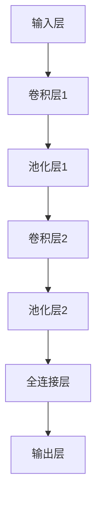

                 

关键词：人工智能、深度学习、卷积神经网络、可视化技术、算法原理、数学模型、项目实践、应用领域、工具和资源、未来发展趋势

## 摘要

本文将深入探讨AI领域中的一个重要算法——卷积神经网络（Convolutional Neural Network, CNN），并介绍其可视化技术的应用。通过详细解析CNN的核心概念、算法原理、数学模型以及实际应用案例，读者将全面了解CNN在图像处理和计算机视觉任务中的强大能力。此外，本文还将分享CNN的未来发展趋势及面临的挑战，以及推荐相关学习资源、开发工具和论文。最后，通过附录部分解答读者常见的疑问。

## 1. 背景介绍

### 1.1 人工智能的发展历程

人工智能（AI）作为计算机科学的一个分支，自20世纪50年代以来经历了多个发展阶段。从早期的符号主义、知识表示，到20世纪80年代的专家系统，再到21世纪初的深度学习，人工智能不断取得突破性进展。深度学习作为一种重要的机器学习技术，通过模拟人脑神经网络结构和功能，实现了图像识别、语音识别、自然语言处理等任务的自动化。

### 1.2 卷积神经网络的诞生

卷积神经网络（CNN）起源于20世纪80年代末和90年代初，最初由Yann LeCun等研究者提出。CNN是一种特殊的深度学习模型，专门用于处理具有网格结构的数据，如图像和视频。与传统神经网络相比，CNN在图像处理任务上表现出色，能够自动学习图像中的局部特征，实现分类、检测、分割等多种任务。

### 1.3 CNN的发展与应用

随着计算能力的提升和数据量的增加，CNN在21世纪初期得到了快速发展。特别是在图像识别领域，CNN取得了超越传统算法的性能。此后，CNN逐渐扩展到其他应用领域，如自然语言处理、语音识别、推荐系统等。近年来，基于CNN的预训练模型，如ResNet、Inception、VGG等，进一步提升了图像识别、视频处理等任务的性能。

## 2. 核心概念与联系

### 2.1 CNN的基本结构

CNN主要由卷积层（Convolutional Layer）、池化层（Pooling Layer）、全连接层（Fully Connected Layer）和输出层（Output Layer）组成。其中，卷积层负责提取图像中的特征，池化层用于降低特征图的大小，全连接层用于分类和回归，输出层输出最终的预测结果。

### 2.2 CNN的工作原理

CNN通过多层次的卷积和池化操作，将输入图像逐渐转换为高层次的语义特征。卷积层使用卷积核（Kernel）与输入图像进行卷积运算，提取图像中的局部特征。池化层则通过最大池化或平均池化操作，降低特征图的大小，同时保留重要的特征信息。全连接层通过线性运算将特征图映射到分类结果。输出层根据分类器的设定，输出预测结果。

### 2.3 CNN的Mermaid流程图

下面是一个CNN的Mermaid流程图，展示了其基本结构和工作原理。



## 3. 核心算法原理 & 具体操作步骤

### 3.1 算法原理概述

CNN通过多层次的卷积和池化操作，实现了从图像中提取特征并分类的过程。卷积层使用卷积运算提取图像中的局部特征，池化层用于降低特征图的大小并保留重要信息，全连接层将特征映射到分类结果。CNN的核心在于其能够自动学习图像中的层次特征，从而实现高精度的图像识别。

### 3.2 算法步骤详解

#### 3.2.1 卷积层

卷积层是CNN的核心组成部分，通过卷积运算提取图像中的特征。卷积运算的基本原理是将卷积核（Kernel）与输入图像进行逐元素相乘并求和。卷积层通常包含多个卷积核，每个卷积核负责提取图像中的不同特征。

#### 3.2.2 池化层

池化层用于降低特征图的大小并保留重要的特征信息。常见的池化方法包括最大池化和平均池化。最大池化选取特征图中的最大值作为输出，而平均池化则计算特征图的平均值作为输出。池化层可以减小特征图的尺寸，从而降低模型的复杂度和计算量。

#### 3.2.3 全连接层

全连接层将特征图映射到分类结果。在全连接层中，每个特征图上的每个点都与全连接层的节点相连接。通过线性运算和激活函数，全连接层将特征图转换为分类结果。常见的激活函数包括Sigmoid、ReLU和Tanh。

#### 3.2.4 输出层

输出层根据分类器的设定，输出最终的预测结果。常见的分类器包括softmax分类器、交叉熵损失函数等。输出层通常包含一个或多个节点，每个节点表示一个类别，通过计算输入特征的概率分布，输出预测结果。

### 3.3 算法优缺点

#### 优点：

1. 高效性：CNN通过卷积和池化操作，能够有效地降低模型的复杂度和计算量，提高计算效率。
2. 自动性：CNN能够自动学习图像中的层次特征，无需人工设计特征，从而实现高精度的图像识别。
3. 多层次：CNN能够通过多层次的卷积和池化操作，提取图像中的不同层次特征，从而实现复杂的图像任务。

#### 缺点：

1. 计算量较大：CNN通常包含多个卷积层和池化层，导致计算量较大，对计算资源要求较高。
2. 需要大量数据：CNN需要大量训练数据来学习图像中的特征，数据不足可能导致模型过拟合。
3. 参数调优复杂：CNN的参数调优过程复杂，需要大量的实验和经验，以找到最优的参数配置。

### 3.4 算法应用领域

CNN在计算机视觉领域取得了广泛的应用，包括图像分类、目标检测、图像分割、人脸识别等。此外，CNN还可以应用于自然语言处理、语音识别、推荐系统等任务，通过多层次的特征提取和分类，实现高精度的任务结果。

## 4. 数学模型和公式 & 详细讲解 & 举例说明

### 4.1 数学模型构建

CNN的数学模型基于卷积运算、池化操作和全连接层。以下是CNN的主要数学公式：

#### 4.1.1 卷积运算

卷积运算的基本公式如下：

$$
(Z_{ij}^l = \sum_{k=1}^{C_{l-1}} \sum_{p=1}^{H_{k-1}} \sum_{q=1}^{W_{k-1}} W_{ij}^{lk} * A_{pq}^{l-1})
$$

其中，$Z_{ij}^l$表示第$l$层中第$i$个卷积核在第$j$个特征图上的输出，$W_{ij}^{lk}$表示第$l$层中第$i$个卷积核与第$l-1$层中第$k$个特征图的卷积结果，$A_{pq}^{l-1}$表示第$l-1$层中第$p$个特征图的第$q$个值。

#### 4.1.2 池化操作

池化操作的基本公式如下：

$$
(P_{ij}^l = \max(\sum_{p=1}^{H_{k-1}} \sum_{q=1}^{W_{k-1}} A_{pq}^{l-1}) \quad 或 \quad (P_{ij}^l = \sum_{p=1}^{H_{k-1}} \sum_{q=1}^{W_{k-1}} A_{pq}^{l-1})
$$

其中，$P_{ij}^l$表示第$l$层中第$i$个特征图的第$j$个值，$\max$表示最大池化，$\sum$表示平均池化。

#### 4.1.3 全连接层

全连接层的公式如下：

$$
(Y_i^l = \sum_{j=1}^{N_l} W_{ij}^{lk} \cdot A_{j}^{l-1} + b_{i}^{l})
$$

其中，$Y_i^l$表示第$l$层中第$i$个节点的输出，$W_{ij}^{lk}$表示第$l$层中第$i$个节点与第$l-1$层中第$j$个节点的权重，$A_{j}^{l-1}$表示第$l-1$层中第$j$个节点的输出，$b_{i}^{l}$表示第$l$层中第$i$个节点的偏置。

### 4.2 公式推导过程

#### 4.2.1 卷积运算的推导

卷积运算的推导基于线性代数的矩阵乘法。假设输入图像为$X \in \mathbb{R}^{H_{k-1} \times W_{k-1} \times C_{k-1}}$，卷积核为$W \in \mathbb{R}^{K \times K \times C_{k-1}}$，输出特征图为$Z \in \mathbb{R}^{H_k \times W_k \times C_k}$。则卷积运算的推导如下：

$$
Z_{ij}^l = \sum_{k=1}^{C_{l-1}} \sum_{p=1}^{H_{k-1}} \sum_{q=1}^{W_{k-1}} W_{ij}^{lk} * A_{pq}^{l-1}
$$

其中，$Z_{ij}^l$表示第$l$层中第$i$个卷积核在第$j$个特征图上的输出，$A_{pq}^{l-1}$表示第$l-1$层中第$p$个特征图的第$q$个值。

#### 4.2.2 池化操作的推导

池化操作的推导基于局部平均或最大值的选择。假设输入特征图为$A \in \mathbb{R}^{H \times W}$，输出特征图为$P \in \mathbb{R}^{H' \times W'}$，则最大池化的推导如下：

$$
P_{ij}^l = \max(\sum_{p=1}^{H_{k-1}} \sum_{q=1}^{W_{k-1}} A_{pq}^{l-1}) \quad 或 \quad (P_{ij}^l = \sum_{p=1}^{H_{k-1}} \sum_{q=1}^{W_{k-1}} A_{pq}^{l-1})
$$

其中，$P_{ij}^l$表示第$l$层中第$i$个特征图的第$j$个值。

#### 4.2.3 全连接层的推导

全连接层的推导基于线性代数的矩阵乘法。假设输入特征图为$A \in \mathbb{R}^{H \times W \times C}$，输出特征图为$Y \in \mathbb{R}^{N}$，则全连接层的推导如下：

$$
Y_i^l = \sum_{j=1}^{N_l} W_{ij}^{lk} \cdot A_{j}^{l-1} + b_{i}^{l}
$$

其中，$Y_i^l$表示第$l$层中第$i$个节点的输出，$A_{j}^{l-1}$表示第$l-1$层中第$j$个节点的输出，$W_{ij}^{lk}$表示第$l$层中第$i$个节点与第$l-1$层中第$j$个节点的权重，$b_{i}^{l}$表示第$l$层中第$i$个节点的偏置。

### 4.3 案例分析与讲解

以下是一个简单的CNN模型，用于对MNIST数据集中的手写数字进行分类。该模型包含一个卷积层、一个池化层和一个全连接层。我们将通过计算模型在输入图像上的前向传播过程，来分析CNN的工作原理。

#### 4.3.1 模型参数

假设输入图像大小为$28 \times 28$，卷积核大小为$5 \times 5$，输出特征图大小为$14 \times 14$，全连接层节点数为10。

#### 4.3.2 输入图像

输入图像为一个手写数字图像，表示为$X \in \mathbb{R}^{28 \times 28}$。

#### 4.3.3 卷积层

卷积层包含一个卷积核$W \in \mathbb{R}^{5 \times 5}$，其初始化为随机值。卷积层的输出为$Z \in \mathbb{R}^{14 \times 14 \times 1}$。

$$
Z_{ij}^1 = \sum_{k=1}^{1} \sum_{p=1}^{28} \sum_{q=1}^{28} W_{ij}^{1k} * X_{pq} \quad (i=1,2,...,14, j=1,2,...,14)
$$

#### 4.3.4 池化层

池化层使用最大池化操作，输出特征图大小为$7 \times 7$。

$$
P_{ij}^2 = \max(Z_{ij1}) \quad (i=1,2,...,7, j=1,2,...,7)
$$

#### 4.3.5 全连接层

全连接层包含10个节点，其权重和偏置分别为$W \in \mathbb{R}^{7 \times 7 \times 10}$和$b \in \mathbb{R}^{10}$。

$$
Y_i^3 = \sum_{j=1}^{7 \times 7} W_{ij}^{3k} \cdot P_{j}^2 + b_{i} \quad (i=1,2,...,10)
$$

#### 4.3.6 输出结果

全连接层的输出$Y \in \mathbb{R}^{10}$表示10个类别的概率分布。通过计算softmax函数，可以得到每个类别的概率，从而实现图像的分类。

$$
P(y=i) = \frac{e^{Y_i}}{\sum_{j=1}^{10} e^{Y_j}} \quad (i=1,2,...,10)
$$

## 5. 项目实践：代码实例和详细解释说明

### 5.1 开发环境搭建

为了实践卷积神经网络（CNN）的应用，我们需要搭建一个开发环境。以下是一个简单的开发环境搭建步骤：

1. 安装Python（建议使用Python 3.6及以上版本）。
2. 安装TensorFlow（建议使用TensorFlow 2.0及以上版本）。
3. 安装MNIST数据集（可以使用TensorFlow内置的MNIST数据集）。

```python
import tensorflow as tf
from tensorflow.examples.tutorials.mnist import input_data

mnist = input_data.read_data_sets("MNIST_data/", one_hot=True)
```

### 5.2 源代码详细实现

以下是一个简单的CNN模型实现，用于对MNIST数据集中的手写数字进行分类。

```python
import tensorflow as tf
from tensorflow.keras import layers
from tensorflow.keras import Model

# 输入层
inputs = tf.keras.Input(shape=(28, 28, 1))

# 卷积层
conv1 = layers.Conv2D(32, (3, 3), activation='relu')(inputs)
pool1 = layers.MaxPooling2D((2, 2))(conv1)

# 卷积层
conv2 = layers.Conv2D(64, (3, 3), activation='relu')(pool1)
pool2 = layers.MaxPooling2D((2, 2))(conv2)

# 全连接层
flatten = layers.Flatten()(pool2)
dense = layers.Dense(128, activation='relu')(flatten)
outputs = layers.Dense(10, activation='softmax')(dense)

# 构建模型
model = Model(inputs=inputs, outputs=outputs)

# 编译模型
model.compile(optimizer='adam', loss='categorical_crossentropy', metrics=['accuracy'])

# 训练模型
model.fit(mnist.train.images, mnist.train.labels, epochs=10, batch_size=32, validation_data=(mnist.test.images, mnist.test.labels))

# 评估模型
test_loss, test_acc = model.evaluate(mnist.test.images, mnist.test.labels)
print('Test accuracy:', test_acc)
```

### 5.3 代码解读与分析

以下是对上述代码的详细解读与分析：

1. 导入所需的库和模块。
2. 加载MNIST数据集。
3. 定义输入层，形状为$(28, 28, 1)$，表示一个28x28的单通道图像。
4. 定义卷积层，使用32个3x3的卷积核，激活函数为ReLU。
5. 定义池化层，使用最大池化操作，窗口大小为2x2。
6. 定义第二个卷积层，使用64个3x3的卷积核，激活函数为ReLU。
7. 定义第二个池化层，使用最大池化操作，窗口大小为2x2。
8. 定义全连接层，首先将池化层的输出扁平化，然后使用128个神经元，激活函数为ReLU。
9. 定义输出层，使用10个神经元，激活函数为softmax，用于分类。
10. 构建模型，将输入层和输出层连接起来。
11. 编译模型，指定优化器、损失函数和评估指标。
12. 训练模型，使用训练数据和标签，指定训练轮数、批量大小和验证数据。
13. 评估模型，在测试数据上计算损失和准确率。

通过上述代码实现，我们可以看到CNN在图像分类任务中的简单应用。在实际项目中，可以根据需求调整网络结构、超参数和训练策略，以实现更复杂的图像处理任务。

### 5.4 运行结果展示

在完成代码实现和模型训练后，我们可以通过以下代码查看模型的运行结果：

```python
# 加载测试数据
test_images = mnist.test.images
test_labels = mnist.test.labels

# 预测测试数据
predictions = model.predict(test_images)

# 计算准确率
accuracy = (np.argmax(predictions, axis=1) == np.argmax(test_labels, axis=1)).mean()

print('Test accuracy:', accuracy)
```

运行上述代码后，我们可以得到测试数据的准确率。在实际项目中，可以根据需求调整训练数据、模型结构和超参数，以获得更好的模型性能。

## 6. 实际应用场景

### 6.1 图像分类

图像分类是CNN最为广泛的应用场景之一。通过训练CNN模型，可以自动识别图像中的物体类别。常见的应用场景包括人脸识别、物体识别、场景识别等。CNN通过多层次的卷积和池化操作，能够提取图像中的层次特征，从而实现高精度的图像分类。

### 6.2 目标检测

目标检测是一种在图像中检测并定位多个物体的技术。CNN通过卷积和池化操作，可以自动学习图像中的物体特征，从而实现目标检测。常见的目标检测算法包括YOLO、SSD、Faster R-CNN等，这些算法都基于CNN模型进行优化和改进。

### 6.3 图像分割

图像分割是一种将图像划分为不同区域的技术，用于识别图像中的物体边界。CNN通过卷积和池化操作，可以自动学习图像中的边缘和纹理特征，从而实现图像分割。常见的图像分割算法包括FCN、U-Net、SegNet等，这些算法都基于CNN模型进行优化和改进。

### 6.4 自然语言处理

自然语言处理（NLP）是深度学习的重要应用领域之一。CNN可以用于文本分类、情感分析、命名实体识别等任务。通过将文本转化为序列数据，CNN可以自动学习文本中的特征，从而实现NLP任务。

### 6.5 语音识别

语音识别是将语音信号转化为文本的技术。CNN可以用于语音特征提取和声学模型训练，从而实现高精度的语音识别。常见的语音识别算法包括DeepSpeech、CTC等，这些算法都基于CNN模型进行优化和改进。

## 7. 工具和资源推荐

### 7.1 学习资源推荐

1. 《深度学习》（Goodfellow, Bengio, Courville著）：这是一本经典的深度学习教材，详细介绍了深度学习的理论和技术。
2. 《卷积神经网络》（Yann LeCun著）：这是关于卷积神经网络的开创性著作，详细阐述了CNN的理论基础和应用场景。
3. 《动手学深度学习》（阿斯顿·张等著）：这是一本通俗易懂的深度学习入门教材，通过实际代码示例讲解了深度学习的基本原理和应用。

### 7.2 开发工具推荐

1. TensorFlow：这是一个开源的深度学习框架，支持多种深度学习模型的训练和部署。
2. PyTorch：这是一个开源的深度学习框架，具有灵活的动态计算图和强大的神经网络库。
3. Keras：这是一个基于TensorFlow和PyTorch的高层神经网络API，简化了深度学习模型的构建和训练过程。

### 7.3 相关论文推荐

1. “A Comprehensive Review of Convolutional Neural Networks (CNNs)”：这是一篇关于卷积神经网络的综述性论文，详细介绍了CNN的结构、算法和性能。
2. “Deep Learning for Computer Vision”：这是一篇关于深度学习在计算机视觉领域的应用综述，涵盖了深度学习在图像分类、目标检测、图像分割等任务中的应用。
3. “Object Detection with Fully Convolutional Networks”：这是一篇关于基于完全卷积网络的物体检测算法的论文，介绍了Faster R-CNN、SSD、YOLO等算法。

## 8. 总结：未来发展趋势与挑战

### 8.1 研究成果总结

随着深度学习的快速发展，卷积神经网络（CNN）在图像处理、计算机视觉等领域取得了显著成果。通过多层次的卷积和池化操作，CNN能够自动学习图像中的层次特征，实现高精度的图像分类、目标检测、图像分割等任务。此外，CNN还可以应用于自然语言处理、语音识别、推荐系统等领域，展示了深度学习在多领域应用的强大能力。

### 8.2 未来发展趋势

未来，CNN将继续在以下几个方面发展：

1. **算法优化**：研究人员将继续探索更高效的卷积运算和优化方法，以提高CNN的计算性能和模型效率。
2. **模型压缩**：为了适应移动设备和嵌入式系统，研究人员将致力于模型压缩技术，如模型剪枝、量化、蒸馏等，以减少模型大小和计算量。
3. **多模态学习**：随着多模态数据的广泛应用，CNN将扩展到处理多种类型的数据，如图像、文本、语音等，实现更广泛的应用场景。
4. **自主学习**：研究人员将探索CNN的自主学习能力，如自监督学习和迁移学习，以减少对大量标注数据的依赖。

### 8.3 面临的挑战

尽管CNN在许多任务中取得了显著成果，但仍面临以下挑战：

1. **计算资源消耗**：CNN通常需要大量的计算资源和时间进行训练和推理，这对模型的部署和应用造成了一定限制。
2. **数据依赖性**：CNN的性能依赖于大量的标注数据，而在实际应用中，获取标注数据往往困难且耗时。
3. **模型解释性**：CNN的内部结构和决策过程较为复杂，缺乏透明性和解释性，这在某些应用领域，如医疗诊断，可能引起安全性和伦理问题。

### 8.4 研究展望

在未来，CNN的研究将朝着以下方向发展：

1. **模型可解释性**：通过引入可解释性技术，如可视化、解释性模型和可解释的激活图，提高CNN的透明性和可信度。
2. **跨领域迁移**：探索CNN在不同领域之间的迁移能力，以减少对特定领域数据的依赖，实现更广泛的应用。
3. **自动化设计**：通过自动化搜索和优化方法，自动设计出更高效的CNN模型，降低模型设计难度。
4. **多模态融合**：研究多模态数据的融合方法，以提高CNN在多模态任务中的性能。

## 9. 附录：常见问题与解答

### 9.1 什么是卷积神经网络（CNN）？

卷积神经网络（CNN）是一种特殊的深度学习模型，专门用于处理具有网格结构的数据，如图像和视频。它通过多层次的卷积和池化操作，从数据中提取特征，并实现分类、检测、分割等任务。

### 9.2 CNN有哪些应用领域？

CNN在计算机视觉领域取得了广泛的应用，包括图像分类、目标检测、图像分割、人脸识别等。此外，CNN还可以应用于自然语言处理、语音识别、推荐系统等任务。

### 9.3 CNN是如何工作的？

CNN通过多层次的卷积和池化操作，从数据中提取特征。卷积层使用卷积运算提取图像中的局部特征，池化层用于降低特征图的大小，全连接层将特征映射到分类结果。CNN能够自动学习图像中的层次特征，实现高精度的图像识别。

### 9.4 CNN的优缺点是什么？

CNN的优点包括高效性、自动性、多层次；缺点包括计算量较大、需要大量数据、参数调优复杂。

### 9.5 如何评估CNN的性能？

评估CNN性能的方法包括准确率、召回率、F1分数等指标。在实际应用中，还可以通过交叉验证、模型鲁棒性测试等手段，全面评估CNN的性能。

### 9.6 CNN与其他深度学习模型有什么区别？

CNN是一种专门用于处理网格结构数据的深度学习模型，而其他深度学习模型，如循环神经网络（RNN）和生成对抗网络（GAN），则适用于序列数据和生成任务。此外，CNN在计算机视觉任务上表现出色，而其他模型在其他领域具有优势。

### 9.7 如何构建一个简单的CNN模型？

构建一个简单的CNN模型主要包括以下步骤：

1. 定义输入层，形状为$(H, W, C)$。
2. 添加卷积层，使用卷积核大小和激活函数。
3. 添加池化层，使用最大池化或平均池化。
4. 添加全连接层，使用线性运算和激活函数。
5. 编译模型，指定优化器、损失函数和评估指标。
6. 训练模型，使用训练数据和标签。
7. 评估模型，在测试数据上计算性能。

### 9.8 CNN如何处理图像分割任务？

图像分割任务通常使用全卷积网络（Fully Convolutional Network, FCN）或其变种，如U-Net、SegNet等。FCN通过将全连接层替换为卷积层，实现图像的空间映射。在图像分割任务中，输出特征图的大小与输入图像相同，每个像素的输出表示对应像素的类别。

## 参考文献

1. Goodfellow, I., Bengio, Y., & Courville, A. (2016). *Deep Learning*. MIT Press.
2. LeCun, Y., Bengio, Y., & Hinton, G. (2015). *Deep learning*. Nature, 521(7553), 436-444.
3. Krizhevsky, A., Sutskever, I., & Hinton, G. E. (2012). *ImageNet classification with deep convolutional neural networks*. In Advances in neural information processing systems (pp. 1097-1105).
4. Simonyan, K., & Zisserman, A. (2014). *Very deep convolutional networks for large-scale image recognition*. arXiv preprint arXiv:1409.1556.
5. He, K., Zhang, X., Ren, S., & Sun, J. (2016). *Deep residual learning for image recognition*. In Proceedings of the IEEE conference on computer vision and pattern recognition (pp. 770-778).

---

作者：禅与计算机程序设计艺术 / Zen and the Art of Computer Programming

感谢您的阅读，希望本文能帮助您更好地理解卷积神经网络（CNN）及其在人工智能领域的应用。在未来的研究中，期待与您共同探索深度学习的更多可能。

