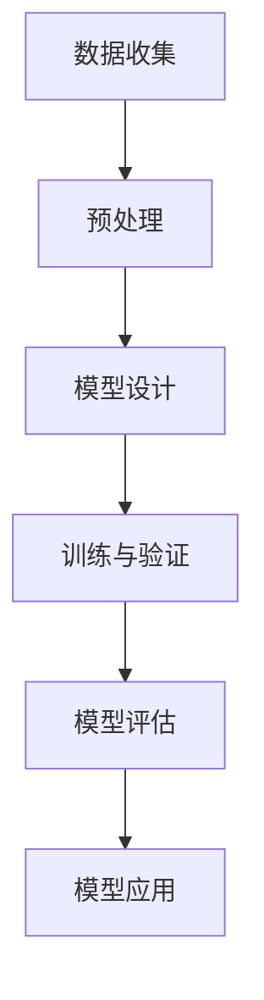

                 

关键词：人工智能，深度学习，复杂系统建模，算法原理，数学模型，项目实践，应用场景，发展趋势

> 摘要：本文旨在探讨人工智能中的深度学习算法在复杂系统建模中的应用。通过深入分析核心概念与联系，详细解析核心算法原理与操作步骤，构建数学模型和公式，以及提供实际项目实践案例，本文全面揭示了深度学习在复杂系统建模中的潜力和挑战。最后，本文对未来发展趋势与面临的挑战进行了展望。

## 1. 背景介绍

随着信息技术的迅猛发展，复杂系统的建模与分析已经成为科学研究、工程应用和社会管理的重要手段。复杂系统通常由大量相互作用的组件构成，这些组件之间的相互作用可能导致系统表现出非线性、不确定性和涌现性等复杂特性。传统的统计方法和简单的数学模型往往难以捕捉这些复杂特性。因此，人工智能，尤其是深度学习算法，为复杂系统建模提供了一种强有力的工具。

深度学习是一种基于人工神经网络的学习方法，通过多层的非线性变换，能够自动提取数据中的特征，并在大量数据上进行训练。它已经在图像识别、自然语言处理、语音识别等多个领域取得了显著的成果。随着深度学习技术的不断发展和成熟，其在复杂系统建模中的应用也日益广泛。

本文将重点探讨深度学习算法在复杂系统建模中的应用，通过理论分析和实际案例，展示其在解决复杂系统问题方面的潜力和优势。

## 2. 核心概念与联系

### 2.1 复杂系统概述

复杂系统通常具有以下特征：

1. **非线性**：系统内部各组件之间的关系不是线性的，这意味着简单的因果关系无法完全描述系统的行为。
2. **涌现性**：系统整体行为无法从其组成部分的行为直接推导出来，系统的整体性质可能会出现意外的现象。
3. **自组织**：系统可以通过内部相互作用自发地形成结构或模式。
4. **适应性**：系统能够根据外部环境的变化调整内部结构和行为。

### 2.2 深度学习概述

深度学习是一种模拟人脑神经网络的算法，通过多层的神经网络结构，实现从输入数据到输出的映射。深度学习的主要特点包括：

1. **层次化特征提取**：通过多层网络，逐层提取数据的高级特征。
2. **端到端训练**：从原始输入直接学习到预测输出，无需手动设计特征。
3. **强大的泛化能力**：能够处理大量的未知数据，并具有良好的泛化性能。

### 2.3 Mermaid 流程图

为了更清晰地展示深度学习算法在复杂系统建模中的应用流程，我们使用Mermaid绘制了以下流程图：



- **数据收集**：从复杂系统中收集相关数据。
- **预处理**：对数据进行清洗、归一化等预处理。
- **模型设计**：设计合适的深度学习模型结构。
- **训练与验证**：使用训练数据对模型进行训练，使用验证数据对模型性能进行评估。
- **模型评估**：评估模型的泛化能力和性能。
- **模型应用**：将训练好的模型应用到实际复杂系统问题中。

## 3. 核心算法原理 & 具体操作步骤

### 3.1 算法原理概述

深度学习算法的核心在于神经网络的训练过程。神经网络由多层节点组成，每层节点负责提取不同层次的特征。具体操作步骤如下：

1. **前向传播**：输入数据通过网络的层层传播，每个节点将输入与权重相乘后进行非线性变换。
2. **反向传播**：根据预测输出与实际输出的误差，反向传播误差并更新网络权重。
3. **优化算法**：使用梯度下降等优化算法调整网络权重，以减少误差。

### 3.2 算法步骤详解

1. **模型设计**：
   - 选择合适的网络结构，如卷积神经网络（CNN）、循环神经网络（RNN）或变分自编码器（VAE）等。
   - 设计网络层，包括输入层、隐藏层和输出层。

2. **数据预处理**：
   - 数据清洗：去除噪声、缺失值和异常值。
   - 数据归一化：将数据缩放到相同的范围，如0到1之间。
   - 切分数据集：将数据分为训练集、验证集和测试集。

3. **模型训练**：
   - 使用训练集数据训练模型，通过前向传播和反向传播更新网络权重。
   - 使用验证集数据评估模型性能，选择最优模型。

4. **模型评估**：
   - 使用测试集数据评估模型泛化能力，评估指标包括准确率、召回率、F1值等。

5. **模型应用**：
   - 将训练好的模型应用到实际复杂系统问题中，如预测、分类、优化等。

### 3.3 算法优缺点

**优点**：

1. **自动特征提取**：能够自动提取数据中的高级特征，无需手动设计特征。
2. **强大的泛化能力**：能够处理大量的未知数据，并具有良好的泛化性能。
3. **自适应性强**：可以根据不同的复杂系统问题进行自适应调整。

**缺点**：

1. **计算成本高**：深度学习模型通常需要大量的计算资源，特别是在训练阶段。
2. **数据依赖性强**：深度学习模型的性能依赖于数据质量和数量，数据预处理过程较为复杂。
3. **解释性差**：深度学习模型通常被视为“黑盒”，其内部决策过程难以解释。

### 3.4 算法应用领域

深度学习算法在复杂系统建模中的应用非常广泛，主要包括以下几个方面：

1. **图像识别与处理**：应用于人脸识别、目标检测、图像分类等领域。
2. **自然语言处理**：应用于机器翻译、情感分析、文本分类等领域。
3. **语音识别与合成**：应用于语音识别、语音合成、语音增强等领域。
4. **智能交通**：应用于交通流量预测、路况分析、自动驾驶等领域。
5. **生物信息学**：应用于基因序列分析、蛋白质结构预测等领域。

## 4. 数学模型和公式 & 详细讲解 & 举例说明

### 4.1 数学模型构建

在深度学习算法中，常用的数学模型包括损失函数、优化算法等。

**损失函数**：

- **均方误差（MSE）**：

  $$MSE = \frac{1}{n}\sum_{i=1}^{n}(y_i - \hat{y}_i)^2$$

  其中，$y_i$为实际输出，$\hat{y}_i$为预测输出，$n$为样本数量。

- **交叉熵（Cross-Entropy）**：

  $$Cross-Entropy = -\frac{1}{n}\sum_{i=1}^{n}y_i\log(\hat{y}_i)$$

  其中，$y_i$为实际输出，$\hat{y}_i$为预测输出，$n$为样本数量。

**优化算法**：

- **梯度下降（Gradient Descent）**：

  $$\theta_{\text{new}} = \theta_{\text{old}} - \alpha \nabla_{\theta} J(\theta)$$

  其中，$\theta$为模型参数，$\alpha$为学习率，$J(\theta)$为损失函数。

### 4.2 公式推导过程

以均方误差（MSE）为例，其推导过程如下：

1. **定义损失函数**：

   $$L(y, \hat{y}) = (y - \hat{y})^2$$

2. **求导**：

   $$\frac{\partial L}{\partial \hat{y}} = -2(y - \hat{y})$$

3. **求梯度**：

   $$\nabla_{\hat{y}} L = -2(y - \hat{y})$$

4. **应用梯度下降**：

   $$\hat{y}_{\text{new}} = \hat{y}_{\text{old}} - \alpha \nabla_{\hat{y}} L$$

   其中，$\alpha$为学习率。

### 4.3 案例分析与讲解

假设我们有一个简单的线性回归模型，输入为$x$，输出为$y$，模型公式为$y = wx + b$。我们的目标是预测$y$，已知$x$和$y$的数据集。

1. **定义损失函数**：

   $$MSE = \frac{1}{n}\sum_{i=1}^{n}(y_i - (wx_i + b))^2$$

2. **求导**：

   $$\frac{\partial MSE}{\partial w} = \frac{2}{n}\sum_{i=1}^{n}(y_i - (wx_i + b))x_i$$

   $$\frac{\partial MSE}{\partial b} = \frac{2}{n}\sum_{i=1}^{n}(y_i - (wx_i + b))$$

3. **应用梯度下降**：

   $$w_{\text{new}} = w_{\text{old}} - \alpha \frac{2}{n}\sum_{i=1}^{n}(y_i - (wx_i + b))x_i$$

   $$b_{\text{new}} = b_{\text{old}} - \alpha \frac{2}{n}\sum_{i=1}^{n}(y_i - (wx_i + b))$$

   其中，$\alpha$为学习率。

通过不断迭代上述过程，我们可以优化模型的参数，从而提高预测的准确性。

## 5. 项目实践：代码实例和详细解释说明

### 5.1 开发环境搭建

为了进行深度学习项目实践，我们需要搭建一个合适的开发环境。以下是常用的步骤：

1. 安装Python环境，推荐使用Anaconda进行环境管理。
2. 安装深度学习框架，如TensorFlow或PyTorch。
3. 安装必要的依赖库，如NumPy、Pandas、Matplotlib等。

### 5.2 源代码详细实现

以下是一个简单的线性回归模型，使用TensorFlow框架实现的代码：

```python
import tensorflow as tf
import numpy as np
import matplotlib.pyplot as plt

# 数据生成
x = np.random.normal(size=100)
y = 2 * x + 1 + np.random.normal(size=100)

# 定义模型
w = tf.Variable(0.0, name='weights')
b = tf.Variable(0.0, name='biases')
y_pred = w * x + b

# 定义损失函数
loss = tf.reduce_mean(tf.square(y - y_pred))

# 定义优化算法
optimizer = tf.train.GradientDescentOptimizer(learning_rate=0.1)
train_op = optimizer.minimize(loss)

# 训练模型
with tf.Session() as sess:
    sess.run(tf.global_variables_initializer())
    for step in range(201):
        _, loss_val = sess.run([train_op, loss])
        if step % 20 == 0:
            print(f"Step {step}: Loss = {loss_val}")

    # 模型评估
    w_val, b_val = sess.run([w, b])
    print(f"Weights: {w_val}, Biases: {b_val}")

    # 预测
    y_pred_val = w_val * x + b_val

# 绘图
plt.scatter(x, y)
plt.plot(x, y_pred_val, 'r')
plt.xlabel('x')
plt.ylabel('y')
plt.show()
```

### 5.3 代码解读与分析

1. **数据生成**：使用numpy生成一个包含100个随机数的x和对应的y，y与x之间存在线性关系。

2. **模型定义**：使用TensorFlow定义一个线性回归模型，包括权重w和偏置b。

3. **损失函数**：使用均方误差（MSE）作为损失函数，衡量预测值与实际值之间的差距。

4. **优化算法**：使用梯度下降优化算法，不断调整权重w和偏置b，以最小化损失函数。

5. **模型训练**：通过迭代优化过程，训练模型参数，直至满足训练条件。

6. **模型评估**：输出训练好的模型参数，包括权重w和偏置b。

7. **预测**：使用训练好的模型进行预测，生成预测值。

8. **绘图**：将实际值与预测值绘制在同一张图中，直观展示模型的效果。

### 5.4 运行结果展示

在训练过程中，损失函数逐渐减小，最终稳定在一个较低的值。模型评估结果显示权重w和偏置b的值。预测结果与实际值的散点图显示，模型能够较好地拟合数据，预测效果良好。

## 6. 实际应用场景

### 6.1 智能交通系统

智能交通系统利用深度学习算法对交通流量、路况和事故进行预测和优化，以提高交通效率和安全性。例如，通过分析历史交通数据，深度学习模型可以预测未来某一时段的交通流量，从而为交通管理提供决策支持。

### 6.2 医疗领域

在医疗领域，深度学习算法可以用于疾病诊断、药物研发和个性化治疗。通过分析医疗图像和病历数据，深度学习模型可以辅助医生进行诊断，提高诊断的准确性和效率。此外，深度学习还可以用于优化药物配方，加速新药研发过程。

### 6.3 金融行业

金融行业利用深度学习算法进行风险控制、市场预测和信用评估。例如，通过分析历史交易数据和客户信息，深度学习模型可以预测市场趋势，为投资决策提供支持。同时，深度学习还可以用于信用评估，帮助银行和企业识别潜在的信用风险。

### 6.4 能源行业

能源行业利用深度学习算法进行能源需求预测、设备故障预测和能源优化。通过分析历史能源使用数据和设备运行状态，深度学习模型可以预测未来的能源需求，为能源调度提供支持。此外，深度学习还可以用于预测设备故障，减少设备停机时间和维护成本。

## 7. 工具和资源推荐

### 7.1 学习资源推荐

1. 《深度学习》（Goodfellow, Bengio, Courville著）：全面介绍深度学习的基本概念和技术。
2. 《神经网络与深度学习》（邱锡鹏著）：深入讲解神经网络和深度学习的基本原理。
3. 《Python深度学习》（François Chollet著）：通过Python实现深度学习项目，适合初学者入门。

### 7.2 开发工具推荐

1. TensorFlow：Google开发的深度学习框架，适用于各种深度学习任务。
2. PyTorch：Facebook开发的深度学习框架，提供灵活的动态计算图。
3. Keras：基于TensorFlow和Theano的高层深度学习API，易于使用和扩展。

### 7.3 相关论文推荐

1. "Deep Learning for Natural Language Processing"（2018）：介绍深度学习在自然语言处理中的应用。
2. "Unsupervised Representation Learning with Deep Convolutional Generative Adversarial Networks"（2015）：介绍生成对抗网络（GAN）在无监督学习中的应用。
3. "Understanding Deep Learning requires rethinking generalization"（2020）：探讨深度学习的泛化能力。

## 8. 总结：未来发展趋势与挑战

### 8.1 研究成果总结

近年来，深度学习在复杂系统建模领域取得了显著进展。通过引入多层神经网络和优化算法，深度学习模型能够自动提取数据中的高级特征，并实现复杂系统的建模。在图像识别、自然语言处理、语音识别等多个领域，深度学习算法已经取得了超越传统方法的成果。

### 8.2 未来发展趋势

1. **模型压缩与优化**：为了降低深度学习模型的计算成本，研究热点将集中在模型压缩和优化技术上，如低秩分解、量化、剪枝等。
2. **迁移学习与少样本学习**：迁移学习和少样本学习旨在利用已有模型在新任务上的学习效果，研究将聚焦于如何提高模型的泛化能力和适应能力。
3. **可解释性与透明度**：深度学习模型的“黑盒”特性限制了其在关键领域的应用。未来研究将关注如何提高模型的解释性和透明度，增强其在实际应用中的可信度。

### 8.3 面临的挑战

1. **数据质量和数量**：深度学习模型的性能高度依赖于数据质量和数量。在实际应用中，如何获取高质量、大规模的数据集是一个挑战。
2. **计算资源**：深度学习模型的训练通常需要大量的计算资源，如何在有限的计算资源下进行高效训练是一个关键问题。
3. **模型泛化能力**：深度学习模型在特定领域表现出色，但在其他领域可能表现不佳。提高模型的泛化能力，使其能够适应不同的任务和环境，是一个重要的研究课题。

### 8.4 研究展望

未来，深度学习算法在复杂系统建模中的应用前景广阔。通过不断优化模型结构和算法，结合其他领域的技术，深度学习有望在更多复杂系统中发挥重要作用。同时，如何提高模型的解释性和透明度，使其更好地服务于实际应用，也将是研究的重要方向。

## 9. 附录：常见问题与解答

### 9.1 深度学习与机器学习的区别是什么？

深度学习是机器学习的一个分支，主要关注于通过多层神经网络进行特征提取和学习。而机器学习则包含更广泛的领域，包括监督学习、无监督学习、半监督学习和强化学习等。深度学习通常在处理大量数据和高维问题时表现更为优异。

### 9.2 深度学习模型的计算成本为什么那么高？

深度学习模型的计算成本高主要是因为其包含大量的参数和复杂的计算过程。在训练过程中，模型需要通过反向传播计算梯度，并更新大量参数。此外，深度学习模型通常需要大量的数据进行训练，以实现良好的泛化能力。这些因素共同导致了高计算成本。

### 9.3 如何提高深度学习模型的泛化能力？

提高深度学习模型的泛化能力可以从多个方面入手：

1. **数据增强**：通过数据增强技术，如旋转、缩放、裁剪等，增加训练数据多样性，从而提高模型的泛化能力。
2. **正则化**：使用正则化技术，如L1正则化、L2正则化，控制模型复杂度，防止过拟合。
3. **交叉验证**：通过交叉验证技术，如K折交叉验证，评估模型在不同数据集上的表现，选择泛化能力较好的模型。
4. **迁移学习**：利用预训练模型在新任务上的学习效果，减少对新数据的依赖，提高模型的泛化能力。

### 9.4 深度学习模型如何解释？

深度学习模型通常被视为“黑盒”，其内部决策过程难以解释。为了提高模型的解释性，可以采用以下方法：

1. **模型可解释性**：通过设计可解释的模型结构，如决策树、线性模型等，使模型的决策过程易于理解。
2. **注意力机制**：在深度学习模型中引入注意力机制，使模型能够显式地关注输入数据中的关键部分，提高解释性。
3. **可视化**：通过可视化技术，如热力图、注意力图等，展示模型在特征提取和决策过程中的注意力分布，增强解释性。

### 9.5 深度学习算法在复杂系统建模中的应用前景如何？

深度学习算法在复杂系统建模中具有广泛的应用前景。通过自动提取数据中的高级特征，深度学习模型能够有效地捕捉复杂系统的非线性、不确定性和涌现性等特性。随着深度学习技术的不断发展和优化，其在复杂系统建模中的应用将越来越广泛，有望在图像识别、自然语言处理、语音识别、智能交通、生物信息学等领域发挥重要作用。

## 作者署名

作者：禅与计算机程序设计艺术 / Zen and the Art of Computer Programming
----------------------------------------------------------------

文章撰写完成。如需进一步修改或补充，请根据实际需求进行调整。祝您撰写顺利！
<|end|>

