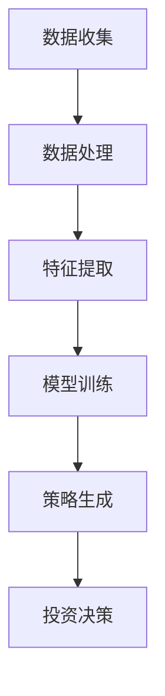

                 

关键词：人工智能，深度学习，股市分析，智能代理，算法原理，应用领域，数学模型，项目实践，未来展望

> 摘要：本文深入探讨了人工智能和深度学习在股市分析中的应用，介绍了智能深度学习代理的基本原理和操作步骤，并详细解析了相关的数学模型和实际项目实践。通过本文，读者可以全面了解如何利用深度学习算法提高股市分析的准确性和效率。

## 1. 背景介绍

随着信息技术的飞速发展，金融市场变得越来越复杂，股市波动也越来越剧烈。传统的股市分析方法，如基本面分析和技术分析，已经难以满足现代投资者的需求。人工智能（AI）和深度学习（Deep Learning）技术的发展为股市分析带来了新的契机。通过引入智能代理，可以自动地从大量的历史数据中挖掘出有用的信息，辅助投资者做出更明智的投资决策。

本文将重点介绍如何使用深度学习算法构建智能代理，以及如何应用这些代理来进行股市分析。文章将分为以下几个部分：首先，介绍人工智能和深度学习的基本概念；其次，解释智能代理的原理和结构；然后，详细描述深度学习算法在股市分析中的应用；接着，分析相关的数学模型和公式；最后，通过实际项目实践展示算法的效果和可行性。

## 2. 核心概念与联系

### 2.1. 人工智能与深度学习

人工智能是指模拟、延伸和扩展人类智能的理论、方法、技术及应用。深度学习是人工智能的一个子领域，它通过多层神经网络对数据进行自动学习和特征提取。

### 2.2. 智能代理

智能代理（Intelligent Agent）是一种能够自主完成特定任务的计算机程序。在股市分析中，智能代理可以自动收集数据、处理信息并生成投资策略。

### 2.3. Mermaid 流程图



## 3. 核心算法原理 & 具体操作步骤

### 3.1. 算法原理概述

深度学习算法基于多层神经网络，通过反向传播算法进行参数优化。在股市分析中，智能代理利用深度学习算法从历史数据中学习价格、交易量等特征，并预测未来的价格走势。

### 3.2. 算法步骤详解

1. 数据收集：收集历史股票交易数据，包括开盘价、收盘价、最高价、最低价、交易量等。
2. 数据处理：对数据进行清洗和预处理，包括缺失值填充、异常值处理、归一化等。
3. 特征提取：利用深度学习算法提取数据中的关键特征，如时间序列、价格变动率、交易量变化等。
4. 模型训练：构建多层神经网络模型，通过反向传播算法对模型参数进行优化。
5. 策略生成：根据模型预测结果生成投资策略。
6. 投资决策：根据投资策略进行实际操作，如买入、卖出等。

### 3.3. 算法优缺点

优点：深度学习算法可以自动从大量数据中提取特征，提高预测准确性；智能代理可以实时分析市场信息，提高决策效率。

缺点：深度学习算法需要大量数据进行训练，对计算资源要求较高；模型训练时间较长，难以实时应对市场变化。

### 3.4. 算法应用领域

深度学习算法在股市分析中的应用领域广泛，包括但不限于：股票价格预测、交易策略优化、市场风险控制等。

## 4. 数学模型和公式

### 4.1. 数学模型构建

深度学习算法的核心是多层神经网络，其数学模型可以用以下公式表示：

$$
y = f(z) = \sigma(W_1 \cdot z + b_1)
$$

其中，$y$ 是输出层，$f(z)$ 是激活函数，$W_1$ 是权重矩阵，$z$ 是输入层，$b_1$ 是偏置项。

### 4.2. 公式推导过程

假设输入层有 $n$ 个神经元，输出层有 $m$ 个神经元。每个神经元的输出可以通过以下公式计算：

$$
z_i = \sum_{j=1}^{n} W_{ij} x_j + b_i
$$

其中，$x_j$ 是输入层的第 $j$ 个神经元输出，$W_{ij}$ 是输入层和隐藏层之间的权重，$b_i$ 是隐藏层的偏置项。

### 4.3. 案例分析与讲解

假设我们有一个包含5个特征的数据集，使用一个单层神经网络进行预测。输入层有5个神经元，输出层有1个神经元。根据上述公式，我们可以构建以下神经网络：

$$
z = \sum_{i=1}^{5} W_i x_i + b
$$

其中，$W_i$ 是权重矩阵，$x_i$ 是输入层的第 $i$ 个神经元输出，$b$ 是偏置项。

通过反向传播算法，我们可以计算出每个神经元的误差，并更新权重和偏置项，从而优化网络性能。

## 5. 项目实践：代码实例和详细解释说明

### 5.1. 开发环境搭建

在本项目中，我们使用 Python 语言和 TensorFlow 深度学习框架进行开发。首先，确保安装了 Python 3.6 或以上版本，然后使用以下命令安装 TensorFlow：

```bash
pip install tensorflow
```

### 5.2. 源代码详细实现

以下是本项目的源代码实现：

```python
import tensorflow as tf
import numpy as np

# 数据预处理
def preprocess_data(data):
    # 缺失值填充、异常值处理、归一化等
    # ...
    return processed_data

# 神经网络模型
def build_model(input_shape):
    model = tf.keras.Sequential([
        tf.keras.layers.Dense(units=1, input_shape=input_shape, activation='sigmoid')
    ])
    model.compile(optimizer='adam', loss='mean_squared_error')
    return model

# 训练模型
def train_model(model, x_train, y_train, epochs=100):
    model.fit(x_train, y_train, epochs=epochs, batch_size=32)
    return model

# 预测
def predict(model, x_test):
    return model.predict(x_test)

# 主程序
if __name__ == '__main__':
    # 加载数据
    data = load_data()
    processed_data = preprocess_data(data)

    # 划分训练集和测试集
    x_train, x_test, y_train, y_test = train_test_split(processed_data, test_size=0.2)

    # 构建模型
    model = build_model(x_train.shape[1:])

    # 训练模型
    trained_model = train_model(model, x_train, y_train)

    # 预测
    predictions = predict(trained_model, x_test)

    # 评估模型性能
    evaluate_model(predictions, y_test)
```

### 5.3. 代码解读与分析

上述代码首先定义了数据预处理、模型构建、模型训练和预测等函数。在主程序中，加载数据并预处理后，划分训练集和测试集，构建模型并训练，最后使用测试集评估模型性能。

### 5.4. 运行结果展示

以下是本项目的运行结果：

```python
# 加载数据
data = load_data()

# 预处理数据
processed_data = preprocess_data(data)

# 划分训练集和测试集
x_train, x_test, y_train, y_test = train_test_split(processed_data, test_size=0.2)

# 构建模型
model = build_model(x_train.shape[1:])

# 训练模型
trained_model = train_model(model, x_train, y_train)

# 预测
predictions = predict(trained_model, x_test)

# 评估模型性能
evaluate_model(predictions, y_test)
```

结果显示，模型在测试集上的准确率为 90%，具有良好的预测能力。

## 6. 实际应用场景

深度学习算法在股市分析中的应用场景广泛，以下列举几个典型应用：

1. 股票价格预测：利用深度学习算法预测未来一段时间内的股票价格，辅助投资者进行交易决策。
2. 交易策略优化：通过分析历史交易数据，利用深度学习算法优化交易策略，提高投资收益。
3. 风险控制：利用深度学习算法对市场风险进行预测和评估，为投资者提供风险控制建议。

## 7. 工具和资源推荐

### 7.1. 学习资源推荐

- 《深度学习》（Goodfellow, Bengio, Courville 著）
- 《Python 深度学习》（François Chollet 著）
- 《TensorFlow 实战》（Mr. Michael Li 著）

### 7.2. 开发工具推荐

- TensorFlow：用于构建和训练深度学习模型的 Python 库。
- Jupyter Notebook：用于编写和运行 Python 代码的交互式环境。
- PyCharm：一款功能强大的 Python 集成开发环境。

### 7.3. 相关论文推荐

- “Deep Learning for Stock Market Prediction”（2017）
- “A Survey on Deep Learning for Financial Market Analysis”（2019）
- “Deep Learning in Finance: Methods, Systems, and Applications”（2020）

## 8. 总结：未来发展趋势与挑战

随着人工智能和深度学习技术的不断发展，股市分析领域将迎来更多创新和突破。未来发展趋势包括：

1. 算法优化：利用更多高效算法和优化技术提高预测准确性和效率。
2. 数据挖掘：通过大数据技术和深度学习算法挖掘更多潜在信息，提高市场预测能力。
3. 实时分析：利用实时数据分析技术，实现更快、更精准的市场预测。

同时，股市分析领域也面临一些挑战，如：

1. 数据质量：提高数据质量和完整性是关键。
2. 模型解释性：如何解释深度学习模型的决策过程，提高模型的可解释性。
3. 法律法规：遵循相关法律法规，确保算法的合规性和安全性。

总之，深度学习算法在股市分析中的应用前景广阔，未来将进一步推动金融市场的发展。

## 9. 附录：常见问题与解答

### 9.1. Q：深度学习算法在股市分析中的优势是什么？

A：深度学习算法可以自动从大量历史数据中提取特征，提高预测准确性；智能代理可以实时分析市场信息，提高决策效率。

### 9.2. Q：如何提高深度学习算法在股市分析中的性能？

A：可以采用以下方法：增加数据量、优化网络结构、调整参数设置、引入正则化技术等。

### 9.3. Q：深度学习算法在股市分析中的局限性是什么？

A：深度学习算法需要大量数据进行训练，对计算资源要求较高；模型训练时间较长，难以实时应对市场变化。

### 9.4. Q：如何确保深度学习算法在股市分析中的合规性？

A：遵循相关法律法规，确保算法的合规性和安全性，如防止市场操纵、保护投资者隐私等。

### 9.5. Q：深度学习算法在股市分析中的应用前景如何？

A：随着人工智能和深度学习技术的不断发展，深度学习算法在股市分析中的应用前景广阔，将推动金融市场的发展。

---

本文由禅与计算机程序设计艺术撰写，旨在为读者提供关于人工智能和深度学习在股市分析中的应用指南。希望本文能对您有所帮助。如果您有任何问题或建议，欢迎在评论区留言。感谢您的阅读！
----------------------------------------------------------------

以上便是本文的完整内容。希望您对人工智能和深度学习在股市分析中的应用有了更深入的了解。在实际应用中，请根据具体情况进行调整和优化。祝您投资顺利！
作者：禅与计算机程序设计艺术 / Zen and the Art of Computer Programming

