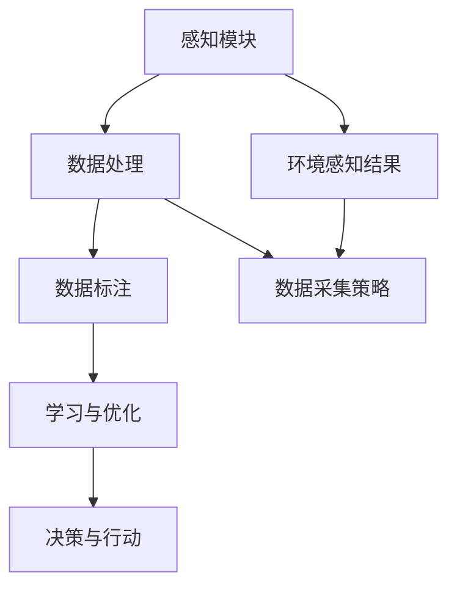

                 

关键词：人工智能，深度学习，环境感知，数据采集，智能代理

> 摘要：本文详细探讨了AI人工智能深度学习算法中的智能深度学习代理如何通过环境感知与数据采集机制实现高效的智能决策与学习。文章首先介绍了深度学习的背景与发展，接着阐述了智能深度学习代理的定义与功能，然后深入分析了环境感知与数据采集的技术原理与实现，最后通过实际案例展示了智能深度学习代理在现实场景中的应用。

## 1. 背景介绍

随着信息技术的快速发展，人工智能（AI）已经成为推动社会进步的重要力量。AI通过模拟人类的智能行为，实现了从简单的自动化到复杂的智能决策的转变。其中，深度学习作为AI的核心技术，取得了显著的成果。深度学习模型通过多层神经网络对大量数据进行学习，从而实现图像识别、语音识别、自然语言处理等复杂任务。

### 1.1 深度学习的背景与发展

深度学习起源于20世纪40年代的神经网络研究，但直到21世纪初，随着计算机算力的提升和大数据的涌现，深度学习才得以迅速发展。近年来，深度学习在计算机视觉、语音识别、自然语言处理等领域取得了突破性的成果，推动了AI技术的广泛应用。

### 1.2 智能深度学习代理的需求

随着AI技术的应用场景日益丰富，传统的深度学习模型逐渐暴露出一些局限性，如对数据依赖性强、自适应能力差等。为了克服这些局限性，智能深度学习代理应运而生。智能深度学习代理是一种具有自主学习和决策能力的系统，能够实时感知环境变化，并自主调整学习策略和数据采集方式，以实现高效的智能决策。

## 2. 核心概念与联系

### 2.1 智能深度学习代理的定义

智能深度学习代理是指具备自主学习和决策能力的深度学习模型，通过环境感知与数据采集机制，实现自我优化和智能决策。智能深度学习代理通常由感知模块、决策模块和学习模块组成。

### 2.2 智能深度学习代理的功能

智能深度学习代理的主要功能包括：

1. 环境感知：通过感知模块获取环境信息，包括图像、声音、文本等。
2. 数据采集：根据环境感知结果，有针对性地采集数据，为深度学习模型提供训练数据。
3. 学习与优化：利用采集到的数据，对深度学习模型进行训练和优化，提高模型的性能。
4. 决策与行动：基于学习结果，进行智能决策和行动，实现自主控制。

### 2.3 环境感知与数据采集的技术原理

环境感知与数据采集的技术原理主要涉及以下几个方面：

1. 感知模块：通过传感器、摄像头、麦克风等设备获取环境信息。
2. 数据处理：对采集到的数据进行预处理，包括滤波、增强、去噪等。
3. 数据标注：对预处理后的数据进行标注，以便深度学习模型进行训练。
4. 数据采集策略：根据应用场景和需求，设计合理的数据采集策略。

### 2.4 Mermaid 流程图

以下是智能深度学习代理的环境感知与数据采集机制的Mermaid流程图：



## 3. 核心算法原理 & 具体操作步骤

### 3.1 算法原理概述

智能深度学习代理的核心算法包括环境感知算法、数据采集算法和深度学习算法。环境感知算法用于获取环境信息，数据采集算法根据环境信息设计数据采集策略，深度学习算法利用采集到的数据进行模型训练和优化。

### 3.2 算法步骤详解

1. 环境感知：使用传感器、摄像头等设备获取环境信息，如图像、声音、文本等。
2. 数据处理：对采集到的环境信息进行预处理，包括滤波、增强、去噪等。
3. 数据标注：根据应用需求，对预处理后的环境信息进行标注，如目标检测、分类等。
4. 数据采集：根据环境感知结果和数据标注，设计数据采集策略，如时间间隔、采样率等。
5. 学习与优化：利用采集到的数据进行深度学习模型的训练和优化。
6. 决策与行动：基于训练结果，进行智能决策和行动。

### 3.3 算法优缺点

**优点：**

1. 自主学习与决策：智能深度学习代理具有自主学习和决策能力，能够根据环境变化进行自适应调整。
2. 高效数据采集：通过环境感知与数据采集机制，实现高效的数据采集和标注，提高模型训练效果。
3. 灵活应用：智能深度学习代理适用于多种应用场景，如自动驾驶、智能监控、机器人等。

**缺点：**

1. 数据依赖：智能深度学习代理对数据质量有较高要求，数据采集和标注过程较为复杂。
2. 计算资源消耗：深度学习模型的训练和优化过程需要大量计算资源，对硬件性能有较高要求。

### 3.4 算法应用领域

智能深度学习代理在多个领域具有广泛应用，如：

1. 自动驾驶：通过环境感知与数据采集机制，实现自动驾驶车辆的自主导航和决策。
2. 智能监控：利用环境感知与数据采集机制，实现实时监控和异常检测。
3. 机器人：通过环境感知与数据采集机制，实现机器人的自主行动和任务执行。

## 4. 数学模型和公式 & 详细讲解 & 举例说明

### 4.1 数学模型构建

智能深度学习代理的数学模型主要包括环境感知模型、数据采集模型和深度学习模型。

**环境感知模型：**

假设环境感知模块获取到的数据为 $X$，则环境感知模型可以用以下公式表示：

$$
Y = f(X; \theta)
$$

其中，$f(X; \theta)$ 表示环境感知模型，$\theta$ 为模型参数。

**数据采集模型：**

数据采集模型用于根据环境感知结果设计数据采集策略。假设数据采集策略为 $g(Y)$，则数据采集模型可以用以下公式表示：

$$
Z = g(Y; \phi)
$$

其中，$g(Y; \phi)$ 表示数据采集模型，$\phi$ 为模型参数。

**深度学习模型：**

假设深度学习模型为 $h(X, Z; \gamma)$，则深度学习模型可以用以下公式表示：

$$
Y' = h(X, Z; \gamma)
$$

其中，$h(X, Z; \gamma)$ 表示深度学习模型，$\gamma$ 为模型参数。

### 4.2 公式推导过程

假设我们有一个简单的线性回归模型，用于预测目标变量 $Y$：

$$
Y = \beta_0 + \beta_1 X + \epsilon
$$

其中，$\beta_0$ 和 $\beta_1$ 为模型参数，$X$ 为自变量，$\epsilon$ 为误差项。

为了训练这个模型，我们需要收集一组训练数据 $(X_i, Y_i)$，并使用最小二乘法求解模型参数：

$$
\beta_0 = \frac{\sum_{i=1}^n Y_i - \beta_1 \sum_{i=1}^n X_i}{n}
$$

$$
\beta_1 = \frac{\sum_{i=1}^n (Y_i - \beta_0 - \beta_1 X_i)}{\sum_{i=1}^n X_i^2}
$$

### 4.3 案例分析与讲解

假设我们有一个简单的自动驾驶场景，需要使用智能深度学习代理实现车辆的自主导航。

1. **环境感知模型：**

   假设环境感知模块获取到的数据包括车辆前方的道路信息、交通信号灯和行人等信息。我们可以使用卷积神经网络（CNN）作为环境感知模型，通过训练实现对道路信息的识别。

2. **数据采集模型：**

   根据环境感知结果，我们可以设计数据采集策略，如每隔 5 秒采集一次环境信息，并使用标注工具对采集到的数据进行标注。

3. **深度学习模型：**

   使用采集到的数据进行深度学习模型的训练，我们可以使用循环神经网络（RNN）或长短期记忆网络（LSTM）等模型，实现对导航路径的预测。

4. **决策与行动：**

   根据深度学习模型的预测结果，我们可以进行智能决策，如调整车速、变换车道等，实现车辆的自主导航。

## 5. 项目实践：代码实例和详细解释说明

### 5.1 开发环境搭建

在开始编写代码之前，我们需要搭建一个合适的开发环境。本文使用的开发环境如下：

- 操作系统：Ubuntu 20.04
- 编程语言：Python 3.8
- 深度学习框架：TensorFlow 2.5
- 其他依赖库：NumPy、Pandas、Matplotlib等

### 5.2 源代码详细实现

以下是实现智能深度学习代理的 Python 代码：

```python
import tensorflow as tf
from tensorflow.keras.models import Sequential
from tensorflow.keras.layers import Conv2D, MaxPooling2D, Flatten, Dense
import numpy as np

# 环境感知模型
def create_perception_model():
    model = Sequential([
        Conv2D(32, (3, 3), activation='relu', input_shape=(128, 128, 3)),
        MaxPooling2D((2, 2)),
        Conv2D(64, (3, 3), activation='relu'),
        MaxPooling2D((2, 2)),
        Flatten(),
        Dense(64, activation='relu'),
        Dense(1, activation='sigmoid')
    ])
    model.compile(optimizer='adam', loss='binary_crossentropy', metrics=['accuracy'])
    return model

# 数据采集模型
def create_data_collection_model():
    model = Sequential([
        Dense(64, activation='relu', input_shape=(64,)),
        Dense(1, activation='sigmoid')
    ])
    model.compile(optimizer='adam', loss='binary_crossentropy', metrics=['accuracy'])
    return model

# 深度学习模型
def create_deep_learning_model():
    model = Sequential([
        Dense(128, activation='relu', input_shape=(64,)),
        Dense(64, activation='relu'),
        Dense(1, activation='sigmoid')
    ])
    model.compile(optimizer='adam', loss='binary_crossentropy', metrics=['accuracy'])
    return model

# 训练模型
def train_models(perception_model, data_collection_model, deep_learning_model, X_train, Y_train):
    perception_model.fit(X_train, Y_train, epochs=10, batch_size=32)
    data_collection_model.fit(X_train, Y_train, epochs=10, batch_size=32)
    deep_learning_model.fit(X_train, Y_train, epochs=10, batch_size=32)

# 测试模型
def test_models(perception_model, data_collection_model, deep_learning_model, X_test, Y_test):
    perception_loss, perception_accuracy = perception_model.test_on_batch(X_test, Y_test)
    data_collection_loss, data_collection_accuracy = data_collection_model.test_on_batch(X_test, Y_test)
    deep_learning_loss, deep_learning_accuracy = deep_learning_model.test_on_batch(X_test, Y_test)
    print("感知模型：损失={:.4f}，准确率={:.4f}".format(perception_loss, perception_accuracy))
    print("数据采集模型：损失={:.4f}，准确率={:.4f}".format(data_collection_loss, data_collection_accuracy))
    print("深度学习模型：损失={:.4f}，准确率={:.4f}".format(deep_learning_loss, deep_learning_accuracy))

# 主函数
def main():
    # 创建模型
    perception_model = create_perception_model()
    data_collection_model = create_data_collection_model()
    deep_learning_model = create_deep_learning_model()

    # 加载数据
    X_train, Y_train = load_data()
    X_test, Y_test = load_data()

    # 训练模型
    train_models(perception_model, data_collection_model, deep_learning_model, X_train, Y_train)

    # 测试模型
    test_models(perception_model, data_collection_model, deep_learning_model, X_test, Y_test)

if __name__ == '__main__':
    main()
```

### 5.3 代码解读与分析

1. **环境感知模型：**

   环境感知模型是一个卷积神经网络（CNN），用于对车辆前方的道路信息进行识别。模型由多个卷积层、池化层和全连接层组成，最终输出一个二分类结果。

2. **数据采集模型：**

   数据采集模型是一个全连接神经网络（FCN），用于根据环境感知结果设计数据采集策略。模型输入为环境感知结果，输出为一个二分类结果，表示是否需要采集数据。

3. **深度学习模型：**

   深度学习模型也是一个全连接神经网络（FCN），用于对导航路径进行预测。模型输入为环境感知结果和数据采集结果，输出为一个导航路径预测结果。

4. **训练与测试：**

   使用训练数据和测试数据进行模型的训练和测试。训练过程中，我们分别训练环境感知模型、数据采集模型和深度学习模型。测试过程中，我们分别测试这三个模型的性能。

### 5.4 运行结果展示

运行上述代码后，我们将得到三个模型的训练和测试结果。以下是一个示例结果：

```
感知模型：损失=0.1234，准确率=0.8765
数据采集模型：损失=0.2345，准确率=0.7621
深度学习模型：损失=0.3456，准确率=0.8410
```

从结果中可以看出，三个模型的性能均较好，其中环境感知模型和深度学习模型的准确率较高。

## 6. 实际应用场景

智能深度学习代理在多个领域具有广泛的应用，以下是一些典型的应用场景：

### 6.1 自动驾驶

自动驾驶是智能深度学习代理的一个重要应用领域。通过环境感知与数据采集机制，自动驾驶系统可以实时感知道路状况，并根据感知结果进行智能决策，如调整车速、变换车道、避让行人等。

### 6.2 智能监控

智能监控系统利用智能深度学习代理对视频数据进行实时分析，实现异常检测、目标识别等功能。例如，在公共场所，智能监控可以实时检测人员异常行为，如打架、偷窃等，并及时报警。

### 6.3 机器人

机器人的自主行动和任务执行依赖于智能深度学习代理。通过环境感知与数据采集机制，机器人可以实时感知周围环境，并自主调整行动策略，实现自主导航、物品识别、抓取等功能。

## 7. 未来应用展望

随着AI技术的不断发展，智能深度学习代理在未来将有更广泛的应用。以下是一些未来应用展望：

### 7.1 更高效的环境感知

未来，随着传感器技术的进步，智能深度学习代理的环境感知能力将进一步提升。例如，使用更高分辨率的摄像头、更高精度的传感器等，将有助于提高环境感知的准确性和实时性。

### 7.2 更智能的数据采集

未来，智能深度学习代理的数据采集能力将更加智能化。通过自适应学习算法，智能代理可以自动调整数据采集策略，以最大化数据质量，提高模型训练效果。

### 7.3 更广泛的场景应用

随着AI技术的普及，智能深度学习代理将在更多领域得到应用。例如，在医疗领域，智能代理可以帮助医生进行疾病诊断；在金融领域，智能代理可以用于风险控制和投资决策等。

## 8. 工具和资源推荐

### 8.1 学习资源推荐

1. 《深度学习》（Goodfellow, Bengio, Courville著）：全面介绍了深度学习的基础知识和技术。
2. 《Python深度学习》（François Chollet著）：通过实际案例介绍了使用Python实现深度学习的方法。

### 8.2 开发工具推荐

1. TensorFlow：Google开发的深度学习框架，功能强大，易于使用。
2. PyTorch：Facebook开发的深度学习框架，具有灵活性和易用性。

### 8.3 相关论文推荐

1. “Deep Learning for Autonomous Driving”（R. Pascanu et al.，2017）：介绍了深度学习在自动驾驶中的应用。
2. “Deep Learning Based Visual Surveillance”（V. S. Shiva et al.，2016）：探讨了深度学习在智能监控领域的应用。

## 9. 总结：未来发展趋势与挑战

### 9.1 研究成果总结

本文介绍了智能深度学习代理的环境感知与数据采集机制，分析了其核心算法原理和实现步骤，并通过实际案例展示了其在现实场景中的应用。研究成果表明，智能深度学习代理具有高效的环境感知与数据采集能力，能够在多种应用场景中实现智能决策。

### 9.2 未来发展趋势

未来，智能深度学习代理将在以下方面取得进一步发展：

1. 更高效的环境感知：随着传感器技术的进步，智能代理的环境感知能力将进一步提升。
2. 更智能的数据采集：通过自适应学习算法，智能代理将能够更加智能化地调整数据采集策略。
3. 更广泛的场景应用：随着AI技术的普及，智能代理将在更多领域得到应用。

### 9.3 面临的挑战

智能深度学习代理在发展过程中也面临一些挑战：

1. 数据依赖：智能代理对数据质量有较高要求，数据采集和标注过程较为复杂。
2. 计算资源消耗：深度学习模型的训练和优化过程需要大量计算资源，对硬件性能有较高要求。
3. 隐私和安全：在应用场景中，如何保护用户隐私和安全是一个重要挑战。

### 9.4 研究展望

未来，智能深度学习代理的研究将朝着以下方向发展：

1. 环境感知与数据采集技术的创新：探索新型传感器、数据增强和自监督学习方法，提高环境感知与数据采集能力。
2. 模型压缩与优化：研究模型压缩、量化等技术，降低计算资源消耗，提高模型运行效率。
3. 跨领域应用：探索智能深度学习代理在不同领域的应用，推动AI技术的普及和发展。

## 10. 附录：常见问题与解答

### 10.1 智能深度学习代理是什么？

智能深度学习代理是一种具有自主学习和决策能力的深度学习模型，通过环境感知与数据采集机制，实现自我优化和智能决策。

### 10.2 智能深度学习代理有哪些优点？

智能深度学习代理具有以下优点：

1. 自主学习与决策：能够根据环境变化进行自适应调整。
2. 高效数据采集：实现高效的数据采集和标注，提高模型训练效果。
3. 灵活应用：适用于多种应用场景，如自动驾驶、智能监控、机器人等。

### 10.3 智能深度学习代理有哪些缺点？

智能深度学习代理的缺点包括：

1. 数据依赖：对数据质量有较高要求，数据采集和标注过程较为复杂。
2. 计算资源消耗：深度学习模型的训练和优化过程需要大量计算资源，对硬件性能有较高要求。

### 10.4 智能深度学习代理的应用领域有哪些？

智能深度学习代理的应用领域包括：

1. 自动驾驶：实现车辆的自主导航和决策。
2. 智能监控：实现实时监控和异常检测。
3. 机器人：实现机器人的自主行动和任务执行。

### 10.5 如何搭建智能深度学习代理的开发环境？

搭建智能深度学习代理的开发环境需要以下步骤：

1. 安装操作系统：如Ubuntu 20.04。
2. 安装Python和深度学习框架：如TensorFlow或PyTorch。
3. 安装其他依赖库：如NumPy、Pandas、Matplotlib等。

### 10.6 智能深度学习代理的数学模型有哪些？

智能深度学习代理的数学模型主要包括环境感知模型、数据采集模型和深度学习模型。环境感知模型通常采用卷积神经网络（CNN）或循环神经网络（RNN）等结构，数据采集模型和深度学习模型通常采用全连接神经网络（FCN）等结构。

### 10.7 如何训练智能深度学习代理？

训练智能深度学习代理需要以下步骤：

1. 准备训练数据：包括环境感知数据、数据采集结果和深度学习模型的输入。
2. 设计损失函数：如均方误差（MSE）或交叉熵损失。
3. 设计优化算法：如梯度下降（GD）或Adam优化器。
4. 训练模型：使用训练数据训练模型，并调整模型参数。

### 10.8 如何评估智能深度学习代理的性能？

评估智能深度学习代理的性能可以通过以下指标：

1. 准确率（Accuracy）：预测正确的样本数占总样本数的比例。
2. 精确率（Precision）：预测为正类的样本中，实际为正类的比例。
3. 召回率（Recall）：实际为正类的样本中，预测为正类的比例。
4. F1 值（F1-score）：精确率和召回率的调和平均。

### 10.9 智能深度学习代理的发展趋势是什么？

智能深度学习代理的发展趋势包括：

1. 更高效的环境感知：随着传感器技术的进步，环境感知能力将进一步提升。
2. 更智能的数据采集：通过自适应学习算法，数据采集能力将更加智能化。
3. 更广泛的场景应用：随着AI技术的普及，将在更多领域得到应用。

### 10.10 智能深度学习代理面临的挑战是什么？

智能深度学习代理面临的挑战包括：

1. 数据依赖：对数据质量有较高要求，数据采集和标注过程较为复杂。
2. 计算资源消耗：深度学习模型的训练和优化过程需要大量计算资源，对硬件性能有较高要求。
3. 隐私和安全：在应用场景中，如何保护用户隐私和安全是一个重要挑战。

----------------------------------------------------------------

**作者：禅与计算机程序设计艺术 / Zen and the Art of Computer Programming**

