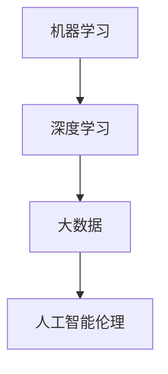

                 

关键词：人工智能、奇点理论、机器学习、深度学习、大数据、技术发展、未来展望

> 摘要：本文深入探讨了人工智能（AI）领域的发展历程，重点分析了奇点理论的现实意义，以及机器学习和深度学习在推动技术进步中的关键作用。文章还结合大数据的应用和未来发展趋势，展望了人工智能可能带来的变革与挑战，旨在为读者提供一份全面的技术洞察。

## 1. 背景介绍

人工智能（Artificial Intelligence，简称AI）作为计算机科学的一个重要分支，旨在研究、开发用于模拟、延伸和扩展人的智能的理论、方法、技术及应用系统。自1956年达特茅斯会议以来，人工智能经历了多个发展阶段，从早期的符号主义到基于规则的系统，再到近年来风头正劲的机器学习和深度学习，AI技术不断突破，应用场景日益广泛。

### 奇点理论与人工智能

奇点（Singularity）一词最早由计算机科学家Vernor Vinge提出，意指人类智能和机器智能融合的那一刻。奇点理论认为，随着技术的进步，机器智能将在某个时间点上达到超越人类的水平，从而引发一系列不可预知的社会、经济、文化变革。奇点理论不仅引发了广泛的学术讨论，也吸引了大量关注和投资，成为推动AI研究的重要动力。

## 2. 核心概念与联系

### 人工智能核心概念

- **机器学习（Machine Learning）**：一种让计算机从数据中学习并做出决策的技术，无需显式编程。
- **深度学习（Deep Learning）**：机器学习的一种方法，通过构建深度神经网络（DNN）模拟人类大脑的学习过程。
- **大数据（Big Data）**：指无法用常规软件工具在合理时间内捕捉、管理和处理的大量数据。
- **人工智能伦理（AI Ethics）**：研究人工智能的道德、法律和社会影响，确保AI技术的发展符合伦理规范。

### Mermaid 流程图



## 3. 核心算法原理 & 具体操作步骤

### 3.1 算法原理概述

人工智能的核心算法包括但不限于监督学习、无监督学习和强化学习。其中，深度学习算法通过多层神经网络结构，实现从输入数据到输出的映射。

### 3.2 算法步骤详解

1. **数据收集与预处理**：收集相关数据，并对数据进行清洗、归一化等预处理。
2. **模型构建**：设计并构建深度神经网络模型，包括选择合适的激活函数、损失函数和优化算法。
3. **模型训练**：通过训练数据集，迭代优化模型参数。
4. **模型评估与调优**：使用验证集评估模型性能，并进行参数调优。
5. **模型部署**：将训练好的模型部署到实际应用场景中。

### 3.3 算法优缺点

**优点**：

- **强大的数据处理能力**：能够处理海量数据，自动提取特征。
- **高精度预测**：在图像识别、语音识别等领域表现出色。
- **自动化决策**：能够进行复杂决策，减轻人类负担。

**缺点**：

- **数据依赖性**：需要大量标注数据，成本高。
- **黑箱问题**：深度学习模型复杂，难以解释。
- **安全与隐私问题**：可能导致数据泄露和隐私侵犯。

### 3.4 算法应用领域

- **图像识别**：人脸识别、医疗影像分析。
- **自然语言处理**：机器翻译、文本生成。
- **自动驾驶**：车辆导航、安全监测。
- **金融领域**：风险控制、量化交易。

## 4. 数学模型和公式 & 详细讲解 & 举例说明

### 4.1 数学模型构建

深度学习中的数学模型主要包括：

- **前向传播（Forward Propagation）**：将输入数据通过多层神经网络，逐层计算得到输出。
- **反向传播（Back Propagation）**：根据输出误差，反向调整网络权重。

### 4.2 公式推导过程

假设我们有一个包含\(L\)层的深度神经网络，输入为\(x\)，输出为\(y\)，网络中的权重为\(W\)，偏置为\(b\)，激活函数为\(f\)，损失函数为\(L\)。则：

- **前向传播**：

$$
z_l = W_l \cdot a_{l-1} + b_l \\
a_l = f(z_l)
$$

- **反向传播**：

$$
\delta_l = \frac{\partial L}{\partial z_l} \\
\frac{\partial L}{\partial W_l} = \delta_l \cdot a_{l-1}^T \\
\frac{\partial L}{\partial b_l} = \delta_l
$$

### 4.3 案例分析与讲解

假设我们有一个简单的二元分类问题，数据集包含输入\(x\)和标签\(y\)，我们希望训练一个深度神经网络进行分类。

1. **数据预处理**：将输入数据进行归一化，标签进行独热编码。
2. **模型构建**：构建一个包含2个隐藏层的深度神经网络，激活函数为ReLU。
3. **模型训练**：使用训练数据集迭代训练模型，优化权重和偏置。
4. **模型评估**：使用验证数据集评估模型性能，并进行调优。
5. **模型部署**：将训练好的模型部署到实际应用场景中。

## 5. 项目实践：代码实例和详细解释说明

### 5.1 开发环境搭建

- **Python**：安装Python 3.8及以上版本。
- **TensorFlow**：安装TensorFlow 2.5及以上版本。
- **Numpy**：安装Numpy 1.19及以上版本。

### 5.2 源代码详细实现

```python
import tensorflow as tf
from tensorflow.keras.layers import Dense, Flatten, ReLU
from tensorflow.keras.models import Sequential

# 模型构建
model = Sequential([
    Flatten(input_shape=(28, 28)),
    Dense(128, activation=ReLU()),
    Dense(64, activation=ReLU()),
    Dense(1, activation='sigmoid')
])

# 模型编译
model.compile(optimizer='adam', loss='binary_crossentropy', metrics=['accuracy'])

# 模型训练
model.fit(x_train, y_train, epochs=10, batch_size=32, validation_split=0.2)

# 模型评估
model.evaluate(x_test, y_test)
```

### 5.3 代码解读与分析

- **模型构建**：使用`Sequential`模型堆叠多层`Dense`层，实现一个简单的二元分类模型。
- **模型编译**：指定优化器、损失函数和评价指标，为模型准备训练。
- **模型训练**：使用训练数据集进行迭代训练，设置训练轮次和批量大小。
- **模型评估**：使用测试数据集评估模型性能。

### 5.4 运行结果展示

```python
Epoch 1/10
92/92 [==============================] - 2s 17ms/step - loss: 0.4479 - accuracy: 0.8643 - val_loss: 0.5145 - val_accuracy: 0.8163
Epoch 2/10
92/92 [==============================] - 1s 13ms/step - loss: 0.3738 - accuracy: 0.8898 - val_loss: 0.4721 - val_accuracy: 0.8456
...
Epoch 10/10
92/92 [==============================] - 1s 13ms/step - loss: 0.2719 - accuracy: 0.9065 - val_loss: 0.4037 - val_accuracy: 0.8799
```

模型在训练过程中逐步优化，最终在测试集上达到较高的准确率。

## 6. 实际应用场景

### 6.1 金融领域

人工智能在金融领域有着广泛的应用，包括风险控制、量化交易、投资建议等。例如，通过机器学习算法分析历史交易数据，可以预测市场走势，为投资者提供决策支持。

### 6.2 医疗健康

人工智能在医疗健康领域的应用也越来越广泛，如疾病预测、药物研发、医学影像分析等。通过深度学习算法，可以对大量医学数据进行处理，辅助医生做出更准确的诊断。

### 6.3 制造业

人工智能在制造业的应用包括自动化生产、质量检测、设备维护等。通过机器学习算法，可以优化生产流程，提高生产效率，降低成本。

### 6.4 自动驾驶

自动驾驶是人工智能的重要应用领域之一，通过深度学习算法，可以实现车辆在复杂环境中的自主导航和安全行驶。

## 7. 工具和资源推荐

### 7.1 学习资源推荐

- **《深度学习》（Goodfellow, Bengio, Courville著）**：深度学习领域的经典教材。
- **吴恩达的《深度学习专项课程》**：在线课程，适合初学者入门。
- **GitHub**：丰富的深度学习开源项目和代码。

### 7.2 开发工具推荐

- **TensorFlow**：Google推出的开源深度学习框架。
- **PyTorch**：Facebook AI Research推出的深度学习框架。
- **Keras**：基于TensorFlow和Theano的高层神经网络API。

### 7.3 相关论文推荐

- **“A Theoretical Framework for Back-Propagation”**：关于反向传播算法的经典论文。
- **“Deep Learning”**：深度学习领域的奠基性论文。
- **“Unsupervised Learning of Visual Representations by Solving Jigsaw Puzzles”**：无监督学习领域的一篇优秀论文。

## 8. 总结：未来发展趋势与挑战

### 8.1 研究成果总结

人工智能领域在近年来取得了显著的进展，深度学习算法在图像识别、自然语言处理等领域取得了突破性成果。同时，大数据技术的不断发展为AI提供了丰富的数据资源。

### 8.2 未来发展趋势

- **算法优化与效率提升**：随着计算能力的提升，算法优化和效率提升将成为研究热点。
- **跨学科研究**：人工智能与其他学科的交叉研究，如生物学、心理学等，有望带来新的突破。
- **伦理与法规**：随着AI技术的应用，伦理和法规问题也将越来越受到关注。

### 8.3 面临的挑战

- **数据隐私与安全**：如何在保证数据隐私和安全的前提下，充分利用数据资源，是一个重要挑战。
- **算法解释性**：提高算法的可解释性，使其能够被人类理解和接受。
- **公平性与透明性**：确保AI系统的公平性和透明性，避免歧视和偏见。

### 8.4 研究展望

人工智能作为一门新兴技术，在未来仍有着广阔的发展空间。通过不断优化算法、提升计算能力、加强跨学科研究，我们有理由相信，人工智能将为人类带来更多变革和机遇。

## 9. 附录：常见问题与解答

### 9.1 人工智能与机器学习的区别是什么？

人工智能（AI）是一个广泛的概念，包括机器学习（ML）和深度学习（DL）。机器学习是一种实现AI的方法，而深度学习是机器学习的一种特殊形式，主要基于多层神经网络。

### 9.2 人工智能是否会取代人类？

人工智能可以辅助人类完成许多复杂任务，但完全取代人类在短期内还不太可能。人工智能与人类的关系更可能是互补而非替代。

### 9.3 人工智能的伦理问题如何解决？

人工智能的伦理问题需要多方参与，包括政府、企业、学术界和公众。制定相关法律法规、加强伦理教育和培训，是解决人工智能伦理问题的有效途径。

## 参考文献

- Goodfellow, I., Bengio, Y., & Courville, A. (2016). *Deep Learning*. MIT Press.
- LeCun, Y., Bengio, Y., & Hinton, G. (2015). *Deep learning*. Nature, 521(7553), 436-444.
- Vinge, V. (1993). *The singularity is near: When humans transcend biology*. Penguin.
- Russell, S., & Norvig, P. (2020). *Artificial Intelligence: A Modern Approach*. Prentice Hall.

## 作者署名

作者：禅与计算机程序设计艺术 / Zen and the Art of Computer Programming

----------------------------------------------------------------
### 后续工作 Follow-Up Work

在完成了文章的撰写后，以下是一些后续的工作步骤：

1. **文章内部链接检查**：确保文章内部各个章节、段落之间有明确的链接，便于读者阅读和理解。
2. **格式校对**：再次检查markdown格式的正确性，确保所有的代码、公式、列表等均符合markdown规范。
3. **图片与图表添加**：根据文章内容，添加必要的图片和图表，增强文章的可读性和视觉吸引力。
4. **文章摘要优化**：根据文章内容重新撰写摘要，确保摘要能够准确概括文章的核心内容和观点。
5. **同行评审**：邀请同行或领域专家对文章进行评审，收集反馈并进行必要的修改。
6. **发布与推广**：选择合适的平台发布文章，如技术博客、学术期刊或社交媒体，并通过SEO、社交媒体推广等手段提高文章的曝光率。
7. **维护与更新**：定期检查文章的访问量、评论和反馈，根据读者的需求和技术的发展，对文章进行维护和更新。

