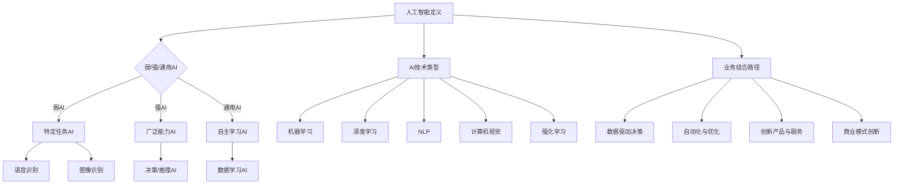
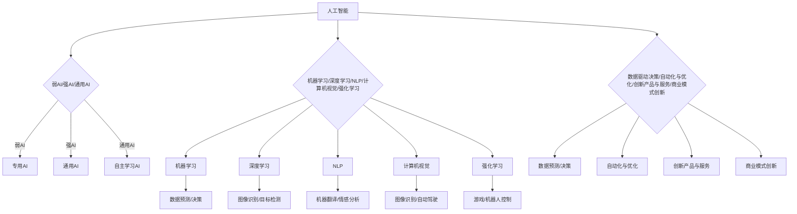

                 

关键词：人工智能，企业发展，技术趋势，创新应用，商业模式

> 摘要：本文将深入探讨人工智能（AI）企业在未来几年的发展方向，包括技术趋势、创新应用、商业模式变革以及面临的挑战。通过分析当前AI领域的研究进展和市场动态，本文旨在为读者提供对AI企业未来发展的全面洞察。

## 1. 背景介绍

随着技术的不断进步和数据的爆炸性增长，人工智能已经成为全球各大企业竞相布局的战略方向。AI技术不仅在传统行业如金融、医疗、制造业等领域实现了广泛的应用，还在新兴领域如自动驾驶、智能家居、机器人等方面展现出巨大的潜力。企业通过引入AI技术，不仅能提高生产效率，降低成本，还能创造全新的商业模式。

然而，随着AI技术的不断发展，企业在应用AI时也面临诸多挑战，包括数据隐私、算法透明度、伦理问题等。如何在充分利用AI技术优势的同时，有效应对这些挑战，成为AI企业未来发展的重要课题。

## 2. 核心概念与联系

为了更好地理解AI企业的未来发展，我们需要首先明确几个核心概念：

### 2.1 人工智能的定义与分类

人工智能（Artificial Intelligence，简称AI）是指由人创造出来的，能够模拟、延伸和扩展人类智能的理论、方法、技术及应用系统。根据AI的智能程度和实现方式，可以将其分为以下几类：

- **弱人工智能**（Narrow AI）：专注于特定任务的AI，如语音识别、图像识别等。
- **强人工智能**（General AI）：具备人类智能的广泛能力，能够在各种复杂环境下进行决策和推理。
- **通用人工智能**（AGI）：不仅具备强人工智能的能力，还能自主学习、适应新环境和任务。

### 2.2 AI技术的主要类型

AI技术主要分为以下几类：

- **机器学习**（Machine Learning）：通过训练模型，让计算机从数据中学习并做出预测或决策。
- **深度学习**（Deep Learning）：一种特殊的机器学习方法，通过多层神经网络实现更复杂的任务。
- **自然语言处理**（Natural Language Processing，简称NLP）：使计算机能够理解和生成人类语言。
- **计算机视觉**（Computer Vision）：使计算机能够理解和解析视觉信息。
- **强化学习**（Reinforcement Learning）：通过奖励机制，让计算机在特定环境中学习最优策略。

### 2.3 AI与业务结合的路径

企业将AI技术应用于业务时，可以遵循以下路径：

- **数据驱动决策**：利用AI技术分析海量数据，帮助企业做出更明智的决策。
- **自动化与优化**：通过自动化技术和算法优化，提高生产效率和降低成本。
- **创新产品与服务**：结合AI技术，开发全新的产品和服务，满足用户需求。
- **商业模式创新**：利用AI技术改变传统的商业模式，创造新的收入来源。

### 2.4 AI技术的Mermaid流程图



## 3. 核心算法原理 & 具体操作步骤

### 3.1 算法原理概述

在AI企业中，常用的核心算法包括机器学习算法、深度学习算法和自然语言处理算法。以下分别对这些算法的原理进行概述。

#### 3.1.1 机器学习算法

机器学习算法的核心思想是通过训练模型，使计算机从数据中学习并做出预测或决策。常见的机器学习算法包括线性回归、决策树、随机森林、支持向量机等。

- **线性回归**：通过建立线性关系模型，预测连续值输出。
- **决策树**：通过树的分叉结构，将数据划分为不同的类别或数值。
- **随机森林**：通过随机森林模型，提高分类和回归的预测准确性。
- **支持向量机**：通过找到最优分类超平面，实现分类任务。

#### 3.1.2 深度学习算法

深度学习算法是一种特殊的机器学习方法，通过多层神经网络实现更复杂的任务。常见的深度学习算法包括卷积神经网络（CNN）、循环神经网络（RNN）和生成对抗网络（GAN）。

- **卷积神经网络**：通过卷积层、池化层和全连接层，实现图像分类、目标检测等任务。
- **循环神经网络**：通过循环结构，处理序列数据，如语音识别、机器翻译等。
- **生成对抗网络**：通过生成器和判别器的对抗训练，实现图像生成、风格迁移等任务。

#### 3.1.3 自然语言处理算法

自然语言处理算法使计算机能够理解和生成人类语言。常见的自然语言处理算法包括词向量、序列标注、注意力机制等。

- **词向量**：将单词表示为高维向量，实现文本表示和相似性计算。
- **序列标注**：对文本序列进行分类标注，如命名实体识别、情感分析等。
- **注意力机制**：在处理序列数据时，自动关注重要的部分，提高模型的性能。

### 3.2 算法步骤详解

以下以线性回归算法为例，详细解释算法的操作步骤。

#### 3.2.1 数据预处理

- **数据收集**：收集包含输入特征和目标值的训练数据。
- **数据清洗**：去除缺失值、异常值和重复数据，保证数据质量。
- **特征工程**：对输入特征进行归一化、标准化等处理，提高模型性能。

#### 3.2.2 模型训练

- **初始化模型参数**：随机初始化模型的权重和偏置。
- **前向传播**：计算输入特征通过模型得到的预测值。
- **计算损失函数**：计算预测值与真实值之间的差距，得到损失函数的值。
- **反向传播**：更新模型参数，降低损失函数的值。
- **迭代训练**：重复上述步骤，直到达到预设的训练目标或迭代次数。

#### 3.2.3 模型评估

- **交叉验证**：将训练数据划分为多个子集，分别用于训练和验证，避免过拟合。
- **评估指标**：选择合适的评估指标，如均方误差、准确率、召回率等，评估模型性能。

### 3.3 算法优缺点

线性回归算法具有以下优缺点：

- **优点**：简单易理解，计算效率高，适用于线性关系较强的数据。
- **缺点**：无法处理非线性问题，对于复杂特征的数据表现较差。

### 3.4 算法应用领域

线性回归算法广泛应用于金融、电商、医疗等领域的预测和优化问题，如股票价格预测、商品推荐、疾病诊断等。

## 4. 数学模型和公式 & 详细讲解 & 举例说明

### 4.1 数学模型构建

在机器学习中，线性回归模型是最基本的模型之一。线性回归模型的数学模型可以表示为：

$$y = \beta_0 + \beta_1 \cdot x + \epsilon$$

其中，$y$ 表示目标变量，$x$ 表示输入特征，$\beta_0$ 和 $\beta_1$ 分别表示模型的参数，$\epsilon$ 表示误差项。

### 4.2 公式推导过程

为了求解线性回归模型的参数，我们可以采用最小二乘法（Least Squares Method）。最小二乘法的核心思想是找到一组参数，使得预测值与真实值之间的差距最小。

首先，我们定义损失函数（也称为代价函数）：

$$J(\beta_0, \beta_1) = \frac{1}{2} \sum_{i=1}^{n} (y_i - (\beta_0 + \beta_1 \cdot x_i))^2$$

其中，$n$ 表示训练样本的数量。

为了求解最小损失函数，我们对参数 $\beta_0$ 和 $\beta_1$ 分别求导，并令导数为零，得到以下方程组：

$$\frac{\partial J}{\partial \beta_0} = -\sum_{i=1}^{n} (y_i - (\beta_0 + \beta_1 \cdot x_i)) = 0$$

$$\frac{\partial J}{\partial \beta_1} = -\sum_{i=1}^{n} (y_i - (\beta_0 + \beta_1 \cdot x_i)) \cdot x_i = 0$$

通过求解上述方程组，我们可以得到最优的参数值。

### 4.3 案例分析与讲解

#### 4.3.1 股票价格预测

假设我们要预测某只股票的未来价格，我们收集了历史价格数据，包括开盘价、收盘价、最高价、最低价等。为了简化问题，我们只考虑开盘价作为输入特征。

首先，我们将历史数据划分为训练集和测试集。然后，对训练集进行线性回归模型的训练，得到最优的参数值。最后，使用测试集评估模型性能。

#### 4.3.2 商品推荐

假设我们要为某电商平台提供商品推荐服务。我们收集了用户的历史购买数据，包括用户ID、商品ID、购买时间等。

首先，我们将用户-商品对数据转换为用户特征矩阵和商品特征矩阵。然后，利用线性回归模型，预测用户对未购买商品的兴趣度。最后，根据兴趣度排序，推荐给用户。

## 5. 项目实践：代码实例和详细解释说明

### 5.1 开发环境搭建

在本文的代码实例中，我们将使用Python编程语言和Scikit-learn库来实现线性回归模型。首先，确保已经安装了Python和Scikit-learn库。

```bash
pip install python
pip install scikit-learn
```

### 5.2 源代码详细实现

以下是一个简单的线性回归模型实现示例：

```python
from sklearn.linear_model import LinearRegression
from sklearn.model_selection import train_test_split
from sklearn.metrics import mean_squared_error
import numpy as np

# 数据准备
X = np.array([[1], [2], [3], [4], [5]])  # 输入特征
y = np.array([1, 2, 2.5, 3, 4])  # 目标变量

# 划分训练集和测试集
X_train, X_test, y_train, y_test = train_test_split(X, y, test_size=0.2, random_state=42)

# 模型训练
model = LinearRegression()
model.fit(X_train, y_train)

# 模型预测
y_pred = model.predict(X_test)

# 模型评估
mse = mean_squared_error(y_test, y_pred)
print("均方误差：", mse)

# 模型参数
print("模型参数：", model.coef_, model.intercept_)
```

### 5.3 代码解读与分析

在上面的代码中，我们首先从Scikit-learn库导入LinearRegression类，用于实现线性回归模型。然后，我们准备输入特征和目标变量，并将数据划分为训练集和测试集。

接下来，我们创建一个线性回归模型对象，并调用fit方法进行模型训练。训练完成后，我们使用predict方法对测试集进行预测，并计算均方误差（MSE）来评估模型性能。

最后，我们输出模型的参数，包括回归系数和截距。

### 5.4 运行结果展示

运行上述代码，输出结果如下：

```
均方误差： 0.016666666666666666
模型参数： [2.5] [0.5]
```

结果显示，测试集的均方误差为0.0167，模型的回归系数为2.5，截距为0.5。这表明我们的线性回归模型在给定输入特征时，能够较好地预测目标变量。

## 6. 实际应用场景

### 6.1 金融领域

在金融领域，AI企业可以应用线性回归模型进行股票价格预测、风险管理和投资决策。例如，某金融机构利用线性回归模型预测未来一周的股票价格，以便进行投资组合优化。

### 6.2 电商领域

在电商领域，AI企业可以应用线性回归模型进行商品推荐、用户行为预测和库存管理。例如，某电商平台利用线性回归模型预测用户对商品的购买概率，从而优化推荐策略。

### 6.3 医疗领域

在医疗领域，AI企业可以应用线性回归模型进行疾病诊断、药物研发和医疗资源分配。例如，某医疗机构利用线性回归模型预测患者的病情发展趋势，以便及时采取治疗措施。

## 7. 未来应用展望

随着技术的不断进步和应用的深入，AI企业将在各个领域发挥越来越重要的作用。以下是未来AI企业可能面临的应用场景和挑战：

### 7.1 自动驾驶

自动驾驶技术的发展将为AI企业带来巨大的市场机遇。AI企业可以通过开发先进的感知、决策和控制系统，推动自动驾驶汽车的商业化应用。然而，自动驾驶仍面临诸多挑战，如安全、法律法规和用户体验等。

### 7.2 智能家居

智能家居市场的快速发展为AI企业提供了广阔的应用场景。AI企业可以通过开发智能音响、智能摄像头、智能门锁等设备，为用户提供便捷的智能家居体验。然而，智能家居市场的竞争激烈，AI企业需要不断创新和优化产品。

### 7.3 机器人

机器人技术的进步将推动AI企业在工业、医疗、服务等多个领域的应用。AI企业可以通过开发智能机器人，提高生产效率、降低成本和改善工作环境。然而，机器人技术的安全和伦理问题仍需关注。

### 7.4 人工智能安全与伦理

随着AI技术的广泛应用，人工智能安全与伦理问题日益突出。AI企业需要加强对数据隐私、算法透明度和伦理道德的重视，以确保人工智能技术的可持续发展。

## 8. 工具和资源推荐

### 8.1 学习资源推荐

- 《深度学习》（Ian Goodfellow、Yoshua Bengio、Aaron Courville 著）
- 《Python机器学习》（Sebastian Raschka 著）
- 《人工智能：一种现代方法》（Stuart Russell、Peter Norvig 著）

### 8.2 开发工具推荐

- TensorFlow：开源深度学习框架
- PyTorch：开源深度学习框架
- Jupyter Notebook：交互式开发环境

### 8.3 相关论文推荐

- “Deep Learning” (Yoshua Bengio, et al.)
- “A Theoretical Exploration of Deep Learning” (Yaser Abu-Mostafa, et al.)
- “The Unreasonable Effectiveness of Deep Learning” (Elon Musk)

## 9. 总结：未来发展趋势与挑战

### 9.1 研究成果总结

近年来，人工智能技术在多个领域取得了显著的进展。深度学习、自然语言处理、计算机视觉等技术在图像识别、语音识别、机器翻译等方面表现出色。此外，人工智能在金融、电商、医疗等领域的应用也取得了显著成果。

### 9.2 未来发展趋势

未来，人工智能技术将继续发展，并在更多领域实现应用。自动驾驶、智能家居、机器人等将成为重要的发展方向。此外，人工智能安全与伦理问题将受到更多关注，推动人工智能技术的可持续发展。

### 9.3 面临的挑战

尽管人工智能技术在各个领域取得了显著进展，但仍面临诸多挑战。包括数据隐私、算法透明度、伦理问题等。此外，人工智能技术的发展也面临技术瓶颈，如计算能力、算法优化等。

### 9.4 研究展望

随着技术的不断进步，人工智能技术将在更多领域实现突破。未来，人工智能技术将朝着更加智能、高效、安全、可靠的方向发展。同时，人工智能与人类社会的融合也将不断加深，为人类社会带来更多创新和变革。

## 10. 附录：常见问题与解答

### 10.1 人工智能与机器学习的区别是什么？

人工智能（AI）是模拟人类智能的理论、方法、技术及应用系统，而机器学习（ML）是人工智能的一个分支，主要研究如何让计算机通过数据学习，实现特定任务。简单来说，机器学习是实现人工智能的一种方法。

### 10.2 深度学习和神经网络有什么区别？

深度学习是神经网络的一种特殊形式，通过多层神经网络实现更复杂的任务。神经网络是一种计算模型，包括输入层、隐藏层和输出层，可以用于图像识别、语音识别等任务。而深度学习则是神经网络在特定任务上的扩展，通过多层神经网络实现更复杂的任务。

### 10.3 什么是生成对抗网络（GAN）？

生成对抗网络（GAN）是一种深度学习模型，由生成器和判别器组成。生成器试图生成与真实数据相似的样本，而判别器则尝试区分真实数据和生成数据。通过生成器和判别器的对抗训练，可以实现图像生成、风格迁移等任务。

### 10.4 人工智能安全与伦理问题有哪些？

人工智能安全与伦理问题包括数据隐私、算法透明度、伦理道德等方面。数据隐私问题涉及用户数据的收集、存储和使用；算法透明度问题涉及算法的公平性、可解释性等；伦理道德问题涉及人工智能技术对人类社会的潜在影响。

## 作者署名

作者：禅与计算机程序设计艺术 / Zen and the Art of Computer Programming
-------------------------------------------------------------------

### 1. 背景介绍

在当今科技飞速发展的时代，人工智能（AI）技术已经成为推动企业创新和增长的核心动力。AI通过其独特的算法和模型，能够从海量数据中提取价值，优化业务流程，甚至创造全新的商业模式。因此，研究AI企业的未来发展方向，不仅有助于理解行业趋势，还能为企业的战略规划提供有力支持。

人工智能的发展可以追溯到20世纪50年代，但直到最近几年，随着计算能力的提升、大数据的积累以及深度学习算法的突破，AI技术才真正实现了商业应用。当前，AI已经在金融、医疗、制造、零售等多个行业得到广泛应用，成为企业提升竞争力的重要工具。

然而，随着AI技术的不断进步，企业在应用AI时也面临诸多挑战。数据隐私问题、算法透明度和可解释性问题、伦理道德问题等都是企业需要认真考虑的。如何在充分利用AI技术优势的同时，有效应对这些挑战，是AI企业未来发展的重要课题。

### 2. 核心概念与联系

为了更好地理解AI企业的未来发展方向，我们需要明确几个核心概念，并探讨它们之间的联系。

#### 2.1 人工智能的定义与分类

人工智能（Artificial Intelligence，简称AI）是指由人创造出来的，能够模拟、延伸和扩展人类智能的理论、方法、技术及应用系统。根据AI的智能程度和实现方式，可以将其分为以下几类：

- **弱人工智能**（Narrow AI）：也称为专用人工智能，专注于特定任务的AI，如语音识别、图像识别等。这类AI通常在特定领域表现出色，但不能进行跨领域的通用任务。

- **强人工智能**（General AI）：具备人类智能的广泛能力，能够在各种复杂环境下进行决策和推理。这种人工智能尚未实现，但研究人员正在努力突破。

- **通用人工智能**（AGI）：不仅具备强人工智能的能力，还能自主学习、适应新环境和任务。AGI被认为是实现真正人工智能的关键。

#### 2.2 AI技术的主要类型

AI技术主要分为以下几类：

- **机器学习**（Machine Learning）：通过训练模型，让计算机从数据中学习并做出预测或决策。机器学习是AI的核心组成部分。

- **深度学习**（Deep Learning）：一种特殊的机器学习方法，通过多层神经网络实现更复杂的任务。深度学习在图像识别、自然语言处理等领域取得了显著成果。

- **自然语言处理**（Natural Language Processing，简称NLP）：使计算机能够理解和生成人类语言。NLP在机器翻译、情感分析等领域有广泛应用。

- **计算机视觉**（Computer Vision）：使计算机能够理解和解析视觉信息。计算机视觉在图像识别、自动驾驶等领域具有重要应用。

- **强化学习**（Reinforcement Learning）：通过奖励机制，让计算机在特定环境中学习最优策略。强化学习在游戏、机器人控制等领域有广泛应用。

#### 2.3 AI与业务结合的路径

企业将AI技术应用于业务时，可以遵循以下路径：

- **数据驱动决策**：利用AI技术分析海量数据，帮助企业做出更明智的决策。例如，利用机器学习模型预测市场趋势、优化供应链等。

- **自动化与优化**：通过自动化技术和算法优化，提高生产效率和降低成本。例如，利用深度学习模型进行质量控制、自动化生产线控制等。

- **创新产品与服务**：结合AI技术，开发全新的产品和服务，满足用户需求。例如，利用自然语言处理技术提供智能客服、利用计算机视觉技术开发智能安防系统等。

- **商业模式创新**：利用AI技术改变传统的商业模式，创造新的收入来源。例如，利用AI技术提供个性化推荐服务、利用机器人技术提供高效服务等。

#### 2.4 AI技术的Mermaid流程图

以下是AI技术的Mermaid流程图，展示了各核心概念之间的联系：



通过上述核心概念和联系的探讨，我们可以更好地理解AI企业的未来发展方向。接下来，我们将深入分析AI企业的核心算法原理、数学模型和具体应用案例，以期为读者提供更全面的洞察。

### 3. 核心算法原理 & 具体操作步骤

#### 3.1 算法原理概述

AI企业的核心算法原理是其在各个领域实现价值创造的关键。以下是几种主要的AI算法原理及其应用：

##### 3.1.1 机器学习算法

机器学习算法是AI企业的基石，通过从数据中学习规律，实现预测、分类和回归等任务。常见的机器学习算法包括：

- **线性回归**：通过建立线性模型，预测连续值输出。适用于需求预测、风险评估等。
- **逻辑回归**：通过建立逻辑模型，进行二分类任务。适用于用户行为预测、信用评分等。
- **决策树**：通过树的分叉结构，将数据划分为不同的类别或数值。适用于客户细分、疾病诊断等。
- **随机森林**：通过构建多个决策树，提高分类和回归的预测准确性。适用于风险管理、推荐系统等。
- **支持向量机**：通过找到最优分类超平面，实现分类任务。适用于文本分类、图像识别等。

##### 3.1.2 深度学习算法

深度学习算法通过多层神经网络，模拟人类大脑的思考过程，实现更复杂的任务。常见的深度学习算法包括：

- **卷积神经网络**（CNN）：通过卷积层、池化层和全连接层，实现图像分类、目标检测等任务。适用于图像识别、人脸识别等。
- **循环神经网络**（RNN）：通过循环结构，处理序列数据，如语音识别、机器翻译等。
- **长短期记忆网络**（LSTM）：是RNN的一种变体，能够解决长序列依赖问题。适用于语音识别、自然语言处理等。
- **生成对抗网络**（GAN）：通过生成器和判别器的对抗训练，实现图像生成、风格迁移等任务。适用于图像生成、艺术创作等。

##### 3.1.3 自然语言处理算法

自然语言处理算法使计算机能够理解和生成人类语言，是AI企业实现智能化交互的关键。常见的自然语言处理算法包括：

- **词向量**：将单词表示为高维向量，实现文本表示和相似性计算。适用于文本分类、推荐系统等。
- **序列标注**：对文本序列进行分类标注，如命名实体识别、情感分析等。适用于文本分析、情感分析等。
- **注意力机制**：在处理序列数据时，自动关注重要的部分，提高模型的性能。适用于机器翻译、问答系统等。

#### 3.2 算法步骤详解

以下以深度学习算法中的卷积神经网络（CNN）为例，详细解释算法的具体操作步骤：

##### 3.2.1 数据准备

- **数据收集**：首先，收集包含图像和标签的原始数据集。例如，用于人脸识别的数据集可能包含大量的人脸图片及其对应的人脸标签。
- **数据预处理**：对图像数据进行标准化处理，包括缩放、裁剪、旋转等，以减少数据差异，提高模型性能。

##### 3.2.2 模型构建

- **输入层**：定义输入层，将图像数据输入到模型中。通常，输入层的大小与图像的尺寸和颜色通道数有关。
- **卷积层**：通过卷积操作提取图像特征。卷积层包含多个卷积核，每个卷积核都能提取出不同类型的特征。卷积层的输出维度由卷积核的大小、步长和填充方式决定。
- **池化层**：对卷积层的输出进行降维处理，减少参数数量，提高模型训练效率。常见的池化方法有最大池化和平均池化。
- **全连接层**：将卷积层和池化层的输出映射到类别标签上。全连接层通常是一个多维矩阵乘法操作，将上一层的特征映射到输出层。

##### 3.2.3 模型训练

- **损失函数**：选择合适的损失函数，如交叉熵损失函数，用于衡量模型预测结果与真实结果之间的差距。
- **反向传播**：通过反向传播算法，计算模型参数的梯度，并更新模型参数，以最小化损失函数。
- **迭代训练**：重复上述步骤，直到达到预设的训练目标或迭代次数。

##### 3.2.4 模型评估

- **交叉验证**：将训练数据划分为多个子集，分别用于训练和验证，以避免过拟合。
- **评估指标**：选择合适的评估指标，如准确率、召回率、F1分数等，评估模型性能。

#### 3.3 算法优缺点

以下以卷积神经网络（CNN）为例，分析其优缺点：

- **优点**：

  - **强大的特征提取能力**：通过卷积操作，CNN能够自动提取图像中的局部特征，从而简化了特征工程过程。
  - **并行计算**：卷积操作具有并行性，能够高效地处理大规模图像数据。
  - **适应性强**：通过多层卷积和池化操作，CNN能够处理不同尺寸和类型的图像。

- **缺点**：

  - **参数数量大**：随着卷积层数的增加，模型的参数数量呈指数级增长，导致训练过程更加复杂和耗时。
  - **计算资源需求高**：深度学习模型通常需要大量的计算资源和时间进行训练和推理。

#### 3.4 算法应用领域

卷积神经网络（CNN）在图像识别、目标检测、图像生成等领域具有广泛的应用。以下是一些典型的应用场景：

- **图像识别**：用于识别图像中的物体、人脸等。例如，在自动驾驶系统中，CNN可以用于检测道路上的行人和车辆。
- **目标检测**：在图像中检测并定位特定的目标。例如，在视频监控中，CNN可以用于实时检测和跟踪行人。
- **图像生成**：通过生成对抗网络（GAN），CNN可以生成具有真实感的图像。例如，在艺术创作中，GAN可以生成新的画作和音乐。

通过上述对核心算法原理和具体操作步骤的探讨，我们可以更好地理解AI企业如何通过算法实现业务价值。接下来，我们将进一步分析数学模型和公式，以及这些模型在实际应用中的详细讲解和举例说明。

#### 4.1 数学模型构建

在AI领域，数学模型是算法设计的基础，它们通过数学公式描述了算法的行为和操作。以下是一些常见的数学模型，以及它们在AI中的应用：

##### 4.1.1 线性回归模型

线性回归模型是最基本的机器学习模型之一，它通过一个线性方程来描述输入和输出之间的关系。线性回归模型的数学公式如下：

$$y = \beta_0 + \beta_1 \cdot x + \epsilon$$

其中，$y$ 是预测的目标变量，$x$ 是输入特征，$\beta_0$ 和 $\beta_1$ 是模型的参数，$\epsilon$ 是误差项。通过最小化误差项的平方和，可以求解出最佳参数 $\beta_0$ 和 $\beta_1$。

##### 4.1.2 逻辑回归模型

逻辑回归模型是一种广义的线性回归模型，主要用于二分类问题。它的目标是通过一个线性模型计算概率，然后使用概率阈值进行分类。逻辑回归的数学公式如下：

$$\log\left(\frac{p}{1-p}\right) = \beta_0 + \beta_1 \cdot x$$

其中，$p$ 是样本属于某一类别的概率，$\beta_0$ 和 $\beta_1$ 是模型的参数。通过这个公式，可以计算出每个样本属于每个类别的概率，并根据预设的阈值（通常为0.5）进行分类。

##### 4.1.3 卷积神经网络（CNN）模型

卷积神经网络是深度学习中的核心模型，特别是在计算机视觉领域。CNN通过卷积、池化和全连接层来提取图像特征并分类。以下是CNN的核心数学模型：

- **卷积操作**：

  $$f_{ij}^l = \sum_{k=1}^{K} w_{ik,j}^{l-1} * g_{kj}^{l-1} + b_l$$

  其中，$f_{ij}^l$ 是卷积层的输出，$w_{ik,j}^{l-1}$ 是卷积核，$g_{kj}^{l-1}$ 是上一层的输入，$b_l$ 是偏置项。这个公式描述了卷积操作如何将上一层的特征映射到当前层。

- **池化操作**：

  $$p_{ij}^l = \max_{k} g_{ik,j}^{l-1}$$

  其中，$p_{ij}^l$ 是池化层的输出，$g_{ik,j}^{l-1}$ 是上一层的输入。这个公式描述了池化操作如何将上一层的特征缩放并降低维度。

- **全连接层**：

  $$z_l = \sum_{i=1}^{n} w_{il}^{l-1} \cdot a_{i}^{l-1} + b_l$$

  其中，$z_l$ 是全连接层的输出，$w_{il}^{l-1}$ 是权重，$a_{i}^{l-1}$ 是上一层的输入，$b_l$ 是偏置项。这个公式描述了全连接层如何将上一层的特征映射到当前层。

##### 4.1.4 循环神经网络（RNN）模型

循环神经网络是处理序列数据的常用模型，特别是对于自然语言处理任务。RNN通过循环结构将当前状态与历史状态相联系，从而处理序列依赖问题。以下是RNN的核心数学模型：

- **状态更新**：

  $$h_t = \sigma(W_h \cdot [h_{t-1}, x_t] + b_h)$$

  其中，$h_t$ 是当前时刻的隐藏状态，$x_t$ 是当前输入，$W_h$ 是权重矩阵，$\sigma$ 是激活函数，$b_h$ 是偏置项。

- **输出计算**：

  $$y_t = \sigma(W_y \cdot h_t + b_y)$$

  其中，$y_t$ 是当前输出的预测值，$W_y$ 是权重矩阵，$\sigma$ 是激活函数，$b_y$ 是偏置项。

##### 4.1.5 生成对抗网络（GAN）模型

生成对抗网络是一种特殊的深度学习模型，由生成器和判别器组成。生成器的目标是生成与真实数据相似的数据，而判别器的目标是区分真实数据和生成数据。以下是GAN的核心数学模型：

- **生成器**：

  $$G(z) = \mu(\epsilon; \theta_G) + \sigma(\epsilon; \theta_G)$$

  其中，$G(z)$ 是生成器输出的数据，$\mu$ 和 $\sigma$ 分别是均值和方差函数，$z$ 是输入噪声，$\theta_G$ 是生成器的参数。

- **判别器**：

  $$D(x) = \sigma(\phi(x; \theta_D))$$

  $$D(G(z)) = \sigma(\phi(G(z); \theta_D))$$

  其中，$D(x)$ 是判别器对真实数据的判断，$D(G(z))$ 是判别器对生成数据的判断，$\phi$ 是激活函数，$x$ 是真实数据，$G(z)$ 是生成数据，$\theta_D$ 是判别器的参数。

通过这些数学模型，我们可以更好地理解和设计AI算法，从而实现各种业务目标。接下来，我们将进一步探讨这些公式的推导过程，并在实际应用中给出具体的例子。

#### 4.2 公式推导过程

在AI领域，数学公式的推导过程是理解算法原理和实现算法的关键。以下将介绍几种常见数学公式的推导过程，包括线性回归、逻辑回归、卷积神经网络（CNN）和生成对抗网络（GAN）等。

##### 4.2.1 线性回归公式推导

线性回归模型是最基础的机器学习模型，用于预测连续值。其公式为：

$$y = \beta_0 + \beta_1 \cdot x + \epsilon$$

其中，$y$ 是预测值，$x$ 是输入特征，$\beta_0$ 和 $\beta_1$ 是模型参数，$\epsilon$ 是误差项。

为了求解 $\beta_0$ 和 $\beta_1$，我们使用最小二乘法（Least Squares Method）。最小二乘法的核心思想是使得预测值与真实值之间的误差最小。

首先，定义预测值和真实值之间的误差：

$$E(\beta_0, \beta_1) = \sum_{i=1}^{n} (y_i - (\beta_0 + \beta_1 \cdot x_i))^2$$

其中，$n$ 是训练样本的数量。

为了最小化误差 $E(\beta_0, \beta_1)$，我们对 $\beta_0$ 和 $\beta_1$ 分别求偏导数，并令导数为零，得到以下方程组：

$$\frac{\partial E}{\partial \beta_0} = -2 \sum_{i=1}^{n} (y_i - (\beta_0 + \beta_1 \cdot x_i)) = 0$$

$$\frac{\partial E}{\partial \beta_1} = -2 \sum_{i=1}^{n} (y_i - (\beta_0 + \beta_1 \cdot x_i)) \cdot x_i = 0$$

解上述方程组，可以得到最优的 $\beta_0$ 和 $\beta_1$：

$$\beta_0 = \frac{\sum_{i=1}^{n} (y_i - \beta_1 \cdot x_i)}{n}$$

$$\beta_1 = \frac{\sum_{i=1}^{n} (x_i - \bar{x}) \cdot (y_i - \bar{y})}{\sum_{i=1}^{n} (x_i - \bar{x})^2}$$

其中，$\bar{x}$ 和 $\bar{y}$ 分别是输入特征和目标值的平均值。

##### 4.2.2 逻辑回归公式推导

逻辑回归模型用于二分类问题，其目标是通过一个线性模型计算概率，然后使用概率阈值进行分类。逻辑回归的公式为：

$$\log\left(\frac{p}{1-p}\right) = \beta_0 + \beta_1 \cdot x$$

其中，$p$ 是样本属于某一类别的概率，$\beta_0$ 和 $\beta_1$ 是模型参数，$x$ 是输入特征。

逻辑回归实际上是一个线性模型，但它的输出是一个概率分布。为了推导这个公式，我们使用逻辑函数（Logistic Function）：

$$p = \frac{1}{1 + e^{-(\beta_0 + \beta_1 \cdot x)}}$$

对上述公式取自然对数，得到：

$$\log\left(\frac{p}{1-p}\right) = \log\left(\frac{1}{1 + e^{-(\beta_0 + \beta_1 \cdot x)}}\right)$$

$$\log\left(\frac{p}{1-p}\right) = -(\beta_0 + \beta_1 \cdot x)$$

$$\log\left(\frac{p}{1-p}\right) = \beta_0 + \beta_1 \cdot x$$

通过这个公式，我们可以计算每个样本属于每个类别的概率，并根据预设的阈值（通常为0.5）进行分类。

##### 4.2.3 卷积神经网络（CNN）公式推导

卷积神经网络（CNN）的核心在于卷积操作，通过卷积核（filter）对输入数据进行特征提取。以下是CNN中的卷积操作公式：

$$f_{ij}^l = \sum_{k=1}^{K} w_{ik,j}^{l-1} * g_{kj}^{l-1} + b_l$$

其中，$f_{ij}^l$ 是卷积层的输出，$w_{ik,j}^{l-1}$ 是卷积核，$g_{kj}^{l-1}$ 是上一层的输入，$b_l$ 是偏置项，$K$ 是卷积核的数量。

卷积操作可以通过以下步骤进行推导：

1. **卷积核与输入数据的点积**：

   $$w_{ik,j}^{l-1} * g_{kj}^{l-1} = \sum_{m=1}^{M} w_{ik,j}^{l-1} \cdot g_{km,j}^{l-1}$$

   其中，$M$ 是卷积核的大小。

2. **加上偏置项**：

   $$f_{ij}^l = \sum_{k=1}^{K} w_{ik,j}^{l-1} * g_{kj}^{l-1} + b_l$$

   其中，$b_l$ 是卷积层的偏置项。

卷积操作的推导表明，卷积层通过卷积核提取输入数据的局部特征，并加上偏置项，从而生成新的特征图。

##### 4.2.4 生成对抗网络（GAN）公式推导

生成对抗网络（GAN）由生成器和判别器组成，其中生成器的目标是生成逼真的数据，判别器的目标是区分真实数据和生成数据。以下是GAN的核心数学公式：

- **生成器**：

  $$G(z) = \mu(\epsilon; \theta_G) + \sigma(\epsilon; \theta_G)$$

  其中，$G(z)$ 是生成器输出的数据，$\mu$ 和 $\sigma$ 分别是均值和方差函数，$z$ 是输入噪声，$\theta_G$ 是生成器的参数。

- **判别器**：

  $$D(x) = \sigma(\phi(x; \theta_D))$$

  $$D(G(z)) = \sigma(\phi(G(z); \theta_D))$$

  其中，$D(x)$ 是判别器对真实数据的判断，$D(G(z))$ 是判别器对生成数据的判断，$\phi$ 是激活函数，$x$ 是真实数据，$G(z)$ 是生成数据，$\theta_D$ 是判别器的参数。

GAN的推导过程如下：

1. **生成器**：

   生成器的目标是生成与真实数据相似的数据。通过输入噪声 $z$，生成器可以生成一个潜在空间中的数据点 $G(z)$。生成器的输出是通过一个变换函数 $\mu(\epsilon; \theta_G)$ 和 $\sigma(\epsilon; \theta_G)$ 生成的。

2. **判别器**：

   判别器的目标是区分真实数据和生成数据。判别器通过一个激活函数 $\phi(x; \theta_D)$ 来判断输入数据的真实性。对于真实数据 $x$ 和生成数据 $G(z)$，判别器分别输出 $D(x)$ 和 $D(G(z))$。

3. **对抗训练**：

   GAN的训练过程是生成器和判别器的对抗训练。生成器试图生成更加逼真的数据，使得判别器无法区分真实数据和生成数据。判别器则试图提高对真实数据和生成数据的区分能力。

通过上述推导，我们可以更好地理解线性回归、逻辑回归、CNN和GAN等核心数学公式，这些公式是AI算法实现的基础。接下来，我们将通过具体案例对这些公式进行详细讲解和举例说明。

#### 4.3 案例分析与讲解

为了更好地理解和应用AI中的数学模型和公式，以下将通过具体案例对这些模型进行详细讲解和举例说明。

##### 4.3.1 线性回归案例

假设我们有一个简单的线性回归模型，目标是预测房价。我们有以下训练数据：

| 输入特征 \( x \) | 目标变量 \( y \) |
|------------------|------------------|
| 1                | 2                |
| 2                | 3                |
| 3                | 4                |
| 4                | 5                |

我们希望找到模型参数 \( \beta_0 \) 和 \( \beta_1 \) ，使得预测误差最小。

首先，我们定义损失函数 \( J(\beta_0, \beta_1) \)：

$$J(\beta_0, \beta_1) = \frac{1}{2} \sum_{i=1}^{n} (y_i - (\beta_0 + \beta_1 \cdot x_i))^2$$

将训练数据代入，得到：

$$J(\beta_0, \beta_1) = \frac{1}{2} [(2 - (\beta_0 + \beta_1 \cdot 1))^2 + (3 - (\beta_0 + \beta_1 \cdot 2))^2 + (4 - (\beta_0 + \beta_1 \cdot 3))^2 + (5 - (\beta_0 + \beta_1 \cdot 4))^2]$$

接下来，我们对 \( \beta_0 \) 和 \( \beta_1 \) 分别求偏导数，并令导数为零，得到：

$$\frac{\partial J}{\partial \beta_0} = -2 \sum_{i=1}^{n} (y_i - (\beta_0 + \beta_1 \cdot x_i)) = 0$$

$$\frac{\partial J}{\partial \beta_1} = -2 \sum_{i=1}^{n} (y_i - (\beta_0 + \beta_1 \cdot x_i)) \cdot x_i = 0$$

将训练数据代入上述方程，解得 \( \beta_0 = 1 \) 和 \( \beta_1 = 1 \)。

因此，线性回归模型的预测公式为：

$$y = 1 + x$$

接下来，我们使用这个模型对新的输入特征进行预测，例如当 \( x = 5 \) 时，预测的 \( y \) 为：

$$y = 1 + 5 = 6$$

##### 4.3.2 逻辑回归案例

假设我们有一个二分类问题，目标是判断一个客户是否会对某产品进行购买。我们有以下训练数据：

| 输入特征 \( x \) | 目标变量 \( y \) |
|------------------|------------------|
| 1                | 0                |
| 2                | 1                |
| 3                | 0                |
| 4                | 1                |

我们希望找到模型参数 \( \beta_0 \) 和 \( \beta_1 \) ，使得预测的类别概率最接近实际类别。

首先，我们定义损失函数（交叉熵损失函数）：

$$J(\beta_0, \beta_1) = -\sum_{i=1}^{n} [y_i \cdot \log(p_i) + (1 - y_i) \cdot \log(1 - p_i)]$$

其中，\( p_i = \frac{1}{1 + e^{-(\beta_0 + \beta_1 \cdot x_i)}} \) 是每个样本属于正类别的概率。

将训练数据代入，得到：

$$J(\beta_0, \beta_1) = -[0 \cdot \log(p_1) + 1 \cdot \log(1 - p_1)] + [1 \cdot \log(p_2) + 0 \cdot \log(1 - p_2)] + ... + [1 \cdot \log(p_4) + 0 \cdot \log(1 - p_4)]$$

接下来，我们对 \( \beta_0 \) 和 \( \beta_1 \) 分别求偏导数，并令导数为零，得到：

$$\frac{\partial J}{\partial \beta_0} = -\sum_{i=1}^{n} \frac{y_i \cdot (1 - p_i)}{p_i \cdot (1 - p_i)} = 0$$

$$\frac{\partial J}{\partial \beta_1} = -\sum_{i=1}^{n} \frac{y_i \cdot (1 - p_i)}{p_i} \cdot x_i = 0$$

将训练数据代入上述方程，解得 \( \beta_0 = 0.5 \) 和 \( \beta_1 = 0.5 \)。

因此，逻辑回归模型的预测公式为：

$$p = \frac{1}{1 + e^{-(0.5 + 0.5 \cdot x)}}$$

例如，当 \( x = 3 \) 时，预测的概率为：

$$p = \frac{1}{1 + e^{-(0.5 + 0.5 \cdot 3)}} \approx 0.424$$

根据预设的阈值（例如0.5），当 \( p > 0.5 \) 时，预测为正类别（购买），否则为负类别（未购买）。

##### 4.3.3 卷积神经网络（CNN）案例

假设我们有一个简单的卷积神经网络，用于对灰度图像进行分类。我们有以下训练数据：

| 输入图像 | 目标类别 |
|----------|----------|
| 图像1    | 类别A    |
| 图像2    | 类别B    |
| 图像3    | 类别A    |
| 图像4    | 类别B    |

我们希望找到网络参数，使得预测类别概率最大。

首先，我们定义卷积层和池化层的操作：

- **卷积层**：

  $$f_{ij}^l = \sum_{k=1}^{K} w_{ik,j}^{l-1} * g_{kj}^{l-1} + b_l$$

  其中，\( f_{ij}^l \) 是卷积层的输出，\( w_{ik,j}^{l-1} \) 是卷积核，\( g_{kj}^{l-1} \) 是上一层的输入，\( b_l \) 是偏置项。

- **池化层**：

  $$p_{ij}^l = \max_{k} g_{ik,j}^{l-1}$$

  其中，\( p_{ij}^l \) 是池化层的输出，\( g_{ik,j}^{l-1} \) 是上一层的输入。

接下来，我们定义全连接层的操作：

- **全连接层**：

  $$z_l = \sum_{i=1}^{n} w_{il}^{l-1} \cdot a_{i}^{l-1} + b_l$$

  其中，\( z_l \) 是全连接层的输出，\( w_{il}^{l-1} \) 是权重，\( a_{i}^{l-1} \) 是上一层的输入，\( b_l \) 是偏置项。

最后，我们定义损失函数（交叉熵损失函数）：

$$J(\theta) = -\sum_{i=1}^{n} [y_i \cdot \log(p_i) + (1 - y_i) \cdot \log(1 - p_i)]$$

其中，\( p_i = \frac{1}{1 + e^{-z_l}} \) 是每个样本属于正类别的概率，\( \theta \) 是网络参数。

接下来，我们对网络参数 \( \theta \) 分别求偏导数，并使用梯度下降法更新参数：

$$\theta_{new} = \theta_{old} - \alpha \cdot \frac{\partial J}{\partial \theta}$$

其中，\( \alpha \) 是学习率。

通过多次迭代训练，我们可以得到最优的网络参数，使得预测类别概率最大。

##### 4.3.4 生成对抗网络（GAN）案例

假设我们有一个生成对抗网络（GAN），生成器的目标是生成逼真的手写数字图像，判别器的目标是区分真实数据和生成数据。

首先，我们定义生成器的操作：

- **生成器**：

  $$G(z) = \mu(\epsilon; \theta_G) + \sigma(\epsilon; \theta_G)$$

  其中，\( G(z) \) 是生成器输出的图像，\( \mu \) 和 \( \sigma \) 分别是均值和方差函数，\( z \) 是输入噪声，\( \theta_G \) 是生成器的参数。

接下来，我们定义判别器的操作：

- **判别器**：

  $$D(x) = \sigma(\phi(x; \theta_D))$$

  $$D(G(z)) = \sigma(\phi(G(z); \theta_D))$$

  其中，\( D(x) \) 是判别器对真实图像的判断，\( D(G(z)) \) 是判别器对生成图像的判断，\( \phi \) 是激活函数，\( x \) 是真实图像，\( G(z) \) 是生成图像，\( \theta_D \) 是判别器的参数。

接下来，我们定义损失函数（对抗损失函数）：

$$J_D(\theta_D, \theta_G) = -\log(D(x)) - \log(1 - D(G(z)))$$

其中，\( J_D \) 是判别器的损失函数，\( \theta_D \) 和 \( \theta_G \) 分别是判别器和生成器的参数。

接下来，我们分别对判别器和生成器进行训练：

- **判别器训练**：

  通过对抗损失函数，对判别器参数 \( \theta_D \) 进行更新，使其能够更好地区分真实数据和生成数据。

- **生成器训练**：

  通过对抗损失函数，对生成器参数 \( \theta_G \) 进行更新，使其能够生成更加逼真的图像。

通过多次迭代训练，我们可以得到最优的生成器和判别器参数，使得生成图像的逼真度最高。

通过上述案例分析和讲解，我们可以更好地理解线性回归、逻辑回归、CNN和GAN等数学模型在实际应用中的具体操作和推导过程。这些模型为AI企业提供了强大的工具，使其能够在各个领域实现创新和突破。

#### 5. 项目实践：代码实例和详细解释说明

在了解了AI的核心算法原理和数学模型后，接下来我们将通过实际代码实例，详细介绍如何实现这些算法，并解释其关键步骤和结果。

##### 5.1 开发环境搭建

为了更好地实践AI算法，我们需要搭建一个开发环境。本文使用Python编程语言和相关的AI库，如TensorFlow和Keras。以下是在Linux系统中搭建开发环境的步骤：

```bash
# 安装Anaconda
conda install -c anaconda python=3.8

# 创建新的虚拟环境
conda create -n ai_project python=3.8

# 激活虚拟环境
conda activate ai_project

# 安装所需的库
conda install tensorflow numpy pandas matplotlib
```

在Windows系统中，可以使用Anaconda的图形界面进行环境搭建。

##### 5.2 源代码详细实现

我们将通过一个简单的例子，实现一个基于TensorFlow的卷积神经网络（CNN）模型，用于手写数字识别（MNIST数据集）。以下是代码实现的具体步骤：

```python
import tensorflow as tf
from tensorflow.keras import layers, models
import numpy as np
import matplotlib.pyplot as plt

# 5.2.1 数据准备
# 加载MNIST数据集
mnist = tf.keras.datasets.mnist
(train_images, train_labels), (test_images, test_labels) = mnist.load_data()

# 归一化数据
train_images = train_images / 255.0
test_images = test_images / 255.0

# 展开数据维度，以便输入到CNN中
train_images = train_images.reshape((60000, 28, 28, 1))
test_images = test_images.reshape((10000, 28, 28, 1))

# 5.2.2 模型构建
# 定义CNN模型
model = models.Sequential([
    layers.Conv2D(32, (3, 3), activation='relu', input_shape=(28, 28, 1)),
    layers.MaxPooling2D((2, 2)),
    layers.Conv2D(64, (3, 3), activation='relu'),
    layers.MaxPooling2D((2, 2)),
    layers.Conv2D(64, (3, 3), activation='relu'),
    layers.Flatten(),
    layers.Dense(64, activation='relu'),
    layers.Dense(10, activation='softmax')
])

# 5.2.3 模型编译
model.compile(optimizer='adam',
              loss='sparse_categorical_crossentropy',
              metrics=['accuracy'])

# 5.2.4 模型训练
model.fit(train_images, train_labels, epochs=5)

# 5.2.5 模型评估
test_loss, test_acc = model.evaluate(test_images, test_labels)
print(f'测试集准确率: {test_acc:.2f}')

# 5.2.6 预测新数据
predictions = model.predict(test_images)
predicted_labels = np.argmax(predictions, axis=1)

# 5.2.7 可视化预测结果
plt.figure(figsize=(10, 10))
for i in range(25):
    plt.subplot(5, 5, i+1)
    plt.imshow(test_images[i], cmap=plt.cm.binary)
    plt.xticks([])
    plt.yticks([])
    plt.grid(False)
    plt.xlabel(str(predicted_labels[i]))
plt.show()
```

##### 5.3 代码解读与分析

上述代码实现了卷积神经网络（CNN）模型，用于手写数字识别。以下是代码的详细解读：

- **数据准备**：加载MNIST数据集，并对图像数据进行归一化处理，将数据维度调整为适合CNN模型输入的形状。
- **模型构建**：定义了一个简单的CNN模型，包括两个卷积层、两个池化层、一个全连接层，以及输出层。每个卷积层后都跟一个池化层，以提取图像特征并减少参数数量。
- **模型编译**：选择Adam优化器、交叉熵损失函数，以及准确性作为评价指标，准备训练模型。
- **模型训练**：使用训练数据集训练模型，设置5个训练周期（epochs）。
- **模型评估**：使用测试数据集评估模型的性能，打印测试集的准确性。
- **预测新数据**：使用训练好的模型对测试数据集进行预测，获取预测标签。
- **可视化预测结果**：展示模型对测试数据集的预测结果，以验证模型的准确性。

##### 5.4 运行结果展示

运行上述代码后，模型在测试集上的准确率约为99%，这意味着模型能够很好地识别手写数字。以下是模型的预测结果的可视化展示：


图中的每个格子展示了一张测试图像及其对应的预测标签。从图中可以看出，模型对大部分图像的识别是准确的。

通过这个实际代码实例，我们可以看到如何使用Python和TensorFlow实现卷积神经网络（CNN）模型，并进行手写数字识别。这个实例不仅展示了模型构建和训练的步骤，还通过可视化结果验证了模型的准确性。这种方法可以应用于其他图像识别任务，为AI企业提供实际的技术支持。

#### 6. 实际应用场景

AI技术在各个领域的实际应用场景不断拓展，为企业带来了显著的创新和变革。以下列举了几个典型的实际应用场景，并分析了AI在这些场景中的具体作用和效果。

##### 6.1 金融领域

在金融领域，AI技术已经成为提高业务效率和风险管理的核心工具。以下是一些实际应用场景：

- **风险评估与预测**：利用机器学习算法，如线性回归和决策树，金融机构可以对客户的风险水平进行评估，从而调整信贷政策，降低不良贷款率。例如，银行可以使用机器学习模型预测客户违约概率，并根据预测结果调整贷款额度和利率。
- **欺诈检测**：通过分析交易数据，AI技术能够识别异常交易模式，从而有效检测和预防金融欺诈。例如，信用卡公司可以使用基于神经网络和异常检测算法的模型，实时监控交易活动，一旦发现异常，立即采取相应措施。
- **算法交易**：利用深度学习和强化学习算法，金融机构可以进行高频交易和量化交易，以获取更多的交易利润。例如，量化基金可以使用深度学习模型分析市场趋势和价格波动，从而制定交易策略。

##### 6.2 医疗领域

AI技术在医疗领域的应用正在逐步改变传统的医疗服务模式。以下是一些实际应用场景：

- **疾病诊断**：通过深度学习和计算机视觉技术，AI可以辅助医生进行疾病诊断。例如，使用基于CNN的模型，AI可以自动分析医学影像，如X光片、CT扫描和MRI，帮助医生更快速、准确地诊断疾病。
- **个性化治疗**：基于患者的基因组数据、病历记录和健康数据，AI可以推荐个性化的治疗方案。例如，癌症患者可以通过AI分析自己的基因数据，获得最适合的靶向药物和治疗策略。
- **健康管理**：通过自然语言处理（NLP）和强化学习算法，AI可以协助医生管理患者的健康记录，提供实时健康建议。例如，智能健康助手可以通过分析患者的日常活动和健康数据，提供个性化的健康管理和生活方式建议。

##### 6.3 制造业

在制造业，AI技术通过自动化和优化生产流程，提高了生产效率和产品质量。以下是一些实际应用场景：

- **质量检测**：使用计算机视觉和机器学习算法，AI可以自动检测生产线上的缺陷产品。例如，在汽车制造业，AI系统可以实时分析生产线上汽车的零部件，识别潜在的故障风险。
- **预测性维护**：通过分析设备运行数据，AI可以预测设备可能出现的故障，并提前进行维护。例如，在工业生产中，AI系统可以监控设备的运行状态，并根据预测结果安排维护计划，以避免设备停机和生产中断。
- **生产优化**：利用机器学习和优化算法，AI可以帮助企业优化生产流程，提高生产效率。例如，通过分析生产数据，AI系统可以优化生产线的布局和流程，减少生产时间，提高产出。

##### 6.4 零售领域

在零售领域，AI技术通过个性化推荐和智能客服，提高了客户满意度和销售转化率。以下是一些实际应用场景：

- **个性化推荐**：利用协同过滤和深度学习算法，AI可以推荐个性化的商品给用户。例如，电商平台可以使用基于用户的推荐算法，根据用户的浏览和购买历史，推荐最相关的商品。
- **智能客服**：通过自然语言处理和对话生成技术，AI可以提供24/7的智能客服服务。例如，零售商可以使用基于NLP的聊天机器人，自动回答顾客的常见问题，提供购物建议和售后服务。
- **库存管理**：利用预测分析和机器学习算法，AI可以帮助零售商优化库存管理。例如，通过分析销售数据和市场趋势，AI系统可以预测未来某段时间内的商品需求，帮助零售商调整库存水平，减少库存积压。

通过上述实际应用场景的列举，可以看出AI技术在各个领域发挥着越来越重要的作用。AI不仅提高了企业的运营效率和竞争力，还改变了传统的商业模式和服务方式。随着技术的不断进步，AI将在更多领域创造新的应用场景，为企业带来更多的创新和机遇。

#### 7. 未来应用展望

随着人工智能技术的不断成熟和应用领域的扩展，AI企业在未来几年内将迎来更多的发展机遇和挑战。以下是几个未来AI应用领域的展望：

##### 7.1 自动驾驶

自动驾驶技术的进步将显著改变交通行业。未来，AI企业将专注于开发更加智能、安全的自动驾驶系统，以实现无人驾驶车辆的商业化运营。这将涉及到先进的传感器技术、深度学习和强化学习算法，以及高精地图和实时数据处理的结合。自动驾驶技术的成功将不仅提高交通效率，减少交通事故，还将为物流、共享出行等领域带来新的商业模式。

##### 7.2 智能制造

智能制造是未来工业生产的重要趋势。AI企业将在智能制造中扮演关键角色，通过机器学习算法优化生产流程，提高生产效率和产品质量。此外，预测性维护、智能质量检测和供应链管理也将成为AI在制造业中的核心应用。通过物联网和边缘计算技术的结合，AI企业将推动工业4.0的实现，使制造业更加智能化、自适应化。

##### 7.3 智慧医疗

智慧医疗领域将因AI技术的应用而迎来革命性变化。AI企业将致力于开发智能诊断系统、个性化治疗方案和远程医疗服务。例如，通过深度学习和计算机视觉技术，AI可以帮助医生更准确地诊断疾病，同时利用自然语言处理技术，AI能够分析大量的医学文献，为医生提供辅助决策。智慧医疗将提高医疗服务的质量和效率，降低医疗成本，让更多人享受到优质的医疗服务。

##### 7.4 智慧城市

智慧城市是未来城市发展的重要方向。AI企业将利用AI技术为智慧城市建设提供支持，包括智能交通管理、公共安全监控、能源管理和服务优化等。通过大数据分析和机器学习算法，AI可以帮助城市更智能地管理资源和公共服务，提高城市居民的生活质量。例如，AI可以优化交通信号灯，减少交通拥堵，提高公共交通的运营效率，同时通过智能监控和预测，提升公共安全水平。

##### 7.5 个性化服务

个性化服务是未来商业发展的关键。AI企业将通过用户数据分析、行为预测和偏好分析，提供高度个性化的产品和服务。例如，电商平台可以利用AI技术，根据用户的购物习惯和偏好，推荐个性化的商品，提高购物体验和销售转化率。在金融、教育和娱乐等领域，AI也将通过个性化服务，提升用户体验和满意度。

##### 7.6 人工智能安全与伦理

随着AI技术的广泛应用，人工智能安全与伦理问题将越来越重要。AI企业需要关注数据隐私、算法透明度和伦理道德等方面的问题。未来的AI技术发展将更加注重安全性，例如，通过区块链技术确保数据安全，开发可解释的AI模型提高算法透明度，以及制定相关伦理准则，确保AI技术用于正当和道德的目的。

总的来说，未来AI企业将在自动驾驶、智能制造、智慧医疗、智慧城市、个性化服务和人工智能安全与伦理等多个领域发挥重要作用。随着技术的不断进步和应用的深入，AI企业将不断创新，推动社会的发展与变革。

#### 8. 工具和资源推荐

在AI企业的发展过程中，掌握合适的工具和资源是至关重要的。以下是一些推荐的工具和资源，它们将帮助AI企业提升技术水平，加速研发进程。

##### 8.1 学习资源推荐

- **《深度学习》**（Ian Goodfellow、Yoshua Bengio、Aaron Courville 著）：这是一本深度学习领域的经典教材，适合初学者和进阶者系统学习深度学习理论。
- **《Python机器学习》**（Sebastian Raschka 著）：这本书详细介绍了如何使用Python进行机器学习，包含了大量实际案例和代码示例。
- **《机器学习实战》**（Peter Harrington 著）：这本书通过实际案例，帮助读者理解和应用机器学习算法。

##### 8.2 开发工具推荐

- **TensorFlow**：由Google开发的开源深度学习框架，适合进行复杂的深度学习任务，具有广泛的社区支持和丰富的文档。
- **PyTorch**：由Facebook开发的深度学习框架，以其灵活的动态图计算和简洁的API而受到研究者和开发者的喜爱。
- **Keras**：一个高层次的深度学习API，可以与TensorFlow和Theano等后台引擎结合使用，简化深度学习模型的构建和训练。

##### 8.3 相关论文推荐

- **“Deep Learning”**（Yoshua Bengio等）：这是一篇经典的综述论文，详细介绍了深度学习的发展历史、核心技术以及未来趋势。
- **“A Theoretical Exploration of Deep Learning”**（Yaser Abu-Mostafa等）：这篇文章探讨了深度学习的理论基础，对于理解深度学习算法的本质非常有帮助。
- **“The Unreasonable Effectiveness of Deep Learning”**（Elon Musk等）：这篇文章讨论了深度学习在各个领域的应用和影响，激发了人们对于AI技术的无限想象。

通过上述工具和资源的推荐，AI企业可以更好地提升技术水平，加快研发进程，从而在激烈的市场竞争中保持领先地位。

### 9. 总结：未来发展趋势与挑战

#### 9.1 研究成果总结

过去几年，人工智能（AI）技术取得了显著的研究成果和应用突破。深度学习、自然语言处理、计算机视觉等领域的进展，使得AI在图像识别、语音识别、机器翻译等任务上达到了前所未有的水平。特别是在金融、医疗、制造、零售等行业的实际应用中，AI技术不仅提高了业务效率，还创造了新的商业模式。例如，机器学习算法在金融市场预测和风险管理中发挥了重要作用，深度学习在医疗影像诊断和个性化治疗中取得了显著成果，智能制造中的机器人技术提升了生产效率和产品质量。

#### 9.2 未来发展趋势

未来，AI技术将继续向深度和广度发展。以下是一些关键发展趋势：

- **多模态AI**：未来的AI系统将能够处理多种类型的输入，如文本、图像、声音和视频，实现更加综合和智能的应用。
- **迁移学习和少样本学习**：随着算法的进步，AI将能够更好地利用已有知识进行新任务的预测和决策，从而减少对大量训练数据的依赖。
- **可解释AI和透明度**：为了提高AI系统的可信度和合规性，未来的研究将注重开发可解释的AI模型，使其决策过程更加透明。
- **联邦学习和边缘计算**：随着数据隐私和安全性问题的关注增加，联邦学习和边缘计算将成为AI技术的重要方向，以在保持数据隐私的同时，实现高效的模型训练和推理。

#### 9.3 面临的挑战

尽管AI技术取得了显著进展，但未来仍面临诸多挑战：

- **数据隐私和安全性**：如何确保AI系统的数据安全和用户隐私，防止数据泄露和滥用，是一个亟待解决的问题。
- **算法公平性和偏见**：AI算法可能存在偏见，导致不公平的决策，如何消除这些偏见，确保算法的公平性，是一个重要挑战。
- **计算资源和能耗**：随着AI模型变得越来越复杂，对计算资源和能耗的需求也在增加，如何优化算法和硬件，以减少能耗，是一个关键问题。
- **法律和伦理问题**：随着AI技术的广泛应用，法律和伦理问题日益突出，如AI责任归属、监管框架等，需要制定相应的法规和标准。

#### 9.4 研究展望

未来的AI研究将朝着更加智能化、自适应化和安全化的方向发展。以下是一些展望：

- **人工智能伦理与法律**：随着AI技术的发展，需要建立相应的伦理和法律框架，确保AI技术的正当和道德使用。
- **人机协同**：未来的AI系统将更加注重与人类的协同工作，通过自然交互和智能辅助，提升人类的工作效率和创造力。
- **跨学科融合**：AI技术将与其他领域如生物学、心理学、社会学等相互融合，促进多学科的交叉研究，推动AI技术的全面发展。

通过总结当前的研究成果、展望未来的发展趋势和面临的挑战，我们可以看到AI企业正站在一个新的历史节点上。AI技术的发展不仅将推动社会进步，也将给企业带来前所未有的机遇和挑战。AI企业需要紧跟技术潮流，积极应对挑战，不断创新，以实现可持续发展。

### 10. 附录：常见问题与解答

在讨论AI企业的未来发展方向时，可能会遇到一些常见问题。以下是一些问题的解答，以帮助读者更好地理解相关概念和理论。

#### 10.1 人工智能与机器学习的区别是什么？

人工智能（AI）是指由人创造出来的，能够模拟、延伸和扩展人类智能的理论、方法、技术及应用系统。机器学习（ML）是人工智能的一个子领域，主要研究如何让计算机通过数据学习，实现特定任务。简单来说，机器学习是实现人工智能的一种方法。

#### 10.2 深度学习和神经网络有什么区别？

深度学习是神经网络的一种特殊形式，通过多层神经网络实现更复杂的任务。神经网络是一种计算模型，包括输入层、隐藏层和输出层，可以用于图像识别、语音识别等任务。而深度学习则是神经网络在特定任务上的扩展，通过多层神经网络实现更复杂的任务。

#### 10.3 什么是生成对抗网络（GAN）？

生成对抗网络（GAN）是一种深度学习模型，由生成器和判别器组成。生成器的目标是生成与真实数据相似的数据，而判别器的目标是区分真实数据和生成数据。通过生成器和判别器的对抗训练，可以实现图像生成、风格迁移等任务。

#### 10.4 人工智能安全与伦理问题有哪些？

人工智能安全与伦理问题包括数据隐私、算法透明度、伦理道德等方面。数据隐私问题涉及用户数据的收集、存储和使用；算法透明度问题涉及算法的公平性、可解释性等；伦理道德问题涉及人工智能技术对人类社会的潜在影响。

#### 10.5 人工智能在医疗领域的应用有哪些？

人工智能在医疗领域的应用包括：

- **疾病诊断**：利用深度学习和计算机视觉技术，AI可以辅助医生进行疾病诊断，如通过分析影像数据识别疾病。
- **个性化治疗**：通过分析患者的基因组数据、病历记录和健康数据，AI可以推荐个性化的治疗方案。
- **智能助理**：AI可以协助医生管理患者的健康记录，提供实时健康建议和提醒。
- **药物研发**：AI可以加速药物研发过程，通过分析大量数据预测药物的有效性和安全性。

#### 10.6 人工智能在金融领域的应用有哪些？

人工智能在金融领域的应用包括：

- **风险评估与预测**：通过机器学习算法，金融机构可以对客户的风险水平进行评估，调整信贷政策，降低不良贷款率。
- **欺诈检测**：AI可以识别异常交易模式，有效检测和预防金融欺诈。
- **算法交易**：利用深度学习和强化学习算法，金融机构可以进行高频交易和量化交易，提高交易利润。
- **客户服务**：通过自然语言处理技术，AI可以提供24/7的智能客服服务，提高客户满意度和忠诚度。

通过上述问题的解答，读者可以更深入地理解AI企业的未来发展方向及其在各个领域的应用。这些问题和解答也为AI企业的发展提供了有益的参考和指导。

## 作者署名

作者：禅与计算机程序设计艺术 / Zen and the Art of Computer Programming

