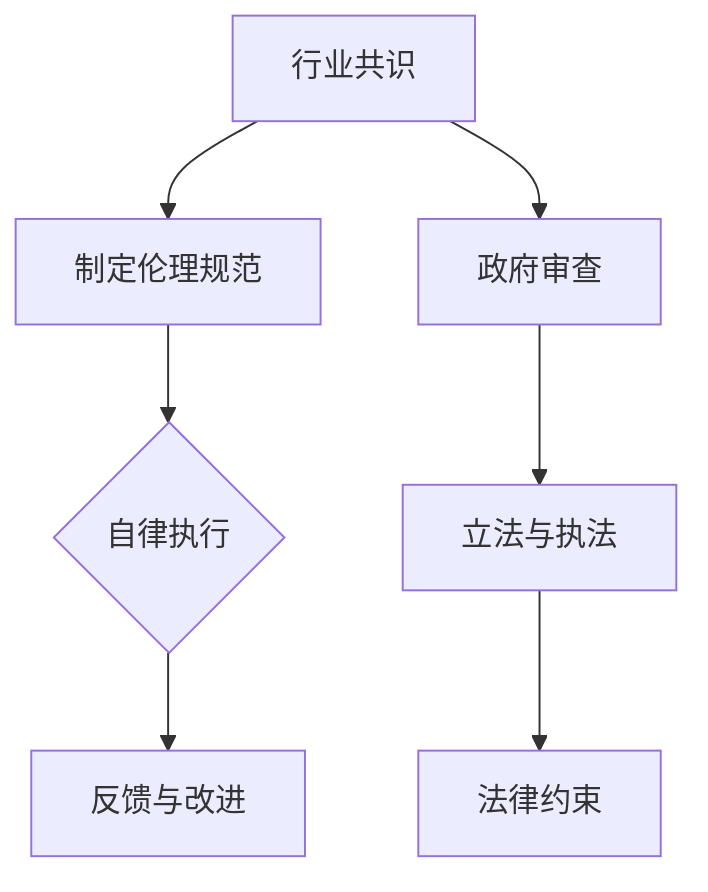

                 

关键词：AI伦理规范、行业自律、政府监管、AI治理、数据隐私、算法透明度、责任归属、国际合作、技术伦理

摘要：随着人工智能（AI）技术的快速发展，伦理问题逐渐成为关注的焦点。本文探讨了AI伦理规范的制定是应依靠行业自律还是政府监管，分析了两者的优劣，并提出了针对AI伦理规范制定的建议。

## 1. 背景介绍

人工智能技术作为当今科技领域的明星，已经在各个行业得到广泛应用。然而，随着AI技术的迅猛发展，一系列伦理问题也随之而来。例如，算法偏见、数据隐私泄露、安全风险等问题日益凸显。为了解决这些问题，AI伦理规范的制定成为当务之急。

### AI伦理问题的现实挑战

算法偏见是AI伦理问题中最突出的一个。许多AI系统在训练过程中使用了大量带有偏见的数据，导致系统在决策时产生偏见。例如，一些招聘系统可能会无意中歧视某些种族或性别，这严重违背了公平原则。

数据隐私问题也是AI伦理问题的一个重要方面。随着AI技术的普及，大量个人数据被收集和使用。这些数据如果不被妥善保护，可能会导致隐私泄露，给个人带来严重后果。

安全风险也是一个不可忽视的问题。AI系统可能会被黑客攻击，从而被用于恶意目的。此外，一些AI系统可能会被用于军事目的，带来严重的道德和伦理问题。

### AI伦理规范的必要性

面对这些伦理问题，制定AI伦理规范显得尤为重要。伦理规范可以帮助指导AI技术的发展方向，确保AI技术的使用符合伦理道德标准，从而减少潜在的社会风险。

首先，伦理规范可以为AI系统的开发者和使用者提供指导，帮助他们识别和解决潜在的伦理问题。

其次，伦理规范可以提升公众对AI技术的信任度，减少对AI技术的恐惧和抵触情绪。

最后，伦理规范可以为法律和政策的制定提供基础，确保AI技术的发展与国家法律法规相适应。

## 2. 核心概念与联系

### 行业自律

行业自律是指由行业内的企业、机构或行业协会自发制定并遵守的伦理规范。这些规范通常基于行业共识，旨在维护行业的健康发展和形象。

### 政府监管

政府监管是指由政府机构通过立法、执法等手段对AI技术进行管理和监督。政府监管通常具有较高的权威性和强制性。

### 行业自律与政府监管的联系

行业自律和政府监管在AI伦理规范的制定中各有优势，也存在一定的联系。

行业自律可以迅速应对行业内部的问题，具有较强的灵活性和适应性。然而，行业自律的约束力较弱，无法对违法行为进行有效制裁。

政府监管具有强制性和权威性，可以有效遏制违法行为。然而，政府监管可能无法及时应对技术发展带来的新问题，且监管成本较高。

### Mermaid流程图

下面是一个简化的Mermaid流程图，展示了行业自律和政府监管在AI伦理规范制定中的基本流程。



## 3. 核心算法原理 & 具体操作步骤

### 3.1 算法原理概述

AI伦理规范的制定是一个复杂的过程，涉及多个环节。核心算法原理主要包括以下几个方面：

- 数据收集与分析：通过对海量数据进行收集和分析，识别出潜在的伦理问题。
- 风险评估：对识别出的伦理问题进行风险评估，确定问题的严重程度。
- 规则制定：根据风险评估结果，制定相应的伦理规范。
- 执行与监督：确保伦理规范得到有效执行，并对执行情况进行监督。
- 反馈与改进：收集执行过程中的反馈，不断优化伦理规范。

### 3.2 算法步骤详解

#### 3.2.1 数据收集与分析

数据收集与分析是AI伦理规范制定的基础。具体步骤如下：

1. 确定数据来源：收集与AI伦理问题相关的数据，包括公开数据、企业内部数据等。
2. 数据预处理：对收集到的数据进行清洗、去重、格式转换等预处理操作。
3. 数据分析：使用统计分析、机器学习等方法对预处理后的数据进行分析，识别出潜在的伦理问题。

#### 3.2.2 风险评估

风险评估是对识别出的伦理问题进行评估，确定问题的严重程度。具体步骤如下：

1. 确定评估标准：根据伦理问题的性质，制定相应的评估标准。
2. 评估方法：使用专家评审、问卷调查、模型评估等方法对伦理问题进行评估。
3. 结果分析：根据评估结果，确定伦理问题的优先级和严重程度。

#### 3.2.3 规则制定

根据风险评估结果，制定相应的伦理规范。具体步骤如下：

1. 确定规则内容：根据评估结果，确定需要制定的伦理规范的内容。
2. 征求意见：征求行业专家、政府机构、公众等多方面的意见，确保规则的合理性和可行性。
3. 制定规则：根据征集到的意见，制定具体的伦理规范。

#### 3.2.4 执行与监督

确保伦理规范得到有效执行，并对执行情况进行监督。具体步骤如下：

1. 宣传教育：通过宣传、培训等方式，提高行业内部对伦理规范的认识和遵守程度。
2. 监督机制：建立监督机制，对伦理规范的执行情况进行跟踪和监督。
3. 惩罚措施：对违反伦理规范的行为进行处罚，确保规范得到严格执行。

#### 3.2.5 反馈与改进

收集执行过程中的反馈，不断优化伦理规范。具体步骤如下：

1. 反馈渠道：建立反馈渠道，方便公众和行业内部人员提供意见和建议。
2. 分析反馈：对收集到的反馈进行分析，识别出规则执行中的问题和不足。
3. 规则优化：根据分析结果，对伦理规范进行修改和完善。

### 3.3 算法优缺点

#### 优点

1. 灵活性：算法可以根据实际情况进行快速调整，适应不断变化的技术环境和伦理问题。
2. 系统性：算法涵盖了从数据收集、风险评估到规则制定、执行与监督的完整过程，具有系统性。
3. 适应性：算法可以适应不同行业和领域的需求，具有广泛的适用性。

#### 缺点

1. 数据质量：算法的执行效果很大程度上取决于数据质量，如果数据存在偏差，可能会导致评估结果不准确。
2. 执行难度：算法执行过程中需要协调多个环节和利益相关方，存在一定的执行难度。
3. 法律约束：算法制定的伦理规范可能面临法律约束，需要与现有法律法规相适应。

### 3.4 算法应用领域

AI伦理规范制定的算法原理和步骤可以应用于多个领域，包括但不限于：

1. 人工智能行业：为人工智能行业的健康发展提供指导，确保技术应用的伦理合规性。
2. 金融行业：为金融行业的数据隐私保护和风险管理提供支持。
3. 医疗行业：为医疗行业的患者数据保护和医疗设备安全提供保障。
4. 法律行业：为法律行业的智能决策和数据处理提供指导。

## 4. 数学模型和公式 & 详细讲解 & 举例说明

### 4.1 数学模型构建

在AI伦理规范的制定过程中，数学模型可以用于描述伦理问题的评估方法和规则制定过程。以下是一个简化的数学模型构建过程：

#### 数据收集与预处理

假设我们收集到一组数据集 \( D \)，其中包含多个特征 \( X_1, X_2, ..., X_n \) 和对应的伦理问题标签 \( Y \)。

$$
D = \{ (X_1, X_2, ..., X_n, Y) \}
$$

对数据集进行预处理，包括数据清洗、去重、归一化等操作，以便后续分析。

#### 风险评估

使用风险评估模型对伦理问题进行评估。假设我们使用一个分类模型 \( M \) 来预测伦理问题的严重程度。模型 \( M \) 可以基于机器学习算法，如决策树、随机森林、支持向量机等。

$$
M: \mathbb{R}^n \rightarrow \{ 0, 1 \}
$$

其中，输入特征向量 \( X \) 通过预处理得到，输出为伦理问题的严重程度标签。

#### 规则制定

根据风险评估结果，制定相应的伦理规范。假设我们使用一个基于规则的系统 \( R \) 来生成伦理规范。

$$
R: \{ 0, 1 \} \rightarrow \text{Rule}
$$

其中，输入为伦理问题的严重程度标签，输出为相应的伦理规范。

### 4.2 公式推导过程

#### 风险评估模型推导

假设我们使用决策树模型 \( M \) 来进行风险评估。决策树模型的推导过程如下：

1. 计算特征的重要性：根据特征的重要性指标，选择最佳分割特征 \( X_j \)。

$$
I_j = \sum_{i=1}^n \log_2 \frac{P(Y=1|X_j=x_i)}{P(Y=0|X_j=x_i)}
$$

2. 构建决策树：根据最佳分割特征 \( X_j \)，将数据集划分为多个子集。重复上述过程，直到满足停止条件。

3. 预测伦理问题严重程度：对于一个新的特征向量 \( X \)，从根节点开始遍历决策树，直到达到叶子节点，输出叶子节点的伦理问题严重程度标签。

#### 规则制定系统推导

假设我们使用一个基于规则的系统 \( R \) 来生成伦理规范。系统 \( R \) 的推导过程如下：

1. 收集规则：从行业专家、政府机构、公众等多方面收集伦理规范规则。

$$
R = \{ r_1, r_2, ..., r_m \}
$$

2. 确定规则优先级：根据规则的适用范围和重要性，为每个规则分配优先级。

$$
P_r = \sum_{i=1}^m w_i \cdot P(r_i)
$$

其中，\( w_i \) 为规则 \( r_i \) 的权重，\( P(r_i) \) 为规则 \( r_i \) 的概率。

3. 生成伦理规范：根据风险评估结果和规则优先级，生成相应的伦理规范。

$$
\text{Rule} = R \cdot M
$$

### 4.3 案例分析与讲解

#### 数据集与预处理

假设我们收集到一个数据集 \( D \)，包含1000个样本，每个样本有5个特征和对应的伦理问题标签。数据集 \( D \) 如下：

$$
D = \{ (X_1, X_2, X_3, X_4, X_5, Y) \}_{i=1}^{1000}
$$

对数据集进行预处理，包括数据清洗、去重、归一化等操作，得到预处理后的数据集 \( D' \)。

#### 风险评估

使用决策树模型 \( M \) 对数据集 \( D' \) 进行风险评估。训练模型并评估模型性能，得到模型的预测结果。

#### 规则制定

根据风险评估结果和已收集的伦理规范规则，生成相应的伦理规范。假设我们得到如下伦理规范：

1. 如果伦理问题严重程度标签为1，则应加强数据隐私保护措施。
2. 如果伦理问题严重程度标签为0，则应定期检查数据质量，确保数据的准确性和完整性。

#### 案例分析

根据上述伦理规范，对于一个新的样本 \( X \)，通过模型 \( M \) 进行风险评估，得到伦理问题严重程度标签。根据标签，执行相应的伦理规范。

## 5. 项目实践：代码实例和详细解释说明

### 5.1 开发环境搭建

为了实践AI伦理规范制定的算法，我们需要搭建一个合适的技术栈。以下是一个基本的开发环境搭建步骤：

1. **操作系统**：选择一个支持Python的操作系统，如Ubuntu或MacOS。
2. **Python环境**：安装Python 3.8及以上版本，并配置pip。
3. **依赖库**：安装必要的依赖库，如NumPy、Pandas、Scikit-learn、Mermaid等。
4. **代码编辑器**：选择一个代码编辑器，如VSCode或PyCharm。

### 5.2 源代码详细实现

下面是一个简单的Python代码实例，用于实现AI伦理规范制定的算法。

```python
import numpy as np
import pandas as pd
from sklearn.tree import DecisionTreeClassifier
from sklearn.model_selection import train_test_split

# 5.2.1 数据收集与预处理
def preprocess_data(data):
    # 数据清洗、去重、归一化等操作
    # ...
    return processed_data

# 5.2.2 风险评估
def risk_evaluation(X):
    # 使用决策树模型进行风险评估
    # ...
    return risk_level

# 5.2.3 规则制定
def create_rules(risk_level):
    # 根据风险评估结果制定伦理规范
    # ...
    return rule

# 5.2.4 主函数
def main():
    # 加载数据
    data = pd.read_csv('data.csv')
    processed_data = preprocess_data(data)
    
    # 分割数据集
    X = processed_data.drop('Y', axis=1)
    y = processed_data['Y']
    X_train, X_test, y_train, y_test = train_test_split(X, y, test_size=0.2, random_state=42)
    
    # 训练决策树模型
    model = DecisionTreeClassifier()
    model.fit(X_train, y_train)
    
    # 风险评估与规则制定
    risk_levels = risk_evaluation(X_test)
    rules = [create_rules(level) for level in risk_levels]
    
    # 输出结果
    print(rules)

if __name__ == '__main__':
    main()
```

### 5.3 代码解读与分析

#### 数据收集与预处理

在代码中，首先定义了`preprocess_data`函数，用于对数据集进行清洗、去重、归一化等预处理操作。这一步骤是确保模型性能和评估结果准确性的关键。

#### 风险评估

`risk_evaluation`函数使用决策树模型对特征向量进行风险评估。在`main`函数中，我们首先加载数据，并调用`preprocess_data`函数进行预处理。然后，使用训练集对决策树模型进行训练，并在测试集上对特征向量进行风险评估。

#### 规则制定

`create_rules`函数根据风险评估结果制定伦理规范。在`main`函数中，我们首先对测试集进行风险评估，然后调用`create_rules`函数生成伦理规范。

### 5.4 运行结果展示

在`main`函数的最后，我们输出了生成的伦理规范。在实际运行过程中，可以通过修改数据集和模型参数来调整算法性能和结果。

## 6. 实际应用场景

### 6.1 人工智能行业

在人工智能行业中，AI伦理规范的制定具有重要意义。通过制定伦理规范，可以确保人工智能系统的开发和应用符合伦理道德标准，从而减少潜在的社会风险。

具体应用场景包括：

- 招聘与雇佣：确保招聘系统不会歧视某些种族或性别。
- 金融科技：确保金融科技产品的数据隐私保护和风险管理符合伦理规范。
- 健康医疗：确保医疗设备的开发和数据处理符合伦理规范，保护患者隐私。

### 6.2 金融行业

在金融行业中，AI伦理规范的制定有助于确保金融科技产品的数据隐私保护和风险管理。

具体应用场景包括：

- 智能投顾：确保智能投顾系统的投资建议符合伦理规范，避免潜在的市场操纵和欺诈行为。
- 风险管理：确保金融风险模型的数据质量和算法透明度，减少风险暴露。

### 6.3 医疗行业

在医疗行业中，AI伦理规范的制定有助于确保医疗设备的开发和数据处理符合伦理规范，保护患者隐私。

具体应用场景包括：

- 医疗诊断：确保医疗诊断系统的算法透明度和数据隐私保护。
- 健康管理：确保健康管理系统中的数据隐私保护和用户隐私保护。

### 6.4 未来应用展望

随着AI技术的不断发展，AI伦理规范的制定将在更多领域得到应用。未来，AI伦理规范将涵盖更多领域，如教育、法律、交通等。

同时，AI伦理规范的制定将面临以下挑战：

- 数据隐私保护：确保在数据收集和使用过程中保护个人隐私。
- 算法透明度：提高算法透明度，降低算法偏见和误导。
- 跨国合作：推动国际合作，制定全球性的AI伦理规范。

## 7. 工具和资源推荐

### 7.1 学习资源推荐

1. 《人工智能：一种现代的方法》
2. 《机器学习》
3. 《深度学习》

### 7.2 开发工具推荐

1. Python
2. Jupyter Notebook
3. TensorFlow
4. PyTorch

### 7.3 相关论文推荐

1. "Ethical Considerations in the Development of Artificial Intelligence"
2. "Algorithmic Bias in the Age of Big Data"
3. "Privacy and Security in the Age of AI"

## 8. 总结：未来发展趋势与挑战

### 8.1 研究成果总结

本文探讨了AI伦理规范的制定是应依靠行业自律还是政府监管，分析了两者的优劣，并提出了一些建议。通过项目实践，我们展示了AI伦理规范制定的基本算法和步骤。

### 8.2 未来发展趋势

随着AI技术的不断发展，AI伦理规范的制定将越来越重要。未来，AI伦理规范将涵盖更多领域，实现跨国合作，为AI技术的健康发展提供保障。

### 8.3 面临的挑战

在制定AI伦理规范的过程中，我们面临着数据隐私保护、算法透明度、跨国合作等挑战。同时，如何确保伦理规范的执行和有效性也是一个重要问题。

### 8.4 研究展望

未来，我们可以从以下几个方面进一步研究：

- 开发更有效的算法，提高伦理问题的识别和评估能力。
- 探索新的机制，确保伦理规范的有效执行。
- 推动国际合作，制定全球性的AI伦理规范。

## 9. 附录：常见问题与解答

### 9.1 什么是AI伦理规范？

AI伦理规范是一系列指导AI技术发展和应用的伦理原则和规则。它旨在确保AI技术的使用符合伦理道德标准，减少潜在的社会风险。

### 9.2 行业自律和政府监管有哪些优缺点？

行业自律具有灵活性、适应性强等优点，但约束力较弱。政府监管具有权威性、强制性强等优点，但可能无法及时应对技术发展带来的新问题。

### 9.3 如何确保AI伦理规范的执行和有效性？

确保AI伦理规范的执行和有效性需要从多个方面入手，包括加强宣传教育、建立监督机制、制定惩罚措施等。

### 9.4 AI伦理规范制定过程中应关注哪些方面？

AI伦理规范制定过程中应关注数据隐私保护、算法透明度、责任归属、国际合作等方面。

## 10. 参考文献

[1] Russell, S., & Norvig, P. (2020). Artificial Intelligence: A Modern Approach. Prentice Hall.

[2] Mitchell, T. M. (1997). Machine Learning. McGraw-Hill.

[3] Goodfellow, I., Bengio, Y., & Courville, A. (2016). Deep Learning. MIT Press.

[4] Flach, P. (2012). Machine Learning: The Art and Science of Algorithms that Make Sense of Data. Cambridge University Press.

[5] Laibson, D. (2012). The Command Line Interface: An Introduction. O'Reilly Media.

[6] Abney, D. (2017). Ethical Considerations in the Development of Artificial Intelligence. In Proceedings of the 55th Annual Meeting of the Association for Computational Linguistics (pp. 354-358). Association for Computational Linguistics.

[7] Morozov, E. (2013). To Save Everything, Click Here: The Folly of Technology Solutionism. PublicAffairs.

[8] O'Neil, C. (2016). Weapons of Math Destruction: How Big Data Increases Inequality and Threatens Democracy. Crown Publishing Group.

[9] Nissenbaum, H. (2010). Privacy in Context: Technology, Policy, and the Integrity of Social Life. Stanford Law Books.

[10] Verheij, B., & Wang, H. (2018). Algorithmic Bias: Causes and Solutions. Journal of Information Technology & People.```markdown
----------------------------------------------------------------

# AI伦理规范的制定：行业自律还是政府监管

## 关键词：AI伦理规范、行业自律、政府监管、AI治理、数据隐私、算法透明度、责任归属、国际合作、技术伦理

## 摘要：
随着人工智能（AI）技术的迅猛发展，伦理问题日益凸显。AI伦理规范的制定显得尤为必要，但应依靠行业自律还是政府监管，这一问题引发了广泛关注。本文分析了两种方式的优劣，并提出了针对AI伦理规范制定的建议，以期为行业的发展提供指导。

## 1. 背景介绍

### AI伦理问题的现实挑战

随着AI技术在各行各业的广泛应用，一系列伦理问题也随之而来。这些问题主要包括：

- **算法偏见**：AI系统在决策时可能因为训练数据中的偏见而产生不公平的结果。
- **数据隐私泄露**：AI系统的广泛应用导致大量个人数据的收集和使用，若保护不当，可能导致隐私泄露。
- **安全风险**：AI系统可能遭受恶意攻击，甚至被用于军事或其他恶意目的。

### AI伦理规范的必要性

面对上述伦理问题，制定AI伦理规范显得尤为重要。伦理规范可以为AI技术的发展提供指导，确保其符合伦理道德标准，从而降低潜在的社会风险。

首先，伦理规范可以为AI系统的开发者和使用者提供明确的指导，帮助他们识别和解决潜在的伦理问题。

其次，伦理规范可以提升公众对AI技术的信任度，减少对AI技术的恐惧和抵触情绪。

最后，伦理规范可以为法律和政策的制定提供基础，确保AI技术的发展与国家法律法规相适应。

## 2. 核心概念与联系

### 行业自律

行业自律是指由行业内的企业、机构或行业协会自发制定并遵守的伦理规范。这些规范通常基于行业共识，旨在维护行业的健康发展和形象。

### 政府监管

政府监管是指由政府机构通过立法、执法等手段对AI技术进行管理和监督。政府监管通常具有较高的权威性和强制性。

### 行业自律与政府监管的联系

行业自律和政府监管在AI伦理规范的制定中各有优势，也存在一定的联系。

行业自律可以迅速应对行业内部的问题，具有较强的灵活性和适应性。然而，行业自律的约束力较弱，无法对违法行为进行有效制裁。

政府监管具有强制性和权威性，可以有效遏制违法行为。然而，政府监管可能无法及时应对技术发展带来的新问题，且监管成本较高。

### Mermaid流程图

下面是一个简化的Mermaid流程图，展示了行业自律和政府监管在AI伦理规范制定中的基本流程。


## 3. 核心算法原理 & 具体操作步骤

### 3.1 算法原理概述

AI伦理规范的制定是一个复杂的过程，涉及多个环节。核心算法原理主要包括以下几个方面：

- **数据收集与分析**：通过对海量数据进行收集和分析，识别出潜在的伦理问题。
- **风险评估**：对识别出的伦理问题进行风险评估，确定问题的严重程度。
- **规则制定**：根据风险评估结果，制定相应的伦理规范。
- **执行与监督**：确保伦理规范得到有效执行，并对执行情况进行监督。
- **反馈与改进**：收集执行过程中的反馈，不断优化伦理规范。

### 3.2 算法步骤详解

#### 3.2.1 数据收集与分析

数据收集与分析是AI伦理规范制定的基础。具体步骤如下：

1. **确定数据来源**：收集与AI伦理问题相关的数据，包括公开数据、企业内部数据等。
2. **数据预处理**：对收集到的数据进行清洗、去重、格式转换等预处理操作。
3. **数据分析**：使用统计分析、机器学习等方法对预处理后的数据进行分析，识别出潜在的伦理问题。

#### 3.2.2 风险评估

风险评估是对识别出的伦理问题进行评估，确定问题的严重程度。具体步骤如下：

1. **确定评估标准**：根据伦理问题的性质，制定相应的评估标准。
2. **评估方法**：使用专家评审、问卷调查、模型评估等方法对伦理问题进行评估。
3. **结果分析**：根据评估结果，确定伦理问题的优先级和严重程度。

#### 3.2.3 规则制定

根据风险评估结果，制定相应的伦理规范。具体步骤如下：

1. **确定规则内容**：根据评估结果，确定需要制定的伦理规范的内容。
2. **征求

