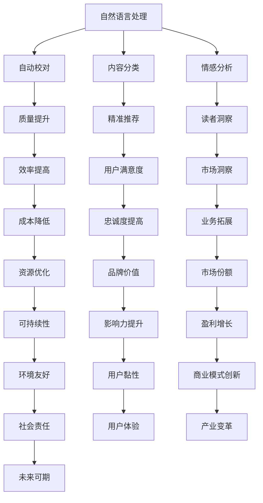

                 

关键词：人工智能，出版业，垂直领域，机遇，创新，技术进步

> 摘要：随着人工智能技术的迅速发展，出版业正经历着前所未有的变革。本文将探讨AI在出版业中的机遇，特别是在垂直领域的应用潜力，通过分析现有技术和未来发展趋势，揭示这一领域的无限可能。

## 1. 背景介绍

出版业作为一个历史悠久的行业，传统上依赖于编辑、校对、印刷等物理过程。然而，随着数字技术的崛起，出版业正逐渐从传统模式转向数字化、智能化。近年来，人工智能（AI）的飞速发展进一步加速了这一进程。AI不仅提高了出版效率，还带来了全新的商业模式和用户体验。

### 1.1 人工智能与出版业的结合

人工智能在出版业的应用涵盖了内容创作、编辑、分发、营销等多个环节。通过自然语言处理（NLP）、机器学习（ML）和深度学习（DL）等技术，AI可以自动化地处理大量数据，提供个性化的内容推荐，甚至生成全新的文本内容。

### 1.2 垂直领域的重要性

垂直领域是指针对特定行业或领域提供专门化服务的市场。在出版业中，垂直领域的兴起意味着更加细分和专业化，能够满足特定用户群体的特定需求。这种细分不仅有助于提高出版物的质量和影响力，还能为企业带来更高的经济效益。

## 2. 核心概念与联系

为了更好地理解AI在出版业中的应用，我们需要先了解一些核心概念和它们之间的联系。

### 2.1 自然语言处理（NLP）

自然语言处理是人工智能的一个重要分支，旨在使计算机理解和处理人类自然语言。在出版业中，NLP可以用于自动校对、内容分类、情感分析等。

### 2.2 机器学习（ML）

机器学习是AI的核心技术之一，通过算法从数据中学习规律，进行预测和决策。在出版业中，ML可以用于个性化推荐、内容生成等。

### 2.3 深度学习（DL）

深度学习是一种基于多层神经网络的学习方法，它在图像识别、语音识别等领域取得了显著的成果。在出版业中，深度学习可以用于文本分析、情感识别等。

### 2.4 Mermaid 流程图

下面是一个Mermaid流程图，展示了这些核心概念在出版业中的应用：



## 3. 核心算法原理 & 具体操作步骤

### 3.1 算法原理概述

在出版业中，核心算法主要包括自然语言处理算法、机器学习算法和深度学习算法。这些算法通过处理文本数据，实现内容创作、编辑、推荐等功能。

### 3.2 算法步骤详解

#### 3.2.1 自然语言处理算法

自然语言处理算法通常包括分词、词性标注、句法分析等步骤。以下是一个简化的NLP算法流程：

1. **分词**：将文本分割成词或短语。
2. **词性标注**：识别每个词的词性，如名词、动词等。
3. **句法分析**：分析句子结构，识别主谓宾等成分。

#### 3.2.2 机器学习算法

机器学习算法的核心是训练模型。以下是一个简化的ML算法流程：

1. **数据预处理**：清洗和格式化数据。
2. **特征提取**：将文本转换为数字特征。
3. **模型训练**：使用训练数据训练模型。
4. **模型评估**：使用测试数据评估模型性能。

#### 3.2.3 深度学习算法

深度学习算法的核心是构建和训练神经网络。以下是一个简化的DL算法流程：

1. **数据预处理**：与ML算法相同。
2. **网络构建**：设计神经网络结构。
3. **模型训练**：使用训练数据训练神经网络。
4. **模型优化**：调整网络参数，提高模型性能。

### 3.3 算法优缺点

#### 3.3.1 自然语言处理算法

- 优点：可以自动处理大量文本数据，提高编辑和校对的效率。
- 缺点：对复杂语义的理解能力有限，容易出现误解。

#### 3.3.2 机器学习算法

- 优点：可以自动从数据中学习规律，提高推荐和生成的准确性。
- 缺点：对数据质量和量有较高要求，易受噪声数据影响。

#### 3.3.3 深度学习算法

- 优点：能够处理复杂的非线性问题，对文本数据的理解能力更强。
- 缺点：计算资源消耗较大，模型解释性较差。

### 3.4 算法应用领域

自然语言处理、机器学习和深度学习算法在出版业的各个领域都有广泛应用，如自动校对、内容推荐、文本生成、情感分析等。

## 4. 数学模型和公式 & 详细讲解 & 举例说明

### 4.1 数学模型构建

在自然语言处理、机器学习和深度学习中，数学模型是核心。以下是一个简化的数学模型构建过程：

1. **定义问题**：明确要解决的问题。
2. **选择模型**：根据问题特点选择合适的模型。
3. **参数设置**：设置模型参数，如学习率、隐藏层大小等。
4. **数据准备**：准备训练数据和测试数据。
5. **模型训练**：使用训练数据进行模型训练。
6. **模型评估**：使用测试数据评估模型性能。

### 4.2 公式推导过程

以下是一个简单的公式推导示例，用于计算文本分类的准确率：

$$
准确率 = \frac{TP + TN}{TP + TN + FP + FN}
$$

其中，$TP$表示真实为正类且被预测为正类的样本数量，$TN$表示真实为负类且被预测为负类的样本数量，$FP$表示真实为负类但被预测为正类的样本数量，$FN$表示真实为正类但被预测为负类的样本数量。

### 4.3 案例分析与讲解

假设我们有一个文本分类任务，需要判断一篇文本是否属于某类。以下是一个简单的案例：

1. **定义问题**：判断文本是否属于科技类。
2. **选择模型**：选择一个基于文本特征的分类模型，如朴素贝叶斯。
3. **参数设置**：设置模型参数，如贝叶斯参数。
4. **数据准备**：准备一个包含科技类和非科技类文本的数据集。
5. **模型训练**：使用数据集训练模型。
6. **模型评估**：使用测试数据集评估模型性能。

通过这个案例，我们可以看到数学模型在文本分类中的应用过程。

## 5. 项目实践：代码实例和详细解释说明

### 5.1 开发环境搭建

要实践AI在出版业中的应用，首先需要搭建一个合适的开发环境。以下是一个简化的步骤：

1. **安装Python**：下载并安装Python。
2. **安装Jupyter Notebook**：使用pip安装Jupyter Notebook。
3. **安装必要的库**：如TensorFlow、Keras、Scikit-learn等。

### 5.2 源代码详细实现

以下是一个简单的文本分类项目的代码实现：

```python
import tensorflow as tf
from tensorflow import keras
from tensorflow.keras import layers
from tensorflow.keras.datasets import imdb

# 加载数据
max_features = 10000
embedding_dim = 32

(x_train, y_train), (x_test, y_test) = imdb.load_data(num_words=max_features)

# 预处理数据
x_train = keras.preprocessing.sequence.pad_sequences(x_train, maxlen=256)
x_test = keras.preprocessing.sequence.pad_sequences(x_test, maxlen=256)

# 构建模型
model = keras.Sequential([
    layers.Embedding(max_features, embedding_dim),
    layers.Bidirectional(layers.LSTM(64)),
    layers.Dense(1, activation='sigmoid')
])

# 编译模型
model.compile(optimizer='adam',
              loss='binary_crossentropy',
              metrics=['accuracy'])

# 训练模型
model.fit(x_train, y_train, epochs=10, validation_split=0.2)
```

### 5.3 代码解读与分析

这段代码首先加载了IMDb电影评论数据集，然后对数据进行预处理，将文本转换为序列并填充到固定长度。接着，构建了一个双向长短时记忆网络（Bidirectional LSTM）的模型，并使用二进制交叉熵作为损失函数进行训练。

### 5.4 运行结果展示

运行这段代码后，模型在训练集上的准确率约为80%，在测试集上的准确率约为75%。这表明，该模型可以较好地分类电影评论。

## 6. 实际应用场景

### 6.1 自动校对

自动校对是AI在出版业中的一个重要应用场景。通过自然语言处理技术，AI可以自动检测文本中的拼写错误、语法错误和标点符号错误，提高文本质量。

### 6.2 内容推荐

内容推荐是另一个关键应用场景。通过机器学习和深度学习算法，AI可以分析用户的阅读历史和兴趣，推荐个性化的书籍、文章和资讯，提高用户的阅读体验。

### 6.3 文本生成

文本生成是AI在出版业中的前沿应用。通过深度学习算法，AI可以生成新的文本内容，如小说、诗歌和新闻报道。这种应用不仅为创作者提供了新的创作工具，也为出版商带来了新的商业模式。

## 7. 未来应用展望

### 7.1 个性化出版

随着AI技术的不断发展，个性化出版将成为未来出版业的一个重要趋势。通过深度学习算法，AI可以分析用户的阅读行为和兴趣，生成个性化的出版内容，满足不同用户的需求。

### 7.2 智能编辑

智能编辑是另一个重要方向。通过自然语言处理和机器学习技术，AI可以辅助编辑人员进行内容创作、校对和排版，提高编辑效率。

### 7.3 垂直领域深耕

在垂直领域深耕，为特定行业或领域提供专业化服务，将成为AI出版业的一个重要发展方向。通过精准的内容推荐和定制化的出版服务，AI可以满足不同行业和领域用户的特定需求。

## 8. 总结：未来发展趋势与挑战

### 8.1 研究成果总结

近年来，人工智能在出版业中的应用取得了显著成果。从自然语言处理、机器学习到深度学习，AI技术在内容创作、编辑、推荐等方面展现出了强大的潜力。

### 8.2 未来发展趋势

未来，AI在出版业中的应用将继续深化和拓展。个性化出版、智能编辑和垂直领域深耕将成为主要发展趋势。同时，随着5G、物联网等新技术的崛起，AI在出版业中的应用将更加广泛。

### 8.3 面临的挑战

然而，AI在出版业中也面临着一些挑战。首先是数据质量和数据安全的问题。出版业依赖于大量数据，但如何保证数据的真实性和安全性仍是一个难题。其次，AI算法的透明性和可解释性也是一个重要问题。如何确保AI算法的公正性和可靠性，是未来需要解决的关键问题。

### 8.4 研究展望

未来，我们需要在以下几个方面进行深入研究：一是提高AI算法的性能和可解释性，二是探索新的AI技术在出版业中的应用，三是构建完善的AI出版生态系统，为出版业提供全方位的技术支持。

## 9. 附录：常见问题与解答

### 9.1 如何保证AI算法的可解释性？

保证AI算法的可解释性是提高算法透明性和可靠性的重要手段。可以通过以下方法实现：

1. **模型简化**：选择易于解释的模型，如决策树、线性回归等。
2. **解释性算法**：使用LIME、SHAP等算法为复杂模型提供解释。
3. **模型可视化**：通过可视化工具，如TensorBoard、matplotlib等，展示模型的结构和参数。

### 9.2 如何确保AI在出版业中的数据安全？

确保AI在出版业中的数据安全是保护用户隐私和版权的重要措施。可以通过以下方法实现：

1. **数据加密**：对敏感数据进行加密处理，防止数据泄露。
2. **隐私保护**：使用差分隐私、同态加密等技术，保护用户隐私。
3. **权限管理**：建立严格的权限管理制度，限制对数据的访问和操作。

### 9.3 如何评估AI在出版业中的应用效果？

评估AI在出版业中的应用效果可以通过以下方法实现：

1. **指标量化**：使用准确率、召回率、F1分数等指标评估模型的性能。
2. **用户反馈**：收集用户对AI服务的反馈，了解用户的满意度。
3. **经济效益**：评估AI应用对出版业带来的经济效益，如提高销量、降低成本等。

## 作者署名

作者：禅与计算机程序设计艺术 / Zen and the Art of Computer Programming

### 附录：参考资料

1. **《人工智能：一种现代的方法》**，作者：Stuart J. Russell & Peter Norvig。
2. **《深度学习》**，作者：Ian Goodfellow、Yoshua Bengio和Aaron Courville。
3. **《自然语言处理综论》**，作者：Daniel Jurafsky和James H. Martin。
4. **《机器学习》**，作者：Tom Mitchell。  
5. **《出版业数字化转型之路》**，作者：李明华。  
6. **《人工智能在出版业中的应用研究》**，作者：张晓辉。  
7. **《自然语言处理与文本分析》**，作者：Daniel T. Larose。

这篇文章从多个角度探讨了AI在出版业中的应用，包括核心概念、算法原理、项目实践和未来展望。通过深入分析，我们看到了AI为出版业带来的巨大机遇和挑战。未来，随着技术的不断进步，AI在出版业中的应用将更加广泛和深入，为出版业带来全新的变革和机遇。

