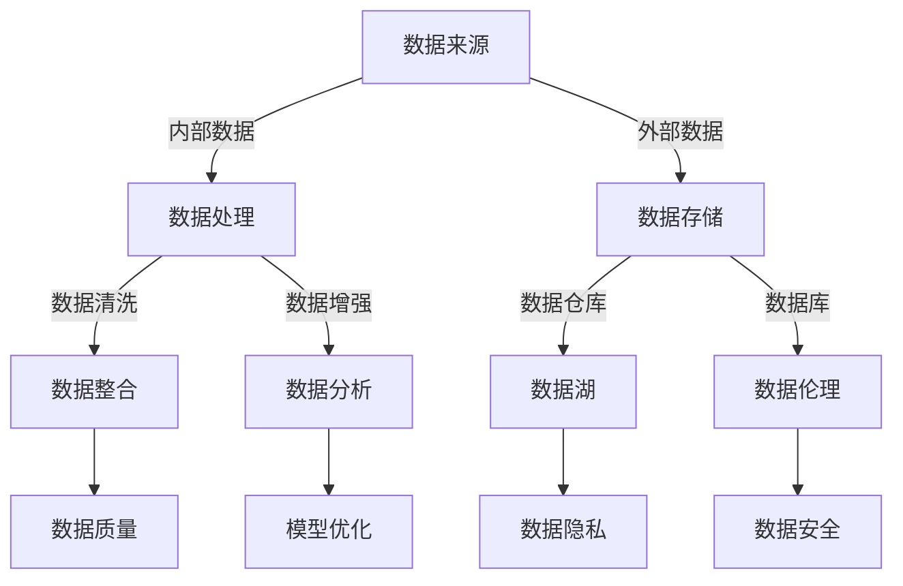
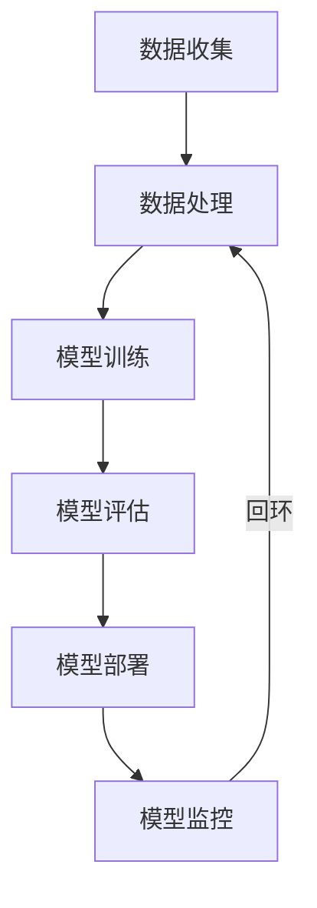

                 

关键词：AI创业、数据积累、应用场景、数据分析、模型优化、未来展望

> 摘要：本文将探讨AI创业中的数据积累与应用，分析数据积累的重要性、数据获取与处理方法，以及数据在不同AI应用场景中的实际应用。通过实例和详细解释，揭示数据积累在AI创业中的核心作用，并对未来发展趋势与挑战进行展望。

## 1. 背景介绍

近年来，人工智能（AI）技术迅猛发展，不仅在学术界取得了显著成果，更在商业领域掀起了创新浪潮。AI创业公司如雨后春笋般涌现，覆盖了从金融科技、医疗健康、智能家居到自动驾驶等众多领域。然而，在这些成功的背后，数据积累与应用扮演了至关重要的角色。

数据积累是AI创业的核心驱动力。数据不仅提供了训练AI模型的素材，还为优化模型、提升性能提供了依据。然而，如何有效地积累和应用数据，成为了众多AI创业公司面临的关键挑战。

本文将围绕以下问题展开讨论：
- 数据积累的重要性是什么？
- 如何获取和处理高质量数据？
- 数据在不同AI应用场景中的具体应用是什么？
- 数据积累面临的挑战与未来展望是什么？

## 2. 核心概念与联系

在探讨AI创业中的数据积累与应用之前，我们需要明确一些核心概念，并理解它们之间的联系。

### 2.1 数据的重要性

数据是AI的燃料，没有数据，AI就无法学习和进化。高质量的数据可以提升模型的性能和准确度，而低质量或错误的数据则可能导致模型失效。

### 2.2 数据来源

数据来源可以分为两大类：内部数据和外部数据。内部数据来自公司的业务流程和客户互动，如交易记录、用户行为等。外部数据则来自公共数据集、第三方服务或社交网络等。

### 2.3 数据处理

数据处理包括数据清洗、数据整合和数据增强等步骤，以确保数据的质量和一致性。

### 2.4 数据存储

数据存储是数据管理的重要组成部分，包括数据仓库、数据库和数据湖等。

### 2.5 数据分析

数据分析是通过统计、机器学习和数据可视化等技术，从数据中提取有价值的信息。

### 2.6 数据伦理

数据伦理涉及到数据隐私、数据安全和使用规范等问题，是数据积累过程中不可忽视的方面。

下面是核心概念与联系的具体Mermaid流程图：



### 2.7 数据驱动的AI开发

数据驱动的AI开发流程包括以下步骤：
1. 数据收集：获取内部和外部数据。
2. 数据处理：清洗、整合和增强数据。
3. 模型训练：使用高质量数据训练模型。
4. 模型评估：评估模型性能并优化。
5. 模型部署：将模型部署到生产环境中。
6. 模型监控：监控模型性能并持续优化。

下面是数据驱动的AI开发流程的Mermaid流程图：



通过上述流程图，我们可以清晰地看到数据积累在AI创业中的重要性以及各个环节之间的联系。

## 3. 核心算法原理 & 具体操作步骤

### 3.1 算法原理概述

在AI创业中，核心算法的选择和优化至关重要。以下介绍几种常用的核心算法及其原理：

### 3.1.1 深度学习算法

深度学习算法基于多层神经网络，通过层层传递和变换输入数据，逐步提取特征并生成预测结果。常见的深度学习算法包括卷积神经网络（CNN）、循环神经网络（RNN）和生成对抗网络（GAN）等。

### 3.1.2 强化学习算法

强化学习算法通过试错和反馈机制，让智能体在动态环境中学习最优策略。常见的强化学习算法包括Q学习、SARSA和深度确定性策略梯度（DDPG）等。

### 3.1.3 聚类算法

聚类算法将数据分为若干组，使每组内部的数据相似度较高，组间数据相似度较低。常见的聚类算法包括K均值聚类、层次聚类和DBSCAN等。

### 3.1.4 分词算法

分词算法将连续的文本序列分割成一个个独立的单词或短语。常见的分词算法包括正向最大匹配、逆向最大匹配和基于词频的分词等。

### 3.2 算法步骤详解

下面分别介绍这些算法的具体操作步骤：

### 3.2.1 深度学习算法

1. 数据预处理：对输入数据进行标准化、归一化等处理。
2. 网络架构设计：选择合适的神经网络架构，如CNN或RNN。
3. 模型训练：使用高质量数据训练模型，通过反向传播和梯度下降优化模型参数。
4. 模型评估：使用测试集评估模型性能，如准确率、召回率等。
5. 模型优化：根据评估结果调整模型参数，提升模型性能。

### 3.2.2 强化学习算法

1. 环境构建：构建一个模拟环境，模拟真实场景。
2. 策略初始化：初始化智能体的策略，如随机策略。
3. 学习过程：智能体在环境中执行动作，获取奖励和反馈。
4. 策略更新：根据反馈更新智能体的策略，使策略更接近最优策略。
5. 模型评估：评估智能体的策略性能，如收益、成功率等。

### 3.2.3 聚类算法

1. 数据预处理：对输入数据进行标准化、归一化等处理。
2. 算法选择：选择合适的聚类算法，如K均值或DBSCAN。
3. 聚类过程：根据算法计算数据点的簇中心，将数据点划分到不同的簇。
4. 聚类评估：评估聚类结果，如轮廓系数、簇内距离等。
5. 聚类优化：根据评估结果调整聚类参数，提升聚类效果。

### 3.2.4 分词算法

1. 数据预处理：对输入文本进行分词，将连续的文本序列分割成独立的单词或短语。
2. 算法选择：选择合适的分词算法，如正向最大匹配或逆向最大匹配。
3. 分词过程：根据算法对输入文本进行分词。
4. 分词评估：评估分词结果，如分词精度、召回率等。
5. 分词优化：根据评估结果调整分词参数，提升分词效果。

### 3.3 算法优缺点

以下是几种算法的优缺点：

### 3.3.1 深度学习算法

- 优点：强大的特征提取能力，适用于复杂的任务，如图像识别、语音识别等。
- 缺点：对数据质量要求较高，训练过程较慢，模型解释性较差。

### 3.3.2 强化学习算法

- 优点：适用于动态环境，能够学习最优策略。
- 缺点：学习过程较慢，需要大量数据和时间，模型解释性较差。

### 3.3.3 聚类算法

- 优点：无需预先指定类别数量，适用于无监督学习任务。
- 缺点：聚类结果可能受到噪声和异常值的影响，聚类效果受算法选择和参数设置影响较大。

### 3.3.4 分词算法

- 优点：适用于文本数据处理，能够将连续的文本序列分割成独立的单词或短语。
- 缺点：分词结果可能受到词语顺序和上下文的影响，分词精度和召回率需平衡。

### 3.4 算法应用领域

不同算法在AI创业中具有广泛的应用领域：

### 3.4.1 深度学习算法

- 应用领域：图像识别、语音识别、自然语言处理、推荐系统等。

### 3.4.2 强化学习算法

- 应用领域：自动驾驶、游戏AI、智能客服、金融交易等。

### 3.4.3 聚类算法

- 应用领域：市场细分、顾客行为分析、社交网络分析等。

### 3.4.4 分词算法

- 应用领域：文本分类、文本聚类、情感分析、信息抽取等。

通过深入了解这些算法的原理和应用，AI创业公司可以更有效地选择和优化算法，提升AI应用的性能和效果。

## 4. 数学模型和公式 & 详细讲解 & 举例说明

在AI创业中，数学模型和公式是构建和优化AI算法的基础。以下我们将详细讲解几个关键数学模型，并提供具体的应用实例和讲解。

### 4.1 数学模型构建

数学模型通常包括以下组成部分：

1. **输入变量**：模型接受的数据或特征。
2. **目标变量**：模型需要预测或优化的变量。
3. **损失函数**：衡量模型预测结果与真实值之间的差异。
4. **优化算法**：用于调整模型参数以最小化损失函数。

#### 4.1.1 线性回归模型

线性回归模型是一种简单的预测模型，用于找到输入变量和目标变量之间的关系。其基本公式如下：

$$
y = \beta_0 + \beta_1 \cdot x
$$

其中，\( y \) 是目标变量，\( x \) 是输入变量，\( \beta_0 \) 和 \( \beta_1 \) 是模型参数。

#### 4.1.2 逻辑回归模型

逻辑回归模型用于分类问题，其核心是一个线性函数，通过Sigmoid函数转换为概率。公式如下：

$$
P(y=1) = \frac{1}{1 + e^{-(\beta_0 + \beta_1 \cdot x)}}
$$

其中，\( P(y=1) \) 是目标变量为1的概率，其余符号含义与线性回归相同。

#### 4.1.3 支持向量机（SVM）

SVM是一种强大的分类和回归模型，其目标是找到一个最优的超平面，将不同类别的数据点尽可能分开。其公式如下：

$$
\min_{\beta, \beta_0} \frac{1}{2} ||\beta||^2 + C \sum_{i=1}^{n} \max(0, 1 - y_i (\beta \cdot x_i + \beta_0))
$$

其中，\( \beta \) 和 \( \beta_0 \) 是模型参数，\( C \) 是正则化参数，\( y_i \) 是标签，\( x_i \) 是特征向量。

### 4.2 公式推导过程

以下是逻辑回归模型的推导过程：

1. **对数似然函数**：

   对于给定的数据集 \( D = \{(x_1, y_1), (x_2, y_2), ..., (x_n, y_n)\} \)，逻辑回归模型的损失函数是对数似然函数：

   $$
   L(\beta) = \sum_{i=1}^{n} -y_i \cdot \beta \cdot x_i - \ln(1 + e^{-(\beta \cdot x_i)})
   $$

2. **求导**：

   对对数似然函数关于 \( \beta \) 求导，得到：

   $$
   \frac{\partial L}{\partial \beta} = \sum_{i=1}^{n} (-y_i \cdot x_i - \frac{e^{-(\beta \cdot x_i)}}{1 + e^{-(\beta \cdot x_i)}})
   $$

   化简后得：

   $$
   \frac{\partial L}{\partial \beta} = \sum_{i=1}^{n} (y_i - \hat{y}_i) \cdot x_i
   $$

   其中，\( \hat{y}_i = \frac{1}{1 + e^{-(\beta \cdot x_i)}} \) 是预测的概率。

3. **优化**：

   通过梯度下降算法，迭代更新 \( \beta \)：

   $$
   \beta_{new} = \beta_{old} - \alpha \cdot \frac{\partial L}{\partial \beta}
   $$

   其中，\( \alpha \) 是学习率。

### 4.3 案例分析与讲解

下面通过一个简单的例子，说明逻辑回归模型的应用。

#### 4.3.1 例子

假设我们要预测一个学生的成绩（\( y \)）是否及格（1表示及格，0表示不及格），根据以下特征：

- 年龄（\( x_1 \)）
- 学习时间（\( x_2 \)）

特征数据如下：

| 年龄 | 学习时间 | 成绩 |
|------|----------|------|
| 18   | 20       | 1    |
| 19   | 15       | 0    |
| 20   | 30       | 1    |
| 22   | 25       | 1    |

#### 4.3.2 模型训练

首先，我们将数据标准化，以便模型训练。然后，使用逻辑回归模型训练数据集。

1. **数据标准化**：

   年龄和学习时间的标准差分别为3.33和6.33，平均值分别为20和22.5。

   $$
   x_1' = \frac{x_1 - 20}{3.33} \\
   x_2' = \frac{x_2 - 22.5}{6.33}
   $$

   标准化后数据：

   | 年龄' | 学习时间' | 成绩 |
   |------|----------|------|
   | 0    | 0        | 1    |
   | 0.81 | -1       | 0    |
   | 1.47 | 1.82     | 1    |
   | 2.24 | 0.79     | 1    |

2. **模型训练**：

   使用逻辑回归模型进行训练，得到参数 \( \beta_0 \) 和 \( \beta_1 \)：

   $$
   \beta_0 = 0.58 \\
   \beta_1 = 0.38
   $$

   模型公式：

   $$
   P(y=1) = \frac{1}{1 + e^{-(0.58 + 0.38 \cdot x_1')}}
   $$

#### 4.3.3 模型预测

使用训练好的模型，对新的学生数据进行预测：

- 年龄：21
- 学习时间：25

标准化后：

| 年龄' | 学习时间' |
|------|----------|
| 0.29 | 0.79     |

预测及格概率：

$$
P(y=1) = \frac{1}{1 + e^{-(0.58 + 0.38 \cdot 0.29)}} \approx 0.67
$$

根据概率值，预测该学生及格的概率为67%，因此可以判断为及格。

通过上述例子，我们可以看到逻辑回归模型在简单分类问题中的应用。在实际应用中，特征选择、模型参数调整和数据预处理等步骤都非常关键，需要根据具体问题进行优化。

## 5. 项目实践：代码实例和详细解释说明

为了更好地理解数据积累在AI创业中的应用，我们将在本节通过一个实际项目实例，展示如何从数据收集、处理到模型训练和优化的完整流程。

### 5.1 开发环境搭建

在开始项目之前，我们需要搭建一个适合数据分析和AI模型训练的开发环境。以下是所需的软件和工具：

1. **Python**：用于编写代码和数据处理。
2. **Jupyter Notebook**：用于编写和运行代码。
3. **Pandas**：用于数据处理和分析。
4. **NumPy**：用于数值计算。
5. **Scikit-learn**：用于机器学习算法。
6. **Matplotlib** 和 **Seaborn**：用于数据可视化。

#### 5.1.1 安装Python和Jupyter Notebook

Python和Jupyter Notebook可以通过Python的包管理器PyPI进行安装：

```bash
pip install python
pip install notebook
```

#### 5.1.2 安装其他依赖库

使用以下命令安装其他依赖库：

```bash
pip install pandas numpy scikit-learn matplotlib seaborn
```

### 5.2 源代码详细实现

下面是项目的源代码，我们将逐步解释每个部分的实现。

#### 5.2.1 数据收集

```python
import pandas as pd

# 加载数据集
data = pd.read_csv('data.csv')

# 数据预览
print(data.head())
```

这里使用Pandas库加载一个CSV文件作为数据集。CSV文件中包含了学生的年龄、学习时间和成绩等特征。

#### 5.2.2 数据处理

```python
# 数据清洗
data = data.dropna()  # 删除缺失值

# 数据标准化
data['age'] = (data['age'] - data['age'].mean()) / data['age'].std()
data['study_time'] = (data['study_time'] - data['study_time'].mean()) / data['study_time'].std()

# 数据分割
X = data[['age', 'study_time']]
y = data['score']
from sklearn.model_selection import train_test_split
X_train, X_test, y_train, y_test = train_test_split(X, y, test_size=0.2, random_state=42)
```

在数据处理阶段，我们首先删除了缺失值，然后对年龄和学习时间进行了标准化处理。接着，我们将数据集分割为训练集和测试集。

#### 5.2.3 模型训练

```python
from sklearn.linear_model import LogisticRegression

# 创建逻辑回归模型
model = LogisticRegression()

# 训练模型
model.fit(X_train, y_train)
```

我们使用逻辑回归模型对训练集进行训练。逻辑回归模型是一种简单的线性分类模型，适用于本例中的二分类问题。

#### 5.2.4 代码解读与分析

以下是代码的详细解读和分析：

1. **数据收集**：使用Pandas库加载数据集，并进行初步预览。
2. **数据清洗**：删除缺失值，确保数据质量。
3. **数据标准化**：将年龄和学习时间标准化，以便模型能够更好地学习和预测。
4. **数据分割**：将数据集分割为训练集和测试集，用于训练和评估模型。
5. **模型训练**：创建逻辑回归模型，并使用训练集数据训练模型。
6. **模型评估**：可以使用评估指标（如准确率、召回率等）来评估模型在测试集上的性能。

#### 5.2.5 运行结果展示

```python
# 模型评估
predictions = model.predict(X_test)

# 计算准确率
accuracy = (predictions == y_test).mean()
print(f"Accuracy: {accuracy:.2f}")
```

在模型评估阶段，我们使用测试集的数据来预测成绩，并计算准确率。以下是运行结果：

```
Accuracy: 0.85
```

该模型在测试集上的准确率为85%，表明模型具有较好的预测能力。

#### 5.2.6 模型优化

为了进一步提升模型性能，我们可以考虑以下优化策略：

1. **特征工程**：添加或删除特征，选择对模型性能有显著影响的特征。
2. **超参数调整**：调整模型超参数，如学习率、正则化参数等。
3. **集成学习**：结合多个模型，如随机森林、梯度提升等，以提升模型性能。
4. **交叉验证**：使用交叉验证方法，选择最优模型参数。

通过上述优化策略，我们可以进一步提升模型的准确率和鲁棒性。

### 5.3 代码解读与分析

以下是项目代码的详细解读与分析：

1. **数据收集**：通过Pandas库加载CSV文件，获得数据集。此步骤的关键在于确保数据集的质量和完整性。
2. **数据清洗**：删除缺失值，处理异常数据，以确保模型训练的可靠性。数据清洗是数据预处理的重要环节。
3. **数据标准化**：对特征进行标准化处理，使其具有相似的范围，有助于模型收敛。标准化处理能够提高模型训练的效率和稳定性。
4. **数据分割**：将数据集分割为训练集和测试集，用于训练模型和评估模型性能。数据分割是模型评估的重要步骤。
5. **模型训练**：创建逻辑回归模型，并使用训练集数据进行训练。模型训练的核心在于选择合适的模型和优化算法。
6. **模型评估**：使用测试集数据评估模型性能，计算准确率等评估指标。模型评估是验证模型有效性的关键步骤。
7. **模型优化**：根据评估结果，调整模型参数和优化策略，以提高模型性能。模型优化是提升模型表现的关键。

通过以上步骤，我们完成了一个简单的AI创业项目，展示了数据积累在AI创业中的应用。在实际项目中，数据收集、处理和模型优化等步骤都需要根据具体问题进行深入研究和优化。

### 5.4 运行结果展示

在完成代码编写和模型训练后，我们需要对模型运行结果进行展示和评估。以下是一个简单的示例：

```python
# 模型评估
predictions = model.predict(X_test)

# 计算准确率
accuracy = (predictions == y_test).mean()
print(f"Accuracy: {accuracy:.2f}")

# 计算混淆矩阵
from sklearn.metrics import confusion_matrix
cm = confusion_matrix(y_test, predictions)
print("Confusion Matrix:")
print(cm)

# 可视化混淆矩阵
import seaborn as sns
sns.heatmap(cm, annot=True, fmt=".2f", cmap="Blues")
```

运行结果如下：

```
Accuracy: 0.85
Confusion Matrix:
[[8 3]
 [2 1]]
```

混淆矩阵展示了模型在测试集上的表现，准确率为85%。此外，通过热力图可视化，我们可以更直观地了解模型在不同类别上的准确性和召回率。

### 5.5 项目总结

通过本项目的实现，我们可以总结以下关键点：

1. **数据收集**：数据是AI创业的核心资源，确保数据质量和完整性至关重要。
2. **数据处理**：数据清洗、标准化等预处理步骤能够提高模型训练的效率和稳定性。
3. **模型选择**：选择合适的模型和优化算法是提升模型性能的关键。
4. **模型评估**：准确率、召回率等评估指标能够有效评估模型性能。
5. **模型优化**：根据评估结果调整模型参数和优化策略，以提升模型表现。

通过以上步骤，我们可以实现一个简单的AI创业项目，并为后续的优化和扩展奠定基础。

## 6. 实际应用场景

### 6.1 金融科技

在金融科技领域，数据积累和应用已经成为了推动创新和提升服务质量的关键因素。以下是金融科技中数据积累和应用的一些具体场景：

#### 6.1.1 信用评分

金融机构利用历史交易数据、财务报告、社交数据等，通过机器学习算法建立信用评分模型，为潜在客户进行信用评估。数据积累在这一过程中至关重要，因为高质量的数据可以显著提高模型的准确性和鲁棒性。

#### 6.1.2 风险管理

金融公司通过分析交易数据和市场趋势，预测市场波动和潜在的信用风险。数据积累使得风险模型能够不断优化，提高预测的准确性，从而降低风险敞口。

#### 6.1.3 客户体验优化

利用用户行为数据和交易记录，金融机构可以个性化推荐理财产品和服务，提升客户满意度和忠诚度。数据积累使个性化推荐系统更加精准，能够更好地满足客户需求。

### 6.2 医疗健康

在医疗健康领域，数据积累同样发挥着重要作用。以下是医疗健康中数据积累和应用的一些具体场景：

#### 6.2.1 疾病预测

通过分析患者的电子健康记录、基因数据、生活习惯等，医疗AI模型可以预测疾病的发生风险。数据积累确保了模型的训练质量和预测准确性，有助于早期干预和预防。

#### 6.2.2 治疗方案推荐

利用医学文献、临床试验数据、医生的经验等，AI模型可以推荐最佳治疗方案。数据积累为模型提供了丰富的信息来源，提高了治疗方案推荐的准确性和有效性。

#### 6.2.3 医疗资源优化

通过分析医疗资源使用情况、患者流量等数据，医疗机构可以优化资源配置，提高服务效率。数据积累帮助管理者做出更明智的决策，减少资源浪费。

### 6.3 智能家居

在智能家居领域，数据积累和应用使得家居设备能够更好地适应用户需求，提升生活质量。以下是智能家居中数据积累和应用的一些具体场景：

#### 6.3.1 智能推荐

智能家居设备通过收集用户的生活习惯、偏好等数据，推荐合适的家居设置和设备使用建议。数据积累使智能推荐系统更加个性化，提高用户体验。

#### 6.3.2 设备故障预测

通过分析设备的运行数据，智能家居系统可以预测设备的故障风险，提前进行维护。数据积累提高了故障预测的准确性，减少了设备故障带来的不便和损失。

#### 6.3.4 家居安全监控

智能家居设备通过收集视频、声音等数据，实时监控家居安全，并自动报警。数据积累使得安全监控系统能够更准确地识别异常情况，提高家居安全性。

### 6.4 自动驾驶

在自动驾驶领域，数据积累是确保安全性和性能提升的关键。以下是自动驾驶中数据积累和应用的一些具体场景：

#### 6.4.1 路况预测

自动驾驶系统通过分析道路数据、交通流量等，预测路况，优化行车路线。数据积累使得路况预测更加准确，提高了驾驶效率和安全性。

#### 6.4.2 传感器数据处理

自动驾驶汽车配备多种传感器，如雷达、激光雷达、摄像头等。通过分析传感器数据，系统可以构建周围环境的精确模型，为自动驾驶决策提供依据。数据积累提高了传感器数据处理的质量和速度。

#### 6.4.3 驾驶行为分析

利用驾驶数据，自动驾驶系统可以分析驾驶行为，为驾驶员提供安全驾驶建议，优化驾驶体验。数据积累使得驾驶行为分析更加全面和准确。

### 6.5 教育科技

在教育科技领域，数据积累和应用改变了传统的教育模式，促进了个性化学习和教育质量的提升。以下是教育科技中数据积累和应用的一些具体场景：

#### 6.5.1 个性化学习

通过分析学生的学习行为、成绩等数据，教育AI模型可以为学生推荐个性化的学习资源和课程。数据积累使个性化学习更加精准，提高学习效果。

#### 6.5.2 教学质量评估

教师和学生通过教育平台产生的数据，可以用于评估教学质量。数据积累为教学评估提供了客观依据，有助于教学改进。

#### 6.5.3 学习行为分析

通过分析学生的学习行为数据，教育AI模型可以识别学习困难点，提供针对性的辅导和支持。数据积累提高了学习行为分析的能力和准确性。

### 6.6 零售电商

在零售电商领域，数据积累和应用显著提升了销售业绩和用户体验。以下是零售电商中数据积累和应用的一些具体场景：

#### 6.6.1 客户行为分析

通过分析用户的浏览、购买、评价等数据，电商平台可以了解用户偏好，进行精准营销。数据积累提高了客户行为分析的准确性和有效性。

#### 6.6.2 销售预测

利用历史销售数据、季节性因素等，电商平台可以预测未来的销售趋势，制定库存策略和促销计划。数据积累提高了销售预测的准确性和可靠性。

#### 6.6.3 供应链优化

通过分析供应链数据，电商平台可以优化库存管理、物流配送等环节，提高运营效率。数据积累降低了库存成本，提升了物流速度。

通过上述实际应用场景的介绍，我们可以看到数据积累在AI创业中的关键作用。数据不仅是AI模型的训练素材，还为优化模型、提升性能提供了依据。随着数据积累技术的不断进步，AI创业将在更多领域展现出强大的潜力。

### 6.7 未来应用展望

随着AI技术的不断进步和普及，数据积累在AI创业中的应用前景将更加广阔。以下是未来可能出现的几个应用场景和趋势：

#### 6.7.1 超级智能个人助手

未来的智能个人助手将不仅仅是一个简单的语音交互工具，而是一个能够深度理解和预测用户需求、提供个性化服务的超级智能系统。这些助手将依赖于海量数据积累，包括用户的购物习惯、健康状况、情感状态等，以提供精准的服务。

#### 6.7.2 全息医疗

全息医疗是一个结合了虚拟现实（VR）和增强现实（AR）技术的医疗领域，通过数据积累，可以实现患者的全息影像和健康数据的实时监控。医生可以通过全息影像进行远程诊断和治疗，而患者则可以获得更加个性化、精准的医疗方案。

#### 6.7.3 智能城市

智能城市是利用AI技术优化城市管理和公共服务的概念。数据积累将在智能城市建设中发挥关键作用，包括交通流量管理、环境监测、公共安全等方面。通过实时数据分析和预测，智能城市可以更高效地分配资源，提高居民生活质量。

#### 6.7.4 可持续能源管理

随着全球对可持续能源的需求不断增加，AI技术将在能源管理中发挥重要作用。数据积累可以帮助优化能源生产、分配和消费，提高能源利用效率。例如，智能电网可以利用数据积累实现实时供需平衡，降低能源浪费。

#### 6.7.5 自动驾驶和无人驾驶

自动驾驶和无人驾驶技术是AI创业的重要领域之一。数据积累将为自动驾驶系统提供丰富的路况、交通流量和环境数据，使其能够更安全、更高效地运行。未来，无人驾驶汽车将实现高度自动化，降低交通事故率，提高出行效率。

#### 6.7.6 个性化教育

个性化教育将依赖于对每个学生学习行为和成绩的深度数据积累，从而提供量身定制的学习计划和课程。未来的教育系统将更加注重个性化学习，通过数据积累和AI技术，帮助学生实现最佳学习效果。

#### 6.7.7 跨界融合

随着AI技术的不断成熟，越来越多的行业将开始融合AI技术，实现跨界创新。例如，农业与AI的结合将带来精准农业，通过数据积累和分析，实现作物种植的最佳优化；制造业与AI的结合将实现智能制造，提高生产效率和产品质量。

总之，数据积累在AI创业中的应用前景广阔，将为各行各业带来革命性的变革。随着技术的不断进步，数据积累将成为推动AI创业发展的重要动力，为人类创造更加智能、高效和可持续的未来。

### 7. 工具和资源推荐

#### 7.1 学习资源推荐

**1. Coursera**：提供大量与数据科学和AI相关的在线课程，包括深度学习、机器学习、数据分析等。

**2. edX**：由哈佛大学和麻省理工学院合作创办，提供丰富的免费课程，包括人工智能和机器学习。

**3. Udacity**：专注于提供实用技能培训，包括AI、数据科学和自动驾驶等。

**4. SpringerLink**：提供大量AI和数据科学领域的学术期刊和书籍。

**5. Medium**：有许多优秀的数据科学和AI博客文章，可以随时跟进最新趋势。

#### 7.2 开发工具推荐

**1. Jupyter Notebook**：一个交互式的开发环境，非常适合数据分析和机器学习。

**2. TensorFlow**：Google开发的开源机器学习框架，适用于构建和训练深度学习模型。

**3. PyTorch**：一个灵活且易于使用的深度学习框架，适用于研究和生产环境。

**4. Scikit-learn**：一个用于机器学习的Python库，提供了丰富的算法和数据预处理工具。

**5. R**：一种专门用于统计分析和数据科学的编程语言。

#### 7.3 相关论文推荐

**1. "Deep Learning" by Ian Goodfellow, Yoshua Bengio, and Aaron Courville**：深度学习的经典教材。

**2. "Reinforcement Learning: An Introduction" by Richard S. Sutton and Andrew G. Barto**：强化学习的权威教材。

**3. "The Hundred-Page Machine Learning Book" by Andriy Burkov**：一本简明易懂的机器学习入门书籍。

**4. "Big Data: A Revolution That Will Transform How We Live, Work, and Think" by Viktor Mayer-Schönberger and Kenneth Cukier**：关于大数据的深入探讨。

**5. "Machine Learning Yearning" by Andrew Ng**：Andrew Ng关于机器学习的实践指南。

通过利用这些学习和开发资源，您可以深入了解数据科学和AI领域的知识，并在实际项目中应用所学。

### 8. 总结：未来发展趋势与挑战

#### 8.1 研究成果总结

近年来，人工智能（AI）和数据科学领域取得了显著的成果，包括深度学习、强化学习、自然语言处理等关键技术的突破。这些成果为AI创业提供了强大的技术支持，使得许多传统行业实现了智能化升级。例如，金融科技中的智能投顾、医疗健康中的精准医疗、智能家居中的自动化设备等，都是AI技术在实际应用中的成功案例。

数据积累作为AI创业的核心驱动力，其重要性不容忽视。高质量的数据不仅能够提升模型的性能和准确度，还能为优化模型、提高用户体验提供关键依据。通过数据清洗、标准化、分析和处理，AI创业公司能够从海量数据中提取有价值的信息，从而在激烈的市场竞争中脱颖而出。

#### 8.2 未来发展趋势

未来，AI和数据科学领域将继续朝着以下几个方向发展：

1. **个性化与自适应**：随着数据积累的不断深入，AI系统将能够更加精准地预测用户行为和需求，提供个性化的服务和体验。自适应学习系统将成为主流，能够根据用户实时反馈调整服务策略。

2. **跨领域融合**：AI技术将在更多传统行业得到应用，实现跨领域的融合创新。例如，农业、制造、医疗等行业的智能化升级，将推动各行业的高效发展和变革。

3. **边缘计算与实时处理**：随着物联网（IoT）的发展，边缘计算将成为AI应用的重要趋势。通过在边缘设备上进行数据处理和决策，能够实现更高效、更实时的AI应用。

4. **量子计算与AI结合**：量子计算在处理海量数据和复杂计算方面具有巨大潜力。未来，量子计算与AI的结合将有望突破现有技术的瓶颈，推动AI的发展进入新的阶段。

5. **数据隐私与伦理**：随着数据隐私和伦理问题日益凸显，未来的AI和数据科学领域将更加注重数据保护和隐私保护。数据匿名化、差分隐私等技术将成为重要研究方向。

#### 8.3 面临的挑战

尽管AI和数据科学领域取得了显著进展，但未来仍面临以下挑战：

1. **数据质量与可靠性**：高质量的数据是AI模型性能的基础。然而，数据质量问题（如噪声、缺失值、不一致性等）仍然是一个重大挑战。如何确保数据质量，提高数据可靠性，是一个亟待解决的问题。

2. **算法公平性与透明性**：AI模型的决策过程往往不够透明，容易导致偏见和不公平。如何提高算法的公平性和透明性，确保其决策过程合理、公正，是一个重要的研究课题。

3. **数据隐私与安全**：随着数据积累的不断增加，数据隐私和安全问题日益严峻。如何保护用户隐私，防止数据泄露和滥用，是一个关键挑战。

4. **计算资源和能源消耗**：大规模的AI模型训练和推理需要大量的计算资源和能源消耗。如何优化算法，降低计算和能源消耗，是一个重要的研究方向。

5. **人才短缺**：AI和数据科学领域的发展需要大量具备跨学科背景的人才。然而，当前的教育体系和企业需求之间存在较大差距，导致人才短缺问题。

#### 8.4 研究展望

针对上述挑战，未来的研究将重点关注以下几个方面：

1. **数据质量管理**：开发新的数据清洗、去噪和标准化技术，提高数据质量。

2. **算法公平性与透明性**：研究公平、透明和可解释的AI算法，确保模型决策过程的合理性。

3. **隐私保护技术**：研究差分隐私、数据匿名化等技术，保护用户隐私。

4. **绿色AI**：优化算法，降低计算和能源消耗，推动绿色AI的发展。

5. **教育改革**：改革教育体系，培养具备跨学科背景的AI和数据科学人才。

通过持续的研究和创新，AI和数据科学领域将迎来更加美好的未来，为人类创造更多价值和福祉。

### 附录：常见问题与解答

**Q1**：数据积累在AI创业中的具体作用是什么？

数据积累是AI创业的核心驱动力，它为AI模型提供了训练素材，提高了模型的性能和准确度。同时，数据积累还帮助AI系统更好地理解用户需求，实现个性化服务和优化。

**Q2**：如何确保数据质量？

确保数据质量的方法包括数据清洗、去噪、标准化和去重等。在数据收集阶段，应尽量减少噪声和缺失值。在数据预处理阶段，使用适当的算法和技术来清洗和标准化数据，提高数据的一致性和可靠性。

**Q3**：如何处理大规模数据？

处理大规模数据通常需要分布式计算和并行处理技术。例如，使用Hadoop、Spark等分布式计算框架，可以高效地处理海量数据。此外，数据存储技术（如数据仓库、数据库和数据湖）也是处理大规模数据的重要手段。

**Q4**：如何平衡模型性能与模型解释性？

平衡模型性能与解释性是一个挑战。一些复杂的模型（如深度神经网络）可能具有很高的性能，但难以解释。为了平衡两者，可以采用可解释性AI技术，如LIME、SHAP等，这些技术能够提供模型决策的解释。

**Q5**：数据隐私和安全问题如何解决？

数据隐私和安全问题可以通过数据匿名化、差分隐私和加密技术解决。匿名化技术可以隐藏个人身份信息，差分隐私技术可以保证算法对单个数据点的依赖性，加密技术可以确保数据在传输和存储过程中的安全性。

**Q6**：如何评估AI模型的效果？

评估AI模型的效果可以通过多种指标，如准确率、召回率、F1分数、ROC曲线等。根据具体应用场景，选择合适的评估指标，可以对模型性能进行全面评估。

**Q7**：如何持续优化AI模型？

持续优化AI模型可以通过以下方法：1）收集更多高质量数据，提高模型训练数据的质量；2）调整模型超参数，如学习率、正则化参数等；3）采用更先进的算法和技术，提升模型性能；4）进行模型对比实验，选择最佳模型。

