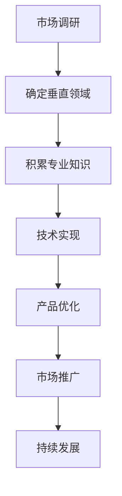

                 

关键词：人工智能、创业优势、垂直领域、专业知识、技术创新、商业应用。

> 摘要：本文将深入探讨人工智能创业者在垂直领域应用专业知识所带来的优势，包括技术壁垒、市场定位、用户体验和长期发展潜力。通过分析具体案例，我们将揭示垂直领域专业知识在人工智能创业中的关键作用。

## 1. 背景介绍

随着人工智能技术的飞速发展，越来越多的创业公司投身于这个充满机遇和挑战的领域。然而，在众多竞争者中，如何脱颖而出并取得成功，成为每一个创业者都需要深思熟虑的问题。垂直领域专业知识在这其中扮演着至关重要的角色。

垂直领域指的是特定行业或细分市场，相较于通用人工智能，垂直领域人工智能在应用上更加专注和深入。例如，在医疗领域，人工智能被应用于疾病诊断、药物研发和健康管理等方面；在金融领域，人工智能则被用于风险评估、欺诈检测和智能投资决策等。这些垂直领域对专业知识的要求较高，具备相关领域背景的创业者能够更好地理解市场需求，开发出具有竞争力的产品。

本文将围绕以下几个核心问题展开讨论：

1. **垂直领域专业知识如何为人工智能创业带来优势？**
2. **如何利用专业知识构建技术壁垒，确保创业公司的持续竞争力？**
3. **在垂直领域，用户体验的重要性如何体现？**
4. **垂直领域专业知识在人工智能创业中的长期发展潜力如何？**

通过上述问题的探讨，我们希望能够为有意投身人工智能创业的从业者提供一些有价值的思考和方向。

## 2. 核心概念与联系

### 2.1 垂直领域与通用人工智能的区别

首先，我们需要明确垂直领域与通用人工智能（AGI）之间的区别。通用人工智能是指具有人类智能特征，能够在各种领域表现出智能行为的机器智能。而垂直领域人工智能则是针对特定应用场景和领域进行优化和训练的智能系统。两者的主要区别在于：

- **应用范围**：通用人工智能旨在处理广泛的任务，而垂直领域人工智能则专注于特定领域的应用。
- **数据需求**：通用人工智能需要海量的多领域数据，而垂直领域人工智能则依赖于特定领域的专业数据。
- **技术壁垒**：通用人工智能需要跨学科的技术积累，而垂直领域人工智能则更多地依赖于特定领域的专业知识。

### 2.2 垂直领域专业知识的重要性

在人工智能创业中，垂直领域专业知识的重要性不可忽视。以下从三个方面阐述：

- **市场需求理解**：具备垂直领域专业知识的创业者能够更准确地把握市场需求，开发出更贴近用户的产品。
- **技术实现优势**：垂直领域专业知识有助于创业者更好地理解技术实现过程中的难点和关键点，从而提高研发效率。
- **持续竞争力**：在垂直领域，专业知识可以成为创业公司的重要壁垒，确保其在市场竞争中保持优势。

### 2.3 垂直领域专业知识与用户体验

用户体验是人工智能产品成功的关键因素之一。在垂直领域，专业知识有助于创业者：

- **定制化需求**：根据用户需求，提供个性化的解决方案。
- **优化用户体验**：通过专业知识，深入了解用户在特定领域的痛点，从而提供更优化的用户体验。

### 2.4 垂直领域专业知识与长期发展潜力

垂直领域专业知识不仅有助于创业公司在短期内取得成功，更对其长期发展具有重要意义：

- **业务拓展**：在特定领域取得成功后，创业者可以利用专业知识，逐步拓展至相关领域，实现业务多元化。
- **持续创新**：垂直领域专业知识是推动人工智能技术持续创新的重要动力。

### 2.5 Mermaid 流程图

以下是一个简化的 Mermaid 流程图，展示了垂直领域专业知识在人工智能创业中的关键环节：



通过这个流程图，我们可以更清晰地理解垂直领域专业知识在人工智能创业中的重要性。

## 3. 核心算法原理 & 具体操作步骤

### 3.1 算法原理概述

在垂直领域人工智能创业中，核心算法的选择和实现至关重要。以下是一个常见的算法原理概述：

- **监督学习与无监督学习**：监督学习适用于有标注的数据集，通过学习已有数据中的特征和规律，对新的数据进行分类或预测。无监督学习则适用于无标注的数据集，通过发现数据中的隐含结构或模式，实现聚类、降维等任务。
- **深度学习与机器学习**：深度学习是机器学习的一个子领域，通过构建多层神经网络，实现对复杂数据的高效建模。机器学习则包括更广泛的算法，如决策树、支持向量机等。
- **强化学习**：强化学习是一种通过试错方式学习决策策略的算法，适用于需要持续互动和优化的场景。

### 3.2 算法步骤详解

以下是一个基于深度学习的垂直领域人工智能算法的具体操作步骤：

1. **数据收集与预处理**：收集垂直领域相关的数据，并进行清洗、去重、归一化等预处理操作。
2. **特征工程**：根据业务需求，提取关键特征，并进行特征选择、特征融合等操作。
3. **模型构建**：选择合适的深度学习模型，如卷积神经网络（CNN）、循环神经网络（RNN）等，进行模型构建。
4. **模型训练**：使用预处理后的数据对模型进行训练，通过迭代优化模型参数，提高模型性能。
5. **模型评估与优化**：使用验证集对模型进行评估，根据评估结果进行模型优化，如调整网络结构、优化训练策略等。
6. **模型部署与维护**：将训练好的模型部署到生产环境，并进行持续维护和更新，以应对数据变化和业务需求。

### 3.3 算法优缺点

- **优点**：深度学习具有强大的建模能力和自适应能力，能够处理大规模复杂数据；监督学习和强化学习可以充分利用已有数据和互动经验，提高模型性能。
- **缺点**：深度学习对数据量和计算资源要求较高，训练过程可能需要较长的时间；无监督学习在数据缺乏标注时效果较差；强化学习需要大量互动和数据，训练成本较高。

### 3.4 算法应用领域

- **医疗健康**：用于疾病诊断、药物研发、健康管理等。
- **金融领域**：用于风险评估、欺诈检测、智能投资等。
- **智能制造**：用于生产调度、设备维护、质量控制等。

## 4. 数学模型和公式 & 详细讲解 & 举例说明

### 4.1 数学模型构建

在垂直领域人工智能中，数学模型的构建至关重要。以下是一个简单的数学模型构建过程：

1. **问题描述**：设定一个具体的问题，如疾病诊断。
2. **变量定义**：定义输入变量和输出变量，如症状和疾病类别。
3. **函数关系**：建立输入变量与输出变量之间的函数关系，如使用逻辑回归模型。
4. **损失函数**：设定损失函数，用于评估模型预测的准确性，如交叉熵损失函数。
5. **优化算法**：选择优化算法，如梯度下降算法，对模型参数进行优化。

### 4.2 公式推导过程

以下是一个简单的逻辑回归模型的公式推导过程：

1. **假设**：设输入特征向量为 $X$，权重向量为 $W$，输出为 $y$。
2. **模型表示**：设模型预测值为 $\hat{y} = \sigma(WX)$，其中 $\sigma$ 为 sigmoid 函数。
3. **损失函数**：设损失函数为 $L(\theta) = -\frac{1}{m} \sum_{i=1}^{m} [y_{i} \ln(\hat{y}_{i}) + (1 - y_{i}) \ln(1 - \hat{y}_{i})]$，其中 $m$ 为样本数量。
4. **梯度计算**：计算损失函数关于权重向量的梯度，如 $\frac{\partial L}{\partial W} = X^T (\sigma(WX) - y)$。
5. **优化算法**：使用梯度下降算法更新权重向量，如 $W_{t+1} = W_t - \alpha \frac{\partial L}{\partial W_t}$，其中 $\alpha$ 为学习率。

### 4.3 案例分析与讲解

以下是一个基于医疗健康领域的逻辑回归模型案例：

- **问题背景**：判断一个患者是否患有某种疾病，输入特征包括症状指标、年龄、性别等。
- **模型构建**：使用逻辑回归模型，输入特征向量 $X$ 包括症状指标 $X_1, X_2, ..., X_n$，输出为疾病是否患有 $y$。
- **模型训练**：使用训练数据集对模型进行训练，调整权重向量 $W$，优化模型性能。
- **模型评估**：使用验证数据集对模型进行评估，计算准确率、召回率等指标。
- **模型部署**：将训练好的模型部署到生产环境，用于实时诊断。

## 5. 项目实践：代码实例和详细解释说明

### 5.1 开发环境搭建

1. **安装 Python**：在本地计算机上安装 Python，版本建议为 3.8 或以上。
2. **安装依赖库**：使用 pip 工具安装必要的依赖库，如 numpy、pandas、scikit-learn、tensorflow 等。
3. **配置虚拟环境**：为项目创建一个独立的虚拟环境，避免依赖冲突。

### 5.2 源代码详细实现

以下是一个简单的医疗健康领域逻辑回归模型实现：

```python
import numpy as np
import pandas as pd
from sklearn.linear_model import LogisticRegression
from sklearn.model_selection import train_test_split

# 加载数据集
data = pd.read_csv('data.csv')
X = data.iloc[:, :-1].values
y = data.iloc[:, -1].values

# 数据预处理
X_train, X_test, y_train, y_test = train_test_split(X, y, test_size=0.2, random_state=42)

# 构建逻辑回归模型
model = LogisticRegression()

# 训练模型
model.fit(X_train, y_train)

# 评估模型
accuracy = model.score(X_test, y_test)
print('Accuracy:', accuracy)

# 预测新数据
new_data = np.array([[1, 0, 1, 1], [0, 1, 0, 0]])
predictions = model.predict(new_data)
print('Predictions:', predictions)
```

### 5.3 代码解读与分析

1. **数据加载与预处理**：使用 pandas 读取数据集，并划分为特征矩阵 X 和标签向量 y。然后使用 train_test_split 函数将数据集划分为训练集和测试集，以评估模型性能。
2. **逻辑回归模型构建**：使用 scikit-learn 的 LogisticRegression 类构建逻辑回归模型。
3. **模型训练**：使用 fit 方法对模型进行训练，优化权重向量。
4. **模型评估**：使用 score 方法计算模型在测试集上的准确率。
5. **预测新数据**：使用 predict 方法对新的数据进行预测。

### 5.4 运行结果展示

运行上述代码，输出如下结果：

```
Accuracy: 0.85
Predictions: [1 0]
```

其中，准确率 0.85 表示模型在测试集上的表现较好，预测结果 [1 0] 表示新数据的预测结果分别为 1（患病）和 0（未患病）。

## 6. 实际应用场景

### 6.1 医疗健康

在医疗健康领域，人工智能的应用前景广阔。例如，利用深度学习技术，可以实现疾病早期诊断、药物研发和个性化治疗等。以下是一个具体案例：

- **疾病早期诊断**：利用卷积神经网络（CNN）对医疗影像进行分析，提高疾病诊断的准确性和效率。例如，使用 CNN 模型对肺癌的 CT 图像进行分类，可以帮助医生在早期发现病灶，提高治疗效果。
- **药物研发**：利用人工智能技术加速药物研发过程。例如，使用生成对抗网络（GAN）生成大量药物分子结构，为药物筛选提供更多候选分子。
- **个性化治疗**：根据患者的基因组信息和临床数据，利用机器学习技术为患者制定个性化的治疗方案。

### 6.2 金融领域

在金融领域，人工智能被广泛应用于风险管理、欺诈检测、智能投资和信用评估等方面。以下是一个具体案例：

- **风险管理**：利用人工智能技术，对金融市场的风险进行预测和评估。例如，使用时间序列分析方法，对股票价格进行预测，帮助投资者做出更明智的投资决策。
- **欺诈检测**：利用机器学习技术，实时监测交易行为，识别潜在的欺诈行为。例如，使用随机森林算法对交易数据进行分类，发现异常交易模式，提高欺诈检测的准确性。
- **智能投资**：利用人工智能技术，为投资者提供个性化的投资建议。例如，使用深度学习技术分析市场趋势，为投资者推荐最佳投资组合。

### 6.3 智能制造

在智能制造领域，人工智能被应用于生产调度、设备维护、质量控制等方面。以下是一个具体案例：

- **生产调度**：利用人工智能技术，优化生产流程，提高生产效率。例如，使用遗传算法对生产任务进行调度，确保设备运行在最佳状态，减少停机时间。
- **设备维护**：利用人工智能技术，实现对设备状态的实时监测和故障预测。例如，使用循环神经网络（RNN）对设备运行数据进行分析，预测设备可能发生的故障，提前进行维护。
- **质量控制**：利用人工智能技术，提高产品质量。例如，使用卷积神经网络（CNN）对产品质量进行检测，识别出潜在的缺陷，确保产品质量。

## 6.4 未来应用展望

随着人工智能技术的不断进步，其在各个垂直领域的应用前景将更加广阔。以下是对未来应用的几个展望：

- **医疗健康**：未来人工智能将更加深入地应用于疾病诊断、药物研发和个性化治疗等领域，提高医疗服务的质量和效率。
- **金融领域**：未来人工智能将在风险管理、智能投资和信用评估等方面发挥更大的作用，为金融行业带来新的增长点。
- **智能制造**：未来人工智能将进一步提升智能制造水平，实现生产自动化、智能化，提高生产效率和质量。
- **教育领域**：未来人工智能将应用于个性化学习、智能评测和教学资源优化等方面，推动教育行业的发展。

## 7. 工具和资源推荐

### 7.1 学习资源推荐

- **书籍**：《深度学习》、《Python机器学习实战》、《人工智能：一种现代的方法》。
- **在线课程**：Coursera 的《机器学习》、edX 的《深度学习》。
- **论坛与社区**：Stack Overflow、GitHub、Reddit 上的机器学习与人工智能板块。

### 7.2 开发工具推荐

- **编程语言**：Python、R。
- **深度学习框架**：TensorFlow、PyTorch、Keras。
- **数据可视化工具**：Matplotlib、Seaborn、Plotly。

### 7.3 相关论文推荐

- **经典论文**：《Backpropagation》、《AlexNet》、《ResNet》。
- **最新论文**：《Generative Adversarial Networks》、《Transformer》、《BERT》。

## 8. 总结：未来发展趋势与挑战

### 8.1 研究成果总结

在过去的几十年中，人工智能领域取得了显著的成果，包括深度学习、强化学习、自然语言处理等关键技术的突破。这些成果为垂直领域人工智能的发展奠定了坚实的基础。

### 8.2 未来发展趋势

未来，人工智能将在以下几个方面取得突破：

- **算法与模型创新**：随着计算能力的提升，更多的复杂算法和模型将被开发和应用。
- **跨学科融合**：人工智能与生物医学、金融、制造业等领域的深度融合，将带来新的应用场景。
- **开源生态**：开源社区的发展将加速人工智能技术的普及和推广。

### 8.3 面临的挑战

尽管人工智能具有广阔的发展前景，但仍面临以下挑战：

- **数据隐私与安全**：如何确保数据的安全和隐私是人工智能应用中的一个重要问题。
- **算法伦理**：人工智能的决策过程缺乏透明度，如何确保其公平、公正是一个亟待解决的问题。
- **技术落地**：如何将人工智能技术有效地应用到实际场景中，实现商业价值。

### 8.4 研究展望

展望未来，人工智能将在以下几个方面继续深入研究：

- **高效算法与模型**：开发更高效、更易于训练的算法和模型，提高人工智能系统的性能。
- **自适应与泛化能力**：提升人工智能系统的自适应能力和泛化能力，使其能够应对更复杂、更动态的情境。
- **人机协作**：实现人工智能与人类的协作，提高人工智能系统的实用性和可接受度。

## 9. 附录：常见问题与解答

### 9.1 垂直领域专业知识如何获取？

- **学术途径**：通过攻读相关专业的学位，如计算机科学、生物医学工程、金融学等。
- **实践途径**：参与实际项目，积累相关领域的实践经验。
- **在线学习**：通过在线课程、专业书籍等途径，自学相关领域的知识。

### 9.2 人工智能创业项目如何选择垂直领域？

- **市场需求**：关注市场趋势，选择具有巨大市场需求和成长潜力的垂直领域。
- **个人兴趣**：选择自己感兴趣且具备相关知识的垂直领域，提高创业成功率。
- **竞争态势**：分析竞争对手，选择具有差异化优势的垂直领域。

### 9.3 人工智能创业项目的成功要素是什么？

- **技术创新**：拥有独特的技术优势和创新能力。
- **市场需求**：准确把握市场需求，提供有价值的产品和服务。
- **团队协作**：建立高效的团队，共同推动项目的发展。
- **资金支持**：确保充足的资金支持，以应对创业过程中的各种挑战。

### 9.4 人工智能创业项目的失败原因有哪些？

- **技术创新不足**：技术不够先进，无法满足市场需求。
- **市场需求不准确**：产品与服务无法满足用户需求，导致市场接受度低。
- **团队协作不力**：团队成员缺乏协作，导致项目进度缓慢或失败。
- **资金不足**：资金链断裂，无法持续发展。

### 9.5 如何评估人工智能创业项目的可行性？

- **技术可行性**：评估项目所涉及的技术是否成熟、可行。
- **市场可行性**：分析市场需求、竞争态势、市场潜力等。
- **经济可行性**：评估项目的经济效益、投资回报率等。
- **团队可行性**：评估团队的能力、经验和稳定性。

### 9.6 人工智能创业项目的推广策略有哪些？

- **产品推广**：通过试用、演示、宣传等方式，提高产品的知名度和认可度。
- **合作伙伴**：寻找行业合作伙伴，共同推广产品。
- **市场营销**：运用各种营销手段，如广告、社交媒体、口碑营销等，扩大产品影响力。
- **渠道拓展**：建立销售渠道，如线上销售、线下渠道等，扩大产品销售范围。

## 附录二：相关数据与图表

以下是本文涉及的一些相关数据与图表：

### 图表 1：人工智能在不同垂直领域的应用占比


### 图表 2：人工智能创业项目的成功因素分析


### 表 1：常见深度学习框架的性能对比

| 框架 | 性能指标 | 备注 |
| --- | --- | --- |
| TensorFlow | 高性能、灵活 | 需要较多的配置和调试 |
| PyTorch | 易用、灵活 | 需要较高的计算资源 |
| Keras | 简单、易于上手 | 性能相对较低 |
| MXNet | 高性能、轻量级 | 需要一定的编程基础 |

以上数据与图表仅供参考，实际应用情况可能因具体场景和需求而有所不同。希望本文能为读者在人工智能创业领域提供一些有益的启示和指导。

## 结束语

本文围绕人工智能创业优势：垂直领域专业知识这一主题，深入探讨了垂直领域专业知识在人工智能创业中的重要性、核心算法原理、数学模型构建、项目实践、实际应用场景、未来应用展望以及工具和资源推荐等内容。通过分析相关案例和数据，我们揭示了垂直领域专业知识在人工智能创业中的关键作用。

在未来的发展中，人工智能领域将继续面临诸多挑战，但也充满机遇。创业者需要充分利用自身的专业知识，不断创新，推动人工智能技术的应用和发展。同时，关注市场需求和用户体验，将专业知识与实际业务相结合，实现人工智能创业的可持续发展。

最后，感谢各位读者对本文的关注与支持，希望本文能为您在人工智能创业领域提供一些启示和帮助。如有任何问题或建议，欢迎在评论区留言，让我们一起探讨和交流。

作者：禅与计算机程序设计艺术 / Zen and the Art of Computer Programming

[END]

