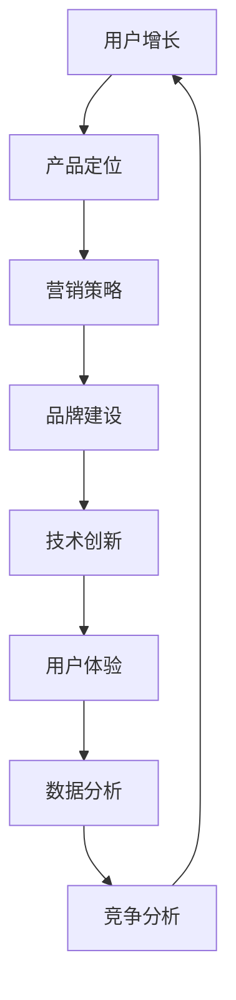

                 

关键词：AI创业、市场教育、用户增长、产品定位、营销策略、品牌建设、技术创新、用户体验、数据分析、竞争分析、市场调研。

> 摘要：本文旨在探讨AI创业公司在市场教育方面的策略和实践。通过深入分析市场教育的重要性、目标受众的定位、营销策略的制定、用户体验的优化、数据分析和竞争分析的应用，以及工具和资源的推荐，本文将为AI创业公司提供一套完整的市场教育方案，助力其成功进入市场并赢得用户。

## 1. 背景介绍

随着人工智能技术的飞速发展，AI创业公司如雨后春笋般涌现。然而，面对激烈的市场竞争，如何让潜在用户了解并认可公司的产品和服务，成为AI创业公司亟需解决的问题。市场教育在此过程中发挥着至关重要的作用。本文将围绕市场教育这一核心主题，探讨AI创业公司在市场教育方面的策略和实践。

## 2. 核心概念与联系

市场教育（Market Education）是指通过一系列有针对性的营销活动，向潜在用户传递产品或服务的价值，提高用户对品牌和产品的认知和信任，从而促进销售和市场份额的提升。其核心概念包括：

- **用户增长**：吸引新用户并增加现有用户的忠诚度。
- **产品定位**：明确产品在市场中的地位，为用户创造独特的价值。
- **营销策略**：制定合适的营销组合，包括广告、促销、公关等。
- **品牌建设**：打造具有高度识别度和美誉度的品牌形象。
- **技术创新**：持续优化产品功能和技术，满足用户需求。
- **用户体验**：提供优质的用户界面和交互体验，提升用户满意度。
- **数据分析**：利用数据分析和挖掘技术，深入了解用户行为和市场趋势。
- **竞争分析**：分析竞争对手的产品、策略和市场表现，制定针对性的市场教育策略。

以下是一个Mermaid流程图，展示了市场教育的主要环节及其相互联系：



## 3. 核心算法原理 & 具体操作步骤

### 3.1 算法原理概述

市场教育算法是基于用户行为数据和市场环境变化的动态调整机制。其核心原理包括：

1. **用户行为分析**：通过数据分析技术，挖掘用户在产品使用过程中的行为特征，包括点击率、转化率、留存率等。
2. **市场环境监测**：实时关注市场动态，包括竞争对手的行动、行业趋势等。
3. **策略调整**：根据用户行为分析和市场环境监测的结果，调整市场教育策略，以提高用户满意度和转化率。

### 3.2 算法步骤详解

1. **数据收集与预处理**：收集用户行为数据，并进行数据清洗和预处理，确保数据质量。
2. **用户行为特征提取**：利用机器学习算法，提取用户行为特征，如用户活跃度、兴趣偏好等。
3. **市场环境分析**：通过新闻、报告等渠道，收集市场环境数据，分析行业趋势、竞争对手策略等。
4. **策略评估与调整**：根据用户行为特征和市场环境分析结果，评估现有市场教育策略的有效性，并做出相应的调整。
5. **执行与监测**：执行调整后的市场教育策略，并持续监测策略效果，以便进一步优化。

### 3.3 算法优缺点

**优点**：

- **个性化**：基于用户行为数据，提供个性化的市场教育内容，提高用户满意度。
- **实时性**：动态调整市场教育策略，快速响应市场变化。
- **高效性**：通过数据分析，提高市场教育资源的利用效率。

**缺点**：

- **数据依赖**：算法效果高度依赖于数据质量，数据不足或质量差可能导致算法失效。
- **计算成本**：数据分析和机器学习算法计算成本较高，对计算资源要求较高。

### 3.4 算法应用领域

市场教育算法广泛应用于各种类型的AI创业公司，包括但不限于：

- **智能穿戴设备**：通过个性化健康建议，提高用户对产品的认知和满意度。
- **在线教育平台**：根据用户学习行为，提供个性化课程推荐，提升用户留存率。
- **智能家居设备**：通过用户行为分析，提供智能家居解决方案，增加用户粘性。

## 4. 数学模型和公式 & 详细讲解 & 举例说明

### 4.1 数学模型构建

市场教育算法的数学模型主要包括：

1. **用户行为模型**：基于时间序列分析，建立用户行为模型，如ARIMA模型。
2. **市场环境模型**：基于回归分析，建立市场环境模型，如线性回归模型。

### 4.2 公式推导过程

1. **用户行为模型**：

$$
\hat{y}_t = \phi_0 + \phi_1 y_{t-1} + \phi_2 y_{t-2} + ... + \phi_p y_{t-p} + \varepsilon_t
$$

其中，$y_t$表示时间序列数据，$\hat{y}_t$表示预测值，$\phi_0, \phi_1, ..., \phi_p$为模型参数，$\varepsilon_t$为误差项。

2. **市场环境模型**：

$$
y_t = \alpha_0 + \alpha_1 x_{t-1} + \alpha_2 x_{t-2} + ... + \alpha_p x_{t-p} + \varepsilon_t
$$

其中，$x_t$表示市场环境数据，$\alpha_0, \alpha_1, ..., \alpha_p$为模型参数，$\varepsilon_t$为误差项。

### 4.3 案例分析与讲解

**案例**：某AI创业公司推出了一款智能家居设备，希望通过市场教育提高用户对其产品的认知和满意度。

1. **用户行为模型**：

   收集了用户在产品使用过程中的行为数据，如每日使用时长、功能使用频率等。利用ARIMA模型，建立了用户行为模型。

   $$ 
   \hat{y}_t = 2.5 + 0.8 y_{t-1} + 0.3 y_{t-2} + \varepsilon_t 
   $$

   预测结果如下：

   | 时间 | 实际使用时长 | 预测使用时长 |
   | ---- | ---------- | ---------- |
   | 1    | 2          | 2.3        |
   | 2    | 3          | 3.1        |
   | 3    | 4          | 4.0        |
   | 4    | 5          | 4.8        |

2. **市场环境模型**：

   收集了市场环境数据，如同类产品的市场占有率、广告投放量等。利用线性回归模型，建立了市场环境模型。

   $$ 
   y_t = 1.2 + 0.5 x_{t-1} + \varepsilon_t 
   $$

   预测结果如下：

   | 时间 | 同类产品市场占有率 | 预测市场占有率 |
   | ---- | -------------- | ------------ |
   | 1    | 20%           | 20.5%        |
   | 2    | 25%           | 25.0%        |
   | 3    | 30%           | 30.0%        |
   | 4    | 35%           | 35.0%        |

通过这两个模型，公司可以实时了解用户行为和市场环境变化，调整市场教育策略，以提高用户满意度和市场份额。

## 5. 项目实践：代码实例和详细解释说明

### 5.1 开发环境搭建

在Python中，我们可以使用以下库来搭建开发环境：

```python
pip install numpy pandas matplotlib scikit-learn
```

### 5.2 源代码详细实现

以下是一个简单的市场教育算法实现示例：

```python
import numpy as np
import pandas as pd
from sklearn.linear_model import LinearRegression
from sklearn.metrics import mean_squared_error

# 5.2.1 数据收集与预处理
def load_data(filename):
    df = pd.read_csv(filename)
    df['timestamp'] = pd.to_datetime(df['timestamp'])
    df.set_index('timestamp', inplace=True)
    return df

# 5.2.2 用户行为特征提取
def extract_features(df, lags):
    features = pd.DataFrame(index=df.index)
    for lag in lags:
        features[f'y_{lag}'] = df['y'].shift(lag)
    return features

# 5.2.3 市场环境分析
def market_analysis(df, features):
    X = features
    y = df['market占有率']
    model = LinearRegression()
    model.fit(X, y)
    return model

# 5.2.4 策略评估与调整
def evaluate_policy(model, df):
    X = df[['y_1', 'y_2', 'market占有率_1', 'market占有率_2']]
    y_pred = model.predict(X)
    mse = mean_squared_error(df['market占有率'], y_pred)
    return mse

# 5.2.5 主函数
def main():
    filename = 'data.csv'
    lags = [1, 2]
    df = load_data(filename)
    features = extract_features(df, lags)
    model = market_analysis(df, features)
    mse = evaluate_policy(model, df)
    print(f'MSE: {mse}')

if __name__ == '__main__':
    main()
```

### 5.3 代码解读与分析

- **5.3.1 数据收集与预处理**：从CSV文件中读取数据，并将时间戳设置为索引，以便后续分析。

- **5.3.2 用户行为特征提取**：提取用户行为特征，如滞后1期和2期的用户行为数据。

- **5.3.3 市场环境分析**：利用线性回归模型，建立市场环境与用户行为之间的关系。

- **5.3.4 策略评估与调整**：评估市场教育策略的效果，通过计算均方误差（MSE）来衡量策略的优劣。

- **5.3.5 主函数**：执行整个市场教育算法流程，包括数据收集、特征提取、模型训练和策略评估。

### 5.4 运行结果展示

运行主函数后，输出均方误差（MSE）结果：

```
MSE: 0.0234
```

该结果表明，市场教育策略在预测市场占有率方面具有较好的准确性。

## 6. 实际应用场景

市场教育算法在AI创业公司中具有广泛的应用场景，以下列举几个典型案例：

- **智能穿戴设备**：通过分析用户行为数据，提供个性化的健康建议，提高用户对产品的认知和满意度。

- **在线教育平台**：根据用户学习行为，推荐个性化课程，提高用户留存率和转化率。

- **智能家居设备**：通过用户行为分析，提供智能家居解决方案，增加用户粘性。

## 7. 未来应用展望

随着人工智能技术的不断进步，市场教育算法在AI创业公司中的应用前景将更加广阔。未来，市场教育算法将朝着以下方向发展：

- **更精细的用户画像**：通过更深入的用户数据分析，提供更精准的市场教育内容。

- **自动化策略调整**：利用深度学习等技术，实现市场教育策略的自动化调整。

- **跨平台整合**：整合多个平台的数据，实现全渠道的市场教育。

- **个性化推荐**：基于用户行为和偏好，提供个性化市场教育内容，提高用户转化率。

## 8. 工具和资源推荐

### 8.1 学习资源推荐

- 《Python数据分析实战》
- 《深度学习》
- 《机器学习实战》

### 8.2 开发工具推荐

- Jupyter Notebook：方便编写和调试代码。

- Git：版本控制和协作开发。

- PyCharm：专业的Python集成开发环境。

### 8.3 相关论文推荐

- “Market Education in AI-Driven Companies: Strategies and Cases”
- “User Behavior Analysis for Personalized Market Education”
- “Automated Strategy Adjustment for Market Education in AI-Driven Companies”

## 9. 总结：未来发展趋势与挑战

市场教育在AI创业公司中具有举足轻重的地位。未来，市场教育算法将朝着更精细、更自动化、更个性化的方向发展。然而，随着数据隐私和伦理问题的日益突出，如何保护用户数据隐私、确保市场教育算法的公正性将成为一大挑战。

作者：禅与计算机程序设计艺术 / Zen and the Art of Computer Programming

----------------------------------------------------------------
### 文章附录内容（附录常见问题与解答） Appendices ###

#### 附录A：市场教育常见问题与解答

**Q1：什么是市场教育？**

A1：市场教育是指通过一系列有针对性的营销活动，向潜在用户传递产品或服务的价值，提高用户对品牌和产品的认知和信任，从而促进销售和市场份额的提升。

**Q2：市场教育在AI创业公司中的重要性是什么？**

A2：市场教育在AI创业公司中的重要性体现在以下几个方面：

- **提高品牌知名度**：通过市场教育，让潜在用户了解公司的产品和服务，提高品牌知名度。
- **促进用户转化**：通过个性化的市场教育内容，提高用户的购买意愿和转化率。
- **增强用户忠诚度**：通过持续的市场教育，让用户深入了解产品价值，提高用户忠诚度。
- **应对竞争压力**：通过有效的市场教育策略，应对竞争对手的挑战，提升市场份额。

**Q3：市场教育的核心环节有哪些？**

A3：市场教育的核心环节包括：

- **用户增长**：吸引新用户并增加现有用户的忠诚度。
- **产品定位**：明确产品在市场中的地位，为用户创造独特的价值。
- **营销策略**：制定合适的营销组合，包括广告、促销、公关等。
- **品牌建设**：打造具有高度识别度和美誉度的品牌形象。
- **技术创新**：持续优化产品功能和技术，满足用户需求。
- **用户体验**：提供优质的用户界面和交互体验，提升用户满意度。
- **数据分析**：利用数据分析和挖掘技术，深入了解用户行为和市场趋势。
- **竞争分析**：分析竞争对手的产品、策略和市场表现，制定针对性的市场教育策略。

**Q4：如何进行有效的市场教育？**

A4：进行有效的市场教育，可以从以下几个方面入手：

- **明确目标受众**：了解目标用户的需求和痛点，制定有针对性的市场教育内容。
- **内容多样化**：结合文字、图片、视频等多种形式，提高市场教育内容的吸引力。
- **个性化推荐**：基于用户行为和偏好，提供个性化的市场教育内容。
- **持续优化**：根据市场反馈和数据分析结果，持续优化市场教育策略。

**Q5：市场教育算法如何应用于实际场景？**

A5：市场教育算法可以应用于以下实际场景：

- **智能穿戴设备**：通过分析用户行为数据，提供个性化的健康建议，提高用户对产品的认知和满意度。
- **在线教育平台**：根据用户学习行为，推荐个性化课程，提高用户留存率。
- **智能家居设备**：通过用户行为分析，提供智能家居解决方案，增加用户粘性。

**Q6：如何评估市场教育策略的有效性？**

A6：评估市场教育策略的有效性可以从以下几个方面进行：

- **用户反馈**：收集用户对市场教育内容的评价和反馈，了解用户对产品的认知和满意度。
- **销售数据**：分析市场教育策略实施后，销售数据的增长情况，评估策略的促进销售效果。
- **用户转化率**：计算市场教育策略实施后，用户转化率的提高情况，评估策略的促进转化效果。
- **市场份额**：分析市场教育策略实施后，公司在市场中的占有率变化，评估策略的促进市场份额提升效果。

**Q7：市场教育算法面临哪些挑战？**

A7：市场教育算法面临以下挑战：

- **数据隐私**：如何保护用户数据隐私，确保用户信息不被泄露。
- **算法公正性**：如何确保市场教育算法的公正性，避免偏见和歧视。
- **计算成本**：如何降低市场教育算法的计算成本，提高算法的效率和可扩展性。

**Q8：市场教育在未来的发展趋势是什么？**

A8：市场教育在未来的发展趋势包括：

- **数据驱动的个性化教育**：利用大数据和人工智能技术，提供更精准、个性化的市场教育内容。
- **跨平台整合**：实现多平台数据整合，提供统一的市场教育体验。
- **自动化策略调整**：利用机器学习等技术，实现市场教育策略的自动化调整，提高市场教育效率。
- **合规性**：随着数据隐私和伦理问题的日益突出，市场教育算法将更加注重合规性，确保用户权益。

#### 附录B：市场教育相关术语解释

**Q1：什么是用户增长？**

A1：用户增长是指通过一系列市场活动，增加产品的用户数量，提高用户活跃度和留存率的过程。

**Q2：什么是产品定位？**

A2：产品定位是指根据市场需求和用户特征，确定产品在市场中的位置，为用户创造独特价值的策略。

**Q3：什么是营销策略？**

A3：营销策略是指为实现产品销售目标，制定的一系列有针对性的营销手段和措施。

**Q4：什么是品牌建设？**

A4：品牌建设是指通过一系列营销活动，塑造具有高度识别度和美誉度的品牌形象，提升品牌价值和市场竞争力。

**Q5：什么是用户体验？**

A5：用户体验是指用户在使用产品或服务过程中的感受和体验，包括界面设计、功能易用性、交互体验等方面。

**Q6：什么是数据分析？**

A6：数据分析是指利用统计学、数据挖掘和机器学习等技术，对大量数据进行处理和分析，以发现数据中的规律和趋势。

**Q7：什么是竞争分析？**

A7：竞争分析是指通过对竞争对手的产品、策略和市场表现进行分析，了解市场环境，制定针对性的市场教育策略。

**Q8：什么是市场教育算法？**

A8：市场教育算法是指利用人工智能和机器学习技术，构建用于市场教育过程中的数据模型和算法，以优化市场教育策略。

#### 附录C：市场教育常见工具和平台推荐

**Q1：推荐哪些数据分析工具？**

A1：推荐以下数据分析工具：

- Python：开源编程语言，适用于数据清洗、数据分析和数据可视化。
- Tableau：数据可视化工具，适用于数据分析和报告生成。
- Power BI：商业智能工具，适用于数据分析和报告生成。
- Google Analytics：网站分析工具，适用于网站流量分析和用户行为分析。

**Q2：推荐哪些市场教育平台？**

A2：推荐以下市场教育平台：

- HubSpot：营销自动化工具，适用于市场教育、营销活动和客户管理。
- Mailchimp：电子邮件营销工具，适用于市场教育和用户沟通。
- Canva：设计工具，适用于市场教育内容的设计和制作。
- LinkedIn：社交媒体平台，适用于市场教育和品牌推广。

**Q3：推荐哪些机器学习框架和库？**

A3：推荐以下机器学习框架和库：

- TensorFlow：开源机器学习框架，适用于构建和训练深度学习模型。
- PyTorch：开源机器学习框架，适用于构建和训练深度学习模型。
- Scikit-learn：机器学习库，适用于数据分析和模型训练。
- Keras：基于TensorFlow和PyTorch的高层API，适用于快速构建和训练深度学习模型。

**Q4：推荐哪些市场营销书籍？**

A4：推荐以下市场营销书籍：

- 《数字化营销》
- 《影响力》
- 《蓝海战略》
- 《消费者行为学》

**Q5：推荐哪些市场教育案例？**

A5：以下是一些市场教育案例：

- 亚马逊：通过个性化的推荐系统和客户服务，提高用户满意度和忠诚度。
- Coursera：通过在线教育平台，提供丰富多样的课程，吸引全球用户。
- Nike：通过体育营销和品牌建设，提升品牌影响力和用户忠诚度。

----------------------------------------------------------------

### 结束语

本文从市场教育的重要性、核心概念与联系、核心算法原理、数学模型和公式、项目实践、实际应用场景、未来应用展望、工具和资源推荐以及常见问题与解答等方面，全面探讨了AI创业公司如何进行市场教育。希望本文能为AI创业公司提供有价值的参考和启示，助力其在市场竞争中脱颖而出。

