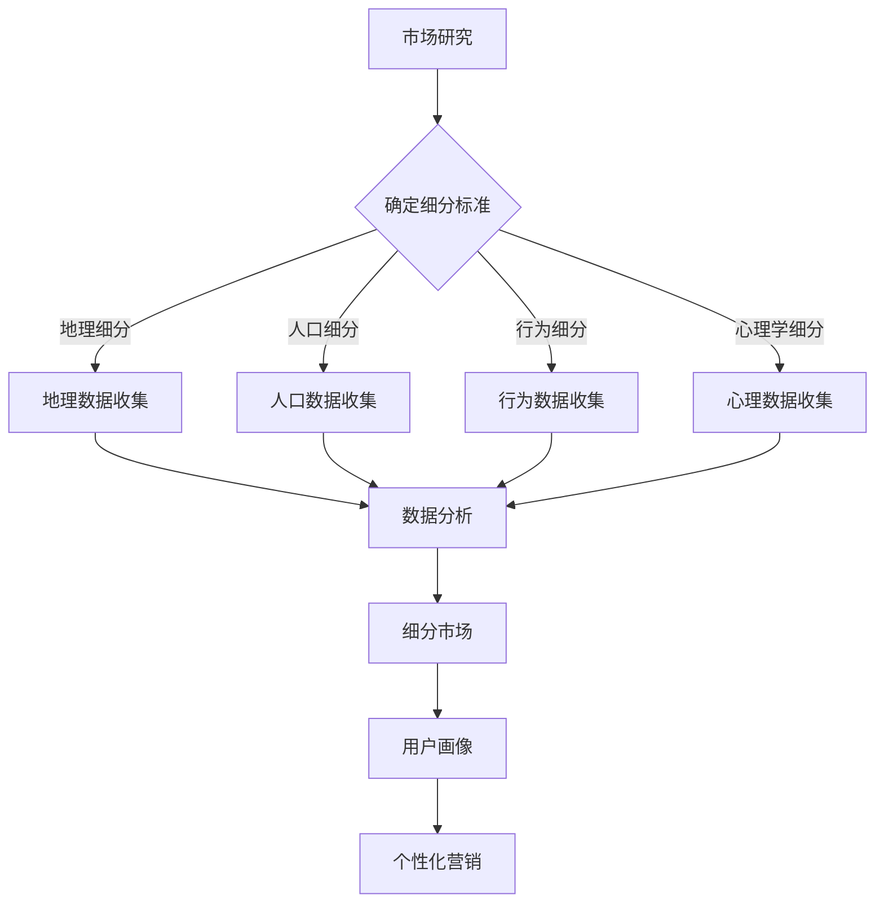

                 

 > **关键词**: AI创业公司, 市场细分, 客户洞察, 数据分析, 竞争分析, 用户画像, 个性化营销

> **摘要**: 本文将深入探讨AI创业公司如何通过有效的市场细分策略来提升竞争力。我们将详细分析市场细分的重要性，介绍常用的市场细分方法，讨论如何利用数据分析进行市场细分，并结合实际案例说明如何实施市场细分策略，最终展望AI技术在市场细分领域的发展趋势与未来挑战。

## 1. 背景介绍

在当今快速变化的市场环境中，竞争日益激烈，AI创业公司面临着前所未有的挑战。如何找到目标市场，抓住潜在客户，实现商业成功，成为每一个创业公司都必须面对的课题。市场细分作为一种有效的营销策略，可以帮助企业更好地了解市场需求，精准定位客户，从而提升市场份额和盈利能力。

市场细分不仅仅是一种简单的分类方法，它更是一种深入理解市场和客户需求的方式。通过市场细分，企业可以将整体市场划分为具有相似需求和特征的不同群体，从而有针对性地进行产品开发和营销活动。对于AI创业公司而言，市场细分的重要性尤为突出，因为它们往往拥有先进的技术，但市场经验相对不足。有效的市场细分策略可以帮助这些公司快速找到突破口，实现差异化竞争。

本文将首先介绍市场细分的基本概念，然后讨论AI创业公司如何进行市场细分，包括数据分析、用户画像、个性化营销等方面的内容。最后，我们将结合实际案例，探讨市场细分策略在实际操作中的应用，并展望未来AI技术在市场细分领域的发展趋势。

## 2. 核心概念与联系

### 2.1 市场细分

市场细分（Market Segmentation）是指将一个广泛的市场划分为若干具有相似需求和特征的小市场，以便企业可以更有效地针对每个细分市场进行产品开发和营销活动。市场细分的核心目的是找到最具有潜力的客户群体，从而实现资源的优化配置和营销效益的最大化。

市场细分的主要类型包括地理细分、人口细分、行为细分和心理学细分：

- **地理细分**：根据地理位置、气候、文化等因素来划分市场。
- **人口细分**：根据人口统计特征，如年龄、性别、收入、教育程度等来划分市场。
- **行为细分**：根据消费者的购买行为、消费习惯等来划分市场。
- **心理学细分**：根据消费者的生活方式、个性、价值观等心理特征来划分市场。

### 2.2 数据分析

数据分析（Data Analysis）是指通过系统的方法和工具，从大量数据中提取有用信息的过程。在市场细分中，数据分析是至关重要的环节。通过数据分析，企业可以识别出不同细分市场的特征和需求，从而制定更精准的营销策略。

数据分析的主要工具和技术包括：

- **数据收集与清洗**：通过调查问卷、在线数据收集、API接口等方式获取数据，并对数据进行清洗和预处理。
- **数据挖掘**：利用机器学习和数据挖掘算法，从大量数据中发现潜在的模式和趋势。
- **统计分析**：运用统计学方法对数据进行描述和分析，以识别数据的特征和关系。

### 2.3 用户画像

用户画像（User Profiling）是指通过收集和分析用户的多种信息，构建出一个完整、立体的用户模型。用户画像可以帮助企业深入了解目标客户，从而实现精准营销。

构建用户画像的主要步骤包括：

- **数据收集**：收集用户的基本信息、行为数据、社交数据等。
- **数据清洗与整合**：对收集到的数据进行清洗和整合，确保数据质量。
- **特征提取**：从数据中提取用户的特征，如年龄、性别、职业、兴趣爱好等。
- **模型构建**：利用机器学习算法，将用户的特征组合成用户画像模型。

### 2.4 个性化营销

个性化营销（Personalized Marketing）是指根据用户的兴趣、行为和需求，提供个性化的产品和服务。通过个性化营销，企业可以提升用户满意度，增加用户粘性，从而提高转化率和客户忠诚度。

个性化营销的主要策略包括：

- **内容个性化**：根据用户的兴趣和行为，推送个性化的内容。
- **产品个性化**：为不同用户群体提供定制化的产品和服务。
- **价格个性化**：根据用户的需求和购买行为，提供灵活的价格策略。

### 2.5 Mermaid 流程图

下面是一个关于市场细分过程的Mermaid流程图：



通过以上流程，企业可以系统地实施市场细分策略，从而实现精准营销。

## 3. 核心算法原理 & 具体操作步骤

### 3.1 算法原理概述

市场细分的核心算法原理主要包括数据收集、数据分析、用户画像和个性化营销。以下将详细介绍每个步骤的原理和具体操作步骤。

#### 3.1.1 数据收集

数据收集是市场细分的基础，主要包括以下几种方式：

- **问卷调查**：通过在线问卷、电话调查等方式收集用户基本信息和需求。
- **在线行为数据**：通过网站日志、APP使用记录等方式收集用户的浏览和购买行为数据。
- **第三方数据**：通过购买第三方数据源，获取用户的人口统计信息和消费行为数据。

#### 3.1.2 数据分析

数据分析是市场细分的核心环节，主要包括以下几种方法：

- **描述性分析**：对收集到的数据进行描述性统计分析，如计算平均值、中位数、标准差等。
- **聚类分析**：利用聚类算法，如K-means、层次聚类等，将相似的用户归为同一类别。
- **关联规则分析**：利用关联规则挖掘算法，如Apriori算法，发现不同变量之间的关联关系。

#### 3.1.3 用户画像

用户画像的构建主要包括以下步骤：

- **特征提取**：从收集到的数据中提取用户的特征，如年龄、性别、职业、兴趣爱好等。
- **特征工程**：对提取的特征进行预处理和转换，如归一化、离散化等。
- **模型训练**：利用机器学习算法，如决策树、随机森林等，构建用户画像模型。

#### 3.1.4 个性化营销

个性化营销的实现主要包括以下策略：

- **内容推荐**：根据用户的兴趣和行为，推荐个性化的内容。
- **产品定制**：为不同用户群体提供定制化的产品和服务。
- **价格策略**：根据用户的需求和购买行为，提供灵活的价格策略。

### 3.2 算法步骤详解

#### 3.2.1 数据收集

1. 设计调查问卷，收集用户基本信息和需求。
2. 通过在线行为数据和第三方数据源，收集用户的浏览和购买行为数据。
3. 对收集到的数据进行清洗和整合，确保数据质量。

#### 3.2.2 数据分析

1. 对收集到的数据进行分析，计算描述性统计量。
2. 利用聚类分析，将相似的用户归为同一类别。
3. 利用关联规则挖掘，发现不同变量之间的关联关系。

#### 3.2.3 用户画像

1. 从数据中提取用户的特征，如年龄、性别、职业、兴趣爱好等。
2. 对提取的特征进行预处理和转换。
3. 利用机器学习算法，构建用户画像模型。

#### 3.2.4 个性化营销

1. 根据用户的兴趣和行为，推荐个性化的内容。
2. 为不同用户群体提供定制化的产品和服务。
3. 根据用户的需求和购买行为，提供灵活的价格策略。

### 3.3 算法优缺点

#### 3.3.1 优点

- **提高营销效果**：通过市场细分，企业可以针对不同细分市场制定更精准的营销策略，提高营销效果。
- **提升用户满意度**：个性化营销策略可以提升用户满意度，增加用户粘性。
- **优化资源配置**：通过市场细分，企业可以更有效地分配资源和精力，提升运营效率。

#### 3.3.2 缺点

- **数据收集和处理成本高**：市场细分需要大量数据的支持，数据收集和处理成本较高。
- **算法模型复杂**：市场细分涉及的算法模型较为复杂，需要专业的技术团队进行开发和维护。

### 3.4 算法应用领域

市场细分算法广泛应用于各个行业，如电子商务、金融、电信、教育等。以下是一些具体的案例：

- **电子商务**：通过市场细分，电商平台可以为不同用户群体提供个性化的商品推荐和优惠活动。
- **金融**：银行和保险公司可以通过市场细分，为不同风险承受能力的客户提供定制化的金融产品和服务。
- **电信**：电信运营商可以通过市场细分，为不同类型的用户群体提供个性化的套餐和优惠。

## 4. 数学模型和公式 & 详细讲解 & 举例说明

### 4.1 数学模型构建

市场细分中的数学模型主要涉及聚类分析和用户画像构建。以下分别介绍这两种模型的构建方法。

#### 4.1.1 聚类分析模型

聚类分析模型的核心是找到一组最佳划分标准，将数据划分为若干个簇。常见的聚类算法有K-means、层次聚类等。

**K-means算法**的数学模型如下：

$$
\text{目标函数} = \sum_{i=1}^k \sum_{x \in S_i} \|x - \mu_i\|^2
$$

其中，$k$表示簇的数量，$S_i$表示第$i$个簇，$\mu_i$表示第$i$个簇的中心点。

**层次聚类算法**的数学模型如下：

$$
d_{ij} = \min \left\{ \min_{s \in S_i} \|x_s - x_t\|^2, \min_{t \in S_j} \|x_s - x_t\|^2 \right\}
$$

其中，$d_{ij}$表示簇$i$和簇$j$之间的距离。

#### 4.1.2 用户画像模型

用户画像模型通常采用特征提取和机器学习算法构建。以下是一个基于决策树的用户画像模型构建过程：

$$
f(x) = \sum_{i=1}^n w_i \cdot I(x \in R_i)
$$

其中，$x$表示用户特征向量，$w_i$表示特征权重，$R_i$表示特征取值范围。

### 4.2 公式推导过程

以下以K-means算法为例，介绍聚类分析的公式推导过程。

**初始化阶段**：

1. 随机选择$k$个初始中心点$\mu_1, \mu_2, ..., \mu_k$。
2. 对于每个数据点$x$，计算其与各中心点的距离$d(x, \mu_i)$。

$$
d(x, \mu_i) = \|x - \mu_i\|^2
$$

**迭代阶段**：

1. 对于每个数据点$x$，将其分配给最近的中心点$\mu_i$。

$$
S_i = \{ x | d(x, \mu_i) \leq d(x, \mu_j), \forall j \neq i \}
$$

2. 更新各中心点$\mu_i$。

$$
\mu_i = \frac{1}{|S_i|} \sum_{x \in S_i} x
$$

3. 重复步骤1和步骤2，直到聚类结果稳定。

### 4.3 案例分析与讲解

以下通过一个实际案例，展示市场细分策略的应用。

**案例背景**：某电商企业希望通过市场细分，为不同用户群体提供个性化的商品推荐和优惠活动。

**步骤一**：数据收集

- 收集用户基本信息（年龄、性别、职业等）。
- 收集用户行为数据（浏览记录、购买记录、评价等）。

**步骤二**：数据分析

- 对用户数据进行描述性统计分析，识别出主要特征。
- 利用K-means算法，将用户划分为若干个簇。

$$
\text{目标函数} = \sum_{i=1}^k \sum_{x \in S_i} \|x - \mu_i\|^2
$$

**步骤三**：用户画像

- 对每个簇内的用户，提取共性特征，构建用户画像。
- 利用决策树算法，为每个用户画像分配权重。

$$
f(x) = \sum_{i=1}^n w_i \cdot I(x \in R_i)
$$

**步骤四**：个性化营销

- 根据用户画像，为不同用户群体推荐个性化的商品和优惠活动。
- 监测用户行为，调整推荐策略，提高用户满意度。

通过以上步骤，电商企业可以有效地实施市场细分策略，提升用户满意度和转化率。

## 5. 项目实践：代码实例和详细解释说明

### 5.1 开发环境搭建

在本次实践中，我们将使用Python作为主要编程语言，并结合scikit-learn和matplotlib等库进行数据分析、用户画像构建和可视化。以下是开发环境的搭建步骤：

1. 安装Python：从官方网站下载并安装Python，推荐使用Python 3.8或更高版本。
2. 安装Anaconda：下载并安装Anaconda，以便轻松管理Python环境和库。
3. 创建虚拟环境：打开终端，运行以下命令创建虚拟环境。

```bash
conda create -n market_segment python=3.8
conda activate market_segment
```

4. 安装所需库：在虚拟环境中安装以下库。

```bash
conda install -c anaconda scikit-learn matplotlib pandas numpy
```

### 5.2 源代码详细实现

以下是一个简单的市场细分项目，包括数据收集、数据分析、用户画像构建和可视化等步骤。

```python
import pandas as pd
from sklearn.cluster import KMeans
from sklearn.preprocessing import StandardScaler
import matplotlib.pyplot as plt

# 5.2.1 数据收集
# 假设我们已经收集到了用户数据，包括年龄、收入、职业、购物频率等特征
data = pd.DataFrame({
    'age': [25, 32, 45, 19, 56, 28, 31, 22],
    'income': [50000, 70000, 90000, 30000, 120000, 60000, 80000, 40000],
    'occupation': ['engineer', 'doctor', 'teacher', 'student', 'artist', 'engineer', 'doctor', 'student'],
    'shopping_frequency': [3, 2, 1, 4, 2, 3, 1, 4]
})

# 5.2.2 数据预处理
# 对数据进行标准化处理
scaler = StandardScaler()
data_scaled = scaler.fit_transform(data)

# 5.2.3 聚类分析
# 使用K-means算法进行聚类分析
kmeans = KMeans(n_clusters=3, random_state=42)
clusters = kmeans.fit_predict(data_scaled)

# 5.2.4 用户画像构建
# 根据聚类结果，构建用户画像
data['cluster'] = clusters
cluster1 = data[data['cluster'] == 0]
cluster2 = data[data['cluster'] == 1]
cluster3 = data[data['cluster'] == 2]

# 5.2.5 可视化
# 绘制用户分布图
plt.scatter(data['age'], data['income'], c=clusters)
plt.xlabel('Age')
plt.ylabel('Income')
plt.title('User Distribution by Clusters')
plt.show()

# 绘制各聚类特征的均值
plt.scatter(cluster1['age'].mean(), cluster1['income'].mean(), c='r', marker='*')
plt.scatter(cluster2['age'].mean(), cluster2['income'].mean(), c='g', marker='*')
plt.scatter(cluster3['age'].mean(), cluster3['income'].mean(), c='b', marker='*')
plt.xlabel('Average Age')
plt.ylabel('Average Income')
plt.title('Average Characteristics of Clusters')
plt.show()
```

### 5.3 代码解读与分析

1. **数据收集**：我们使用一个包含用户基本特征的数据集，这些特征包括年龄、收入、职业和购物频率。
2. **数据预处理**：为了使聚类分析更有效，我们对数据进行标准化处理，使其具有相似的尺度。
3. **聚类分析**：使用K-means算法，我们尝试将用户划分为3个聚类，并计算每个用户的聚类标签。
4. **用户画像构建**：根据聚类结果，我们将用户的特征进行分组，形成不同的用户画像。
5. **可视化**：通过绘制散点图和均值图，我们可以直观地看到用户的分布情况以及各聚类特征的均值。

### 5.4 运行结果展示

运行上述代码后，我们得到以下结果：

- **用户分布图**：显示不同聚类在年龄和收入上的分布。
- **各聚类特征的均值图**：显示每个聚类在年龄和收入上的平均值。

这些结果可以帮助我们更好地了解用户群体的特征，从而为后续的个性化营销策略提供数据支持。

## 6. 实际应用场景

市场细分策略在AI创业公司中的实际应用场景广泛，以下是一些典型的应用案例：

### 6.1 电子商务

在电子商务领域，市场细分可以帮助企业实现精准营销。例如，通过分析用户的浏览记录和购买行为，企业可以将用户划分为不同的群体，如高频购物者、低频购物者、新用户等。针对不同用户群体，企业可以制定个性化的推荐策略、优惠活动和会员计划，从而提高用户满意度和转化率。

### 6.2 金融

在金融领域，市场细分可以帮助银行和保险公司提供更个性化的金融服务。例如，通过分析用户的财务状况、信用记录和投资偏好，银行可以为不同风险承受能力的客户提供定制化的存款产品、贷款产品和理财产品。保险公司则可以为不同健康状况和风险偏好客户提供个性化的保险产品和服务。

### 6.3 教育

在教育领域，市场细分可以帮助教育机构更好地满足不同学习者的需求。例如，通过分析学生的成绩、学习习惯和兴趣爱好，教育机构可以为不同学生群体提供个性化的课程推荐、学习计划和辅导服务。此外，通过市场细分，教育机构还可以开展针对性的市场推广活动，吸引更多潜在客户。

### 6.4 健康医疗

在健康医疗领域，市场细分可以帮助医疗机构提供更个性化的医疗服务。例如，通过分析患者的病史、症状和就诊记录，医疗机构可以为不同患者群体提供个性化的治疗方案、健康建议和预防措施。此外，通过市场细分，医疗机构还可以开展针对性的健康管理服务，提高患者的满意度和健康水平。

### 6.5 未来应用展望

随着AI技术的不断发展和数据量的不断增加，市场细分在各个领域的应用前景将更加广阔。以下是一些未来应用展望：

- **更精细的市场细分**：利用深度学习、图神经网络等先进算法，可以实现更加精细的市场细分，从而更好地满足不同客户的需求。
- **动态市场细分**：通过实时数据分析和机器学习，企业可以实时调整市场细分策略，实现动态市场细分，提高营销效果。
- **跨领域应用**：市场细分策略可以跨领域应用，如将电子商务领域的市场细分方法应用于健康医疗、金融等领域，实现跨领域营销。

## 7. 工具和资源推荐

### 7.1 学习资源推荐

- **《市场营销学：原理与实务》**：这是一本经典的市场营销教材，详细介绍了市场细分、目标市场选择和营销策略等内容。
- **《市场细分：战略营销的指南》**：这本书专门讨论了市场细分策略，包括市场细分的方法、工具和案例分析。

### 7.2 开发工具推荐

- **Python**：Python是一种流行的编程语言，适用于数据分析、机器学习和市场细分。
- **scikit-learn**：这是一个开源的机器学习库，提供丰富的聚类分析、分类和回归算法。
- **TensorFlow**：这是一个开源的深度学习框架，适用于构建复杂的机器学习模型。

### 7.3 相关论文推荐

- **“Market Segmentation and Targeting in Digital Marketing”**：这篇论文讨论了数字营销中的市场细分和目标市场选择策略。
- **“Using Machine Learning for Customer Segmentation”**：这篇论文介绍了如何利用机器学习算法进行市场细分，并提供了具体的案例分析。

## 8. 总结：未来发展趋势与挑战

### 8.1 研究成果总结

市场细分作为一种有效的营销策略，已在多个领域得到广泛应用。通过数据分析、用户画像和个性化营销等技术手段，企业可以更精准地识别目标客户，提高营销效果和用户满意度。近年来，随着AI技术的快速发展，市场细分策略在实现精细化和动态调整方面取得了显著进展。

### 8.2 未来发展趋势

未来，市场细分的发展趋势将呈现以下几个方向：

- **更精细的市场细分**：利用深度学习、图神经网络等先进算法，可以实现更加精细的市场细分，满足不同客户群体的需求。
- **动态市场细分**：通过实时数据分析和机器学习，企业可以实时调整市场细分策略，实现动态市场细分，提高营销效果。
- **跨领域应用**：市场细分策略可以跨领域应用，如将电子商务领域的市场细分方法应用于健康医疗、金融等领域，实现跨领域营销。

### 8.3 面临的挑战

尽管市场细分策略具有显著优势，但企业在实施过程中仍面临一些挑战：

- **数据质量**：市场细分依赖于大量高质量的数据，数据质量直接影响细分效果。企业需要确保数据的准确性和完整性。
- **技术门槛**：市场细分涉及到数据分析、机器学习和深度学习等技术，技术门槛较高。企业需要投入更多资源和精力进行技术研究和开发。
- **用户隐私**：在收集和使用用户数据时，企业需要关注用户隐私保护问题，遵守相关法律法规，确保用户数据的安全和隐私。

### 8.4 研究展望

未来，市场细分领域的研究应关注以下几个方面：

- **隐私保护**：研究如何在保障用户隐私的前提下进行市场细分，探索隐私保护技术和算法。
- **实时动态调整**：研究如何实现市场细分策略的实时动态调整，提高营销效果。
- **跨领域应用**：研究市场细分在不同领域的应用，探索跨领域市场细分策略的普适性和适应性。

通过不断研究和创新，市场细分策略将为企业在竞争激烈的市场环境中提供更有力的支持。

## 9. 附录：常见问题与解答

### 9.1 市场细分的重要性是什么？

市场细分可以帮助企业更好地了解市场需求，精准定位目标客户，从而提高营销效果和用户满意度。通过市场细分，企业可以优化资源配置，实现差异化竞争，从而在激烈的市场环境中脱颖而出。

### 9.2 市场细分的方法有哪些？

市场细分的方法包括地理细分、人口细分、行为细分和心理学细分。每种方法都有其特定的应用场景和优势，企业可以根据自身需求和实际情况选择合适的细分方法。

### 9.3 如何利用数据分析进行市场细分？

利用数据分析进行市场细分主要包括以下步骤：

1. 数据收集：收集用户的基本信息和行为数据。
2. 数据清洗与整合：清洗和整合数据，确保数据质量。
3. 数据分析：使用聚类分析、关联规则挖掘等方法对数据进行处理，识别不同细分市场。
4. 用户画像：根据分析结果构建用户画像，了解用户需求和特征。
5. 个性化营销：根据用户画像制定个性化的营销策略。

### 9.4 个性化营销的优势是什么？

个性化营销的优势包括：

1. 提高用户满意度：通过满足用户的个性化需求，提升用户满意度。
2. 增强用户粘性：通过个性化的产品和服务，增加用户对企业的依赖和忠诚度。
3. 提高转化率：通过精准的个性化推荐和营销策略，提高用户的购买转化率。

### 9.5 市场细分在哪些领域应用广泛？

市场细分在电子商务、金融、教育、健康医疗等领域应用广泛。在这些领域，市场细分策略可以帮助企业实现精准营销，提高市场竞争力。随着AI技术的发展，市场细分在更多领域的应用前景将更加广阔。

