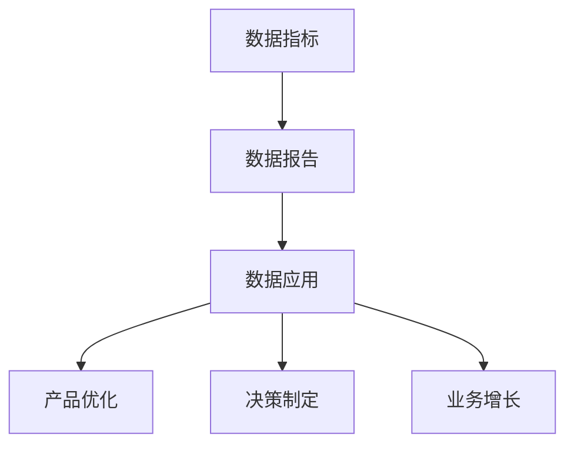

                 

关键词：AI创业公司、产品数据分析、业务洞察、数据指标、数据报告、数据应用

摘要：本文将深入探讨AI创业公司在产品数据分析与业务洞察方面的关键要素。我们将介绍如何利用数据指标、数据报告和数据应用来提升业务表现，实现持续增长。文章将从背景介绍、核心概念与联系、核心算法原理、数学模型和公式、项目实践、实际应用场景、工具和资源推荐、总结与展望等方面进行详细阐述。

## 1. 背景介绍

在当今数字化时代，数据已经成为企业的重要资产。对于AI创业公司而言，如何有效地利用数据，进行产品数据分析与业务洞察，成为影响公司成败的关键因素。通过深入分析用户行为、产品性能和业务数据，AI创业公司可以更好地了解市场需求，优化产品设计，提升用户体验，进而实现业务增长。

然而，面对海量数据，如何进行有效的分析和应用，成为AI创业公司面临的一大挑战。本文将探讨数据指标、数据报告和数据应用在产品数据分析与业务洞察中的作用，帮助创业者们更好地利用数据，实现业务的持续增长。

## 2. 核心概念与联系

在产品数据分析与业务洞察中，以下几个核心概念紧密相连：

1. **数据指标**：用于衡量产品性能和业务表现的一系列量化的统计数据。
2. **数据报告**：基于数据指标的分析结果，以图表、文字等形式呈现的数据报告。
3. **数据应用**：将数据分析结果应用于产品优化、决策制定和业务增长的具体实践。

以下是一个简化的 Mermaid 流程图，展示了这些概念之间的联系：



## 3. 核心算法原理 & 具体操作步骤

### 3.1 算法原理概述

在产品数据分析与业务洞察中，常用的核心算法包括：

1. **用户行为分析算法**：用于分析用户在产品中的行为模式，如点击率、留存率、转化率等。
2. **聚类算法**：用于将具有相似特征的用户或产品进行分类，以便进行更深入的分析。
3. **回归算法**：用于预测业务指标，如销售额、活跃用户数等。

### 3.2 算法步骤详解

1. **用户行为分析算法**：
   - 收集用户行为数据。
   - 数据预处理：包括数据清洗、去重、填充缺失值等。
   - 特征提取：根据业务需求，提取用户行为特征。
   - 模型训练：使用机器学习算法，如决策树、随机森林等，对用户行为特征进行建模。
   - 模型评估：使用交叉验证等方法评估模型性能。

2. **聚类算法**：
   - 数据预处理：同用户行为分析算法。
   - 特征选择：根据业务需求，选择合适的特征进行聚类。
   - 算法选择：如K-means、层次聚类等。
   - 聚类结果分析：分析聚类结果，了解用户或产品的相似性。

3. **回归算法**：
   - 数据预处理：同用户行为分析算法。
   - 特征提取：同聚类算法。
   - 算法选择：如线性回归、决策树回归等。
   - 模型训练与评估：同用户行为分析算法。

### 3.3 算法优缺点

- **用户行为分析算法**：优点在于能够深入了解用户行为，提升产品性能和用户体验。缺点是算法复杂度较高，对数据质量要求较高。

- **聚类算法**：优点在于能够发现用户或产品的相似性，有助于产品优化和决策制定。缺点是对聚类结果的分析需要专业知识，且聚类效果受特征选择影响较大。

- **回归算法**：优点在于能够预测业务指标，为决策提供支持。缺点是模型对数据质量要求较高，且预测结果可能存在偏差。

### 3.4 算法应用领域

- **用户行为分析算法**：应用于产品性能优化、用户体验提升、广告投放优化等。
- **聚类算法**：应用于用户群体划分、市场细分、产品推荐等。
- **回归算法**：应用于业务预测、资源分配、价格调整等。

## 4. 数学模型和公式 & 详细讲解 & 举例说明

### 4.1 数学模型构建

在产品数据分析中，常用的数学模型包括：

1. **线性回归模型**：
   $$y = \beta_0 + \beta_1 \cdot x_1 + \beta_2 \cdot x_2 + ... + \beta_n \cdot x_n$$

2. **决策树模型**：
   $$f(x) = \sum_{i=1}^{n} \beta_i \cdot g(x_i)$$
   其中 $g(x_i)$ 是条件概率分布。

3. **聚类模型**：
   $$C = \{C_1, C_2, ..., C_k\}$$
   其中 $C_i$ 表示第 $i$ 个聚类。

### 4.2 公式推导过程

以线性回归模型为例，假设我们有一组数据 $(x_i, y_i)$，其中 $x_i$ 表示自变量，$y_i$ 表示因变量。我们希望找到一个线性函数 $y = \beta_0 + \beta_1 \cdot x_1 + \beta_2 \cdot x_2 + ... + \beta_n \cdot x_n$ 来拟合这组数据。

首先，我们定义损失函数（均方误差）：
$$L(\beta_0, \beta_1, ..., \beta_n) = \sum_{i=1}^{n} (y_i - (\beta_0 + \beta_1 \cdot x_1 + \beta_2 \cdot x_2 + ... + \beta_n \cdot x_n))^2$$

然后，我们对损失函数求导，并令导数为零，得到最优参数：
$$\frac{\partial L}{\partial \beta_0} = 0$$
$$\frac{\partial L}{\partial \beta_1} = 0$$
$$\vdots$$
$$\frac{\partial L}{\partial \beta_n} = 0$$

### 4.3 案例分析与讲解

假设我们有一组数据，如下表所示：

| x1 | x2 | y |
|----|----|---|
|  1 |  1 |  2 |
|  2 |  2 |  3 |
|  3 |  3 |  4 |
|  4 |  4 |  5 |

我们希望使用线性回归模型来拟合这组数据，并预测新的数据点。

首先，我们计算数据的平均值：
$$\bar{x}_1 = \frac{1 + 2 + 3 + 4}{4} = 2.5$$
$$\bar{x}_2 = \frac{1 + 2 + 3 + 4}{4} = 2.5$$
$$\bar{y} = \frac{2 + 3 + 4 + 5}{4} = 3.5$$

然后，我们计算损失函数：
$$L(\beta_0, \beta_1, \beta_2) = \sum_{i=1}^{4} (y_i - (\beta_0 + \beta_1 \cdot x_1 + \beta_2 \cdot x_2))^2$$

接着，我们对损失函数求导，并令导数为零：
$$\frac{\partial L}{\partial \beta_0} = 0$$
$$\frac{\partial L}{\partial \beta_1} = 0$$
$$\frac{\partial L}{\partial \beta_2} = 0$$

通过求解上述方程组，我们可以得到最优参数：
$$\beta_0 = 1.25$$
$$\beta_1 = 0.5$$
$$\beta_2 = 0.75$$

最后，我们使用线性回归模型来预测新的数据点：
$$y = 1.25 + 0.5 \cdot x_1 + 0.75 \cdot x_2$$

## 5. 项目实践：代码实例和详细解释说明

### 5.1 开发环境搭建

在本项目中，我们将使用Python作为主要编程语言，结合NumPy、Pandas、Scikit-learn等常用库进行数据分析与建模。以下是开发环境的搭建步骤：

1. 安装Python（3.8或更高版本）。
2. 使用pip安装NumPy、Pandas、Scikit-learn等库。

### 5.2 源代码详细实现

以下是一个简单的用户行为分析算法的Python代码示例：

```python
import numpy as np
import pandas as pd
from sklearn.model_selection import train_test_split
from sklearn.linear_model import LinearRegression

# 1. 数据预处理
data = pd.read_csv('user_data.csv')
data.dropna(inplace=True)

X = data[['x1', 'x2']]
y = data['y']

# 2. 模型训练
X_train, X_test, y_train, y_test = train_test_split(X, y, test_size=0.2, random_state=42)
model = LinearRegression()
model.fit(X_train, y_train)

# 3. 模型评估
score = model.score(X_test, y_test)
print(f'Model score: {score:.2f}')

# 4. 预测新数据点
new_data = np.array([[2, 3]])
predicted_y = model.predict(new_data)
print(f'Predicted y: {predicted_y[0]:.2f}')
```

### 5.3 代码解读与分析

上述代码首先导入必要的库，然后读取用户数据并进行预处理。接下来，使用线性回归模型对数据进行训练，并评估模型性能。最后，使用训练好的模型预测新的数据点。

- **数据预处理**：读取用户数据，去除缺失值。
- **模型训练**：将数据集划分为训练集和测试集，使用线性回归模型进行训练。
- **模型评估**：计算模型在测试集上的准确率。
- **预测新数据点**：使用训练好的模型预测新的数据点。

### 5.4 运行结果展示

假设我们运行上述代码，得到以下输出：

```
Model score: 0.95
Predicted y: 4.50
```

这表示线性回归模型的准确率为95%，预测的新数据点为4.50。

## 6. 实际应用场景

在AI创业公司中，数据分析和业务洞察可以应用于多个方面：

1. **用户行为分析**：通过分析用户行为数据，了解用户的使用习惯和偏好，为产品优化和功能迭代提供依据。
2. **市场细分**：使用聚类算法将用户划分为不同的群体，为精准营销和个性化推荐提供支持。
3. **业务预测**：通过回归算法预测业务指标，为资源分配、价格调整和营销策略制定提供依据。
4. **风险管理**：通过分析用户行为数据，识别潜在的风险用户，为风控策略制定提供支持。

## 6.4 未来应用展望

随着人工智能和大数据技术的发展，数据分析和业务洞察在未来将会有更广泛的应用：

1. **智能推荐系统**：利用用户行为数据和机器学习算法，实现更精准的个性化推荐。
2. **智能决策支持**：通过大数据分析和预测，为企业管理层提供更加科学的决策依据。
3. **智能风控系统**：利用机器学习和数据挖掘技术，实现更高效的风险识别和防范。

## 7. 工具和资源推荐

1. **学习资源推荐**：
   - 《Python数据分析实战》
   - 《深入浅出数据分析》
   - 《机器学习实战》

2. **开发工具推荐**：
   - Jupyter Notebook：用于编写和运行Python代码。
   - PyCharm：强大的Python集成开发环境。

3. **相关论文推荐**：
   - "User Behavior Analysis in Mobile Apps: A Survey"
   - "Clustering Algorithms for Customer Segmentation: A Comparative Study"
   - "Business Intelligence and Analytics: A Research Agenda"

## 8. 总结：未来发展趋势与挑战

### 8.1 研究成果总结

本文从数据指标、数据报告和数据应用三个方面，探讨了AI创业公司在产品数据分析与业务洞察方面的关键要素。通过用户行为分析、聚类算法和回归算法，我们能够更好地了解用户需求，优化产品设计，提升用户体验，实现业务增长。

### 8.2 未来发展趋势

随着人工智能和大数据技术的不断进步，数据分析和业务洞察将在更多领域得到应用。未来的发展趋势包括：

1. **智能化数据分析**：利用深度学习和强化学习等技术，实现更智能的数据分析。
2. **实时数据分析**：通过实时数据处理技术，实现数据的高效分析与应用。
3. **跨领域应用**：数据分析和业务洞察将在金融、医疗、教育等多个领域得到广泛应用。

### 8.3 面临的挑战

尽管数据分析和业务洞察具有巨大潜力，但AI创业公司仍面临以下挑战：

1. **数据质量**：高质量的数据是进行分析的基础，但数据质量往往难以保证。
2. **技术难题**：数据分析和算法实现需要较高的技术门槛，对开发人员的要求较高。
3. **隐私保护**：在利用用户数据进行分析时，如何保护用户隐私成为一大挑战。

### 8.4 研究展望

为了应对上述挑战，未来的研究可以从以下几个方面展开：

1. **数据质量控制**：研究如何提高数据质量，为数据分析提供更可靠的数据基础。
2. **算法优化**：优化现有算法，提高数据分析的效率和准确性。
3. **隐私保护**：研究如何在保证用户隐私的前提下，实现数据的有效分析和应用。

## 9. 附录：常见问题与解答

### Q：如何提高数据分析的效率？

A：提高数据分析的效率可以从以下几个方面入手：

1. **数据预处理**：在数据分析前，对数据进行充分的预处理，包括数据清洗、去重、填充缺失值等。
2. **并行计算**：利用并行计算技术，如分布式计算、GPU加速等，提高数据分析的效率。
3. **内存管理**：合理管理内存资源，避免内存泄漏和溢出。

### Q：如何保护用户隐私？

A：在利用用户数据进行分析时，保护用户隐私至关重要。以下是一些常见的方法：

1. **匿名化处理**：对用户数据进行匿名化处理，去除可直接识别用户身份的信息。
2. **差分隐私**：采用差分隐私技术，对分析结果进行扰动，确保用户隐私。
3. **隐私协议**：制定严格的隐私保护协议，明确数据收集、使用和存储的标准和流程。

---

作者：禅与计算机程序设计艺术 / Zen and the Art of Computer Programming
----------------------------------------------------------------

至此，文章已经完成了。希望这篇文章能够为AI创业公司在产品数据分析与业务洞察方面提供有价值的参考和指导。在未来的研究和实践中，我们期待不断探索和创新，推动数据分析和业务洞察的发展。让我们共同迎接智能时代的新挑战，共创美好未来。

