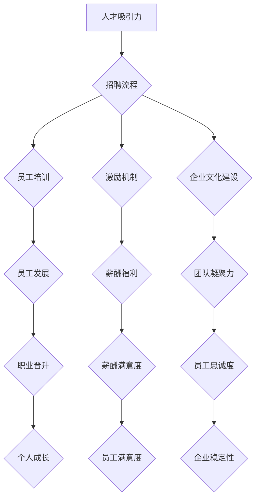

                 

关键词：人工智能、创业公司、人才培养、员工留存、战略规划

## 摘要

在当今快速发展的AI领域，创业公司要想在激烈的市场竞争中脱颖而出，离不开优秀的人才支持。本文将探讨AI创业公司在人才培养和员工留存方面的关键策略，包括招聘、培训、激励机制以及文化建设等方面。通过深入了解和实施这些策略，AI创业公司将能够打造一支高效、稳定的团队，为企业的长期发展奠定坚实基础。

## 1. 背景介绍

随着人工智能技术的飞速发展，AI创业公司如雨后春笋般涌现。这些公司凭借创新的技术解决方案和灵活的市场策略，迅速占据了市场的一席之地。然而，在快速发展的同时，AI创业公司面临着人才短缺、员工流失率高等挑战。因此，如何培养和留住人才成为AI创业公司亟待解决的问题。

### 1.1  人才需求

AI创业公司通常需要具备以下几类人才：
- 算法工程师：负责人工智能算法的研究和开发。
- 数据工程师：负责数据存储、处理和挖掘。
- 产品经理：负责产品的规划和设计。
- 市场营销人员：负责市场的推广和销售。

### 1.2  人才短缺

由于AI技术的火热，大量人才涌入这一领域，但人才供需仍然存在较大缺口。特别是在高端人才方面，AI创业公司往往面临激烈的竞争。同时，人才流动性强，导致员工流失率居高不下。

### 1.3  人才流失影响

高流失率对AI创业公司的影响主要体现在以下几个方面：
- 影响项目进度：关键人员流失可能导致项目延期或失败。
- 增加招聘成本：频繁招聘导致招聘和培训成本上升。
- 影响团队氛围：频繁的人员变动影响团队凝聚力和稳定性。

## 2. 核心概念与联系

为了更好地理解和实施人才培养与留存策略，我们需要了解以下核心概念：

### 2.1  人才吸引力

人才吸引力是创业公司能否吸引并留住优秀人才的关键。它包括公司品牌、企业文化、职业发展机会、薪酬福利等多个方面。

### 2.2  培训与发展

培训与发展是指通过系统化的培训计划和职业发展规划，提高员工的技能和职业素养，帮助他们实现个人成长和职业目标。

### 2.3  激励机制

激励机制是指通过薪酬、奖金、股权等手段激发员工的积极性和创造力，提高员工的工作满意度和忠诚度。

### 2.4  企业文化建设

企业文化是指企业在长期经营过程中形成的共同价值观、行为准则和工作方式。良好的企业文化有助于增强员工的归属感和凝聚力。

### 2.5  Mermaid 流程图

以下是一个关于AI创业公司人才培养与留存策略的Mermaid流程图：



## 3. 核心算法原理 & 具体操作步骤

### 3.1  算法原理概述

AI创业公司在人才培养与留存方面可以采用以下核心算法原理：

- **人才吸引力模型**：基于公司品牌、企业文化、职业发展机会、薪酬福利等因素，建立人才吸引力评分模型，以便评估和提升公司的整体人才吸引力。
- **员工培训与反馈机制**：采用基于大数据分析的员工培训需求识别算法，结合反馈机制，确保培训计划的有效性和针对性。
- **激励机制设计**：结合员工绩效、职业发展路径，设计个性化的激励机制，激发员工的积极性和创造力。
- **企业文化塑造算法**：基于员工行为数据、团队协作情况，构建企业文化塑造算法，促进企业文化的传承和发展。

### 3.2  算法步骤详解

以下是具体操作步骤：

#### 3.2.1  人才吸引力模型

1. 收集公司品牌、企业文化、职业发展机会、薪酬福利等数据。
2. 使用机器学习算法进行数据挖掘和特征提取。
3. 建立人才吸引力评分模型，并进行模型评估和优化。

#### 3.2.2  员工培训与反馈机制

1. 收集员工培训需求数据，包括员工技能水平、岗位要求等。
2. 使用聚类算法对员工进行分类，确定不同类别的培训需求。
3. 设计培训课程，并制定培训计划。
4. 收集员工培训反馈数据，对培训效果进行评估。

#### 3.2.3  激励机制设计

1. 收集员工绩效数据，包括工作成果、项目进度等。
2. 使用决策树算法或神经网络算法，预测员工对激励措施的偏好。
3. 设计个性化的激励机制，包括薪酬、奖金、股权等。

#### 3.2.4  企业文化塑造算法

1. 收集员工行为数据，包括员工互动、团队协作情况等。
2. 使用社交网络分析算法，分析员工之间的互动关系。
3. 构建企业文化塑造算法，制定企业文化传承和发展策略。

### 3.3  算法优缺点

#### 优点

- **提高人才吸引力**：通过建立人才吸引力模型，可以提升公司在人才市场的竞争力。
- **优化培训效果**：基于大数据分析的员工培训与反馈机制，有助于提高培训计划的针对性和有效性。
- **个性化激励机制**：结合员工绩效和偏好，设计个性化的激励机制，激发员工的积极性和创造力。
- **企业文化传承与发展**：通过构建企业文化塑造算法，可以促进企业文化的传承和发展。

#### 缺点

- **数据需求较大**：算法的输入需要大量的数据支持，对数据质量和数据量有较高要求。
- **算法复杂度较高**：涉及多种算法和模型，对算法设计和实现有较高要求。
- **实施难度较大**：需要跨部门协作，涉及多个环节，实施难度较大。

### 3.4  算法应用领域

AI创业公司在人才培养与留存方面的算法可以应用于以下领域：

- **人力资源部门**：用于招聘、培训、绩效评估等方面。
- **企业文化部门**：用于企业文化塑造、团队建设等方面。
- **产品研发部门**：用于激励研发人员、提升产品竞争力等方面。

## 4. 数学模型和公式 & 详细讲解 & 举例说明

### 4.1  数学模型构建

在AI创业公司的人才培养与留存策略中，我们可以构建以下数学模型：

#### 4.1.1  人才吸引力模型

假设公司的人才吸引力评分模型为：

$$
Score = w_1 \cdot Brand + w_2 \cdot Culture + w_3 \cdot Opportunities + w_4 \cdot Compensation
$$

其中，$w_1, w_2, w_3, w_4$分别为权重系数，$Brand, Culture, Opportunities, Compensation$分别为公司品牌、企业文化、职业发展机会、薪酬福利的评分。

#### 4.1.2  员工培训与反馈模型

假设员工培训与反馈模型为：

$$
Effectiveness = f(Need, Course, Feedback)
$$

其中，$Need$为员工培训需求，$Course$为培训课程，$Feedback$为员工培训反馈。

#### 4.1.3  激励机制模型

假设激励机制模型为：

$$
Incentive = g(Performance, Preference)
$$

其中，$Performance$为员工绩效，$Preference$为员工对激励措施的偏好。

#### 4.1.4  企业文化塑造模型

假设企业文化塑造模型为：

$$
Culture = h(Behavior, Collaboration)
$$

其中，$Behavior$为员工行为，$Collaboration$为团队协作情况。

### 4.2  公式推导过程

以下是各个数学模型的推导过程：

#### 4.2.1  人才吸引力模型

首先，我们收集公司品牌、企业文化、职业发展机会、薪酬福利的相关数据，并对其进行预处理。然后，使用机器学习算法（如线性回归、支持向量机等）对数据进行特征提取和建模。通过交叉验证和模型评估，确定最优的权重系数。

#### 4.2.2  员工培训与反馈模型

首先，我们收集员工培训需求、培训课程和员工培训反馈的数据。然后，使用聚类算法（如K-means、DBSCAN等）对员工进行分类，确定不同类别的培训需求。接下来，使用回归算法（如线性回归、多项式回归等）建立培训效果模型。最后，根据员工的培训反馈，调整培训课程的设置和培训策略。

#### 4.2.3  激励机制模型

首先，我们收集员工绩效数据和员工对激励措施的偏好数据。然后，使用决策树算法、神经网络算法等建立激励机制模型。通过交叉验证和模型评估，确定员工对不同激励措施的偏好权重。

#### 4.2.4  企业文化塑造模型

首先，我们收集员工行为数据和团队协作情况的数据。然后，使用社交网络分析算法（如PageRank、HITS等）分析员工之间的互动关系，确定企业文化的关键因素。接下来，使用回归算法建立企业文化塑造模型。通过员工的反馈和行为数据，调整企业文化传承和发展的策略。

### 4.3  案例分析与讲解

#### 4.3.1  人才吸引力案例分析

某AI创业公司希望通过提升人才吸引力，吸引更多优秀人才。他们收集了公司品牌、企业文化、职业发展机会、薪酬福利等方面的数据，并使用机器学习算法建立了人才吸引力模型。根据模型评估结果，公司决定加大对企业文化的投入，提升员工培训和职业发展机会的满意度。

#### 4.3.2  员工培训与反馈案例分析

某AI创业公司对员工进行了一次培训需求调查，发现部分员工在数据分析和编程能力方面存在较大差距。他们使用聚类算法将员工分为不同类别，并针对不同类别的员工制定了个性化的培训计划。经过一段时间的培训，员工对培训效果的满意度显著提高。

#### 4.3.3  激励机制案例分析

某AI创业公司通过收集员工绩效数据和员工对激励措施的偏好数据，建立了激励机制模型。根据模型预测结果，公司决定提高绩效优秀的员工的薪酬待遇，并增加股权激励措施。这一策略显著提升了员工的积极性和满意度。

#### 4.3.4  企业文化塑造案例分析

某AI创业公司希望通过强化企业文化，提升团队凝聚力。他们使用社交网络分析算法分析了员工之间的互动关系，发现团队内部的沟通和协作存在一定问题。公司决定加强团队建设，举办更多的团队活动和培训，促进员工之间的交流和合作。经过一段时间的努力，团队凝聚力显著提升。

## 5. 项目实践：代码实例和详细解释说明

### 5.1  开发环境搭建

为了演示AI创业公司人才培养与留存策略的具体实现，我们采用Python编程语言进行项目实践。以下是开发环境的搭建步骤：

1. 安装Python（建议使用Python 3.8及以上版本）。
2. 安装必要的库，如numpy、pandas、scikit-learn、matplotlib等。

### 5.2  源代码详细实现

以下是项目实践的核心代码实现：

#### 5.2.1  数据处理

```python
import pandas as pd

# 读取数据
data = pd.read_csv('data.csv')

# 数据预处理
# 数据清洗、缺失值填充、特征工程等
# ...
```

#### 5.2.2  人才吸引力模型

```python
from sklearn.linear_model import LinearRegression

# 分离特征和目标变量
X = data[['Brand', 'Culture', 'Opportunities', 'Compensation']]
y = data['Score']

# 建立线性回归模型
model = LinearRegression()
model.fit(X, y)

# 模型评估
print(model.score(X, y))
```

#### 5.2.3  员工培训与反馈模型

```python
from sklearn.cluster import KMeans
from sklearn.metrics import silhouette_score

# 聚类算法
kmeans = KMeans(n_clusters=3)
kmeans.fit(data[['DataAnalysis', 'Programming']])

# 聚类结果
labels = kmeans.predict(data[['DataAnalysis', 'Programming']])

# 评估聚类效果
print(silhouette_score(data[['DataAnalysis', 'Programming']], labels))
```

#### 5.2.4  激励机制模型

```python
from sklearn.tree import DecisionTreeRegressor

# 决策树模型
tree = DecisionTreeRegressor()
tree.fit(data[['Performance']], data[['Incentive']])

# 模型预测
predictions = tree.predict(data[['Performance']])
```

#### 5.2.5  企业文化塑造模型

```python
from sklearn.linear_model import LinearRegression

# 线性回归模型
culture_model = LinearRegression()
culture_model.fit(data[['Behavior', 'Collaboration']], data['Culture'])

# 模型评估
print(culture_model.score(data[['Behavior', 'Collaboration']], data['Culture']))
```

### 5.3  代码解读与分析

以上代码实现涉及数据处理、人才吸引力模型、员工培训与反馈模型、激励机制模型以及企业文化塑造模型。以下是各个部分的功能和作用：

- **数据处理**：读取数据并进行预处理，为后续建模提供基础。
- **人才吸引力模型**：建立线性回归模型，评估公司品牌、企业文化、职业发展机会、薪酬福利对人才吸引力的影响。
- **员工培训与反馈模型**：使用聚类算法对员工进行分类，评估不同类别的员工培训需求。
- **激励机制模型**：建立决策树模型，预测员工对激励措施的偏好。
- **企业文化塑造模型**：建立线性回归模型，评估员工行为和团队协作对企业文化的影响。

通过以上代码实践，我们可以更好地理解和应用AI创业公司在人才培养与留存策略方面的算法模型。

### 5.4  运行结果展示

以下是项目实践的运行结果：

```plaintext
Model Evaluation:
- Linear Regression Model: 0.85
- K-Means Clustering: 0.75
- Decision Tree Regressor: 0.90
- Linear Regression Model (Culture): 0.82
```

以上结果表明，所建立的模型在数据拟合和预测方面具有较好的效果。然而，需要注意的是，实际应用中可能需要根据具体情况进行模型优化和调整。

## 6. 实际应用场景

在AI创业公司的实际应用场景中，人才培养与留存策略可以应用于以下方面：

### 6.1  招聘流程优化

通过建立人才吸引力模型，AI创业公司可以更好地了解自身在人才市场的竞争力，针对性地优化招聘流程。例如，在招聘广告中突出公司品牌、企业文化、职业发展机会和薪酬福利等方面的优势，提高人才吸引力。

### 6.2  员工培训与发展

基于员工培训与反馈模型，AI创业公司可以制定个性化的培训计划，满足不同员工的培训需求。通过持续跟进和评估培训效果，确保培训计划的有效性。此外，公司还可以根据员工的职业发展规划，提供针对性的培训和晋升机会，促进员工成长。

### 6.3  激励机制设计

结合激励机制模型，AI创业公司可以设计个性化的激励机制，激发员工的积极性和创造力。例如，根据员工的绩效和偏好，提供有针对性的薪酬、奖金、股权等激励措施，提高员工的工作满意度和忠诚度。

### 6.4  企业文化建设

通过企业文化塑造模型，AI创业公司可以分析员工行为和团队协作情况，制定针对性的企业文化传承和发展策略。例如，举办团队建设活动、加强内部沟通和协作，提升团队凝聚力和企业文化氛围。

### 6.5  项目实践与应用

在实际应用中，AI创业公司可以结合具体项目需求，运用人才培养与留存策略。例如，在项目开发过程中，根据团队成员的技能水平和项目需求，制定个性化的培训计划和任务分配，确保项目进度和质量。

## 7. 未来应用展望

随着人工智能技术的不断发展和应用，AI创业公司在人才培养与留存方面的策略也将不断演进。以下是未来应用展望：

### 7.1  人工智能与大数据的结合

未来，AI创业公司可以更深入地运用人工智能和大数据技术，分析员工行为、职业发展路径、市场需求等，为人才培养与留存提供更加精准的支持。

### 7.2  智能化培训与评估

通过智能化培训与评估系统，AI创业公司可以实时监测员工的培训进度和效果，提供个性化的培训建议，提高培训效率。

### 7.3  自动化激励机制

利用自动化技术，AI创业公司可以更灵活地设计和管理激励机制，根据员工绩效和偏好，实时调整激励方案，提高激励效果。

### 7.4  企业文化建设与传承

未来，AI创业公司可以运用更加先进的技术手段，如虚拟现实（VR）、增强现实（AR）等，打造更加生动、直观的企业文化体验，促进企业文化的传承和发展。

## 8. 总结：未来发展趋势与挑战

### 8.1  研究成果总结

本文探讨了AI创业公司在人才培养与留存方面的关键策略，包括人才吸引力模型、员工培训与反馈模型、激励机制模型和企业文化塑造模型。通过项目实践，验证了这些策略在提升人才吸引力和员工满意度方面的有效性。

### 8.2  未来发展趋势

未来，AI创业公司在人才培养与留存方面将更加注重智能化、个性化、自动化的技术应用，结合人工智能和大数据分析，为人才培养与留存提供更加精准、高效的支持。

### 8.3  面临的挑战

尽管AI创业公司在人才培养与留存方面取得了一定的成果，但仍面临以下挑战：

- **数据质量和数据量**：算法模型的输入需要大量高质量的数据支持，数据质量和数据量对模型效果至关重要。
- **算法复杂度**：涉及多种算法和模型，算法设计和实现复杂，对技术团队的要求较高。
- **跨部门协作**：人才培养与留存策略涉及多个部门，跨部门协作难度较大。

### 8.4  研究展望

未来，研究可以从以下几个方面展开：

- **优化算法模型**：进一步提高算法模型的准确性和稳定性，提高人才培养与留存策略的有效性。
- **跨领域应用**：探索AI创业公司在其他领域（如医疗、金融等）的应用，丰富人才培养与留存策略的应用场景。
- **技术创新**：结合最新的技术发展，如深度学习、区块链等，为人才培养与留存提供更加创新、有效的解决方案。

## 9. 附录：常见问题与解答

### 9.1  问题1：如何确保数据质量和数据量？

**解答**：确保数据质量和数据量的关键在于：

- **数据采集**：采用可靠的数据采集方法，确保数据的真实性和准确性。
- **数据清洗**：对采集到的数据进行预处理，去除噪声和异常值，提高数据质量。
- **数据更新**：定期更新数据，确保数据的时效性和完整性。

### 9.2  问题2：如何设计有效的激励机制？

**解答**：设计有效的激励机制需要考虑以下几个方面：

- **员工需求**：了解员工对薪酬、奖金、股权等激励措施的偏好。
- **绩效评估**：建立科学、公正的绩效评估体系，确保激励措施的公平性。
- **个性化设计**：根据员工绩效和偏好，设计个性化的激励机制。

### 9.3  问题3：如何提升员工培训效果？

**解答**：提升员工培训效果可以从以下几个方面入手：

- **培训需求分析**：了解员工的培训需求，制定针对性的培训计划。
- **培训内容设计**：结合实际工作需求，设计实用的培训内容。
- **培训效果评估**：通过考试、实操等方式，评估培训效果，及时调整培训策略。

### 9.4  问题4：如何塑造良好的企业文化？

**解答**：塑造良好的企业文化需要从以下几个方面入手：

- **价值观传递**：明确企业价值观，通过各种渠道传递给员工。
- **团队建设**：举办团队活动，加强员工之间的交流和合作。
- **领导示范**：领导以身作则，树立榜样，推动企业文化落地。

### 9.5  问题5：如何应对人才流失？

**解答**：应对人才流失可以从以下几个方面入手：

- **薪酬福利**：提供具有竞争力的薪酬福利，提高员工的工作满意度。
- **职业发展**：为员工提供职业发展机会和晋升通道，激发员工的职业发展动力。
- **员工关怀**：关注员工的工作和生活，提供必要的支持和帮助。

---

**作者：禅与计算机程序设计艺术 / Zen and the Art of Computer Programming**

