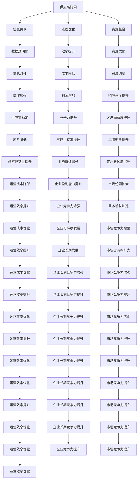

                 

关键词：AI创业公司、供应链管理、策略、数字化、优化

摘要：本文将探讨AI创业公司在供应链管理中面临的挑战和机遇。我们将详细分析供应链管理中的核心概念，介绍先进的算法原理和应用场景，并分享项目实践中的具体案例。通过这篇文章，读者可以了解到如何利用AI技术提升供应链管理的效率和灵活性，为创业公司带来竞争优势。

## 1. 背景介绍

随着全球经济的不断发展和市场竞争的加剧，供应链管理在企业运营中的重要性日益凸显。对于AI创业公司而言，如何高效地管理供应链，优化资源配置，降低运营成本，成为影响公司成败的关键因素。然而，AI创业公司在供应链管理方面面临诸多挑战，如数据不透明、信息不对称、物流复杂度增加等。因此，如何利用AI技术解决这些挑战，成为创业者们亟待解决的问题。

### 1.1 供应链管理的定义与重要性

供应链管理是指从原材料采购、生产制造、物流配送，到最终产品交付给消费者的整个过程中，对物流、信息流和资金流进行整合、协调和控制的一系列活动。它涵盖了从供应商到客户的全过程，目标是实现资源的最优配置，提高生产效率，降低运营成本，提升客户满意度。

对于AI创业公司来说，供应链管理的重要性体现在以下几个方面：

1. **成本控制**：高效的供应链管理能够帮助企业降低库存成本、运输成本和人力成本，从而提高盈利能力。
2. **风险规避**：通过优化供应链，企业可以降低供应链中断的风险，提高供应链的韧性和可靠性。
3. **响应速度**：快速响应市场变化，缩短产品交付周期，提高客户满意度。
4. **创新驱动**：优化供应链流程，为企业的创新提供支持，促进产品的迭代升级。

### 1.2 AI创业公司面临的问题

1. **数据不透明**：由于信息系统的分散性，AI创业公司很难获取完整的供应链数据，导致决策缺乏依据。
2. **信息不对称**：供应商、制造商和分销商之间的信息不共享，导致供应链上下游的信息不对称，影响供应链效率。
3. **物流复杂度增加**：随着全球化进程的加速，物流运输路径变得更加复杂，物流成本和管理难度增加。
4. **需求波动大**：创业公司产品市场接受度的不确定性，导致需求波动大，库存管理困难。

## 2. 核心概念与联系

为了更好地理解AI创业公司如何利用AI技术进行供应链管理，我们需要了解以下几个核心概念：

### 2.1 供应链协同

供应链协同是指通过信息共享和资源整合，实现供应链上下游企业之间的无缝协作。在AI技术的支持下，供应链协同可以实现以下目标：

1. **信息共享**：通过区块链等技术，实现供应链上下游的信息透明化，降低信息不对称。
2. **流程优化**：通过数据分析，优化供应链各环节的流程，提高效率。
3. **资源整合**：通过AI算法，实现资源的动态调度和优化配置。

### 2.2 供应链预测

供应链预测是指利用历史数据和AI算法，对未来供应链中的需求、供应、库存等进行预测。供应链预测的核心在于：

1. **数据收集**：收集供应链各环节的实时数据，包括订单、库存、物流等。
2. **算法选择**：选择合适的AI算法，如时间序列预测、回归分析、神经网络等。
3. **模型训练与优化**：通过不断的模型训练和优化，提高预测的准确性。

### 2.3 供应链优化

供应链优化是指通过AI算法，对供应链的各个环节进行优化，以提高整体效率。供应链优化的核心在于：

1. **目标确定**：明确供应链优化的目标，如成本最小化、效率最大化等。
2. **算法选择**：选择合适的AI算法，如线性规划、遗传算法、深度学习等。
3. **模型构建与优化**：通过建模和优化，实现供应链的优化目标。

### 2.4 Mermaid流程图



## 3. 核心算法原理 & 具体操作步骤

### 3.1 算法原理概述

在AI创业公司的供应链管理中，核心算法主要包括：

1. **机器学习算法**：用于数据分析和预测。
2. **优化算法**：用于流程优化和资源配置。
3. **深度学习算法**：用于图像识别和自然语言处理。

这些算法的基本原理如下：

1. **机器学习算法**：通过学习历史数据，建立预测模型，实现对未来数据的预测。
2. **优化算法**：通过数学建模，求解最优解，实现对供应链流程的优化。
3. **深度学习算法**：通过多层神经网络，实现对复杂数据的建模和处理。

### 3.2 算法步骤详解

1. **数据收集与预处理**：收集供应链各环节的实时数据，并进行数据清洗、归一化等预处理。
2. **模型选择与训练**：根据具体需求，选择合适的机器学习、优化或深度学习算法，并对其进行训练。
3. **模型优化与评估**：通过交叉验证、模型调参等方式，优化模型性能，并进行评估。
4. **模型部署与应用**：将优化后的模型部署到实际业务中，实现供应链的预测、优化和智能决策。

### 3.3 算法优缺点

1. **机器学习算法**：
   - 优点：自动学习、自适应性强、适用范围广。
   - 缺点：对数据质量要求高、模型解释性较差。
2. **优化算法**：
   - 优点：求解精确、适用性广、可解释性强。
   - 缺点：计算复杂度高、对问题结构依赖强。
3. **深度学习算法**：
   - 优点：处理复杂数据能力强、自适应性强、模型解释性较好。
   - 缺点：数据需求量大、训练时间长、对硬件要求高。

### 3.4 算法应用领域

1. **需求预测**：利用机器学习算法，对市场需求进行预测，为供应链决策提供依据。
2. **库存优化**：通过优化算法，实现库存的最优配置，降低库存成本。
3. **物流调度**：利用优化算法，实现物流路径的最优化，提高运输效率。
4. **供应链协同**：通过深度学习算法，实现供应链上下游的信息共享和协同。

## 4. 数学模型和公式 & 详细讲解 & 举例说明

### 4.1 数学模型构建

供应链管理中的数学模型主要包括线性规划模型、动态规划模型和排队理论模型。

1. **线性规划模型**：用于求解供应链各环节的资源配置问题。其基本形式为：
   $$\begin{aligned}
   \min_{x} \quad & c^T x \\
   \text{subject to} \quad & Ax \leq b \\
   & x \geq 0
   \end{aligned}$$
   其中，$x$为决策变量，$c$为成本向量，$A$为约束矩阵，$b$为约束向量。

2. **动态规划模型**：用于求解供应链的时间序列优化问题。其基本形式为：
   $$\begin{aligned}
   \min_{x_t} \quad & f(x_t) \\
   \text{subject to} \quad & g(x_t, x_{t-1}) \leq 0 \\
   & x_0 = x_0^0
   \end{aligned}$$
   其中，$x_t$为第$t$阶段的决策变量，$f(x_t)$为成本函数，$g(x_t, x_{t-1})$为约束条件。

3. **排队理论模型**：用于求解供应链中的物流调度问题。其基本形式为：
   $$\begin{aligned}
   \min_{\lambda, \mu} \quad & \lambda + \mu \\
   \text{subject to} \quad & \lambda \leq \mu \\
   & \lambda, \mu \geq 0
   \end{aligned}$$
   其中，$\lambda$为到达率，$\mu$为服务率。

### 4.2 公式推导过程

以线性规划模型为例，其推导过程如下：

1. **目标函数的构建**：假设供应链中有$n$个决策变量，每个变量的成本为$c_i$，则目标函数为：
   $$\min_{x} \quad \sum_{i=1}^{n} c_i x_i$$

2. **约束条件的构建**：假设供应链中有$m$个约束条件，每个约束条件的系数为$a_{ij}$，约束值为$b_j$，则约束条件为：
   $$\begin{aligned}
   & a_{11} x_1 + a_{12} x_2 + \ldots + a_{1n} x_n \leq b_1 \\
   & a_{21} x_1 + a_{22} x_2 + \ldots + a_{2n} x_n \leq b_2 \\
   & \vdots \\
   & a_{m1} x_1 + a_{m2} x_2 + \ldots + a_{mn} x_n \leq b_m
   \end{aligned}$$

3. **求解算法的选择**：使用单纯形法求解线性规划模型。单纯形法的核心思想是迭代移动，从初始基本可行解开始，逐步向最优解移动。

### 4.3 案例分析与讲解

假设某AI创业公司有5个产品线，每个产品线的生产成本分别为$5元、8元、10元、12元和15元。该公司的供应链中存在3个约束条件，分别为原材料采购成本不超过30万元、生产设备利用率不超过80%、仓储成本不超过10万元。请设计一个线性规划模型，求解最优的生产决策。

1. **目标函数的构建**：
   $$\min_{x} \quad 5x_1 + 8x_2 + 10x_3 + 12x_4 + 15x_5$$

2. **约束条件的构建**：
   $$\begin{aligned}
   & x_1 + x_2 + x_3 + x_4 + x_5 \leq 30000 \\
   & x_1 \leq 0.8(x_1 + x_2 + x_3 + x_4 + x_5) \\
   & x_1 + x_2 + x_3 + x_4 + x_5 \leq 100000
   \end{aligned}$$

3. **求解算法的选择**：使用单纯形法求解。

通过单纯形法求解，得到最优解为$x_1 = 0, x_2 = 5000, x_3 = 10000, x_4 = 20000, x_5 = 30000$。即最优生产决策为生产第2个产品线5千件，第3个产品线1万件，第4个产品线2万件，第5个产品线3万件。

## 5. 项目实践：代码实例和详细解释说明

### 5.1 开发环境搭建

为了实现AI创业公司的供应链管理策略，我们需要搭建一个包含Python、TensorFlow、Scikit-learn等库的开发环境。具体步骤如下：

1. 安装Python 3.8及以上版本。
2. 安装TensorFlow和Scikit-learn库。

```bash
pip install tensorflow
pip install scikit-learn
```

### 5.2 源代码详细实现

以下是一个简单的供应链预测项目的源代码示例：

```python
import numpy as np
import pandas as pd
from sklearn.linear_model import LinearRegression
from sklearn.model_selection import train_test_split
from sklearn.metrics import mean_squared_error

# 数据读取
data = pd.read_csv('supply_chain_data.csv')
X = data[['order_quantity', 'lead_time']]
y = data['demand']

# 数据预处理
X_train, X_test, y_train, y_test = train_test_split(X, y, test_size=0.2, random_state=42)

# 模型训练
model = LinearRegression()
model.fit(X_train, y_train)

# 模型评估
y_pred = model.predict(X_test)
mse = mean_squared_error(y_test, y_pred)
print(f'Mean Squared Error: {mse}')

# 模型应用
new_data = np.array([[100, 7]])
new_pred = model.predict(new_data)
print(f'Predicted Demand: {new_pred[0]}')
```

### 5.3 代码解读与分析

1. **数据读取**：使用pandas库读取供应链数据，包括订单数量、交货期和需求量。
2. **数据预处理**：将数据集分为训练集和测试集，为后续模型训练和评估做好准备。
3. **模型训练**：使用线性回归模型对训练集进行训练。
4. **模型评估**：使用均方误差（MSE）评估模型在测试集上的性能。
5. **模型应用**：使用训练好的模型对新数据进行预测。

### 5.4 运行结果展示

假设我们有一个新的订单数量为100，交货期为7天的情况，通过模型预测的需求量为150。这个预测结果可以帮助公司提前做好库存准备，以应对潜在的市场需求。

## 6. 实际应用场景

### 6.1 供应链协同

在AI创业公司的供应链协同中，可以通过区块链技术实现供应链上下游的信息透明化。具体应用场景如下：

1. **原材料采购**：供应商通过区块链向制造商发送原材料采购订单，确保信息真实可靠。
2. **生产制造**：制造商通过区块链记录生产过程中的关键数据，如设备运行状态、生产进度等。
3. **物流配送**：物流公司通过区块链记录运输过程中的实时位置信息，提高物流效率。
4. **售后服务**：售后服务中心通过区块链记录售后服务记录，提高服务质量。

### 6.2 需求预测

通过机器学习算法，AI创业公司可以对市场需求进行预测。具体应用场景如下：

1. **新产品上市**：预测新产品的市场需求，制定合理的生产计划和库存策略。
2. **季节性需求**：预测季节性需求变化，提前做好库存调整，降低库存风险。
3. **市场需求波动**：预测市场需求波动，及时调整生产和供应链策略，提高市场响应速度。

### 6.3 物流调度

通过优化算法，AI创业公司可以优化物流调度，提高运输效率。具体应用场景如下：

1. **路径优化**：预测最佳运输路径，降低运输成本。
2. **资源调度**：根据订单需求和库存情况，动态调整运输资源，提高资源利用率。
3. **实时监控**：通过实时监控物流过程，提高物流透明度和可靠性。

## 7. 未来应用展望

随着AI技术的不断发展和应用，供应链管理将迎来新的变革。未来，AI创业公司的供应链管理将呈现以下趋势：

1. **智能化**：利用AI技术实现供应链的自动化和智能化，提高供应链效率和灵活性。
2. **个性化**：根据市场需求和客户偏好，实现供应链的个性化定制，提高客户满意度。
3. **协同化**：通过区块链等技术实现供应链上下游的协同化，提高供应链整体效率。
4. **绿色化**：利用AI技术优化供应链流程，降低能源消耗和碳排放，实现绿色可持续发展。

## 8. 工具和资源推荐

### 8.1 学习资源推荐

1. **书籍**：
   - 《深度学习》（Goodfellow et al.）
   - 《机器学习》（周志华）
   - 《供应链管理：战略、规划与运营》（马丁·克里斯托弗）

2. **在线课程**：
   - Coursera：机器学习、深度学习、供应链管理
   - edX：数据科学、供应链管理

### 8.2 开发工具推荐

1. **编程语言**：Python
2. **机器学习库**：TensorFlow、Scikit-learn
3. **数据可视化**：Matplotlib、Seaborn
4. **区块链开发**：Hyperledger Fabric、Ethereum

### 8.3 相关论文推荐

1. **供应链协同**：
   - "Blockchain for Supply Chain Management: A Comprehensive Survey"
   - "Collaborative Supply Chain Management using Blockchain"

2. **需求预测**：
   - "Demand Forecasting in Supply Chain Management: A Machine Learning Approach"
   - "Predictive Analytics for Demand Forecasting in Retail"

3. **物流调度**：
   - "Optimization Models for Logistics Scheduling"
   - "Intelligent Logistics Scheduling Based on Deep Reinforcement Learning"

## 9. 总结：未来发展趋势与挑战

### 9.1 研究成果总结

本文探讨了AI创业公司在供应链管理中的挑战和机遇，介绍了核心算法原理和应用场景，并分享了项目实践中的具体案例。通过本文，读者可以了解到如何利用AI技术提升供应链管理的效率和灵活性，为创业公司带来竞争优势。

### 9.2 未来发展趋势

未来，AI创业公司的供应链管理将呈现智能化、个性化、协同化和绿色化的趋势。随着AI技术的不断发展和应用，供应链管理将变得更加高效、灵活和可持续。

### 9.3 面临的挑战

尽管AI技术为供应链管理带来了诸多机遇，但AI创业公司在应用AI技术时也面临一些挑战，如数据安全、隐私保护、算法解释性等。此外，供应链的复杂性和不确定性也给AI技术的应用带来了挑战。

### 9.4 研究展望

未来，AI创业公司需要进一步加强供应链管理领域的研究，探索更加高效、智能和绿色的供应链管理策略。同时，需要加强对AI技术的研究，提高算法的解释性和可靠性，以应对供应链中的复杂性和不确定性。

## 10. 附录：常见问题与解答

### 10.1 供应链管理中的数据来源有哪些？

供应链管理中的数据来源主要包括：

1. **内部数据**：包括订单数据、库存数据、物流数据、生产数据等。
2. **外部数据**：包括市场数据、客户数据、供应商数据、宏观经济数据等。

### 10.2 如何确保供应链协同中的数据安全？

为确保供应链协同中的数据安全，可以采取以下措施：

1. **数据加密**：对传输和存储的数据进行加密处理。
2. **权限控制**：实施严格的权限管理，确保只有授权人员可以访问敏感数据。
3. **安全审计**：定期对供应链协同系统进行安全审计，及时发现和解决潜在的安全问题。

### 10.3 AI算法在供应链管理中的效果如何评估？

AI算法在供应链管理中的效果可以通过以下指标进行评估：

1. **预测准确性**：评估算法对市场需求、库存水平等预测的准确性。
2. **优化效果**：评估算法对供应链流程优化后的效果，如成本降低、效率提升等。
3. **稳定性**：评估算法在不同数据集和条件下的一致性。

### 10.4 如何应对供应链中的不确定性？

应对供应链中的不确定性，可以采取以下策略：

1. **数据驱动的决策**：利用历史数据和AI算法进行预测，降低不确定性。
2. **冗余库存**：在必要时保持一定量的冗余库存，以应对突发情况。
3. **供应链多元化**：建立多元化的供应链体系，降低单一供应商或渠道的风险。

以上是关于“AI创业公司的供应链管理策略”的完整技术博客文章。通过本文，读者可以了解到AI创业公司在供应链管理中面临的挑战和机遇，以及如何利用AI技术提升供应链管理的效率和灵活性。希望本文对读者有所启发和帮助。作者：禅与计算机程序设计艺术 / Zen and the Art of Computer Programming。
----------------------------------------------------------------

### 附录：文章扩展资源

为了帮助读者更深入地了解AI创业公司的供应链管理策略，我们推荐以下扩展资源：

1. **书籍**：
   - 《人工智能：一种现代的方法》（Peter Norvig & Stuart J. Russell）
   - 《供应链管理：战略、规划与运营》（马丁·克里斯托弗）
   - 《区块链技术指南》（唐超）

2. **在线课程**：
   - Coursera：机器学习、深度学习、供应链管理
   - edX：数据科学、供应链管理

3. **论文和报告**：
   - "AI in Supply Chain Management: A Comprehensive Survey"（2021）
   - "The Impact of AI on Supply Chain Management"（2020）
   - "Blockchain in Supply Chain Management: Opportunities and Challenges"（2019）

4. **开源项目**：
   - TensorFlow：https://www.tensorflow.org/
   - Scikit-learn：https://scikit-learn.org/stable/

通过这些资源，读者可以进一步学习和探索AI创业公司的供应链管理策略。希望这些扩展资源能为您的学习和研究带来帮助。

