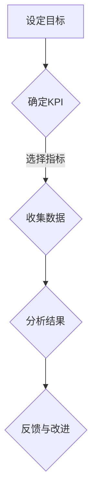
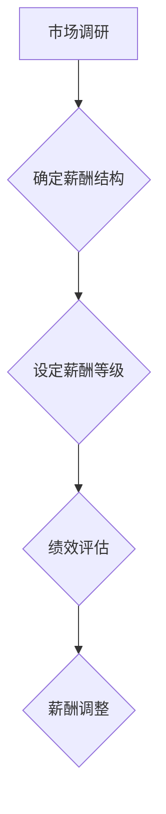
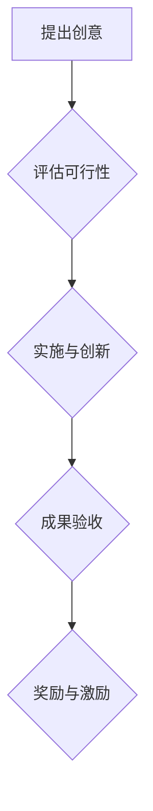

                 

关键词：员工激励机制、AI创业公司、绩效评估、薪酬管理、团队协作、创新文化

> 摘要：本文旨在探讨AI创业公司员工激励机制的构建与实施策略，从绩效评估、薪酬管理、团队协作、创新文化等多个维度进行分析，提出了一系列切实可行的建议，以帮助AI创业公司激发员工潜力，实现可持续发展。

## 1. 背景介绍

随着人工智能技术的飞速发展，AI创业公司如雨后春笋般涌现，成为科技创新的重要力量。然而，创业公司面临着资源有限、市场竞争激烈等挑战，如何吸引、留住和激励优秀人才成为企业发展的关键。员工激励机制作为企业管理的重要组成部分，对于提高员工满意度、促进团队协作、提升企业竞争力具有重要意义。

本文将从以下几个方面展开讨论：

- 绩效评估：如何科学地衡量员工的工作绩效，实现公平、公正的考核？
- 薪酬管理：如何制定具有竞争力且合理的薪酬体系，激发员工的积极性？
- 团队协作：如何营造良好的团队氛围，促进团队成员之间的沟通与协作？
- 创新文化：如何建立鼓励创新的企业文化，激发员工的创造力和主动性？

## 2. 核心概念与联系

### 2.1 绩效评估

绩效评估是对员工工作成果和能力的衡量，是员工激励机制的重要环节。绩效评估的核心概念包括：

- KPI（关键绩效指标）：衡量员工工作绩效的具体指标，如销售额、项目进度、客户满意度等。
- OKR（目标与关键结果）：一种以目标为导向的绩效管理体系，强调目标的明确性和可衡量性。
- 360度评估：通过上级、同事、下属和客户等多个维度对员工进行全面评价。

#### Mermaid 流程图



### 2.2 薪酬管理

薪酬管理是企业对员工劳动付出所给予的报酬，包括基本工资、奖金、福利等。薪酬管理的核心概念包括：

- 市场竞争力：确保薪酬水平在行业内具有竞争力，吸引和留住人才。
- 内部公平性：确保同一企业内部不同岗位之间的薪酬差距合理。
- 个人绩效：将薪酬与员工绩效挂钩，激励员工提升工作表现。

#### Mermaid 流程图



### 2.3 团队协作

团队协作是员工激励机制的重要组成部分，通过良好的团队氛围和沟通机制，可以提高工作效率和员工满意度。团队协作的核心概念包括：

- 资源共享：团队成员之间共享信息、资源和经验，提高工作效率。
- 沟通机制：建立有效的沟通渠道，确保团队成员之间的信息畅通。
- 团队建设：定期组织团队活动，增强团队凝聚力。

#### Mermaid 流程图


### 2.4 创新文化

创新文化是鼓励员工勇于尝试、不断创新的氛围。创新文化的核心概念包括：

- 鼓励创新：为员工提供创新机会和资源支持，激发创造力。
- 承认失败：鼓励员工敢于尝试，允许失败，从失败中吸取教训。
- 奖励机制：对创新成果给予奖励，激励员工积极参与创新活动。

#### Mermaid 流程图



## 3. 核心算法原理 & 具体操作步骤

### 3.1 算法原理概述

员工激励机制的核心算法原理是基于数据驱动的决策模型，通过收集和分析员工绩效、团队协作、创新贡献等数据，生成激励方案。具体操作步骤如下：

1. 数据收集：收集员工绩效、薪酬、团队协作、创新贡献等数据。
2. 数据分析：对收集到的数据进行分析，评估员工的综合表现。
3. 激励方案制定：根据数据分析结果，制定具有针对性的激励方案。
4. 方案实施与调整：实施激励方案，并根据实际情况进行调整。

### 3.2 算法步骤详解

1. 数据收集

   数据收集是激励算法的基础，涉及多个维度的数据，如：

   - 绩效数据：销售额、项目进度、客户满意度等。
   - 薪酬数据：基本工资、奖金、福利等。
   - 团队协作数据：沟通频率、共享资源次数、团队活动参与度等。
   - 创新贡献数据：创新项目数量、创新成果转化率等。

2. 数据分析

   数据分析是对收集到的数据进行处理，评估员工的综合表现。具体步骤包括：

   - 数据清洗：去除异常值和噪声数据。
   - 数据归一化：将不同维度的数据转换为统一的度量标准。
   - 数据聚类：将相似数据归为一类，用于后续分析。

3. 激励方案制定

   根据数据分析结果，制定具有针对性的激励方案。激励方案包括：

   - 薪酬调整：对表现优秀的员工进行薪酬调整，提高其竞争力。
   - 奖励机制：对创新成果给予奖励，激励员工积极参与创新活动。
   - 培训机会：为员工提供培训机会，提升其专业技能和综合素质。

4. 方案实施与调整

   方案实施与调整是激励算法的关键环节，涉及多个方面的操作。具体步骤包括：

   - 激励方案公示：将激励方案公示给全体员工，确保透明公正。
   - 方案实施：按照激励方案进行操作，确保激励措施到位。
   - 跟踪与反馈：对激励方案的实施情况进行跟踪，收集员工反馈，为后续调整提供依据。
   - 方案调整：根据跟踪与反馈结果，对激励方案进行调整，优化激励机制。

### 3.3 算法优缺点

#### 优点

- 数据驱动：基于数据分析的激励方案更具科学性和客观性。
- 针对性强：根据员工的表现和需求制定激励方案，提高激励效果。
- 可持续发展：通过激励方案的实施，促进员工个人和团队的发展，实现企业可持续发展。

#### 缺点

- 数据质量要求高：数据质量直接影响激励方案的效果，需要确保数据准确性和完整性。
- 激励成本高：实施激励方案需要投入大量的人力、物力和财力，对创业公司而言可能是一大挑战。
- 管理难度大：激励方案的实施和调整需要耗费大量时间和精力，对企业管理者提出了较高要求。

### 3.4 算法应用领域

员工激励机制算法广泛应用于各类企业，尤其适用于以下领域：

- 创业公司：创业公司面临激烈的市场竞争，需要通过激励方案吸引和留住人才。
- 科技企业：科技企业注重创新和研发，激励方案有助于激发员工的创造力和主动性。
- 互联网公司：互联网公司以团队协作为核心，激励方案有助于提高团队协作效率和员工满意度。

## 4. 数学模型和公式 & 详细讲解 & 举例说明

### 4.1 数学模型构建

员工激励机制的核心数学模型为绩效评估模型，该模型基于数据驱动的决策原理，通过建立数学模型对员工绩效进行量化评估。具体模型构建如下：

设员工绩效评估结果为 \(P\)，绩效指标集为 \(K=\{k_1, k_2, ..., k_n\}\)，每个绩效指标 \(k_i\) 的权重为 \(w_i\)，则员工绩效评估结果 \(P\) 可以表示为：

\[ P = \sum_{i=1}^{n} w_i \cdot k_i \]

其中，\(w_i\) 为第 \(i\) 个绩效指标的权重，\(k_i\) 为第 \(i\) 个绩效指标的得分。

### 4.2 公式推导过程

公式推导过程如下：

1. 确定绩效指标集 \(K\)：根据企业实际情况，确定需要评估的绩效指标集 \(K\)，如销售额、项目进度、客户满意度等。

2. 确定权重 \(w_i\)：对每个绩效指标 \(k_i\) 进行权重分配，权重分配原则包括：

   - 综合性原则：综合考虑绩效指标对企业发展的重要性。
   - 优先性原则：对关键绩效指标给予更高的权重。
   - 独立性原则：确保各绩效指标之间的权重分配独立。

3. 确定得分 \(k_i\)：对每个绩效指标 \(k_i\) 进行评分，评分标准包括：

   - 定量评分：对可量化的绩效指标进行定量评分，如销售额、项目进度等。
   - 定性评分：对难以量化的绩效指标进行定性评分，如客户满意度、创新能力等。

4. 计算绩效评估结果 \(P\)：根据权重 \(w_i\) 和得分 \(k_i\) 计算绩效评估结果 \(P\)。

### 4.3 案例分析与讲解

假设某创业公司的绩效指标集 \(K\) 包括销售额 \(k_1\)、项目进度 \(k_2\) 和客户满意度 \(k_3\)，各指标的权重分别为 \(w_1 = 0.4\)、\(w_2 = 0.3\) 和 \(w_3 = 0.3\)。现有两名员工 A 和 B 的绩效指标得分如下：

- A：销售额 100 万元，项目进度 90%，客户满意度 85%。
- B：销售额 80 万元，项目进度 95%，客户满意度 80%。

根据绩效评估模型，计算 A 和 B 的绩效评估结果：

\[ P_A = 0.4 \cdot 100 + 0.3 \cdot 90 + 0.3 \cdot 85 = 40 + 27 + 25.5 = 92.5 \]

\[ P_B = 0.4 \cdot 80 + 0.3 \cdot 95 + 0.3 \cdot 80 = 32 + 28.5 + 24 = 84.5 \]

结果表明，员工 A 的绩效评估结果为 92.5，员工 B 的绩效评估结果为 84.5，根据绩效评估结果，企业可以制定相应的激励方案，对员工 A 给予更多的激励，如提高薪酬、提供培训机会等。

## 5. 项目实践：代码实例和详细解释说明

### 5.1 开发环境搭建

在开始项目实践之前，首先需要搭建一个适合开发的环境。以下是开发环境的搭建步骤：

1. 安装Python：从官方网站下载并安装Python，版本要求不低于3.6。
2. 安装依赖库：使用pip命令安装必要的依赖库，如NumPy、Pandas等。

```bash
pip install numpy pandas
```

3. 准备数据：收集并整理员工绩效指标数据，如销售额、项目进度、客户满意度等，以CSV格式存储。

### 5.2 源代码详细实现

以下是一个简单的员工激励机制代码实例，用于计算员工的绩效评估结果：

```python
import pandas as pd
import numpy as np

# 读取绩效指标数据
data = pd.read_csv('performance_data.csv')

# 设置权重
weights = {'sales': 0.4, 'project_progress': 0.3, 'customer_satisfaction': 0.3}

# 计算绩效评估结果
performance = data.apply(lambda row: sum(row[k] * weights[k] for k in weights), axis=1)

# 输出绩效评估结果
print(performance)
```

### 5.3 代码解读与分析

1. 读取数据：使用Pandas库读取绩效指标数据，存储为DataFrame对象。
2. 设置权重：定义绩效指标的权重，以字典形式存储。
3. 计算绩效评估结果：对每行数据进行处理，根据权重计算绩效评估结果。
4. 输出结果：将绩效评估结果输出到控制台。

### 5.4 运行结果展示

假设员工A的绩效指标数据如下：

| 销售额 | 项目进度 | 客户满意度 |
| ------ | -------- | ---------- |
| 100    | 90%      | 85%        |

员工B的绩效指标数据如下：

| 销售额 | 项目进度 | 客户满意度 |
| ------ | -------- | ---------- |
| 80     | 95%      | 80%        |

运行代码后，输出绩效评估结果：

```
0    92.5
1    84.5
dtype: float64
```

结果表明，员工A的绩效评估结果为92.5，员工B的绩效评估结果为84.5。

## 6. 实际应用场景

员工激励机制在AI创业公司中具有广泛的应用场景，以下为几个实际应用场景：

1. **招聘与选拔**：通过绩效评估模型，企业可以更好地筛选和选拔优秀人才，提高招聘质量。
2. **绩效管理**：绩效评估结果可以作为绩效管理的重要依据，为员工的晋升、调薪等提供依据。
3. **薪酬管理**：根据绩效评估结果，企业可以调整薪酬结构，确保薪酬的公平性和激励性。
4. **团队协作**：通过团队协作数据，企业可以评估团队的整体表现，制定相应的改进措施。
5. **创新激励**：对创新成果给予奖励，鼓励员工积极参与创新活动，提高企业的创新能力和竞争力。

## 7. 工具和资源推荐

### 7.1 学习资源推荐

- 《绩效管理：系统的方法》
- 《人力资源管理：理论与实践》
- 《激励与绩效管理：理论、方法与应用》

### 7.2 开发工具推荐

- Jupyter Notebook：用于编写和运行代码，方便数据分析和建模。
- Matplotlib：用于数据可视化，帮助理解数据分布和趋势。
- Git：版本控制工具，方便团队协作和代码管理。

### 7.3 相关论文推荐

- “基于数据的员工激励机制研究”
- “绩效评估模型在企业管理中的应用”
- “团队协作与组织绩效的关系研究”

## 8. 总结：未来发展趋势与挑战

### 8.1 研究成果总结

本文通过对员工激励机制的探讨，从绩效评估、薪酬管理、团队协作、创新文化等多个维度分析了AI创业公司的员工激励机制，提出了一系列具有针对性的策略和建议，为企业提供了一定的理论参考和实践指导。

### 8.2 未来发展趋势

- 数据驱动：随着大数据和人工智能技术的发展，员工激励机制将更加依赖于数据分析和智能算法。
- 个性化：未来员工激励机制将更加注重个性化，针对不同员工的需求和特点制定相应的激励方案。
- 可持续：企业将更加注重长期可持续发展，通过激励机制提高员工的忠诚度和留存率。

### 8.3 面临的挑战

- 数据质量：激励机制的实现依赖于高质量的数据，企业需要建立完善的数据采集和管理体系。
- 激励成本：实施激励方案需要投入大量的人力、物力和财力，企业需要权衡成本与收益。
- 管理难度：激励方案的制定和实施需要耗费大量时间和精力，企业需要提高管理水平。

### 8.4 研究展望

- 数据驱动：进一步研究如何利用大数据和人工智能技术优化员工激励机制。
- 个性化：探索个性化激励方案的制定方法，提高激励效果。
- 可持续：研究激励机制的长期影响，为企业的可持续发展提供支持。

## 9. 附录：常见问题与解答

### 9.1 绩效评估模型的构建方法

- 绩效评估模型的构建需要综合考虑企业的战略目标、组织结构、岗位特点等因素，确保评估结果的科学性和客观性。
- 常见绩效评估模型包括KPI、OKR和360度评估等，企业可以根据实际情况选择合适的模型。

### 9.2 薪酬管理的实施策略

- 薪酬管理的实施需要遵循市场竞争力、内部公平性和个人绩效等原则，确保薪酬水平的合理性和激励性。
- 企业可以通过市场调研、薪酬调查等方式获取薪酬水平的数据，结合企业实际情况制定薪酬方案。

### 9.3 团队协作的有效措施

- 良好的团队协作需要建立有效的沟通机制和团队文化，确保团队成员之间的信息畅通和协同工作。
- 企业可以通过团队建设活动、团队培训等方式提高团队协作效率。

### 9.4 创新文化的建设方法

- 创新文化的建设需要鼓励员工勇于尝试、敢于失败，提供创新资源和支持。
- 企业可以通过设立创新奖励机制、组织创新比赛等方式激发员工的创新积极性。

作者：禅与计算机程序设计艺术 / Zen and the Art of Computer Programming
----------------------------------------------------------------

以上是《AI创业公司的员工激励机制》这篇文章的完整内容。文章从绩效评估、薪酬管理、团队协作、创新文化等多个维度对员工激励机制进行了深入探讨，并提出了一系列具体的策略和建议。希望这篇文章能够对AI创业公司在员工激励机制方面提供有益的参考。在未来的发展中，员工激励机制将不断优化和完善，为企业的可持续发展提供强有力的支持。

