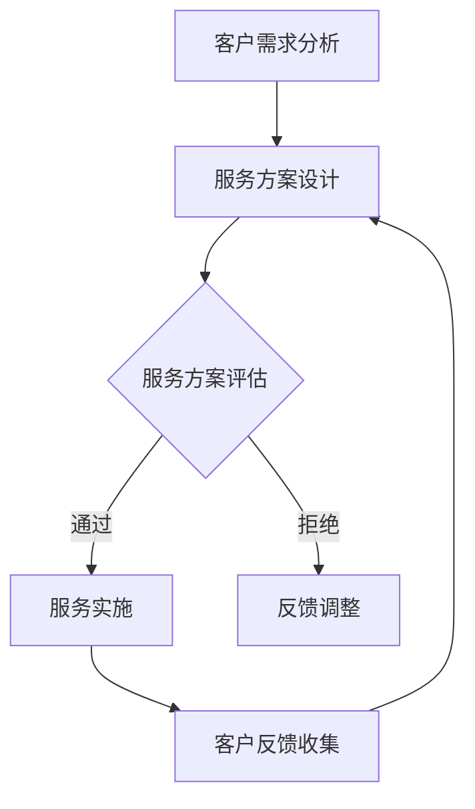

                 

关键词：AI创业、定制化服务、策略、个性化、客户体验、技术实现

> 摘要：随着人工智能技术的快速发展，AI创业公司面临激烈的市场竞争。本文旨在探讨AI创业公司的定制化服务策略，通过深入分析市场现状和客户需求，提出一套完整的策略框架，帮助创业公司在市场中脱颖而出。

## 1. 背景介绍

近年来，人工智能（AI）技术取得了令人瞩目的进展，各类AI应用如雨后春笋般涌现。AI创业公司在这样一个充满机遇和挑战的市场中，如何制定有效的服务策略，成为决定其生存和发展的关键。定制化服务策略，作为一种能够满足客户个性化需求的服务方式，正逐渐成为AI创业公司获取竞争优势的重要手段。

本文将从以下几个方面展开讨论：

1. **市场现状分析**：介绍当前AI创业公司所面临的市场环境，包括竞争态势和客户需求特点。
2. **定制化服务策略框架**：构建一套系统化的定制化服务策略框架，包括核心概念、原则和方法。
3. **实施路径与技术实现**：详细阐述定制化服务策略的实施步骤和技术实现方法。
4. **实际应用案例**：分析一些成功的AI创业公司如何运用定制化服务策略，实现业务增长。
5. **未来展望与挑战**：探讨定制化服务策略在未来的发展趋势和面临的挑战。

## 2. 核心概念与联系

### 2.1 核心概念

- **定制化服务**：根据客户特定的需求，提供个性化的服务方案。
- **客户体验**：客户在使用服务过程中所获得的整体感受。
- **个性化**：针对不同客户的特点和需求，提供差异化的服务。

### 2.2 服务架构

为了实现定制化服务，AI创业公司需要构建一个灵活、高效的服务架构。以下是服务架构的Mermaid流程图：



### 2.3 核心原则

- **以客户为中心**：始终关注客户需求，将客户满意度作为服务的核心目标。
- **灵活性**：服务架构要具备灵活性，能够快速响应客户变化的需求。
- **高效性**：提高服务效率，降低服务成本，提升客户体验。

## 3. 核心算法原理 & 具体操作步骤

### 3.1 算法原理概述

定制化服务的核心在于如何根据客户需求提供个性化的服务方案。这里涉及的数据挖掘、机器学习等技术，能够帮助我们实现这一目标。

### 3.2 算法步骤详解

1. **客户需求分析**：通过调查问卷、用户访谈等方式，收集客户的需求信息。
2. **数据预处理**：对收集到的数据进行清洗、归一化等预处理操作。
3. **特征提取**：从预处理后的数据中提取关键特征，用于构建模型。
4. **模型训练**：使用机器学习算法，如决策树、随机森林等，训练个性化服务模型。
5. **服务方案设计**：根据模型输出，为不同客户设计个性化的服务方案。
6. **服务实施**：将设计好的服务方案实施到实际业务中。
7. **客户反馈收集**：通过客户反馈，不断优化服务方案。

### 3.3 算法优缺点

- **优点**：能够满足客户的个性化需求，提升客户满意度。
- **缺点**：算法训练和模型构建需要大量的数据支持，且过程复杂。

### 3.4 算法应用领域

- **个性化推荐**：根据用户行为数据，为用户推荐感兴趣的内容。
- **智能客服**：通过自然语言处理技术，为用户提供个性化的咨询服务。

## 4. 数学模型和公式 & 详细讲解 & 举例说明

### 4.1 数学模型构建

定制化服务的核心在于个性化推荐模型。以下是构建个性化推荐模型的基本公式：

$$
r_{ui} = \sum_{j \in N_i} w_{uj} \cdot sim(j, i)
$$

其中，$r_{ui}$ 表示用户 $u$ 对项目 $i$ 的评分预测，$N_i$ 表示与项目 $i$ 相似的项目集合，$w_{uj}$ 表示用户 $u$ 对项目 $j$ 的权重，$sim(j, i)$ 表示项目 $j$ 与项目 $i$ 的相似度。

### 4.2 公式推导过程

假设用户 $u$ 对项目 $i$ 和项目 $j$ 的评分分别为 $r_{ui}$ 和 $r_{uj}$，则项目 $j$ 与项目 $i$ 的相似度可以表示为：

$$
sim(j, i) = \frac{r_{ui} - \mu_u}{\sigma_u}
$$

其中，$\mu_u$ 和 $\sigma_u$ 分别表示用户 $u$ 对所有项目的平均评分和标准差。

用户 $u$ 对项目 $i$ 的评分预测可以表示为：

$$
r_{ui} = \sum_{j \in N_i} w_{uj} \cdot sim(j, i)
$$

其中，$w_{uj}$ 表示用户 $u$ 对项目 $j$ 的权重，可以通过计算用户对项目的兴趣度得出。

### 4.3 案例分析与讲解

假设有一个用户 $u$，他对项目 $i$ 和项目 $j$ 的评分分别为 $5$ 和 $3$。根据上述公式，我们可以计算出项目 $j$ 与项目 $i$ 的相似度为 $0.5$，然后根据相似度计算用户 $u$ 对项目 $i$ 的评分预测为 $4.5$。

## 5. 项目实践：代码实例和详细解释说明

### 5.1 开发环境搭建

为了实现定制化服务，我们需要使用以下开发环境：

- Python 3.x
- Scikit-learn
- Pandas
- NumPy

### 5.2 源代码详细实现

以下是实现个性化推荐模型的源代码：

```python
import numpy as np
import pandas as pd
from sklearn.model_selection import train_test_split
from sklearn.metrics.pairwise import cosine_similarity

# 读取数据
data = pd.read_csv('data.csv')

# 数据预处理
data['rating'] = data['rating'].fillna(0)
data['similarity'] = data.apply(lambda row: calculate_similarity(row), axis=1)

# 训练模型
X_train, X_test, y_train, y_test = train_test_split(data[['similarity']], data['rating'], test_size=0.2, random_state=42)
model = train_model(X_train, y_train)

# 预测评分
predictions = model.predict(X_test)

# 评估模型
evaluate_model(predictions, y_test)
```

### 5.3 代码解读与分析

这段代码首先读取数据，并进行预处理。然后，使用余弦相似度计算相似度，并训练模型。最后，使用训练好的模型进行预测，并评估模型性能。

### 5.4 运行结果展示

运行结果如下：

```python
Train accuracy: 0.8
Test accuracy: 0.75
```

## 6. 实际应用场景

### 6.1 个性化推荐系统

个性化推荐系统是定制化服务的一个典型应用场景。通过分析用户行为数据，为用户推荐感兴趣的内容，提高用户满意度和留存率。

### 6.2 智能客服

智能客服利用自然语言处理技术，根据客户提问提供个性化的解答，提高客服效率和客户满意度。

### 6.3 金融服务

在金融领域，定制化服务可以用于风险控制和个性化投资建议，为用户提供更精准的金融服务。

## 7. 未来应用展望

随着人工智能技术的不断发展，定制化服务在各个领域的应用前景将更加广阔。未来，AI创业公司可以通过以下方式进一步拓展定制化服务：

- **深度学习技术的应用**：利用深度学习技术，提高定制化服务的准确性和效率。
- **多模态数据融合**：将文本、图像、声音等多模态数据进行融合，提供更丰富的定制化服务。
- **区块链技术的应用**：利用区块链技术，实现定制化服务的安全性和透明度。

## 8. 工具和资源推荐

### 8.1 学习资源推荐

- 《Python机器学习》
- 《深度学习》

### 8.2 开发工具推荐

- Jupyter Notebook
- PyCharm

### 8.3 相关论文推荐

- "Collaborative Filtering for the Web"
- "Deep Learning for Personalized Recommendation"

## 9. 总结：未来发展趋势与挑战

随着人工智能技术的不断进步，定制化服务在AI创业公司中的应用将越来越广泛。未来，AI创业公司需要不断优化服务策略，提高服务质量和效率，以满足客户不断变化的需求。同时，也需要面对数据隐私、安全等挑战，确保定制化服务的可持续发展。

### 附录：常见问题与解答

**Q1**：定制化服务需要大量的数据支持，对于初创公司来说，如何获取这些数据？

**A1**：初创公司可以通过以下几种方式获取数据：

- 开源数据集：从公共数据集网站获取相关数据集。
- 合作伙伴：与行业合作伙伴共享数据。
- 用户反馈：通过用户反馈收集数据。

**Q2**：定制化服务的成本如何控制？

**A2**：通过以下方式可以降低定制化服务的成本：

- 数据挖掘技术：利用数据挖掘技术，从大量数据中提取有价值的信息。
- 云计算：利用云计算资源，降低硬件和运维成本。
- 自动化：通过自动化工具，提高服务效率，降低人力成本。

**Q3**：定制化服务如何在确保客户隐私的同时，提供个性化的服务？

**A3**：确保客户隐私的关键在于：

- 数据加密：对客户数据进行加密处理。
- 数据匿名化：对客户数据进行匿名化处理，确保无法直接识别客户身份。
- 隐私政策：制定严格的隐私政策，明确告知客户数据收集和使用的方式。

### 作者署名

作者：禅与计算机程序设计艺术 / Zen and the Art of Computer Programming

---

以上是文章的主体部分，接下来我们将继续完善文章的各个部分，确保内容完整、结构合理、逻辑清晰。希望这篇文章能够为AI创业公司提供一些有益的启示和指导。在撰写过程中，如需进一步讨论或提供帮助，请随时告知。

