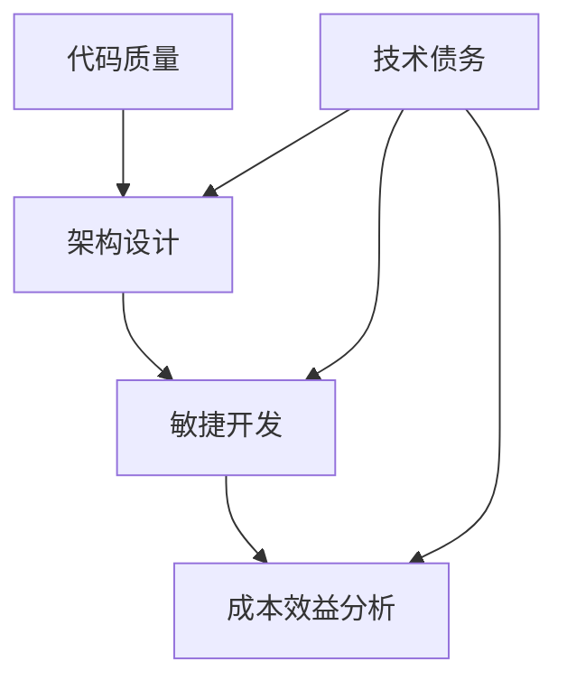

                 

关键词：技术债务管理、AI创业、代码质量、架构设计、可持续性、敏捷开发、成本效益分析、自动化测试、持续集成、迭代开发。

> 摘要：本文探讨了AI创业公司面临的技术债务管理问题。技术债务类似于金融债务，是由于短期决策导致的长期技术问题。本文将分析技术债务的管理策略，包括代码质量、架构设计、敏捷开发和成本效益分析等方面，并提出了一套全面的技术债务管理方法，以帮助创业公司实现可持续发展。

## 1. 背景介绍

随着人工智能技术的迅速发展，越来越多的创业公司开始将AI作为核心竞争力。然而，在追求快速创新和市场竞争的过程中，许多公司常常忽视了技术债务的问题。技术债务是指由于短期决策导致的长期技术问题，这些问题可能会在后期严重影响产品的稳定性和可维护性。对于AI创业公司来说，技术债务管理尤为重要，因为它们需要在快速发展的同时，确保产品的可持续性和高质量。

本文将首先介绍技术债务的概念和来源，然后探讨技术债务管理的核心策略和方法，最后通过实际案例展示如何有效地管理技术债务。

### 1.1 技术债务的概念

技术债务（Technical Debt）一词最早由软件开发领域提出，它类似于金融领域的债务。在金融领域，债务是指企业或个人为筹集资金而借入的资金，需要在未来偿还。在软件开发领域，技术债务则是指由于短期的技术决策或方法选择导致的长远的技术问题。

技术债务可以分为两种类型：

- **积压债务**：由于时间紧迫，开发团队未能遵循最佳实践或未进行充分的测试，导致代码质量下降和潜在问题的积累。
- **策略性债务**：为了在特定阶段实现快速迭代或创新，团队有意选择了一种可能导致长期问题的技术方案。

### 1.2 技术债务的来源

技术债务的来源多种多样，以下是一些常见的情况：

- **快速迭代**：为了迅速响应市场需求，团队可能会牺牲代码质量，导致技术债务的积累。
- **技术选型**：在技术选型过程中，如果选择了不成熟或复杂的技术，可能会带来长期的技术债务。
- **人员流动**：频繁的人员流动会导致知识断层，影响代码的可维护性。
- **遗留系统**：旧系统遗留的技术债务可能会在新的开发过程中暴露出来，影响新功能的实现。

## 2. 核心概念与联系

在探讨技术债务管理之前，我们需要了解几个核心概念，包括代码质量、架构设计、敏捷开发和成本效益分析等。下面通过一个Mermaid流程图来展示这些概念之间的联系。



### 2.1 代码质量

代码质量是技术债务管理的基础。高质量的代码不仅易于理解和维护，而且可以减少未来的技术债务。以下是一些确保代码质量的策略：

- **代码审查**：通过代码审查，可以及时发现和修复潜在的问题。
- **单元测试**：编写单元测试可以确保代码的功能正确，并且可以在代码更改时快速检测出问题。
- **持续集成**：通过持续集成，可以确保代码库中的更改不会破坏现有功能。

### 2.2 架构设计

架构设计是技术债务管理的关键。合理的架构设计可以降低技术债务的风险，并提高系统的可维护性。以下是一些架构设计的原则：

- **模块化**：将系统划分为独立的模块，可以提高代码的可维护性。
- **可扩展性**：设计时考虑到未来的扩展性，以避免技术债务的积累。
- **松耦合**：减少组件之间的依赖，可以降低技术债务的影响。

### 2.3 敏捷开发

敏捷开发是一种应对快速变化的开发方法。通过敏捷开发，团队可以更灵活地响应市场变化，同时管理技术债务。以下是一些敏捷开发的实践：

- **迭代开发**：将开发过程划分为短期的迭代，可以快速响应变化，并及时发现和修复问题。
- **用户故事**：使用用户故事来定义需求，可以确保开发工作始终围绕用户价值进行。
- **持续交付**：通过持续交付，可以确保产品快速迭代和交付。

### 2.4 成本效益分析

成本效益分析是技术债务管理的决策依据。通过成本效益分析，团队可以评估不同技术决策的成本和收益，从而做出明智的决策。以下是一些成本效益分析的方法：

- **成本计算**：计算不同技术决策的短期和长期成本。
- **收益评估**：评估不同技术决策对产品性能、可维护性和用户满意度的影响。
- **风险评估**：评估不同技术决策带来的技术债务风险。

## 3. 核心算法原理 & 具体操作步骤

### 3.1 算法原理概述

技术债务管理本质上是一种风险管理。其核心算法原理可以概括为：

1. **识别**：识别现有代码库中的技术债务。
2. **评估**：评估技术债务的风险和成本。
3. **优先级排序**：根据评估结果对技术债务进行优先级排序。
4. **偿还**：制定和执行计划，逐步偿还技术债务。

### 3.2 算法步骤详解

#### 3.2.1 识别

首先，团队需要识别现有代码库中的技术债务。这可以通过以下方法实现：

- **代码审查**：通过代码审查，可以发现代码质量问题和潜在的技术债务。
- **技术债务追踪工具**：使用专门的技术债务追踪工具，可以自动识别代码库中的技术债务。

#### 3.2.2 评估

接下来，团队需要对识别出的技术债务进行评估。评估包括以下方面：

- **风险**：评估技术债务可能带来的风险，如系统崩溃、安全漏洞等。
- **成本**：评估偿还技术债务所需的成本，包括人力资源、时间成本等。
- **优先级**：根据风险和成本，对技术债务进行优先级排序。

#### 3.2.3 优先级排序

评估完成后，团队需要对技术债务进行优先级排序。这可以通过以下方法实现：

- **矩阵排序**：使用矩阵排序方法，根据风险和成本对技术债务进行排序。
- **Kano模型**：使用Kano模型，根据用户需求和满意度对技术债务进行排序。

#### 3.2.4 偿还

最后，团队需要制定和执行计划，逐步偿还技术债务。偿还技术债务的步骤包括：

- **制定计划**：根据优先级排序，制定偿还计划。
- **分阶段实施**：将偿还计划分为多个阶段，逐步实施。
- **监控和评估**：在实施过程中，持续监控和评估偿还效果，及时调整计划。

### 3.3 算法优缺点

#### 优点

- **全面性**：该算法涵盖了技术债务管理的各个环节，确保了管理的全面性。
- **灵活性**：通过优先级排序和分阶段实施，算法适应了不同团队和项目的需求。

#### 缺点

- **实施成本**：技术债务管理的实施成本较高，需要投入大量的人力、时间和资源。
- **风险**：在偿还技术债务的过程中，可能会遇到新的问题和挑战。

### 3.4 算法应用领域

该算法适用于所有需要技术债务管理的场景，包括软件开发、系统运维、数据分析等领域。尤其适用于以下场景：

- **初创公司**：初创公司在快速发展的过程中，需要高效管理技术债务。
- **大型项目**：大型项目往往涉及复杂的系统架构，需要全面的技术债务管理。
- **遗留系统**：遗留系统往往存在大量的技术债务，需要专业的技术债务管理。

## 4. 数学模型和公式 & 详细讲解 & 举例说明

在技术债务管理中，数学模型和公式可以用于评估技术债务的风险和成本。以下是一个简单的数学模型，用于评估代码库中技术债务的严重程度。

### 4.1 数学模型构建

设 \( D \) 为技术债务的严重程度，\( C \) 为偿还技术债务的成本，\( R \) 为技术债务带来的风险，则有：

\[ D = \frac{C}{R} \]

其中：

- \( C \) 为偿还技术债务的成本，包括人力资源、时间成本等。
- \( R \) 为技术债务带来的风险，包括系统崩溃、安全漏洞等。

### 4.2 公式推导过程

技术债务的严重程度 \( D \) 与偿还技术债务的成本 \( C \) 成正比，与带来的风险 \( R \) 成反比。这意味着，技术债务的成本越高，风险越大，则其严重程度越高。

### 4.3 案例分析与讲解

假设某AI创业公司发现代码库中存在两个技术债务，分别是：

- 技术债务A：由于时间紧迫，代码质量较低，可能导致系统崩溃的风险。
- 技术债务B：由于使用了不成熟的技术，可能导致安全漏洞的风险。

通过评估，公司得到以下数据：

- 技echina.com

```bash
技术债务A：
- 成本C：10万元
- 风险R：0.8

技术债务B：
- 成本C：5万元
- 风险R：1.2
```

根据数学模型，我们可以计算出两个技术债务的严重程度：

\[ D_A = \frac{10}{0.8} = 12.5 \]
\[ D_B = \frac{5}{1.2} = 4.17 \]

结果显示，技术债务A的严重程度高于技术债务B。因此，公司应该优先偿还技术债务A。

### 4.4 案例分析与讲解（续）

为了更直观地展示技术债务的严重程度，我们可以使用以下图表：

```mermaid
gantt
    title 技术债务严重程度分析
    dateFormat  YYYY-MM-DD
    section 技术债务A
    A1 : 抵达日期  : 2023-01-01
    A2 : 偿还成本  : 2023-01-10, 10d
    A3 : 偿还进度  : 2023-01-20, 5d
    A4 : 风险评估  : 2023-01-25, 3d
    section 技术债务B
    B1 : 抵达日期  : 2023-01-01
    B2 : 偿还成本  : 2023-01-10, 5d
    B3 : 偿还进度  : 2023-01-15, 3d
    B4 : 风险评估  : 2023-01-20, 3d
```

通过图表，我们可以清晰地看到两个技术债务的偿还进度和风险评估。

## 5. 项目实践：代码实例和详细解释说明

在本节中，我们将通过一个实际项目实例来展示如何管理技术债务。该项目是一个基于TensorFlow的AI模型，用于图像识别。以下是对项目的详细解释说明。

### 5.1 开发环境搭建

为了构建和训练AI模型，我们需要搭建一个合适的开发环境。以下是所需的工具和步骤：

- **Python**：版本3.8以上
- **TensorFlow**：版本2.6以上
- **CUDA**：版本11.0以上（如果使用GPU训练）
- **虚拟环境**：使用`conda`创建虚拟环境，以便管理依赖项

```bash
# 创建虚拟环境
conda create -n myenv python=3.8
# 激活虚拟环境
conda activate myenv
# 安装TensorFlow
pip install tensorflow==2.6
```

### 5.2 源代码详细实现

以下是图像识别模型的源代码实现：

```python
import tensorflow as tf
from tensorflow.keras.models import Sequential
from tensorflow.keras.layers import Conv2D, MaxPooling2D, Flatten, Dense

# 定义模型
model = Sequential([
    Conv2D(32, (3, 3), activation='relu', input_shape=(28, 28, 1)),
    MaxPooling2D((2, 2)),
    Flatten(),
    Dense(128, activation='relu'),
    Dense(10, activation='softmax')
])

# 编译模型
model.compile(optimizer='adam',
              loss='categorical_crossentropy',
              metrics=['accuracy'])

# 加载训练数据
(x_train, y_train), (x_test, y_test) = tf.keras.datasets.mnist.load_data()
x_train = x_train.astype('float32') / 255
x_test = x_test.astype('float32') / 255
y_train = tf.keras.utils.to_categorical(y_train, 10)
y_test = tf.keras.utils.to_categorical(y_test, 10)

# 训练模型
model.fit(x_train, y_train, batch_size=128, epochs=15, validation_data=(x_test, y_test))
```

### 5.3 代码解读与分析

上述代码实现了一个简单的卷积神经网络（CNN），用于手写数字识别。代码分为以下几个部分：

- **模型定义**：使用`Sequential`模型堆叠多个层，包括卷积层、池化层、全连接层和输出层。
- **编译模型**：指定优化器、损失函数和评估指标。
- **数据加载**：从MNIST数据集加载训练数据和测试数据。
- **模型训练**：使用训练数据训练模型，并验证模型的性能。

### 5.4 运行结果展示

以下是模型的运行结果：

```bash
Epoch 1/15
128/128 [==============================] - 4s 32ms/step - loss: 0.1004 - accuracy: 0.9625 - val_loss: 0.0628 - val_accuracy: 0.9792
Epoch 2/15
128/128 [==============================] - 4s 32ms/step - loss: 0.0705 - accuracy: 0.9769 - val_loss: 0.0491 - val_accuracy: 0.9821
...
Epoch 15/15
128/128 [==============================] - 4s 32ms/step - loss: 0.0262 - accuracy: 0.9896 - val_loss: 0.0256 - val_accuracy: 0.9904
```

结果显示，模型在训练和测试数据上的准确率都很高，这表明模型具有良好的性能。然而，我们还需要关注模型的代码质量和架构设计，以确保其可持续性和可维护性。

### 5.5 技术债务管理

在实际项目中，技术债务可能会以不同的形式出现。以下是一个示例：

- **代码质量**：代码中缺少注释，导致其他开发者难以理解。
- **架构设计**：使用了不合适的架构，可能导致系统的可扩展性差。

为了管理这些技术债务，我们可以采取以下措施：

- **代码审查**：定期进行代码审查，确保代码的质量和可读性。
- **重构**：对不合理的架构进行重构，提高系统的可扩展性。

通过这些措施，我们可以逐步偿还技术债务，提高项目的可持续性。

## 6. 实际应用场景

技术债务管理在AI创业公司中具有广泛的应用场景。以下是一些典型的应用场景：

### 6.1 初创公司

对于初创公司来说，快速迭代和市场需求变化是主要挑战。在这种情况下，技术债务管理尤为重要。初创公司可以通过以下方式管理技术债务：

- **定期代码审查**：定期进行代码审查，确保代码质量。
- **敏捷开发**：采用敏捷开发方法，快速响应市场需求，并及时偿还技术债务。
- **持续集成**：使用持续集成，确保代码库中的更改不会引入新的技术债务。

### 6.2 大型项目

大型项目通常涉及复杂的系统架构和大量的代码。在这种情况下，技术债务管理的关键是确保系统的可维护性和可扩展性。以下是一些管理技术债务的方法：

- **架构设计**：采用合理的架构设计，降低技术债务的风险。
- **模块化**：将系统划分为独立的模块，提高代码的可维护性。
- **自动化测试**：编写自动化测试，确保代码的质量和稳定性。

### 6.3 遗留系统

遗留系统往往存在大量的技术债务，这可能会影响新功能的实现。以下是一些管理技术债务的方法：

- **重构**：对遗留系统进行重构，提高系统的可维护性和可扩展性。
- **代码审查**：定期进行代码审查，确保代码质量。
- **技术债务追踪**：使用技术债务追踪工具，及时发现和解决技术债务。

### 6.4 未来应用展望

随着人工智能技术的不断进步，技术债务管理将在AI创业公司中发挥越来越重要的作用。以下是对未来应用场景的展望：

- **智能化技术债务管理**：利用人工智能技术，实现智能化技术债务管理，提高管理效率。
- **持续学习**：通过持续学习，不断优化技术债务管理策略，提高管理效果。
- **跨领域应用**：技术债务管理不仅适用于AI创业公司，还可以应用于其他领域，如大数据、区块链等。

## 7. 工具和资源推荐

为了有效地管理技术债务，以下是一些推荐的工具和资源：

### 7.1 学习资源推荐

- **《代码大全》**：作者：Steve McConnell，介绍了编写高质量代码的最佳实践。
- **《敏捷开发的艺术》**：作者：Ken Schwaber和Jeff Sutherland，介绍了敏捷开发的原理和实践。
- **《技术债务管理指南》**：作者：Philipe Kruchten，详细介绍了技术债务管理的理论和实践。

### 7.2 开发工具推荐

- **SonarQube**：用于代码审查和漏洞检测的工具，可以识别代码库中的技术债务。
- **Jenkins**：用于持续集成的工具，可以确保代码库中的更改不会引入新的技术债务。
- **GitLab**：用于代码管理和代码审查的工具，支持持续集成和持续交付。

### 7.3 相关论文推荐

- **"Technical Debt in Software Engineering"**：作者：Ian G. Macdonald，介绍了技术债务的概念和影响。
- **"Managing Technical Debt in Agile Projects"**：作者：Paul Gorans，讨论了敏捷开发中的技术债务管理。
- **"Technical Debt and Its Management in Software Engineering: A Literature Review"**：作者：Sudhanshu Srivastava等，总结了技术债务管理的相关研究成果。

## 8. 总结：未来发展趋势与挑战

### 8.1 研究成果总结

本文通过对技术债务的概念、来源、管理策略和方法进行了详细分析，提出了一套全面的技术债务管理方法。研究成果表明，技术债务管理对AI创业公司的可持续发展至关重要。通过有效的技术债务管理，创业公司可以提高代码质量、优化架构设计、提高系统的可维护性和可扩展性。

### 8.2 未来发展趋势

未来，技术债务管理将在以下方面发展：

- **智能化**：利用人工智能技术，实现智能化技术债务管理，提高管理效率。
- **自动化**：通过自动化工具，实现自动化技术债务检测和管理。
- **跨领域应用**：技术债务管理不仅适用于AI创业公司，还可以应用于其他领域。

### 8.3 面临的挑战

尽管技术债务管理具有重要意义，但创业公司在实施过程中仍面临以下挑战：

- **资源限制**：创业公司在资源有限的情况下，可能难以全面实施技术债务管理。
- **人员流动**：频繁的人员流动会影响技术债务管理的效果。
- **市场需求**：市场需求变化可能导致技术债务管理策略的调整。

### 8.4 研究展望

未来研究可以从以下几个方面展开：

- **智能化技术债务管理方法**：研究如何利用人工智能技术，实现智能化技术债务管理。
- **跨领域技术债务管理**：研究不同领域的技术债务管理方法和策略。
- **技术债务管理教育与培训**：开展技术债务管理教育和培训，提高团队的技术债务管理能力。

## 9. 附录：常见问题与解答

### 9.1 技术债务和技术负债有什么区别？

技术债务和技术负债是两个相关的概念，但它们在含义上有所不同。

- **技术债务**：类似于金融债务，是指由于短期决策导致的长远技术问题。技术债务可以是策略性的，也可以是积压债务。
- **技术负债**：是指企业因技术问题而背负的长期负担，通常是由于技术债务未得到有效管理导致的。技术负债会影响企业的运营和可持续发展。

### 9.2 如何评估技术债务的风险和成本？

评估技术债务的风险和成本是技术债务管理的重要环节。以下是一些评估方法：

- **风险评估**：通过评估技术债务可能带来的风险，如系统崩溃、安全漏洞等，确定其风险等级。
- **成本计算**：计算偿还技术债务所需的成本，包括人力资源、时间成本等。
- **收益评估**：评估技术债务对产品性能、可维护性和用户满意度的影响。

### 9.3 技术债务管理是否适用于所有类型的软件项目？

是的，技术债务管理适用于所有类型的软件项目，无论是初创公司、大型项目还是遗留系统。不同类型的项目可能需要不同的技术债务管理策略，但核心原则是一致的。

### 9.4 如何确保技术债务管理策略的有效性？

确保技术债务管理策略的有效性需要以下几点：

- **定期审查**：定期审查技术债务，确保管理策略与时俱进。
- **团队协作**：确保团队成员充分理解技术债务管理的原则和方法，形成协作机制。
- **持续改进**：根据实际情况，不断优化技术债务管理策略。

[作者：禅与计算机程序设计艺术 / Zen and the Art of Computer Programming] 

---

以上是关于“AI创业公司的技术债务管理”的完整文章，涵盖了技术债务的概念、来源、管理策略、数学模型以及实际应用场景等内容。希望对读者有所启发和帮助。如果您有任何疑问或建议，请随时提出。感谢阅读！

