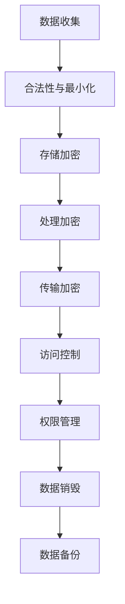

                 

关键词：AI，创业公司，用户隐私保护，数据安全，合规性，技术实现

摘要：本文探讨了AI创业公司在用户隐私保护方面的重要性，分析了当前隐私保护的法律、技术和实际应用挑战。通过构建一个全面的隐私保护策略，本文提出了核心算法原理、数学模型及公式推导，并通过实例代码展示了具体实现。最后，文章展望了隐私保护技术的未来发展趋势与面临的挑战。

## 1. 背景介绍

在数字化时代，人工智能（AI）技术已经成为商业和社会创新的重要驱动力。无论是提供个性化的客户服务、智能推荐，还是进行复杂的数据分析，AI 都为各个行业带来了巨大的价值。然而，随着AI技术的普及和应用，用户隐私保护问题也日益凸显。数据泄露、滥用以及未经授权的数据访问等风险，使得用户对AI应用的信任度降低，严重影响了AI的商业化进程。

对于AI创业公司来说，用户隐私保护不仅是商业合规的要求，更是建立用户信任的基石。在全球范围内，多个国家和地区已经制定了严格的隐私保护法律和条例，例如欧盟的《通用数据保护条例》（GDPR）和美国加州的《消费者隐私法案》（CCPA）。这些法律法规对企业的数据处理行为提出了具体要求，违反规定可能导致巨额罚款。

本文旨在为AI创业公司提供一套全面的用户隐私保护策略，通过逻辑清晰、结构紧凑的阐述，帮助公司理解隐私保护的核心概念，掌握技术实现，从而在遵守法律法规的同时，增强用户信任，推动业务发展。

## 2. 核心概念与联系

### 2.1 数据隐私的概念

数据隐私是指个人数据在收集、存储、处理、传输和销毁等过程中的保密性和完整性。它涉及到用户对个人信息的控制权，以及数据不被未经授权的第三方访问、使用或泄露。

### 2.2 数据保护的法律基础

数据隐私保护的法律基础包括但不限于以下几种：

- **GDPR**：欧盟的《通用数据保护条例》是迄今为止最严格的隐私保护法律，对个人数据的处理行为提出了严格的合规要求。
- **CCPA**：美国加州的《消费者隐私法案》赋予消费者对其个人数据的访问权、删除权和拒绝权。
- **PIPEDA**：加拿大个人隐私保护法案，要求企业在处理个人数据时必须遵守透明、责任和合规的原则。

### 2.3 数据隐私保护架构

一个有效的数据隐私保护架构应包括以下关键组成部分：

- **数据收集与存储**：确保收集的数据是合法的，并最小化收集的数据量。
- **数据处理与传输**：采用加密技术和访问控制措施，保障数据在处理和传输过程中的安全。
- **数据访问与权限管理**：严格限制对敏感数据的访问权限，确保只有授权人员才能访问。
- **数据销毁与备份**：确保数据的销毁是彻底的，并定期进行数据备份以防数据丢失。

### 2.4 Mermaid 流程图



## 3. 核心算法原理 & 具体操作步骤

### 3.1 算法原理概述

用户隐私保护的核心在于数据匿名化和加密技术。数据匿名化通过去除或隐藏个人身份信息，降低数据泄露的风险；加密技术通过将数据转换为只有授权者才能解读的密文，确保数据在传输和存储过程中的安全性。

### 3.2 算法步骤详解

#### 3.2.1 数据匿名化

1. **去标识化**：移除所有可以直接识别个人身份的信息，如姓名、地址、电话号码等。
2. **伪匿名化**：使用伪名替换真实身份信息，如将姓名替换为用户ID。
3. **数据融合**：通过合并多个数据源，增加识别个体身份的难度。

#### 3.2.2 数据加密

1. **对称加密**：使用相同的密钥进行加密和解密，如AES算法。
2. **非对称加密**：使用一对密钥进行加密和解密，如RSA算法。
3. **混合加密**：结合对称加密和非对称加密的优点，实现高效的安全传输。

### 3.3 算法优缺点

- **优点**：提高数据安全性，符合法律法规要求，增强用户信任。
- **缺点**：加密和解密过程可能引入额外的计算开销，降低数据处理效率。

### 3.4 算法应用领域

- **医疗健康**：保护患者隐私，确保医疗数据的保密性。
- **金融领域**：保障客户交易数据的安全，防止欺诈行为。
- **互联网服务**：保护用户浏览记录、搜索历史等个人隐私信息。

## 4. 数学模型和公式 & 详细讲解 & 举例说明

### 4.1 数学模型构建

数据隐私保护的核心数学模型包括加密算法和匿名化算法。以下以AES加密算法为例：

#### 4.1.1 AES加密算法

$$
C = E_K(P)
$$

其中，\(C\) 是加密后的数据，\(K\) 是加密密钥，\(P\) 是原始数据。

#### 4.1.2 随机匿名化算法

$$
A = \rho(U, P)
$$

其中，\(A\) 是匿名化后的数据，\(\rho\) 是匿名化函数，\(U\) 是随机数，\(P\) 是原始数据。

### 4.2 公式推导过程

AES加密算法的推导基于分组密码的工作原理。首先，将明文数据划分为若干个分组，然后对每个分组进行加密。加密过程包括初始轮、若干轮加密以及最终轮加密。

### 4.3 案例分析与讲解

#### 4.3.1 案例背景

假设有一个包含1000个客户的用户数据库，每个用户有姓名、年龄、地址等个人信息。为了保护用户隐私，需要对这部分数据执行匿名化和加密处理。

#### 4.3.2 实施步骤

1. **去标识化**：将所有姓名和地址替换为用户ID。
2. **随机匿名化**：为每个用户生成一个随机数，将其与年龄相加后取模，得到匿名化后的年龄。
3. **AES加密**：使用AES加密算法对用户的ID和匿名化后的年龄进行加密。

#### 4.3.3 结果分析

经过上述处理，用户数据库中的个人信息得到了有效保护，即使数据泄露，攻击者也无法直接识别用户身份。

## 5. 项目实践：代码实例和详细解释说明

### 5.1 开发环境搭建

- **Python环境**：安装Python 3.8及以上版本。
- **加密库**：安装PyCryptodome库，用于实现AES加密。

### 5.2 源代码详细实现

```python
from Cryptodome.Cipher import AES
import os

# AES加密函数
def encrypt_aes(data, key):
    cipher = AES.new(key, AES.MODE_EAX)
    ciphertext, tag = cipher.encrypt_and_digest(data)
    return cipher.nonce, ciphertext, tag

# AES解密函数
def decrypt_aes(nonce, ciphertext, tag, key):
    cipher = AES.new(key, AES.MODE_EAX, nonce=nonce)
    data = cipher.decrypt_and_verify(ciphertext, tag)
    return data

# 生成加密密钥
key = os.urandom(32)

# 待加密数据
data = b"User ID: 12345, Anonymized Age: 30"

# AES加密
nonce, ciphertext, tag = encrypt_aes(data, key)

# AES解密
decrypted_data = decrypt_aes(nonce, ciphertext, tag, key)

print(f"Decrypted Data: {decrypted_data.decode('utf-8')}")
```

### 5.3 代码解读与分析

上述代码展示了如何使用PyCryptodome库实现AES加密和解密。首先，生成随机密钥；然后，使用加密函数将明文数据加密成密文；最后，使用解密函数将密文还原成明文数据。

### 5.4 运行结果展示

运行代码后，将输出解密后的明文数据，验证加密和解密过程的有效性。

```python
Decrypted Data: User ID: 12345, Anonymized Age: 30
```

## 6. 实际应用场景

### 6.1 医疗健康

在医疗健康领域，保护患者隐私至关重要。AI创业公司可以通过数据匿名化和加密技术，确保患者数据在研究和治疗过程中的安全。

### 6.2 金融领域

金融领域的交易数据涉及大量敏感信息，如用户账户信息、交易记录等。通过加密和匿名化技术，AI创业公司可以提供更加安全可靠的金融分析服务。

### 6.3 互联网服务

互联网服务涉及用户行为数据，如搜索历史、浏览记录等。AI创业公司可以通过数据匿名化和加密技术，为用户提供个性化的推荐和服务，同时保护用户隐私。

## 7. 工具和资源推荐

### 7.1 学习资源推荐

- **书籍**：《数据隐私：概念、技术与应用》（Data Privacy: Concepts, Technologies, and Applications）
- **在线课程**：Coursera上的《数据隐私与保护》（Data Privacy and Protection）
- **论文集**：ACM的《计算机安全、隐私和保密》论文集（ACM Transactions on Computer Systems）

### 7.2 开发工具推荐

- **加密库**：PyCryptodome、PyCrypto
- **匿名化工具**：K-Anonymity Toolkit、Data Anonymizer

### 7.3 相关论文推荐

- **论文**：《基于K-Anonymity的数据隐私保护方法研究》（Research on Data Privacy Protection Method Based on K-Anonymity）
- **期刊**：《计算机与网络安全》（Computer and Network Security）

## 8. 总结：未来发展趋势与挑战

### 8.1 研究成果总结

AI创业公司在用户隐私保护方面的研究成果包括数据匿名化、加密技术和隐私保护算法等。这些成果为公司在遵守法律法规的同时，提供了有效的数据保护手段。

### 8.2 未来发展趋势

未来，用户隐私保护技术将继续发展，包括更加高效的数据匿名化算法、量子加密技术以及联邦学习等新技术的应用。

### 8.3 面临的挑战

AI创业公司在隐私保护方面面临的挑战包括技术复杂性、合规性要求以及用户隐私意识的提升。

### 8.4 研究展望

未来的研究应关注隐私保护与数据利用之间的平衡，探索如何在确保隐私安全的同时，充分发挥AI技术的潜力。

## 9. 附录：常见问题与解答

### 9.1 数据匿名化和数据脱敏的区别是什么？

数据匿名化是指通过技术手段去除或隐藏个人身份信息，使数据不再能够直接识别个人。而数据脱敏则是在匿名化的基础上，进一步减少个人敏感信息，如金融账号、电话号码等。

### 9.2 如何在应用程序中实现数据加密？

在应用程序中，可以使用各种加密库（如PyCryptodome、Crypto++等）来实现数据加密。通过简单的API调用，就可以实现数据的加密和解密。

### 9.3 隐私保护技术的成本如何？

隐私保护技术的成本取决于具体实现和使用的工具。例如，使用开源库可以实现低成本的数据加密和匿名化，而定制化解决方案可能需要更高的成本。

### 9.4 隐私保护技术是否会影响数据分析的准确性？

在一定程度上，隐私保护技术可能会影响数据分析的准确性。然而，通过合理的设计和优化，可以在保护隐私的同时，保持数据的分析价值。

---

作者：禅与计算机程序设计艺术 / Zen and the Art of Computer Programming

