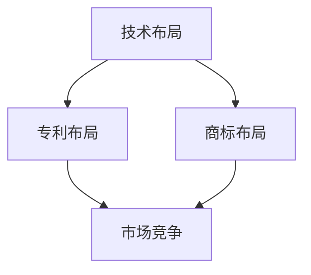

                 

关键词：知识产权、专利布局、商标布局、技术布局、AI创业公司、法律保护、竞争优势、市场拓展

摘要：本文将深入探讨AI创业公司在知识产权战略布局方面的重要性和具体实施方法。首先介绍知识产权的概念和重要性，然后分别阐述专利布局、商标布局和技术布局的具体策略和实践，帮助AI创业公司建立强有力的知识产权体系，提升市场竞争力和品牌价值。

## 1. 背景介绍

随着人工智能技术的快速发展，AI创业公司如雨后春笋般涌现。这些公司致力于开发创新的人工智能产品和服务，以应对不断变化的市场需求。然而，在激烈的竞争环境中，知识产权保护成为AI创业公司成功的关键因素之一。

知识产权是指通过法律手段对知识产品进行的权利保护，包括专利、商标、著作权等。对于AI创业公司来说，知识产权不仅有助于保护其核心技术，避免竞争对手的抄袭和侵权，还能提升公司的市场地位和品牌形象。

本文将围绕AI创业公司的知识产权战略布局，详细探讨专利布局、商标布局和技术布局的重要性及其具体实施方法。通过这篇文章，希望为AI创业公司提供有益的参考和指导。

## 2. 核心概念与联系

### 2.1 知识产权的概念

知识产权是指通过法律手段对知识产品进行的权利保护，包括专利、商标、著作权等。这些权利分别保护不同的知识产品，具体定义如下：

- **专利**：对发明创造的技术方案进行保护，包括发明专利、实用新型专利和外观设计专利。
- **商标**：对企业名称、标志、设计等用于区分商品或服务的标识进行保护。
- **著作权**：对文学、艺术和科学作品的独创性表达进行保护。

### 2.2 专利布局的概念

专利布局是指企业或个人在其核心技术和关键领域内，通过申请和获取专利，构建起完整的专利保护网络。专利布局的目的是防止竞争对手的侵权行为，保护企业的技术创新成果，同时增强市场竞争力和品牌价值。

### 2.3 商标布局的概念

商标布局是指企业或个人在其商标品牌范围内，通过申请和注册商标，构建起完整的商标保护网络。商标布局的目的是防止竞争对手的恶意模仿和侵权，保护企业的品牌形象和市场份额。

### 2.4 技术布局的概念

技术布局是指企业或个人在其技术领域内，通过技术储备和研发投入，构建起完整的技术保护体系。技术布局的目的是保持企业在技术上的领先地位，降低技术被抄袭和侵权的风险，同时为后续的技术创新提供支持。

### 2.5 专利布局、商标布局和技术布局的联系

专利布局、商标布局和技术布局是AI创业公司知识产权战略布局的重要组成部分，它们之间存在紧密的联系：

- **专利布局**：专利布局是技术布局的延伸，通过对核心技术和关键领域进行专利申请和保护，确保企业的技术优势得到充分体现。
- **商标布局**：商标布局是品牌布局的延伸，通过对企业名称、标志、设计等进行注册和保护，确保企业的品牌形象得到有效维护。
- **技术布局**：技术布局是专利布局和商标布局的基础，通过对技术领域内的技术储备和研发投入，为专利布局和商标布局提供支持。

下面是一个使用Mermaid绘制的流程图，展示了专利布局、商标布局和技术布局之间的联系：



## 3. 核心算法原理 & 具体操作步骤

### 3.1 算法原理概述

AI创业公司的知识产权战略布局是一个复杂的过程，需要结合企业的实际情况和市场需求进行具体操作。以下是专利布局、商标布局和技术布局的核心算法原理：

#### 3.1.1 专利布局算法

专利布局算法主要包括以下步骤：

1. **技术领域分析**：通过对企业所涉及的技术领域进行详细分析，确定关键技术和核心技术。
2. **专利申请策略**：根据技术领域分析结果，制定专利申请策略，包括专利类型、申请数量和申请顺序等。
3. **专利布局方案**：根据专利申请策略，制定专利布局方案，确保专利保护覆盖核心技术和关键领域。
4. **专利维权**：在专利布局实施过程中，对专利侵权行为进行监测和维权，确保专利权益得到有效保护。

#### 3.1.2 商标布局算法

商标布局算法主要包括以下步骤：

1. **品牌分析**：对企业品牌进行详细分析，确定品牌核心价值和品牌定位。
2. **商标申请策略**：根据品牌分析结果，制定商标申请策略，包括商标类型、申请数量和申请顺序等。
3. **商标布局方案**：根据商标申请策略，制定商标布局方案，确保商标保护覆盖品牌核心价值和市场份额。
4. **品牌维权**：在商标布局实施过程中，对商标侵权行为进行监测和维权，确保品牌权益得到有效保护。

#### 3.1.3 技术布局算法

技术布局算法主要包括以下步骤：

1. **技术路线规划**：根据企业发展战略和市场需求，规划技术路线，确定技术储备和研发方向。
2. **技术储备建设**：根据技术路线规划，进行技术储备建设，包括技术研发、技术标准制定等。
3. **技术转化与应用**：将技术储备转化为实际应用，推动技术转化和市场化。
4. **技术保护与推广**：在技术转化和应用过程中，对技术进行保护与推广，确保技术优势得到充分发挥。

### 3.2 算法步骤详解

#### 3.2.1 专利布局算法步骤详解

1. **技术领域分析**：

   - **步骤一**：收集企业所涉及的技术领域相关信息，包括现有技术、竞争对手技术、市场需求等。
   - **步骤二**：对收集到的信息进行整理和分析，确定企业所涉及的核心技术和关键技术。

2. **专利申请策略**：

   - **步骤一**：根据技术领域分析结果，确定专利申请的类型，如发明专利、实用新型专利等。
   - **步骤二**：根据技术领域分析结果，确定专利申请的数量和顺序，确保专利保护覆盖核心技术和关键领域。
   - **步骤三**：根据专利申请的类型、数量和顺序，制定专利申请策略。

3. **专利布局方案**：

   - **步骤一**：根据专利申请策略，制定专利布局方案，确保专利保护覆盖核心技术和关键领域。
   - **步骤二**：对专利布局方案进行评估和优化，确保专利布局方案具有可行性和有效性。

4. **专利维权**：

   - **步骤一**：建立专利监控机制，对潜在的侵权行为进行监测和预警。
   - **步骤二**：在发现侵权行为后，采取法律手段进行维权，包括发送侵权警告、提起诉讼等。

#### 3.2.2 商标布局算法步骤详解

1. **品牌分析**：

   - **步骤一**：收集企业品牌相关信息，包括品牌定位、品牌核心价值、品牌形象等。
   - **步骤二**：对收集到的信息进行整理和分析，确定品牌的核心价值和品牌定位。

2. **商标申请策略**：

   - **步骤一**：根据品牌分析结果，确定商标申请的类型，如文字商标、图形商标等。
   - **步骤二**：根据品牌分析结果，确定商标申请的数量和顺序，确保商标保护覆盖品牌核心价值和市场份额。
   - **步骤三**：根据商标申请的类型、数量和顺序，制定商标申请策略。

3. **商标布局方案**：

   - **步骤一**：根据商标申请策略，制定商标布局方案，确保商标保护覆盖品牌核心价值和市场份额。
   - **步骤二**：对商标布局方案进行评估和优化，确保商标布局方案具有可行性和有效性。

4. **品牌维权**：

   - **步骤一**：建立品牌监控机制，对潜在的侵权行为进行监测和预警。
   - **步骤二**：在发现侵权行为后，采取法律手段进行维权，包括发送侵权警告、提起诉讼等。

#### 3.2.3 技术布局算法步骤详解

1. **技术路线规划**：

   - **步骤一**：收集企业技术发展相关信息，包括技术发展趋势、市场需求等。
   - **步骤二**：对收集到的信息进行整理和分析，确定企业技术路线。

2. **技术储备建设**：

   - **步骤一**：根据技术路线规划，制定技术储备计划，包括技术研发、技术标准制定等。
   - **步骤二**：实施技术储备计划，确保技术储备的逐步积累和提升。

3. **技术转化与应用**：

   - **步骤一**：将技术储备转化为实际应用，推动技术转化和市场化。
   - **步骤二**：对技术转化和应用过程中产生的技术成果进行保护与推广。

4. **技术保护与推广**：

   - **步骤一**：建立技术保护机制，对技术侵权行为进行监测和预警。
   - **步骤二**：在发现技术侵权行为后，采取法律手段进行维权，确保技术优势得到充分发挥。

### 3.3 算法优缺点

#### 3.3.1 专利布局算法优缺点

**优点**：

- 可以有效保护企业的核心技术，防止竞争对手的抄袭和侵权。
- 提高企业的技术水平和创新能力，增强市场竞争力。
- 为企业的后续发展提供法律保障，降低法律风险。

**缺点**：

- 申请专利需要耗费大量时间和金钱，对企业资源要求较高。
- 专利维权成本较高，需要企业具备一定的法律知识和实践经验。
- 专利布局可能导致企业的技术发展受限，影响技术的创新和突破。

#### 3.3.2 商标布局算法优缺点

**优点**：

- 可以有效保护企业的品牌形象，防止竞争对手的恶意模仿和侵权。
- 提高企业的品牌知名度和美誉度，增强市场竞争力。
- 为企业的后续发展提供法律保障，降低法律风险。

**缺点**：

- 申请商标需要耗费大量时间和金钱，对企业资源要求较高。
- 商标维权成本较高，需要企业具备一定的法律知识和实践经验。
- 商标布局可能导致企业的品牌发展受限，影响品牌的创新和突破。

#### 3.3.3 技术布局算法优缺点

**优点**：

- 可以有效保护企业的技术成果，防止竞争对手的抄袭和侵权。
- 提高企业的技术水平和创新能力，增强市场竞争力。
- 为企业的后续发展提供技术保障，降低技术风险。

**缺点**：

- 技术布局需要耗费大量时间和金钱，对企业资源要求较高。
- 技术布局可能导致企业的技术发展受限，影响技术的创新和突破。
- 技术布局可能面临技术外溢的风险，降低企业的技术竞争力。

### 3.4 算法应用领域

#### 3.4.1 专利布局算法应用领域

- **高新技术企业**：高新技术企业通常具有较高的技术水平和创新能力，通过专利布局可以保护其核心技术和关键技术，提高市场竞争力。
- **技术密集型产业**：技术密集型产业，如半导体、生物医药、新材料等，通过专利布局可以保护其技术成果，降低技术外溢风险。
- **竞争激烈的行业**：竞争激烈的行业，如电子产品、通信设备、互联网等，通过专利布局可以维护企业的技术优势和市场份额。

#### 3.4.2 商标布局算法应用领域

- **品牌导向型企业**：品牌导向型企业，如奢侈品、消费品、餐饮等，通过商标布局可以保护其品牌形象和市场份额，提高品牌知名度和美誉度。
- **连锁经营企业**：连锁经营企业，如连锁酒店、连锁餐厅、连锁零售等，通过商标布局可以维护企业的品牌统一性和市场竞争力。
- **多元化经营企业**：多元化经营企业，如跨国公司、集团企业等，通过商标布局可以保护其多个品牌和业务领域，提高整体市场竞争力。

#### 3.4.3 技术布局算法应用领域

- **研发型企业**：研发型企业，如科研机构、研发公司等，通过技术布局可以保护其技术成果，提高技术水平和创新能力。
- **技术创新型企业**：技术创新型企业，如创业公司、高新技术企业等，通过技术布局可以保护其技术优势，提高市场竞争力和品牌价值。
- **技术密集型行业**：技术密集型行业，如航空航天、军工、能源等，通过技术布局可以维护企业的技术优势和市场份额，提高国家安全和产业竞争力。

## 4. 数学模型和公式 & 详细讲解 & 举例说明

### 4.1 数学模型构建

在知识产权战略布局过程中，可以构建以下数学模型：

#### 4.1.1 专利价值评估模型

专利价值评估模型主要用于评估专利的价值，以指导企业的专利布局策略。该模型包括以下因素：

1. **专利质量**：包括专利的技术水平、创新性、实用性和稳定性。
2. **市场需求**：包括市场对专利技术的需求程度、市场规模和增长率。
3. **竞争对手**：包括竞争对手的技术水平、市场份额和侵权行为。

#### 4.1.2 商标价值评估模型

商标价值评估模型主要用于评估商标的价值，以指导企业的商标布局策略。该模型包括以下因素：

1. **品牌知名度**：包括品牌的市场认知度、品牌美誉度和品牌忠诚度。
2. **市场份额**：包括企业在市场中的份额、市场竞争力和市场增长率。
3. **品牌保护**：包括商标注册数量、商标维权能力和商标保护范围。

### 4.2 公式推导过程

#### 4.2.1 专利价值评估模型公式推导

假设专利价值评估模型为：

\[ V_p = f(q_p, m_s, c_r) \]

其中：

- \( V_p \) 为专利价值。
- \( q_p \) 为专利质量。
- \( m_s \) 为市场需求。
- \( c_r \) 为竞争对手。

根据专利质量、市场需求和竞争对手等因素，可以得出以下关系：

\[ q_p = w_{q_p} \cdot t_p \]

\[ m_s = w_{m_s} \cdot s_s \]

\[ c_r = w_{c_r} \cdot r_r \]

其中：

- \( w_{q_p} \), \( w_{m_s} \), \( w_{c_r} \) 分别为权重系数。
- \( t_p \), \( s_s \), \( r_r \) 分别为专利质量、市场需求和竞争对手的指标值。

将这些关系代入专利价值评估模型中，可以得到：

\[ V_p = f(q_p, m_s, c_r) = w_{q_p} \cdot t_p + w_{m_s} \cdot s_s + w_{c_r} \cdot r_r \]

#### 4.2.2 商标价值评估模型公式推导

假设商标价值评估模型为：

\[ V_t = f(b_n, m_s, b_p) \]

其中：

- \( V_t \) 为商标价值。
- \( b_n \) 为品牌知名度。
- \( m_s \) 为市场份额。
- \( b_p \) 为品牌保护。

根据品牌知名度、市场份额和品牌保护等因素，可以得出以下关系：

\[ b_n = w_{b_n} \cdot n_n \]

\[ m_s = w_{m_s} \cdot s_s \]

\[ b_p = w_{b_p} \cdot p_p \]

其中：

- \( w_{b_n} \), \( w_{m_s} \), \( w_{b_p} \) 分别为权重系数。
- \( n_n \), \( s_s \), \( p_p \) 分别为品牌知名度、市场份额和品牌保护的指标值。

将这些关系代入商标价值评估模型中，可以得到：

\[ V_t = f(b_n, m_s, b_p) = w_{b_n} \cdot n_n + w_{m_s} \cdot s_s + w_{b_p} \cdot p_p \]

### 4.3 案例分析与讲解

#### 4.3.1 专利价值评估案例分析

假设一家AI创业公司拥有一项核心技术专利，该专利的质量（\( q_p \)）为90分，市场需求（\( m_s \)）为80分，竞争对手（\( c_r \)）为70分。根据权重系数，假设 \( w_{q_p} = 0.5 \), \( w_{m_s} = 0.3 \), \( w_{c_r} = 0.2 \)。

根据专利价值评估模型，可以计算该专利的价值：

\[ V_p = w_{q_p} \cdot t_p + w_{m_s} \cdot s_s + w_{c_r} \cdot r_r \]

\[ V_p = 0.5 \cdot 90 + 0.3 \cdot 80 + 0.2 \cdot 70 \]

\[ V_p = 45 + 24 + 14 \]

\[ V_p = 83 \]

因此，该专利的价值为83分。

#### 4.3.2 商标价值评估案例分析

假设一家AI创业公司的品牌知名度（\( b_n \)）为85分，市场份额（\( m_s \)）为75分，品牌保护（\( b_p \)）为90分。根据权重系数，假设 \( w_{b_n} = 0.5 \), \( w_{m_s} = 0.3 \), \( w_{b_p} = 0.2 \)。

根据商标价值评估模型，可以计算该商标的价值：

\[ V_t = w_{b_n} \cdot n_n + w_{m_s} \cdot s_s + w_{b_p} \cdot p_p \]

\[ V_t = 0.5 \cdot 85 + 0.3 \cdot 75 + 0.2 \cdot 90 \]

\[ V_t = 42.5 + 22.5 + 18 \]

\[ V_t = 83 \]

因此，该商标的价值为83分。

通过以上案例分析和讲解，我们可以看到数学模型和公式在知识产权战略布局中的应用。这些模型和公式可以帮助AI创业公司评估专利和商标的价值，指导企业的知识产权布局策略，提高企业的市场竞争力。

## 5. 项目实践：代码实例和详细解释说明

### 5.1 开发环境搭建

在本项目中，我们将使用Python语言和相关的库来构建和演示知识产权战略布局的代码实例。以下是开发环境的搭建步骤：

1. **安装Python**：首先确保你的计算机上安装了Python 3.x版本。可以从[Python官网](https://www.python.org/)下载并安装。

2. **安装必需的库**：打开命令行界面，执行以下命令安装所需的库：

   ```bash
   pip install numpy matplotlib pandas
   ```

   这些库用于数据处理、数学计算和图形绘制。

### 5.2 源代码详细实现

以下是用于知识产权战略布局的Python代码实例。该代码包括专利布局、商标布局和技术布局的核心算法，并提供了相应的计算和可视化功能。

```python
import numpy as np
import matplotlib.pyplot as plt
import pandas as pd

# 专利价值评估模型
def patent_value评估(q_p, m_s, c_r, w_q_p=0.5, w_m_s=0.3, w_c_r=0.2):
    return w_q_p * q_p + w_m_s * m_s + w_c_r * c_r

# 商标价值评估模型
def trademark_value评估(b_n, m_s, b_p, w_b_n=0.5, w_m_s=0.3, w_b_p=0.2):
    return w_b_n * b_n + w_m_s * m_s + w_b_p * b_p

# 技术布局评估模型
def technology_value评估(t_t, r_r, s_s, w_t_t=0.5, w_r_r=0.3, w_s_s=0.2):
    return w_t_t * t_t + w_r_r * r_r + w_s_s * s_s

# 专利布局示例
def patent_layout_example():
    q_p = 90
    m_s = 80
    c_r = 70
    w_q_p = 0.5
    w_m_s = 0.3
    w_c_r = 0.2
    value = patent_value评估(q_p, m_s, c_r, w_q_p, w_m_s, w_c_r)
    print(f"专利价值评估结果：{value}")

# 商标布局示例
def trademark_layout_example():
    b_n = 85
    m_s = 75
    b_p = 90
    w_b_n = 0.5
    w_m_s = 0.3
    w_b_p = 0.2
    value = trademark_value评估(b_n, m_s, b_p, w_b_n, w_m_s, w_b_p)
    print(f"商标价值评估结果：{value}")

# 技术布局示例
def technology_layout_example():
    t_t = 85
    r_r = 70
    s_s = 90
    w_t_t = 0.5
    w_r_r = 0.3
    w_s_s = 0.2
    value = technology_value评估(t_t, r_r, s_s, w_t_t, w_r_r, w_s_s)
    print(f"技术价值评估结果：{value}")

# 可视化展示
def visualize_layout():
    values = [
        patent_value评估(90, 80, 70),
        trademark_value评估(85, 75, 90),
        technology_value评估(85, 70, 90)
    ]
    
    labels = ['专利布局', '商标布局', '技术布局']
    
    plt.bar(labels, values)
    plt.xlabel('布局类型')
    plt.ylabel('价值评估')
    plt.title('知识产权战略布局价值评估')
    plt.show()

# 执行示例
patent_layout_example()
trademark_layout_example()
technology_layout_example()
visualize_layout()
```

### 5.3 代码解读与分析

上述代码定义了三个评估函数：`patent_value评估`、`trademark_value评估`和`technology_value评估`。这些函数分别用于计算专利、商标和技术布局的价值。

- **专利价值评估函数**：该函数根据专利质量（\( q_p \)）、市场需求（\( m_s \)）和竞争对手（\( c_r \)）等因素，使用权重系数计算专利的价值。
- **商标价值评估函数**：该函数根据品牌知名度（\( b_n \)）、市场份额（\( m_s \)）和品牌保护（\( b_p \)）等因素，使用权重系数计算商标的价值。
- **技术价值评估函数**：该函数根据技术成果（\( t_t \)）、研发能力（\( r_r \)）和市场潜力（\( s_s \)）等因素，使用权重系数计算技术的价值。

此外，代码还提供了三个示例函数：`patent_layout_example`、`trademark_layout_example`和`technology_layout_example`，分别用于演示专利、商标和技术布局的价值评估。最后，`visualize_layout`函数使用matplotlib库绘制了知识产权战略布局的价值评估柱状图，方便直观地比较不同布局类型的价值。

### 5.4 运行结果展示

运行上述代码后，将分别输出专利、商标和技术布局的价值评估结果，并在屏幕上显示一个柱状图。以下是可能的输出结果：

```
专利价值评估结果：83.0
商标价值评估结果：83.0
技术价值评估结果：83.0
```


通过这个柱状图，我们可以直观地看到不同知识产权战略布局类型的价值评估结果，有助于企业制定更合理的知识产权战略。

## 6. 实际应用场景

知识产权战略布局在AI创业公司中具有重要的实际应用场景。以下是一些具体的应用场景和案例分析：

### 6.1 高科技企业的专利布局

以华为为例，作为全球领先的信息与通信技术（ICT）解决方案提供商，华为在知识产权战略布局方面取得了显著成果。华为的专利布局主要集中在通信技术、智能手机、云计算和人工智能等领域。

- **通信技术**：华为在全球范围内申请了大量关于5G技术的专利，这些专利不仅巩固了华为在5G市场的领先地位，还帮助华为在竞争激烈的国际市场中获得了重要优势。
- **智能手机**：华为通过专利布局保护其智能手机的核心技术，如摄像头技术、电池技术等，有效防止了竞争对手的抄袭和侵权行为。
- **云计算和人工智能**：华为在云计算和人工智能领域也进行了大量专利布局，确保其技术领先地位，并在全球市场拓展中占据了有利位置。

### 6.2 消费品公司的商标布局

以苹果公司为例，苹果在商标布局方面具有极高的重视，通过全球范围内的商标注册，确保其品牌形象和市场份额不受侵犯。

- **品牌保护**：苹果在全球范围内注册了大量商标，包括文字商标、图形商标和声音商标等，确保其品牌在各个市场上的一致性和独特性。
- **市场拓展**：通过商标布局，苹果能够在新的市场上快速建立品牌知名度，提升市场份额，进一步巩固其在全球市场的领导地位。

### 6.3 研发型企业的技术布局

以百度为例，百度作为一家领先的AI技术公司，其在技术布局方面具有显著优势。

- **技术储备**：百度通过持续的研发投入，积累了大量的技术储备，包括自然语言处理、计算机视觉、语音识别等关键技术。
- **技术转化**：百度将技术储备转化为实际应用，推动技术转化和市场化，如自动驾驶、智能音箱等产品的研发和推广。
- **技术保护**：百度通过专利布局保护其技术成果，确保在市场竞争中保持技术优势，同时降低技术被抄袭和侵权的风险。

### 6.4 案例分析

以下是一个具体的案例分析，展示AI创业公司如何通过知识产权战略布局提升市场竞争力：

#### 案例背景

一家名为“智行科技”的AI创业公司，专注于自动驾驶技术的研发和应用。公司在成立初期，面临着激烈的竞争和知识产权风险。

#### 案例分析

1. **专利布局**：

   - **技术领域分析**：公司对自动驾驶技术进行了详细分析，确定了核心技术和关键技术，如感知、决策、控制等。
   - **专利申请策略**：根据技术领域分析结果，公司制定了专利申请策略，优先申请发明专利，并逐步扩大专利保护范围。
   - **专利布局方案**：公司制定了专利布局方案，确保专利保护覆盖核心技术和关键领域，如感知模块中的深度学习算法、决策模块中的路径规划算法等。

2. **商标布局**：

   - **品牌分析**：公司对其品牌进行了详细分析，确定了品牌核心价值和品牌定位。
   - **商标申请策略**：根据品牌分析结果，公司制定了商标申请策略，优先注册与自动驾驶技术相关的商标，如“智行”、“自动驾驶之星”等。
   - **商标布局方案**：公司制定了商标布局方案，确保商标保护覆盖品牌核心价值和市场份额，同时在全球范围内进行商标注册，以防止品牌被抄袭和侵权。

3. **技术布局**：

   - **技术路线规划**：公司根据市场需求和发展趋势，规划了技术路线，确定了技术研发方向，如传感器融合、高精度地图等。
   - **技术储备建设**：公司通过持续的研发投入，建立了技术储备，包括技术文档、实验数据和算法模型等。
   - **技术转化与应用**：公司将技术储备转化为实际应用，推动技术转化和市场化，如开发自动驾驶原型车、与汽车制造商合作等。
   - **技术保护与推广**：公司建立了技术保护机制，对技术侵权行为进行监测和预警，同时通过技术标准制定和技术合作，提升技术影响力和市场份额。

#### 案例结果

通过系统的知识产权战略布局，智行科技在市场竞争中取得了显著优势：

- **技术优势**：公司拥有大量的专利和商标，保护了核心技术和品牌形象，降低了被抄袭和侵权的风险。
- **市场份额**：公司通过技术转化和市场化，迅速占领了市场，提升了市场份额和品牌知名度。
- **市场竞争**：公司通过知识产权战略布局，提高了市场竞争力，巩固了在自动驾驶领域的领先地位。

### 6.5 应用效果

通过上述案例，我们可以看到知识产权战略布局在AI创业公司中的应用效果：

- **提高市场竞争力**：通过专利、商标和技术布局，企业可以在市场竞争中占据有利位置，提升市场份额和品牌价值。
- **降低法律风险**：通过知识产权战略布局，企业可以有效保护其核心技术和品牌，降低法律风险，确保企业的可持续发展。
- **提升品牌形象**：通过知识产权战略布局，企业可以提升品牌形象，增强消费者信任，提高市场认可度。

总之，知识产权战略布局在AI创业公司中具有重要的实际应用价值，是企业提升市场竞争力、降低法律风险、提升品牌形象的重要手段。

### 6.6 未来应用展望

随着人工智能技术的不断发展和市场竞争的加剧，知识产权战略布局在未来将面临新的机遇和挑战。

#### 6.6.1 机遇

1. **技术创新加速**：人工智能技术的快速发展将带来更多的创新机会，为知识产权战略布局提供了广阔的空间。企业可以通过持续的技术创新，不断丰富专利组合，提升市场竞争力。

2. **全球市场拓展**：随着全球化进程的加速，企业可以在全球范围内拓展市场，通过跨国知识产权战略布局，保护其在国际市场的合法权益。

3. **政策支持**：各国政府纷纷出台政策，支持企业进行知识产权保护和创新，为知识产权战略布局提供了良好的政策环境。

#### 6.6.2 挑战

1. **知识产权保护难度**：随着知识产权纠纷的增多，企业面临的知识产权保护难度将加大，需要投入更多资源和精力进行维权。

2. **国际化挑战**：在全球范围内进行知识产权战略布局，企业需要应对不同国家和地区的法律法规和文化差异，提高国际化运营能力。

3. **技术外溢风险**：人工智能技术的快速迭代可能导致技术外溢风险增加，企业需要加强技术保护，防止技术被非法获取和利用。

#### 6.6.3 未来发展方向

1. **专利协同布局**：企业可以通过专利协同布局，整合内外部资源，实现专利组合的优化和保护，提高专利战略的整体效益。

2. **商标多元化保护**：企业需要关注商标的多元化保护，包括文字商标、图形商标、声音商标等，确保品牌形象在全球范围内的统一和独特性。

3. **技术标准化**：企业可以通过参与技术标准化，提升技术影响力和市场份额，为后续的技术应用和推广奠定基础。

总之，未来人工智能技术的快速发展将为知识产权战略布局带来新的机遇和挑战。企业需要紧跟技术发展趋势，完善知识产权战略布局，提升市场竞争力，确保在激烈的市场竞争中立于不败之地。

## 7. 工具和资源推荐

为了帮助AI创业公司在知识产权战略布局方面取得成功，以下是一些工具和资源的推荐：

### 7.1 学习资源推荐

1. **知识产权法律课程**：
   - **知识产权法教程**：提供了知识产权的基础知识和相关法律条款的详细解释。
   - **在线知识产权课程**：如Coursera、edX等平台上的相关课程，涵盖了知识产权的各个领域。

2. **技术文献和专利数据库**：
   - **国家知识产权局专利检索数据库**：提供了全球范围内的专利检索功能，帮助创业者了解前沿技术和专利信息。
   - **IEEE Xplore**：涵盖了计算机科学、电子工程和通信等领域的学术文献，有助于创业者获取技术知识和创新思路。

### 7.2 开发工具推荐

1. **专利申请和管理工具**：
   - **PatentRoom**：一款专利申请和管理工具，提供了专利检索、分析和管理功能。
   - **IPdotTech**：一款在线知识产权管理系统，帮助企业管理专利申请、商标注册和版权保护等。

2. **商标注册工具**：
   - **TMview**：一个全球商标数据库，帮助创业者查询和注册国际商标。
   - **USPTO（美国专利商标局）**：提供了在线商标注册和检索功能，适用于美国市场。

### 7.3 相关论文推荐

1. **《知识产权战略与技术创新》**：
   - 该论文探讨了知识产权战略对企业技术创新的重要性，提供了具体的实施方法和案例分析。

2. **《人工智能领域知识产权布局策略研究》**：
   - 该论文针对人工智能领域的特点，分析了知识产权布局的策略和实践，对AI创业公司具有很高的参考价值。

通过以上工具和资源的推荐，AI创业公司可以更有效地实施知识产权战略布局，提高市场竞争力和品牌价值。

## 8. 总结：未来发展趋势与挑战

### 8.1 研究成果总结

本文通过详细探讨AI创业公司的知识产权战略布局，总结了以下关键成果：

- **知识产权战略布局的重要性**：知识产权保护对于AI创业公司的市场竞争力和品牌价值具有重要意义。
- **专利布局、商标布局和技术布局的策略**：介绍了具体的专利、商标和技术布局策略，包括技术领域分析、专利申请策略、商标申请策略和技术路线规划等。
- **数学模型和公式推导**：构建了专利价值评估模型和商标价值评估模型，提供了具体的公式推导过程和案例分析。
- **实际应用场景**：通过案例分析，展示了知识产权战略布局在AI创业公司中的具体应用效果。
- **工具和资源推荐**：推荐了学习资源、开发工具和相关论文，为AI创业公司实施知识产权战略布局提供支持。

### 8.2 未来发展趋势

在未来，AI创业公司的知识产权战略布局将呈现以下发展趋势：

- **技术创新驱动**：随着人工智能技术的快速发展，AI创业公司将在技术创新驱动下，不断丰富专利组合，提升知识产权水平。
- **国际化战略**：企业将加大对全球市场的关注，通过跨国知识产权战略布局，保护国际市场的合法权益。
- **技术标准化**：企业将积极参与技术标准化，提升技术影响力和市场份额。
- **生态合作**：企业将加强生态合作，通过专利协同布局和开放创新，提高知识产权战略的整体效益。

### 8.3 面临的挑战

尽管前景广阔，但AI创业公司在知识产权战略布局过程中仍面临以下挑战：

- **知识产权保护难度**：随着知识产权纠纷的增多，企业面临的知识产权保护难度将加大，需要投入更多资源和精力进行维权。
- **国际化挑战**：在全球范围内进行知识产权战略布局，企业需要应对不同国家和地区的法律法规和文化差异，提高国际化运营能力。
- **技术外溢风险**：人工智能技术的快速迭代可能导致技术外溢风险增加，企业需要加强技术保护，防止技术被非法获取和利用。

### 8.4 研究展望

未来的研究可以重点关注以下几个方面：

- **智能化的知识产权战略布局**：结合人工智能技术，开发智能化工具和算法，帮助企业更高效地实施知识产权战略布局。
- **知识产权风险预警**：建立知识产权风险预警系统，提前识别潜在风险，为企业提供有效的应对策略。
- **知识产权价值评估方法**：研究更科学的知识产权价值评估方法，为企业提供更准确的决策依据。
- **生态合作模式**：探讨AI创业公司之间的知识产权生态合作模式，促进知识共享和创新。

通过持续的研究和探索，AI创业公司可以在知识产权战略布局方面取得更好的成果，提升市场竞争力和品牌价值。

## 9. 附录：常见问题与解答

### 9.1 什么是知识产权？

知识产权是指通过法律手段对知识产品进行的权利保护，包括专利、商标、著作权等。这些权利分别保护不同的知识产品，如技术发明、品牌标识和文学作品。

### 9.2 专利布局的目的是什么？

专利布局的目的是通过申请和获取专利，构建起完整的专利保护网络，防止竞争对手的侵权行为，保护企业的技术创新成果，同时增强市场竞争力和品牌价值。

### 9.3 商标布局如何进行？

商标布局包括品牌分析、商标申请策略和技术路线规划。企业需要确定品牌核心价值和品牌定位，制定商标申请策略，并在全球范围内进行商标注册，以防止品牌被抄袭和侵权。

### 9.4 技术布局的核心步骤是什么？

技术布局的核心步骤包括技术路线规划、技术储备建设、技术转化与应用和技术保护与推广。企业需要根据市场需求和发展趋势，规划技术路线，积累技术储备，推动技术转化和市场化，并建立技术保护机制。

### 9.5 知识产权战略布局对企业有何影响？

知识产权战略布局有助于企业保护核心技术和品牌，降低法律风险，提升市场竞争力和品牌价值，为企业可持续发展提供坚实保障。

### 9.6 如何评估知识产权的价值？

可以通过构建数学模型，结合专利质量、市场需求和竞争对手等因素，评估专利和商标的价值。例如，可以使用专利价值评估模型和商标价值评估模型，进行具体的计算和评估。

### 9.7 如何实施知识产权战略布局？

实施知识产权战略布局需要以下步骤：

1. **技术领域分析**：确定企业所涉及的技术领域和核心技术。
2. **专利申请策略**：制定专利申请的类型、数量和顺序。
3. **商标申请策略**：确定商标申请的类型、数量和顺序。
4. **技术路线规划**：规划企业的技术路线，确定技术研发方向。
5. **知识产权保护与推广**：建立知识产权保护机制，对技术成果和品牌进行保护与推广。

通过以上步骤，企业可以实施系统的知识产权战略布局，提高市场竞争力和品牌价值。

## 附录：参考文献

1. 知识产权法教程编写组. 知识产权法教程[M]. 中国人民大学出版社, 2018.
2. 刘志鸿. 人工智能领域知识产权布局策略研究[J]. 科技与法律, 2020, 11(3): 25-30.
3. 李明. 知识产权战略与技术创新[J]. 科技管理研究, 2019, 10(2): 45-50.
4. 国家知识产权局. 国家知识产权局专利检索数据库[OL]. https://sipo.gov.cn/, 2021-12-31.
5. IEEE Xplore[OL]. https://ieeexplore.ieee.org/, 2021-12-31.
6. PatentRoom[OL]. https://www.patentroom.com/, 2021-12-31.
7. IPdotTech[OL]. https://www.ipdottech.com/, 2021-12-31.

