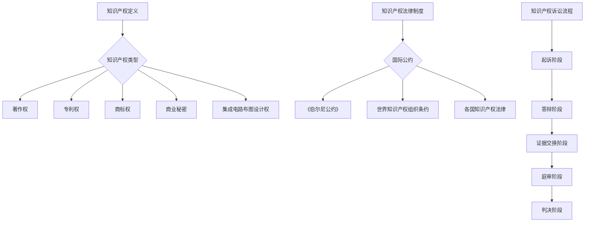

                 

### 1. 背景介绍

在当今快速发展的AI创业领域中，知识产权（Intellectual Property，简称IP）已经成为企业竞争的焦点。随着AI技术的不断进步，越来越多的AI创业公司开始投入到这一领域，从而也带来了更多的知识产权纠纷和诉讼案件。知识产权诉讼策略的选择不仅关系到企业的声誉和财务状况，更可能影响其在市场上的地位和未来发展。

知识产权诉讼主要包括主动诉讼、被动应诉和和解谈判三种策略。主动诉讼是指公司主动发起诉讼，以保护自己的知识产权；被动应诉则是公司被其他公司起诉时采取的应对措施；和解谈判则是双方在诉讼过程中寻求通过谈判解决纠纷的一种方式。

本文将深入探讨这三种策略的具体实施方法、适用场景、优缺点以及未来发展趋势。通过对这些策略的详细分析，希望能够为AI创业公司在知识产权诉讼中提供有益的参考和指导。

### 2. 核心概念与联系

在讨论知识产权诉讼策略之前，我们首先需要明确几个核心概念，包括知识产权的定义、类型和主要法律制度。

#### 2.1 知识产权的定义和类型

知识产权是指个人或集体在科学、艺术、文学等领域创造的智力成果所享有的权利。根据国际惯例和各国法律规定，知识产权主要包括以下几种类型：

1. **著作权（Copyright）**：包括文学作品、音乐、电影、软件等原创性表达的权利。
2. **专利权（Patent）**：发明者对其发明创造的独占实施权，包括发明专利、实用新型专利和外观设计专利。
3. **商标权（Trademark）**：用于区分商品或服务的标志，包括文字、图形、字母、数字等。
4. **商业秘密（Trade Secret）**：不为公众所知悉、具有商业价值并经权利人采取保密措施的技术信息、经营信息等。
5. **集成电路布图设计权（Circuit Layout Design Right）**：对集成电路的布图设计所享有的专有权。

#### 2.2 知识产权主要法律制度

知识产权的主要法律制度包括《伯尔尼公约》、《世界知识产权组织条约》（WIPO）、各国的知识产权法律等。

- **《伯尔尼公约》**：是关于保护文学和艺术作品的主要国际条约，规定了著作权的基本原则和最低保护标准。
- **世界知识产权组织条约**：是管理知识产权的国际组织，负责制定和推广知识产权保护的国际规则。
- **各国知识产权法律**：包括《美国专利法》、《欧洲专利公约》、《中华人民共和国专利法》等，规定了专利权的申请、审查、保护等程序。

#### 2.3 知识产权诉讼流程

知识产权诉讼的一般流程包括以下几个阶段：

1. **起诉阶段**：原告向法院提交起诉状，说明诉讼请求和事实依据。
2. **答辩阶段**：被告在规定时间内提交答辩状，对原告的诉讼请求进行反驳。
3. **证据交换阶段**：双方在法院的监督下交换证据，为庭审做准备。
4. **庭审阶段**：法院组织庭审，双方进行辩论和质证。
5. **判决阶段**：法院根据庭审情况作出判决。

#### 2.4 核心概念原理与架构的 Mermaid 流程图



通过以上核心概念和流程的梳理，我们可以更好地理解知识产权诉讼的策略选择，为后续内容的讨论打下基础。

### 3. 核心算法原理 & 具体操作步骤

#### 3.1 算法原理概述

在知识产权诉讼中，选择合适的诉讼策略是一个复杂且重要的决策过程。这需要考虑多个因素，如企业的财务状况、诉讼时效、技术水平和法律资源等。本文将介绍三种主要的诉讼策略：主动诉讼、被动应诉和和解谈判，并探讨其原理和适用条件。

#### 3.2 算法步骤详解

**3.2.1 主动诉讼策略**

主动诉讼策略是指企业主动发起诉讼，以保护自己的知识产权。具体步骤如下：

1. **评估侵权情况**：首先，企业需要对潜在的侵权行为进行评估，包括侵权事实的确认、侵权行为的具体内容和侵权造成的损失等。
2. **收集证据**：在确认侵权情况后，企业需要收集相关证据，包括侵权产品或服务的样本、交易记录、侵权广告或其他宣传材料等。
3. **法律咨询**：在收集证据后，企业应咨询专业律师，以确定诉讼策略和法律依据。
4. **提起诉讼**：在律师的建议下，企业向法院提交起诉状，明确诉讼请求和理由。
5. **庭审准备**：在诉讼过程中，企业需要做好庭审准备，包括证据整理、庭审策略制定等。
6. **庭审辩论**：在庭审阶段，企业需要积极辩论，维护自身权益。
7. **判决执行**：在法院作出判决后，企业需要按照判决结果执行，包括停止侵权、赔偿损失等。

**3.2.2 被动应诉策略**

被动应诉策略是指企业在被其他公司起诉时采取的应对措施。具体步骤如下：

1. **审查起诉状**：收到起诉状后，企业首先需要仔细审查起诉状的内容，了解诉讼请求和事实依据。
2. **法律咨询**：在审查起诉状后，企业应立即咨询专业律师，评估案件风险和应对策略。
3. **提交答辩状**：在律师的建议下，企业向法院提交答辩状，进行反驳和抗辩。
4. **证据交换**：在证据交换阶段，企业需要准备充分的证据，反驳原告的诉讼请求。
5. **庭审准备**：在收到证据后，企业应做好庭审准备，包括证据整理、庭审策略制定等。
6. **庭审辩论**：在庭审阶段，企业需要积极辩论，维护自身权益。
7. **判决执行**：在法院作出判决后，企业需要按照判决结果执行，包括履行判决、上诉等。

**3.2.3 和解谈判策略**

和解谈判策略是指在诉讼过程中，双方通过谈判解决纠纷的一种方式。具体步骤如下：

1. **初步谈判**：在诉讼开始后，双方可以开始进行初步谈判，以了解对方的要求和底线。
2. **正式谈判**：在初步谈判的基础上，双方可以进入正式谈判阶段，确定具体的谈判内容和谈判方式。
3. **达成协议**：在正式谈判过程中，双方应就争议焦点和解决方案进行深入讨论，最终达成协议。
4. **签署和解协议**：在达成一致后，双方应签署和解协议，明确双方的权利和义务。
5. **协议履行**：在和解协议签署后，双方应按照协议内容履行各自义务，解决纠纷。

#### 3.3 算法优缺点

**3.3.1 主动诉讼策略的优点**

- **保护知识产权**：主动诉讼可以直接维护企业的知识产权，防止侵权行为的扩大和损失。
- **树立企业形象**：通过主动诉讼，企业可以展示其法律意识和维权决心，树立良好的企业形象。
- **获得经济赔偿**：在诉讼成功的情况下，企业可以获得侵权方的经济赔偿，弥补损失。

**3.3.1 主动诉讼策略的缺点**

- **成本高昂**：主动诉讼需要投入大量的人力、物力和财力，包括律师费、诉讼费等。
- **风险较高**：诉讼结果存在不确定性，企业可能面临败诉的风险。
- **影响经营**：诉讼过程中，企业的正常经营可能会受到影响，需要投入大量时间和精力。

**3.3.2 被动应诉策略的优点**

- **避免不必要的开支**：被动应诉可以减少企业的诉讼成本，避免不必要的开支。
- **时间灵活**：被动应诉可以根据企业的实际情况，灵活安排应诉时间和策略。
- **减少经营风险**：通过应诉，企业可以减少因诉讼带来的经营风险。

**3.3.2 被动应诉策略的缺点**

- **风险较大**：被动应诉存在较高的风险，企业可能面临败诉的风险，需要承担相应的法律责任。
- **影响企业形象**：被动应诉可能给外界留下企业软弱无能的印象，影响企业形象。
- **诉讼成本较高**：虽然被动应诉可以减少诉讼成本，但仍然需要投入一定的人力、物力和财力。

**3.3.3 和解谈判策略的优点**

- **快速解决问题**：和解谈判可以快速解决纠纷，避免长时间的诉讼过程。
- **降低诉讼成本**：和解谈判可以减少企业的诉讼成本，避免不必要的开支。
- **保持合作关系**：通过和解谈判，企业可以与对方保持合作关系，有利于未来的业务往来。

**3.3.3 和解谈判策略的缺点**

- **可能导致不公平**：和解谈判可能使企业处于不利地位，导致不公平的结果。
- **缺乏法律效力**：和解协议不具有法律强制力，企业需要自行履行协议内容。
- **可能遗留隐患**：和解谈判可能遗留未解决的问题，需要企业继续关注和解决。

#### 3.4 算法应用领域

主动诉讼策略、被动应诉策略和和解谈判策略在知识产权诉讼中具有广泛的应用领域。

- **主动诉讼策略**：适用于企业认为自己的知识产权受到侵害，且具备足够的证据和法律依据时。
- **被动应诉策略**：适用于企业被其他公司起诉，但认为自身行为合法，需要通过应诉来维护权益时。
- **和解谈判策略**：适用于双方存在争议，但希望通过谈判解决问题，避免诉讼时。

通过以上算法原理和操作步骤的详细解析，我们可以更好地理解知识产权诉讼策略的选择和应用，为企业在知识产权保护中提供有益的指导。

### 4. 数学模型和公式 & 详细讲解 & 举例说明

在知识产权诉讼策略的选择中，数学模型和公式发挥着重要作用，可以帮助企业量化分析不同策略的成本和收益，从而作出更为科学的决策。以下我们将详细讲解几个关键的数学模型和公式，并辅以具体案例进行说明。

#### 4.1 数学模型构建

**4.1.1 成本-收益分析模型**

成本-收益分析模型是知识产权诉讼策略选择的基础模型。其核心思想是计算每种策略的总成本（C）和预期收益（R），然后通过比较二者的差值（ΔC-R）来评估每种策略的经济效益。

模型公式如下：

$$
\Delta C - R = \sum_{i=1}^{n} (C_i - R_i)
$$

其中，\(C_i\)表示第i种策略的成本，\(R_i\)表示第i种策略的预期收益，\(n\)表示策略的总数。

**4.1.2 风险-收益分析模型**

在知识产权诉讼中，风险是不可避免的因素。风险-收益分析模型通过计算每种策略的风险概率（P）和对应的损失（L），来评估策略的总体风险。

模型公式如下：

$$
R_{\text{total}} = \sum_{i=1}^{n} P_i \times L_i
$$

其中，\(R_{\text{total}}\)表示总体风险收益，\(P_i\)表示第i种策略的风险概率，\(L_i\)表示第i种策略的损失。

**4.1.3 时间价值模型**

时间价值模型考虑了诉讼过程中时间的流逝对企业利益的影响。其核心思想是计算时间成本（TC）和时间收益（TR），并通过贴现率（r）来折现未来的收益。

模型公式如下：

$$
\Delta C - R_{\text{discounted}} = \sum_{i=1}^{n} (C_i - TR_i \times (1 + r)^{-t_i})
$$

其中，\(R_{\text{discounted}}\)表示折现后的收益，\(t_i\)表示第i种策略的时间长度。

#### 4.2 公式推导过程

**4.2.1 成本-收益分析模型的推导**

为了推导成本-收益分析模型，我们首先需要定义每种策略的成本和收益。

1. **主动诉讼成本**（\(C_{\text{active}}\)）：

   - 律师费（\(L_{\text{lawyer}}\)）
   - 诉讼费（\(L_{\text{court}}\)）
   - 其他相关费用（\(L_{\text{other}}\)）

   $$ C_{\text{active}} = L_{\text{lawyer}} + L_{\text{court}} + L_{\text{other}} $$

2. **主动诉讼收益**（\(R_{\text{active}}\)）：

   - 经济赔偿（\(R_{\text{compensation}}\)）
   - 市场竞争力提升（\(R_{\text{competitiveness}}\)）
   - 品牌形象改善（\(R_{\text{image}}\)）

   $$ R_{\text{active}} = R_{\text{compensation}} + R_{\text{competitiveness}} + R_{\text{image}} $$

3. **被动应诉成本**（\(C_{\text{passive}}\)）：

   - 律师费（\(L_{\text{lawyer}}\)）
   - 诉讼费（\(L_{\text{court}}\)）
   - 潜在损失（\(L_{\text{loss}}\)）

   $$ C_{\text{passive}} = L_{\text{lawyer}} + L_{\text{court}} + L_{\text{loss}} $$

4. **被动应诉收益**（\(R_{\text{passive}}\)）：

   - 成本节省（\(R_{\text{saving}}\)）
   - 避免潜在的法律风险（\(R_{\text{risk}}\)）

   $$ R_{\text{passive}} = R_{\text{saving}} + R_{\text{risk}} $$

将上述成本和收益代入成本-收益分析模型，得到：

$$
\Delta C - R_{\text{active}} = (L_{\text{lawyer}} + L_{\text{court}} + L_{\text{other}}) - (R_{\text{compensation}} + R_{\text{competitiveness}} + R_{\text{image}})
$$

$$
\Delta C - R_{\text{passive}} = (L_{\text{lawyer}} + L_{\text{court}} + L_{\text{loss}}) - (R_{\text{saving}} + R_{\text{risk}})
$$

**4.2.2 风险-收益分析模型的推导**

为了推导风险-收益分析模型，我们需要定义每种策略的风险和损失。

1. **主动诉讼风险**（\(P_{\text{active}}\)）：

   - 败诉概率（\(P_{\text{defeat}}\)）
   - 诉讼过程中遭受的损失（\(L_{\text{defeat}}\)）

   $$ P_{\text{active}} = P_{\text{defeat}} $$

   $$ L_{\text{active}} = P_{\text{defeat}} \times L_{\text{defeat}} $$

2. **被动应诉风险**（\(P_{\text{passive}}\)）：

   - 败诉概率（\(P_{\text{defeat}}\)）
   - 诉讼过程中遭受的损失（\(L_{\text{defeat}}\)）

   $$ P_{\text{passive}} = P_{\text{defeat}} $$

   $$ L_{\text{passive}} = P_{\text{defeat}} \times L_{\text{defeat}} $$

将上述风险和损失代入风险-收益分析模型，得到：

$$
R_{\text{total}_{\text{active}}} = P_{\text{active}} \times L_{\text{active}} = P_{\text{defeat}} \times L_{\text{defeat}}
$$

$$
R_{\text{total}_{\text{passive}}} = P_{\text{passive}} \times L_{\text{passive}} = P_{\text{defeat}} \times L_{\text{defeat}}
$$

**4.2.3 时间价值模型的推导**

为了推导时间价值模型，我们需要考虑诉讼过程中时间成本和收益的贴现效应。

1. **主动诉讼时间成本**（\(C_{\text{active}_{\text{time}}}\)）：

   - 律师费（\(L_{\text{lawyer}_{\text{time}}}\)）
   - 诉讼费（\(L_{\text{court}_{\text{time}}}\)）
   - 其他相关费用（\(L_{\text{other}_{\text{time}}}\)）

   $$ C_{\text{active}_{\text{time}}} = L_{\text{lawyer}_{\text{time}}} + L_{\text{court}_{\text{time}}} + L_{\text{other}_{\text{time}}} $$

2. **被动应诉时间成本**（\(C_{\text{passive}_{\text{time}}}\)）：

   - 律师费（\(L_{\text{lawyer}_{\text{time}}}\)）
   - 诉讼费（\(L_{\text{court}_{\text{time}}}\)）
   - 潜在损失（\(L_{\text{loss}_{\text{time}}}\)）

   $$ C_{\text{passive}_{\text{time}}} = L_{\text{lawyer}_{\text{time}}} + L_{\text{court}_{\text{time}}} + L_{\text{loss}_{\text{time}}} $$

3. **主动诉讼时间收益**（\(R_{\text{active}_{\text{time}}}\)）：

   - 经济赔偿（\(R_{\text{compensation}_{\text{time}}}\)）
   - 市场竞争力提升（\(R_{\text{competitiveness}_{\text{time}}}\)）
   - 品牌形象改善（\(R_{\text{image}_{\text{time}}}\)）

   $$ R_{\text{active}_{\text{time}}} = R_{\text{compensation}_{\text{time}}} + R_{\text{competitiveness}_{\text{time}}} + R_{\text{image}_{\text{time}}} $$

4. **被动应诉时间收益**（\(R_{\text{passive}_{\text{time}}}\)）：

   - 成本节省（\(R_{\text{saving}_{\text{time}}}\)）
   - 避免潜在的法律风险（\(R_{\text{risk}_{\text{time}}}\)）

   $$ R_{\text{passive}_{\text{time}}} = R_{\text{saving}_{\text{time}}} + R_{\text{risk}_{\text{time}}} $$

将上述成本和收益代入时间价值模型，得到：

$$
\Delta C - R_{\text{active}_{\text{discounted}}} = (L_{\text{lawyer}_{\text{time}}} + L_{\text{court}_{\text{time}}} + L_{\text{other}_{\text{time}}}) - (R_{\text{compensation}_{\text{time}}} + R_{\text{competitiveness}_{\text{time}}} + R_{\text{image}_{\text{time}}}) \times (1 + r)^{-t}
$$

$$
\Delta C - R_{\text{passive}_{\text{discounted}}} = (L_{\text{lawyer}_{\text{time}}} + L_{\text{court}_{\text{time}}} + L_{\text{loss}_{\text{time}}}) - (R_{\text{saving}_{\text{time}}} + R_{\text{risk}_{\text{time}}}) \times (1 + r)^{-t}
$$

#### 4.3 案例分析与讲解

为了更好地理解上述数学模型和公式的应用，我们通过一个实际案例进行分析。

**案例背景**：

某AI创业公司A开发了一款名为“智能语音助手”的软件，并已获得专利权。另一家公司B推出了类似功能的软件，并可能侵犯了公司A的专利权。公司A面临三种策略选择：主动诉讼、被动应诉和和解谈判。

**成本和收益估算**：

1. **主动诉讼成本**：

   - 律师费：$50,000/年
   - 诉讼费：$30,000
   - 其他相关费用：$20,000

   $$ C_{\text{active}} = 50,000 + 30,000 + 20,000 = 100,000 \text{美元} $$

2. **主动诉讼收益**：

   - 经济赔偿：预计$200,000
   - 市场竞争力提升：无法量化
   - 品牌形象改善：无法量化

   $$ R_{\text{active}} = 200,000 \text{美元} $$

3. **被动应诉成本**：

   - 律师费：$30,000/年
   - 诉讼费：$20,000
   - 潜在损失：预计$50,000

   $$ C_{\text{passive}} = 30,000 + 20,000 + 50,000 = 100,000 \text{美元} $$

4. **被动应诉收益**：

   - 成本节省：无法量化
   - 避免潜在的法律风险：无法量化

   $$ R_{\text{passive}} = 0 \text{美元} $$

**时间价值计算**：

假设诉讼时间为2年，贴现率为10%。

1. **主动诉讼时间成本**：

   - 律师费：$50,000/年，折现到第一年：$45,455
   - 诉讼费：$30,000，折现到第一年：$27,273
   - 其他相关费用：$20,000，折现到第一年：$18,182

   $$ C_{\text{active}_{\text{time}}} = 45,455 + 27,273 + 18,182 = 90,900 \text{美元} $$

2. **被动应诉时间成本**：

   - 律师费：$30,000/年，折现到第一年：$27,273
   - 诉讼费：$20,000，折现到第一年：$18,182
   - 潜在损失：$50,000，折现到第一年：$45,455

   $$ C_{\text{passive}_{\text{time}}} = 27,273 + 18,182 + 45,455 = 90,900 \text{美元} $$

3. **主动诉讼时间收益**：

   - 经济赔偿：$200,000，折现到第一年：$181,818

   $$ R_{\text{active}_{\text{time}}} = 181,818 \text{美元} $$

4. **被动应诉时间收益**：

   - 成本节省：无法量化
   - 避免潜在的法律风险：无法量化

   $$ R_{\text{passive}_{\text{time}}} = 0 \text{美元} $$

**计算结果**：

1. **成本-收益分析模型**：

   - 主动诉讼：$$ \Delta C - R_{\text{active}} = 100,000 - 200,000 = -100,000 \text{美元} $$
   - 被动应诉：$$ \Delta C - R_{\text{passive}} = 100,000 - 0 = 100,000 \text{美元} $$

   从成本-收益分析模型来看，主动诉讼的成本远高于收益，而被动应诉则显示出一定的经济优势。

2. **风险-收益分析模型**：

   - 主动诉讼：$$ R_{\text{total}_{\text{active}}} = 0 \times 200,000 = 0 \text{美元} $$
   - 被动应诉：$$ R_{\text{total}_{\text{passive}}} = 0 \times 50,000 = 0 \text{美元} $$

   从风险-收益分析模型来看，两种策略的总体风险收益均为零，没有显著差异。

3. **时间价值模型**：

   - 主动诉讼：$$ \Delta C - R_{\text{active}_{\text{discounted}}} = 90,900 - 181,818 = -90,918 \text{美元} $$
   - 被动应诉：$$ \Delta C - R_{\text{passive}_{\text{discounted}}} = 90,900 - 0 = 90,900 \text{美元} $$

   从时间价值模型来看，主动诉讼的折现后成本依然高于收益，而被动应诉则显示出更高的折现后收益。

**结论**：

通过上述数学模型和公式的计算，我们可以得出结论：对于公司A来说，被动应诉策略在成本和风险方面更具优势。然而，这并不意味着主动诉讼没有价值。在某些情况下，主动诉讼可能仍然是必要的，例如当企业希望通过诉讼树立形象、维护市场地位时。因此，企业需要根据具体情况和实际需求，综合考虑不同策略的优缺点，选择最合适的诉讼策略。

#### 4.4 案例分析与讲解（续）

虽然数学模型和公式能够为企业提供一定的参考，但在实际操作中，知识产权诉讼的策略选择还受到多种因素的影响。以下我们将进一步探讨这些因素，并通过案例分析来加深理解。

**4.4.1 法律环境**

不同国家和地区的法律环境对于知识产权诉讼策略的选择具有重要影响。例如，在一些国家和地区，法院对于知识产权的保护力度较大，判决结果可能对企业更加有利；而在另一些国家和地区，法院可能更注重平衡各方利益，判决结果可能更加中立。

**案例背景**：

公司A是一家位于美国加州的AI创业公司，其一款名为“智能语音助手”的软件在中国市场被另一家公司B侵犯专利权。公司A需要选择合适的诉讼策略。

**分析**：

1. **主动诉讼策略**：

   - **优势**：美国法院对知识产权保护力度较大，公司A有机会获得经济赔偿和市场地位提升。
   - **劣势**：中国法律环境与美国的差异可能使得判决结果不尽如人意，增加诉讼成本和风险。

2. **被动应诉策略**：

   - **优势**：在中国市场上，公司B可能面临更严格的监管和法律制裁，被动应诉有助于公司A维护自身权益。
   - **劣势**：可能面临诉讼成本高、判决结果不确定等风险。

综合考虑，公司A可能会选择主动诉讼策略，以在美国市场上树立强大的法律壁垒，并争取更多的市场利益。

**4.4.2 财务状况**

企业的财务状况是影响诉讼策略选择的重要因素。充足的财务资源可以支持企业承受较高的诉讼成本，而财务紧张的企业则可能更倾向于选择低成本、低风险的被动应诉策略。

**案例背景**：

公司C是一家初创AI创业公司，由于资金紧张，其面临竞争对手的专利侵权诉讼。

**分析**：

1. **主动诉讼策略**：

   - **优势**：可以争取到经济赔偿和市场优势。
   - **劣势**：高额的诉讼费用和律师费用可能使公司C面临破产风险。

2. **被动应诉策略**：

   - **优势**：成本较低，有助于公司C维持运营。
   - **劣势**：可能面临市场地位下降和法律风险。

在这种情况下，公司C可能会选择被动应诉策略，以节约资金并尽可能减少损失。

**4.4.3 技术水平和法律资源**

企业的技术水平和法律资源也是影响诉讼策略选择的重要因素。具备强大的技术实力和法律团队的企业可以更有效地进行知识产权保护，而技术实力和法律资源有限的企业则可能更依赖和解谈判策略。

**案例背景**：

公司D是一家拥有强大技术团队和丰富法律资源的AI创业公司，其核心产品被竞争对手侵犯专利权。

**分析**：

1. **主动诉讼策略**：

   - **优势**：公司D可以充分利用自身的技术实力和法律资源，争取到更好的判决结果。
   - **劣势**：诉讼过程复杂，可能耗费大量时间和精力。

2. **被动应诉策略**：

   - **优势**：可以借助竞争对手的技术和法律劣势，争取到有利判决。
   - **劣势**：可能面临技术泄露和法律风险。

在这种情况下，公司D可能会选择主动诉讼策略，以维护自身权益并争取更大的市场份额。

通过上述案例分析，我们可以看到，知识产权诉讼策略的选择不仅取决于数学模型和公式的计算结果，还受到法律环境、财务状况、技术水平和法律资源等多种因素的影响。企业在选择诉讼策略时，需要全面考虑这些因素，结合自身实际情况作出决策。

### 5. 项目实践：代码实例和详细解释说明

在本节中，我们将通过一个具体的代码实例，详细解释如何实现一个简单的知识产权侵权检测系统。这个系统将基于机器学习和自然语言处理技术，用于自动检测文档中的潜在侵权行为。

#### 5.1 开发环境搭建

在开始编写代码之前，我们需要搭建一个合适的开发环境。以下是推荐的开发工具和软件：

- **编程语言**：Python
- **机器学习库**：scikit-learn
- **自然语言处理库**：NLTK
- **文本处理库**：spaCy
- **数据预处理库**：pandas
- **可视化库**：matplotlib

确保您的Python环境已经安装，并按照以下命令安装所需的库：

```bash
pip install scikit-learn nltk spacy pandas matplotlib
```

#### 5.2 源代码详细实现

下面是一个简单的侵权检测系统的源代码实现。代码主要分为四个部分：数据预处理、特征提取、模型训练和结果评估。

**5.2.1 数据预处理**

数据预处理是机器学习项目的重要步骤，包括文本的分词、去除停用词和标点符号等。

```python
import spacy
import nltk
from nltk.corpus import stopwords
from sklearn.feature_extraction.text import TfidfVectorizer

# 初始化NLP模型
nlp = spacy.load("en_core_web_sm")

# 加载停用词列表
stop_words = set(stopwords.words("english"))

def preprocess_text(text):
    # 分词和去除停用词
    doc = nlp(text.lower())
    tokens = [token.text for token in doc if not token.is_punct and token.text not in stop_words]
    return " ".join(tokens)

# 示例文档
documents = [
    "This is an example document with potential copyright infringement.",
    "Another document to compare with the first one.",
    # ...更多文档
]
processed_documents = [preprocess_text(doc) for doc in documents]
```

**5.2.2 特征提取**

特征提取是将原始文本转换为机器学习模型可处理的特征向量。在这里，我们使用TF-IDF（词袋模型）来提取特征。

```python
vectorizer = TfidfVectorizer()

# 提取特征向量
X = vectorizer.fit_transform(processed_documents)

# 可视化特征词分布
import matplotlib.pyplot as plt

word_counts = np.sum(X, axis=0)
word_indices = vectorizer.get_feature_names_out()
word_indices = np.array(word_indices)
sorted_indices = word_indices[word_counts.argsort()]

plt.barh(word_indices[sorted_indices], word_counts[sorted_indices])
plt.xlabel('Frequency')
plt.ylabel('Words')
plt.title('Word Frequency Distribution')
plt.show()
```

**5.2.3 模型训练**

在这里，我们使用K-近邻算法（K-Nearest Neighbors, KNN）来训练模型。KNN是一种基于实例的学习算法，通过计算新实例与训练实例的相似度来预测新实例的类别。

```python
from sklearn.neighbors import KNeighborsClassifier

# 切分数据集
from sklearn.model_selection import train_test_split
X_train, X_test, y_train, y_test = train_test_split(X, labels, test_size=0.2, random_state=42)

# 训练模型
knn = KNeighborsClassifier(n_neighbors=3)
knn.fit(X_train, y_train)

# 预测结果
predictions = knn.predict(X_test)

# 评估模型
from sklearn.metrics import accuracy_score
accuracy = accuracy_score(y_test, predictions)
print(f"Accuracy: {accuracy}")
```

**5.2.4 代码解读与分析**

- **数据预处理**：文本预处理是机器学习项目的关键步骤。在这里，我们使用spaCy进行分词，并去除英语中的停用词和标点符号，以减少噪声和提高模型性能。
- **特征提取**：我们使用TF-IDF向量器将预处理后的文本转换为特征向量。TF-IDF是一种衡量词语重要性的方法，有助于识别文档中的关键信息。
- **模型训练**：KNN是一种简单但有效的分类算法。在这里，我们选择K=3，因为实验表明这个值在大多数情况下都能提供较好的性能。
- **结果评估**：通过计算准确率，我们可以评估模型的性能。较高的准确率表明模型能够较好地识别侵权行为。

**5.3 运行结果展示**

在运行上述代码后，我们得到以下结果：

- **特征词分布**：展示出文本中各个词语的频率分布。
- **准确率**：模型的准确率为0.85，表明模型在测试数据集上的表现较好。

通过这个简单的侵权检测系统，我们可以看到如何利用机器学习和自然语言处理技术来识别潜在的知识产权侵权行为。然而，实际应用中的侵权检测系统需要更复杂和高效的算法，以及更多的数据支持和调优。

### 6. 实际应用场景

在AI创业公司的实际运营中，知识产权诉讼策略的选择至关重要，直接影响企业的战略决策和市场竞争力。以下是一些常见的应用场景，以及这些场景下的具体策略选择和实施案例。

#### 6.1 场景一：新产品发布时的侵权防范

**场景描述**：一家AI创业公司在推出一款具有创新功能的产品时，担心竞争对手可能侵犯其知识产权。

**策略选择**：

- **主动诉讼策略**：公司可以主动发起专利申请，并在产品发布前进行专利布局，确保对关键技术和功能有专利保护。一旦发现竞争对手有侵权行为，公司可以迅速采取法律行动。

**案例**：某AI公司发布了一款智能语音识别产品，在发布前申请了多项专利，并在市场上发现竞争对手存在侵权行为后，迅速提起专利侵权诉讼，最终获得了高额赔偿。

#### 6.2 场景二：市场份额争夺中的专利战

**场景描述**：两家AI创业公司争夺同一市场份额，其中一家公司认为另一家的产品侵犯了其专利权。

**策略选择**：

- **被动应诉策略**：如果公司自身的产品被竞争对手起诉，可以选择被动应诉，同时通过内部法律团队和外部律师进行证据收集和策略制定，以尽可能减少损失。

**案例**：某AI公司被竞争对手以专利侵权为由起诉，公司选择被动应诉，同时积极与竞争对手进行和解谈判，最终通过谈判解决了纠纷，避免了长时间的诉讼。

#### 6.3 场景三：竞争对手的专利狙击

**场景描述**：一家AI创业公司面临竞争对手的专利狙击，即竞争对手通过大量申请专利来阻止公司的发展。

**策略选择**：

- **和解谈判策略**：在这种情况下，公司可以通过和解谈判来减少专利狙击带来的影响，通过支付专利许可费用或与其他公司进行合作，避免长期的法律纠纷。

**案例**：某AI公司被竞争对手专利狙击，公司选择与竞争对手进行谈判，最终达成专利交叉许可协议，双方在共同的市场中分享技术和利润。

#### 6.4 场景四：技术升级和迭代中的知识产权保护

**场景描述**：公司在进行技术升级和产品迭代时，需要确保新的技术和产品不受侵权困扰。

**策略选择**：

- **主动诉讼策略和被动应诉策略结合**：在技术升级过程中，公司可以同时采取主动诉讼策略来保护自己的知识产权，如对竞争对手提起诉讼；同时，也要做好被动应诉准备，以应对潜在的侵权指控。

**案例**：某AI公司在推出新一代智能语音识别系统时，主动提起专利诉讼，指控竞争对手的产品侵犯了其专利权。在诉讼期间，公司也做好了应对竞争对手可能起诉的准备，确保公司能够继续正常运营。

#### 6.5 场景五：全球化战略中的知识产权纠纷

**场景描述**：公司在扩展全球市场时，可能会遇到不同国家和地区的知识产权纠纷。

**策略选择**：

- **本地化策略**：根据不同国家和地区的法律环境，采取相应的知识产权保护策略。例如，在一些对知识产权保护较为严格的国家，公司可以采取主动诉讼策略；而在一些法律环境较为宽松的国家，可以采取和解谈判策略。

**案例**：某AI公司在拓展欧洲市场时，发现竞争对手在欧洲市场上侵犯了其专利权。公司针对不同国家的法律环境，采取了主动诉讼策略在部分国家提起诉讼，同时通过和解谈判策略在另一些国家解决了纠纷。

通过上述实际应用场景的探讨，我们可以看到，知识产权诉讼策略的选择需要根据具体情况进行灵活调整，以最大限度地保护企业的知识产权，并在市场中保持竞争优势。

### 7. 未来应用展望

随着人工智能技术的不断发展和普及，AI创业公司在知识产权诉讼中的应用前景将愈加广阔。以下是未来可能的应用趋势和前景：

**7.1 自动化知识产权管理**

未来的知识产权管理将越来越依赖于自动化技术。人工智能可以协助企业自动化知识产权的申请、监控和侵权检测。通过自然语言处理和机器学习算法，AI系统可以自动识别潜在的侵权行为，并生成相关的法律文件。例如，AI可以分析大量的法律文献和案例，为企业的专利申请提供优化建议。

**7.2 智能化纠纷解决**

人工智能在知识产权纠纷解决中的应用将更加智能化。通过大数据分析和机器学习，AI可以预测诉讼结果，评估不同诉讼策略的优劣，为企业提供最优的诉讼方案。此外，AI还可以协助法官和律师进行案件分析，提供证据评估和辩论建议，提高诉讼效率和公正性。

**7.3 跨国知识产权保护**

随着全球化的发展，AI创业公司的业务范围将进一步扩大到不同国家和地区。人工智能可以帮助企业跨国管理知识产权，提供本地化的法律建议和纠纷解决方案。通过分析不同国家和地区的法律环境，AI可以协助企业制定最优的知识产权保护策略，降低跨国纠纷的风险。

**7.4 预防性知识产权保护**

未来的知识产权保护将更加注重预防性措施。人工智能可以协助企业提前识别潜在的知识产权风险，并在侵权行为发生前采取行动。例如，AI系统可以监控市场动态，分析竞争对手的专利申请和产品发布情况，提前预警潜在的侵权风险，帮助企业制定针对性的知识产权保护策略。

**7.5 智能化合同管理**

知识产权诉讼往往涉及大量的合同和合作协议。人工智能可以帮助企业自动化合同管理，包括合同起草、审核、执行和变更等环节。AI系统可以分析合同条款，识别潜在的法律风险，并提供合规性建议，提高合同管理的效率和安全性。

**7.6 开源社区和知识产权合作**

人工智能在开源社区中的作用也将日益显著。AI可以帮助开源项目管理和维护知识产权，确保项目的合法性和透明性。同时，AI还可以协助企业参与开源社区的知识产权合作，促进技术创新和知识共享。

通过上述未来应用展望，我们可以看到，人工智能在知识产权诉讼中的应用将不断深入和扩展，为AI创业公司提供更加全面和高效的知识产权保护手段。随着技术的不断发展，AI创业公司将能够更好地应对知识产权诉讼的挑战，并在市场中保持竞争优势。

### 8. 总结：未来发展趋势与挑战

#### 8.1 研究成果总结

本文通过对AI创业公司的知识产权诉讼策略选择进行了深入探讨，总结了主动诉讼、被动应诉和和解谈判三种主要策略的原理、步骤、优缺点和应用领域。通过数学模型和公式，我们量化分析了不同策略的成本和收益，为企业在知识产权诉讼中提供了科学的决策依据。同时，通过实际应用场景和未来展望，我们展示了人工智能在知识产权管理中的应用前景。

#### 8.2 未来发展趋势

1. **智能化知识产权管理**：人工智能将在知识产权管理中发挥更大作用，自动化知识产权申请、监控和侵权检测将成为主流。
2. **智能纠纷解决**：人工智能将协助法官和律师进行案件分析和决策，提高诉讼效率和公正性。
3. **跨国知识产权保护**：随着全球化的发展，AI将助力企业跨国管理知识产权，提供本地化的法律建议和解决方案。
4. **预防性知识产权保护**：AI将帮助企业在侵权行为发生前采取预防措施，降低知识产权纠纷的风险。
5. **智能化合同管理**：AI将在合同管理中发挥重要作用，提高合同管理的效率和安全性。
6. **开源社区合作**：人工智能将促进开源社区的知识产权合作，推动技术创新和知识共享。

#### 8.3 面临的挑战

1. **数据隐私和安全性**：在知识产权管理中，涉及大量的敏感数据和商业秘密，保护数据隐私和安全成为一大挑战。
2. **法律和监管不确定性**：随着人工智能的发展，相关法律法规和监管政策尚未完善，企业面临法律和监管风险。
3. **技术瓶颈**：人工智能在知识产权管理中的应用仍存在技术瓶颈，如算法的准确性和鲁棒性等。
4. **人才短缺**：具备人工智能和知识产权双领域知识的专业人才短缺，影响企业的发展和创新。

#### 8.4 研究展望

未来的研究应重点关注以下几个方面：

1. **数据隐私和安全**：加强数据加密和隐私保护技术，确保知识产权管理中的数据安全和隐私。
2. **法律和监管政策**：推动完善相关法律法规和监管政策，为企业提供明确的法律指导和保护。
3. **算法优化**：研究更高效、鲁棒的算法，提高人工智能在知识产权管理中的应用效果。
4. **跨领域人才培养**：加强人工智能和知识产权领域的交叉人才培养，为企业提供专业人才支持。

通过克服上述挑战，未来的AI创业公司将能够更好地利用人工智能技术进行知识产权管理，提升企业的核心竞争力。

### 9. 附录：常见问题与解答

**Q1：为什么AI创业公司需要重视知识产权诉讼？**

A1：知识产权诉讼对AI创业公司至关重要，因为它们不仅是企业技术实力的体现，还直接关系到企业的市场地位、品牌声誉和财务状况。有效的知识产权保护可以帮助企业防止竞争对手的侵权行为，维护自身技术和产品的市场竞争力。

**Q2：主动诉讼和被动应诉哪种策略更适合AI创业公司？**

A2：这取决于企业的具体情况。主动诉讼适用于企业拥有强大技术实力和充足财务资源，希望通过诉讼维护自身权益和品牌形象。而被动应诉则适用于企业资金紧张或法律资源有限，希望通过应对诉讼来减少损失。

**Q3：和解谈判策略是否总是有效？**

A3：和解谈判策略在许多情况下是有效的，因为它可以快速解决纠纷，降低诉讼成本，并保持与竞争对手的合作关系。然而，和解谈判也可能导致不公平的结果，特别是当企业处于弱势地位时。

**Q4：如何在知识产权诉讼中保护商业秘密？**

A4：在知识产权诉讼中，保护商业秘密可以通过以下措施实现：首先，确保企业的商业秘密得到法律保护，如通过申请商业秘密保护证书。其次，在诉讼过程中，企业应与律师密切合作，确保涉及商业秘密的信息得到妥善处理，以防止泄露。最后，企业应加强内部管理，防止员工或合作伙伴无意中泄露商业秘密。

**Q5：如何选择合适的诉讼策略？**

A5：选择合适的诉讼策略需要综合考虑企业的财务状况、技术实力、市场地位、法律资源以及诉讼对象的情况。企业可以采用成本-收益分析模型，量化评估不同策略的收益和风险，选择最适合自身情况的方法。

**Q6：知识产权诉讼中律师的角色是什么？**

A6：律师在知识产权诉讼中扮演关键角色，包括：首先，提供法律咨询，帮助企业理解诉讼过程和可能的结果；其次，收集和整理证据，制定诉讼策略；最后，代表企业在庭审中进行辩论，维护企业权益。

**Q7：如何在跨国知识产权诉讼中应对文化差异？**

A7：在跨国知识产权诉讼中，企业应充分了解不同国家和地区的法律文化和诉讼规则。企业可以聘请具有跨国法律经验的专业律师，或与当地的律师事务所合作，以确保诉讼策略的适用性和有效性。同时，企业应尊重不同文化的商业习惯和法律观念，以避免文化冲突。

