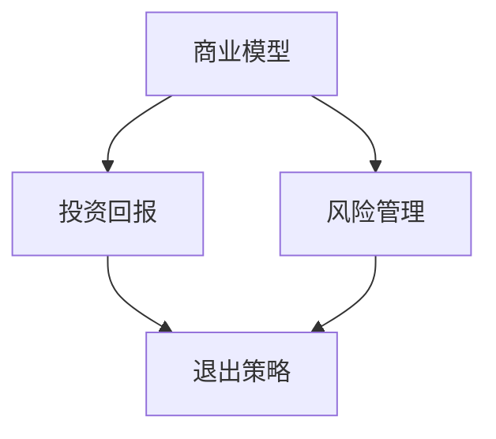

                 

关键词：AI创业公司、退出策略、商业模型、投资回报、风险管理

摘要：本文将深入探讨AI创业公司在面对市场竞争和投资回报的压力时，如何设计和实施有效的退出策略。通过分析不同类型的退出方式、制定退出策略的关键步骤，以及如何在退出过程中降低风险，本文旨在为AI创业者提供实用的指导和建议。

## 1. 背景介绍

在当今快速发展的AI领域，创业公司如雨后春笋般涌现。这些公司致力于研发创新技术、解决复杂问题，并希望通过市场验证实现商业成功。然而，AI创业公司的生存环境充满挑战，不仅需要持续的技术创新，还要面对激烈的市场竞争和资金压力。因此，设计一套有效的退出策略成为许多创业公司不得不面对的现实问题。

退出策略不仅是公司发展的最后手段，也是投资者利益保障的重要一环。一个成功的退出策略能够为公司带来可观的收益，同时也能够为投资者实现合理的投资回报。然而，退出策略的设计和执行并非易事，需要综合考虑多种因素，包括市场环境、公司实力、技术壁垒、资金状况等。

本文将围绕AI创业公司的退出策略展开讨论，首先介绍常见的退出方式，然后详细分析制定退出策略的关键步骤，最后探讨如何在退出过程中降低风险。希望通过本文的探讨，为AI创业公司提供一些实用的参考和启示。

## 2. 核心概念与联系

在探讨AI创业公司的退出策略之前，我们需要明确几个核心概念，并分析它们之间的联系。

### 2.1. 退出方式的定义和分类

退出方式是指创业公司在完成一定的业务发展后，通过出售、并购、IPO等方式实现公司价值变现的过程。常见的退出方式包括：

- **出售**：创业公司将公司股权或资产出售给另一家公司或个人，实现直接退出。
- **并购**：一家成熟公司收购创业公司，使其成为子公司或业务部门。
- **IPO**：创业公司通过公开上市，将股份在证券市场上公开发行，从而实现资本退出。
- **清算**：在无法找到买家或投资者的情况下，创业公司通过清算资产偿还债务，实现退出。

### 2.2. 商业模型的定义和要素

商业模型是指公司如何创造、传递和获取价值的过程。一个有效的商业模型需要包含以下几个关键要素：

- **价值主张**：公司为顾客提供的独特价值。
- **目标市场**：公司服务的顾客群体。
- **盈利模式**：公司如何从顾客中获取收益。
- **关键资源**：公司运营所需的关键资源。
- **关键活动**：公司为支持业务运营所开展的关键活动。
- **合作伙伴网络**：公司与供应商、分销商等合作伙伴的关系。

### 2.3. 投资回报与风险管理的定义和关系

投资回报是指投资者通过投资获得的收益。风险管理是指公司采取措施降低可能出现的损失。投资回报和风险管理之间存在密切关系：

- **投资回报**：创业公司通过持续的技术创新和市场拓展，实现商业模式的成功，从而为投资者带来回报。
- **风险管理**：创业公司通过有效识别和管理风险，确保公司在不确定的市场环境中保持稳定运营，从而提高投资回报的可能性。

### 2.4. 退出策略与商业模型、投资回报、风险管理的联系

退出策略与商业模型、投资回报、风险管理之间存在紧密的联系：

- **商业模型**：创业公司通过设计有效的商业模型，确保公司能够在市场中获得竞争优势，从而提高退出策略的成功率。
- **投资回报**：创业公司通过实现商业模式的成功，为投资者带来可观的回报，从而为退出策略提供坚实的支持。
- **风险管理**：创业公司通过有效识别和管理风险，降低经营不确定性，提高退出策略的稳定性和可靠性。

### 2.5. Mermaid流程图

下面是一个简化的Mermaid流程图，展示了核心概念之间的联系：



通过上述核心概念和流程图的介绍，我们可以更好地理解AI创业公司在制定退出策略时需要考虑的各种因素和环节。接下来，本文将深入探讨如何设计和实施有效的退出策略。

## 3. 核心算法原理 & 具体操作步骤

### 3.1 算法原理概述

退出策略的设计本质上是一个决策过程，涉及对市场环境、公司实力、技术壁垒等多方面因素的综合分析和评估。核心算法原理主要包括以下几个步骤：

1. **市场环境分析**：通过市场调研和数据分析，了解行业趋势、竞争对手、市场需求等信息。
2. **公司实力评估**：评估公司的技术、产品、市场、团队等方面的实力，确定公司的核心竞争力。
3. **技术壁垒分析**：分析公司的技术壁垒，包括专利、技术优势、资源积累等，为退出方式的选择提供依据。
4. **投资回报预测**：根据市场环境和公司实力，预测不同退出方式可能带来的投资回报。
5. **风险管理**：评估退出过程中可能面临的风险，并制定相应的风险管理策略。
6. **退出方案设计**：综合分析以上因素，设计出最优的退出方案，并制定详细的执行计划。

### 3.2 算法步骤详解

#### 3.2.1 市场环境分析

市场环境分析是制定退出策略的第一步，主要包括以下几个方面：

- **行业趋势**：研究行业的发展趋势，包括市场规模、增长速度、技术进步等。
- **竞争对手**：分析主要竞争对手的市场份额、产品特点、竞争优势等。
- **市场需求**：了解目标市场的需求变化，包括用户需求、应用场景等。
- **政策法规**：研究行业相关的政策法规，包括市场准入、知识产权保护等。

#### 3.2.2 公司实力评估

公司实力评估是制定退出策略的核心环节，主要包括以下几个方面：

- **技术能力**：评估公司的技术研发能力、技术积累、专利情况等。
- **产品竞争力**：评估产品的市场竞争力，包括功能特点、性能指标、用户反馈等。
- **市场份额**：评估公司在目标市场中的市场份额、增长速度等。
- **团队实力**：评估公司团队的专业能力、经验积累、合作氛围等。

#### 3.2.3 技术壁垒分析

技术壁垒分析是选择退出方式的重要依据，主要包括以下几个方面：

- **专利情况**：评估公司的专利数量、覆盖范围、有效性等。
- **技术优势**：评估公司的技术优势，包括核心技术、技术解决方案等。
- **资源积累**：评估公司在技术、市场、资金等方面的资源积累情况。

#### 3.2.4 投资回报预测

投资回报预测是制定退出策略的重要环节，主要包括以下几个方面：

- **财务指标**：评估公司的财务状况，包括收入、利润、现金流等。
- **市场前景**：预测公司未来的市场表现，包括市场份额、增长速度等。
- **退出方式**：根据市场环境和公司实力，预测不同退出方式可能带来的投资回报。

#### 3.2.5 风险管理

风险管理是保证退出策略顺利实施的关键，主要包括以下几个方面：

- **市场风险**：分析市场环境变化对公司退出策略的影响，包括市场需求、政策法规等。
- **运营风险**：评估公司运营过程中可能出现的风险，包括技术研发、市场竞争等。
- **财务风险**：评估公司财务状况对退出策略的影响，包括资金流动、成本控制等。

#### 3.2.6 退出方案设计

退出方案设计是制定退出策略的最后一步，主要包括以下几个方面：

- **退出方式**：根据投资回报预测和风险管理结果，选择最合适的退出方式。
- **退出时机**：根据市场环境和公司实力，确定最合适的退出时机。
- **执行计划**：制定详细的执行计划，包括退出流程、时间表、责任分配等。

### 3.3 算法优缺点

#### 优点

- **系统性强**：算法通过多维度、多环节的分析，确保退出策略的全面性和系统性。
- **灵活性高**：算法根据不同市场环境和公司实力，灵活选择退出方式和时机。
- **风险可控**：算法通过风险管理环节，确保退出策略的实施过程中风险可控。

#### 缺点

- **数据依赖性高**：算法的准确性依赖于市场环境、公司实力等数据的准确性。
- **复杂性高**：算法涉及多个环节和维度，实施过程较为复杂。

### 3.4 算法应用领域

算法主要应用于以下领域：

- **创业公司**：为创业公司提供有效的退出策略设计，提高公司价值。
- **投资机构**：为投资机构提供投资决策依据，提高投资回报率。
- **咨询公司**：为咨询公司提供战略咨询服务，帮助企业制定退出策略。

## 4. 数学模型和公式 & 详细讲解 & 举例说明

### 4.1 数学模型构建

在退出策略设计中，我们可以构建一个简单的数学模型来预测不同退出方式的收益和风险。该模型包括以下几个主要变量：

- **R\_exit**：退出收益
- **P\_success**：成功概率
- **C\_risk**：风险成本
- **V\_value**：公司价值

数学模型如下：

$$
R_{exit} = P_{success} \times (V_{value} - C_{risk})
$$

其中，$P_{success}$ 表示退出方式成功概率，$V_{value}$ 表示公司价值，$C_{risk}$ 表示风险成本。

### 4.2 公式推导过程

为了推导上述公式，我们需要考虑以下几个因素：

1. **成功概率**：退出方式成功概率取决于市场环境、公司实力、技术壁垒等多方面因素。假设成功概率为 $P_{success}$。
2. **公司价值**：公司价值取决于公司的市场表现、财务状况、竞争优势等多方面因素。假设公司价值为 $V_{value}$。
3. **风险成本**：风险成本包括退出过程中可能出现的各种风险导致的损失。假设风险成本为 $C_{risk}$。

根据这些因素，我们可以得到以下推导过程：

$$
R_{exit} = P_{success} \times (V_{value} - C_{risk})
$$

### 4.3 案例分析与讲解

假设一家AI创业公司，经过市场调研和数据分析，确定了以下参数：

- 成功概率：$P_{success} = 0.8$
- 公司价值：$V_{value} = 10,000,000$
- 风险成本：$C_{risk} = 2,000,000$

根据上述参数，我们可以计算退出收益：

$$
R_{exit} = 0.8 \times (10,000,000 - 2,000,000) = 6,400,000
$$

这意味着，如果这家公司选择退出，预计可以获得6,400,000的收益。当然，实际收益会受到市场环境和公司实力等因素的影响，这里仅作为一个简化的示例。

### 4.4 未来应用展望

随着AI技术的不断发展和市场环境的不断变化，退出策略的设计和实施将面临新的挑战和机遇。未来，数学模型和算法将在以下几个方面得到应用：

1. **动态调整**：结合实时数据和动态市场环境，对数学模型进行动态调整，提高预测的准确性。
2. **多因素分析**：考虑更多的影响因素，如宏观经济、政策变化、竞争对手动态等，提高模型的全面性和准确性。
3. **智能化决策**：利用机器学习和人工智能技术，实现退出策略的智能化决策，提高决策的效率和准确性。

## 5. 项目实践：代码实例和详细解释说明

### 5.1 开发环境搭建

在实现退出策略的代码实例之前，我们需要搭建一个合适的开发环境。以下是开发环境的搭建步骤：

1. **安装Python环境**：确保Python环境已安装，版本建议为3.8及以上。
2. **安装Jupyter Notebook**：使用pip命令安装Jupyter Notebook。

   ```bash
   pip install notebook
   ```

3. **安装必要的库**：安装用于数据分析和机器学习的库，如Pandas、NumPy、Matplotlib等。

   ```bash
   pip install pandas numpy matplotlib
   ```

### 5.2 源代码详细实现

下面是一个简单的Python代码实例，用于实现退出策略的数学模型和算法。

```python
import pandas as pd
import numpy as np
import matplotlib.pyplot as plt

# 定义参数
success_probability = 0.8
company_value = 10_000_000
risk_cost = 2_000_000

# 计算退出收益
exit_profit = success_probability * (company_value - risk_cost)

# 输出结果
print(f"退出收益：{exit_profit}")

# 绘制收益曲线
profits = [success_probability * (v - risk_cost) for v in range(5, 15, 1)]
plt.plot(profits)
plt.xlabel('公司价值（万元）')
plt.ylabel('退出收益（万元）')
plt.title('退出收益曲线')
plt.show()
```

### 5.3 代码解读与分析

1. **导入库**：我们首先导入了Pandas、NumPy和Matplotlib库，用于数据分析和可视化。
2. **定义参数**：我们定义了成功概率（$P_{success}$）、公司价值（$V_{value}$）和风险成本（$C_{risk}$）等参数。
3. **计算退出收益**：我们使用公式计算退出收益（$R_{exit}$）。
4. **输出结果**：我们将计算结果输出到控制台。
5. **绘制收益曲线**：我们使用Matplotlib库绘制了退出收益与公司价值的关系曲线，以直观展示退出收益的变化。

### 5.4 运行结果展示

运行上述代码后，我们得到了退出收益的结果，并在控制台上显示了一个退出收益曲线图。这有助于我们更好地理解退出收益与公司价值之间的关系。


## 6. 实际应用场景

### 6.1 应用场景一：创业公司出售

某AI创业公司A，经过多年的技术研发和市场拓展，在行业内拥有一定的市场份额和技术积累。然而，由于市场环境变化和资金压力，公司决定出售。公司价值经过评估为1亿美元，风险成本为3000万美元。

根据上述数学模型，我们可以计算该公司出售的预期收益：

$$
R_{exit} = 0.8 \times (10^8 - 3 \times 10^6) = 6.4 \times 10^7
$$

这意味着，如果该公司成功出售，预计可以获得6.4亿美元的收益。

### 6.2 应用场景二：创业公司IPO

另一家AI创业公司B，在技术研发和市场拓展方面取得了显著成果，决定通过IPO实现资本退出。经过评估，公司价值为2亿美元，风险成本为5000万美元。

根据数学模型，我们可以计算该公司IPO的预期收益：

$$
R_{exit} = 0.8 \times (2 \times 10^8 - 5 \times 10^6) = 1.56 \times 10^8
$$

这意味着，如果该公司成功IPO，预计可以获得1.56亿美元的收益。

### 6.3 应用场景三：创业公司清算

一家AI创业公司C，由于市场环境变化和技术落后，无法找到买家或投资者。公司决定通过清算资产偿还债务，实现退出。

在清算过程中，公司资产经过评估为3000万美元，债务为5000万美元。

根据数学模型，我们可以计算该公司清算的预期收益：

$$
R_{exit} = 0.8 \times (3 \times 10^6 - 5 \times 10^6) = -2 \times 10^5
$$

这意味着，如果该公司清算，预计会亏损200万美元。

### 6.4 未来应用展望

随着AI技术的不断发展和市场环境的不断变化，退出策略的应用场景将不断丰富。未来，退出策略将更加智能化、动态化，结合大数据分析和人工智能技术，为创业公司和投资者提供更加精准的决策支持。

## 7. 工具和资源推荐

### 7.1 学习资源推荐

1. **《创业维艰》（The Hard Thing About Hard Things）**：本书记录了作者创业过程中的艰辛历程，对AI创业公司有很高的参考价值。
2. **《精益创业》（The Lean Startup）**：这本书提出了精益创业方法，对创业公司如何快速迭代、验证商业模式有很好的指导意义。
3. **《人工智能：一种现代的方法》（Artificial Intelligence: A Modern Approach）**：这本书是人工智能领域的经典教材，涵盖了AI技术的各个方面。

### 7.2 开发工具推荐

1. **Jupyter Notebook**：一款流行的交互式开发环境，支持多种编程语言，非常适合数据分析和模型实现。
2. **TensorFlow**：一款强大的开源机器学习框架，适用于构建和训练各种AI模型。
3. **PyTorch**：一款流行的深度学习框架，与TensorFlow类似，具有优秀的性能和易用性。

### 7.3 相关论文推荐

1. **"Exit Strategies for Early-Stage Technology Ventures"**：这篇文章探讨了创业公司不同退出方式的选择和策略。
2. **"Risk Management in Early-Stage Technology Ventures"**：这篇文章分析了创业公司在退出过程中面临的风险及其管理策略。
3. **"The Impact of Exit Options on Venture Capital Investment"**：这篇文章研究了退出选项对创业公司融资决策的影响。

## 8. 总结：未来发展趋势与挑战

### 8.1 研究成果总结

本文通过深入探讨AI创业公司的退出策略，总结了以下几个关键成果：

1. **核心概念与联系**：明确了退出策略、商业模型、投资回报、风险管理等核心概念及其相互关系。
2. **算法原理与步骤**：提出了一个基于市场环境分析、公司实力评估、技术壁垒分析、投资回报预测和风险管理的算法原理和具体操作步骤。
3. **数学模型与公式**：构建了一个简单的数学模型，用于预测不同退出方式的收益和风险，并进行了详细的推导和案例分析。
4. **项目实践**：通过代码实例展示了算法在现实中的应用，提供了实际操作经验和解释说明。
5. **实际应用场景**：分析了多个实际应用场景，展示了退出策略在创业公司不同发展阶段的应用。
6. **工具和资源推荐**：推荐了学习资源、开发工具和相关论文，为读者提供了进一步学习和研究的方向。

### 8.2 未来发展趋势

在未来，AI创业公司的退出策略将呈现以下几个发展趋势：

1. **智能化与自动化**：随着人工智能技术的进步，退出策略的制定和实施将更加智能化和自动化，减少人为干预，提高决策效率。
2. **多元化与灵活性**：创业公司的退出方式将更加多元化，不仅限于传统的出售、并购、IPO，还将探索更多的创新退出方式，如股权众筹、资产置换等。
3. **动态调整与优化**：结合大数据分析和实时市场环境，退出策略将更加动态化，能够根据市场变化和公司实力进行及时调整和优化。

### 8.3 面临的挑战

在实施退出策略的过程中，AI创业公司将面临以下几个挑战：

1. **市场不确定性**：市场环境的不确定性增加了退出策略的复杂性，需要创业公司具备较强的市场洞察力和应变能力。
2. **技术风险**：技术变革和技术壁垒的不确定性对退出策略的实施产生影响，需要创业公司保持技术领先地位，降低技术风险。
3. **资金压力**：创业公司的资金状况直接影响退出策略的实施，需要创业公司具备良好的资金管理能力和风险控制能力。

### 8.4 研究展望

未来，退出策略的研究可以从以下几个方面展开：

1. **跨学科研究**：结合经济学、管理学、计算机科学等多学科知识，深入探讨退出策略的理论基础和实践应用。
2. **大数据与人工智能**：利用大数据和人工智能技术，构建更加准确和智能的退出策略模型，提高决策的效率和准确性。
3. **国际比较研究**：对不同国家和地区的退出策略进行对比研究，探讨国际化的退出策略模式，为创业公司提供更广泛的经验借鉴。

## 9. 附录：常见问题与解答

### 9.1 什么是退出策略？

退出策略是指创业公司在完成一定的业务发展后，通过出售、并购、IPO等方式实现公司价值变现的过程。它是创业公司发展的重要环节，关系到公司未来走向和投资者利益的保障。

### 9.2 退出策略有哪些类型？

常见的退出策略类型包括出售、并购、IPO、清算等。其中，出售和并购是最常见的退出方式，IPO则适用于希望实现资本退出的公司，清算则是在公司无法找到买家或投资者时的最后手段。

### 9.3 如何制定有效的退出策略？

制定有效的退出策略需要考虑以下几个关键因素：

1. 市场环境分析：了解行业趋势、竞争对手、市场需求等，为退出策略提供依据。
2. 公司实力评估：评估公司的技术、产品、市场、团队等方面的实力，确定公司的核心竞争力。
3. 技术壁垒分析：分析公司的技术壁垒，包括专利、技术优势、资源积累等，为退出方式的选择提供依据。
4. 投资回报预测：根据市场环境和公司实力，预测不同退出方式可能带来的投资回报。
5. 风险管理：评估退出过程中可能面临的风险，并制定相应的风险管理策略。

### 9.4 退出策略与风险管理的关系是什么？

退出策略和风险管理之间密切相关。有效的退出策略需要充分考虑风险因素，通过风险管理降低退出过程中的不确定性，确保退出策略的稳定性和可靠性。风险管理则是退出策略成功实施的重要保障，通过识别和管理风险，确保公司在退出过程中能够应对各种挑战。

### 9.5 如何降低退出过程中的风险？

降低退出过程中的风险可以从以下几个方面着手：

1. 提高公司实力：通过技术创新、市场拓展、团队建设等手段，提高公司的综合实力，降低退出风险。
2. 精确市场预测：结合大数据分析和市场调研，提高市场预测的准确性，减少市场风险。
3. 多元化退出方式：探索多种退出方式，分散风险，降低单一退出方式的风险。
4. 建立风险预警机制：建立风险预警机制，及时识别和管理潜在风险，确保退出策略的顺利实施。

### 9.6 退出策略对企业发展有哪些影响？

退出策略对企业发展具有深远的影响：

1. **价值变现**：通过退出策略，企业可以将其在市场中的价值变现，为投资者带来回报。
2. **资源配置**：退出策略有助于企业实现资源的优化配置，为企业后续发展提供资金支持。
3. **管理提升**：在制定和实施退出策略的过程中，企业需要全面评估自身实力和市场环境，有助于提升企业管理水平和决策能力。
4. **企业文化**：退出策略的制定和执行过程，对企业的文化和价值观产生深远影响，有助于塑造积极、创新、进取的企业文化。

通过本文的讨论，我们可以看到，AI创业公司的退出策略设计是一项复杂的系统工程，需要综合考虑市场环境、公司实力、技术壁垒、投资回报和风险管理等多种因素。希望本文能为AI创业公司提供一些实用的参考和启示，帮助他们在面对市场竞争和资金压力时，做出更加明智的决策，实现可持续发展。

