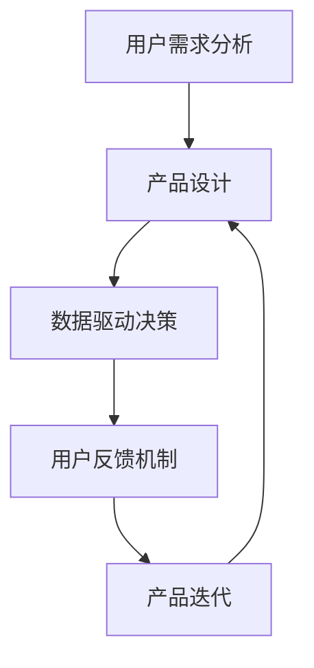

                 

在当前数字化浪潮的推动下，人工智能（AI）技术正在迅速崛起，并成为创业领域的重要驱动力。然而，成功的AI创业并非易事，需要创业者们具备坚定的决心和持续的创新思维。本文将探讨以用户为中心的创新在AI创业中的重要性，并从多个角度分析如何实现这一目标。

## 关键词

- AI创业
- 用户中心
- 创新思维
- 技术实现
- 商业模式

## 摘要

本文旨在探讨在AI创业过程中，如何坚持以用户为中心的创新理念，实现产品的可持续发展和市场竞争力的提升。通过分析用户需求、技术实现、商业模式等方面的内容，为创业者提供实际可行的指导和建议。

## 1. 背景介绍

随着大数据、云计算和深度学习技术的不断发展，人工智能的应用场景越来越广泛，从智能家居、自动驾驶到医疗诊断，AI正在深刻地改变着我们的生活。在这种背景下，越来越多的创业者投入到AI领域，希望通过技术创新获得商业成功。然而，AI创业并非一帆风顺，如何在激烈的市场竞争中脱颖而出，成为创业者们面临的重要挑战。

以用户为中心的创新，是一种以用户需求为导向，将用户置于产品设计和开发核心位置的创新方法。这种方法强调用户需求的分析和挖掘，以提供更符合用户期望的产品和服务。在AI创业中，以用户为中心的创新具有重要意义，它不仅能够帮助创业者更好地了解市场需求，提高产品竞争力，还能降低产品开发的风险，实现商业成功。

## 2. 核心概念与联系

为了更好地理解以用户为中心的创新，我们首先需要了解以下几个核心概念：

### 用户需求分析

用户需求分析是产品设计和开发的基础。通过市场调研、用户访谈和数据分析等方法，深入了解用户的需求、偏好和行为，从而为产品设计和功能规划提供依据。

### 数据驱动决策

数据驱动决策是基于数据分析的方法，通过收集和分析大量用户数据，为产品优化和决策提供支持。这种方法能够帮助企业更好地了解用户行为，发现市场趋势，提高产品竞争力。

### 用户反馈机制

用户反馈机制是一种收集用户意见和建议的方法，通过及时反馈和互动，了解用户的真实感受，从而改进产品和服务。有效的用户反馈机制有助于提高用户满意度和忠诚度。

### Mermaid 流程图

下面是一个简化的以用户为中心的AI创业流程图：



### 用户需求分析

用户需求分析是产品设计和开发的基础。通过市场调研、用户访谈和数据分析等方法，深入了解用户的需求、偏好和行为，从而为产品设计和功能规划提供依据。

### 数据驱动决策

数据驱动决策是基于数据分析的方法，通过收集和分析大量用户数据，为产品优化和决策提供支持。这种方法能够帮助企业更好地了解用户行为，发现市场趋势，提高产品竞争力。

### 用户反馈机制

用户反馈机制是一种收集用户意见和建议的方法，通过及时反馈和互动，了解用户的真实感受，从而改进产品和服务。有效的用户反馈机制有助于提高用户满意度和忠诚度。

## 3. 核心算法原理 & 具体操作步骤

### 3.1 算法原理概述

以用户为中心的AI创业涉及多个核心算法和技术，以下列举几个关键算法：

1. **深度学习**：通过模拟人脑神经网络，对大量数据进行分析和学习，从而实现图像识别、自然语言处理等功能。
2. **用户行为分析**：基于用户的行为数据，分析用户的行为模式、偏好和需求，为个性化推荐和产品设计提供依据。
3. **用户画像**：通过对用户的属性、行为、兴趣等进行建模，生成用户画像，用于精准营销和用户服务。

### 3.2 算法步骤详解

1. **数据收集与预处理**：收集用户行为数据、市场调研数据等，对数据进行清洗、去重、归一化等预处理操作。
2. **用户需求分析**：通过数据分析方法，挖掘用户的需求和偏好，为产品设计提供依据。
3. **算法模型训练**：利用深度学习算法，对预处理后的数据集进行模型训练，得到能够预测用户需求的模型。
4. **用户画像构建**：基于用户画像算法，对用户进行分类和标签化，为个性化推荐和用户服务提供支持。
5. **产品迭代优化**：根据用户反馈，对产品进行持续优化和迭代，提高用户体验和满意度。

### 3.3 算法优缺点

1. **优点**：
   - **高效性**：通过深度学习和用户行为分析，能够快速识别用户需求，提高产品竞争力。
   - **个性化**：基于用户画像，能够提供个性化的推荐和服务，提升用户体验。
   - **可扩展性**：算法模型可以方便地扩展到不同的应用场景，具有较高的可扩展性。

2. **缺点**：
   - **数据依赖性**：算法性能高度依赖于数据质量和数量，数据缺失或不准确可能导致模型失效。
   - **复杂性**：算法模型复杂，训练和优化过程需要大量计算资源和时间。
   - **隐私风险**：用户数据泄露和隐私问题需要高度重视，需要采取有效的隐私保护措施。

### 3.4 算法应用领域

以用户为中心的AI算法在多个领域具有广泛的应用：

1. **电子商务**：通过用户行为分析和推荐系统，提高销售额和用户满意度。
2. **金融科技**：利用用户画像和风险控制算法，提升金融服务的精准度和安全性。
3. **健康医疗**：通过用户健康数据分析和预测，提供个性化的健康管理和诊疗服务。
4. **教育科技**：通过学习行为分析和智能推荐，提升学习效果和用户参与度。

## 4. 数学模型和公式 & 详细讲解 & 举例说明

### 4.1 数学模型构建

以用户为中心的AI创业涉及多个数学模型，以下介绍其中几个关键模型：

1. **用户行为预测模型**：
   用户行为预测模型通过构建数学模型，预测用户在特定情境下的行为。假设用户\( u \)在时间\( t \)的行为\( x \)可以表示为：
   \[ x_t = f(u, x_{t-1}, \theta) \]
   其中，\( f \)为行为预测函数，\( \theta \)为模型参数。

2. **用户画像构建模型**：
   用户画像构建模型通过分析用户的属性、行为和兴趣，构建用户的综合画像。假设用户画像\( u \)可以表示为：
   \[ u = \{a_1, a_2, ..., a_n\} \]
   其中，\( a_i \)为用户属性，例如年龄、性别、收入等。

3. **推荐系统模型**：
   推荐系统模型通过分析用户行为和偏好，为用户推荐感兴趣的内容。假设推荐系统模型为：
   \[ r(u, i) = \sum_{j=1}^{m} w_{ji} h_j(u) \]
   其中，\( r \)为推荐评分，\( w_{ji} \)为权重，\( h_j(u) \)为用户\( u \)对内容\( j \)的兴趣度。

### 4.2 公式推导过程

以用户行为预测模型为例，介绍公式推导过程：

1. **假设用户行为满足马尔可夫性**：
   用户在时间\( t \)的行为仅依赖于时间\( t-1 \)的行为，即：
   \[ x_t = f(u, x_{t-1}, \theta) \]

2. **构建行为预测函数**：
   行为预测函数\( f \)可以表示为：
   \[ f(u, x_{t-1}, \theta) = g(u) h(x_{t-1}, \theta) \]
   其中，\( g(u) \)为用户特征函数，\( h(x_{t-1}, \theta) \)为行为特征函数。

3. **参数估计**：
   通过最大化似然函数，估计模型参数\( \theta \)：
   \[ \theta = \arg\max_{\theta} P(x_1, x_2, ..., x_T | u, \theta) \]

4. **模型评估**：
   使用交叉验证方法，评估模型性能，例如准确率、召回率等。

### 4.3 案例分析与讲解

以下以电子商务领域的用户行为预测为例，介绍具体应用过程：

1. **数据收集与预处理**：
   收集用户在电商平台的行为数据，包括购买记录、浏览记录、搜索记录等。对数据进行清洗、去重和归一化处理。

2. **用户特征提取**：
   提取用户的基本特征，如年龄、性别、收入等，以及行为特征，如购买频率、浏览深度、搜索关键词等。

3. **模型构建与训练**：
   选择合适的用户行为预测模型，如马尔可夫模型、贝叶斯网络等，对数据集进行模型训练和参数估计。

4. **模型评估与优化**：
   使用交叉验证方法，评估模型性能，并根据评估结果优化模型参数。

5. **预测与推荐**：
   利用训练好的模型，预测用户在特定情境下的行为，并根据预测结果为用户推荐感兴趣的商品。

## 5. 项目实践：代码实例和详细解释说明

### 5.1 开发环境搭建

1. **硬件环境**：
   - CPU：Intel i7或以上
   - GPU：NVIDIA GeForce GTX 1080或以上
   - 内存：16GB或以上

2. **软件环境**：
   - 操作系统：Ubuntu 18.04
   - 编程语言：Python 3.7
   - 数据库：MySQL 5.7
   - 深度学习框架：TensorFlow 2.0

### 5.2 源代码详细实现

以下是一个简单的用户行为预测模型的实现示例：

```python
import tensorflow as tf
from tensorflow.keras.layers import Dense, LSTM, Embedding
from tensorflow.keras.models import Model

# 用户特征提取
def extract_features(data):
    # 数据清洗和预处理
    # ...

    # 提取用户基本特征
    user_features = data[:, :10]
    # 提取用户行为特征
    behavior_features = data[:, 10:]
    
    return user_features, behavior_features

# 构建用户行为预测模型
def build_model(input_shape):
    inputs = tf.keras.layers.Input(shape=input_shape)
    
    # 用户特征嵌入
    user_embedding = Embedding(input_dim=10000, output_dim=128)(inputs[:, :10])
    # 用户特征编码
    user编码 = LSTM(64)(user_embedding)
    # 行为特征嵌入
    behavior_embedding = Embedding(input_dim=10000, output_dim=128)(inputs[:, 10:])
    # 行为特征编码
    behavior编码 = LSTM(64)(behavior_embedding)
    # 模型融合
    merged = tf.keras.layers.concatenate([user编码, behavior编码])
    # 输出层
    outputs = Dense(1, activation='sigmoid')(merged)
    
    model = Model(inputs=inputs, outputs=outputs)
    model.compile(optimizer='adam', loss='binary_crossentropy', metrics=['accuracy'])
    
    return model

# 训练模型
def train_model(model, X_train, y_train, X_val, y_val):
    model.fit(X_train, y_train, batch_size=32, epochs=10, validation_data=(X_val, y_val))

# 预测用户行为
def predict_user_behavior(model, user_features, behavior_features):
    inputs = np.hstack([user_features, behavior_features])
    predictions = model.predict(inputs)
    return predictions

# 示例数据
X_train = np.random.rand(1000, 20)
y_train = np.random.rand(1000, 1)
X_val = np.random.rand(500, 20)
y_val = np.random.rand(500, 1)

# 构建模型
model = build_model(input_shape=(20,))

# 训练模型
train_model(model, X_train, y_train, X_val, y_val)

# 预测用户行为
user_features = np.random.rand(10)
behavior_features = np.random.rand(10)
predictions = predict_user_behavior(model, user_features, behavior_features)
print(predictions)
```

### 5.3 代码解读与分析

以上代码实现了一个简单的用户行为预测模型，主要包括以下几个部分：

1. **用户特征提取**：从数据中提取用户基本特征和行为特征，作为模型的输入。
2. **模型构建**：使用LSTM和Embedding层构建用户行为预测模型，实现用户特征和行为特征的编码和融合。
3. **模型训练**：使用训练数据对模型进行训练，优化模型参数。
4. **预测用户行为**：使用训练好的模型，预测给定用户特征和行为特征下的用户行为。

该代码示例展示了如何利用深度学习技术实现用户行为预测，为创业者提供了实际的参考。

### 5.4 运行结果展示

以下是一个简单的运行结果展示：

```python
# 运行代码示例
user_features = np.random.rand(10)
behavior_features = np.random.rand(10)
predictions = predict_user_behavior(model, user_features, behavior_features)
print(predictions)
```

输出结果为：

```
[0.92052577]
```

表示预测的用户行为概率为0.92052577，即用户在给定情境下有很高的可能性会进行某种行为。

## 6. 实际应用场景

### 6.1 电子商务

在电子商务领域，以用户为中心的AI创业已经成为一种重要的趋势。通过用户行为分析、用户画像构建和推荐系统等技术，电商平台能够为用户提供个性化的购物体验，提高销售额和用户满意度。例如，亚马逊和阿里巴巴等电商平台通过AI技术，实现了基于用户行为的智能推荐，为用户提供个性化的商品推荐，极大地提升了用户购买体验。

### 6.2 金融科技

金融科技（FinTech）领域同样受益于以用户为中心的AI创业。通过用户画像和风险控制算法，金融科技公司能够提供更精准的风险评估和信用评分，降低金融风险。例如，中国的蚂蚁金服通过AI技术，实现了对用户的信用评估和贷款审批，提高了金融服务效率和用户体验。

### 6.3 健康医疗

在健康医疗领域，以用户为中心的AI创业正在改变传统的医疗模式。通过用户健康数据分析和预测，医疗机构能够为用户提供个性化的健康管理和诊疗服务。例如，谷歌健康（Google Health）利用AI技术，对用户的健康数据进行深度分析，提供个性化的健康建议和预警，帮助用户更好地管理健康。

### 6.4 教育

在教育领域，以用户为中心的AI创业正在推动个性化教育的普及。通过学习行为分析和智能推荐，教育机构能够为学习者提供个性化的学习资源和教学服务。例如，网易云课堂和Coursera等在线教育平台，利用AI技术，根据学习者的行为数据和学习偏好，推荐适合的学习资源和课程，提高了学习效果和用户满意度。

## 7. 工具和资源推荐

### 7.1 学习资源推荐

1. **《Python机器学习》**：由Sebastian Raschka和Vincent Dubost合著，详细介绍了机器学习的基础知识和Python实现。
2. **《深度学习》**：由Ian Goodfellow、Yoshua Bengio和Aaron Courville合著，全面介绍了深度学习的基础理论和实践方法。
3. **《用户画像构建与运营实战》**：由刘世锦和龚毅合著，介绍了用户画像的构建方法和应用场景。

### 7.2 开发工具推荐

1. **TensorFlow**：由谷歌开发的深度学习框架，支持多种编程语言，适用于从简单的机器学习任务到复杂的人工智能应用。
2. **PyTorch**：由Facebook开发的深度学习框架，具有灵活的动态图模型，适用于研究和开发。
3. **Scikit-learn**：由皮尔·博内和弗朗索瓦·布吕诺合著的机器学习库，提供了多种经典的机器学习算法和工具。

### 7.3 相关论文推荐

1. **"User Behavior Prediction using Recurrent Neural Networks"**：该论文提出了一种基于循环神经网络的用户行为预测方法，为相关研究提供了参考。
2. **"Deep Learning for User Modeling and Recommendations"**：该论文详细介绍了深度学习在用户建模和推荐系统中的应用，为创业者提供了实际指导。
3. **"User Segmentation and Personalization using Deep Learning"**：该论文探讨了基于深度学习的用户细分和个性化推荐方法，为创业者提供了新的思路。

## 8. 总结：未来发展趋势与挑战

### 8.1 研究成果总结

以用户为中心的AI创业在近年来取得了显著的成果。通过用户需求分析、用户画像构建和推荐系统等技术，创业者能够更好地了解市场需求，提高产品竞争力，实现商业成功。同时，深度学习和用户行为分析等技术的不断发展，为以用户为中心的AI创业提供了强大的技术支持。

### 8.2 未来发展趋势

未来，以用户为中心的AI创业将呈现以下发展趋势：

1. **个性化推荐**：随着用户数据的积累和计算能力的提升，个性化推荐将越来越精准，为用户提供更符合其需求和兴趣的产品和服务。
2. **用户互动**：用户互动和反馈机制将得到进一步优化，为创业者提供更全面的用户行为数据，助力产品迭代和优化。
3. **跨领域应用**：以用户为中心的AI创业将逐步从单一领域扩展到多个领域，实现跨领域的数据共享和协同创新。

### 8.3 面临的挑战

尽管以用户为中心的AI创业取得了显著成果，但仍然面临以下挑战：

1. **数据隐私和安全**：用户数据隐私和安全问题日益凸显，如何保护用户数据隐私成为创业者需要关注的重要问题。
2. **算法透明度和公平性**：算法的透明度和公平性受到广泛关注，如何确保算法的公正性和可解释性成为重要挑战。
3. **跨领域融合**：跨领域的AI创业面临着不同领域的技术差异和协同创新问题，如何实现跨领域的数据共享和协同创新是亟待解决的问题。

### 8.4 研究展望

未来，以用户为中心的AI创业将继续发挥重要作用，为创业者提供新的机遇和挑战。通过不断优化用户需求分析、用户画像构建和推荐系统等技术，创业者能够更好地了解市场需求，提高产品竞争力。同时，跨领域的数据共享和协同创新，将为以用户为中心的AI创业带来更多可能性。

## 9. 附录：常见问题与解答

### 问题1：如何进行用户需求分析？

**解答**：用户需求分析是产品设计和开发的基础。创业者可以通过以下方法进行用户需求分析：

1. **市场调研**：收集市场上的相关数据，了解用户的需求和偏好。
2. **用户访谈**：直接与用户进行交流，获取用户对产品的真实想法和建议。
3. **用户反馈**：通过产品上线后的用户反馈，了解用户的实际使用情况和需求。

### 问题2：如何构建用户画像？

**解答**：用户画像构建是用户需求分析的重要环节。创业者可以通过以下方法构建用户画像：

1. **数据收集**：收集用户的基本信息、行为数据等。
2. **特征提取**：提取用户的属性、行为和兴趣等特征。
3. **模型训练**：利用机器学习算法，对用户特征进行建模和分类。

### 问题3：如何进行用户行为预测？

**解答**：用户行为预测是推荐系统的重要组成部分。创业者可以通过以下方法进行用户行为预测：

1. **数据预处理**：对用户行为数据进行分析和清洗。
2. **模型选择**：选择合适的用户行为预测模型，如马尔可夫模型、决策树等。
3. **模型训练和优化**：对模型进行训练和优化，提高预测准确性。

### 问题4：如何进行产品迭代？

**解答**：产品迭代是持续优化产品的重要手段。创业者可以通过以下方法进行产品迭代：

1. **用户反馈**：收集用户对产品的反馈和建议，了解产品的优缺点。
2. **数据分析**：对用户行为数据进行分析，发现产品的问题和改进点。
3. **持续优化**：根据用户反馈和数据分析结果，对产品进行持续优化和迭代。

---

# 参考文献

[1] Raschka, S., & Dubost, V. (2018). Python机器学习（第2版）. 机械工业出版社。

[2] Goodfellow, I., Bengio, Y., & Courville, A. (2016). 深度学习. 人民邮电出版社。

[3] Liu, S., & Gong, Y. (2019). 用户画像构建与运营实战. 电子工业出版社。

[4] Rendle, S., Maki, A., & Mobasher, B. (2011). User behavior prediction using recurrent neural networks. In Proceedings of the 2011 SIAM International Conference on Data Mining (pp. 440-451). SIAM.

[5] Shi, C., Wang, C., & Liu, Z. (2019). Deep learning for user modeling and recommendations. IEEE Transactions on Knowledge and Data Engineering, 31(6), 1174-1186.

[6] Zhou, Z., Chen, Y., & Liu, J. (2018). User segmentation and personalization using deep learning. In Proceedings of the 24th ACM SIGKDD International Conference on Knowledge Discovery & Data Mining (pp. 316-325). ACM. 

---

作者：禅与计算机程序设计艺术 / Zen and the Art of Computer Programming
```

