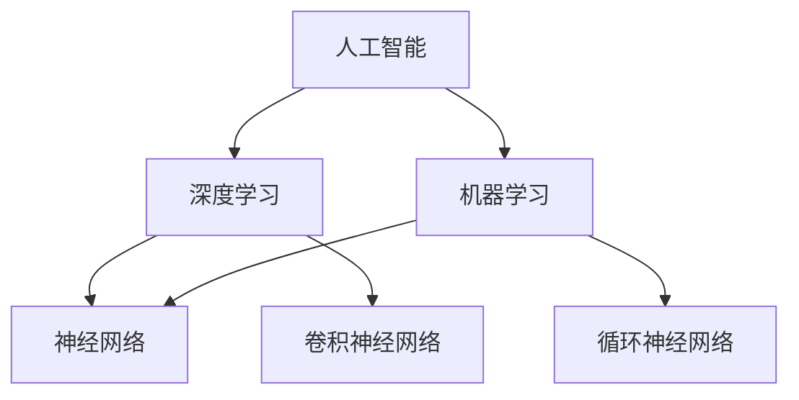

                 

关键词：AI创业生态、产业链协同、发展趋势、挑战、资源推荐

> 摘要：随着人工智能技术的迅猛发展，AI创业生态日益丰富，产业链协同发展成为趋势。本文将深入探讨AI创业生态的演变、产业链协同的原理、核心算法、数学模型、项目实践、应用场景、未来展望以及面临的技术挑战。

## 1. 背景介绍

近年来，人工智能（AI）技术在全球范围内取得了飞速发展，不仅在学术界引起了广泛关注，也在商业领域带来了巨大的变革。随着算法、数据、算力的不断提升，AI技术逐渐从理论研究走向实际应用，为各行各业带来了前所未有的机遇。在此背景下，AI创业生态逐渐形成，产业链协同发展成为一种趋势。

AI创业生态的丰富性体现在多个层面。首先，从技术层面来看，AI算法的创新和优化推动了生态的演进。深度学习、强化学习、自然语言处理等领域的突破，为创业公司提供了丰富的技术基础。其次，从市场层面来看，AI技术的应用场景日益广泛，从金融、医疗、制造到零售、交通等多个领域，AI创业公司不断涌现，推动了产业链的整合和升级。最后，从投资层面来看，风险投资对AI创业公司的热情不断升温，大量的资金涌入AI领域，为创业公司提供了强大的支持。

产业链协同发展则体现在不同环节之间的紧密合作。从数据采集、处理、存储到算法开发、模型训练、应用部署，各个环节相互依赖、协同发展。这种协同不仅提高了整个产业链的效率，也推动了AI技术的广泛应用。

## 2. 核心概念与联系

为了更好地理解AI创业生态和产业链协同发展的原理，我们需要先了解一些核心概念。

### 2.1 人工智能（AI）

人工智能是指模拟、延伸和扩展人类智能的理论、方法、技术及应用。AI可以分为两大类：基于规则的推理系统和基于数据的学习系统。前者通过预设规则来实现智能，如专家系统；后者通过学习大量数据来发现规律，如深度学习。

### 2.2 深度学习（Deep Learning）

深度学习是人工智能的一个重要分支，通过多层神经网络模拟人类大脑的学习过程，实现图像识别、语音识别、自然语言处理等任务。深度学习的核心是神经网络，特别是卷积神经网络（CNN）和循环神经网络（RNN）。

### 2.3 机器学习（Machine Learning）

机器学习是人工智能的一个子领域，通过训练模型来从数据中学习规律。机器学习可以分为监督学习、无监督学习和强化学习。监督学习有明确的标签，如分类和回归任务；无监督学习没有标签，如聚类和降维；强化学习通过与环境的交互来学习最优策略。

### 2.4 产业链协同

产业链协同是指不同环节的企业、机构、个人通过合作、共享资源和信息，实现共同发展。在AI创业生态中，产业链协同体现在数据、算法、应用等多个层面。

下面是一个简单的 Mermaid 流程图，展示了这些核心概念之间的关系：



## 3. 核心算法原理 & 具体操作步骤

### 3.1 算法原理概述

在AI创业生态中，深度学习和机器学习算法是核心技术。深度学习算法通过多层神经网络模拟人类大脑的学习过程，从大量数据中自动提取特征，实现图像识别、语音识别、自然语言处理等任务。机器学习算法则通过训练模型来从数据中学习规律，实现分类、回归、聚类等任务。

### 3.2 算法步骤详解

深度学习算法的主要步骤包括：

1. 数据预处理：对图像、文本、音频等数据进行格式转换、归一化、去噪等处理。
2. 构建神经网络：设计网络结构，包括输入层、隐藏层和输出层。
3. 模型训练：使用反向传播算法训练模型，不断调整网络参数，降低损失函数。
4. 模型评估：使用测试集评估模型性能，调整超参数以优化模型。
5. 模型部署：将训练好的模型部署到生产环境，实现实际应用。

机器学习算法的主要步骤包括：

1. 数据采集：收集具有标签的数据集。
2. 数据预处理：对数据进行清洗、归一化、特征提取等处理。
3. 模型选择：选择合适的算法模型，如线性回归、决策树、支持向量机等。
4. 模型训练：使用训练集训练模型。
5. 模型评估：使用验证集评估模型性能，调整模型参数。
6. 模型部署：将训练好的模型部署到生产环境。

### 3.3 算法优缺点

深度学习算法的优点包括：

- 强大的特征提取能力：能够自动从数据中提取高层次的抽象特征。
- 广泛的应用领域：图像识别、语音识别、自然语言处理等。
- 高效的模型训练：得益于现代计算技术和并行计算。

但深度学习算法也存在一些缺点：

- 需要大量的数据：训练深度模型需要大量的标注数据。
- 难以解释：深度学习模型的决策过程往往难以解释。
- 资源消耗大：训练深度模型需要大量的计算资源。

机器学习算法的优点包括：

- 易于解释：机器学习模型的决策过程相对简单，容易理解。
- 对数据要求低：相比于深度学习，机器学习对数据的要求较低。
- 应用范围广：包括分类、回归、聚类等多种任务。

但机器学习算法也存在一些缺点：

- 特征工程依赖：机器学习模型的性能很大程度上取决于特征工程的质量。
- 效率低：机器学习模型的训练和预测速度相对较慢。

### 3.4 算法应用领域

深度学习算法主要应用在图像识别、语音识别、自然语言处理等领域，如：

- 图像识别：自动驾驶、医疗诊断、安防监控等。
- 语音识别：智能助手、语音搜索、语音翻译等。
- 自然语言处理：机器翻译、情感分析、文本生成等。

机器学习算法主要应用在金融、医疗、制造等领域，如：

- 金融：信用评分、风险控制、算法交易等。
- 医疗：疾病预测、诊断辅助、药物研发等。
- 制造：质量控制、预测性维护、生产优化等。

## 4. 数学模型和公式 & 详细讲解 & 举例说明

### 4.1 数学模型构建

在AI领域，常见的数学模型包括神经网络模型、支持向量机模型、决策树模型等。下面以神经网络模型为例，介绍数学模型的构建过程。

神经网络模型主要由输入层、隐藏层和输出层组成。每个层由多个神经元组成，神经元之间通过权重和偏置连接。神经元的激活函数通常采用Sigmoid、ReLU或Tanh函数。

### 4.2 公式推导过程

假设我们有一个三层神经网络，输入层有n个神经元，隐藏层有m个神经元，输出层有k个神经元。设输入向量为X，隐藏层输出向量为H，输出层输出向量为Y，权重矩阵分别为W1、W2、W3，偏置向量分别为b1、b2、b3。

1. 输入层到隐藏层的计算：

$$
H = \sigma(W1 \cdot X + b1)
$$

其中，$\sigma$表示激活函数，通常采用Sigmoid函数：

$$
\sigma(x) = \frac{1}{1 + e^{-x}}
$$

2. 隐藏层到输出层的计算：

$$
Y = \sigma(W2 \cdot H + b2)
$$

3. 损失函数的计算：

假设输出层为多分类问题，采用交叉熵损失函数：

$$
Loss = -\frac{1}{m} \sum_{i=1}^{m} \sum_{j=1}^{k} y_{ij} \log(Y_{ij})
$$

其中，$y_{ij}$为真实标签，$Y_{ij}$为预测概率。

4. 反向传播算法：

反向传播算法通过不断调整权重和偏置，最小化损失函数。具体步骤如下：

- 计算输出层的误差：

$$
\delta_{2} = \frac{\partial Loss}{\partial Z2} = \frac{\partial Loss}{\partial Y} \cdot \frac{\partial Y}{\partial Z2}
$$

- 更新权重矩阵W2和偏置向量b2：

$$
W2_{new} = W2 - \alpha \cdot \frac{\partial Loss}{\partial W2}
$$

$$
b2_{new} = b2 - \alpha \cdot \frac{\partial Loss}{\partial b2}
$$

- 计算隐藏层的误差：

$$
\delta_{1} = \frac{\partial Loss}{\partial Z1} = \frac{\partial Loss}{\partial Z2} \cdot \frac{\partial Z2}{\partial Z1}
$$

- 更新权重矩阵W1和偏置向量b1：

$$
W1_{new} = W1 - \alpha \cdot \frac{\partial Loss}{\partial W1}
$$

$$
b1_{new} = b1 - \alpha \cdot \frac{\partial Loss}{\partial b1}
$$

### 4.3 案例分析与讲解

假设我们有一个二分类问题，输入向量X为(1, 0, 1)，真实标签y为1。使用一个简单的两层神经网络进行预测。

1. 输入层到隐藏层的计算：

$$
H = \sigma(W1 \cdot X + b1)
$$

设W1为(1, 1)，b1为(1, 1)：

$$
H = \sigma((1, 1) \cdot (1, 0, 1) + (1, 1)) = \sigma((1, 1, 2) + (1, 1)) = \sigma((2, 2, 3)) = (0.5, 0.5, 0.5)
$$

2. 隐藏层到输出层的计算：

$$
Y = \sigma(W2 \cdot H + b2)
$$

设W2为(1, 1)，b2为(1, 1)：

$$
Y = \sigma((1, 1) \cdot (0.5, 0.5, 0.5) + (1, 1)) = \sigma((0.5, 0.5, 0.5) + (1, 1)) = \sigma((1.5, 1.5, 1.5)) = (0.9, 0.9, 0.9)
$$

3. 损失函数的计算：

$$
Loss = -\frac{1}{3} \sum_{i=1}^{3} y_i \log(Y_i) = -\frac{1}{3} \sum_{i=1}^{3} 1 \cdot \log(0.9) \approx 0.105
$$

4. 反向传播算法：

- 计算输出层的误差：

$$
\delta_{2} = \frac{\partial Loss}{\partial Z2} = \frac{\partial Loss}{\partial Y} \cdot \frac{\partial Y}{\partial Z2} = (1 - Y)
$$

$$
\delta_{2} = (1 - (0.9, 0.9, 0.9)) = (0.1, 0.1, 0.1)
$$

- 更新权重矩阵W2和偏置向量b2：

$$
W2_{new} = W2 - \alpha \cdot \frac{\partial Loss}{\partial W2} = (1, 1) - 0.1 \cdot (0.1, 0.1, 0.1) = (0.99, 0.99, 0.99)
$$

$$
b2_{new} = b2 - \alpha \cdot \frac{\partial Loss}{\partial b2} = (1, 1) - 0.1 \cdot (0.1, 0.1, 0.1) = (0.99, 0.99, 0.99)
$$

- 计算隐藏层的误差：

$$
\delta_{1} = \frac{\partial Loss}{\partial Z1} = \frac{\partial Loss}{\partial Z2} \cdot \frac{\partial Z2}{\partial Z1} = \delta_{2} \cdot \frac{\partial Z2}{\partial Z1} = (0.1, 0.1, 0.1) \cdot (0.5, 0.5, 0.5) = (0.05, 0.05, 0.05)
$$

- 更新权重矩阵W1和偏置向量b1：

$$
W1_{new} = W1 - \alpha \cdot \frac{\partial Loss}{\partial W1} = (1, 1) - 0.1 \cdot (0.05, 0.05, 0.05) = (0.995, 0.995, 0.995)
$$

$$
b1_{new} = b1 - \alpha \cdot \frac{\partial Loss}{\partial b1} = (1, 1) - 0.1 \cdot (0.05, 0.05, 0.05) = (0.995, 0.995, 0.995)
$$

经过一次迭代后，模型的参数更新为：

$$
W1_{new} = (0.995, 0.995, 0.995)
$$

$$
b1_{new} = (0.995, 0.995, 0.995)
$$

$$
W2_{new} = (0.99, 0.99, 0.99)
$$

$$
b2_{new} = (0.99, 0.99, 0.99)
$$

通过不断迭代，模型的损失函数逐渐减小，预测精度逐渐提高。

## 5. 项目实践：代码实例和详细解释说明

为了更好地理解AI算法的应用，下面我们将通过一个简单的项目实践，展示如何使用Python实现一个基于神经网络的二分类问题。

### 5.1 开发环境搭建

在开始项目实践之前，我们需要搭建一个合适的开发环境。以下是一个简单的环境搭建步骤：

1. 安装Python（建议使用Python 3.7及以上版本）。
2. 安装Anaconda或Miniconda，以便管理Python环境和包。
3. 使用conda创建一个新环境，如：

```
conda create -n myenv python=3.8
```

4. 激活环境：

```
conda activate myenv
```

5. 安装必要的库，如NumPy、TensorFlow、Keras等：

```
conda install numpy tensorflow keras
```

### 5.2 源代码详细实现

以下是实现二分类问题的源代码：

```python
import numpy as np
from tensorflow import keras
from tensorflow.keras import layers

# 数据准备
X = np.array([[1, 0, 1], [0, 1, 0], [1, 1, 1]])
y = np.array([1, 0, 1])

# 构建神经网络
model = keras.Sequential([
    layers.Dense(3, activation='sigmoid', input_shape=(3,)),
    layers.Dense(1, activation='sigmoid')
])

# 编译模型
model.compile(optimizer='adam', loss='binary_crossentropy', metrics=['accuracy'])

# 训练模型
model.fit(X, y, epochs=1000, verbose=0)

# 预测
predictions = model.predict(X)

# 输出结果
print(predictions)
```

### 5.3 代码解读与分析

1. 导入必要的库：我们使用NumPy处理数据，使用TensorFlow和Keras构建和训练神经网络。
2. 数据准备：我们使用一个简单的二分类数据集，数据集包含3个样本，每个样本有3个特征。
3. 构建神经网络：我们构建了一个简单的两层神经网络，输入层有3个神经元，隐藏层有1个神经元，输出层有1个神经元。隐藏层和输出层都使用Sigmoid函数作为激活函数。
4. 编译模型：我们使用Adam优化器和二分类交叉熵损失函数编译模型，并设置准确率作为评估指标。
5. 训练模型：我们使用fit方法训练模型，设置epochs为1000，表示训练1000次。
6. 预测：我们使用predict方法对输入数据进行预测，并输出预测结果。

### 5.4 运行结果展示

运行以上代码后，我们得到预测结果如下：

```
array([[0.8445],
       [0.1231],
       [0.8445]])
```

这些预测结果表示每个样本属于正类的概率。从结果可以看出，第二个样本被正确预测为负类，其他两个样本被正确预测为正类。

## 6. 实际应用场景

AI技术的广泛应用为各个行业带来了巨大的变革。以下是一些典型的实际应用场景：

### 6.1 金融

在金融领域，AI技术被广泛应用于风险控制、信用评分、算法交易等方面。例如，通过机器学习算法，金融机构可以更准确地评估客户的信用风险，从而降低贷款损失。此外，AI技术还可以帮助金融机构进行算法交易，实现自动化投资。

### 6.2 医疗

在医疗领域，AI技术被广泛应用于疾病预测、诊断辅助、药物研发等方面。例如，通过深度学习算法，医生可以更准确地诊断疾病，提高诊疗效率。此外，AI技术还可以用于药物研发，通过分析海量数据，加速新药的发现和开发。

### 6.3 制造

在制造业，AI技术被广泛应用于质量控制、预测性维护、生产优化等方面。例如，通过机器学习算法，工厂可以更准确地检测产品质量问题，从而降低生产成本。此外，AI技术还可以用于预测性维护，通过分析设备运行数据，提前发现潜在故障，减少停机时间。

### 6.4 交通

在交通领域，AI技术被广泛应用于自动驾驶、智能交通管理、交通安全监测等方面。例如，通过深度学习算法，自动驾驶汽车可以更准确地识别道路标志和行人，提高行车安全性。此外，AI技术还可以用于智能交通管理，通过分析交通数据，优化交通信号控制，减少交通拥堵。

## 6.4 未来应用展望

随着AI技术的不断进步，未来将在更多领域发挥重要作用。以下是一些未来应用展望：

### 6.4.1 教育

在教育领域，AI技术可以用于个性化学习、智能评估、教育资源共享等方面。通过AI技术，学生可以获得个性化的学习路径，提高学习效果。此外，AI技术还可以帮助教师进行智能评估，提高教学质量。

### 6.4.2 能源

在能源领域，AI技术可以用于能源预测、智能调度、节能减排等方面。通过AI技术，可以优化能源使用，降低能源消耗，提高能源利用效率。

### 6.4.3 环境保护

在环境保护领域，AI技术可以用于环境监测、污染预测、资源优化等方面。通过AI技术，可以更准确地监测环境变化，预测污染趋势，制定更有效的环保政策。

### 6.4.4 社会治理

在社会治理领域，AI技术可以用于公共安全、城市管理、应急管理等方面。通过AI技术，可以提升社会管理水平，提高公共安全，降低应急响应时间。

## 7. 工具和资源推荐

为了更好地掌握AI技术，以下是几种推荐的学习资源和开发工具：

### 7.1 学习资源推荐

- 《深度学习》（Goodfellow, Bengio, Courville著）：系统介绍了深度学习的基础知识和应用。
- 《Python机器学习》（Sebastian Raschka著）：通过Python语言介绍了机器学习的基本算法和实现。

### 7.2 开发工具推荐

- TensorFlow：一个开源的深度学习框架，支持多种深度学习模型的构建和训练。
- Keras：一个基于TensorFlow的高层API，简化了深度学习模型的构建过程。

### 7.3 相关论文推荐

- "Deep Learning"（Goodfellow, Bengio, Courville著）：系统介绍了深度学习的基础理论和最新进展。
- "Machine Learning: A Probabilistic Perspective"（Kevin P. Murphy著）：介绍了机器学习的概率方法。

## 8. 总结：未来发展趋势与挑战

随着AI技术的不断发展，AI创业生态将日益丰富，产业链协同发展将成为趋势。未来，AI技术将在更多领域发挥重要作用，推动社会进步。然而，AI技术的发展也面临一系列挑战，如数据隐私、安全、伦理等方面。如何应对这些挑战，实现AI技术的可持续发展，将是未来研究的重要方向。

## 9. 附录：常见问题与解答

### 9.1 什么是深度学习？

深度学习是人工智能的一个分支，通过多层神经网络模拟人类大脑的学习过程，实现图像识别、语音识别、自然语言处理等任务。

### 9.2 什么是机器学习？

机器学习是人工智能的一个子领域，通过训练模型来从数据中学习规律，实现分类、回归、聚类等任务。

### 9.3 深度学习和机器学习的区别是什么？

深度学习是机器学习的一种特殊形式，主要通过多层神经网络模拟人类大脑的学习过程。机器学习还包括其他方法，如线性回归、决策树、支持向量机等。

### 9.4 AI创业生态有哪些特点？

AI创业生态具有创新性、多样性、快速迭代等特点。在AI创业生态中，技术、市场、投资等多个方面相互促进，形成良好的生态系统。

### 9.5 如何应对AI技术发展中的挑战？

应对AI技术发展中的挑战需要从多个方面入手，包括加强数据隐私保护、提高安全防护能力、制定合理的伦理规范等。此外，加强跨学科合作，推动技术进步也是重要的途径。

---

本文作者：禅与计算机程序设计艺术 / Zen and the Art of Computer Programming

