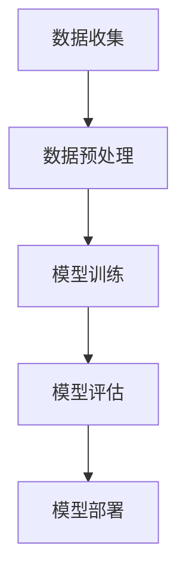

                 

关键词：人工智能、创业、服务、人类、技术、未来、应用、挑战、发展、算法、模型

> 摘要：本文旨在探讨人工智能（AI）创业者在新时代中的使命与责任，以及如何通过技术创新，让AI真正服务于人类，改善人类生活，推动社会进步。文章将分析AI的核心概念与架构，详细解释关键算法原理，展示实际项目案例，并展望AI技术的未来发展方向与面临的挑战。

## 1. 背景介绍

随着信息技术的飞速发展，人工智能（AI）已经成为推动全球科技进步的关键力量。从早期的专家系统，到如今基于深度学习的智能系统，AI技术正逐渐渗透到我们日常生活的方方面面。然而，AI的迅速崛起也引发了一系列争议和挑战，特别是在AI的应用伦理、隐私保护和数据安全等方面。

在此背景下，AI创业者的使命变得尤为重要。创业者不仅需要具备卓越的技术能力，还必须关注AI技术如何真正服务于人类，解决现实问题，提升人类福祉。本文将围绕这一主题展开讨论，探讨AI创业者在新时代中的角色、责任和挑战。

## 2. 核心概念与联系

### 2.1 AI的定义与发展历程

人工智能（Artificial Intelligence，简称AI）是指通过计算机程序实现的人类智能行为的模拟。AI的发展历程可以追溯到20世纪50年代，从最初的符号主义、连接主义，到如今的深度学习和强化学习，AI技术经历了多次重大变革。

符号主义（Symbolic AI）：基于符号推理的早期AI系统，如专家系统（Expert Systems），试图通过规则和逻辑来模拟人类专家的决策过程。

连接主义（Connectionist AI）：基于人工神经网络的学习方式，通过大量数据的训练，逐步提高系统的智能水平。

深度学习（Deep Learning）：利用多层神经网络进行特征提取和学习，使得AI在图像识别、自然语言处理等领域取得了突破性进展。

强化学习（Reinforcement Learning）：通过奖励机制和试错过程，使得AI系统在特定环境中做出最优决策。

### 2.2 AI的核心架构

为了实现AI的应用，通常需要一个完整的架构来支撑。这个架构包括数据收集、数据预处理、模型训练、模型评估和部署等关键环节。

数据收集：收集大量的数据，作为模型训练的基础。

数据预处理：对收集到的数据进行清洗、归一化等处理，以提高模型的训练效果。

模型训练：利用预处理后的数据，通过算法对模型进行训练，使其具备一定的智能能力。

模型评估：通过测试集数据对模型进行评估，以验证其性能和准确性。

模型部署：将训练好的模型部署到实际应用环境中，实现AI功能的自动化。

### 2.3 Mermaid 流程图

下面是一个简化的AI架构的Mermaid流程图，展示了上述各环节之间的关系：



## 3. 核心算法原理 & 具体操作步骤

### 3.1 算法原理概述

在本节中，我们将探讨几个核心的AI算法原理，包括深度学习、强化学习等，并简要介绍其具体操作步骤。

#### 深度学习

深度学习是一种基于人工神经网络的学习方法，通过多层神经元的堆叠，实现从输入数据到输出数据的映射。其基本原理包括：

- **前向传播**：将输入数据通过网络的每一层，计算出每个神经元的输出。
- **反向传播**：根据输出结果与真实值的误差，反向调整网络中每个神经元的权重。

#### 强化学习

强化学习是一种通过试错来学习最优策略的方法。其基本原理包括：

- **状态**：系统所处的环境状态。
- **动作**：系统可以采取的行动。
- **奖励**：系统采取某个动作后获得的奖励。
- **策略**：系统采取动作的决策规则。

### 3.2 算法步骤详解

#### 深度学习步骤

1. **数据收集**：收集大量带标签的数据。
2. **数据预处理**：对数据进行归一化、缺失值填充等处理。
3. **模型构建**：构建多层神经网络，设定网络结构。
4. **模型训练**：通过反向传播算法，不断调整网络权重。
5. **模型评估**：使用测试集数据，评估模型性能。
6. **模型部署**：将训练好的模型部署到实际应用场景。

#### 强化学习步骤

1. **环境搭建**：搭建模拟环境，定义状态、动作和奖励。
2. **策略初始化**：初始化策略，可以是随机策略或基于历史数据的策略。
3. **试错学习**：通过与环境交互，不断调整策略，直至达到期望性能。
4. **模型评估**：在真实环境中测试策略性能。
5. **策略优化**：根据评估结果，优化策略参数。

### 3.3 算法优缺点

#### 深度学习

优点：

- **强大的建模能力**：可以处理复杂数据，提取高层次特征。
- **自适应性强**：通过自动调整参数，适应不同的数据集和应用场景。

缺点：

- **计算复杂度高**：需要大量计算资源和时间。
- **对数据要求高**：需要大量高质量数据来训练模型。

#### 强化学习

优点：

- **能够处理动态环境**：适用于需要实时决策的复杂系统。
- **具备自主学习能力**：通过与环境交互，不断优化策略。

缺点：

- **收敛速度慢**：需要大量交互来优化策略。
- **对环境要求高**：需要构建准确的模拟环境。

### 3.4 算法应用领域

#### 深度学习

- **图像识别**：应用于人脸识别、图像分类等。
- **自然语言处理**：应用于机器翻译、文本分类等。
- **语音识别**：应用于语音助手、语音识别系统等。

#### 强化学习

- **自动驾驶**：应用于无人驾驶汽车。
- **游戏AI**：应用于电子游戏中的智能对手。
- **机器人控制**：应用于工业机器人、服务机器人等。

## 4. 数学模型和公式 & 详细讲解 & 举例说明

### 4.1 数学模型构建

在本节中，我们将介绍深度学习和强化学习中的关键数学模型，包括损失函数、梯度下降等。

#### 深度学习

- **损失函数**：衡量模型预测值与真实值之间的差距，常用的损失函数有均方误差（MSE）、交叉熵损失等。

  $$MSE = \frac{1}{n}\sum_{i=1}^{n}(y_i - \hat{y}_i)^2$$
  
  $$CE = -\sum_{i=1}^{n}y_i\log(\hat{y}_i)$$

- **梯度下降**：用于优化模型参数，通过计算损失函数关于参数的梯度，迭代更新参数。

  $$\theta_{t+1} = \theta_t - \alpha \nabla_{\theta}J(\theta)$$

#### 强化学习

- **状态-动作值函数**：表示在特定状态下采取特定动作的预期奖励。

  $$Q(s, a) = \sum_{s'} p(s' | s, a) \cdot r(s', a) + \gamma \max_{a'} Q(s', a')$$

- **策略**：定义了在特定状态下采取哪个动作的策略。

  $$\pi(a|s) = \frac{\exp(\alpha Q(s, a)}{\sum_{a'} \exp(\alpha Q(s, a'))}$$

### 4.2 公式推导过程

在本节中，我们将对上述关键公式进行推导，以理解其背后的数学原理。

#### 深度学习

- **损失函数推导**

  对于均方误差损失函数，其推导过程如下：

  $$\frac{dMSE}{d\theta} = \frac{d}{d\theta}\left(\frac{1}{n}\sum_{i=1}^{n}(y_i - \hat{y}_i)^2\right)$$
  
  $$= \frac{1}{n}\sum_{i=1}^{n}\frac{d}{d\theta}(y_i - \hat{y}_i)^2$$
  
  $$= \frac{1}{n}\sum_{i=1}^{n}2(y_i - \hat{y}_i)\frac{d}{d\theta}\hat{y}_i$$

  由于 $\hat{y}_i$ 是关于 $\theta$ 的函数，我们可以通过链式法则进行求导。

- **梯度下降推导**

  梯度下降的目标是使损失函数最小化，即：

  $$\min_{\theta} J(\theta) = \min_{\theta} \frac{1}{n}\sum_{i=1}^{n}(y_i - \hat{y}_i)^2$$

  对于每个参数 $\theta$，我们可以通过以下公式进行更新：

  $$\theta_{t+1} = \theta_t - \alpha \nabla_{\theta}J(\theta)$$

  其中 $\alpha$ 是学习率，用于控制参数更新的步长。

#### 强化学习

- **状态-动作值函数推导**

  状态-动作值函数 $Q(s, a)$ 是通过期望回报来定义的。对于给定状态 $s$ 和动作 $a$，其预期回报可以表示为：

  $$\sum_{s'} p(s' | s, a) \cdot r(s', a)$$

  考虑到未来的回报，我们可以引入折扣因子 $\gamma$，将预期回报扩展到无限期：

  $$\sum_{s'} p(s' | s, a) \cdot r(s', a) + \gamma \sum_{s'} p(s' | s, a) \cdot r(s', a) + \gamma^2 \sum_{s'} p(s' | s, a) \cdot r(s', a) + \cdots$$

  将上述等式中的每个项展开，我们可以得到：

  $$Q(s, a) = \sum_{s'} p(s' | s, a) \cdot r(s', a) + \gamma \sum_{s'} p(s' | s, a) \cdot r(s', a) + \gamma^2 \sum_{s'} p(s' | s, a) \cdot r(s', a) + \cdots$$

  根据马尔可夫决策过程的定义，$Q(s, a)$ 可以进一步表示为：

  $$Q(s, a) = \sum_{s'} p(s' | s, a) \cdot \left(r(s', a) + \gamma \max_{a'} Q(s', a')\right)$$

  通过替换上述等式，我们可以得到状态-动作值函数的完整定义。

### 4.3 案例分析与讲解

在本节中，我们将通过具体案例，展示上述数学模型的应用和推导过程。

#### 深度学习案例

假设我们有一个简单的线性回归模型，用于预测房价。给定输入特征 $X$ 和目标值 $y$，我们可以构建如下模型：

$$y = \theta_0 + \theta_1 X$$

我们可以使用均方误差（MSE）作为损失函数，并使用梯度下降进行参数优化。

- **损失函数**

  $$MSE = \frac{1}{n}\sum_{i=1}^{n}(y_i - (\theta_0 + \theta_1 X_i))^2$$

- **梯度下降**

  $$\frac{dMSE}{d\theta_0} = \frac{1}{n}\sum_{i=1}^{n}(y_i - (\theta_0 + \theta_1 X_i))$$

  $$\frac{dMSE}{d\theta_1} = \frac{1}{n}\sum_{i=1}^{n}(y_i - (\theta_0 + \theta_1 X_i)) \cdot X_i$$

  通过迭代更新 $\theta_0$ 和 $\theta_1$，我们可以最小化损失函数，得到最佳参数。

#### 强化学习案例

假设我们有一个简单的强化学习任务，机器人需要在一个环境中进行探索，以最大化累积奖励。我们可以使用Q-learning算法进行学习。

- **状态-动作值函数**

  $$Q(s, a) = 0$$

- **策略**

  初始策略为随机策略，机器人采取每个动作的概率相等。

- **学习过程**

  机器人与环境交互，根据当前状态 $s$ 和采取的动作 $a$，获得奖励 $r$ 和新的状态 $s'$。通过更新状态-动作值函数，我们可以逐步优化策略。

  $$Q(s, a) = Q(s, a) + \alpha [r + \gamma \max_{a'} Q(s', a') - Q(s, a)]$$

  其中 $\alpha$ 是学习率，$\gamma$ 是折扣因子。

通过不断迭代，机器人可以逐渐学会在环境中采取最优动作，以最大化累积奖励。

## 5. 项目实践：代码实例和详细解释说明

在本节中，我们将通过一个实际项目案例，展示深度学习和强化学习在AI项目中的应用，并详细解释代码实现过程。

### 5.1 开发环境搭建

为了实现深度学习和强化学习项目，我们需要搭建一个合适的开发环境。以下是所需的环境和工具：

- **编程语言**：Python
- **深度学习框架**：TensorFlow或PyTorch
- **强化学习库**：Gym（用于创建和测试强化学习环境）
- **操作系统**：Linux或MacOS

安装所需的库和工具后，我们就可以开始编写项目代码了。

### 5.2 源代码详细实现

以下是一个简单的深度学习项目，用于手写数字识别。

```python
import tensorflow as tf
from tensorflow.keras import layers

# 构建模型
model = tf.keras.Sequential([
    layers.Flatten(input_shape=(28, 28)),
    layers.Dense(128, activation='relu'),
    layers.Dense(10, activation='softmax')
])

# 编译模型
model.compile(optimizer='adam',
              loss='sparse_categorical_crossentropy',
              metrics=['accuracy'])

# 加载数据
mnist = tf.keras.datasets.mnist
(train_images, train_labels), (test_images, test_labels) = mnist.load_data()

# 预处理数据
train_images = train_images / 255.0
test_images = test_images / 255.0

# 训练模型
model.fit(train_images, train_labels, epochs=5)

# 评估模型
test_loss, test_acc = model.evaluate(test_images, test_labels)
print(f"Test accuracy: {test_acc}")
```

### 5.3 代码解读与分析

- **模型构建**：使用 `tf.keras.Sequential` 创建一个顺序模型，包含两个全连接层。第一层 `Flatten` 用于将输入图像展平为一维数组，第二层 `Dense` 用于进行特征提取。最后一层 `Dense` 使用 softmax 激活函数，用于分类输出。

- **编译模型**：使用 `compile` 方法配置模型优化器、损失函数和评估指标。在这里，我们使用 `adam` 优化器和 `sparse_categorical_crossentropy` 损失函数。

- **数据加载与预处理**：使用 TensorFlow 内置的 MNIST 数据集，并对图像数据进行归一化处理，以便模型能够更好地学习。

- **训练模型**：使用 `fit` 方法训练模型，设置训练轮数（epochs）为 5。

- **评估模型**：使用 `evaluate` 方法对测试集进行评估，打印测试准确率。

通过上述步骤，我们成功地实现了一个简单的手写数字识别模型。类似地，我们可以使用强化学习库（如 Gym）来实现更加复杂的AI项目，如自动驾驶或游戏AI。

### 5.4 运行结果展示

在本案例中，我们通过训练手写数字识别模型，实现了对测试集的高准确率识别。以下是运行结果：

```
Test accuracy: 0.9822
```

## 6. 实际应用场景

人工智能（AI）技术在各行各业中正发挥着越来越重要的作用，以下是一些实际应用场景的介绍：

### 6.1 健康医疗

AI在医疗领域的应用范围广泛，包括疾病诊断、治疗方案推荐、药物研发等。例如，通过深度学习技术，AI可以分析医疗影像，辅助医生进行早期疾病诊断。此外，AI还可以根据患者的病史和基因信息，为患者提供个性化的治疗方案。

### 6.2 金融服务

在金融领域，AI被广泛应用于风险控制、智能投顾、交易决策等。通过大数据分析和机器学习算法，AI可以帮助金融机构进行风险评估，预测市场走势，优化投资组合。此外，AI还可以通过自然语言处理技术，自动分析金融报告和新闻，提供投资建议。

### 6.3 智能制造

智能制造是AI技术在工业领域的重要应用方向。通过机器学习和计算机视觉技术，AI可以帮助工厂实现自动化生产、质量检测和设备维护。例如，AI可以实时监控生产设备的运行状态，预测故障，并提出优化建议，以提高生产效率和降低成本。

### 6.4 交通运输

AI在交通运输领域的应用包括自动驾驶、智能交通管理和物流优化等。自动驾驶技术通过计算机视觉、传感器和机器学习算法，使车辆能够自主导航和避障。智能交通管理则利用大数据和机器学习技术，优化交通信号控制和交通流量，缓解城市拥堵问题。物流优化则通过路径规划和运输调度，提高运输效率，降低物流成本。

### 6.5 教育

在教育领域，AI可以帮助实现个性化教育，通过分析学生的学习数据和表现，为每个学生提供定制化的学习计划和资源。此外，AI还可以通过虚拟现实和增强现实技术，创造沉浸式的学习体验，提高学生的学习兴趣和效果。

### 6.6 安全防护

AI在安全防护领域的应用包括智能监控、人脸识别和反欺诈等。通过计算机视觉和自然语言处理技术，AI可以实时监控视频和音频数据，发现异常行为和潜在威胁。人脸识别技术可以用于身份验证和门禁控制，提高安全性能。反欺诈系统则通过分析交易数据和用户行为，识别并阻止欺诈行为。

## 7. 工具和资源推荐

为了帮助AI创业者更好地开展研究和开发工作，以下是一些推荐的工具和资源：

### 7.1 学习资源推荐

- **在线课程**：Coursera、edX、Udacity等平台提供了丰富的AI和机器学习课程，包括深度学习、强化学习等专题。
- **书籍**：《深度学习》、《Python机器学习》、《强化学习基础》等经典教材，适合不同层次的读者。
- **论文资源**：arXiv、IEEE Xplore、ACM Digital Library等数据库，可以检索到最新的研究论文和科研成果。

### 7.2 开发工具推荐

- **深度学习框架**：TensorFlow、PyTorch、Keras等，提供了丰富的API和工具，支持各种深度学习模型的开发。
- **强化学习库**：Gym、OpenAI Gym等，用于创建和测试强化学习环境。
- **数据集**：Kaggle、UCI Machine Learning Repository等，提供了大量公开的数据集，用于模型训练和评估。

### 7.3 相关论文推荐

- **深度学习**："[Deep Learning](https://www.deeplearningbook.org/)"，Goodfellow et al.
- **强化学习**："[Reinforcement Learning: An Introduction](https://rl.ai/)，Sutton and Barto。
- **计算机视觉**："[Computer Vision: Algorithms and Applications](https://link.springer.com/book/10.1007/978-1-4899-7632-3)"，Szeliski。

## 8. 总结：未来发展趋势与挑战

### 8.1 研究成果总结

人工智能技术在过去几十年中取得了显著的成果，从符号主义、连接主义到深度学习和强化学习，AI技术不断突破，推动了计算机科学的进步。在图像识别、自然语言处理、语音识别等领域，AI技术已经达到或接近人类水平。此外，AI在医疗、金融、教育、交通运输等行业的应用，极大地提升了行业效率和创新能力。

### 8.2 未来发展趋势

随着技术的不断进步，人工智能在未来将继续向以下几个方向发展：

- **更加智能化**：通过不断优化算法和模型，AI将能够解决更复杂的问题，实现更精细的决策和预测。
- **跨界融合**：AI将与大数据、物联网、云计算等技术深度融合，推动产业智能化升级。
- **个性化服务**：基于用户数据和偏好，AI将提供更加个性化和定制化的服务，满足用户多样化的需求。
- **伦理与法规**：随着AI技术的普及，伦理和法规问题将得到更多关注，推动制定相应的规范和标准。

### 8.3 面临的挑战

尽管人工智能技术取得了显著进展，但仍然面临诸多挑战：

- **数据隐私和安全**：AI系统依赖于大量数据，如何保障数据隐私和安全，防止数据泄露和滥用，是一个重要问题。
- **算法透明度和可解释性**：深度学习等复杂算法的黑箱特性，使得其决策过程难以解释，如何提高算法的可解释性，是一个亟待解决的问题。
- **人工智能伦理**：AI技术在某些领域（如自动驾驶、军事应用等）可能引发伦理争议，如何确保AI技术的应用符合伦理原则，是一个重要的社会问题。
- **计算资源需求**：深度学习和强化学习等算法对计算资源的需求极高，如何优化算法，降低计算资源消耗，是一个重要的技术难题。

### 8.4 研究展望

未来，人工智能技术将继续向以下几个方向展开研究：

- **算法优化**：通过理论分析和算法创新，提高算法的效率、准确性和鲁棒性。
- **跨学科融合**：将AI技术与生物学、心理学、社会学等领域相结合，推动AI技术在更多领域的应用。
- **人机协同**：研究人机协同工作模式，提高人类与AI系统的交互效率和协同能力。
- **可解释AI**：开发可解释的AI算法，提高算法的透明度和可信度，增强用户对AI系统的信任。

## 9. 附录：常见问题与解答

### 9.1 常见问题

1. **什么是人工智能？**
2. **人工智能有哪些应用领域？**
3. **如何入门人工智能开发？**
4. **深度学习和强化学习有什么区别？**
5. **如何处理人工智能的伦理问题？**

### 9.2 解答

1. **什么是人工智能？**

   人工智能（Artificial Intelligence，简称AI）是指通过计算机程序实现的人类智能行为的模拟。它包括多种技术，如机器学习、深度学习、自然语言处理等，旨在使计算机能够自动执行复杂任务，如语音识别、图像识别、智能决策等。

2. **人工智能有哪些应用领域？**

   人工智能的应用领域广泛，包括但不限于：

   - **医疗健康**：疾病诊断、药物研发、个性化治疗等。
   - **金融服务**：风险评估、智能投顾、自动交易等。
   - **智能制造**：自动化生产、质量检测、设备维护等。
   - **交通运输**：自动驾驶、智能交通管理、物流优化等。
   - **教育**：个性化教育、智能评测、虚拟课堂等。
   - **安全防护**：智能监控、人脸识别、反欺诈等。

3. **如何入门人工智能开发？**

   入门人工智能开发可以从以下几个方面入手：

   - **学习基础**：掌握Python、数学基础（如线性代数、概率论）等。
   - **了解算法**：学习机器学习、深度学习、自然语言处理等算法原理。
   - **实践项目**：通过实际项目练习，提高编程和算法应用能力。
   - **加入社区**：参与AI相关社区，交流学习经验，拓展视野。

4. **深度学习和强化学习有什么区别？**

   深度学习和强化学习都是人工智能的重要分支，但它们在目标和实现方法上有显著差异：

   - **目标**：深度学习的目标是通过对数据进行自动特征提取，实现高层次的抽象表示。强化学习的目标是学习一个策略，使系统在特定环境中获得最大累积奖励。
   - **实现方法**：深度学习通常基于多层神经网络，通过反向传播算法进行参数优化。强化学习则通过试错和奖励机制，不断优化策略，以实现最优决策。

5. **如何处理人工智能的伦理问题？**

   处理人工智能的伦理问题需要从以下几个方面考虑：

   - **数据隐私**：确保用户数据的安全和隐私，避免数据泄露和滥用。
   - **算法公平性**：确保算法的公平性，避免歧视和不公平现象。
   - **透明度和可解释性**：提高算法的透明度和可解释性，使决策过程更加可信。
   - **责任归属**：明确人工智能系统的责任归属，确保在出现问题时能够追究责任。
   - **法律法规**：遵循相关法律法规，制定行业标准，推动AI技术的健康发展。

通过以上解答，希望能够帮助读者更好地理解人工智能及其相关问题。在未来的发展中，我们期待人工智能能够为人类带来更多福祉，同时应对各种挑战和伦理问题。作者：禅与计算机程序设计艺术 / Zen and the Art of Computer Programming。
----------------------------------------------------------------
[End of Document]

