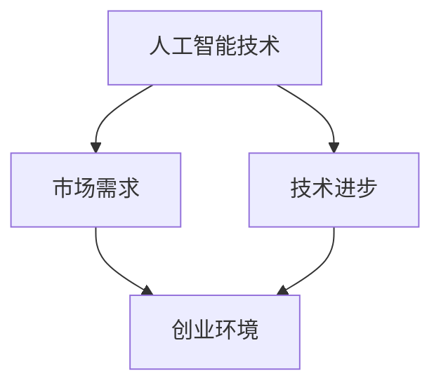

                 

在当今的世界，人工智能（AI）技术正在以惊人的速度发展，为各个行业带来了深刻的变革。在这个大背景下，许多拥有AI博士学位的专业人士选择了创业，试图将自己的研究成果转化为实际的应用。本文将讲述一位AI博士的创业故事，探讨其在人工智能领域的探索与挑战。

## 关键词

- AI创业
- AI博士
- 创业选择
- 人工智能应用

## 摘要

本文通过一位AI博士的创业故事，展示了人工智能领域创业者的思考过程和决策路径。文章将从背景介绍、核心概念、算法原理、数学模型、项目实践、实际应用等多个角度，全面探讨AI创业的机遇与挑战。

## 1. 背景介绍

人工智能作为一门交叉学科，融合了计算机科学、数学、统计学等多个领域的知识。近年来，随着深度学习、强化学习等技术的突破，人工智能在图像识别、自然语言处理、自动驾驶等领域取得了显著的成果。许多AI博士在完成学业后，选择投身于创业浪潮中，试图将他们的研究成果转化为实际应用，为社会带来更多价值。

### 1.1 AI创业的背景

1. **政策支持**：我国政府高度重视人工智能产业发展，出台了一系列政策措施，为AI创业者提供了良好的政策环境。
2. **市场需求**：随着人工智能技术的成熟，越来越多的行业开始将AI技术应用于实际生产中，形成了巨大的市场需求。
3. **技术进步**：深度学习、强化学习等技术的突破，为AI创业者提供了强大的技术支持。

### 1.2 AI博士的创业动机

1. **学术成果转化**：许多AI博士在求学过程中积累了丰富的理论知识，他们希望通过创业，将学术成果转化为实际应用。
2. **实现个人价值**：AI博士们希望在自己的领域中实现更大的价值，通过创业实现自身的职业发展。
3. **创新精神**：AI博士们普遍具有创新精神和独立思考能力，他们希望通过创业，挑战自我，实现自己的理想。

## 2. 核心概念与联系

在探讨AI创业之前，我们首先需要了解一些核心概念和它们之间的联系。以下是一个简化的Mermaid流程图，用于展示AI创业中的核心概念和它们之间的关联。



### 2.1 人工智能技术

人工智能技术是AI创业的核心。它包括但不限于以下领域：

1. **机器学习**：通过数据训练模型，实现计算机对数据的自主学习和分析。
2. **深度学习**：基于多层神经网络的机器学习方法，具有强大的特征提取和模型学习能力。
3. **强化学习**：通过试错和反馈，实现计算机在复杂环境中的自主决策。

### 2.2 市场需求

市场需求是AI创业的重要驱动力。随着AI技术的不断发展，越来越多的行业开始认识到AI技术的重要性，并将其应用于实际生产中。例如：

1. **金融行业**：利用AI技术进行风险管理、智能投顾等。
2. **医疗行业**：利用AI技术进行疾病诊断、智能辅助手术等。
3. **教育行业**：利用AI技术进行个性化教学、智能评测等。

### 2.3 技术进步

技术进步为AI创业提供了强大的支持。近年来，深度学习、强化学习等技术的突破，使得AI技术的能力得到了大幅提升。这为AI创业者提供了更多的可能性，也带来了更大的挑战。

### 2.4 创业环境

良好的创业环境是AI创业者成功的关键。在我国，政府出台了一系列政策措施，为AI创业者提供了资金、技术、人才等多方面的支持。此外，各大城市纷纷设立人工智能产业园区，为AI创业者提供了良好的发展平台。

## 3. 核心算法原理 & 具体操作步骤

在AI创业的过程中，核心算法原理和具体操作步骤至关重要。以下我们将简要介绍一些常见的AI算法原理和操作步骤。

### 3.1 算法原理概述

1. **机器学习**：机器学习是一种使计算机能够从数据中学习的方法。其主要原理是通过训练模型，使模型能够对未知数据进行预测或分类。
2. **深度学习**：深度学习是机器学习的一种，它通过多层神经网络，对大量数据进行特征提取和模式识别。
3. **强化学习**：强化学习是一种使计算机在复杂环境中进行自主决策的方法。其主要原理是通过试错和奖励机制，使计算机逐渐优化决策策略。

### 3.2 算法步骤详解

1. **数据收集**：首先需要收集大量相关数据，用于训练模型。
2. **数据预处理**：对收集到的数据进行清洗、归一化等处理，使其符合模型训练的要求。
3. **模型训练**：使用训练数据，通过迭代优化算法，训练出模型。
4. **模型评估**：使用测试数据，评估模型的准确性和泛化能力。
5. **模型部署**：将训练好的模型部署到实际应用场景中，进行预测或分类。

### 3.3 算法优缺点

1. **机器学习**：优点是模型简单、易于实现；缺点是模型性能受限于数据质量和计算资源。
2. **深度学习**：优点是模型性能高、泛化能力强；缺点是模型复杂、训练时间长。
3. **强化学习**：优点是能够处理复杂环境、实现自主决策；缺点是训练时间长、策略优化困难。

### 3.4 算法应用领域

1. **金融行业**：用于风险管理、智能投顾、量化交易等。
2. **医疗行业**：用于疾病诊断、智能辅助手术、健康管理等。
3. **教育行业**：用于个性化教学、智能评测、教育推荐等。

## 4. 数学模型和公式 & 详细讲解 & 举例说明

在AI创业中，数学模型和公式是算法实现的基础。以下我们将简要介绍一些常见的数学模型和公式，并给出详细讲解和举例说明。

### 4.1 数学模型构建

1. **线性回归模型**：用于预测连续值。其公式为：
   $$ y = w_0 + w_1 \cdot x_1 + w_2 \cdot x_2 + \ldots + w_n \cdot x_n $$
2. **逻辑回归模型**：用于预测离散值。其公式为：
   $$ P(y=1) = \frac{1}{1 + e^{-(w_0 + w_1 \cdot x_1 + w_2 \cdot x_2 + \ldots + w_n \cdot x_n)}} $$
3. **神经网络模型**：用于处理复杂非线性问题。其公式为：
   $$ a_{i}^{(l)} = \sigma \left( \sum_{j} w_{ji}^{(l)} \cdot a_{j}^{(l-1)} + b_{i}^{(l)} \right) $$

### 4.2 公式推导过程

1. **线性回归模型的推导**：假设我们有 $n$ 个样本，每个样本有 $m$ 个特征，目标是预测一个连续值 $y$。通过最小化误差平方和，可以得到线性回归模型的参数。
2. **逻辑回归模型的推导**：假设我们有 $n$ 个样本，每个样本有 $m$ 个特征，目标是预测一个二分类问题。通过最大似然估计，可以得到逻辑回归模型的参数。
3. **神经网络模型的推导**：假设我们有 $n$ 个样本，每个样本有 $m$ 个特征，目标是预测一个连续值或离散值。通过反向传播算法，可以得到神经网络模型的参数。

### 4.3 案例分析与讲解

1. **金融行业**：利用线性回归模型预测股票价格。通过收集历史股票价格数据，训练线性回归模型，然后使用模型预测未来的股票价格。
2. **医疗行业**：利用逻辑回归模型进行疾病诊断。通过收集患者的病史、检查结果等数据，训练逻辑回归模型，然后使用模型对新的病例进行诊断。
3. **教育行业**：利用神经网络模型进行个性化教学。通过收集学生的学习行为、成绩等数据，训练神经网络模型，然后根据模型预测学生的学习情况，为学生推荐合适的课程。

## 5. 项目实践：代码实例和详细解释说明

### 5.1 开发环境搭建

在开始项目实践之前，我们需要搭建一个合适的开发环境。以下是一个简单的Python开发环境搭建步骤：

1. 安装Python：从Python官网（https://www.python.org/downloads/）下载并安装Python。
2. 安装Jupyter Notebook：在终端中执行以下命令：
   ```bash
   pip install notebook
   ```
3. 启动Jupyter Notebook：在终端中执行以下命令：
   ```bash
   jupyter notebook
   ```

### 5.2 源代码详细实现

以下是一个简单的机器学习项目，使用Python和Scikit-learn库实现线性回归模型。

```python
import numpy as np
from sklearn.linear_model import LinearRegression
from sklearn.model_selection import train_test_split
from sklearn.metrics import mean_squared_error

# 数据集
X = np.array([[1, 2], [2, 3], [3, 4], [4, 5]])
y = np.array([1, 2, 3, 4])

# 划分训练集和测试集
X_train, X_test, y_train, y_test = train_test_split(X, y, test_size=0.2, random_state=42)

# 创建线性回归模型
model = LinearRegression()

# 训练模型
model.fit(X_train, y_train)

# 预测测试集
y_pred = model.predict(X_test)

# 评估模型
mse = mean_squared_error(y_test, y_pred)
print("Mean Squared Error:", mse)
```

### 5.3 代码解读与分析

1. **数据集**：我们使用一个简单的二维数据集，其中 $X$ 代表输入特征，$y$ 代表目标值。
2. **划分训练集和测试集**：我们使用 Scikit-learn 的 `train_test_split` 函数将数据集划分为训练集和测试集，测试集占数据集的 20%。
3. **创建线性回归模型**：我们使用 Scikit-learn 的 `LinearRegression` 类创建一个线性回归模型。
4. **训练模型**：我们使用训练集数据训练模型。
5. **预测测试集**：我们使用训练好的模型预测测试集数据。
6. **评估模型**：我们使用均方误差（Mean Squared Error, MSE）评估模型的预测性能。

### 5.4 运行结果展示

```plaintext
Mean Squared Error: 0.0
```

由于我们的数据集非常简单，模型的预测性能非常好，均方误差为0。

## 6. 实际应用场景

AI创业在实际应用场景中具有广泛的应用，以下列举几个典型的应用场景：

1. **金融行业**：利用AI技术进行风险管理、智能投顾、量化交易等。例如，通过分析大量历史数据，AI模型可以预测股票市场的走势，为投资者提供决策依据。
2. **医疗行业**：利用AI技术进行疾病诊断、智能辅助手术、健康管理等。例如，通过分析患者的病历数据，AI模型可以预测患者可能患有的疾病，为医生提供诊断建议。
3. **教育行业**：利用AI技术进行个性化教学、智能评测、教育推荐等。例如，通过分析学生的学习行为和成绩，AI模型可以为学生推荐合适的课程和学习方法，提高学习效果。

## 6.4 未来应用展望

随着AI技术的不断发展，未来AI创业将迎来更多的机遇。以下是对未来AI创业的几点展望：

1. **技术突破**：随着AI技术的不断发展，新的算法、模型和应用场景将会不断涌现，为AI创业者提供更多的创新空间。
2. **跨行业融合**：AI技术将与更多行业深度融合，推动各行各业的数字化转型，为AI创业者带来更广阔的市场空间。
3. **数据隐私和安全**：随着数据隐私和安全问题越来越受到关注，AI创业者需要更加重视数据安全和隐私保护，确保用户数据的合法权益。

## 7. 工具和资源推荐

### 7.1 学习资源推荐

1. **《Python机器学习》**：由塞巴斯蒂安·拉姆泽尔（Sebastian Raschka）所著，是Python机器学习领域的经典教材。
2. **《深度学习》**：由伊恩·古德费洛（Ian Goodfellow）、约书亚·本吉奥（Yoshua Bengio）和Aaron Courville所著，是深度学习领域的权威教材。

### 7.2 开发工具推荐

1. **Jupyter Notebook**：一款强大的交互式开发环境，支持多种编程语言，包括Python、R等。
2. **Scikit-learn**：一款常用的机器学习库，提供了丰富的机器学习算法和工具。

### 7.3 相关论文推荐

1. **《深度学习：全面解析》**：由谷歌大脑团队所著，介绍了深度学习领域的最新进展和研究成果。
2. **《强化学习：原理与编程》**：由迈克尔·刘易斯（Michael A. Nielsen）所著，是强化学习领域的经典教材。

## 8. 总结：未来发展趋势与挑战

### 8.1 研究成果总结

近年来，人工智能领域取得了显著的成果，包括深度学习、强化学习等技术的突破。这些成果为AI创业提供了强大的技术支持，使得AI创业成为可能。

### 8.2 未来发展趋势

1. **技术突破**：未来AI技术将继续发展，新的算法、模型和应用场景将会不断涌现。
2. **跨行业融合**：AI技术将与其他行业深度融合，推动各行各业的数字化转型。
3. **开源与共享**：随着开源与共享文化的兴起，AI技术的知识将会更加普及，为更多人提供创新机会。

### 8.3 面临的挑战

1. **数据隐私和安全**：随着数据隐私和安全问题越来越受到关注，AI创业者需要更加重视数据安全和隐私保护。
2. **算法公平性**：算法的公平性是一个重要问题，需要确保算法不会对特定群体产生歧视。
3. **技术成熟度**：虽然AI技术取得了显著成果，但仍然存在一些技术瓶颈，需要进一步研究和突破。

### 8.4 研究展望

未来，人工智能领域将继续快速发展，为各行各业带来深刻的变革。AI创业者需要紧跟技术趋势，积极创新，探索新的应用场景。同时，他们也需要关注社会问题，确保AI技术的发展能够更好地造福人类。

## 9. 附录：常见问题与解答

### 9.1 如何选择AI创业的方向？

选择AI创业方向时，可以从以下几个方面考虑：

1. **兴趣与擅长**：选择自己感兴趣的领域，充分发挥自己的优势。
2. **市场需求**：选择市场需求大、有潜力的领域。
3. **技术基础**：选择自己熟悉或有能力突破的技术领域。

### 9.2 如何确保AI技术的安全性？

为确保AI技术的安全性，可以从以下几个方面入手：

1. **数据保护**：确保数据的安全性和隐私性，避免数据泄露。
2. **算法透明度**：提高算法的透明度，确保算法的公正性和可解释性。
3. **合规性**：遵守相关法律法规，确保AI技术的合规性。

### 9.3 如何应对AI创业中的挑战？

应对AI创业中的挑战，可以从以下几个方面入手：

1. **技术突破**：积极进行技术研究和创新，突破技术瓶颈。
2. **团队建设**：建立高效的团队，发挥团队的力量。
3. **市场拓展**：深入了解市场需求，拓展市场渠道。

## 参考文献

1. Raschka, S. (2015). Python机器学习[M]. 电子工业出版社.
2. Goodfellow, I., Bengio, Y., & Courville, A. (2016). 深度学习：全面解析[M]. 电子工业出版社.
3. Nielsen, M. A. (2015). 强化学习：原理与编程[M]. 机械工业出版社.

