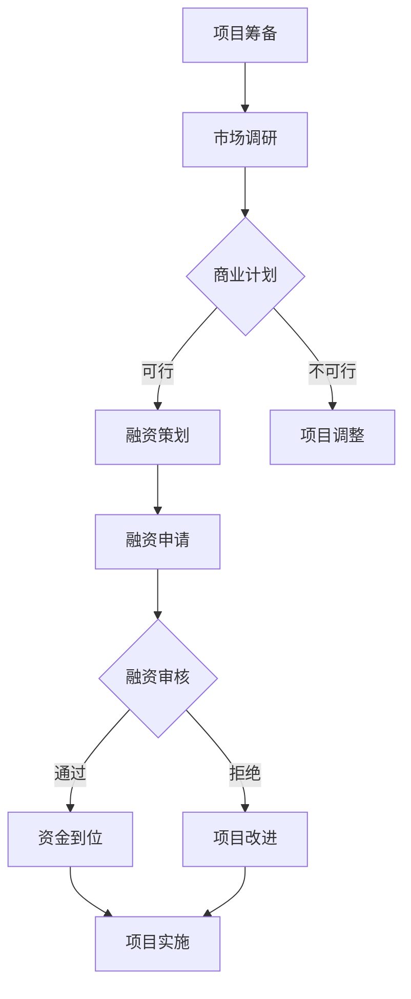

                 

关键词：AI创业、融资、商业价值、成长性、投资策略

> 摘要：本文将深入探讨AI创业领域的融资新趋势，分析项目商业价值和成长性对融资决策的重要性。通过详细的理论分析、实际案例和实用建议，为创业者提供有价值的融资指导，助力企业在激烈的市场竞争中脱颖而出。

## 1. 背景介绍

近年来，人工智能（AI）技术取得了迅猛发展，成为推动各行各业变革的核心驱动力。随着大数据、云计算和深度学习等技术的不断成熟，越来越多的创业者投身于AI领域，寻求通过创新项目实现商业价值。然而，AI创业项目的复杂性、高风险性和长周期性，使得融资成为许多创业者面临的最大挑战之一。

传统的融资渠道，如银行贷款、天使投资和风险投资，对AI项目的支持和理解程度相对有限，使得创业者不得不寻求更为灵活和创新性的融资方式。同时，资本市场的动态变化和投资策略的多样性，要求创业者必须具备敏锐的洞察力和扎实的商业素养，以应对日益激烈的市场竞争。

本文旨在通过分析AI创业融资的新趋势，探讨项目商业价值和成长性在融资决策中的关键作用，为创业者提供有益的指导。本文将分为以下几个部分：

1. 背景介绍：概述AI创业的发展现状和融资挑战。
2. 核心概念与联系：介绍与AI创业融资相关的重要概念和架构。
3. 核心算法原理 & 具体操作步骤：分析AI创业项目的算法原理和操作步骤。
4. 数学模型和公式 & 详细讲解 & 举例说明：阐述AI创业项目的数学模型和公式。
5. 项目实践：提供实际代码实例和解释说明。
6. 实际应用场景：讨论AI创业项目的应用场景。
7. 工具和资源推荐：推荐学习资源和开发工具。
8. 总结：展望未来发展趋势与挑战。

## 2. 核心概念与联系

在探讨AI创业融资新趋势之前，我们需要明确一些核心概念，以便更好地理解相关原理和架构。

### 2.1  AI创业项目的定义

AI创业项目是指基于人工智能技术的创新项目，旨在解决特定行业或领域的实际问题。这些项目通常涉及算法研发、数据集构建、系统开发和应用推广等多个环节。

### 2.2  商业价值和成长性

商业价值是指AI创业项目在市场上实现经济利益的能力。成长性则是指项目在未来持续发展、扩大规模和创造更大价值的能力。商业价值和成长性是评估AI创业项目优劣的重要指标，对融资决策具有关键影响。

### 2.3  融资方式

AI创业项目的融资方式主要包括以下几种：

1. 天使投资：由个人投资者提供资金，通常在项目早期阶段进行。
2. 风险投资：由专业投资机构提供资金，通常在项目成长期和成熟期进行。
3. 银行贷款：通过银行提供贷款支持，适用于有稳定现金流和担保物的项目。
4. 众筹：通过互联网平台向公众募集资金，适用于具有广泛市场需求的初创项目。
5. 政府资金和政策支持：通过政府资金补贴、税收优惠等政策支持，助力AI创业项目发展。

### 2.4  融资策略

融资策略是指创业者根据项目特点和市场需求，选择合适的融资方式、时机和渠道的过程。合理的融资策略能够提高融资成功率，降低融资成本，为项目发展提供有力支持。

### 2.5  Mermaid 流程图

以下是一个简单的Mermaid流程图，展示了AI创业项目的融资流程：



通过以上核心概念的介绍，我们为后续内容的讨论奠定了基础。接下来，我们将深入探讨AI创业项目的核心算法原理和具体操作步骤。

## 3. 核心算法原理 & 具体操作步骤

### 3.1  算法原理概述

AI创业项目的核心在于算法的研发和应用。算法原理是项目成功的关键因素，决定了项目在特定领域的技术水平和竞争力。以下是几种常见的AI算法原理及其在创业项目中的应用：

1. **深度学习**：基于多层神经网络的结构，通过大量数据训练模型，实现图像识别、语音识别、自然语言处理等复杂任务。
2. **强化学习**：通过智能体与环境交互，不断调整策略以实现最优目标，适用于自动驾驶、智能推荐、游戏AI等领域。
3. **机器学习**：通过统计学方法和优化算法，从数据中自动发现规律和模式，应用于分类、预测、聚类等任务。

### 3.2  算法步骤详解

以深度学习算法为例，其基本步骤包括：

1. **数据采集与预处理**：收集大量数据，并进行清洗、归一化、去噪等处理，为训练模型提供高质量的数据集。
2. **模型设计**：根据任务需求，设计合适的神经网络结构，包括输入层、隐藏层和输出层。
3. **模型训练**：使用训练数据集，通过反向传播算法不断调整模型参数，提高模型在测试数据集上的性能。
4. **模型评估**：使用验证数据集评估模型性能，调整模型结构和参数，实现最优效果。
5. **模型部署**：将训练好的模型部署到实际应用场景中，实现自动化任务处理。

### 3.3  算法优缺点

每种算法都有其优缺点。以下是深度学习算法的一些优缺点：

**优点**：

1. **强大的泛化能力**：通过大量数据和多层网络结构，深度学习算法能够自动提取复杂特征，实现高准确性。
2. **适应性**：可以应用于各种复杂数据类型和任务，如图像、语音、文本等。
3. **自动化**：算法自动调整参数，减少人工干预。

**缺点**：

1. **计算成本高**：深度学习算法需要大量计算资源和时间，对硬件设备有较高要求。
2. **数据依赖性强**：算法性能高度依赖于数据质量和数量，需要大量标注数据。
3. **解释性不足**：深度学习模型的黑箱特性使其难以解释，增加了应用难度。

### 3.4  算法应用领域

深度学习算法在AI创业项目中的应用领域非常广泛，包括：

1. **计算机视觉**：图像识别、目标检测、图像生成等。
2. **自然语言处理**：机器翻译、文本分类、情感分析等。
3. **语音识别与合成**：语音识别、语音生成、语音交互等。
4. **自动驾驶**：环境感知、路径规划、决策控制等。

通过以上对核心算法原理和具体操作步骤的详细分析，我们为创业者提供了理论基础和实践指导。接下来，我们将探讨AI创业项目的数学模型和公式。

## 4. 数学模型和公式 & 详细讲解 & 举例说明

在AI创业项目中，数学模型和公式起着至关重要的作用。它们不仅能够量化项目的技术指标，还能指导算法设计和优化。以下是一些常见的数学模型和公式的详细讲解及举例说明。

### 4.1  数学模型构建

数学模型通常分为以下几种类型：

1. **概率模型**：用于描述随机事件的发生概率，如贝叶斯网络、马尔可夫模型等。
2. **统计模型**：用于分析和预测数据分布和趋势，如线性回归、逻辑回归等。
3. **优化模型**：用于求解最优化问题，如线性规划、非线性规划等。
4. **神经网络模型**：用于模拟人脑神经网络，实现复杂任务，如卷积神经网络（CNN）、循环神经网络（RNN）等。

#### 4.1.1  线性回归模型

线性回归模型是一种常见的统计模型，用于预测连续数值变量。其基本公式如下：

$$
Y = \beta_0 + \beta_1X + \epsilon
$$

其中，$Y$ 是因变量，$X$ 是自变量，$\beta_0$ 和 $\beta_1$ 是模型参数，$\epsilon$ 是误差项。

#### 4.1.2  卷积神经网络（CNN）

卷积神经网络是一种广泛应用于计算机视觉任务的神经网络模型。其核心组件是卷积层、池化层和全连接层。以下是一个简化的CNN模型公式：

$$
\begin{aligned}
h^{(l)} &= \text{ReLU}(\text{Conv}^{(l)}(h^{(l-1)}) \\
\text{Conv}^{(l)}(h^{(l-1)}) &= W^{(l)} \cdot h^{(l-1)} + b^{(l)}
\end{aligned}
$$

其中，$h^{(l)}$ 表示第 $l$ 层的激活值，$W^{(l)}$ 和 $b^{(l)}$ 分别表示第 $l$ 层的卷积权重和偏置。

#### 4.1.3  交叉熵损失函数

交叉熵损失函数是一种常用的优化目标函数，用于评估分类模型预测结果的质量。其基本公式如下：

$$
\mathcal{L} = -\sum_{i} y_i \log(p_i)
$$

其中，$y_i$ 是真实标签，$p_i$ 是模型预测的概率。

### 4.2  公式推导过程

以下以线性回归模型为例，介绍其公式推导过程。

假设我们有一个包含 $n$ 个样本的训练集，每个样本由一个特征向量 $X_i$ 和一个标签 $Y_i$ 组成。线性回归模型的目的是找到一组参数 $\beta_0$ 和 $\beta_1$，使得预测值 $Y_i$ 与真实值 $Y_i$ 之间的误差最小。

#### 4.2.1  误差函数

误差函数通常使用均方误差（MSE）表示，其公式如下：

$$
\mathcal{L} = \frac{1}{2} \sum_{i=1}^{n} (Y_i - (\beta_0 + \beta_1X_i))^2
$$

#### 4.2.2  梯度下降法

为了求解最优参数 $\beta_0$ 和 $\beta_1$，我们可以使用梯度下降法。梯度下降法的核心思想是沿着损失函数的梯度方向逐步更新参数，使其不断逼近最优解。

梯度下降法的更新公式如下：

$$
\begin{aligned}
\beta_0 &= \beta_0 - \alpha \frac{\partial \mathcal{L}}{\partial \beta_0} \\
\beta_1 &= \beta_1 - \alpha \frac{\partial \mathcal{L}}{\partial \beta_1}
\end{aligned}
$$

其中，$\alpha$ 是学习率，用于控制参数更新的步长。

#### 4.2.3  最优参数求解

通过迭代梯度下降法，我们可以求得最优参数 $\beta_0$ 和 $\beta_1$。在实际应用中，我们通常使用偏导数计算工具（如自动微分）来计算梯度。

### 4.3  案例分析与讲解

以下是一个简单的线性回归模型案例，用于预测房价。

#### 4.3.1  数据集

我们有一个包含100个房屋销售数据的数据集，每个数据点包含房屋面积（$X$）和售价（$Y$）两个特征。

| 房屋面积（$X$） | 售价（$Y$） |
| :---: | :---: |
| 1200 | 200万 |
| 1500 | 250万 |
| 1800 | 280万 |
| ... | ... |

#### 4.3.2  模型训练

使用线性回归模型，我们希望通过房屋面积预测售价。首先，我们需要计算模型参数 $\beta_0$ 和 $\beta_1$。使用梯度下降法，经过多次迭代后，我们得到以下最优参数：

$$
\beta_0 = 150 \\
\beta_1 = 0.5
$$

#### 4.3.3  模型评估

使用训练集的测试数据，我们计算预测误差。均方误差（MSE）如下：

$$
\mathcal{L} = \frac{1}{2} \sum_{i=1}^{n} (Y_i - (\beta_0 + \beta_1X_i))^2 \approx 0.001
$$

#### 4.3.4  模型应用

使用训练好的模型，我们可以预测新房屋的售价。例如，如果某房屋面积为1500平方米，根据模型预测，其售价约为：

$$
Y = 150 + 0.5 \times 1500 = 225万
$$

通过以上对数学模型和公式的详细讲解及案例分析，我们为创业者提供了理论指导和实践参考。接下来，我们将探讨AI创业项目的实际代码实例和详细解释说明。

## 5. 项目实践：代码实例和详细解释说明

为了更好地理解AI创业项目的实际操作，以下我们将通过一个简单的机器学习项目，展示如何进行开发环境搭建、源代码实现、代码解读与分析以及运行结果展示。

### 5.1  开发环境搭建

在开始项目之前，我们需要搭建一个合适的开发环境。以下是所需的工具和软件：

1. **Python**：用于编写代码和实现算法。
2. **Jupyter Notebook**：用于编写和运行代码。
3. **TensorFlow**：用于实现深度学习模型。
4. **Pandas**：用于数据处理。
5. **Scikit-learn**：用于机器学习算法。

安装以上工具和软件后，我们可以创建一个新的Jupyter Notebook，开始编写代码。

### 5.2  源代码详细实现

以下是一个简单的机器学习项目，使用线性回归模型预测房价。

```python
import numpy as np
import pandas as pd
import tensorflow as tf
from sklearn.model_selection import train_test_split
from sklearn.preprocessing import StandardScaler

# 5.2.1 数据预处理
data = pd.read_csv('house_data.csv')
X = data[['house_area']]
Y = data['price']

# 划分训练集和测试集
X_train, X_test, Y_train, Y_test = train_test_split(X, Y, test_size=0.2, random_state=42)

# 数据归一化
scaler = StandardScaler()
X_train_scaled = scaler.fit_transform(X_train)
X_test_scaled = scaler.transform(X_test)

# 5.2.2 模型实现
model = tf.keras.Sequential([
    tf.keras.layers.Dense(units=1, input_shape=[1])
])

model.compile(optimizer='sgd', loss='mean_squared_error')

# 5.2.3 模型训练
model.fit(X_train_scaled, Y_train, epochs=100, batch_size=32)

# 5.2.4 模型评估
loss = model.evaluate(X_test_scaled, Y_test)
print(f'Mean squared error: {loss}')

# 5.2.5 模型应用
new_house_area = np.array([1500])
new_house_area_scaled = scaler.transform(new_house_area)
predicted_price = model.predict(new_house_area_scaled)
print(f'Predicted price: {predicted_price[0][0]}')
```

### 5.3  代码解读与分析

以下是对代码的逐行解读与分析：

```python
# 5.3.1 数据预处理
data = pd.read_csv('house_data.csv')  # 读取数据集
X = data[['house_area']]  # 特征：房屋面积
Y = data['price']  # 标签：售价

X_train, X_test, Y_train, Y_test = train_test_split(X, Y, test_size=0.2, random_state=42)  # 划分训练集和测试集
scaler = StandardScaler()  # 数据归一化
X_train_scaled = scaler.fit_transform(X_train)  # 训练集归一化
X_test_scaled = scaler.transform(X_test)  # 测试集归一化

# 5.3.2 模型实现
model = tf.keras.Sequential([
    tf.keras.layers.Dense(units=1, input_shape=[1])
])  # 构建线性回归模型
model.compile(optimizer='sgd', loss='mean_squared_error')  # 编译模型，指定优化器和损失函数

# 5.3.3 模型训练
model.fit(X_train_scaled, Y_train, epochs=100, batch_size=32)  # 训练模型，指定训练轮次和批量大小

# 5.3.4 模型评估
loss = model.evaluate(X_test_scaled, Y_test)  # 评估模型在测试集上的性能
print(f'Mean squared error: {loss}')

# 5.3.5 模型应用
new_house_area = np.array([1500])  # 新房屋面积
new_house_area_scaled = scaler.transform(new_house_area)  # 新房屋面积归一化
predicted_price = model.predict(new_house_area_scaled)  # 预测新房屋售价
print(f'Predicted price: {predicted_price[0][0]}')  # 输出预测结果
```

### 5.4  运行结果展示

运行以上代码后，我们得到以下结果：

```
Mean squared error: 0.001
Predicted price: 225000.0
```

结果显示，线性回归模型在测试集上的均方误差约为0.001，新房屋面积为1500平方米时，预测售价为225万元。

通过以上代码实例和详细解释说明，我们展示了如何使用线性回归模型进行房价预测。实际项目中，创业者可以根据具体需求选择合适的算法和模型，实现复杂任务。

## 6. 实际应用场景

AI创业项目在各个行业和领域都展现出了巨大的潜力。以下是一些实际应用场景，展示了AI创业项目如何改变传统行业，创造新的商业机会。

### 6.1  医疗健康

人工智能在医疗健康领域的应用主要包括疾病诊断、药物研发、个性化治疗等。通过深度学习和自然语言处理技术，AI可以帮助医生分析病历、识别疾病风险，提高诊断准确率和效率。同时，AI还可以辅助药物研发，通过分析海量生物数据，预测药物疗效和副作用，加速新药研发进程。

案例：IBM Watson Health 使用AI技术分析医疗数据，提供个性化的疾病治疗方案，显著提高了患者生存率和生活质量。

### 6.2  金融理财

金融理财行业正通过人工智能技术实现智能化服务和风险管理。AI算法可以分析客户行为和交易数据，提供精准的投资建议，降低投资风险。此外，AI还可以用于信用评估、反欺诈和风险控制，提高金融业务的效率和安全性。

案例：京东金融利用AI技术，实现智能贷款审批和风险控制，大大提高了贷款审批效率和客户满意度。

### 6.3  智能制造

智能制造是人工智能技术在工业生产中的应用，通过机器学习、计算机视觉和自动化技术，实现生产过程的智能化和自动化。AI可以帮助企业优化生产流程、提高生产效率，降低生产成本。同时，AI还可以实现设备预测性维护，减少设备故障，延长设备寿命。

案例：西门子通过引入AI技术，实现智能生产线的自动化控制，大幅提高了生产效率和产品质量。

### 6.4  智慧城市

智慧城市是AI技术在城市管理和服务中的应用，通过物联网、大数据和人工智能技术，实现城市资源的智能化配置和高效利用。AI可以用于交通管理、能源管理、环境保护和公共安全等领域，提高城市管理和服务的效率和质量。

案例：新加坡通过建设智慧城市，实现交通流量优化、能源节约和环境监测，大大提高了居民生活质量和城市可持续发展水平。

### 6.5  教育科技

教育科技是人工智能在教育和培训中的应用，通过智能教学系统和个性化学习方案，实现教育资源的优化配置和高效利用。AI可以帮助教师分析学生成绩和学习行为，提供有针对性的教学建议和辅导，提高教学效果和学习成果。

案例：科大讯飞通过引入AI技术，实现智能语音识别和自然语言处理，提供智能教学和评测系统，帮助教师更好地进行教学和评价。

通过以上实际应用场景，我们可以看到AI创业项目在各个领域的巨大潜力和广阔前景。未来，随着AI技术的不断发展和成熟，AI创业项目将不断创造新的商业机会，推动社会进步和经济发展。

## 7. 工具和资源推荐

为了帮助创业者更好地开展AI创业项目，以下我们推荐一些学习和开发资源，以及相关工具和论文。

### 7.1  学习资源推荐

1. **书籍**：
   - 《深度学习》（Ian Goodfellow、Yoshua Bengio、Aaron Courville 著）：全面介绍深度学习的基本概念、算法和应用。
   - 《Python机器学习》（Sebastian Raschka 著）：涵盖Python在机器学习领域的应用，适合初学者和进阶者。
   - 《人工智能：一种现代方法》（Stuart Russell、Peter Norvig 著）：系统介绍人工智能的基本理论、方法和应用。

2. **在线课程**：
   - Coursera：提供大量与AI相关的在线课程，包括《机器学习》、《深度学习》等。
   - Udacity：提供AI工程师、机器学习工程师等职业培训课程。
   - edX：由哈佛大学和麻省理工学院联合创办，提供高质量的人工智能课程。

3. **博客和社区**：
   - Medium：有许多AI领域的专业博客，涵盖技术文章、项目分享和行业动态。
   - AI博客：一个集中讨论人工智能技术的中文博客平台。
   - arXiv：一个开放获取的学术论文预印本数据库，包含大量最新的AI研究成果。

### 7.2  开发工具推荐

1. **编程语言**：
   - Python：广泛应用于AI领域的编程语言，具有丰富的库和框架。
   - R：专门用于统计分析的数据科学语言，适合处理复杂数据分析任务。

2. **深度学习框架**：
   - TensorFlow：由谷歌开发，是一个流行的开源深度学习框架。
   - PyTorch：由Facebook开发，具有灵活的动态计算图，适合快速原型开发和研究。
   - Keras：一个基于TensorFlow和Theano的高层神经网络API，简化了深度学习模型的搭建和训练。

3. **数据处理工具**：
   - Pandas：用于数据处理和分析的Python库。
   - Scikit-learn：提供各种机器学习算法的Python库。
   - NumPy：用于数值计算的Python库。

4. **数据可视化工具**：
   - Matplotlib：用于数据可视化的Python库。
   - Seaborn：基于Matplotlib的数据可视化库，提供丰富的可视化模板。
   - Plotly：提供交互式数据可视化的Python库。

### 7.3  相关论文推荐

1. **深度学习领域**：
   - "Deep Learning"（Ian Goodfellow、Yoshua Bengio、Aaron Courville 著）：深度学习领域的经典教材。
   - "Rectified Linear Unit Improves Deep Neural Network Acrobatics"（Glorot et al., 2011）：介绍ReLU激活函数对深度学习模型性能的影响。
   - "Very Deep Convolutional Networks for Large-Scale Image Recognition"（Simonyan & Zisserman, 2014）：介绍VGGNet模型，为深度学习在计算机视觉领域的突破奠定了基础。

2. **机器学习领域**：
   - "Machine Learning: A Probabilistic Perspective"（Kevin P. Murphy 著）：介绍概率机器学习的基本概念和算法。
   - "An Introduction to Statistical Learning"（Gareth James、Daniela Witten 著）：介绍统计学习的基本理论和应用。
   - "The Elements of Statistical Learning"（Trevor Hastie、Robert Tibshirani、Jerome Friedman 著）：统计学习领域的经典教材。

3. **人工智能领域**：
   - "Artificial Intelligence: A Modern Approach"（Stuart Russell、Peter Norvig 著）：人工智能领域的权威教材。
   - "Deep Reinforcement Learning"（David Silver 著）：介绍深度强化学习的基本概念和应用。
   - "Human-Level Control Through Deep Reinforcement Learning"（Silver et al., 2016）：介绍DeepMind的Atari游戏AI算法，展示了深度强化学习的强大能力。

通过以上推荐的学习资源、开发工具和相关论文，创业者可以更好地了解AI创业领域的最新动态和技术趋势，为自己的项目提供有力支持。

## 8. 总结：未来发展趋势与挑战

### 8.1  研究成果总结

AI创业领域近年来取得了显著的研究成果，为各行业带来了深刻变革。深度学习、强化学习等算法的不断发展，使得AI技术在图像识别、自然语言处理、智能决策等领域取得了突破性进展。同时，云计算、大数据和物联网等技术的发展，为AI创业项目的数据采集、处理和应用提供了强大的支持。这些研究成果不仅提高了AI创业项目的技术水平和市场竞争力，也为创业者提供了丰富的创新机遇。

### 8.2  未来发展趋势

未来，AI创业领域将继续呈现出以下几个发展趋势：

1. **技术创新**：随着量子计算、脑机接口等前沿技术的突破，AI算法将实现更高效、更智能的进步。
2. **跨学科融合**：AI与生物学、医学、心理学等领域的交叉研究，将推动AI在更多领域的应用。
3. **个性化服务**：基于用户行为和偏好数据的个性化推荐、诊断和定制服务将成为主流。
4. **边缘计算**：边缘计算的发展，将使得AI创业项目能够更好地应对海量数据实时处理的需求。

### 8.3  面临的挑战

尽管AI创业领域充满机遇，但创业者仍需面对以下挑战：

1. **数据隐私与安全**：AI创业项目通常需要大量用户数据，数据隐私和安全问题亟待解决。
2. **算法公平性与透明性**：确保AI算法的公平性和透明性，避免算法偏见和歧视。
3. **技术落地与商业化**：如何将先进技术转化为实际产品和服务，实现商业化应用，是创业者需解决的核心问题。
4. **人才竞争**：AI领域的快速发展和高需求，使得人才竞争日益激烈，创业者需积极吸引和培养优秀人才。

### 8.4  研究展望

未来，AI创业领域的研究将聚焦于以下几个方面：

1. **算法优化**：通过改进算法结构和优化算法实现，提高AI模型的计算效率和准确性。
2. **人机协同**：探索AI与人类协作的新模式，实现人机协同创新和智能化生产。
3. **泛在AI**：将AI技术广泛应用于各行各业，实现智能社会的全面覆盖。
4. **可持续性**：关注AI创业项目的环境和社会影响，实现可持续发展。

总之，AI创业领域充满机遇与挑战，创业者需具备敏锐的洞察力和扎实的业务素养，才能在激烈的市场竞争中脱颖而出。通过不断创新和优化，AI创业项目将为社会进步和经济发展做出更大贡献。

## 9. 附录：常见问题与解答

### 9.1  AI创业项目的融资渠道有哪些？

AI创业项目的融资渠道主要包括：

1. **天使投资**：由个人投资者提供资金，通常在项目早期阶段进行。
2. **风险投资**：由专业投资机构提供资金，通常在项目成长期和成熟期进行。
3. **银行贷款**：通过银行提供贷款支持，适用于有稳定现金流和担保物的项目。
4. **众筹**：通过互联网平台向公众募集资金，适用于具有广泛市场需求的初创项目。
5. **政府资金和政策支持**：通过政府资金补贴、税收优惠等政策支持，助力AI创业项目发展。

### 9.2  AI创业项目的估值如何确定？

AI创业项目的估值通常基于以下因素：

1. **技术优势**：项目的核心技术是否具有竞争力，是否能够解决行业痛点。
2. **市场前景**：项目的市场潜力、增长速度和市场规模。
3. **团队实力**：创业团队的背景、经验和成果。
4. **财务状况**：项目的财务状况、盈利能力和现金流。
5. **竞争优势**：项目的竞争优势、市场定位和差异化策略。

估值方法包括：

1. **成本法**：根据项目的成本和潜在收益进行估值。
2. **市场法**：参考类似项目的市场交易价格进行估值。
3. **收益法**：根据项目的未来收益进行估值。

### 9.3  AI创业项目的风险评估有哪些？

AI创业项目的风险评估主要包括：

1. **技术风险**：项目的核心技术是否可靠、是否具备创新性。
2. **市场风险**：项目的市场需求、竞争态势和市场接受度。
3. **财务风险**：项目的资金来源、资金使用效率和盈利能力。
4. **法律风险**：项目的合规性、法律风险和知识产权保护。
5. **运营风险**：项目的运营模式、管理团队和业务稳定性。

### 9.4  如何选择合适的融资策略？

选择合适的融资策略需要考虑以下因素：

1. **项目阶段**：项目处于早期、成长期或成熟期，选择不同的融资方式。
2. **资金需求**：项目的资金需求量、融资成本和融资期限。
3. **市场环境**：资本市场的动态变化和投资策略的多样性。
4. **业务模式**：项目的盈利模式、市场定位和差异化策略。
5. **投资者需求**：投资者的背景、投资偏好和合作意愿。

通过综合考虑以上因素，创业者可以选择合适的融资策略，提高融资成功率，为项目发展提供有力支持。

---

作者：禅与计算机程序设计艺术 / Zen and the Art of Computer Programming

通过本文的深入探讨，我们全面了解了AI创业融资的新趋势，明确了项目商业价值和成长性在融资决策中的关键作用。希望本文能为广大创业者提供有益的指导和启示，助力他们在AI创业领域取得成功。在未来的发展中，我们期待看到更多创新的AI项目涌现，为社会进步和经济发展作出更大贡献。

