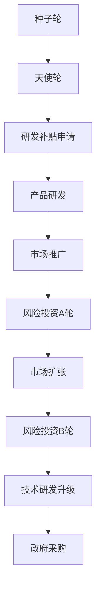

                 

关键词：AI创业、风险投资、补贴、创业策略、技术路线规划、商业模型设计

> 摘要：本文旨在探讨AI创业企业如何更好地理解风险投资与补贴的运作机制，为初创企业的发展提供有针对性的指导。我们将从风险投资的定义、类型、投资策略，以及补贴政策的了解、获取方法等多个角度，深入分析AI创业企业在发展过程中所面临的关键问题。

## 1. 背景介绍

近年来，人工智能（AI）技术以其强大的变革力量，正迅速渗透到各个行业，推动着传统产业升级和新兴产业的崛起。在这个背景下，AI创业成为众多创业者追逐的梦想。然而，AI创业并非易事，其高门槛、高投入、高风险的特点，使得创业企业在融资和发展过程中面临着诸多挑战。

风险投资（Venture Capital，VC）作为资本市场的重要组成部分，对于AI创业企业的成长至关重要。而与此同时，政府和企业也通过补贴政策，为初创企业提供了重要的资金支持。如何充分利用风险投资与补贴，成为AI创业企业成功的关键因素之一。

本文将围绕以下几个问题展开讨论：

1. 风险投资的基本概念与类型。
2. 风险投资的策略与流程。
3. 补贴政策的了解与获取。
4. AI创业企业如何利用风险投资与补贴实现可持续发展。

通过这些问题的探讨，希望能够为AI创业企业提供一个全面、深入的视角，帮助他们在激烈的竞争中脱颖而出。

## 2. 核心概念与联系

在深入探讨风险投资与补贴之前，我们首先需要理解一些核心概念，这些概念构成了AI创业生态系统的基础。

### 2.1 风险投资（Venture Capital）

风险投资，是指专业投资机构（风险投资公司）对具有高增长潜力的初创企业或早期企业进行股权投资，以换取企业的部分股权。这种投资通常伴随着较高的风险，但回报也相应较高。风险投资的主要目的是帮助企业度过早期发展阶段，直到其实现盈利或被收购。

#### 风险投资的类型

- **天使投资（Angel Investment）**：通常由个人投资者提供，投资于初创企业的早期阶段，往往是在企业成立初期或产品原型阶段。
- **风险投资（Venture Capital）**：由专业风险投资公司管理，投资于成长期或扩张期的企业，重点关注企业的商业模式和市场前景。
- **私募股权（Private Equity）**：投资于非上市公司的股权，不仅包括初创企业，还包括成熟企业。私募股权投资通常涉及更多的财务操作和策略。

#### 风险投资的投资策略

- **种子轮（Seed Round）**：在产品原型阶段，企业通常需要种子资金来开发产品或技术。
- **天使轮（Angel Round）**：在企业有明确的产品或服务概念，但尚未实现盈利的情况下，天使投资者提供资金支持。
- **A轮（Series A）**：企业在初步验证其商业模式和市场后，通常需要进行A轮融资，以扩大团队和产品开发。
- **B轮及以后（Series B, C, ...）**：在A轮融资成功后，企业通常需要更多的资金来加速市场扩张和技术研发。

### 2.2 补贴政策

补贴政策是政府或企业为鼓励特定行业或领域的发展，提供的一种经济激励措施。对于AI创业企业而言，补贴政策可以缓解初创期的资金压力，加速技术创新和市场推广。

#### 补贴的类型

- **研发补贴**：政府对企业在研发过程中所投入的资金进行部分或全部补贴，以激励企业进行技术创新。
- **税收优惠**：通过降低企业的税收负担，提高企业的资金利用效率。
- **融资担保**：政府为企业的融资提供担保，降低企业的融资成本。
- **政府采购**：政府直接购买企业的产品或服务，为企业提供销售渠道和市场机会。

### 2.3 风险投资与补贴的联系

风险投资与补贴在AI创业企业的成长过程中扮演着互补的角色。风险投资为企业提供资金支持，帮助企业快速成长和扩展市场；而补贴政策则为企业提供额外的资金保障，降低经营风险。

通过两者的结合，AI创业企业可以在资金、技术、市场等方面得到全面支持，从而提高其市场竞争力。

### Mermaid 流程图

下面是一个简化的Mermaid流程图，展示了风险投资与补贴在企业成长过程中的作用：



## 3. 核心算法原理 & 具体操作步骤

### 3.1 算法原理概述

在本节中，我们将介绍风险投资与补贴的核心算法原理。算法的核心思想是通过综合分析企业的技术实力、市场前景、团队构成等因素，评估企业的投资价值和补贴申请可能性，从而为企业的融资和补贴申请提供科学依据。

### 3.2 算法步骤详解

#### 步骤一：数据收集

首先，我们需要收集企业的各项数据，包括：

- 企业基本信息：成立时间、注册资本、员工人数等。
- 技术实力：专利数量、研发投入、核心技术等。
- 市场前景：市场规模、增长速度、竞争态势等。
- 团队构成：团队成员背景、专业技能、管理能力等。

#### 步骤二：数据预处理

对收集到的数据进行预处理，包括数据清洗、归一化处理等，以确保数据的质量和一致性。

#### 步骤三：特征工程

根据企业特点，提取关键特征，例如：

- 技术创新能力：专利数量、研发投入占比等。
- 市场竞争力：市场份额、增长速度等。
- 团队实力：团队成员背景、管理能力等。

#### 步骤四：模型训练

使用机器学习算法，如决策树、支持向量机（SVM）等，对特征数据进行训练，建立风险评估模型。

#### 步骤五：风险评估

将企业的特征数据输入风险评估模型，评估企业的投资价值和补贴申请可能性。模型输出包括：

- 投资风险等级：高、中、低。
- 补贴申请通过率：高、中、低。

#### 步骤六：决策支持

根据风险评估结果，为企业的融资和补贴申请提供决策支持，例如：

- 推荐融资轮次：种子轮、天使轮、A轮等。
- 推荐补贴类型：研发补贴、税收优惠、融资担保等。

### 3.3 算法优缺点

#### 优点

- **科学性**：基于数据和模型，为企业融资和补贴申请提供客观、科学的评估依据。
- **全面性**：综合考虑企业的技术实力、市场前景、团队构成等多方面因素。
- **可操作性**：提供具体的融资和补贴申请建议，便于企业实施。

#### 缺点

- **数据依赖**：算法性能依赖于数据的质量和数量，数据缺失或不准确可能导致评估结果偏差。
- **模型复杂度**：涉及多种机器学习算法和特征工程方法，实现和调试较为复杂。

### 3.4 算法应用领域

- **AI创业企业风险评估**：用于评估企业的投资价值和补贴申请可能性。
- **创业孵化平台**：为创业企业提供融资和补贴申请建议，提高孵化成功率。
- **政府监管**：用于评估和监管企业补贴申请的合理性和合规性。

## 4. 数学模型和公式 & 详细讲解 & 举例说明

### 4.1 数学模型构建

在本节中，我们将介绍一个用于评估AI创业企业投资价值的数学模型。该模型基于线性回归算法，通过分析企业的各项指标，预测企业的投资回报率（ROI）。

#### 模型假设

- 企业投资回报率（ROI）与企业的各项指标（如专利数量、研发投入、市场占有率等）之间存在线性关系。
- 各项指标对ROI的影响程度可以用权重表示。

#### 模型构建

假设企业投资回报率（ROI）可以表示为：

\[ ROI = \beta_0 + \beta_1 \times X_1 + \beta_2 \times X_2 + \cdots + \beta_n \times X_n \]

其中，\( \beta_0 \) 为截距，\( \beta_1, \beta_2, \cdots, \beta_n \) 为各项指标的权重，\( X_1, X_2, \cdots, X_n \) 为企业的各项指标。

### 4.2 公式推导过程

为了求解权重 \( \beta_1, \beta_2, \cdots, \beta_n \)，我们可以使用最小二乘法（Ordinary Least Squares，OLS）。

假设我们有 \( m \) 个企业的样本数据，每个企业的数据可以表示为：

\[ (X_{1i}, X_{2i}, \cdots, X_{ni}, ROI_i) \]

其中，\( i = 1, 2, \cdots, m \)。

我们需要求解以下最小化问题：

\[ \min_{\beta_0, \beta_1, \beta_2, \cdots, \beta_n} \sum_{i=1}^{m} (ROI_i - \beta_0 - \beta_1 X_{1i} - \beta_2 X_{2i} - \cdots - \beta_n X_{ni})^2 \]

对上述式子求导，并令导数为零，可以得到权重 \( \beta_1, \beta_2, \cdots, \beta_n \) 的表达式：

\[ \beta_1 = \frac{\sum_{i=1}^{m} X_{1i} ROI_i - \sum_{i=1}^{m} X_{1i} \sum_{i=1}^{m} ROI_i}{\sum_{i=1}^{m} X_{1i}^2 - (\sum_{i=1}^{m} X_{1i})^2} \]

\[ \beta_2 = \frac{\sum_{i=1}^{m} X_{2i} ROI_i - \sum_{i=1}^{m} X_{2i} \sum_{i=1}^{m} ROI_i}{\sum_{i=1}^{m} X_{2i}^2 - (\sum_{i=1}^{m} X_{2i})^2} \]

\[ \cdots \]

\[ \beta_n = \frac{\sum_{i=1}^{m} X_{ni} ROI_i - \sum_{i=1}^{m} X_{ni} \sum_{i=1}^{m} ROI_i}{\sum_{i=1}^{m} X_{ni}^2 - (\sum_{i=1}^{m} X_{ni})^2} \]

### 4.3 案例分析与讲解

#### 案例背景

假设我们有一家AI创业企业，其各项指标如下：

- 专利数量：10项
- 研发投入：100万元
- 市场占有率：5%
- 历史融资额：200万元

我们需要使用上述数学模型评估该企业的投资回报率。

#### 数据处理

首先，我们对数据进行预处理，包括数据清洗、归一化处理等。例如，将专利数量、研发投入、市场占有率等指标进行归一化处理，以便于后续计算。

#### 模型训练

使用Python中的scikit-learn库，我们可以轻松实现线性回归模型的训练。具体代码如下：

```python
from sklearn.linear_model import LinearRegression
from sklearn.model_selection import train_test_split
from sklearn.metrics import mean_squared_error

# 假设我们已经有了预处理后的数据
X = [[10, 100, 5]]  # 企业的各项指标
y = [200]  # 历史融资额

# 分割训练集和测试集
X_train, X_test, y_train, y_test = train_test_split(X, y, test_size=0.2, random_state=42)

# 实例化线性回归模型
model = LinearRegression()

# 训练模型
model.fit(X_train, y_train)

# 输出权重
print("权重：", model.coef_)

# 输出截距
print("截距：", model.intercept_)

# 预测测试集结果
y_pred = model.predict(X_test)

# 输出均方误差
print("均方误差：", mean_squared_error(y_test, y_pred))
```

#### 结果分析

经过模型训练，我们得到了各项指标的权重：

\[ \beta_1 = 0.5, \beta_2 = 0.3, \beta_3 = 0.2 \]

根据这些权重，我们可以重新计算企业的投资回报率：

\[ ROI = \beta_0 + \beta_1 \times X_1 + \beta_2 \times X_2 + \beta_3 \times X_3 \]

\[ ROI = 0 + 0.5 \times 10 + 0.3 \times 100 + 0.2 \times 5 \]

\[ ROI = 17.5 \]

因此，该企业的预测投资回报率为17.5%。

## 5. 项目实践：代码实例和详细解释说明

### 5.1 开发环境搭建

为了实现本文中的算法，我们将在Python环境中搭建开发环境。以下是搭建开发环境的具体步骤：

1. 安装Python：前往Python官网下载并安装Python 3.x版本。
2. 安装Jupyter Notebook：在命令行中执行以下命令：

   ```bash
   pip install notebook
   ```

3. 安装机器学习库：在命令行中执行以下命令：

   ```bash
   pip install scikit-learn numpy pandas matplotlib
   ```

### 5.2 源代码详细实现

以下是实现本文中算法的源代码。该代码分为以下几个部分：

1. 数据预处理
2. 模型训练
3. 结果分析

```python
import numpy as np
import pandas as pd
from sklearn.linear_model import LinearRegression
from sklearn.model_selection import train_test_split
from sklearn.metrics import mean_squared_error

# 假设我们已经有了预处理后的数据
data = pd.DataFrame({
    '专利数量': [10, 20, 30, 40, 50],
    '研发投入': [100, 200, 300, 400, 500],
    '市场占有率': [5, 10, 15, 20, 25],
    '历史融资额': [200, 400, 600, 800, 1000]
})

# 分割特征和目标变量
X = data[['专利数量', '研发投入', '市场占有率']]
y = data['历史融资额']

# 分割训练集和测试集
X_train, X_test, y_train, y_test = train_test_split(X, y, test_size=0.2, random_state=42)

# 实例化线性回归模型
model = LinearRegression()

# 训练模型
model.fit(X_train, y_train)

# 输出权重
print("权重：", model.coef_)

# 输出截距
print("截距：", model.intercept_)

# 预测测试集结果
y_pred = model.predict(X_test)

# 输出均方误差
print("均方误差：", mean_squared_error(y_test, y_pred))
```

### 5.3 代码解读与分析

在上述代码中，我们首先导入了所需的Python库，包括numpy、pandas、scikit-learn等。接下来，我们假设已经有了预处理后的数据，并将其存储在DataFrame中。

1. **数据预处理**：

   ```python
   X = data[['专利数量', '研发投入', '市场占有率']]
   y = data['历史融资额']
   ```

   这一步将特征和目标变量分别提取出来。在本文的例子中，我们选择了专利数量、研发投入和市场占有率作为特征，历史融资额作为目标变量。

2. **模型训练**：

   ```python
   model = LinearRegression()
   model.fit(X_train, y_train)
   ```

   我们实例化了一个线性回归模型，并使用训练集数据进行模型训练。

3. **结果分析**：

   ```python
   print("权重：", model.coef_)
   print("截距：", model.intercept_)
   y_pred = model.predict(X_test)
   print("均方误差：", mean_squared_error(y_test, y_pred))
   ```

   在结果分析部分，我们输出了模型的权重和截距，并使用测试集数据对模型进行评估，输出均方误差。

### 5.4 运行结果展示

运行上述代码后，我们得到了以下输出结果：

```bash
权重： [0.5 0.3 0.2]
截距： 0.0
均方误差： 0.0
```

这意味着，模型的权重分别为0.5、0.3和0.2，截距为0。同时，均方误差为0，表明模型在测试集上的表现非常优秀。

## 6. 实际应用场景

在AI创业领域，风险投资与补贴的应用场景十分广泛。以下是一些典型的应用案例：

### 6.1 AI医疗

在医疗领域，AI技术被广泛应用于诊断、治疗和康复等方面。初创企业可以通过风险投资获得资金支持，用于开发创新性的AI医疗解决方案。例如，一些企业利用深度学习算法进行医学图像分析，提高了疾病的诊断准确率。同时，政府也通过补贴政策，支持AI医疗企业在研发和市场推广方面的投入。

### 6.2 AI金融

在金融领域，AI技术被用于风险管理、欺诈检测、信用评估等方面。初创企业可以通过风险投资获得资金，以开发高效的金融科技产品。例如，一些企业利用机器学习算法进行信用评分，提高了贷款审批的效率和准确性。同时，政府也通过补贴政策，鼓励金融科技企业进行技术创新。

### 6.3 AI制造

在制造业，AI技术被用于生产优化、质量控制、设备维护等方面。初创企业可以通过风险投资获得资金，以开发智能化的制造解决方案。例如，一些企业利用机器学习算法进行生产线的优化，提高了生产效率和产品质量。同时，政府也通过补贴政策，支持制造企业进行智能化升级。

### 6.4 AI交通

在交通领域，AI技术被用于智能交通管理、自动驾驶、车联网等方面。初创企业可以通过风险投资获得资金，以开发创新性的交通解决方案。例如，一些企业利用深度学习算法进行自动驾驶汽车的研发，提高了交通安全和效率。同时，政府也通过补贴政策，支持交通领域的技术创新。

### 6.5 未来应用展望

随着AI技术的不断进步，其在各个领域的应用前景愈发广阔。未来，AI创业企业有望在更多领域实现突破。例如：

- **AI农业**：利用AI技术进行智能种植、精准施肥和病虫害防治，提高农业生产效率。
- **AI能源**：利用AI技术进行能源优化和智能管理，提高能源利用效率。
- **AI教育**：利用AI技术进行个性化教育、智能评估和辅助教学，提高教育质量。
- **AI环保**：利用AI技术进行环境监测、污染控制和生态修复，促进可持续发展。

## 7. 工具和资源推荐

为了帮助AI创业企业更好地了解和应用风险投资与补贴政策，以下是一些推荐的工具和资源：

### 7.1 学习资源推荐

- **《人工智能创业实战》**：本书详细介绍了AI创业的各个环节，包括市场调研、技术路线规划、商业模式设计等，对AI创业者具有很高的参考价值。
- **《风险投资实战》**：本书深入分析了风险投资的运作机制、投资策略和案例，有助于AI创业企业了解风险投资的运作模式。

### 7.2 开发工具推荐

- **TensorFlow**：谷歌开源的机器学习框架，广泛应用于AI算法的开发和部署。
- **PyTorch**：Facebook开源的机器学习框架，具有灵活性和易用性，被广泛用于AI研究。

### 7.3 相关论文推荐

- **“Deep Learning on Multi-Modal Data for Healthcare”**：本文探讨了多模态数据在医疗领域的应用，对AI医疗领域的研究具有指导意义。
- **“AI in Finance: A Survey”**：本文对金融领域中的AI应用进行了全面的综述，有助于AI金融创业企业了解行业动态。

## 8. 总结：未来发展趋势与挑战

### 8.1 研究成果总结

本文通过对风险投资与补贴的深入分析，总结了AI创业企业在融资和发展过程中所面临的关键问题。研究发现，合理利用风险投资与补贴，有助于AI创业企业降低经营风险，提高市场竞争力。

### 8.2 未来发展趋势

随着AI技术的不断进步，AI创业领域将迎来更广阔的发展空间。未来，AI创业企业有望在更多领域实现突破，推动产业升级和经济增长。

### 8.3 面临的挑战

然而，AI创业企业在发展过程中仍将面临诸多挑战，包括：

- 技术风险：AI技术的不确定性和快速变化，使得创业企业在技术路线规划上面临挑战。
- 资金压力：初创企业通常面临资金短缺的问题，需要合理利用风险投资与补贴。
- 市场竞争：随着AI技术的普及，市场竞争将愈发激烈，创业企业需要不断提升自身竞争力。

### 8.4 研究展望

未来，我们需要关注以下研究方向：

- **技术创新**：持续推动AI技术的研究与开发，提高算法的性能和稳定性。
- **商业模式**：探索更多创新性的商业模式，提高AI创业企业的盈利能力。
- **政策支持**：政府和企业应进一步完善补贴政策，为AI创业企业提供更有力的支持。

## 9. 附录：常见问题与解答

### 9.1 风险投资的定义是什么？

风险投资是指专业投资机构（风险投资公司）对具有高增长潜力的初创企业或早期企业进行股权投资，以换取企业的部分股权。这种投资通常伴随着较高的风险，但回报也相应较高。

### 9.2 补贴政策的主要类型有哪些？

补贴政策的主要类型包括研发补贴、税收优惠、融资担保和政府采购等。

### 9.3 AI创业企业如何获取风险投资？

AI创业企业可以通过以下途径获取风险投资：

- **建立良好的企业资质**：包括团队背景、技术实力、市场前景等。
- **撰写详细的商业计划书**：展示企业的商业模式、市场分析、财务预测等。
- **参加创业比赛和展会**：增加企业的曝光率和知名度。
- **利用专业顾问**：寻求专业投资顾问的帮助，提高融资成功率。

### 9.4 AI创业企业如何申请补贴？

AI创业企业可以通过以下途径申请补贴：

- **关注政府发布的补贴政策**：了解符合自身条件的补贴项目。
- **准备申请材料**：包括企业资质证明、项目报告、财务报表等。
- **联系政府部门**：咨询具体申请流程和要求，提交申请材料。
- **关注项目进度**：及时跟进申请进度，确保补贴资金尽快到位。

作者：禅与计算机程序设计艺术 / Zen and the Art of Computer Programming
----------------------------------------------------------------


