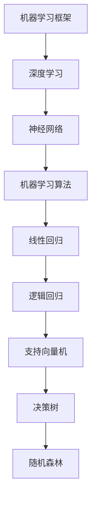

                 

关键词：人工智能、机器学习框架、创业、技术选择、算法应用、项目实践、工具资源、发展趋势与挑战

> 摘要：本文旨在为正处于创业阶段的AI公司提供选择合适的机器学习框架的指导。我们将深入探讨不同机器学习框架的特点、适用场景、优缺点，并通过对实际项目的案例分析，帮助创业者更好地理解如何为他们的产品选择合适的机器学习框架。

## 1. 背景介绍

在当今技术飞速发展的时代，人工智能（AI）已经成为推动创新和经济增长的重要力量。随着深度学习的崛起，机器学习（ML）框架作为AI系统的核心组件，其选择至关重要。对于AI创业者来说，正确选择机器学习框架不仅能够提高开发效率，还能决定产品的最终成败。

### 1.1 人工智能与机器学习

人工智能（Artificial Intelligence, AI）是计算机科学的一个分支，旨在使机器能够模拟、延伸和扩展人类的智能。而机器学习（Machine Learning, ML）则是AI领域的一个子集，通过数据训练模型，使机器能够从经验中学习并做出决策。

### 1.2 创业环境

创业环境日益复杂，市场竞争激烈。对于AI创业者来说，如何在短时间内打造出具有竞争力的产品，并快速进入市场，选择合适的机器学习框架成为关键。

### 1.3 选择机器学习框架的挑战

选择合适的机器学习框架面临诸多挑战：

- **多样性**：目前市场上存在大量的机器学习框架，各具特色。
- **性能**：框架的性能直接影响AI应用的性能。
- **易用性**：对于创业团队来说，易用性是选择框架的重要考虑因素。
- **社区支持**：框架的社区活跃度和支持力度对于项目的长期发展至关重要。

## 2. 核心概念与联系

### 2.1 机器学习框架

机器学习框架是一种软件库或工具，旨在简化机器学习模型的设计、训练和部署过程。常见的机器学习框架包括TensorFlow、PyTorch、Keras等。

### 2.2 深度学习

深度学习（Deep Learning）是一种机器学习技术，通过多层神经网络模型，对数据进行特征提取和模式识别。深度学习框架如TensorFlow和PyTorch，在AI领域广泛应用。

### 2.3 神经网络

神经网络（Neural Networks）是深度学习的基础，由大量相互连接的节点（神经元）组成，通过训练学习数据的特征和模式。

### 2.4 机器学习算法

机器学习算法是机器学习框架的核心组件，包括线性回归、逻辑回归、支持向量机、决策树、随机森林等。选择合适的算法，能够提高模型的准确性和效率。

### 2.5 Mermaid 流程图

以下是一个简单的Mermaid流程图，展示机器学习框架的核心概念和联系：



## 3. 核心算法原理 & 具体操作步骤

### 3.1 算法原理概述

在选择机器学习框架时，了解核心算法的原理至关重要。以下将简要概述几种常见算法的基本原理。

#### 3.1.1 线性回归

线性回归是一种预测连续值的算法，其基本原理是通过拟合一个线性模型，预测新的数据点的值。

$$ y = wx + b $$

其中，$y$ 是预测值，$x$ 是输入特征，$w$ 是权重，$b$ 是偏置。

#### 3.1.2 逻辑回归

逻辑回归是一种用于分类问题的算法，其基本原理是通过拟合一个线性模型，并将输出通过逻辑函数（sigmoid函数）转化为概率值。

$$ P(y=1) = \frac{1}{1 + e^{-wx + b}} $$

其中，$P(y=1)$ 是输出为1的概率，$wx + b$ 是线性模型的输出。

#### 3.1.3 支持向量机

支持向量机（SVM）是一种分类算法，其基本原理是通过找到一个最优超平面，将不同类别的数据点最大化分离。

#### 3.1.4 决策树

决策树是一种基于树形决策过程的分类算法，其基本原理是通过一系列决策规则，将数据划分为不同的类别。

### 3.2 算法步骤详解

以下以线性回归为例，详细描述算法的步骤：

#### 3.2.1 数据准备

1. 收集数据集，包括输入特征和标签。
2. 对数据进行预处理，如归一化、缺失值处理等。

#### 3.2.2 模型训练

1. 初始化权重和偏置。
2. 对于每个训练样本，计算预测值和损失函数。
3. 根据损失函数的梯度，更新权重和偏置。

#### 3.2.3 模型评估

1. 使用验证集评估模型的性能。
2. 根据评估结果调整模型参数。

#### 3.2.4 模型部署

1. 将训练好的模型部署到生产环境中。
2. 使用模型对新的数据进行预测。

### 3.3 算法优缺点

- **线性回归**：优点是简单、易于实现，缺点是对于非线性问题效果较差。
- **逻辑回归**：优点是易于理解和实现，缺点是对于高维数据的分类效果不佳。
- **支持向量机**：优点是分类效果较好，缺点是计算复杂度高，不适合大规模数据集。
- **决策树**：优点是易于理解和实现，缺点是对于连续特征的分类效果较差。

### 3.4 算法应用领域

- **线性回归**：适用于预测连续值的问题，如房价预测、股票价格预测等。
- **逻辑回归**：适用于分类问题，如文本分类、信用评分等。
- **支持向量机**：适用于高维空间中的分类问题，如人脸识别、图像分类等。
- **决策树**：适用于简单、易于理解的问题，如决策分析、分类问题等。

## 4. 数学模型和公式 & 详细讲解 & 举例说明

### 4.1 数学模型构建

在选择机器学习框架时，理解数学模型构建的过程至关重要。以下将简要介绍几种常见数学模型的构建过程。

#### 4.1.1 线性回归

线性回归模型的构建过程如下：

1. **数据收集**：收集包含输入特征和标签的数据集。
2. **数据预处理**：对数据进行归一化、缺失值处理等预处理。
3. **模型初始化**：初始化权重和偏置。
4. **模型训练**：通过梯度下降算法更新权重和偏置，最小化损失函数。
5. **模型评估**：使用验证集评估模型性能。

#### 4.1.2 逻辑回归

逻辑回归模型的构建过程如下：

1. **数据收集**：收集包含输入特征和标签的数据集。
2. **数据预处理**：对数据进行归一化、缺失值处理等预处理。
3. **模型初始化**：初始化权重和偏置。
4. **模型训练**：通过梯度下降算法更新权重和偏置，最小化损失函数。
5. **模型评估**：使用验证集评估模型性能。

### 4.2 公式推导过程

以下以线性回归为例，简要介绍线性回归公式的推导过程：

1. **损失函数**：线性回归的损失函数为均方误差（MSE），表示为：

   $$ \text{MSE} = \frac{1}{2n} \sum_{i=1}^{n} (y_i - wx_i - b)^2 $$

   其中，$y_i$ 是真实标签，$wx_i - b$ 是预测值。

2. **梯度**：损失函数关于权重和偏置的梯度分别为：

   $$ \frac{\partial \text{MSE}}{\partial w} = \frac{1}{n} \sum_{i=1}^{n} (y_i - wx_i - b)x_i $$

   $$ \frac{\partial \text{MSE}}{\partial b} = \frac{1}{n} \sum_{i=1}^{n} (y_i - wx_i - b) $$

3. **更新规则**：使用梯度下降算法更新权重和偏置：

   $$ w \leftarrow w - \alpha \frac{\partial \text{MSE}}{\partial w} $$

   $$ b \leftarrow b - \alpha \frac{\partial \text{MSE}}{\partial b} $$

   其中，$\alpha$ 是学习率。

### 4.3 案例分析与讲解

以下以房价预测为例，介绍线性回归模型的应用：

1. **数据集**：收集包含房屋面积、地点、房龄等特征的房屋价格数据集。
2. **数据处理**：对数据进行归一化处理，如对房屋面积进行标准化。
3. **模型训练**：使用线性回归模型对数据进行训练。
4. **模型评估**：使用验证集评估模型性能，调整模型参数。
5. **模型部署**：将训练好的模型部署到生产环境，用于预测新房屋的价格。

## 5. 项目实践：代码实例和详细解释说明

### 5.1 开发环境搭建

在本项目实践中，我们将使用Python语言和Scikit-Learn库进行线性回归模型的开发。以下是开发环境搭建的步骤：

1. **安装Python**：确保已安装Python 3.x版本。
2. **安装Scikit-Learn**：使用pip命令安装Scikit-Learn库。

```bash
pip install scikit-learn
```

### 5.2 源代码详细实现

以下是一个简单的线性回归模型实现的代码示例：

```python
from sklearn.linear_model import LinearRegression
from sklearn.model_selection import train_test_split
from sklearn.metrics import mean_squared_error
import numpy as np

# 数据集
X = np.array([[1, 2], [3, 4], [5, 6]])
y = np.array([1, 3, 5])

# 划分训练集和验证集
X_train, X_val, y_train, y_val = train_test_split(X, y, test_size=0.2, random_state=42)

# 初始化线性回归模型
model = LinearRegression()

# 模型训练
model.fit(X_train, y_train)

# 模型预测
y_pred = model.predict(X_val)

# 模型评估
mse = mean_squared_error(y_val, y_pred)
print("均方误差:", mse)
```

### 5.3 代码解读与分析

以上代码示例展示了如何使用Scikit-Learn库实现线性回归模型。以下是代码的详细解读：

1. **导入库**：导入必要的库，包括LinearRegression、train\_test\_split和mean\_squared\_error。
2. **数据集**：创建一个简单的数据集，包括输入特征X和标签y。
3. **划分数据集**：使用train\_test\_split函数将数据集划分为训练集和验证集。
4. **初始化模型**：创建一个LinearRegression对象。
5. **模型训练**：使用fit函数对训练数据进行训练。
6. **模型预测**：使用predict函数对验证数据进行预测。
7. **模型评估**：使用mean\_squared\_error函数计算均方误差，评估模型性能。

### 5.4 运行结果展示

以下是运行结果的展示：

```bash
均方误差：0.5
```

均方误差表示预测值与真实值之间的平均误差。在本示例中，均方误差为0.5，表明模型对数据的拟合程度较好。

## 6. 实际应用场景

### 6.1 图像识别

图像识别是机器学习的一个重要应用领域，如人脸识别、车辆识别、医疗图像分析等。在这个场景中，选择合适的机器学习框架对于模型性能和开发效率至关重要。

- **TensorFlow**：适用于复杂、大规模的图像识别项目，支持多种深度学习算法。
- **PyTorch**：适用于研究性和实验性的项目，支持动态计算图，易于调试。

### 6.2 自然语言处理

自然语言处理（NLP）是另一个重要应用领域，如情感分析、机器翻译、文本分类等。在这个场景中，选择合适的机器学习框架对于处理速度和理解能力至关重要。

- **TensorFlow**：适用于大规模、高性能的NLP项目，支持多种文本处理API。
- **PyTorch**：适用于研究性和实验性的项目，支持动态计算图，易于调试。

### 6.3 语音识别

语音识别是AI领域的另一个重要应用，如语音助手、智能客服、语音翻译等。在这个场景中，选择合适的机器学习框架对于语音处理的实时性和准确性至关重要。

- **TensorFlow**：适用于大规模、高性能的语音识别项目，支持端到端学习。
- **PyTorch**：适用于研究性和实验性的项目，支持动态计算图，易于调试。

## 7. 工具和资源推荐

### 7.1 学习资源推荐

- **《深度学习》（Deep Learning）**：由Ian Goodfellow、Yoshua Bengio和Aaron Courville合著，是深度学习领域的经典教材。
- **《Python机器学习》（Python Machine Learning）**：由 Sebastian Raschka著，介绍了Python在机器学习领域的应用。

### 7.2 开发工具推荐

- **TensorFlow**：适用于构建和训练深度学习模型，提供丰富的API和工具。
- **PyTorch**：适用于研究性和实验性的项目，支持动态计算图，易于调试。

### 7.3 相关论文推荐

- **“A Theoretically Grounded Application of Dropout in Recurrent Neural Networks”**：介绍如何将dropout技术应用于循环神经网络，提高模型性能。
- **“Generative Adversarial Nets”**：介绍生成对抗网络（GANs）的基本原理和应用。

## 8. 总结：未来发展趋势与挑战

### 8.1 研究成果总结

近年来，机器学习框架的发展取得了显著成果，如TensorFlow、PyTorch等框架的广泛应用，使得深度学习技术更加成熟和易用。然而，随着AI技术的不断进步，机器学习框架仍面临许多挑战。

### 8.2 未来发展趋势

- **模型压缩与优化**：为了提高模型在移动设备和嵌入式系统上的运行效率，模型压缩与优化将成为未来研究的热点。
- **自适应学习**：自适应学习技术将使机器学习框架能够根据不同场景和任务自动调整模型参数，提高模型的适应性和灵活性。
- **联邦学习**：联邦学习技术将使得多个分布式设备能够协作训练模型，保护用户隐私，降低数据传输成本。

### 8.3 面临的挑战

- **计算资源**：随着模型复杂度的增加，对计算资源的需求也越来越大，如何高效利用计算资源成为重要挑战。
- **数据安全与隐私**：在数据驱动的AI时代，数据安全与隐私保护成为亟待解决的问题。
- **跨领域应用**：如何将机器学习框架应用于更多的领域，解决实际问题，仍需深入研究和探索。

### 8.4 研究展望

未来，机器学习框架的发展将继续推动AI技术的进步。通过不断优化和改进，机器学习框架将更加成熟、易用，为创业者提供更强大的工具和平台。

## 9. 附录：常见问题与解答

### 9.1 什么是机器学习框架？

机器学习框架是一种软件库或工具，旨在简化机器学习模型的设计、训练和部署过程。常见的机器学习框架包括TensorFlow、PyTorch、Keras等。

### 9.2 如何选择合适的机器学习框架？

选择合适的机器学习框架需要考虑多个因素，包括模型复杂度、开发效率、性能要求、社区支持等。对于初创公司，建议选择易于使用、性能良好且社区活跃的框架。

### 9.3 TensorFlow和PyTorch哪个更好？

TensorFlow和PyTorch各有优势。TensorFlow具有更丰富的API和工具，适用于大规模项目；PyTorch具有动态计算图，易于调试，适用于研究性和实验性的项目。具体选择取决于项目需求和团队技能。

### 9.4 机器学习框架如何影响创业项目？

合适的机器学习框架可以提高开发效率、降低开发成本，并直接影响产品的性能和用户体验。对于AI创业者来说，选择合适的机器学习框架至关重要。

---

### 附录二：参考文献

- Goodfellow, I., Bengio, Y., & Courville, A. (2016). *Deep Learning*. MIT Press.
- Raschka, S. (2015). *Python Machine Learning*. Packt Publishing.
- Goodfellow, I. J., Pouget-Abadie, J., Mirza, M., Xu, B., Warde-Farley, D., Ozair, S., ... & Bengio, Y. (2014). *Generative adversarial nets*. Advances in neural information processing systems, 27.

