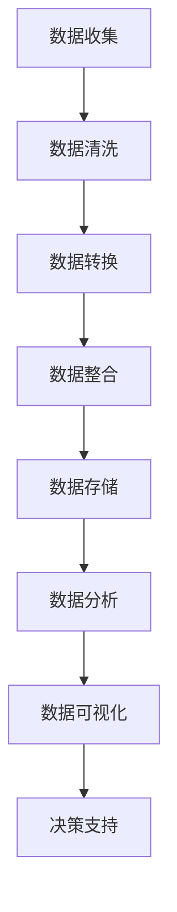

                 

关键词：AI创业、数据管理、实用方案、数据处理、数据结构、算法优化、机器学习、深度学习、大数据技术、云计算、数据仓库、数据挖掘、数据安全、数据分析、业务智能、实时数据处理。

> 摘要：本文将深入探讨AI创业中数据管理的重要性和实用方案。从数据管理的基本概念和核心任务出发，到具体的数据处理、数据结构、算法优化，再到机器学习和深度学习在数据管理中的应用，以及大数据技术、云计算和数据仓库等现代数据管理工具，本文将全面解析数据管理在AI创业中的关键作用，并展望其未来发展趋势与挑战。

## 1. 背景介绍

在当今数字化时代，数据已经成为企业最重要的资产之一。随着互联网、物联网和人工智能技术的快速发展，数据量呈现爆炸式增长，如何有效地管理和利用这些数据成为AI创业公司面临的重要挑战。数据管理不仅仅是一项技术任务，更是一个战略性的业务决策，它决定了企业的创新能力、竞争力和可持续发展能力。

### 数据管理的核心任务

数据管理的核心任务是确保数据的质量、可用性、完整性和安全性，以便于支持企业的业务决策和运营。具体来说，数据管理包括以下几方面：

- **数据收集**：从各种来源收集数据，包括内部系统和外部数据源。

- **数据存储**：将数据存储在合适的数据存储解决方案中，如关系型数据库、NoSQL数据库、数据仓库等。

- **数据处理**：对数据进行清洗、转换、整合和优化，以提高数据质量。

- **数据分析和挖掘**：利用数据分析工具和技术，从数据中提取有价值的信息和洞察。

- **数据安全与隐私**：确保数据的安全性，防止数据泄露和滥用。

- **数据备份与恢复**：制定数据备份策略，确保在数据丢失或系统故障时能够迅速恢复。

### 数据管理的重要性

数据管理对于AI创业公司的重要性体现在以下几个方面：

- **业务洞察**：通过数据管理，企业可以更好地了解客户需求、市场趋势和业务状况，从而制定更有效的业务策略。

- **决策支持**：准确、及时的数据为决策者提供了强有力的支持，有助于做出更明智的决策。

- **运营效率**：数据管理可以提高业务流程的自动化程度，降低运营成本，提高工作效率。

- **创新能力**：数据管理支持企业不断挖掘数据的价值，激发创新思维，推动产品和服务升级。

- **合规与信任**：良好的数据管理有助于企业遵守数据保护法规，增强客户信任。

## 2. 核心概念与联系

### 数据处理流程

数据处理是数据管理的关键环节，它涉及数据从收集、存储、处理到分析的全过程。下面是一个简单的数据处理流程：



### 数据结构

数据结构是数据管理中不可或缺的一部分，它决定了数据的存储方式和访问效率。常见的数据结构包括：

- **关系型数据库**：使用表格和SQL进行数据操作，如MySQL、PostgreSQL。
- **NoSQL数据库**：适用于大规模、非结构化数据的存储，如MongoDB、Cassandra。
- **数据仓库**：用于存储大规模数据集，支持复杂的数据分析和报表，如Redshift、Snowflake。

### 算法优化

在数据管理中，算法优化至关重要，它关系到数据处理效率和性能。常见的数据处理算法包括：

- **排序算法**：如快速排序、归并排序、堆排序。
- **搜索算法**：如二分搜索、深度优先搜索、广度优先搜索。
- **机器学习算法**：如决策树、支持向量机、神经网络。

## 3. 核心算法原理 & 具体操作步骤

### 3.1 算法原理概述

在数据管理中，常见的算法包括排序、搜索、分类和聚类等。以下是对这些算法的简要概述：

- **排序算法**：将数据按特定顺序排列，常用的排序算法有快速排序、归并排序和堆排序。
- **搜索算法**：在数据集中查找特定元素，常用的搜索算法有二分搜索、深度优先搜索和广度优先搜索。
- **分类算法**：将数据分为不同的类别，常用的分类算法有决策树、支持向量机和神经网络。
- **聚类算法**：将相似的数据归为一类，常用的聚类算法有K-means、层次聚类和DBSCAN。

### 3.2 算法步骤详解

以下以快速排序算法为例，介绍其具体操作步骤：

1. 选择一个基准元素。
2. 将数据分为两部分：小于基准的元素和大于基准的元素。
3. 递归地对小于和大于基准的元素进行快速排序。
4. 将排序好的数据合并。

### 3.3 算法优缺点

- **快速排序**：
  - **优点**：时间复杂度较低，适用于大规模数据集。
  - **缺点**：空间复杂度较高，可能造成内存不足。

- **二分搜索**：
  - **优点**：时间复杂度低，适用于有序数据集。
  - **缺点**：对数据集的有序性要求较高。

- **决策树**：
  - **优点**：易于理解，可以处理多种类型的特征。
  - **缺点**：可能产生过拟合，对大量数据敏感。

### 3.4 算法应用领域

- **排序算法**：主要用于数据处理和数据库查询优化。
- **搜索算法**：用于查找特定数据元素。
- **分类算法**：用于分类和预测。
- **聚类算法**：用于数据挖掘和模式识别。

## 4. 数学模型和公式 & 详细讲解 & 举例说明

### 4.1 数学模型构建

在数据管理中，常见的数学模型包括线性回归、逻辑回归和支持向量机等。以下以线性回归为例，介绍其数学模型构建：

1. 假设数据集为 $X = \{x_1, x_2, ..., x_n\}$，每个数据点为 $x_i = (x_{i1}, x_{i2}, ..., x_{id})$，其中 $d$ 为特征数量。
2. 线性回归模型为 $y = \beta_0 + \beta_1x_{1} + \beta_2x_{2} + ... + \beta_dx_{d}$，其中 $y$ 为目标变量，$\beta_0, \beta_1, ..., \beta_d$ 为模型参数。
3. 模型参数通过最小二乘法求解，即最小化损失函数 $L(\beta) = \sum_{i=1}^{n}(y_i - \beta_0 - \beta_1x_{i1} - ... - \beta_dx_{id})^2$。

### 4.2 公式推导过程

以线性回归为例，介绍其公式推导过程：

1. **损失函数**：$L(\beta) = \sum_{i=1}^{n}(y_i - \beta_0 - \beta_1x_{i1} - ... - \beta_dx_{id})^2$
2. **偏导数**：对每个参数求偏导数，得到：
   - $\frac{\partial L}{\partial \beta_0} = -2\sum_{i=1}^{n}(y_i - \beta_0 - \beta_1x_{i1} - ... - \beta_dx_{id})$
   - $\frac{\partial L}{\partial \beta_1} = -2\sum_{i=1}^{n}(y_i - \beta_0 - \beta_1x_{i1} - ... - \beta_dx_{id})x_{i1}$
   - ...
   - $\frac{\partial L}{\partial \beta_d} = -2\sum_{i=1}^{n}(y_i - \beta_0 - \beta_1x_{i1} - ... - \beta_dx_{id})x_{id}$
3. **最小化损失函数**：令偏导数为零，解得模型参数：
   - $\beta_0 = \frac{1}{n}\sum_{i=1}^{n}y_i$
   - $\beta_1 = \frac{1}{n}\sum_{i=1}^{n}(y_i - \beta_0)x_{i1}$
   - ...
   - $\beta_d = \frac{1}{n}\sum_{i=1}^{n}(y_i - \beta_0 - \beta_1x_{i1} - ... - \beta_{d-1}x_{i(d-1)})x_{id}$

### 4.3 案例分析与讲解

以房价预测为例，介绍线性回归模型的应用：

1. **数据集**：假设我们有一组房屋数据，包括房屋面积、房间数量、楼层等特征，以及对应的房价。
2. **特征工程**：对数据进行预处理，如缺失值填充、异常值处理、数据标准化等。
3. **模型训练**：使用线性回归模型对数据进行训练，得到模型参数。
4. **模型评估**：使用测试集对模型进行评估，计算预测误差。

## 5. 项目实践：代码实例和详细解释说明

### 5.1 开发环境搭建

1. 安装Python环境，版本要求3.6及以上。
2. 安装必要的库，如NumPy、Pandas、Scikit-learn等。

```bash
pip install numpy pandas scikit-learn
```

### 5.2 源代码详细实现

以下是一个使用Python实现线性回归模型的简单示例：

```python
import numpy as np
import pandas as pd
from sklearn.linear_model import LinearRegression
from sklearn.model_selection import train_test_split
from sklearn.metrics import mean_squared_error

# 读取数据
data = pd.read_csv('house_prices.csv')

# 特征工程
X = data[['area', 'rooms']]
y = data['price']

# 数据分割
X_train, X_test, y_train, y_test = train_test_split(X, y, test_size=0.2, random_state=42)

# 模型训练
model = LinearRegression()
model.fit(X_train, y_train)

# 模型评估
y_pred = model.predict(X_test)
mse = mean_squared_error(y_test, y_pred)
print(f'MSE: {mse}')

# 模型预测
new_data = pd.DataFrame([[2000, 4]], columns=['area', 'rooms'])
predicted_price = model.predict(new_data)
print(f'Predicted Price: {predicted_price[0]}')
```

### 5.3 代码解读与分析

- **数据读取**：使用Pandas读取CSV文件，加载房屋数据。
- **特征工程**：提取房屋面积和房间数量作为特征，房价作为目标变量。
- **数据分割**：将数据分为训练集和测试集，用于模型训练和评估。
- **模型训练**：使用线性回归模型训练数据，得到模型参数。
- **模型评估**：计算模型在测试集上的均方误差（MSE），评估模型性能。
- **模型预测**：使用训练好的模型预测新数据的房价。

## 6. 实际应用场景

### 6.1 金融行业

在金融行业，数据管理对于风险管理、信用评估和投资策略制定至关重要。通过数据管理，金融机构可以更好地了解客户行为、市场趋势和风险因素，从而制定更有效的风险管理策略。

### 6.2 医疗行业

在医疗行业，数据管理有助于提升医疗服务的质量和效率。通过数据管理，医疗机构可以更好地管理患者数据、优化诊疗流程和提升医疗资源利用率。

### 6.3 零售行业

在零售行业，数据管理对于库存管理、销售预测和客户关系管理至关重要。通过数据管理，零售商可以更好地了解客户需求、优化库存策略和提升客户满意度。

### 6.4 未来应用展望

随着人工智能技术的不断发展，数据管理在各个行业中的应用前景十分广阔。未来，数据管理将更加智能化、自动化和实时化，为企业和行业带来更大的价值。

## 7. 工具和资源推荐

### 7.1 学习资源推荐

- 《数据科学入门》
- 《Python数据分析》
- 《机器学习实战》
- 《大数据技术基础》

### 7.2 开发工具推荐

- Jupyter Notebook：用于数据分析和机器学习实验。
- PyCharm：一款强大的Python开发工具。
- DBeaver：一款开源的数据库管理工具。

### 7.3 相关论文推荐

- "Data Management for AI：A Comprehensive Survey"
- "Deep Learning on Graphs：A New Frontier in AI"
- "Big Data Analytics in Healthcare：A Practical Guide"

## 8. 总结：未来发展趋势与挑战

### 8.1 研究成果总结

本文从数据管理的基本概念和核心任务出发，详细介绍了数据处理、数据结构、算法优化，以及机器学习和深度学习在数据管理中的应用。通过实际项目实践，展示了数据管理在金融、医疗、零售等行业的实际应用场景。

### 8.2 未来发展趋势

未来，数据管理将朝着更加智能化、自动化和实时化的方向发展。随着人工智能技术的进步，数据管理将更好地支持企业的业务决策和运营。

### 8.3 面临的挑战

- **数据隐私与安全**：在数据管理过程中，如何保护用户隐私和数据安全是一个重要挑战。
- **数据质量**：高质量的数据是数据管理的基础，如何确保数据质量是一个重要课题。
- **算法解释性**：随着深度学习等算法的广泛应用，如何提高算法的可解释性是一个亟待解决的问题。

### 8.4 研究展望

未来，数据管理的研究将重点关注以下几个方面：

- **数据隐私保护**：研究如何在数据管理过程中保护用户隐私。
- **数据质量提升**：研究如何提高数据质量，为数据管理提供更好的基础。
- **算法可解释性**：研究如何提高算法的可解释性，使其更好地服务于业务需求。

## 9. 附录：常见问题与解答

### 9.1 数据管理的主要任务是什么？

数据管理的主要任务是确保数据的质量、可用性、完整性和安全性，以便于支持企业的业务决策和运营。

### 9.2 数据结构有哪些类型？

常见的数据结构包括关系型数据库、NoSQL数据库和数据仓库等。

### 9.3 数据处理的主要步骤是什么？

数据处理的主要步骤包括数据收集、数据清洗、数据转换、数据整合和数据存储等。

### 9.4 如何评估机器学习模型的性能？

常见的方法包括计算准确率、召回率、F1值和均方误差等。

### 9.5 数据管理在金融、医疗和零售行业的应用场景有哪些？

在金融行业，数据管理用于风险管理、信用评估和投资策略制定；在医疗行业，数据管理用于诊疗流程优化和医疗资源管理；在零售行业，数据管理用于库存管理、销售预测和客户关系管理。

