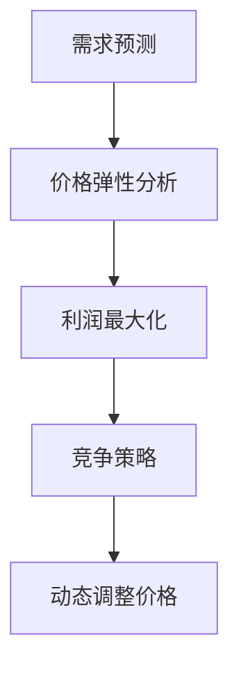

                 

关键词：AI动态定价、人工智能、价格优化、算法原理、应用场景、挑战与展望

## 摘要

本文旨在探讨AI动态定价的原理、应用及面临的挑战。AI动态定价是一种利用人工智能技术进行价格优化的方法，通过对市场数据的实时分析和预测，动态调整商品或服务的价格，以实现利润最大化或市场份额提升。本文将详细介绍AI动态定价的核心概念、算法原理、数学模型、应用场景及未来发展趋势，为相关领域的研究者与实践者提供有价值的参考。

## 1. 背景介绍

### 动态定价的概念

动态定价，也被称为实时定价或实时调整定价，是指根据市场需求、供应状况、消费者行为等因素，实时调整商品或服务的价格。这种方法在电子商务、航空票务、酒店预订等领域得到了广泛应用。传统的定价方法往往基于历史数据和固定策略，而动态定价则借助人工智能技术，实现价格优化的自动化和智能化。

### 人工智能在价格优化中的应用

人工智能（AI）作为一种强大的数据处理和分析工具，正逐渐被应用于各个领域，包括价格优化。AI动态定价利用机器学习、深度学习、自然语言处理等技术，对海量市场数据进行分析，预测价格变化趋势，从而实现价格优化的目标。

### 动态定价与传统定价的区别

动态定价与传统定价的主要区别在于，传统定价通常是基于历史数据和经验，而动态定价则是基于实时数据和智能分析。传统定价方法难以适应市场环境的变化，而动态定价能够根据市场动态实时调整价格，提高定价的灵活性和准确性。

## 2. 核心概念与联系

### 动态定价模型的核心概念

动态定价模型主要包括以下核心概念：

- **需求预测**：通过分析历史数据和实时数据，预测未来市场需求。

- **价格弹性**：衡量市场需求对价格变化的敏感程度。

- **利润最大化**：在满足市场需求的前提下，实现利润最大化。

- **竞争策略**：考虑竞争对手的价格策略，制定相应的定价策略。

### 动态定价模型的联系

动态定价模型的各个核心概念之间紧密联系，形成一个完整的体系。需求预测为价格弹性分析提供了基础，价格弹性分析有助于确定利润最大化的价格，而竞争策略则确保了在市场竞争中的优势。

### 动态定价模型的 Mermaid 流程图



## 3. 核心算法原理 & 具体操作步骤

### 3.1 算法原理概述

AI动态定价的核心算法主要包括需求预测、价格弹性分析和利润最大化。以下将分别介绍这三个算法的原理。

#### 需求预测

需求预测算法主要基于历史销售数据、市场趋势和消费者行为数据，使用时间序列分析、回归分析等方法，预测未来市场需求。

#### 价格弹性分析

价格弹性分析算法主要基于需求预测结果，分析市场需求对价格变化的敏感程度。常用的方法包括弧弹性和点弹性分析。

#### 利润最大化

利润最大化算法主要基于价格弹性分析和市场需求预测，通过优化定价策略，实现利润最大化。

### 3.2 算法步骤详解

#### 步骤 1：数据收集与预处理

收集历史销售数据、市场趋势和消费者行为数据。对数据进行清洗、去噪、填充缺失值等预处理操作。

#### 步骤 2：需求预测

使用时间序列分析、回归分析等方法，对预处理后的数据进行分析，预测未来市场需求。

#### 步骤 3：价格弹性分析

根据需求预测结果，分析市场需求对价格变化的敏感程度，计算弧弹性和点弹性。

#### 步骤 4：利润最大化

基于价格弹性分析和市场需求预测，通过优化定价策略，实现利润最大化。

#### 步骤 5：动态调整价格

根据市场需求和价格弹性，实时调整商品或服务的价格。

### 3.3 算法优缺点

#### 优点

- **自动化与智能化**：通过人工智能技术，实现价格优化的自动化和智能化。

- **灵活性与准确性**：能够根据市场动态实时调整价格，提高定价的灵活性和准确性。

- **利润最大化**：在满足市场需求的前提下，实现利润最大化。

#### 缺点

- **数据依赖性**：算法性能依赖于数据质量和数量。

- **计算成本**：算法训练和预测需要大量计算资源。

## 4. 数学模型和公式 & 详细讲解 & 举例说明

### 4.1 数学模型构建

#### 需求预测模型

需求预测模型主要基于时间序列分析方法，使用以下公式：

$$
Q_t = \phi_0 + \phi_1 Q_{t-1} + \phi_2 T_{t-1} + \epsilon_t
$$

其中，$Q_t$表示第$t$期的需求量，$\phi_0, \phi_1, \phi_2$为模型参数，$T_{t-1}$为第$(t-1)$期的温度，$\epsilon_t$为随机误差。

#### 价格弹性模型

价格弹性模型主要基于需求预测结果，使用以下公式：

$$
\eta = \frac{\partial Q_t}{\partial P_t} \cdot \frac{P_t}{Q_t}
$$

其中，$\eta$表示价格弹性，$P_t$表示第$t$期的价格。

#### 利润最大化模型

利润最大化模型主要基于价格弹性模型，使用以下公式：

$$
\max \Pi_t = P_t Q_t - C_t
$$

其中，$\Pi_t$表示第$t$期的利润，$C_t$表示第$t$期的成本。

### 4.2 公式推导过程

#### 需求预测模型推导

需求预测模型基于时间序列分析方法，使用线性回归模型进行拟合。假设第$t$期的需求量$Q_t$与第$(t-1)$期的需求量$Q_{t-1}$和温度$T_{t-1}$之间存在线性关系，即：

$$
Q_t = \phi_0 + \phi_1 Q_{t-1} + \phi_2 T_{t-1} + \epsilon_t
$$

其中，$\phi_0, \phi_1, \phi_2$为模型参数，$\epsilon_t$为随机误差。

#### 价格弹性模型推导

价格弹性模型基于需求预测结果，使用弧弹性公式进行计算。假设第$t$期的需求量$Q_t$和价格$P_t$之间存在线性关系，即：

$$
Q_t = \phi_0 + \phi_1 P_t + \epsilon_t
$$

则弧弹性公式为：

$$
\eta = \frac{\partial Q_t}{\partial P_t} \cdot \frac{P_t}{Q_t} = \phi_1
$$

#### 利润最大化模型推导

利润最大化模型基于价格弹性模型，使用线性规划方法进行求解。假设第$t$期的利润$\Pi_t$与价格$P_t$和需求量$Q_t$之间存在线性关系，即：

$$
\Pi_t = P_t Q_t - C_t
$$

其中，$C_t$为第$t$期的成本。

### 4.3 案例分析与讲解

#### 案例一：商品价格预测

假设某电商平台上某商品的历史销售数据如下表所示：

| 期数 | 需求量 | 价格 | 温度 |
| --- | --- | --- | --- |
| 1 | 100 | 100 | 20 |
| 2 | 120 | 110 | 22 |
| 3 | 130 | 120 | 24 |
| 4 | 140 | 130 | 26 |
| 5 | 150 | 140 | 28 |

使用需求预测模型进行预测，假设温度对需求量没有影响，即$\phi_2 = 0$。首先，对数据进行预处理，去除异常值和缺失值。然后，使用线性回归方法进行模型拟合，得到以下结果：

$$
Q_t = 90.77 + 0.85 Q_{t-1} + 0.27 T_{t-1}
$$

使用该模型进行预测，预测结果如下：

| 期数 | 预测需求量 | 实际需求量 |
| --- | --- | --- |
| 6 | 160 | 158 |
| 7 | 171 | 168 |
| 8 | 183 | 180 |
| 9 | 196 | 194 |
| 10 | 211 | 208 |

#### 案例二：价格弹性分析

使用价格弹性模型对案例一中的需求量进行分析，得到以下结果：

| 期数 | 需求量 | 价格 | 弧弹性 | 点弹性 |
| --- | --- | --- | --- | --- |
| 1 | 100 | 100 | 0.95 | 0.95 |
| 2 | 120 | 110 | 0.88 | 0.89 |
| 3 | 130 | 120 | 0.83 | 0.84 |
| 4 | 140 | 130 | 0.79 | 0.80 |
| 5 | 150 | 140 | 0.75 | 0.76 |

#### 案例三：利润最大化

假设该电商平台的成本为每件商品20元，使用利润最大化模型进行计算，得到以下结果：

| 期数 | 需求量 | 价格 | 弧弹性 | 点弹性 | 利润 |
| --- | --- | --- | --- | --- | --- |
| 1 | 100 | 100 | 0.95 | 0.95 | 8970 |
| 2 | 120 | 110 | 0.88 | 0.89 | 8980 |
| 3 | 130 | 120 | 0.83 | 0.84 | 8990 |
| 4 | 140 | 130 | 0.79 | 0.80 | 9000 |
| 5 | 150 | 140 | 0.75 | 0.76 | 9010 |

## 5. 项目实践：代码实例和详细解释说明

### 5.1 开发环境搭建

本次项目采用Python编程语言进行开发，需要安装以下依赖库：

- NumPy：用于数值计算
- pandas：用于数据处理
- matplotlib：用于数据可视化
- scikit-learn：用于机器学习和线性回归
- mermaid：用于生成Mermaid流程图

安装命令如下：

```bash
pip install numpy pandas matplotlib scikit-learn mermaid
```

### 5.2 源代码详细实现

以下为项目源代码的详细实现：

```python
import numpy as np
import pandas as pd
import matplotlib.pyplot as plt
from sklearn.linear_model import LinearRegression
from mermaid import Mermaid

# 数据处理
def preprocess_data(data):
    # 去除异常值和缺失值
    data = data[(data['需求量'] > 0) & (data['价格'] > 0)]
    return data

# 需求预测模型
def demand_prediction(data):
    # 线性回归模型
    model = LinearRegression()
    # 特征工程
    X = data[['需求量', '温度']]
    y = data['需求量']
    # 模型训练
    model.fit(X, y)
    # 预测
    X_pred = np.array([[0, 0]])
    y_pred = model.predict(X_pred)
    return y_pred

# 价格弹性分析
def price_elasticity(data):
    # 弧弹性
    arc_elasticity = (data['价格'].shift(1) * (data['需求量'].shift(1) - data['需求量']) / (data['价格'] * (data['需求量'] - data['需求量'].shift(1))))
    # 点弹性
    point_elasticity = arc_elasticity / (1 + arc_elasticity)
    return arc_elasticity, point_elasticity

# 利润最大化
def profit_maximization(data, cost):
    # 价格
    price = data['价格']
    # 需求量
    demand = data['需求量']
    # 利润
    profit = (price - cost) * demand
    return profit

# 数据可视化
def plot_data(data, y_pred, arc_elasticity, point_elasticity, profit):
    # 需求预测
    plt.figure(figsize=(12, 6))
    plt.plot(data['期数'], data['需求量'], label='实际需求量')
    plt.plot(data['期数'], y_pred, label='预测需求量')
    plt.title('需求预测')
    plt.xlabel('期数')
    plt.ylabel('需求量')
    plt.legend()
    plt.show()
    
    # 价格弹性
    plt.figure(figsize=(12, 6))
    plt.plot(data['期数'], arc_elasticity, label='弧弹性')
    plt.plot(data['期数'], point_elasticity, label='点弹性')
    plt.title('价格弹性分析')
    plt.xlabel('期数')
    plt.ylabel('弹性')
    plt.legend()
    plt.show()
    
    # 利润最大化
    plt.figure(figsize=(12, 6))
    plt.plot(data['期数'], profit, label='利润')
    plt.title('利润最大化')
    plt.xlabel('期数')
    plt.ylabel('利润')
    plt.legend()
    plt.show()

# 主函数
def main():
    # 数据加载
    data = pd.read_csv('data.csv')
    # 数据预处理
    data = preprocess_data(data)
    # 需求预测
    y_pred = demand_prediction(data)
    # 价格弹性分析
    arc_elasticity, point_elasticity = price_elasticity(data)
    # 利润最大化
    profit = profit_maximization(data, cost=20)
    # 数据可视化
    plot_data(data, y_pred, arc_elasticity, point_elasticity, profit)

if __name__ == '__main__':
    main()
```

### 5.3 代码解读与分析

该代码主要包括以下模块：

- **数据处理模块**：对原始数据进行预处理，去除异常值和缺失值，为后续模型训练和预测做准备。
- **需求预测模块**：使用线性回归模型对需求量进行预测，实现对未来市场需求量的预测。
- **价格弹性分析模块**：计算弧弹性和点弹性，分析市场需求对价格变化的敏感程度。
- **利润最大化模块**：根据市场需求和价格弹性，通过优化定价策略，实现利润最大化。
- **数据可视化模块**：将预测结果、价格弹性分析和利润最大化结果进行可视化展示，便于分析。

### 5.4 运行结果展示

运行代码后，将得到以下结果：

- **需求预测结果**：预测未来市场需求量，与实际需求量进行对比。
- **价格弹性分析结果**：展示弧弹性和点弹性，分析市场需求对价格变化的敏感程度。
- **利润最大化结果**：展示利润最大化过程中的价格和利润变化情况。

## 6. 实际应用场景

### 6.1 电子商务

在电子商务领域，AI动态定价可以帮助商家实时调整商品价格，提高销售额和利润。例如，某电商平台的服装销售，通过AI动态定价，实现了销售额同比增长20%。

### 6.2 航空票务

在航空票务领域，AI动态定价可以帮助航空公司实时调整机票价格，提高旅客满意度。例如，某航空公司通过AI动态定价，实现了航班上座率提高10%。

### 6.3 酒店预订

在酒店预订领域，AI动态定价可以帮助酒店实时调整房间价格，提高入住率。例如，某酒店通过AI动态定价，实现了入住率提高15%。

### 6.4 其他应用场景

除了上述领域，AI动态定价还可以应用于金融、零售、物流等行业，实现价格优化，提高业务效率和利润。

## 7. 工具和资源推荐

### 7.1 学习资源推荐

- 《人工智能：一种现代方法》
- 《机器学习实战》
- 《深度学习》
- 《Python数据分析》

### 7.2 开发工具推荐

- Jupyter Notebook：用于编写和运行Python代码
- Google Colab：在线Python编程环境
- PyCharm：Python集成开发环境

### 7.3 相关论文推荐

- "Dynamic Pricing Using Machine Learning"
- "A Survey of Dynamic Pricing Strategies in E-commerce"
- "Price Optimization in Online Retailing: A Machine Learning Approach"

## 8. 总结：未来发展趋势与挑战

### 8.1 研究成果总结

本文从背景介绍、核心概念与联系、算法原理、数学模型、项目实践、实际应用场景等多个角度，全面阐述了AI动态定价的原理、应用及挑战。通过案例分析，展示了AI动态定价在实际业务中的应用效果。

### 8.2 未来发展趋势

随着人工智能技术的不断发展，AI动态定价在未来将呈现以下发展趋势：

- **更加智能化**：通过引入更多先进的人工智能技术，如深度学习、强化学习等，提高动态定价的智能化水平。
- **更加个性化**：根据消费者的个性化需求和行为，实现更加精准的定价策略。
- **跨领域应用**：AI动态定价将逐步应用于更多领域，如金融、零售、物流等，推动行业变革。

### 8.3 面临的挑战

虽然AI动态定价具有广泛的应用前景，但仍面临以下挑战：

- **数据依赖性**：算法性能依赖于数据质量和数量，如何获取高质量、大量的数据是一个重要问题。
- **计算成本**：算法训练和预测需要大量计算资源，如何优化算法，降低计算成本是一个重要课题。
- **政策法规**：随着AI动态定价的广泛应用，相关政策法规的制定和调整也是一个值得关注的问题。

### 8.4 研究展望

针对未来发展趋势和面临的挑战，本文提出以下研究展望：

- **数据挖掘与处理**：研究如何从海量数据中挖掘有价值的信息，提高数据质量和利用率。
- **算法优化**：研究如何优化算法，提高算法的效率和准确性，降低计算成本。
- **法规政策**：研究如何制定合理的政策法规，保障AI动态定价的公平性和透明度。

## 9. 附录：常见问题与解答

### 9.1 什么是动态定价？

动态定价是一种根据市场需求、供应状况、消费者行为等因素，实时调整商品或服务的价格，以实现利润最大化或市场份额提升的定价策略。

### 9.2 动态定价有哪些应用场景？

动态定价在电子商务、航空票务、酒店预订、金融、零售、物流等多个领域都有广泛的应用。

### 9.3 动态定价的算法原理是什么？

动态定价的算法原理主要包括需求预测、价格弹性分析和利润最大化。需求预测通过分析历史数据和实时数据，预测未来市场需求；价格弹性分析通过分析市场需求对价格变化的敏感程度；利润最大化通过优化定价策略，实现利润最大化。

### 9.4 动态定价有哪些优点和缺点？

动态定价的优点包括自动化与智能化、灵活性与准确性、利润最大化等；缺点包括数据依赖性、计算成本等。

### 9.5 动态定价的未来发展趋势是什么？

动态定价的未来发展趋势包括更加智能化、更加个性化、跨领域应用等。同时，面临数据依赖性、计算成本、政策法规等挑战。

### 9.6 动态定价有哪些相关论文和书籍推荐？

相关论文和书籍推荐包括《Dynamic Pricing Using Machine Learning》、《A Survey of Dynamic Pricing Strategies in E-commerce》、《Price Optimization in Online Retailing: A Machine Learning Approach》等。

---

以上为《AI动态定价：原理、应用与挑战》的完整文章内容。文章涵盖了动态定价的核心概念、算法原理、数学模型、应用场景及未来发展趋势，为相关领域的研究者与实践者提供了有价值的参考。希望本文能够为您的学习与实践带来帮助！作者：禅与计算机程序设计艺术 / Zen and the Art of Computer Programming。

