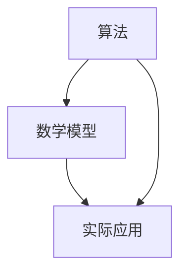

                 

关键词：人工智能、AI发展、核心技术、未来展望、算法、数学模型、应用实践、研究进展

摘要：本文从人工智能发展的背景出发，深入探讨了AI发展的三大支柱：算法、数学模型和实际应用。通过回顾过去的研究进展，分析了当前的核心技术和存在的问题，展望了未来的发展趋势和挑战。文章旨在为读者提供一个全面、深入的视角，以更好地理解AI的发展现状和未来前景。

## 1. 背景介绍

人工智能（AI）作为计算机科学的一个分支，旨在通过模拟、延伸和扩展人类的智能，实现机器的自主学习和智能行为。自20世纪50年代人工智能概念诞生以来，人工智能经历了多个发展阶段，从最初的符号主义、知识工程，到近年的深度学习、强化学习等，每一次技术革新都推动了AI的进步。

### 1.1 人工智能的历史发展

1. **符号主义和知识工程（1956-1980）**：这是人工智能的早期阶段，以符号主义方法为主，通过构建知识库和推理机来实现智能行为。

2. **专家系统和机器学习（1980-1997）**：专家系统的出现标志着人工智能的应用进入了实际领域，同时机器学习开始成为人工智能的重要技术。

3. **深度学习和强化学习（1997-至今）**：以深度神经网络为核心的深度学习和以强化学习为代表的自主学习方法，使得人工智能在图像识别、自然语言处理等领域取得了显著的突破。

### 1.2 人工智能的当前趋势

1. **多模态人工智能**：多模态人工智能是指结合多种数据类型（如文本、图像、音频等）的AI系统，能够更好地理解和模拟人类的智能。

2. **边缘计算和物联网**：随着物联网的普及，边缘计算成为人工智能的重要应用方向，通过在终端设备上进行数据预处理和决策，提高了系统的实时性和效率。

3. **人工智能的伦理和法律问题**：随着AI技术的发展，其伦理和法律问题逐渐引起广泛关注，如何确保AI系统的透明性、公平性和安全性成为亟待解决的问题。

## 2. 核心概念与联系

人工智能的发展离不开算法、数学模型和实际应用三大支柱，它们相互联系，共同推动了人工智能的进步。

### 2.1 算法原理

算法是人工智能的灵魂，是机器完成特定任务的有序步骤。从基础的排序、搜索算法，到复杂的神经网络、强化学习算法，每一个算法都有其独特的原理和应用。

### 2.2 数学模型

数学模型是人工智能的基石，通过对数据的数学描述和建模，实现了对现实世界的模拟和预测。从基本的线性模型、概率模型，到复杂的深度学习模型、强化学习模型，每一个数学模型都为人工智能提供了强大的工具。

### 2.3 实际应用

实际应用是将算法和数学模型转化为实际价值的关键环节。从工业自动化、医疗诊断，到金融分析、自动驾驶，人工智能已经渗透到了各个领域，带来了巨大的变革。

### 2.4 Mermaid 流程图

以下是人工智能核心概念和联系的 Mermaid 流程图：



## 3. 核心算法原理 & 具体操作步骤

### 3.1 算法原理概述

人工智能的核心算法可以分为三类：监督学习、无监督学习和强化学习。

1. **监督学习**：通过已标记的数据训练模型，使其能够对新数据进行预测。常见的算法包括线性回归、决策树、支持向量机等。

2. **无监督学习**：没有标记数据，通过数据自身的结构发现数据中的规律。常见的算法包括聚类、主成分分析、自编码器等。

3. **强化学习**：通过与环境交互，不断调整策略，以实现最大化奖励。常见的算法包括Q学习、深度Q网络（DQN）、策略梯度等。

### 3.2 算法步骤详解

1. **监督学习**：

   - 数据准备：收集并清洗数据，确保数据的完整性和准确性。
   - 特征提取：将原始数据转换为模型可处理的特征向量。
   - 模型选择：选择合适的模型，如线性回归、决策树等。
   - 训练与验证：使用训练集训练模型，并使用验证集进行模型评估。

2. **无监督学习**：

   - 数据准备：收集原始数据，无需标记。
   - 特征提取：将原始数据转换为特征向量。
   - 模型选择：选择合适的模型，如K均值聚类、主成分分析等。
   - 迭代训练：不断调整模型参数，以优化模型性能。

3. **强化学习**：

   - 环境初始化：设定环境，如游戏、机器人等。
   - 策略初始化：设定初始策略。
   - 互动：与环境进行交互，执行策略。
   - 反馈：根据执行结果，计算奖励，调整策略。
   - 重复：不断重复互动和反馈过程，优化策略。

### 3.3 算法优缺点

1. **监督学习**：

   - 优点：能够准确预测新数据，适合有标记数据的情况。
   - 缺点：对数据依赖性强，无法处理无标签数据。

2. **无监督学习**：

   - 优点：能够发现数据中的潜在结构和规律，适用于无标签数据。
   - 缺点：无法直接预测新数据，需要额外的步骤进行转换。

3. **强化学习**：

   - 优点：能够通过与环境交互，自主学习和优化策略。
   - 缺点：计算复杂度高，收敛速度慢。

### 3.4 算法应用领域

1. **监督学习**：广泛应用于图像识别、语音识别、文本分类等领域。
2. **无监督学习**：广泛应用于聚类分析、异常检测、推荐系统等领域。
3. **强化学习**：广泛应用于游戏、机器人、自动驾驶等领域。

## 4. 数学模型和公式 & 详细讲解 & 举例说明

### 4.1 数学模型构建

数学模型是人工智能的基础，通过数学公式和原理，实现对数据的建模和预测。

1. **线性回归模型**：

   - 公式：\( y = w \cdot x + b \)
   - 参数：\( w \)（权重）、\( b \)（偏置）
   - 目标：最小化预测误差，找到最佳参数 \( w \) 和 \( b \)。

2. **神经网络模型**：

   - 公式：\( y = \sigma(\sum_{i=1}^{n} w_i \cdot x_i) \)
   - 参数：\( w_i \)（权重）、\( \sigma \)（激活函数）
   - 目标：通过反向传播算法，不断调整权重，优化模型性能。

### 4.2 公式推导过程

以线性回归模型为例，解释其公式的推导过程。

1. **最小二乘法**：

   - 目标函数：\( J(w, b) = \frac{1}{2} \sum_{i=1}^{n} (y_i - w \cdot x_i - b)^2 \)
   - 求导：\( \frac{\partial J}{\partial w} = \sum_{i=1}^{n} (y_i - w \cdot x_i - b) \cdot x_i \)
   - 求解：令 \( \frac{\partial J}{\partial w} = 0 \)，得到 \( w = \frac{1}{n} \sum_{i=1}^{n} x_i y_i - \frac{1}{n} \sum_{i=1}^{n} x_i \)
   - 同理，求解 \( b \) 的过程。

2. **梯度下降法**：

   - 目标函数：\( J(w, b) = \frac{1}{2} \sum_{i=1}^{n} (y_i - w \cdot x_i - b)^2 \)
   - 梯度：\( \nabla J = [ \frac{\partial J}{\partial w}, \frac{\partial J}{\partial b} ]^T \)
   - 更新：\( w = w - \alpha \cdot \frac{\partial J}{\partial w} \)
   - \( b = b - \alpha \cdot \frac{\partial J}{\partial b} \)
   - 其中，\( \alpha \) 为学习率。

### 4.3 案例分析与讲解

以线性回归模型为例，分析其应用案例。

1. **数据集**：包含 \( n \) 个样本，每个样本包含特征 \( x \) 和标签 \( y \)。

2. **模型训练**：

   - 数据预处理：标准化特征 \( x \)，将标签 \( y \) 转换为类别。
   - 模型初始化：设置随机初始权重 \( w \) 和偏置 \( b \)。
   - 梯度下降：不断更新权重和偏置，直至模型收敛。

3. **模型评估**：

   - 预测：使用训练好的模型，对新的数据进行预测。
   - 评估：计算预测误差，评估模型性能。

## 5. 项目实践：代码实例和详细解释说明

### 5.1 开发环境搭建

1. **硬件环境**：配置高性能的计算机，推荐使用CPU为Intel i7以上，内存为16GB及以上。

2. **软件环境**：安装Python编程环境，推荐使用Anaconda。

3. **依赖库**：安装常用的机器学习库，如scikit-learn、numpy、matplotlib等。

### 5.2 源代码详细实现

以下是一个简单的线性回归模型的实现代码。

```python
import numpy as np
import matplotlib.pyplot as plt

# 数据集
X = np.array([[1], [2], [3], [4], [5]])
y = np.array([[2], [4], [5], [4], [5]])

# 模型初始化
w = np.random.rand(1)
b = np.random.rand(1)

# 梯度下降
learning_rate = 0.01
epochs = 1000

for epoch in range(epochs):
    # 前向传播
    y_pred = X * w + b
    
    # 反向传播
    dw = (y - y_pred) * X
    db = y - y_pred
    
    # 更新参数
    w = w - learning_rate * dw
    b = b - learning_rate * db

# 模型评估
y_pred = X * w + b
mse = np.mean((y - y_pred)**2)
print("MSE:", mse)

# 可视化
plt.scatter(X, y)
plt.plot(X, y_pred, color='red')
plt.show()
```

### 5.3 代码解读与分析

1. **数据集**：使用简单的线性数据集，包含5个样本，每个样本包含一个特征和对应的标签。

2. **模型初始化**：随机初始化权重 \( w \) 和偏置 \( b \)。

3. **梯度下降**：使用梯度下降法，不断更新权重和偏置，直至模型收敛。

4. **模型评估**：计算预测误差，评估模型性能。

5. **可视化**：将真实数据和预测结果进行可视化，便于分析模型性能。

## 6. 实际应用场景

### 6.1 人工智能在医疗领域的应用

1. **疾病预测**：利用机器学习算法，对大量医疗数据进行挖掘和分析，预测疾病的发生概率，为医生提供辅助诊断。

2. **智能药物设计**：通过深度学习算法，对药物分子的结构进行建模和预测，加速新药的研发过程。

3. **医疗影像分析**：利用计算机视觉技术，对医疗影像进行分析和识别，提高诊断的准确性和效率。

### 6.2 人工智能在金融领域的应用

1. **风险控制**：通过机器学习算法，对金融数据进行分析和建模，预测市场风险，为金融机构提供风险预警。

2. **智能投顾**：利用人工智能技术，为投资者提供个性化的投资建议，提高投资收益。

3. **信用评估**：通过分析个人的金融行为和数据，利用机器学习算法评估信用风险，为金融机构提供信用评估服务。

### 6.3 人工智能在工业自动化领域的应用

1. **智能质检**：通过计算机视觉技术，对工业产品进行质检，提高质检效率和准确性。

2. **智能维护**：利用人工智能技术，对工业设备进行实时监控和维护，降低设备故障率，提高生产效率。

3. **智能生产**：通过机器学习算法，优化生产流程和资源配置，提高生产效率和产品质量。

## 6.4 未来应用展望

随着人工智能技术的不断发展，未来将在更多领域得到应用：

1. **智能城市**：利用人工智能技术，实现交通管理、环境监测、公共安全等领域的智能化。

2. **教育领域**：通过人工智能技术，实现个性化教学、智能辅导，提高教育质量和效率。

3. **农业领域**：利用人工智能技术，实现精准农业、智能灌溉，提高农业产量和质量。

## 7. 工具和资源推荐

### 7.1 学习资源推荐

1. **书籍**：

   - 《深度学习》（Ian Goodfellow、Yoshua Bengio、Aaron Courville著）
   - 《Python机器学习》（Sebastian Raschka著）
   - 《人工智能：一种现代的方法》（Stuart Russell、Peter Norvig著）

2. **在线课程**：

   - Coursera上的《机器学习》（吴恩达教授）
   - edX上的《人工智能基础》（MIT）
   - Udacity的《深度学习纳米学位》

### 7.2 开发工具推荐

1. **Python编程环境**：使用Anaconda进行Python环境的搭建和管理。

2. **机器学习框架**：使用TensorFlow、PyTorch等框架进行模型训练和部署。

3. **数据预处理工具**：使用Pandas、NumPy等库进行数据预处理。

### 7.3 相关论文推荐

1. **《A Survey on Deep Learning for Natural Language Processing》（2018）**：对深度学习在自然语言处理领域的应用进行综述。

2. **《Generative Adversarial Networks: An Overview》（2017）**：对生成对抗网络（GANs）的原理和应用进行介绍。

3. **《Reinforcement Learning: A Survey》（2016）**：对强化学习的基本原理和应用进行综述。

## 8. 总结：未来发展趋势与挑战

### 8.1 研究成果总结

1. **算法创新**：深度学习、强化学习等算法的不断发展，推动了人工智能的进步。

2. **跨学科融合**：人工智能与生物、医学、金融、工业等领域的交叉融合，促进了新技术的诞生。

3. **应用广泛**：人工智能在各个领域的应用，如医疗、金融、工业、农业等，带来了巨大的变革。

### 8.2 未来发展趋势

1. **更强大的模型和算法**：未来的AI将拥有更强大的模型和算法，能够处理更复杂的问题。

2. **多模态人工智能**：多模态人工智能将成为人工智能的重要发展方向，实现跨领域的智能化。

3. **边缘计算和物联网**：随着物联网的普及，边缘计算将得到广泛应用，推动人工智能的实时化和高效化。

### 8.3 面临的挑战

1. **数据质量和隐私**：数据质量和隐私问题是人工智能发展的重要挑战。

2. **伦理和法律问题**：人工智能的伦理和法律问题需要引起广泛关注。

3. **计算能力和能耗**：人工智能的发展对计算能力和能耗提出了更高的要求。

### 8.4 研究展望

1. **算法优化**：不断优化算法，提高计算效率和性能。

2. **跨学科研究**：加强跨学科研究，推动人工智能与其他领域的深度融合。

3. **人才培养**：加强人工智能人才培养，为人工智能发展提供人才支持。

## 9. 附录：常见问题与解答

### 9.1 人工智能是什么？

人工智能是指通过计算机程序实现人类智能的一种技术，包括机器学习、深度学习、自然语言处理等多个领域。

### 9.2 人工智能的发展趋势是什么？

未来人工智能的发展趋势包括：更强大的模型和算法、多模态人工智能、边缘计算和物联网的广泛应用。

### 9.3 人工智能的挑战有哪些？

人工智能的挑战包括：数据质量和隐私问题、伦理和法律问题、计算能力和能耗等。

### 9.4 人工智能如何影响我们的生活？

人工智能已经在医疗、金融、工业、农业等多个领域得到广泛应用，提高了生产效率、生活质量和社会福利。

---

本文基于当前的人工智能发展趋势和实际应用，从算法、数学模型和实际应用三个角度，深入探讨了人工智能的发展现状和未来前景。通过回顾过去的研究进展，分析当前的核心技术和存在的问题，展望了未来的发展趋势和挑战。文章旨在为读者提供一个全面、深入的视角，以更好地理解人工智能的发展现状和未来前景。在未来的发展中，人工智能将继续推动社会进步，为人类创造更多价值。作者：禅与计算机程序设计艺术 / Zen and the Art of Computer Programming。

