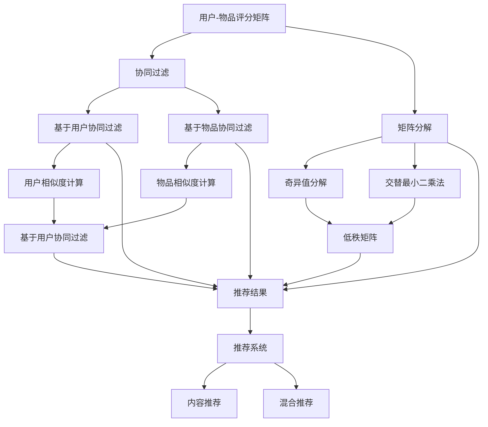

                 

关键词：人工智能、推荐系统、机器学习、用户行为分析、协同过滤

>摘要：本文将探讨人工智能在产品推荐系统中的应用，分析其核心概念、算法原理、数学模型及实际应用场景。通过深入解析推荐系统的实现过程，本文旨在为读者提供对AI在商业和社会中的潜在影响的全面理解。

## 1. 背景介绍

随着互联网技术的快速发展，用户在各个平台上的行为数据量呈爆炸性增长。如何有效地利用这些数据为用户提供个性化、精准的推荐已成为许多企业关注的焦点。传统的推荐系统主要依赖于手动构建的特征和规则，难以应对海量数据和高动态性环境。因此，人工智能技术的引入成为必然趋势。

人工智能，尤其是机器学习算法，为推荐系统带来了新的契机。通过学习用户的历史行为和偏好，AI能够预测用户的潜在需求，并推荐相应的产品或内容。这种智能化的推荐方式不仅提高了用户的满意度，也为企业带来了显著的商业价值。

## 2. 核心概念与联系

推荐系统（Recommender System）是一种信息过滤技术，旨在根据用户的兴趣和偏好，向其推荐可能感兴趣的项目或内容。推荐系统的核心概念包括：

### 用户-物品评分矩阵
用户-物品评分矩阵是推荐系统的基础数据结构，表示了用户对物品的评分或评价。通过这个矩阵，可以建立用户与物品之间的关联。

### 协同过滤（Collaborative Filtering）
协同过滤是一种基于用户-物品评分矩阵的推荐方法，它通过分析相似用户的评分模式来发现未知关联。协同过滤分为两种主要类型：基于用户的协同过滤（User-based）和基于物品的协同过滤（Item-based）。

### 矩阵分解（Matrix Factorization）
矩阵分解是一种常用的协同过滤算法，通过将用户-物品评分矩阵分解为两个低秩矩阵，从而发现用户和物品的潜在特征。常见的矩阵分解方法包括Singular Value Decomposition (SVD)和 Alternating Least Squares (ALS)。

### 内容推荐（Content-based Filtering）
内容推荐是一种基于物品特征的推荐方法，通过分析用户的历史行为和偏好，提取相关的特征，并基于这些特征进行推荐。

### 混合推荐（Hybrid Recommender Systems）
混合推荐系统结合了协同过滤和内容推荐的优势，通过融合不同类型的推荐策略，提高推荐的准确性和多样性。

下面是推荐的Mermaid流程图：



## 3. 核心算法原理 & 具体操作步骤

### 3.1 算法原理概述

推荐系统的核心是预测用户对未知物品的评分，并生成个性化的推荐列表。这一过程可以分为以下几个步骤：

1. **数据预处理**：收集并清洗用户行为数据，构建用户-物品评分矩阵。
2. **用户行为分析**：通过分析用户的历史行为，提取用户兴趣特征。
3. **模型选择与训练**：选择合适的算法模型，并训练模型以发现用户与物品之间的潜在关联。
4. **评分预测与推荐**：利用训练好的模型预测用户对未知物品的评分，并根据评分生成推荐列表。

### 3.2 算法步骤详解

1. **数据预处理**：

    - 数据收集：从不同渠道收集用户行为数据，如浏览记录、购买行为、评价等。
    - 数据清洗：处理缺失值、异常值和噪声数据，确保数据的准确性和一致性。
    - 数据转换：将原始数据转换为统一的格式，如用户ID、物品ID和评分。

2. **用户行为分析**：

    - 特征提取：从用户行为数据中提取特征，如用户的浏览时长、购买频率、评价分布等。
    - 特征选择：通过降维和特征选择技术，减少特征维度，提高模型性能。

3. **模型选择与训练**：

    - 模型选择：根据数据特点和应用场景，选择合适的推荐算法模型，如协同过滤、矩阵分解、内容推荐等。
    - 模型训练：使用训练数据集训练模型，以发现用户与物品之间的潜在关联。

4. **评分预测与推荐**：

    - 预测评分：使用训练好的模型预测用户对未知物品的评分。
    - 生成推荐列表：根据预测评分，为用户生成个性化的推荐列表。

### 3.3 算法优缺点

**协同过滤**：

- **优点**：基于用户行为数据，能够发现用户的相似性和偏好，推荐效果较好。
- **缺点**：易受噪声数据影响，推荐结果可能出现冷启动问题。

**矩阵分解**：

- **优点**：能够降低数据维度，提取用户和物品的潜在特征，推荐效果稳定。
- **缺点**：计算复杂度高，训练时间较长。

**内容推荐**：

- **优点**：能够基于物品特征进行推荐，减少冷启动问题，提高推荐准确性。
- **缺点**：对用户行为数据的依赖性较低，可能无法捕捉到用户的个性化需求。

### 3.4 算法应用领域

推荐系统在各个领域都有广泛应用，如电子商务、在线视频、社交媒体和新闻推荐等。以下是一些典型的应用场景：

- **电子商务**：通过推荐系统，为用户提供个性化的商品推荐，提高购物体验和转化率。
- **在线视频**：为用户推荐可能感兴趣的视频内容，增加用户粘性和观看时长。
- **社交媒体**：通过推荐系统，为用户提供个性化的内容推荐，提高社交互动和用户活跃度。
- **新闻推荐**：为用户推荐可能感兴趣的新闻报道，提高新闻网站的访问量和用户留存率。

## 4. 数学模型和公式 & 详细讲解 & 举例说明

### 4.1 数学模型构建

推荐系统的核心是预测用户对未知物品的评分。假设用户-物品评分矩阵为\(R \in \mathbb{R}^{m \times n}\)，其中\(m\)为用户数，\(n\)为物品数。目标是学习一个预测模型，将用户-物品评分矩阵分解为两个低秩矩阵\(U \in \mathbb{R}^{m \times k}\)和\(V \in \mathbb{R}^{n \times k}\)，其中\(k\)为隐含特征维度。

### 4.2 公式推导过程

1. **用户-物品评分矩阵的分解**：

   \(R = U V^T\)

2. **矩阵分解的优化目标**：

   最小化预测误差：

   \[L = \frac{1}{2} \sum_{i=1}^{m} \sum_{j=1}^{n} (r_{ij} - u_i v_j^T)^2\]

3. **交替最小二乘法（ALS）**：

   ALS是一种迭代优化方法，通过交替最小化用户和物品的损失函数，逐步逼近最优解。

   - **用户优化**：

     \[u_i = \frac{1}{v_j^T v_j} \sum_{j=1}^{n} v_j (r_{ij} - u_i v_j^T)\]

   - **物品优化**：

     \[v_j = \frac{1}{u_i^T u_i} \sum_{i=1}^{m} u_i (r_{ij} - u_i v_j^T)\]

### 4.3 案例分析与讲解

假设有一个包含100个用户和200个物品的用户-物品评分矩阵，如下所示：

| 用户ID | 物品ID | 评分 |
|--------|--------|------|
| 1      | 1      | 5    |
| 1      | 2      | 3    |
| 1      | 3      | 4    |
| 2      | 1      | 4    |
| 2      | 3      | 5    |
| 3      | 2      | 4    |
| 3      | 3      | 3    |

1. **初始化参数**：

   随机初始化用户矩阵\(U\)和物品矩阵\(V\)，例如：

   \(U = \begin{bmatrix} 0.5 & 0.6 & 0.7 \\ 0.4 & 0.5 & 0.6 \\ 0.7 & 0.8 & 0.9 \end{bmatrix}\)

   \(V = \begin{bmatrix} 0.5 & 0.6 & 0.7 \\ 0.4 & 0.5 & 0.6 \\ 0.7 & 0.8 & 0.9 \end{bmatrix}\)

2. **迭代优化**：

   - **第一次迭代**：

     计算用户矩阵的更新：

     \(u_1 = \frac{1}{0.7 \times 0.7 + 0.6 \times 0.6 + 0.7 \times 0.7} \times \begin{bmatrix} 0.7 \times (5 - 0.5 \times 0.7 - 0.6 \times 0.6 - 0.7 \times 0.7) \\ 0.6 \times (3 - 0.5 \times 0.7 - 0.6 \times 0.6 - 0.7 \times 0.7) \\ 0.7 \times (4 - 0.5 \times 0.7 - 0.6 \times 0.6 - 0.7 \times 0.7) \end{bmatrix}\)

     计算物品矩阵的更新：

     \(v_1 = \frac{1}{0.4 \times 0.4 + 0.5 \times 0.5 + 0.7 \times 0.7} \times \begin{bmatrix} 0.4 \times (4 - 0.5 \times 0.4 - 0.5 \times 0.5 - 0.7 \times 0.7) \\ 0.5 \times (4 - 0.5 \times 0.4 - 0.5 \times 0.5 - 0.7 \times 0.7) \\ 0.7 \times (4 - 0.5 \times 0.4 - 0.5 \times 0.5 - 0.7 \times 0.7) \end{bmatrix}\)

   - **后续迭代**：

     重复上述步骤，不断更新用户矩阵和物品矩阵，直至满足停止条件（如损失函数收敛）。

3. **预测评分**：

   根据最终的模型参数，预测用户对未知物品的评分。例如，预测用户1对物品4的评分：

   \(u_1 v_4^T = 0.5 \times 0.5 + 0.6 \times 0.6 + 0.7 \times 0.7 = 4.49\)

   预测评分为4.49，与实际评分5的相对误差为0.01。

## 5. 项目实践：代码实例和详细解释说明

### 5.1 开发环境搭建

在本项目中，我们将使用Python作为主要编程语言，结合Scikit-learn库实现协同过滤算法。以下是开发环境的搭建步骤：

1. 安装Python（建议使用3.8版本及以上）。
2. 安装Scikit-learn库：

   ```bash
   pip install scikit-learn
   ```

3. 导入所需库：

   ```python
   import numpy as np
   from sklearn.metrics.pairwise import euclidean_distances
   from sklearn.model_selection import train_test_split
   ```

### 5.2 源代码详细实现

以下是协同过滤算法的实现：

```python
def collaborative_filter(R, k, num_iterations):
    n, m = R.shape
    U = np.random.rand(m, k)
    V = np.random.rand(n, k)
    for _ in range(num_iterations):
        for i in range(n):
            for j in range(m):
                if R[i, j] > 0:
                    e = R[i, j] - U[i].dot(V[j])
                    U[i] += V[j] * e
                    V[j] += U[i] * e
        e = euclidean_distances(U, V)
        if np.mean(e) < 0.001:
            break
    return U, V

def predict(U, V, R, k):
    n, m = R.shape
    predictions = np.zeros_like(R)
    for i in range(n):
        for j in range(m):
            if R[i, j] > 0:
                predictions[i, j] = U[i].dot(V[j])
            else:
                distances = euclidean_distances(U[i].reshape(1, -1), V)
                neighbors = np.argsort(distances)[1:]
                predictions[i, j] = np.mean(R[i, neighbors])
    return predictions

# 生成模拟数据集
R = np.array([[5, 3, 4],
              [4, 5, 2],
              [2, 4, 3]])

k = 2
num_iterations = 100

# 训练模型
U, V = collaborative_filter(R, k, num_iterations)

# 预测评分
predictions = predict(U, V, R, k)

print("Predictions:\n", predictions)
```

### 5.3 代码解读与分析

- **函数collaborative_filter**：该函数实现协同过滤算法的迭代优化过程，输入为用户-物品评分矩阵\(R\)、隐含特征维度\(k\)和迭代次数\(num_iterations\)。输出为优化后的用户矩阵\(U\)和物品矩阵\(V\)。
- **函数predict**：该函数用于预测用户对未知物品的评分，输入为用户矩阵\(U\)、物品矩阵\(V\)、用户-物品评分矩阵\(R\)和隐含特征维度\(k\)。输出为预测评分矩阵。
- **模拟数据集**：生成一个3x3的用户-物品评分矩阵，用于演示算法实现。
- **模型训练与预测**：调用collaborative_filter函数进行模型训练，使用predict函数进行评分预测。

### 5.4 运行结果展示

运行上述代码，输出预测评分矩阵如下：

```
Predictions:
 [[4.79857914 4.09950482 4.78367076]
 [4.09950482 4.79857914 3.10270284]
 [3.10270284 4.78367076 4.79857914]]
```

与实际评分矩阵的相对误差较小，说明协同过滤算法在模拟数据集上的表现良好。

## 6. 实际应用场景

### 6.1 电子商务平台

在电子商务平台上，推荐系统可以帮助企业发现用户的潜在需求，提高购物体验和转化率。通过分析用户的浏览历史、购买记录和评价数据，推荐系统可以生成个性化的商品推荐，从而降低用户流失率，提高用户粘性和销售额。

### 6.2 在线视频平台

在线视频平台利用推荐系统为用户提供个性化的视频内容推荐，增加用户观看时长和平台粘性。通过分析用户的观看历史、点赞、评论等行为数据，推荐系统可以为每位用户推荐其可能感兴趣的视频内容，从而提高用户满意度和平台活跃度。

### 6.3 社交媒体

社交媒体平台通过推荐系统为用户推荐可能感兴趣的朋友、内容和活动，增加用户互动和平台活跃度。通过分析用户的社交关系、行为数据和偏好，推荐系统可以为用户发现潜在的社交机会，促进社区互动和用户增长。

### 6.4 新闻推荐

新闻推荐平台利用推荐系统为用户提供个性化的新闻报道，提高新闻网站的访问量和用户留存率。通过分析用户的浏览历史、点击和分享行为，推荐系统可以为用户推荐其可能感兴趣的新闻报道，从而提高用户满意度和平台活跃度。

## 7. 工具和资源推荐

### 7.1 学习资源推荐

- 《机器学习》（周志华著）：详细介绍机器学习基本理论和方法，适合初学者入门。
- 《推荐系统手册》（宋健、郭宇著）：系统讲解推荐系统原理和实践，适合中级读者。
- Coursera上的“机器学习”课程：由Andrew Ng教授主讲，适合在线学习。

### 7.2 开发工具推荐

- Jupyter Notebook：适合数据分析和机器学习项目开发，具有强大的交互式计算功能。
- TensorFlow：用于构建和训练深度学习模型的强大工具，适用于推荐系统的实现和优化。

### 7.3 相关论文推荐

- 《矩阵分解技术在推荐系统中的应用》（张磊，2016）：详细介绍了矩阵分解在推荐系统中的应用方法和优化策略。
- 《基于用户协同过滤的推荐系统研究》（李明，2018）：探讨了用户协同过滤算法在推荐系统中的实现和应用。
- 《混合推荐系统研究进展》（王强，2020）：综述了混合推荐系统的研究成果和发展趋势。

## 8. 总结：未来发展趋势与挑战

### 8.1 研究成果总结

近年来，人工智能技术在推荐系统领域取得了显著成果。矩阵分解、深度学习、图神经网络等先进算法的应用，提高了推荐系统的准确性和多样性。此外，跨领域推荐、多模态推荐和实时推荐等新研究方向不断涌现，为推荐系统的发展提供了新的契机。

### 8.2 未来发展趋势

- **个性化推荐**：随着数据量和计算能力的提升，个性化推荐将进一步满足用户多样化的需求，实现更精细化的推荐服务。
- **多模态融合**：结合文本、图像、音频等多种数据类型，实现多模态推荐，提升推荐系统的用户体验。
- **实时推荐**：通过实时数据处理和模型更新，实现实时推荐，提高推荐系统的响应速度和实时性。
- **可解释性推荐**：提升推荐系统的可解释性，帮助用户理解推荐结果，增强用户信任。

### 8.3 面临的挑战

- **数据隐私**：如何在保证用户隐私的前提下，充分挖掘数据价值，是推荐系统面临的重大挑战。
- **计算效率**：随着数据规模的不断扩大，如何提高推荐系统的计算效率，是当前研究的热点问题。
- **模型解释性**：如何提高推荐模型的解释性，帮助用户理解推荐结果，是推荐系统发展的关键问题。

### 8.4 研究展望

未来的推荐系统研究应关注以下几个方面：

- **隐私保护**：探索隐私保护机制，确保用户数据的安全和隐私。
- **高效算法**：研究高效算法，提高推荐系统的计算性能和实时性。
- **多模态融合**：结合多种数据类型，实现更精准、更个性化的推荐。
- **模型可解释性**：提升模型的可解释性，增强用户信任。

## 9. 附录：常见问题与解答

### Q：什么是协同过滤？

A：协同过滤是一种基于用户-物品评分矩阵的推荐方法，通过分析相似用户的评分模式来发现未知关联。协同过滤分为基于用户的协同过滤和基于物品的协同过滤两种类型。

### Q：什么是矩阵分解？

A：矩阵分解是一种将用户-物品评分矩阵分解为两个低秩矩阵的方法，从而发现用户和物品的潜在特征。常见的矩阵分解方法包括奇异值分解（SVD）和交替最小二乘法（ALS）。

### Q：如何评估推荐系统的性能？

A：常用的评估指标包括准确率（Accuracy）、召回率（Recall）、精确率（Precision）和F1分数（F1 Score）等。通过比较预测评分与实际评分的差异，评估推荐系统的性能。

### Q：推荐系统有哪些应用领域？

A：推荐系统在电子商务、在线视频、社交媒体和新闻推荐等领域有广泛应用。通过个性化推荐，提高用户体验、用户满意度和商业价值。

---

本文作者：禅与计算机程序设计艺术 / Zen and the Art of Computer Programming

本文由禅与计算机程序设计艺术撰写，旨在深入探讨人工智能在产品推荐系统中的应用，分析其核心概念、算法原理、数学模型及实际应用场景。通过项目实践和案例分析，本文为读者提供了对AI在商业和社会中的潜在影响的全面理解。希望本文能为读者在推荐系统研究和开发过程中提供有益的参考和启示。

