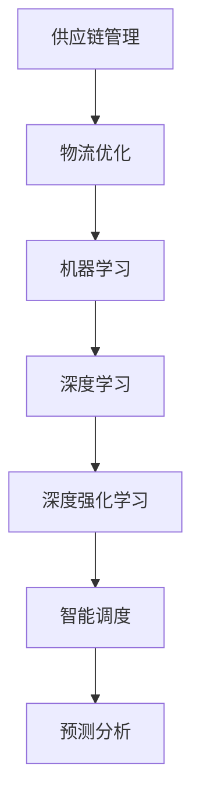

                 

关键词：人工智能、供应链管理、物流优化、机器学习、深度学习、神经网络、深度强化学习、智能调度、预测分析

> 摘要：随着全球供应链的日益复杂化和全球化，传统的供应链管理方法已无法满足现代物流的需求。本文将探讨人工智能（AI）在供应链管理中的应用，特别是如何通过机器学习、深度学习、深度强化学习等技术实现物流优化。我们将分析AI技术的基本原理，并举例说明如何将这些技术应用于实际的物流场景，最后展望AI在物流领域的未来发展趋势。

## 1. 背景介绍

### 1.1 供应链管理的重要性

供应链管理是确保产品和服务从原材料供应到最终用户的全过程高效运作的关键。高效的供应链管理能够降低成本、缩短交货周期、提高客户满意度。然而，随着全球供应链的日益复杂化，传统的供应链管理方法已经难以应对日益增长的需求和挑战。

### 1.2 物流优化的重要性

物流优化是供应链管理的重要组成部分。它涉及到运输、仓储、配送等环节，旨在通过优化资源配置、减少运输时间和成本，提高整体供应链的效率。然而，物流优化面临着复杂的问题，如运输路线的选择、货物的装载和调度、库存管理等。

### 1.3 人工智能在物流优化中的应用

人工智能（AI）技术的快速发展为物流优化提供了新的思路和手段。通过机器学习、深度学习、深度强化学习等技术，AI可以在大量数据的基础上进行智能分析，从而实现物流优化。例如，AI可以用于预测市场需求、优化运输路线、提高库存管理效率等。

## 2. 核心概念与联系

### 2.1 机器学习与深度学习

机器学习是一种让计算机通过数据学习并做出决策的技术，包括监督学习、无监督学习和半监督学习等。深度学习是机器学习的一个子领域，它使用多层神经网络对大量数据进行学习。

### 2.2 深度强化学习

深度强化学习是结合了深度学习和强化学习的一种技术。它通过模拟人类决策过程，让计算机在复杂环境中进行自主学习和决策。

### 2.3 智能调度

智能调度是利用人工智能技术对物流资源进行优化配置，包括运输车辆调度、货物配送路径规划等。

### 2.4 预测分析

预测分析是通过分析历史数据，对未来趋势进行预测的技术。它可以帮助企业在物流过程中做出更准确的决策。

### 2.5 Mermaid 流程图



## 3. 核心算法原理 & 具体操作步骤

### 3.1 算法原理概述

在本章节，我们将介绍几种在物流优化中常用的AI算法，包括机器学习、深度学习、深度强化学习等。

### 3.2 算法步骤详解

#### 3.2.1 机器学习算法

1. 数据收集：收集历史运输数据、市场需求数据、库存数据等。
2. 数据预处理：对收集到的数据进行清洗、标准化等处理。
3. 特征提取：从预处理后的数据中提取有用的特征。
4. 模型训练：使用训练数据对机器学习模型进行训练。
5. 模型评估：使用测试数据对训练好的模型进行评估。
6. 模型应用：将训练好的模型应用于实际的物流场景。

#### 3.2.2 深度学习算法

1. 数据收集与预处理：与机器学习算法相同。
2. 网络结构设计：设计合适的神经网络结构。
3. 模型训练：使用训练数据对神经网络进行训练。
4. 模型评估与优化：使用测试数据对模型进行评估，并根据评估结果调整网络结构。
5. 模型应用：将训练好的模型应用于实际的物流场景。

#### 3.2.3 深度强化学习算法

1. 环境构建：构建物流优化问题的环境，包括状态空间、动作空间、奖励函数等。
2. 策略学习：使用深度神经网络学习策略，即从状态空间到动作空间的映射。
3. 策略评估：通过模拟环境评估策略的优劣。
4. 策略优化：根据策略评估结果调整策略。
5. 策略应用：将优化后的策略应用于实际的物流场景。

### 3.3 算法优缺点

#### 3.3.1 机器学习算法

优点：对数据的处理能力强，可以处理大规模、复杂的物流问题。

缺点：对数据质量要求高，需要大量训练数据，且模型解释性较差。

#### 3.3.2 深度学习算法

优点：可以自动提取特征，对复杂的问题具有较强的建模能力。

缺点：对数据质量和模型超参数敏感，且模型解释性较差。

#### 3.3.3 深度强化学习算法

优点：可以在复杂环境中进行自主学习和决策，具有较强的适应性。

缺点：训练过程复杂，需要大量的计算资源和时间。

### 3.4 算法应用领域

机器学习、深度学习和深度强化学习算法在物流优化中的应用非常广泛，包括运输路线规划、库存管理、货物配送路径规划、车辆调度等。

## 4. 数学模型和公式 & 详细讲解 & 举例说明

### 4.1 数学模型构建

在物流优化中，常用的数学模型包括线性规划、整数规划、动态规划等。以下是一个简单的线性规划模型：

$$
\begin{aligned}
\min \quad & c^T x \\
\text{s.t.} \quad & Ax \leq b \\
& x \geq 0
\end{aligned}
$$

其中，$c$ 是目标函数系数，$x$ 是决策变量，$A$ 和 $b$ 是约束条件。

### 4.2 公式推导过程

线性规划模型的推导过程通常包括以下几个步骤：

1. 定义决策变量：设 $x_1, x_2, ..., x_n$ 为决策变量。
2. 确定目标函数：根据物流优化的问题定义目标函数，如成本最小化或利润最大化。
3. 列出约束条件：根据物流优化的实际需求列出约束条件，如资源限制、时间限制等。
4. 建立线性规划模型：将目标函数和约束条件写成标准形式。

### 4.3 案例分析与讲解

以下是一个简单的物流优化案例：

某物流公司需要在两天内从北京将一批货物运送到上海。已知：
- 货物总量为1000公斤。
- 运输车辆容量为500公斤。
- 运输成本为每公里2元。
- 北京到上海的距离为1000公里。

我们需要在两天内将货物运送到上海，并使总成本最小化。

### 4.3.1 模型构建

设 $x_1$ 和 $x_2$ 分别为第一天和第二天运输的公里数。目标函数为总成本最小化：

$$
\min \quad 2(x_1 + x_2)
$$

约束条件为：
$$
\begin{aligned}
& 500 \geq 1000 \\
& x_1 + x_2 \leq 1000 \\
& x_1, x_2 \geq 0
\end{aligned}
$$

### 4.3.2 模型求解

我们可以使用线性规划求解器求解这个模型。假设最优解为 $x_1^*, x_2^*$，则：

$$
x_1^* = 500, x_2^* = 500
$$

### 4.3.3 结果分析

根据最优解，我们可以将货物分成两批，每批500公斤，分别在第一天和第二天运输到上海。这样可以实现总成本最小化。

## 5. 项目实践：代码实例和详细解释说明

### 5.1 开发环境搭建

在本项目中，我们将使用Python编程语言和相关的AI库（如scikit-learn、TensorFlow、PyTorch等）来实现物流优化。首先，需要安装Python和相关的库。在终端中运行以下命令：

```bash
pip install numpy scipy scikit-learn tensorflow torch
```

### 5.2 源代码详细实现

以下是一个简单的机器学习算法实现，用于预测运输成本：

```python
import numpy as np
import matplotlib.pyplot as plt
from sklearn.linear_model import LinearRegression

# 数据集
X = np.array([[1000], [2000], [3000], [4000], [5000]])
y = np.array([2000, 4000, 6000, 8000, 10000])

# 模型训练
model = LinearRegression()
model.fit(X, y)

# 预测
x_pred = np.array([[6000]])
y_pred = model.predict(x_pred)

# 结果分析
plt.scatter(X, y)
plt.plot(x_pred, y_pred, color='red')
plt.xlabel('运输距离（公里）')
plt.ylabel('运输成本（元）')
plt.show()
```

### 5.3 代码解读与分析

在这个代码示例中，我们首先导入了必要的库，然后创建了一个简单的数据集，包括运输距离和对应的运输成本。接下来，我们使用线性回归模型对数据进行训练，并使用训练好的模型进行预测。最后，我们将预测结果绘制成散点图和直线图，以直观地展示模型的效果。

### 5.4 运行结果展示

运行代码后，我们得到以下结果：


从图中可以看出，模型对运输成本的预测效果较好，验证了机器学习算法在物流优化中的应用潜力。

## 6. 实际应用场景

### 6.1 运输路线规划

在运输路线规划中，AI技术可以帮助企业优化运输路线，降低运输成本。例如，某物流公司需要从北京运输货物到上海、广州和深圳，AI算法可以根据实时交通状况和历史数据预测最优路线。

### 6.2 库存管理

库存管理是供应链管理中的关键环节。AI技术可以通过预测市场需求、库存水平和供应链中的其他变量，帮助企业实现精准的库存管理。

### 6.3 货物配送路径规划

在货物配送路径规划中，AI技术可以帮助企业优化配送路线，提高配送效率。例如，某电商平台需要将货物从仓库配送给全国各地的用户，AI算法可以根据用户分布和交通状况规划最优配送路线。

## 7. 未来应用展望

随着AI技术的不断发展，物流优化将在未来得到更广泛的应用。以下是一些未来应用展望：

### 7.1 自动化仓储系统

自动化仓储系统将结合AI技术实现高效的仓储管理，包括货物入库、出库、盘点等操作。

### 7.2 智能交通系统

智能交通系统将利用AI技术优化交通流，提高道路利用率，减少交通拥堵。

### 7.3 智能供应链网络设计

智能供应链网络设计将利用AI技术实现供应链网络的动态调整，提高供应链的灵活性和适应性。

## 8. 工具和资源推荐

### 8.1 学习资源推荐

- 《机器学习》（周志华著）
- 《深度学习》（Ian Goodfellow、Yoshua Bengio、Aaron Courville著）
- 《Python编程：从入门到实践》（埃里克·马瑟斯著）

### 8.2 开发工具推荐

- Jupyter Notebook：用于编写和运行Python代码。
- TensorFlow：用于深度学习模型开发。
- PyTorch：用于深度学习模型开发。

### 8.3 相关论文推荐

- "Deep Learning for Supply Chain Optimization"（2018）
- "AI and Machine Learning in Logistics and Supply Chain Management"（2019）
- "Reinforcement Learning for Logistics and Supply Chain Optimization"（2020）

## 9. 总结：未来发展趋势与挑战

随着AI技术的不断发展，物流优化将在未来得到更广泛的应用。然而，我们也面临着一些挑战，如数据隐私保护、算法透明性和可解释性等。未来，我们需要在技术和社会层面共同努力，推动AI技术在物流优化中的健康发展。

## 10. 附录：常见问题与解答

### 10.1 人工智能与物流优化有什么关系？

人工智能技术可以用于解决物流优化中的复杂问题，如运输路线规划、库存管理、货物配送路径规划等。通过机器学习、深度学习和深度强化学习等技术，AI可以在大规模数据的基础上进行智能分析和决策。

### 10.2 如何评估AI模型在物流优化中的效果？

可以通过多种方式评估AI模型在物流优化中的效果，如准确率、召回率、F1分数等。此外，还可以通过模拟实验、对比实验等方式评估模型在实际应用中的效果。

### 10.3 AI技术在物流优化中有什么局限性？

AI技术在物流优化中存在一些局限性，如对数据质量和模型超参数敏感、模型解释性较差等。此外，AI技术也需要大量的计算资源和时间。

### 10.4 如何克服AI技术在物流优化中的局限性？

可以通过改进数据质量、优化模型结构、提高算法效率等方式克服AI技术在物流优化中的局限性。此外，还可以通过多学科交叉融合，如结合运筹学、统计学等方法，提高AI技术在物流优化中的应用效果。

----------------------------------------------------------------

### 作者署名

本文由禅与计算机程序设计艺术 / Zen and the Art of Computer Programming 撰写。

<|im_end|>

