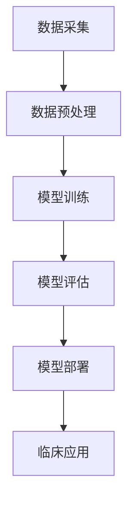
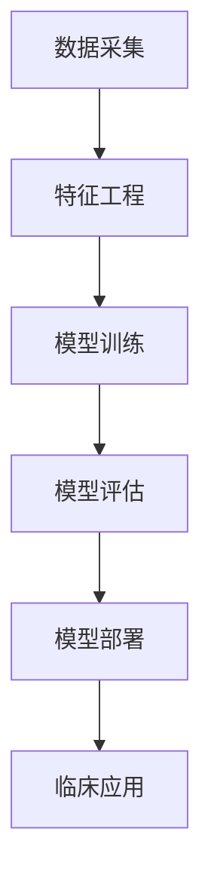
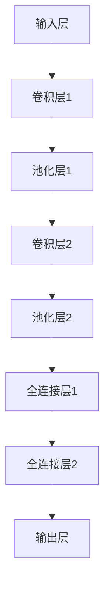

                 

关键词：人工智能、医疗诊断、深度学习、机器学习、医疗影像分析、数据隐私、伦理问题、算法公平性、医疗质量提升

> 摘要：随着人工智能技术的迅猛发展，其在医疗诊断领域的应用愈发广泛。本文将从人工智能在医疗诊断中的应用、面临的机遇与挑战、相关伦理问题等方面进行探讨，旨在为行业从业人员提供有价值的参考。

## 1. 背景介绍

医疗诊断是医疗体系中的关键环节，直接关系到患者的生命安全和医疗质量。然而，传统的医疗诊断方法往往依赖于医生的经验和技能，存在主观性强、诊断速度慢、误诊率较高等问题。随着人工智能技术的快速发展，特别是深度学习和机器学习算法的突破，人工智能在医疗诊断中的应用逐渐成为研究热点。

近年来，人工智能在医疗诊断中的应用取得了显著的进展。例如，在医疗影像分析方面，人工智能可以快速、准确地识别病变区域，提高诊断的准确性和效率。在疾病预测方面，人工智能可以通过分析海量医疗数据，预测患者的疾病风险，为早期干预提供依据。此外，人工智能还在辅助诊断、健康监测等方面展现出巨大的潜力。

## 2. 核心概念与联系

### 2.1 深度学习在医疗诊断中的应用

深度学习是人工智能的一个重要分支，通过模拟人脑的神经网络结构，对海量数据进行学习，从而实现复杂的模式识别和预测任务。在医疗诊断中，深度学习算法广泛应用于图像识别、文本分析、语音识别等领域。

下面是一个简单的 Mermaid 流程图，展示了深度学习在医疗诊断中的基本架构：

### 2.2 机器学习在医疗诊断中的应用

机器学习是人工智能的另一个重要分支，通过构建数学模型，从数据中学习规律，从而实现预测和分类任务。在医疗诊断中，机器学习算法可以用于疾病预测、诊断辅助、风险评估等任务。

下面是一个简单的 Mermaid 流程图，展示了机器学习在医疗诊断中的基本架构：

## 3. 核心算法原理 & 具体操作步骤

### 3.1 算法原理概述

在医疗诊断中，常用的深度学习算法包括卷积神经网络（CNN）、循环神经网络（RNN）和长短期记忆网络（LSTM）等。其中，CNN 是一种用于图像识别和处理的深度学习算法，其核心思想是通过多层卷积和池化操作，从图像中提取特征，并最终实现分类任务。

下面是一个简单的 CNN 模型架构：

### 3.2 算法步骤详解

#### 3.2.1 数据预处理

在训练 CNN 模型之前，需要对图像数据进

