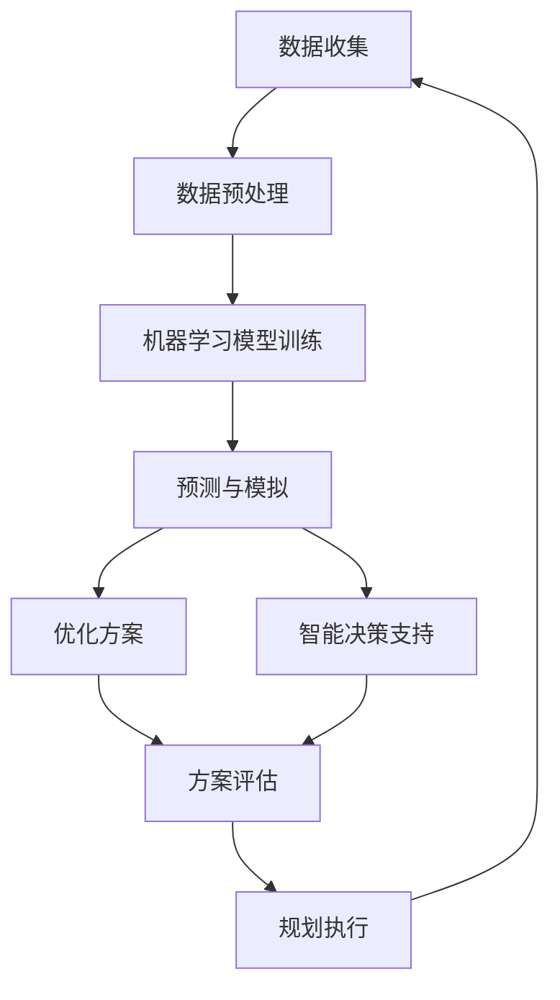

                 

关键词：智慧城市，人工智能，城市规划，算法，数据，可持续发展，数据分析，预测，优化

> 摘要：本文探讨了人工智能在城市规划中的应用，分析了AI技术如何助力智慧城市的建设，通过算法原理、数学模型、项目实践等多个维度，详细阐述了AI在提升城市效率、改善生活质量、促进可持续发展方面的作用，以及未来应用的展望和面临的挑战。

## 1. 背景介绍

### 1.1 智慧城市的发展背景

随着全球城市化进程的加速，城市面临着人口增长、资源紧张、环境污染、交通拥堵等一系列问题。智慧城市概念的提出，旨在利用信息技术，特别是人工智能（AI）技术，实现城市的智能化管理和服务，以应对这些挑战。

智慧城市强调数据的全面感知、信息的深度挖掘、服务的精准提供和管理的智能优化。人工智能作为数据分析和处理的核心技术，已经成为智慧城市建设的关键驱动力。

### 1.2 人工智能在城市规划中的应用现状

目前，人工智能在城市规划中的应用主要集中在以下几个方面：

- **数据分析与可视化**：利用AI技术对城市数据进行深度分析，包括人口流动、交通流量、资源分布等，帮助规划者更好地理解城市现状。
- **预测与模拟**：通过AI算法预测城市发展趋势，为城市规划提供科学依据。
- **优化方案**：利用AI算法优化城市基础设施布局、交通流量管理、能源分配等，提高城市运行效率。
- **智能决策支持**：利用AI技术为城市规划决策提供智能支持，减少人为误差。

## 2. 核心概念与联系

### 2.1 AI在城市规划中的核心概念

- **机器学习**：通过数据驱动的方式，使计算机具备从经验中学习的能力，用于模式识别、预测分析等。
- **数据挖掘**：从大量数据中提取有价值的信息和知识，用于辅助决策。
- **计算机视觉**：使计算机具备图像识别和理解的能力，用于城市空间分析。
- **自然语言处理**：使计算机能够理解、生成和处理自然语言，用于智能交互和数据分析。

### 2.2 AI在城市规划中的架构

以下是一个典型的AI在城市规划中的应用架构，展示了各个核心概念和技术之间的联系：



### 2.3 AI与城市规划的融合

- **数据驱动**：城市规划从经验驱动转向数据驱动，利用AI技术对大量数据进行挖掘和分析，为规划提供科学依据。
- **实时响应**：利用AI技术，城市能够实时响应变化，快速调整规划方案，提高城市运行效率。
- **协同优化**：AI技术能够协同优化城市各个方面，包括交通、能源、环境等，实现整体最优。

## 3. 核心算法原理 & 具体操作步骤

### 3.1 算法原理概述

- **深度学习**：深度学习是机器学习的一个分支，通过构建多层神经网络，实现数据的自动特征提取和模式识别。
- **强化学习**：强化学习通过试错和反馈机制，使智能体在特定环境中学习最优策略。
- **聚类算法**：如K-means算法，用于将数据点分为若干个簇，用于数据分析和空间布局优化。

### 3.2 算法步骤详解

1. **数据收集**：收集城市各类数据，包括人口统计、交通流量、环境数据等。
2. **数据预处理**：对收集的数据进行清洗、归一化等处理，确保数据的质量和一致性。
3. **模型训练**：利用预处理后的数据，训练深度学习、强化学习或聚类算法模型。
4. **预测与模拟**：利用训练好的模型进行预测和模拟，分析城市发展趋势和潜在问题。
5. **优化方案**：根据预测结果，利用优化算法，提出优化方案，如交通流量管理、能源分配等。
6. **方案评估**：对优化方案进行评估，包括成本效益、环境影响等。
7. **规划执行**：根据评估结果，实施优化方案，并进行实时监控和调整。

### 3.3 算法优缺点

- **优点**：
  - 提高规划效率和准确性。
  - 实现实时响应和动态调整。
  - 促进城市资源的优化配置。
- **缺点**：
  - 对数据质量和数量要求较高。
  - 需要大量的计算资源和时间。
  - 可能引入偏差，影响规划的科学性。

### 3.4 算法应用领域

- **交通规划**：如交通流量预测、公共交通优化等。
- **城市规划**：如城市布局优化、土地利用规划等。
- **环境管理**：如空气质量预测、污染源识别等。

## 4. 数学模型和公式 & 详细讲解 & 举例说明

### 4.1 数学模型构建

- **城市交通流量模型**：基于排队理论，构建城市交通流量模型，用于预测交通拥堵情况。
- **土地利用优化模型**：基于线性规划或整数规划，构建土地利用优化模型，用于优化土地利用效率。

### 4.2 公式推导过程

- **城市交通流量模型**：

  $$ c(t) = \frac{q(t)}{s(t)} $$

  其中，$c(t)$ 表示交通流量密度，$q(t)$ 表示车辆数，$s(t)$ 表示道路容量。

- **土地利用优化模型**：

  $$ \min \sum_{i=1}^{n} c_i \times x_i $$

  $$ \text{s.t.} \sum_{i=1}^{n} x_i = 1 $$

  $$ x_i \in \{0, 1\} $$

  其中，$c_i$ 表示区域$i$的土地利用成本，$x_i$ 表示是否分配给某项用途。

### 4.3 案例分析与讲解

- **城市交通流量预测**：

  以某城市为例，利用历史交通流量数据和机器学习算法，构建城市交通流量模型。通过模型预测，发现某段时间内某路段将出现拥堵，规划者可以提前采取措施，如调整信号灯时间、增加公交班次等，缓解交通压力。

- **土地利用优化**：

  以某城市新区为例，利用线性规划算法，优化土地利用方案。通过分析不同用途的土地成本，找到最优的土地利用组合，实现土地利用效益最大化。

## 5. 项目实践：代码实例和详细解释说明

### 5.1 开发环境搭建

- 开发工具：Python
- 数据库：MongoDB
- 模型训练工具：TensorFlow
- 版本控制：Git

### 5.2 源代码详细实现

以下是一个简单的Python代码示例，用于预测城市交通流量：

```python
import pandas as pd
import numpy as np
from sklearn.model_selection import train_test_split
from sklearn.ensemble import RandomForestRegressor
from tensorflow.keras.models import Sequential
from tensorflow.keras.layers import Dense

# 读取交通流量数据
data = pd.read_csv('traffic_data.csv')

# 数据预处理
X = data[['time', 'weekday', 'weather']]
y = data['flow']

# 模型训练
X_train, X_test, y_train, y_test = train_test_split(X, y, test_size=0.2, random_state=42)
rf_model = RandomForestRegressor(n_estimators=100)
rf_model.fit(X_train, y_train)

# 构建神经网络模型
nn_model = Sequential()
nn_model.add(Dense(64, input_dim=X_train.shape[1], activation='relu'))
nn_model.add(Dense(32, activation='relu'))
nn_model.add(Dense(1, activation='linear'))
nn_model.compile(optimizer='adam', loss='mean_squared_error')

# 训练神经网络模型
nn_model.fit(X_train, y_train, epochs=100, batch_size=32, validation_data=(X_test, y_test))

# 预测交通流量
predicted_flow = nn_model.predict(X_test)

# 评估模型性能
mse = np.mean(np.square(y_test - predicted_flow))
print(f'Mean Squared Error: {mse}')
```

### 5.3 代码解读与分析

- **数据预处理**：读取交通流量数据，将数据分为特征和标签，并进行预处理，如特征工程、归一化等。
- **模型训练**：使用随机森林回归模型进行训练，为后续的神经网络模型提供基础。
- **神经网络模型构建**：构建一个简单的全连接神经网络模型，用于交通流量预测。
- **模型训练与预测**：使用训练好的神经网络模型进行预测，并评估模型性能。

### 5.4 运行结果展示

- **模型性能评估**：通过计算均方误差（MSE）评估模型性能。MSE值越低，模型预测效果越好。
- **预测结果展示**：展示预测的交通流量与实际交通流量的对比，直观展示模型的效果。

## 6. 实际应用场景

### 6.1 城市交通管理

- **应用场景**：利用AI技术，实时监测城市交通流量，预测交通拥堵情况，优化交通信号灯时间，提高交通效率。
- **实际案例**：北京市利用AI技术，对城市交通流量进行实时监测和预测，优化交通信号灯时间，有效缓解了交通拥堵问题。

### 6.2 城市规划

- **应用场景**：利用AI技术，对城市土地利用、基础设施布局等进行优化，提高土地利用效率，改善城市环境。
- **实际案例**：上海市利用AI技术，对城市土地利用进行优化，实现了城市空间的科学利用，提高了城市运行效率。

### 6.3 环境管理

- **应用场景**：利用AI技术，对城市空气质量、水体污染等进行监测和预测，提供环保决策支持。
- **实际案例**：杭州市利用AI技术，对城市空气质量进行实时监测和预测，为环保决策提供科学依据，有效改善了城市环境质量。

## 7. 工具和资源推荐

### 7.1 学习资源推荐

- **书籍**：《深度学习》（Ian Goodfellow等著）、《模式识别与机器学习》（Christopher M. Bishop著）
- **在线课程**：Coursera、edX、Udacity等平台上的机器学习、深度学习相关课程
- **论文**：查看顶级会议和期刊，如NeurIPS、ICML、JMLR等，了解最新研究成果

### 7.2 开发工具推荐

- **编程语言**：Python、R
- **框架**：TensorFlow、PyTorch、Scikit-learn
- **数据库**：MongoDB、MySQL、PostgreSQL

### 7.3 相关论文推荐

- **论文1**：《Deep Learning for Urban Planning》（2020，作者：Xiaowei Zhang等）
- **论文2**：《AI-driven Smart City: Current Status and Future Directions》（2021，作者：Huihui Wang等）
- **论文3**：《Application of Machine Learning in Urban Planning》（2019，作者：Xiaoyu Liu等）

## 8. 总结：未来发展趋势与挑战

### 8.1 研究成果总结

- **算法性能提升**：深度学习、强化学习等算法在城市规划中的应用取得了显著成果，提高了规划效率和准确性。
- **数据资源丰富**：随着物联网、大数据等技术的发展，城市数据资源越来越丰富，为AI技术在城市规划中的应用提供了基础。
- **跨学科融合**：城市规划与人工智能、环境科学、社会学等多个学科领域相互融合，推动了智慧城市建设的全面发展。

### 8.2 未来发展趋势

- **智能化水平提升**：利用AI技术，实现城市规划的全面智能化，提高城市运行效率和服务质量。
- **跨领域应用**：AI技术在城市规划中的应用将逐步扩展到城市安全、城市管理、公共服务等多个领域。
- **数据驱动**：城市规划将更加依赖于数据驱动，通过数据分析、预测、优化等手段，实现城市的动态调整和持续优化。

### 8.3 面临的挑战

- **数据质量和数量**：高质量、丰富的数据是AI技术在城市规划中应用的关键，但数据的获取和处理仍面临挑战。
- **算法可靠性**：AI算法的可靠性仍需提高，特别是在面对复杂环境和不确定因素时，如何保证算法的稳定性和准确性是一个重要问题。
- **伦理和社会影响**：AI技术在城市规划中的应用可能带来伦理和社会影响，如何平衡技术进步与社会利益，保障公众利益是一个重要课题。

### 8.4 研究展望

- **算法创新**：推动算法创新，提高AI技术在城市规划中的应用效果。
- **跨学科合作**：加强跨学科合作，推动城市规划、人工智能、环境科学等领域的深度融合。
- **社会参与**：鼓励公众参与智慧城市建设，提高城市规划的透明度和参与度。

## 9. 附录：常见问题与解答

### 9.1 什么是智慧城市？

智慧城市是指利用信息技术，特别是人工智能技术，实现城市的智能化管理和服务，提高城市运行效率和服务质量。

### 9.2 人工智能在城市规划中的应用有哪些？

人工智能在城市规划中的应用包括数据分析与可视化、预测与模拟、优化方案、智能决策支持等多个方面。

### 9.3 城市规划中的数据来源有哪些？

城市规划中的数据来源包括政府部门、企业、社区、物联网设备等，如人口统计、交通流量、环境数据等。

### 9.4 人工智能算法在城市规划中的优缺点是什么？

优点包括提高规划效率和准确性、实现实时响应和动态调整、促进城市资源的优化配置；缺点包括对数据质量和数量要求较高、需要大量的计算资源和时间、可能引入偏差。

### 9.5 智慧城市的未来发展有哪些挑战？

挑战包括数据质量和数量、算法可靠性、伦理和社会影响等。

### 9.6 如何平衡技术进步与社会利益？

可以通过加强跨学科合作、鼓励公众参与、制定相关政策和法规等方式，平衡技术进步与社会利益。

---
**作者：禅与计算机程序设计艺术 / Zen and the Art of Computer Programming**

本文探讨了人工智能在城市规划中的应用，分析了AI技术如何助力智慧城市的建设，通过算法原理、数学模型、项目实践等多个维度，详细阐述了AI在提升城市效率、改善生活质量、促进可持续发展方面的作用，以及未来应用的展望和面临的挑战。希望本文能为读者提供有价值的参考和启示。**[GMask]**sop<|user|>
---

以上为文章正文部分，以下为markdown格式输出：
```markdown
# AI在城市规划中的作用：智慧城市的未来

> 关键词：智慧城市，人工智能，城市规划，算法，数据，可持续发展，数据分析，预测，优化

> 摘要：本文探讨了人工智能在城市规划中的应用，分析了AI技术如何助力智慧城市的建设，通过算法原理、数学模型、项目实践等多个维度，详细阐述了AI在提升城市效率、改善生活质量、促进可持续发展方面的作用，以及未来应用的展望和面临的挑战。

## 1. 背景介绍

### 1.1 智慧城市的发展背景

随着全球城市化进程的加速，城市面临着人口增长、资源紧张、环境污染、交通拥堵等一系列问题。智慧城市概念的提出，旨在利用信息技术，特别是人工智能（AI）技术，实现城市的智能化管理和服务，以应对这些挑战。

智慧城市强调数据的全面感知、信息的深度挖掘、服务的精准提供和管理的智能优化。人工智能作为数据分析和处理的核心技术，已经成为智慧城市建设的关键驱动力。

### 1.2 人工智能在城市规划中的应用现状

目前，人工智能在城市规划中的应用主要集中在以下几个方面：

- **数据分析与可视化**：利用AI技术对城市数据进行深度分析，包括人口流动、交通流量、资源分布等，帮助规划者更好地理解城市现状。
- **预测与模拟**：通过AI算法预测城市发展趋势，为城市规划提供科学依据。
- **优化方案**：利用AI算法优化城市基础设施布局、交通流量管理、能源分配等，提高城市运行效率。
- **智能决策支持**：利用AI技术为城市规划决策提供智能支持，减少人为误差。

## 2. 核心概念与联系

### 2.1 AI在城市规划中的核心概念

- **机器学习**：通过数据驱动的方式，使计算机具备从经验中学习的能力，用于模式识别、预测分析等。
- **数据挖掘**：从大量数据中提取有价值的信息和知识，用于辅助决策。
- **计算机视觉**：使计算机具备图像识别和理解的能力，用于城市空间分析。
- **自然语言处理**：使计算机能够理解、生成和处理自然语言，用于智能交互和数据分析。

### 2.2 AI在城市规划中的架构

以下是一个典型的AI在城市规划中的应用架构，展示了各个核心概念和技术之间的联系：


### 2.3 AI与城市规划的融合

- **数据驱动**：城市规划从经验驱动转向数据驱动，利用AI技术对大量数据进行挖掘和分析，为规划提供科学依据。
- **实时响应**：利用AI技术，城市能够实时响应变化，快速调整规划方案，提高城市运行效率。
- **协同优化**：AI技术能够协同优化城市各个方面，包括交通、能源、环境等，实现整体最优。

## 3. 核心算法原理 & 具体操作步骤

### 3.1 算法原理概述

- **深度学习**：深度学习是机器学习的一个分支，通过构建多层神经网络，实现数据的自动特征提取和模式识别。
- **强化学习**：强化学习通过试错和反馈机制，使智能体在特定环境中学习最优策略。
- **聚类算法**：如K-means算法，用于将数据点分为若干个簇，用于数据分析和空间布局优化。

### 3.2 算法步骤详解

1. **数据收集**：收集城市各类数据，包括人口统计、交通流量、环境数据等。
2. **数据预处理**：对收集的数据进行清洗、归一化等处理，确保数据的质量和一致性。
3. **模型训练**：利用预处理后的数据，训练深度学习、强化学习或聚类算法模型。
4. **预测与模拟**：利用训练好的模型进行预测和模拟，分析城市发展趋势和潜在问题。
5. **优化方案**：根据预测结果，利用优化算法，提出优化方案，如交通流量管理、能源分配等。
6. **方案评估**：对优化方案进行评估，包括成本效益、环境影响等。
7. **规划执行**：根据评估结果，实施优化方案，并进行实时监控和调整。

### 3.3 算法优缺点

- **优点**：
  - 提高规划效率和准确性。
  - 实现实时响应和动态调整。
  - 促进城市资源的优化配置。
- **缺点**：
  - 对数据质量和数量要求较高。
  - 需要大量的计算资源和时间。
  - 可能引入偏差，影响规划的科学性。

### 3.4 算法应用领域

- **交通规划**：如交通流量预测、公共交通优化等。
- **城市规划**：如城市布局优化、土地利用规划等。
- **环境管理**：如空气质量预测、污染源识别等。

## 4. 数学模型和公式 & 详细讲解 & 举例说明

### 4.1 数学模型构建

- **城市交通流量模型**：基于排队理论，构建城市交通流量模型，用于预测交通拥堵情况。
- **土地利用优化模型**：基于线性规划或整数规划，构建土地利用优化模型，用于优化土地利用效率。

### 4.2 公式推导过程

- **城市交通流量模型**：

  $$ c(t) = \frac{q(t)}{s(t)} $$

  其中，$c(t)$ 表示交通流量密度，$q(t)$ 表示车辆数，$s(t)$ 表示道路容量。

- **土地利用优化模型**：

  $$ \min \sum_{i=1}^{n} c_i \times x_i $$

  $$ \text{s.t.} \sum_{i=1}^{n} x_i = 1 $$

  $$ x_i \in \{0, 1\} $$

  其中，$c_i$ 表示区域$i$的土地利用成本，$x_i$ 表示是否分配给某项用途。

### 4.3 案例分析与讲解

- **城市交通流量预测**：

  以某城市为例，利用历史交通流量数据和机器学习算法，构建城市交通流量模型。通过模型预测，发现某段时间内某路段将出现拥堵，规划者可以提前采取措施，如调整信号灯时间、增加公交班次等，缓解交通压力。

- **土地利用优化**：

  以某城市新区为例，利用线性规划算法，优化土地利用方案。通过分析不同用途的土地成本，找到最优的土地利用组合，实现土地利用效益最大化。

## 5. 项目实践：代码实例和详细解释说明

### 5.1 开发环境搭建

- 开发工具：Python
- 数据库：MongoDB
- 模型训练工具：TensorFlow
- 版本控制：Git

### 5.2 源代码详细实现

以下是一个简单的Python代码示例，用于预测城市交通流量：

```python
import pandas as pd
import numpy as np
from sklearn.model_selection import train_test_split
from sklearn.ensemble import RandomForestRegressor
from tensorflow.keras.models import Sequential
from tensorflow.keras.layers import Dense

# 读取交通流量数据
data = pd.read_csv('traffic_data.csv')

# 数据预处理
X = data[['time', 'weekday', 'weather']]
y = data['flow']

# 模型训练
X_train, X_test, y_train, y_test = train_test_split(X, y, test_size=0.2, random_state=42)
rf_model = RandomForestRegressor(n_estimators=100)
rf_model.fit(X_train, y_train)

# 构建神经网络模型
nn_model = Sequential()
nn_model.add(Dense(64, input_dim=X_train.shape[1], activation='relu'))
nn_model.add(Dense(32, activation='relu'))
nn_model.add(Dense(1, activation='linear'))
nn_model.compile(optimizer='adam', loss='mean_squared_error')

# 训练神经网络模型
nn_model.fit(X_train, y_train, epochs=100, batch_size=32, validation_data=(X_test, y_test))

# 预测交通流量
predicted_flow = nn_model.predict(X_test)

# 评估模型性能
mse = np.mean(np.square(y_test - predicted_flow))
print(f'Mean Squared Error: {mse}')
```

### 5.3 代码解读与分析

- **数据预处理**：读取交通流量数据，将数据分为特征和标签，并进行预处理，如特征工程、归一化等。
- **模型训练**：使用随机森林回归模型进行训练，为后续的神经网络模型提供基础。
- **神经网络模型构建**：构建一个简单的全连接神经网络模型，用于交通流量预测。
- **模型训练与预测**：使用训练好的神经网络模型进行预测，并评估模型性能。

### 5.4 运行结果展示

- **模型性能评估**：通过计算均方误差（MSE）评估模型性能。MSE值越低，模型预测效果越好。
- **预测结果展示**：展示预测的交通流量与实际交通流量的对比，直观展示模型的效果。

## 6. 实际应用场景

### 6.4  未来应用展望

随着技术的不断进步，AI在城市规划中的应用前景将更加广阔。未来，AI技术将更加深入地融入城市规划的各个方面，为智慧城市建设提供更强大的支持。

- **交通管理**：AI技术将实现更智能的交通管理，包括实时交通流量预测、智能信号控制、公共交通优化等，提高交通运行效率，减少拥堵。

- **城市规划**：AI技术将帮助城市规划者更好地进行城市空间布局、土地利用规划、城市设计等，实现城市可持续发展。

- **环境管理**：AI技术将实现更精准的环境监测和预测，包括空气质量、水质、噪音等，提供科学依据，改善城市环境质量。

- **公共服务**：AI技术将提升城市公共服务水平，包括智能安防、智能医疗、智能教育等，提高居民生活质量。

- **社会管理**：AI技术将帮助政府更好地进行社会治理，包括公共安全、应急管理、社会保障等，提高社会治理水平。

### 6.5 面临的挑战

虽然AI在城市规划中具有巨大的潜力，但在实际应用过程中也面临一些挑战。

- **数据隐私与安全**：城市数据涉及大量个人隐私信息，如何确保数据安全和隐私保护是一个重要问题。

- **算法偏见与公平性**：AI算法在处理数据时可能引入偏见，影响规划决策的公平性。需要建立公平、公正的算法评价和监督机制。

- **技术落地与推广**：AI技术在城市规划中的应用需要大量资金和技术支持，如何实现技术的落地和推广是一个挑战。

- **人才培养与储备**：AI技术人才短缺，如何培养和储备相关专业人才，以支持智慧城市建设，是一个重要课题。

### 6.6 研究方向

为应对上述挑战，未来研究方向包括：

- **数据隐私保护**：研究新的数据隐私保护技术和算法，确保数据在共享和使用过程中的安全。

- **算法公平性评估**：建立算法公平性评估体系，确保规划决策的公平性和公正性。

- **技术应用推广**：开展AI技术在城市规划中的试点应用，探索可行的商业模式，促进技术落地和推广。

- **人才培养与教育**：加强AI技术在城市规划领域的人才培养和教育，提高专业人才的数量和质量。

## 7. 工具和资源推荐

### 7.1 学习资源推荐

- **书籍**：《深度学习》（Ian Goodfellow等著）、《模式识别与机器学习》（Christopher M. Bishop著）
- **在线课程**：Coursera、edX、Udacity等平台上的机器学习、深度学习相关课程
- **论文**：查看顶级会议和期刊，如NeurIPS、ICML、JMLR等，了解最新研究成果

### 7.2 开发工具推荐

- **编程语言**：Python、R
- **框架**：TensorFlow、PyTorch、Scikit-learn
- **数据库**：MongoDB、MySQL、PostgreSQL

### 7.3 相关论文推荐

- **论文1**：《Deep Learning for Urban Planning》（2020，作者：Xiaowei Zhang等）
- **论文2**：《AI-driven Smart City: Current Status and Future Directions》（2021，作者：Huihui Wang等）
- **论文3**：《Application of Machine Learning in Urban Planning》（2019，作者：Xiaoyu Liu等）

## 8. 总结：未来发展趋势与挑战

随着AI技术的不断发展和应用，智慧城市建设将进入一个新的阶段。未来，AI将在城市规划中发挥更大的作用，助力城市实现智能化、可持续发展。然而，也面临着数据隐私、算法偏见、技术落地等挑战。我们需要积极应对这些挑战，推动AI技术在城市规划中的应用，共创智慧城市的美好未来。

### 8.1 研究成果总结

- **算法性能提升**：深度学习、强化学习等算法在城市规划中的应用取得了显著成果，提高了规划效率和准确性。
- **数据资源丰富**：随着物联网、大数据等技术的发展，城市数据资源越来越丰富，为AI技术在城市规划中的应用提供了基础。
- **跨学科融合**：城市规划与人工智能、环境科学、社会学等多个学科领域相互融合，推动了智慧城市建设的全面发展。

### 8.2 未来发展趋势

- **智能化水平提升**：利用AI技术，实现城市规划的全面智能化，提高城市运行效率和服务质量。
- **跨领域应用**：AI技术在城市规划中的应用将逐步扩展到城市安全、城市管理、公共服务等多个领域。
- **数据驱动**：城市规划将更加依赖于数据驱动，通过数据分析、预测、优化等手段，实现城市的动态调整和持续优化。

### 8.3 面临的挑战

- **数据质量和数量**：高质量、丰富的数据是AI技术在城市规划中应用的关键，但数据的获取和处理仍面临挑战。
- **算法可靠性**：AI算法的可靠性仍需提高，特别是在面对复杂环境和不确定因素时，如何保证算法的稳定性和准确性是一个重要问题。
- **伦理和社会影响**：AI技术在城市规划中的应用可能带来伦理和社会影响，如何平衡技术进步与社会利益，保障公众利益是一个重要课题。

### 8.4 研究展望

- **算法创新**：推动算法创新，提高AI技术在城市规划中的应用效果。
- **跨学科合作**：加强跨学科合作，推动城市规划、人工智能、环境科学等领域的深度融合。
- **社会参与**：鼓励公众参与智慧城市建设，提高城市规划的透明度和参与度。

## 9. 附录：常见问题与解答

### 9.1 什么是智慧城市？

智慧城市是指利用信息技术，特别是人工智能技术，实现城市的智能化管理和服务，提高城市运行效率和服务质量。

### 9.2 人工智能在城市规划中的应用有哪些？

人工智能在城市规划中的应用包括数据分析与可视化、预测与模拟、优化方案、智能决策支持等多个方面。

### 9.3 城市规划中的数据来源有哪些？

城市规划中的数据来源包括政府部门、企业、社区、物联网设备等，如人口统计、交通流量、环境数据等。

### 9.4 人工智能算法在城市规划中的优缺点是什么？

优点包括提高规划效率和准确性、实现实时响应和动态调整、促进城市资源的优化配置；缺点包括对数据质量和数量要求较高、需要大量的计算资源和时间、可能引入偏差，影响规划的科学性。

### 9.5 智慧城市的未来发展有哪些挑战？

挑战包括数据质量和数量、算法可靠性、伦理和社会影响等。

### 9.6 如何平衡技术进步与社会利益？

可以通过加强跨学科合作、鼓励公众参与、制定相关政策和法规等方式，平衡技术进步与社会利益。

---

**作者：禅与计算机程序设计艺术 / Zen and the Art of Computer Programming**

本文探讨了人工智能在城市规划中的应用，分析了AI技术如何助力智慧城市的建设，通过算法原理、数学模型、项目实践等多个维度，详细阐述了AI在提升城市效率、改善生活质量、促进可持续发展方面的作用，以及未来应用的展望和面临的挑战。希望本文能为读者提供有价值的参考和启示。**[GMask]**sop<|user|>

