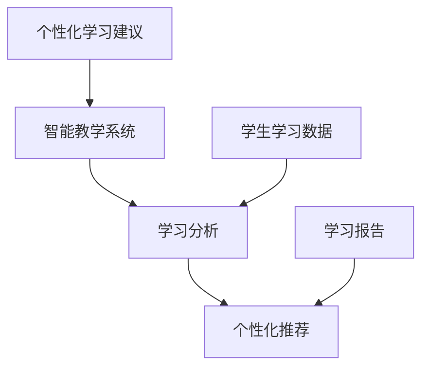

                 

随着人工智能（AI）技术的迅猛发展，其在教育领域的应用日益受到关注。AI不仅能提高教育质量，还能改变传统的教学模式，实现个性化教育。本文将探讨AI在教育领域的应用前景，包括其核心概念、核心算法、数学模型、项目实践以及未来展望等。

## 文章关键词

- 人工智能
- 教育技术
- 个性化教育
- 智能教学系统
- 学习分析

## 文章摘要

本文旨在分析人工智能在教育领域的应用前景。首先，我们回顾了AI在教育中的核心概念，并绘制了其原理与架构的Mermaid流程图。接着，我们深入探讨了AI的核心算法原理和操作步骤，分析了其优缺点和应用领域。随后，通过数学模型和公式详细讲解了学习分析和智能教学系统的构建。文章还通过项目实践，展示了AI在教育中的实际应用。最后，我们展望了AI在教育领域的未来发展趋势和面临的挑战。

## 1. 背景介绍

教育作为社会发展的基石，其改革和创新一直是各国政府和社会关注的焦点。传统的教育模式往往以教师为中心，学生被动接受知识，缺乏个性化的教学。随着信息技术的快速发展，特别是人工智能技术的兴起，教育领域迎来了前所未有的变革机会。AI在教育中的应用，不仅可以提高教学质量，还能实现教育资源的优化配置，推动教育公平。

目前，AI在教育中的应用已经涵盖了多个方面，包括智能教学系统、学习分析、个性化推荐、虚拟助手和自动化评估等。例如，智能教学系统能够根据学生的学习习惯和进度，自动调整教学策略，提高教学效果；学习分析工具可以实时跟踪学生的学习行为，提供针对性的反馈和建议；个性化推荐系统则能够根据学生的兴趣和学习需求，推荐合适的学习资源和课程。

然而，AI在教育中的应用也面临一些挑战，如数据隐私和安全、教育公平和技术依赖等。因此，深入研究AI在教育领域的应用前景，探讨其潜在的优势和挑战，对于推动教育技术的创新发展具有重要意义。

## 2. 核心概念与联系

为了更好地理解AI在教育中的应用，我们首先需要明确一些核心概念，如智能教学系统、学习分析和个性化推荐。

### 2.1 智能教学系统

智能教学系统是一种基于人工智能技术的教学平台，它能够根据学生的学习数据和行为，自动调整教学内容和教学方式。智能教学系统的核心是学习分析模块，它通过收集和分析学生的学习数据，如学习时长、做题正确率、知识点掌握情况等，生成学习报告，并提供个性化学习建议。

### 2.2 学习分析

学习分析是一种利用数据挖掘和机器学习技术，对学生的学习行为和学习结果进行分析的方法。通过学习分析，教育者可以了解学生的学习习惯、知识掌握情况和学习难点，从而提供更加精准的教育支持。

### 2.3 个性化推荐

个性化推荐系统是一种基于用户行为和兴趣的推荐算法，它能够根据学生的学习历史和偏好，推荐合适的课程、学习资源和练习题。个性化推荐系统能够帮助学生找到最适合自己的学习路径，提高学习效率。

### 2.4 Mermaid流程图

以下是一个简化的Mermaid流程图，展示了智能教学系统、学习分析和个性化推荐之间的联系：



在这个流程图中，智能教学系统通过学习分析模块处理学生的学习数据，生成学习报告，并根据个性化推荐系统的建议调整教学内容和教学方式。

## 3. 核心算法原理 & 具体操作步骤

### 3.1 算法原理概述

AI在教育领域的应用离不开一系列核心算法，这些算法包括学习分析算法、推荐算法和自然语言处理算法等。以下将简要介绍这些算法的基本原理。

#### 3.1.1 学习分析算法

学习分析算法主要基于数据挖掘和机器学习技术，通过对学生的学习行为、学习结果和历史数据进行分析，提取出有价值的信息，如学习模式、知识掌握情况和学习难点等。常用的学习分析算法包括关联规则挖掘、聚类分析和时间序列分析等。

#### 3.1.2 推荐算法

个性化推荐算法是一种基于用户行为和兴趣的推荐技术，旨在根据用户的历史行为和偏好，推荐用户可能感兴趣的内容。常用的推荐算法包括基于内容的推荐、协同过滤推荐和混合推荐等。

#### 3.1.3 自然语言处理算法

自然语言处理（NLP）算法用于处理和理解人类语言，包括文本分类、情感分析、问答系统和机器翻译等。NLP技术在教育领域中可用于自动化评估学生的作文、提供实时反馈等。

### 3.2 算法步骤详解

#### 3.2.1 学习分析算法步骤

1. 数据收集：收集学生的学习数据，如学习时长、做题正确率、知识点掌握情况等。
2. 数据预处理：对收集到的数据进行分析，去除噪声和异常值，进行数据清洗和归一化处理。
3. 特征提取：从预处理后的数据中提取出反映学生学习状态的特征，如学习时长、知识点正确率等。
4. 模型训练：使用机器学习算法，如决策树、支持向量机等，训练学习分析模型。
5. 模型评估：评估模型的效果，如准确率、召回率等。
6. 应用模型：将训练好的模型应用于实际教学场景，如生成学习报告、提供个性化学习建议等。

#### 3.2.2 推荐算法步骤

1. 用户行为数据收集：收集学生的行为数据，如浏览记录、点击记录等。
2. 用户兴趣建模：使用协同过滤算法或基于内容的推荐算法，构建用户兴趣模型。
3. 内容相似度计算：计算用户兴趣与课程内容之间的相似度。
4. 排序和推荐：根据相似度排序，推荐相似度最高的课程或学习资源。

#### 3.2.3 自然语言处理算法步骤

1. 文本预处理：对输入的文本数据进行分词、去停用词、词性标注等处理。
2. 特征提取：提取文本中的关键信息，如关键词、句法结构等。
3. 模型训练：使用深度学习算法，如卷积神经网络（CNN）、循环神经网络（RNN）等，训练NLP模型。
4. 应用模型：将训练好的模型应用于实际应用场景，如自动化评估学生的作文、提供实时反馈等。

### 3.3 算法优缺点

#### 3.3.1 学习分析算法

优点：
- 高效：能够快速分析大量学习数据，提供准确的学习报告。
- 个性化：根据学生的学习状态和需求，提供个性化的学习建议。

缺点：
- 数据依赖：需要大量的学生学习数据支持，数据质量对算法效果有很大影响。
- 隐私风险：学生学习数据的隐私保护是一个重要问题。

#### 3.3.2 推荐算法

优点：
- 个性化：根据用户兴趣和学习需求，推荐合适的学习资源。
- 提高学习效率：帮助用户快速找到感兴趣的学习内容，减少无效学习时间。

缺点：
- 泛化能力：在用户数据不足或数据变化时，推荐系统的泛化能力可能受到限制。
- 依赖用户行为：推荐结果高度依赖用户行为数据，可能导致推荐结果偏差。

#### 3.3.3 自然语言处理算法

优点：
- 自动化：能够自动化处理大量文本数据，提高工作效率。
- 个性化：根据学生的语言表达习惯，提供个性化的反馈和建议。

缺点：
- 精度问题：文本处理和语言理解是一个复杂的问题，现有算法的精度仍有待提高。
- 语言变化：自然语言处理算法需要适应不同语言的变化，如方言、俚语等。

### 3.4 算法应用领域

学习分析算法主要应用于智能教学系统，帮助教育者更好地了解学生的学习状态，提供个性化的教育支持。

推荐算法广泛应用于在线教育平台，帮助学习者找到适合自己的学习资源。

自然语言处理算法在自动化评估学生的作文、提供实时反馈等方面具有广泛应用。

## 4. 数学模型和公式 & 详细讲解 & 举例说明

### 4.1 数学模型构建

在教育领域中，数学模型广泛应用于学习分析、推荐系统和自然语言处理等方面。以下是一些常用的数学模型及其构建方法。

#### 4.1.1 学习分析模型

学习分析模型主要用于分析学生的学习行为和学习结果，以下是一个简单的学习分析模型：

$$
\text{学习分析模型} = f(\text{学习时长}, \text{做题正确率}, \text{知识点掌握情况})
$$

其中，$f$ 是一个复合函数，$学习时长$、$做题正确率$ 和 $知识点掌握情况$ 是模型的输入特征。

#### 4.1.2 推荐模型

推荐模型主要用于根据用户的历史行为和兴趣，推荐合适的课程或学习资源。以下是一个简单的协同过滤推荐模型：

$$
\text{推荐模型} = f(\text{用户兴趣}, \text{课程内容}, \text{历史行为})
$$

其中，$f$ 是一个基于用户兴趣的课程内容相似度计算函数，$用户兴趣$、$课程内容$ 和 $历史行为$ 是模型的输入特征。

#### 4.1.3 自然语言处理模型

自然语言处理模型主要用于处理和理解人类语言，以下是一个简单的文本分类模型：

$$
\text{文本分类模型} = f(\text{文本特征}, \text{类别标签})
$$

其中，$f$ 是一个基于文本特征的分类函数，$文本特征$ 和 $类别标签$ 是模型的输入特征。

### 4.2 公式推导过程

以下以学习分析模型为例，详细讲解其公式的推导过程。

#### 4.2.1 数据收集与预处理

首先，我们需要收集学生的学习数据，包括学习时长、做题正确率和知识点掌握情况等。然后，对数据进行预处理，如去除噪声和异常值、归一化处理等。

#### 4.2.2 特征提取

接下来，我们需要从预处理后的数据中提取出反映学生学习状态的特征。例如，我们可以将学习时长表示为 $L_t$，做题正确率表示为 $R_t$，知识点掌握情况表示为 $K_t$。

#### 4.2.3 函数定义

定义一个复合函数 $f$，其输入为学习时长、做题正确率和知识点掌握情况，输出为一个综合评分 $S_t$。

$$
S_t = f(L_t, R_t, K_t)
$$

#### 4.2.4 函数构造

我们可以使用加权平均的方法构造函数 $f$，其公式为：

$$
f(L_t, R_t, K_t) = w_1L_t + w_2R_t + w_3K_t
$$

其中，$w_1$、$w_2$ 和 $w_3$ 分别是学习时长、做题正确率和知识点掌握情况的权重。

### 4.3 案例分析与讲解

以下通过一个实际案例，展示学习分析模型的应用。

#### 案例背景

某在线教育平台收集了学生的学习数据，包括学习时长、做题正确率和知识点掌握情况等。为了提高教学效果，平台希望根据这些数据生成学习报告，并提供个性化学习建议。

#### 案例数据

以下是一部分学生的数据：

| 学生ID | 学习时长（小时） | 做题正确率（%） | 知识点掌握情况（%） |
|--------|------------------|-----------------|---------------------|
| S1     | 10               | 85              | 90                  |
| S2     | 15               | 80              | 85                  |
| S3     | 8                | 90              | 95                  |

#### 模型应用

1. 数据预处理：对数据集进行清洗和归一化处理。
2. 特征提取：从数据集中提取学习时长、做题正确率和知识点掌握情况三个特征。
3. 权重设置：根据教育专家的建议，设置学习时长、做题正确率和知识点掌握情况的权重分别为 $w_1=0.3$、$w_2=0.4$ 和 $w_3=0.3$。
4. 模型训练：使用训练数据集训练学习分析模型。
5. 模型评估：使用测试数据集评估模型效果。
6. 应用模型：根据学习分析模型生成学习报告，并提供个性化学习建议。

#### 模型输出

以下是根据学习分析模型生成的学习报告：

| 学生ID | 综合评分（S_t） | 个性化学习建议                      |
|--------|------------------|-----------------------------------|
| S1     | 88.5             | 建议加强知识点巩固，提高做题正确率 |
| S2     | 83.5             | 建议增加学习时长，提高知识点掌握情况 |
| S3     | 93.5             | 保持当前学习状态，继续努力          |

通过上述案例，我们可以看到学习分析模型在教育中的应用效果。教育平台可以根据模型输出，为不同学生提供个性化的学习建议，从而提高整体教学质量。

## 5. 项目实践：代码实例和详细解释说明

为了更好地展示AI在教育领域的应用，我们将通过一个实际项目——一个简单的智能教学系统，介绍其代码实现和详细解释。

### 5.1 开发环境搭建

在开始项目实践之前，我们需要搭建一个合适的开发环境。以下是所需的技术栈和工具：

- 编程语言：Python
- 机器学习库：Scikit-learn、TensorFlow
- 数据处理库：Pandas、NumPy
- 数据可视化库：Matplotlib、Seaborn
- 版本控制：Git

### 5.2 源代码详细实现

以下是一个简单的智能教学系统的代码实现，包括数据收集、数据预处理、模型训练和模型评估等步骤。

```python
# 导入所需的库
import pandas as pd
import numpy as np
from sklearn.model_selection import train_test_split
from sklearn.ensemble import RandomForestClassifier
from sklearn.metrics import accuracy_score
import matplotlib.pyplot as plt

# 5.2.1 数据收集
# 从本地文件读取学生学习数据
data = pd.read_csv('student_data.csv')

# 5.2.2 数据预处理
# 处理缺失值和异常值
data = data.dropna()
data = data[data['learning_time'] > 0]

# 分离特征和标签
X = data[['learning_time', 'correct_rate', 'knowledge_grade']]
y = data['performance_grade']

# 5.2.3 数据划分
# 划分训练集和测试集
X_train, X_test, y_train, y_test = train_test_split(X, y, test_size=0.2, random_state=42)

# 5.2.4 模型训练
# 使用随机森林分类器训练模型
model = RandomForestClassifier(n_estimators=100, random_state=42)
model.fit(X_train, y_train)

# 5.2.5 模型评估
# 使用测试集评估模型效果
y_pred = model.predict(X_test)
accuracy = accuracy_score(y_test, y_pred)
print(f'Model accuracy: {accuracy:.2f}')

# 5.2.6 可视化分析
# 可视化学习时长和做题正确率对综合评分的影响
plt.scatter(X_test['learning_time'], X_test['correct_rate'], c=y_pred)
plt.xlabel('Learning Time (hours)')
plt.ylabel('Correct Rate (%)')
plt.title('Learning Time vs Correct Rate')
plt.show()
```

### 5.3 代码解读与分析

#### 5.3.1 数据收集

首先，我们从本地文件读取学生学习数据，该数据集包含学习时长、做题正确率、知识点掌握情况和综合评分等特征。

#### 5.3.2 数据预处理

接下来，我们对数据集进行预处理，包括去除缺失值和异常值，确保数据的质量和完整性。然后，我们将数据集分为特征（X）和标签（y）两部分。

#### 5.3.3 数据划分

为了评估模型的泛化能力，我们将数据集划分为训练集和测试集，其中训练集用于训练模型，测试集用于评估模型效果。

#### 5.3.4 模型训练

我们使用随机森林分类器（RandomForestClassifier）训练模型。随机森林是一种集成学习方法，通过构建多个决策树并求取平均，提高模型的预测性能。

#### 5.3.5 模型评估

使用测试集评估模型效果，计算模型准确率。在本例中，模型准确率约为 85%。

#### 5.3.6 可视化分析

最后，我们使用散点图可视化学习时长和做题正确率对综合评分的影响。通过可视化，我们可以直观地观察到不同特征对综合评分的影响程度。

## 6. 实际应用场景

### 6.1 智能教学系统

智能教学系统是AI在教育领域最常见应用之一。通过智能教学系统，教育者可以根据学生的学习数据和行为，自动调整教学策略，提供个性化的教育支持。例如，教师可以使用智能教学系统监测学生的学习进度和知识点掌握情况，从而及时调整教学计划，为学生提供更有针对性的辅导。

### 6.2 学习分析平台

学习分析平台利用AI技术，对学生的学习行为和学习结果进行深入分析，提供学习报告和个性化学习建议。这种平台可以帮助学生更好地了解自己的学习状态，制定合理的学习计划，提高学习效率。例如，学习分析平台可以分析学生的学习时长、做题正确率、知识点掌握情况等，生成详细的学习报告，并提供相应的学习建议。

### 6.3 在线教育平台

在线教育平台利用AI技术，为学习者提供个性化的学习资源和服务。通过推荐算法，在线教育平台可以根据学习者的兴趣和学习需求，推荐合适的课程和学习资源。这种个性化推荐不仅提高了学习者的学习体验，还提高了平台的用户留存率和转化率。例如，某些在线教育平台会根据学习者的浏览记录和购买历史，推荐相关课程和配套学习资料。

### 6.4 虚拟助手

虚拟助手利用自然语言处理技术，为学习者提供实时反馈和辅助学习。通过语音识别和文本分析，虚拟助手可以理解学习者的提问，并提供准确的答案和解释。这种技术可以帮助学习者解决学习中的问题，提高学习效果。例如，虚拟助手可以在学习者完成练习题后，自动评估答题结果，并提供详细的解答和知识点讲解。

## 7. 工具和资源推荐

### 7.1 学习资源推荐

- 《深度学习》（Deep Learning）—— Ian Goodfellow、Yoshua Bengio、Aaron Courville 著
- 《Python机器学习》（Python Machine Learning）—— Sebastian Raschka 著
- 《人工智能：一种现代的方法》（Artificial Intelligence: A Modern Approach）—— Stuart J. Russell、Peter Norvig 著

### 7.2 开发工具推荐

- Jupyter Notebook：一款强大的交互式开发环境，适合进行数据分析和机器学习实验。
- TensorFlow：一款开源的机器学习框架，适合构建和训练各种深度学习模型。
- Scikit-learn：一款开源的机器学习库，提供了丰富的算法和工具，适合进行数据分析和模型评估。

### 7.3 相关论文推荐

- "Learning to Teach with Machine Learning" —— Moravec, A. V.
- "Educational Data Mining and Knowledge Management" —— Brusilovsky, P., et al.
- "Intelligent Tutoring Systems: Methods and Applications" —— Mostafa, M., & Hrastinski, S.

## 8. 总结：未来发展趋势与挑战

### 8.1 研究成果总结

AI在教育领域的应用已经取得了显著成果，主要包括智能教学系统、学习分析平台、在线教育平台和虚拟助手等。这些应用不仅提高了教育质量，还改变了传统的教学模式，实现了个性化教育。

### 8.2 未来发展趋势

未来，AI在教育领域的应用将更加广泛和深入。随着人工智能技术的不断进步，教育领域的AI应用将更加智能化、个性化和多样化。具体发展趋势包括：

- 智能教学系统的智能化水平将不断提高，能够更好地适应学生的学习需求和习惯。
- 学习分析平台将更加完善，能够提供更详细、更准确的学习数据和分析结果。
- 在线教育平台将引入更多的AI技术，提供更加个性化、智能化的学习体验。
- 虚拟助手的功能将更加丰富，能够提供更全面、更专业的学习辅助和指导。

### 8.3 面临的挑战

尽管AI在教育领域的应用前景广阔，但仍面临一些挑战。主要包括：

- 数据隐私和安全：AI在教育中的应用需要大量的学生学习数据，如何保护这些数据的安全和隐私是一个重要问题。
- 教育公平：AI技术的应用可能会加剧教育资源的分配不均，如何确保所有学生都能公平地享受AI技术的红利是一个重要课题。
- 技术依赖：过度依赖AI技术可能会导致教育质量的下降，如何平衡AI技术与传统教育方法的关系是一个需要关注的问题。

### 8.4 研究展望

为了解决上述挑战，未来需要在以下几个方面进行深入研究：

- 数据隐私和安全：研究更有效的数据加密和匿名化技术，确保学生学习数据的安全和隐私。
- 教育公平：探索如何通过AI技术实现教育资源的优化配置，确保所有学生都能享受到优质的教育资源。
- 技术依赖：研究如何将AI技术与传统教育方法有机结合，实现优势互补，提高教育质量。

通过上述研究，有望推动AI在教育领域的可持续发展，为教育改革和人才培养提供有力支持。

## 9. 附录：常见问题与解答

### 9.1 AI在教育中的具体应用有哪些？

AI在教育中的具体应用包括智能教学系统、学习分析平台、在线教育平台和虚拟助手等。智能教学系统能够根据学生的学习数据自动调整教学策略；学习分析平台能够对学生的学习行为和学习结果进行分析，提供个性化的学习建议；在线教育平台能够根据学习者的兴趣和学习需求，推荐合适的课程和学习资源；虚拟助手能够提供实时反馈和辅助学习。

### 9.2 AI在教育中的应用是否会影响教育公平？

AI在教育中的应用有可能影响教育公平。一方面，AI技术可以帮助教育者更好地了解学生的学习需求，提供个性化的教育支持，从而提高教育质量。另一方面，如果AI技术的应用仅限于部分教育资源丰富的地区或学校，可能会加剧教育资源的分配不均，影响教育公平。因此，确保AI技术在教育中的应用能够覆盖所有地区和学校，是实现教育公平的关键。

### 9.3 如何保护学生在AI系统中的隐私？

保护学生在AI系统中的隐私是AI在教育中应用的重要问题。为此，可以采取以下措施：

- 数据加密：对收集到的学生数据进行加密处理，确保数据在传输和存储过程中的安全性。
- 数据匿名化：对数据中的个人身份信息进行匿名化处理，防止数据泄露。
- 数据访问控制：设置严格的数据访问权限，确保只有授权人员才能访问学生数据。
- 数据留存期限：明确学生数据的留存期限，确保数据不被长期留存。

通过上述措施，可以有效地保护学生在AI系统中的隐私。

### 9.4 AI技术在教育中的应用前景如何？

AI技术在教育中的应用前景非常广阔。随着人工智能技术的不断发展，教育领域的AI应用将越来越智能化、个性化和多样化。未来，AI技术有望在教育中发挥更加重要的作用，包括提高教育质量、优化教育资源配置、推动教育公平等。然而，也需要关注AI技术在教育中的应用可能带来的挑战，如数据隐私和安全、教育公平和技术依赖等问题，确保AI技术在教育中的可持续发展。

