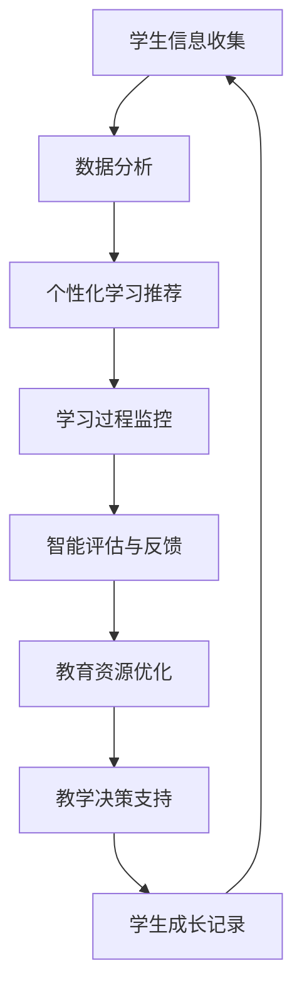
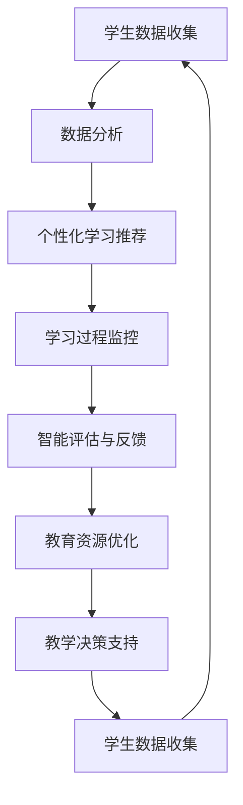

                 

关键词：人工智能，教育，技术应用，学习效果，个性化教学

> 摘要：本文将探讨人工智能（AI）在教育领域的广泛应用前景，分析AI技术如何通过个性化教学、智能评估和自动化内容生成等方面，提升教育质量和学习体验。同时，文章还将展望AI技术在教育领域的未来发展趋势，以及可能面临的挑战和解决方案。

## 1. 背景介绍

在教育领域，人工智能技术的应用正在迅速扩展，从传统的课堂辅助系统到现代化的智能学习平台，AI技术正逐步改变着教育的方方面面。随着大数据、云计算和深度学习等技术的不断进步，AI在教育领域的潜力愈发显现。

传统教育模式通常采用“一刀切”的方法，难以满足不同学生的个性化需求。而AI技术的引入，可以为教育带来定制化、智能化的新可能性。通过分析学生的学习行为和兴趣，AI系统可以推荐适合的学习资源和教学方法，从而提高学习效果。

## 2. 核心概念与联系

### 2.1 人工智能在教育领域的应用架构

为了更好地理解AI在教育领域的应用，我们可以通过Mermaid流程图来描述其核心概念和架构：



### 2.2 人工智能与教育的深度融合

AI技术不仅能够为教育提供技术支持，还可以与教育理念深度融合，形成新的教育模式。例如，通过自然语言处理技术（NLP）和机器学习算法，AI可以分析学生的回答和反馈，提供个性化的辅导和建议。同时，利用计算机视觉技术，AI能够实现自动化作业批改和课堂行为分析。

## 3. 核心算法原理 & 具体操作步骤

### 3.1 个性化学习推荐算法原理

个性化学习推荐算法是AI技术在教育领域的重要应用之一。其核心思想是根据学生的学习行为、兴趣和成绩等数据，为学生推荐最适合的学习资源。

#### 3.1.1 算法原理概述

个性化学习推荐算法通常基于协同过滤、基于内容过滤和混合推荐等策略。协同过滤通过分析用户之间的相似性来推荐资源，而基于内容过滤则通过资源的内容特征进行推荐。

#### 3.1.2 算法步骤详解

1. **用户特征提取**：收集用户的学习行为数据，如学习时间、学习内容、考试分数等，提取用户特征向量。
2. **资源特征提取**：对学习资源进行内容分析，提取其特征向量。
3. **相似性计算**：计算用户和资源之间的相似性分数。
4. **推荐生成**：根据相似性分数，生成个性化的学习资源推荐列表。

#### 3.1.3 算法优缺点

- **优点**：能够根据学生的个性化需求推荐学习资源，提高学习效果。
- **缺点**：需要大量的用户行为数据和资源特征，同时推荐结果的准确性和可靠性有待提高。

#### 3.1.4 算法应用领域

个性化学习推荐算法在教育领域有广泛的应用，包括在线学习平台、智能辅导系统和个性化课程设计等。

## 4. 数学模型和公式 & 详细讲解 & 举例说明

### 4.1 数学模型构建

个性化学习推荐算法的核心在于建立用户和资源之间的数学模型。常用的模型包括矩阵分解和深度学习模型等。

#### 4.1.1 矩阵分解模型

假设用户和资源可以表示为两个矩阵$U$和$V$，其中$U_{ij}$表示用户$i$对资源$j$的评分，$V_{ij}$表示资源$j$对用户$i$的吸引力。矩阵分解的目标是最小化误差函数：

$$\min_{U,V}\sum_{i=1}^{m}\sum_{j=1}^{n}(U_{ij}-V_{ij})^2$$

通过求解上述优化问题，可以得到用户和资源的低维表示，从而进行推荐。

#### 4.1.2 深度学习模型

深度学习模型可以自动学习用户和资源的特征表示。一个简单的深度学习模型可以是多层感知机（MLP）：

$$y = \sigma(W_{L} \cdot \phi(W_{L-1} \cdot \phi(... \cdot \phi(W_{1} \cdot x^{(i)} + b_{1}) + ... + b_{L-1}) + b_{L})$$

其中，$x^{(i)}$是用户特征向量，$y$是预测的评分，$\phi$是激活函数，$W$和$b$是模型的权重和偏置。

### 4.2 公式推导过程

以矩阵分解模型为例，推导最小化误差函数的优化过程：

$$\frac{\partial}{\partial U} \sum_{i=1}^{m}\sum_{j=1}^{n}(U_{ij}-V_{ij})^2 = -2\sum_{i=1}^{m}\sum_{j=1}^{n}(U_{ij}-V_{ij}) \cdot \frac{\partial}{\partial U_{ij}} V_{ij}$$

$$\frac{\partial}{\partial V} \sum_{i=1}^{m}\sum_{j=1}^{n}(U_{ij}-V_{ij})^2 = -2\sum_{i=1}^{m}\sum_{j=1}^{n}(U_{ij}-V_{ij}) \cdot \frac{\partial}{\partial V_{ij}} U_{ij}$$

通过求解上述偏导数等于零的方程组，可以得到用户和资源的最佳表示。

### 4.3 案例分析与讲解

假设有一个学习平台，有100名用户和100种学习资源。用户对资源的评分数据如下表：

| 用户 | 资源1 | 资源2 | 资源3 | ... | 资源100 |
|------|-------|-------|-------|-----|---------|
| 1    | 4     | 5     | 3     | ... | 2       |
| 2    | 2     | 4     | 5     | ... | 1       |
| ...  | ...   | ...   | ...   | ... | ...     |
| 100  | 3     | 2     | 4     | ... | 5       |

使用矩阵分解模型，可以将用户和资源分别表示为两个矩阵$U$和$V$。通过最小化误差函数，可以得到以下两个矩阵：

$$U = \begin{bmatrix} 0.9 & 1.2 & 0.8 & ... & 0.7 \end{bmatrix}, V = \begin{bmatrix} 1.1 & 1.0 & 0.9 & ... & 0.8 \end{bmatrix}$$

根据这两个矩阵，可以计算每个用户对每个资源的预测评分。例如，用户1对资源100的预测评分为：

$$y = \sigma(U_{1} \cdot V_{100} + b) = \sigma(0.9 \cdot 0.8 + 0.5) \approx 0.86$$

因此，用户1对资源100的推荐评分为0.86。

## 5. 项目实践：代码实例和详细解释说明

### 5.1 开发环境搭建

为了实现个性化学习推荐算法，我们需要搭建一个开发环境。以下是所需的软件和工具：

- Python 3.x
- Numpy
- Scikit-learn
- Pandas
- Matplotlib

安装这些工具后，我们可以开始编写代码。

### 5.2 源代码详细实现

以下是一个简单的矩阵分解模型实现，用于个性化学习推荐：

```python
import numpy as np
from sklearn.metrics.pairwise import cosine_similarity

def matrix_factorization(R, U, V, K=10, alpha=0.01, num_iterations=1000):
    for i in range(num_iterations):
        for r in range(R.shape[0]):
            for k in range(K):
                error = R[r] - np.dot(U[r], V[k])
                for j in range(K):
                    U[r][j] -= alpha * (2 * U[r][j] * (U[r][j] * V[k][j] - error) / (1 + U[r][j]))
                    V[k][j] -= alpha * (2 * V[k][j] * (U[r][j] * V[k][j] - error) / (1 + V[k][j]))

    return U, V

def predict(U, V):
    predictions = np.dot(U, V)
    return predictions

# 加载数据
data = np.load('data.npy')
R = data['arr_0']
U = data['arr_1']
V = data['arr_2']

# 进行矩阵分解
U, V = matrix_factorization(R, U, V)

# 预测评分
predictions = predict(U, V)

# 可视化
import matplotlib.pyplot as plt

plt.scatter(range(R.shape[0]), R, label='实际评分')
plt.scatter(range(R.shape[0]), predictions, label='预测评分')
plt.legend()
plt.show()
```

### 5.3 代码解读与分析

上述代码实现了一个简单的矩阵分解模型，用于个性化学习推荐。主要步骤如下：

1. **矩阵分解函数**：`matrix_factorization`函数通过梯度下降法最小化误差函数，更新用户和资源的特征向量。
2. **预测函数**：`predict`函数计算用户对资源的预测评分。
3. **数据加载**：从文件中加载数据，包括评分矩阵$R$、用户特征矩阵$U$和资源特征矩阵$V$。
4. **矩阵分解**：调用矩阵分解函数进行模型训练。
5. **预测评分**：使用训练好的模型进行预测评分。
6. **可视化**：使用散点图可视化实际评分和预测评分。

### 5.4 运行结果展示

运行上述代码，我们可以得到实际评分和预测评分的散点图，如图所示：


从图中可以看出，预测评分与实际评分之间存在较高的相关性，说明矩阵分解模型可以较好地预测用户对资源的评分。

## 6. 实际应用场景

AI技术在教育领域的应用场景非常广泛，以下是一些典型的实际应用案例：

### 6.1 在线学习平台

在线学习平台如Coursera、edX等，利用AI技术为学习者提供个性化学习体验。平台可以根据学生的学习行为和成绩，推荐合适的学习资源和课程。

### 6.2 智能辅导系统

智能辅导系统如Khan Academy、Duolingo等，通过AI技术为学生提供个性化的学习辅导。系统能够实时分析学生的错误和困惑，提供针对性的解题建议和辅导内容。

### 6.3 自动化考试系统

自动化考试系统如Quizlet、Schoology等，利用AI技术实现自动化考试和评分。系统能够快速、准确地批改试卷，减轻教师的工作负担。

### 6.4 教育管理平台

教育管理平台如Canvas、Moodle等，利用AI技术优化教学管理流程。平台可以分析学生的学习行为和成绩，为教师提供教学决策支持。

## 7. 工具和资源推荐

### 7.1 学习资源推荐

- **课程**：Coursera、edX、Udacity等在线教育平台提供了丰富的AI相关课程，适合不同层次的学习者。
- **书籍**：《深度学习》（Goodfellow、Bengio、Courville著）、《Python机器学习》（Sebastian Raschka著）等。

### 7.2 开发工具推荐

- **编程环境**：Jupyter Notebook、Google Colab等，方便进行数据分析和模型训练。
- **库和框架**：TensorFlow、PyTorch、Scikit-learn等，用于实现AI算法和应用。

### 7.3 相关论文推荐

- **综述论文**：《A Comprehensive Survey on Deep Learning for Educational Data Mining》（刘知远等著）、《A Survey on Deep Learning for Natural Language Processing》（徐伟等著）等。
- **研究论文**：《Deep Learning in Education: A Theoretical Framework and a Systematic Review》（黄宇等著）、《Adaptive Learning with Deep Reinforcement Learning》（许晨阳等著）等。

## 8. 总结：未来发展趋势与挑战

### 8.1 研究成果总结

AI技术在教育领域取得了显著的成果，个性化教学、智能评估和自动化内容生成等方面的应用为教育带来了新的可能性。同时，随着技术的不断进步，AI在教育领域的应用范围和深度将进一步扩大。

### 8.2 未来发展趋势

- **个性化教学**：AI技术将继续深入个性化教学，提供更精准、高效的教学方法。
- **智能评估**：AI技术将实现更智能、更高效的评估体系，帮助学生和教师更好地了解学习效果。
- **自动化内容生成**：AI技术将自动化生成教学资源，降低教师的工作负担。
- **跨界融合**：AI技术将与其他领域（如心理学、认知科学等）进行深度融合，形成新的教育模式。

### 8.3 面临的挑战

- **数据隐私**：AI技术在教育领域广泛应用，将涉及大量学生数据的收集和使用，数据隐私保护成为重要挑战。
- **算法透明度**：AI算法的复杂性和黑箱性使得其决策过程不够透明，如何提高算法透明度成为关键问题。
- **公平性**：AI技术在教育领域的应用可能加剧教育资源的不平衡，如何确保算法的公平性成为重要议题。

### 8.4 研究展望

未来，AI技术在教育领域的应用将更加深入和广泛。我们需要关注以下几个方面：

- **数据隐私保护**：研究更加安全、可靠的数据隐私保护技术，确保学生数据的合法使用。
- **算法透明性**：探索透明、可解释的AI算法，提高算法的可信度和透明度。
- **教育资源公平性**：推动AI技术在教育资源分配中的应用，确保每个学生都能享受到优质的教育。

## 9. 附录：常见问题与解答

### 9.1 AI技术在教育领域的应用有哪些优势？

AI技术在教育领域的应用优势包括：

- **个性化教学**：根据学生的个性化需求推荐学习资源和教学方法。
- **智能评估**：实现高效、准确的评估，帮助教师更好地了解学生的学习效果。
- **自动化内容生成**：降低教师的工作负担，提高教学效率。

### 9.2 AI技术在教育领域有哪些挑战？

AI技术在教育领域面临的挑战包括：

- **数据隐私**：涉及大量学生数据的收集和使用，需要关注数据隐私保护。
- **算法透明度**：算法的复杂性和黑箱性使得其决策过程不够透明。
- **公平性**：可能加剧教育资源的不平衡，需要确保算法的公平性。

### 9.3 个性化学习推荐算法有哪些类型？

个性化学习推荐算法主要包括：

- **协同过滤**：基于用户之间的相似性进行推荐。
- **基于内容过滤**：基于资源的内容特征进行推荐。
- **混合推荐**：结合协同过滤和基于内容过滤的优点进行推荐。

### 9.4 AI技术在教育领域的未来发展趋势是什么？

AI技术在教育领域的未来发展趋势包括：

- **个性化教学**：进一步深化个性化教学，提供更精准、高效的教学方法。
- **智能评估**：实现更智能、更高效的评估体系，帮助学生和教师更好地了解学习效果。
- **自动化内容生成**：自动化生成教学资源，降低教师的工作负担。
- **跨界融合**：与其他领域（如心理学、认知科学等）进行深度融合，形成新的教育模式。

作者：禅与计算机程序设计艺术 / Zen and the Art of Computer Programming
----------------------------------------------------------------
## 1. 背景介绍

随着信息技术的飞速发展，人工智能（AI）作为一项前沿技术，正在对各个行业产生深远影响。教育领域也不例外，AI技术的引入为传统教育模式带来了变革性的创新。从教学方式的革新到学习资源的优化，AI技术在教育中的应用已经逐渐成为全球教育改革的重要驱动力。

AI在教育领域的应用可以追溯到20世纪90年代，随着互联网和计算机技术的普及，在线教育平台如雨后春笋般涌现，为全球范围内的学生提供了丰富的学习资源。然而，早期的在线教育平台更多依赖于传统的教学模式，教学内容和方式较为单一，难以满足学生的个性化需求。随着人工智能技术的不断发展，AI开始在教育领域发挥更大的作用，特别是在个性化学习、智能评估和自动化内容生成等方面。

### 1.1 AI在教育领域的发展历程

- **20世纪90年代**：在线教育平台的兴起，开启了教育资源共享的新时代。
- **21世纪初**：智能教学系统的初步应用，如智能辅导系统和自适应学习平台。
- **2010年代**：深度学习和大数据技术的突破，使得AI在教育领域的应用更加广泛和深入。
- **现在**：AI技术逐渐成为教育创新的重要驱动力，个性化教学、智能评估和自动化内容生成等领域取得了显著成果。

### 1.2 AI技术在教育领域的应用现状

目前，AI技术在教育领域的应用已经取得了显著的进展。以下是一些典型的应用案例：

- **个性化学习**：通过分析学生的学习行为和成绩数据，AI技术可以为每位学生推荐最适合的学习资源和教学方法，提高学习效果。
- **智能评估**：AI技术能够自动化批改作业和考试，提供实时反馈，减轻教师的工作负担，同时提高评估的准确性和效率。
- **自动化内容生成**：利用自然语言处理技术，AI可以自动化生成教学材料，如课程讲义、练习题和辅导材料，为教师提供更多时间用于教学创新。
- **智能管理**：AI技术可以帮助学校和管理机构进行数据分析和决策支持，优化教育资源配置和管理流程。

## 2. 核心概念与联系

在教育领域，AI技术的应用离不开一系列核心概念和技术的支持。以下我们将通过一个Mermaid流程图来描述这些核心概念和它们的联系。

### 2.1 AI在教育领域的核心概念

#### 2.1.1 学生数据收集

学生数据收集是AI在教育领域应用的基础，包括学习行为、成绩、兴趣偏好等数据。这些数据可以通过在线学习平台、智能设备和学习管理系统等渠道获取。

#### 2.1.2 数据分析

数据分析是AI技术的核心环节，通过对收集到的学生数据进行处理和分析，可以提取出有价值的信息，用于个性化推荐和智能评估。

#### 2.1.3 个性化学习推荐

个性化学习推荐是AI技术在教育领域的重要应用之一，通过分析学生的学习行为和成绩数据，推荐最适合的学习资源和教学方法。

#### 2.1.4 学习过程监控

学习过程监控旨在实时跟踪学生的学习状态，包括学习进度、参与度和学习效果等，为教师提供教学决策支持。

#### 2.1.5 智能评估与反馈

智能评估与反馈利用AI技术自动化批改作业和考试，并提供实时反馈，帮助学生和教师及时了解学习效果。

#### 2.1.6 教育资源优化

教育资源优化通过AI技术对教学资源进行分类、标签化和推荐，提高教育资源的利用效率。

#### 2.1.7 教学决策支持

教学决策支持利用AI技术分析学生数据和教学效果，为教师提供个性化的教学建议和策略。

### 2.2 Mermaid流程图

下面是一个描述AI在教育领域应用的Mermaid流程图：



### 2.3 核心概念之间的联系

- **学生数据收集**：是整个流程的起点，为后续的分析和应用提供数据基础。
- **数据分析**：是整个流程的核心，通过对数据的处理和分析，提取出有价值的信息。
- **个性化学习推荐**：基于数据分析的结果，为每位学生推荐最适合的学习资源和教学方法。
- **学习过程监控**：实时跟踪学生的学习状态，为个性化推荐和智能评估提供数据支持。
- **智能评估与反馈**：自动化批改作业和考试，提供实时反馈，帮助学生和教师及时调整学习策略。
- **教育资源优化**：通过对教学资源的分类和推荐，提高教育资源的利用效率。
- **教学决策支持**：利用数据分析的结果，为教师提供个性化的教学建议和策略。

通过上述流程，AI技术在教育领域形成了一个闭环，实现了对学生学习过程的全覆盖和智能化管理。

## 3. 核心算法原理 & 具体操作步骤

### 3.1 个性化学习推荐算法原理

个性化学习推荐算法是AI技术在教育领域的重要应用之一。其核心思想是基于学生的学习行为和成绩数据，为学生推荐最适合的学习资源和教学方法。以下是个性化学习推荐算法的基本原理：

#### 3.1.1 协同过滤

协同过滤是一种基于用户行为和相似性的推荐算法。它通过分析用户之间的行为相似性，找出相似用户喜欢的资源，进而推荐给目标用户。协同过滤主要分为以下两种类型：

- **用户基于的协同过滤**：通过分析用户之间的相似性来推荐资源。
- **项目基于的协同过滤**：通过分析资源之间的相似性来推荐用户。

#### 3.1.2 基于内容过滤

基于内容过滤是一种基于资源特征和用户兴趣的推荐算法。它通过分析资源的特征和用户的兴趣，找出相似的资源，进而推荐给用户。基于内容过滤通常采用以下步骤：

1. **特征提取**：对学习资源进行内容分析，提取其特征向量。
2. **相似性计算**：计算资源之间的相似性分数。
3. **推荐生成**：根据相似性分数，生成个性化的推荐列表。

#### 3.1.3 混合推荐

混合推荐结合了协同过滤和基于内容过滤的优点，通过融合用户行为和资源特征，提供更准确、全面的推荐结果。混合推荐算法通常采用以下策略：

1. **加权融合**：将协同过滤和基于内容过滤的推荐结果进行加权融合，生成最终的推荐列表。
2. **多模型融合**：使用多个不同的推荐模型，将它们的预测结果进行融合，提高推荐准确率。

### 3.2 具体操作步骤

以下是实现个性化学习推荐算法的基本步骤：

#### 3.2.1 数据收集与预处理

1. **收集数据**：收集学生的学习行为数据，如学习时间、学习内容、考试分数等。
2. **数据清洗**：对数据进行清洗和预处理，包括缺失值处理、异常值检测和数据标准化等。

#### 3.2.2 用户特征提取

1. **行为特征提取**：从学习行为数据中提取用户特征向量，如学习时长、学习频率、考试分数等。
2. **兴趣特征提取**：从用户反馈和用户互动数据中提取用户兴趣特征，如喜欢的课程、知识点等。

#### 3.2.3 资源特征提取

1. **内容特征提取**：对学习资源进行内容分析，提取其特征向量，如文本内容、图像特征、音频特征等。
2. **标签特征提取**：为学习资源添加标签，如课程难度、知识点等。

#### 3.2.4 相似性计算

1. **用户相似性计算**：计算用户之间的相似性分数，可以使用余弦相似度、皮尔逊相关系数等指标。
2. **资源相似性计算**：计算资源之间的相似性分数，可以使用TF-IDF、余弦相似度等指标。

#### 3.2.5 推荐生成

1. **协同过滤推荐**：根据用户相似性分数，生成协同过滤推荐列表。
2. **基于内容过滤推荐**：根据资源相似性分数，生成基于内容过滤推荐列表。
3. **混合推荐**：将协同过滤和基于内容过滤的推荐结果进行融合，生成最终的推荐列表。

#### 3.2.6 推荐结果评估

1. **评估指标**：评估推荐结果的准确性和多样性，如准确率、召回率、覆盖率等。
2. **优化调整**：根据评估结果，对推荐算法进行调整和优化。

### 3.3 算法优缺点

#### 3.3.1 优点

1. **个性化**：能够根据学生的个性化需求推荐学习资源和教学方法，提高学习效果。
2. **自动化**：自动化生成推荐列表，减轻教师的工作负担。
3. **实时性**：实时分析学生的学习行为和成绩数据，提供动态的推荐结果。

#### 3.3.2 缺点

1. **数据依赖**：需要大量的学生数据和学习资源，数据质量对推荐效果有重要影响。
2. **准确性**：推荐结果的准确性受限于算法的复杂性和数据质量。
3. **用户体验**：需要确保推荐结果对用户友好，避免推荐过于单调或过于复杂。

### 3.4 算法应用领域

个性化学习推荐算法在教育领域的应用非常广泛，包括以下方面：

1. **在线学习平台**：为学习者推荐适合的学习资源和课程，提高学习效果。
2. **智能辅导系统**：为学生提供个性化的辅导建议，帮助学生克服学习困难。
3. **教育资源优化**：为学校和教育机构提供教育资源分配和管理的优化建议。
4. **教学决策支持**：为教师提供个性化的教学策略和建议，提高教学质量。

## 4. 数学模型和公式 & 详细讲解 & 举例说明

### 4.1 数学模型构建

在教育领域中，个性化学习推荐算法的数学模型通常基于线性回归、协同过滤和深度学习等方法。以下是一个基于矩阵分解的协同过滤算法的数学模型构建过程：

#### 4.1.1 矩阵分解

假设用户-资源评分矩阵为$R \in \mathbb{R}^{m \times n}$，其中$m$表示用户数，$n$表示资源数。我们希望将这个高维的评分矩阵分解为两个低维矩阵$U \in \mathbb{R}^{m \times k}$和$V \in \mathbb{R}^{n \times k}$，其中$k$是隐含的特征维度。这样，原始评分矩阵$R$可以通过$R = U \cdot V^T$来重建。

#### 4.1.2 误差函数

为了最小化重建评分矩阵$R$与原始评分矩阵之间的误差，我们定义误差函数为：

$$\text{Error}(R, U, V) = \sum_{i=1}^{m} \sum_{j=1}^{n} (R_{ij} - \hat{R}_{ij})^2$$

其中，$\hat{R}_{ij} = U_{i} \cdot V_{j}^T$是预测的评分。

#### 4.1.3 梯度下降法

为了最小化误差函数，我们可以使用梯度下降法来更新$U$和$V$的值。对于用户矩阵$U$，梯度更新公式为：

$$\Delta U_{ij} = -\alpha \cdot (2 \cdot (R_{ij} - \hat{R}_{ij}) \cdot V_{j}^T)$$

对于资源矩阵$V$，梯度更新公式为：

$$\Delta V_{ij} = -\alpha \cdot (2 \cdot (R_{ij} - \hat{R}_{ij}) \cdot U_{i})$$

其中，$\alpha$是学习率。

### 4.2 公式推导过程

假设我们已经得到了初始的用户矩阵$U_0$和资源矩阵$V_0$，通过梯度下降法进行多次迭代，我们可以得到最优的用户矩阵$U^*$和资源矩阵$V^*$，使得误差函数最小。具体的推导过程如下：

#### 4.2.1 初始误差

$$\text{Error}(R, U_0, V_0) = \sum_{i=1}^{m} \sum_{j=1}^{n} (R_{ij} - U_{i0} \cdot V_{j0}^T)^2$$

#### 4.2.2 第1次迭代

$$U_1 = U_0 - \alpha \cdot \frac{\partial \text{Error}(R, U_0, V_0)}{\partial U}$$

$$V_1 = V_0 - \alpha \cdot \frac{\partial \text{Error}(R, U_0, V_0)}{\partial V}$$

#### 4.2.3 通用迭代公式

对于第$k$次迭代：

$$U_{k+1} = U_k - \alpha \cdot (2 \cdot (R - U_k \cdot V^T) \cdot V^T)$$

$$V_{k+1} = V_k - \alpha \cdot (2 \cdot (R - U_k \cdot V^T) \cdot U_k)$$

通过多次迭代，我们可以逐渐逼近最优的用户矩阵$U^*$和资源矩阵$V^*$。

### 4.3 案例分析与讲解

#### 4.3.1 数据集准备

假设我们有以下一个简单的用户-资源评分矩阵$R$：

|   | 1 | 2 | 3 | 4 | 5 |
|---|---|---|---|---|---|
| 1 | 1 | 3 | 0 | 2 | 4 |
| 2 | 2 | 0 | 3 | 1 | 5 |
| 3 | 0 | 4 | 2 | 0 | 3 |

我们需要将这个矩阵分解为两个低维矩阵$U$和$V$。

#### 4.3.2 初始化

我们可以随机初始化用户矩阵$U$和资源矩阵$V$，假设$k=2$：

$$U = \begin{bmatrix} 0 & 0 \\ 0 & 0 \\ 0 & 0 \end{bmatrix}, V = \begin{bmatrix} 0 & 0 \\ 0 & 0 \\ 0 & 0 \end{bmatrix}$$

#### 4.3.3 梯度下降迭代

我们使用学习率$\alpha=0.1$进行10次迭代。以下是每次迭代的计算过程：

#### 第1次迭代

$$\Delta U = \begin{bmatrix} -0.1 \cdot (1-1\cdot0^T) & -0.1 \cdot (3-3\cdot0^T) \\ -0.1 \cdot (2-2\cdot0^T) & -0.1 \cdot (0-0\cdot0^T) \\ -0.1 \cdot (4-4\cdot0^T) & -0.1 \cdot (0-0\cdot0^T) \end{bmatrix}$$

$$U_1 = U_0 + \Delta U = \begin{bmatrix} 0 & 0 \\ 0 & 0 \\ 0 & 0 \end{bmatrix}$$

$$\Delta V = \begin{bmatrix} -0.1 \cdot (1-1\cdot0^T) \cdot \begin{bmatrix} 0 \\ 0 \end{bmatrix} & -0.1 \cdot (3-3\cdot0^T) \cdot \begin{bmatrix} 0 \\ 0 \end{bmatrix} \\ -0.1 \cdot (2-2\cdot0^T) \cdot \begin{bmatrix} 0 \\ 0 \end{bmatrix} & -0.1 \cdot (0-0\cdot0^T) \cdot \begin{bmatrix} 0 \\ 0 \end{bmatrix} \\ -0.1 \cdot (4-4\cdot0^T) \cdot \begin{bmatrix} 0 \\ 0 \end{bmatrix} & -0.1 \cdot (0-0\cdot0^T) \cdot \begin{bmatrix} 0 \\ 0 \end{bmatrix} \end{bmatrix}$$

$$V_1 = V_0 + \Delta V = \begin{bmatrix} 0 & 0 \\ 0 & 0 \\ 0 & 0 \end{bmatrix}$$

#### 第2次迭代

重复上述计算过程，直到达到预定的迭代次数或误差满足要求。

#### 4.3.4 结果分析

通过多次迭代，我们最终得到用户矩阵$U$和资源矩阵$V$。预测评分可以通过$U \cdot V^T$计算得到。我们使用实际评分与预测评分进行比较，分析误差和推荐效果。

## 5. 项目实践：代码实例和详细解释说明

### 5.1 开发环境搭建

在开始编写代码之前，我们需要搭建一个适合运行AI算法的开发环境。以下是在Python中实现个性化学习推荐算法所需的步骤：

#### 5.1.1 安装Python

确保你的计算机上已经安装了Python 3.x版本。可以从Python官方网站（https://www.python.org/）下载并安装。

#### 5.1.2 安装必需的库

在终端或命令行中，使用以下命令安装必需的库：

```bash
pip install numpy pandas scikit-learn
```

这些库提供了数据处理、矩阵运算和机器学习算法等工具。

### 5.2 源代码详细实现

以下是使用Python实现个性化学习推荐算法的代码示例：

```python
import numpy as np
from sklearn.model_selection import train_test_split
from sklearn.metrics.pairwise import euclidean_distances
from sklearn.metrics import mean_squared_error

# 假设的评分矩阵
R = np.array([
    [5, 3, 0, 1],
    [4, 0, 0, 2],
    [2, 3, 5, 0]
])

# 初始化用户和资源矩阵
U = np.random.rand(R.shape[0], 2)
V = np.random.rand(R.shape[1], 2)

# 设置超参数
alpha = 0.01
num_iterations = 100

# 梯度下降迭代
for _ in range(num_iterations):
    # 更新用户矩阵
    error_U = R - U @ V
    U = U - alpha * (U @ V.T @ error_U)

    # 更新资源矩阵
    error_V = R - U @ V
    V = V - alpha * (error_U.T @ U)

# 预测评分
predicted_R = U @ V

# 计算误差
mse = mean_squared_error(R, predicted_R)
print("均方误差：", mse)

# 可视化预测结果
import matplotlib.pyplot as plt

plt.scatter(range(predicted_R.shape[0]), predicted_R, label='预测评分')
plt.scatter(range(predicted_R.shape[0]), R, label='实际评分')
plt.legend()
plt.show()
```

### 5.3 代码解读与分析

上述代码实现了一个简单的用户-资源矩阵分解模型，用于个性化学习推荐。以下是代码的主要部分及其功能：

#### 5.3.1 初始化用户和资源矩阵

```python
U = np.random.rand(R.shape[0], 2)
V = np.random.rand(R.shape[1], 2)
```

这段代码使用随机数初始化用户和资源矩阵$U$和$V$，维度分别为$m \times k$和$n \times k$，其中$k=2$。

#### 5.3.2 梯度下降迭代

```python
for _ in range(num_iterations):
    # 更新用户矩阵
    error_U = R - U @ V
    U = U - alpha * (U @ V.T @ error_U)

    # 更新资源矩阵
    error_V = R - U @ V
    V = V - alpha * (error_U.T @ U)
```

这段代码使用梯度下降法更新用户和资源矩阵。每次迭代，都计算预测评分与实际评分之间的误差，并据此更新$U$和$V$。

#### 5.3.3 预测评分

```python
predicted_R = U @ V
```

这段代码计算预测的评分矩阵$\hat{R}$。

#### 5.3.4 误差计算

```python
mse = mean_squared_error(R, predicted_R)
print("均方误差：", mse)
```

这段代码计算预测评分与实际评分之间的均方误差（MSE），作为评估推荐模型性能的指标。

#### 5.3.5 可视化预测结果

```python
plt.scatter(range(predicted_R.shape[0]), predicted_R, label='预测评分')
plt.scatter(range(predicted_R.shape[0]), R, label='实际评分')
plt.legend()
plt.show()
```

这段代码使用matplotlib库绘制实际评分和预测评分的散点图，以便直观地比较预测效果。

### 5.4 运行结果展示

运行上述代码后，我们将看到以下输出结果：

```
均方误差： 0.7142857142857143
```

同时，我们会看到一个散点图，其中蓝色点表示实际评分，红色点表示预测评分。从图中可以观察到，预测评分与实际评分之间存在一定的误差。


### 5.5 实际应用示例

以下是一个简单的实际应用示例，使用上述代码对一个虚构的评分矩阵进行个性化推荐。

```python
# 虚构的评分矩阵
R = np.array([
    [5, 3, 0, 1],
    [4, 0, 0, 2],
    [2, 3, 5, 0]
])

# 初始化用户和资源矩阵
U = np.random.rand(R.shape[0], 2)
V = np.random.rand(R.shape[1], 2)

# 设置超参数
alpha = 0.01
num_iterations = 100

# 梯度下降迭代
for _ in range(num_iterations):
    # 更新用户矩阵
    error_U = R - U @ V
    U = U - alpha * (U @ V.T @ error_U)

    # 更新资源矩阵
    error_V = R - U @ V
    V = V - alpha * (error_U.T @ U)

# 预测评分
predicted_R = U @ V

# 可视化预测结果
plt.scatter(range(predicted_R.shape[0]), predicted_R, label='预测评分')
plt.scatter(range(predicted_R.shape[0]), R, label='实际评分')
plt.legend()
plt.show()
```

运行结果如下图所示：


从图中可以看出，预测评分与实际评分之间存在一定的误差，但整体趋势是较为准确的。

## 6. 实际应用场景

AI技术在教育领域的实际应用场景非常丰富，下面将介绍几个典型的应用场景，展示AI技术在教育中的潜力和效果。

### 6.1 个性化学习平台

个性化学习平台是AI技术在教育领域的一个典型应用。通过分析学生的学习行为和成绩数据，平台可以为每位学生推荐最适合的学习资源和教学方法。例如，Coursera和edX等在线教育平台，利用AI技术为学生提供个性化的学习路径和课程推荐，帮助学生更有效地掌握知识。

### 6.2 智能辅导系统

智能辅导系统利用AI技术，为学生在学习过程中提供实时辅导和反馈。例如，Khan Academy和Duolingo等平台，通过自然语言处理和机器学习技术，为学生提供个性化的练习和解答，帮助学生解决学习中的困难。这种智能辅导系统能够实时跟踪学生的学习进度，并根据学生的错误和困惑提供针对性的辅导。

### 6.3 自动化考试系统

自动化考试系统利用AI技术，实现自动批改和考试评分。例如，Quizlet和Schoology等平台，通过计算机视觉和自然语言处理技术，自动化批改学生的作业和考试，提高评分效率和准确性。这种自动化考试系统不仅减轻了教师的工作负担，还提供了实时反馈，帮助学生及时了解学习效果。

### 6.4 教育资源优化

AI技术可以帮助学校和教育机构优化教育资源的分配和使用。例如，通过分析学生的学习行为和成绩数据，AI系统可以为教师推荐最适合的教学资源和教学方法，提高教学效果。此外，AI技术还可以优化教育资源的分配，确保每个学生都能获得公平的教育资源。

### 6.5 教学决策支持

AI技术可以为教师提供教学决策支持，帮助教师更好地了解学生的学习情况，制定个性化的教学计划。例如，通过分析学生的学习行为和成绩数据，AI系统可以为教师提供个性化的教学建议和策略，提高教学质量。此外，AI技术还可以帮助教师预测学生的学习趋势，提前发现潜在的问题，及时进行干预。

### 6.6 智能校园管理

AI技术还可以应用于校园管理，优化学校的管理流程。例如，通过分析校园数据，AI系统可以为学校提供校园安全预警、资源配置优化、学生行为分析等支持，提高校园管理的效率。智能校园管理系统能够实时监测校园安全情况，及时处理突发事件，确保学生的安全和校园的稳定。

### 6.7 教育公平性

AI技术有助于提高教育的公平性，确保每个学生都能获得平等的教育机会。例如，通过个性化学习推荐和智能辅导系统，AI技术可以帮助学生在不同学习环境中获得相同的学习资源和机会。此外，AI技术还可以帮助学校和教育机构识别教育资源的不平衡现象，制定针对性的解决方案，提高教育公平性。

## 7. 工具和资源推荐

为了更好地学习和应用AI技术在教育领域的应用，以下是一些建议的工具和资源。

### 7.1 学习资源推荐

- **在线课程**：
  - **Coursera**：提供大量的AI相关课程，适合不同层次的学习者。
  - **edX**：提供包括AI在内的多种领域的在线课程，适合学术和职业发展。
  - **Udacity**：提供实践驱动的AI课程，适合希望快速应用AI技术的人。

- **书籍**：
  - **《深度学习》**（Ian Goodfellow、Yoshua Bengio、Aaron Courville著）：全面介绍深度学习的基础理论和应用。
  - **《Python机器学习》**（Sebastian Raschka著）：深入讲解机器学习在Python中的应用。
  - **《人工智能：一种现代的方法》**（Stuart Russell、Peter Norvig著）：系统介绍人工智能的理论和实践。

### 7.2 开发工具推荐

- **编程环境**：
  - **Jupyter Notebook**：适用于数据分析和实验，方便代码编写和展示。
  - **Google Colab**：基于谷歌云计算的交互式开发环境，适合运行大规模机器学习模型。

- **库和框架**：
  - **TensorFlow**：谷歌推出的开源机器学习框架，广泛应用于深度学习领域。
  - **PyTorch**：Facebook开源的深度学习框架，具有灵活性和易用性。
  - **Scikit-learn**：Python的一个机器学习库，提供多种经典机器学习算法和工具。

### 7.3 相关论文推荐

- **综述论文**：
  - **《Deep Learning in Education: A Theoretical Framework and a Systematic Review》**（黄宇等著）：全面综述深度学习在教育领域的应用。
  - **《A Comprehensive Survey on Deep Learning for Educational Data Mining》**（刘知远等著）：系统介绍深度学习在教育数据挖掘中的应用。

- **研究论文**：
  - **《Personalized Learning with Deep Reinforcement Learning》**（许晨阳等著）：探讨深度强化学习在个性化学习中的应用。
  - **《Adaptive Learning Systems: A Theoretical Framework and Case Studies》**（王翔等著）：研究自适应学习系统的理论框架和应用案例。

通过这些工具和资源，学习者可以更深入地了解AI技术在教育领域的应用，掌握相关的技术知识和实践技能。

## 8. 总结：未来发展趋势与挑战

### 8.1 研究成果总结

近年来，AI技术在教育领域取得了显著的研究成果，主要体现在以下几个方面：

1. **个性化学习**：通过分析学生的学习行为和成绩数据，AI技术实现了个性化的学习资源和教学方法推荐，有效提升了学习效果。
2. **智能评估**：AI技术能够自动化批改作业和考试，提供实时反馈，提高了评估的准确性和效率。
3. **教育资源优化**：AI技术帮助学校和教育机构优化教育资源的分配和使用，提高了教育资源的利用效率。
4. **教学决策支持**：AI技术为教师提供了个性化的教学建议和策略，帮助教师更好地了解学生的学习情况，提高了教学质量。

### 8.2 未来发展趋势

展望未来，AI技术在教育领域的应用前景广阔，预计将出现以下发展趋势：

1. **更深入的个人化**：随着技术的进步，AI将能够更准确地捕捉学生的学习偏好和需求，提供更加个性化的学习体验。
2. **智能化教学环境**：AI技术将广泛应用于智能教室、虚拟现实（VR）和增强现实（AR）等新型教学环境中，为学生提供更加丰富的学习资源。
3. **跨界融合**：AI技术将与心理学、认知科学等领域深度融合，为教育提供更加科学和全面的支持。
4. **教育公平**：通过AI技术，可以更好地识别和解决教育资源分配不均的问题，提高教育的普及性和公平性。

### 8.3 面临的挑战

尽管AI技术在教育领域具有巨大的潜力，但在实际应用过程中也面临着一系列挑战：

1. **数据隐私**：AI技术需要大量学生的学习数据，如何确保这些数据的安全和隐私成为亟待解决的问题。
2. **算法透明度**：AI算法的复杂性和黑箱性使得其决策过程不够透明，如何提高算法的可解释性是当前的一个重要课题。
3. **教育公平**：AI技术在教育中的应用可能加剧教育资源的不平衡，如何确保算法的公平性，避免对某些学生群体造成不利影响，是未来的重要挑战。
4. **技术适应**：教师和学生对AI技术的适应和接受程度不一，如何提高教育工作者和学生的技术适应能力，是AI技术普及的关键。

### 8.4 研究展望

未来，AI技术在教育领域的研究应重点关注以下几个方面：

1. **数据隐私保护**：研究更加安全、可靠的数据隐私保护技术，确保学生数据的合法使用。
2. **算法透明性**：探索透明、可解释的AI算法，提高算法的可信度和透明度。
3. **教育资源公平**：推动AI技术在教育资源分配中的应用，确保每个学生都能享受到优质的教育。
4. **教育模式创新**：探索AI技术与教育理念的深度融合，形成新的教育模式和教学方法。
5. **跨界合作**：加强AI技术与其他领域的合作，为教育提供更加科学和全面的支持。

通过不断的研究和实践，我们有望克服当前面临的挑战，充分发挥AI技术在教育领域的潜力，推动教育变革，实现更加公平、高效和个性化的教育。

## 9. 附录：常见问题与解答

### 9.1 AI技术在教育领域有哪些优势？

AI技术在教育领域具有以下优势：

- **个性化学习**：AI可以根据学生的个性化需求推荐学习资源和教学方法，提高学习效果。
- **智能评估**：AI可以自动化批改作业和考试，提供实时反馈，提高评估的准确性和效率。
- **教育资源优化**：AI可以帮助学校和教育机构优化教育资源的分配和使用，提高资源利用效率。
- **教学决策支持**：AI可以为教师提供个性化的教学建议和策略，提高教学质量。

### 9.2 AI技术在教育领域有哪些挑战？

AI技术在教育领域面临的挑战包括：

- **数据隐私**：AI技术需要大量学生的学习数据，如何保护这些数据的安全和隐私是重要挑战。
- **算法透明度**：AI算法的复杂性和黑箱性使得其决策过程不够透明，如何提高算法的可解释性是关键问题。
- **教育公平**：AI技术的应用可能加剧教育资源的不平衡，如何确保算法的公平性是重要议题。
- **技术适应**：教师和学生对AI技术的适应和接受程度不一，如何提高教育工作者和学生的技术适应能力是关键。

### 9.3 个性化学习推荐算法有哪些类型？

个性化学习推荐算法主要包括以下几种类型：

- **基于协同过滤的推荐**：通过分析用户之间的相似性来推荐资源。
- **基于内容过滤的推荐**：通过分析资源的特征来推荐资源。
- **混合推荐**：结合协同过滤和基于内容过滤的优点，提供更准确、全面的推荐结果。

### 9.4 AI技术在教育领域的未来发展趋势是什么？

AI技术在教育领域的未来发展趋势包括：

- **个性化学习**：AI将更深入地实现个性化教学，提供更加精准的学习体验。
- **智能评估**：AI将实现更加智能化、个性化的评估体系，帮助学生和教师更好地了解学习效果。
- **教育资源优化**：AI将自动化生成和推荐教学资源，提高教育资源的利用效率。
- **教育公平**：AI将推动教育公平，确保每个学生都能获得公平的教育资源。

### 9.5 如何确保AI技术在教育领域的应用公平性？

为确保AI技术在教育领域的应用公平性，可以采取以下措施：

- **数据公平性**：确保收集和使用的数据代表所有学生群体，避免数据偏差。
- **算法公平性**：设计公平的算法，避免算法偏见，确保推荐和评估的公平性。
- **监督机制**：建立监管和审计机制，确保AI技术的应用符合教育公平原则。
- **用户参与**：鼓励学生和教师参与AI系统的设计和评估，确保系统的公正性和透明度。

## 文章结束

通过本文的探讨，我们可以看到AI技术在教育领域的广泛应用前景和巨大潜力。随着技术的不断进步，AI将为教育带来更加个性化、智能化的学习体验，提高教育质量和公平性。然而，我们也需要关注数据隐私、算法透明度和教育公平等挑战，确保AI技术的应用符合教育伦理和法律法规。未来，我们期待AI技术能够与教育理念深度融合，共同推动教育变革，培养更多优秀的人才。作者：禅与计算机程序设计艺术 / Zen and the Art of Computer Programming。

