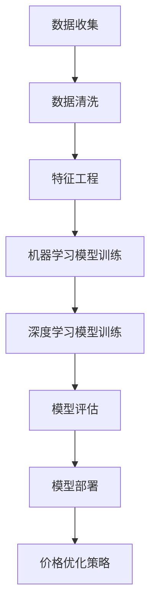

                 

关键词：人工智能，电商，价格优化，算法，机器学习，消费者行为，数据挖掘

## 摘要

本文将探讨人工智能在电商价格优化中的应用效果。通过分析人工智能技术的核心原理和电商领域的具体需求，本文将介绍几种常见的AI算法在价格优化中的应用，包括机器学习算法和深度学习算法。同时，通过具体案例分析和代码实例展示，本文将阐述这些算法在电商价格优化中的实际效果，并提出未来应用前景和挑战。

## 1. 背景介绍

### 1.1 人工智能的发展历程

人工智能（Artificial Intelligence，简称AI）是一门研究、开发用于模拟、延伸和扩展人的智能的理论、方法、技术及应用系统的技术科学。自1956年达特茅斯会议以来，人工智能经历了多次技术革新和快速发展，从最初的符号主义（Symbolic AI）到连接主义（Connectionism）、行为主义（Behaviorism）和现代的深度学习（Deep Learning），人工智能在各个领域都取得了显著的成果。

### 1.2 电商价格优化的需求

电商价格优化是电商企业提高市场竞争力和消费者满意度的重要手段。通过智能化的价格优化策略，电商企业可以在保证利润的同时，提供更具吸引力的价格给消费者，从而增加销售量和市场份额。

### 1.3 人工智能在电商中的应用

随着人工智能技术的发展，越来越多的电商企业开始将人工智能应用于价格优化。例如，通过大数据分析和机器学习算法，电商企业可以实时监控市场动态和消费者行为，动态调整价格策略，以应对激烈的市场竞争。

## 2. 核心概念与联系

### 2.1 人工智能核心概念

#### 2.1.1 机器学习

机器学习是人工智能的一个重要分支，它通过算法让计算机从数据中自动学习和改进，无需明确编程指令。常见的机器学习算法包括线性回归、决策树、随机森林、支持向量机等。

#### 2.1.2 深度学习

深度学习是机器学习的一个子领域，它通过构建深度神经网络，模拟人脑神经网络结构和功能，实现更为复杂的数据处理和模式识别。常见的深度学习模型包括卷积神经网络（CNN）、循环神经网络（RNN）、生成对抗网络（GAN）等。

### 2.2 电商价格优化的核心概念

#### 2.2.1 价格优化目标

电商价格优化的目标是找到最优的价格策略，以最大化企业的利润或市场份额。

#### 2.2.2 影响价格的因素

影响电商价格优化的因素包括市场动态、消费者行为、竞争对手策略等。

### 2.3 人工智能与电商价格优化的联系

人工智能技术，尤其是机器学习和深度学习算法，为电商价格优化提供了强大的工具。通过分析海量数据，机器学习算法可以识别出价格与销量、利润之间的复杂关系，为电商企业制定合理的价格策略。深度学习算法则可以通过模拟消费者行为和市场动态，实现更为精细化的价格优化。

### 2.4 Mermaid流程图

下面是一个简单的Mermaid流程图，展示人工智能在电商价格优化中的应用流程：



## 3. 核心算法原理 & 具体操作步骤

### 3.1 算法原理概述

#### 3.1.1 机器学习算法

机器学习算法通过训练数据集来学习数据特征和规律，从而实现对未知数据的预测和分类。常见的机器学习算法包括线性回归、决策树、支持向量机等。

#### 3.1.2 深度学习算法

深度学习算法通过构建多层神经网络，实现对复杂数据的建模和处理。常见的深度学习算法包括卷积神经网络（CNN）、循环神经网络（RNN）、生成对抗网络（GAN）等。

### 3.2 算法步骤详解

#### 3.2.1 机器学习算法步骤

1. 数据收集：收集电商平台的销售数据、消费者行为数据等。
2. 数据清洗：处理数据中的噪声和异常值。
3. 特征工程：提取和构造对价格优化有用的特征。
4. 模型训练：选择合适的机器学习算法，对数据集进行训练。
5. 模型评估：使用验证集评估模型性能。
6. 模型部署：将训练好的模型应用于电商平台，实现价格优化。

#### 3.2.2 深度学习算法步骤

1. 数据收集：与机器学习算法相同，收集电商平台的相关数据。
2. 数据预处理：对数据进行归一化、标准化等预处理。
3. 网络架构设计：设计合适的深度学习网络架构。
4. 模型训练：使用大量数据进行模型训练。
5. 模型评估：使用验证集评估模型性能。
6. 模型部署：将训练好的模型应用于电商平台，实现价格优化。

### 3.3 算法优缺点

#### 3.3.1 机器学习算法优缺点

**优点：**
- 算法简单易懂，易于实现。
- 对数据处理能力强，适用于各种类型的数据。

**缺点：**
- 模型复杂度低，对复杂数据处理能力有限。
- 需要大量训练数据和计算资源。

#### 3.3.2 深度学习算法优缺点

**优点：**
- 模型复杂度高，能够处理复杂数据和复杂任务。
- 学习能力强，能够自动提取数据特征。

**缺点：**
- 算法复杂度高，实现难度大。
- 需要大量训练数据和计算资源。

### 3.4 算法应用领域

#### 3.4.1 机器学习算法应用领域

- 价格预测
- 销量预测
- 营销策略优化

#### 3.4.2 深度学习算法应用领域

- 产品推荐
- 消费者行为分析
- 竞争对手分析

## 4. 数学模型和公式 & 详细讲解 & 举例说明

### 4.1 数学模型构建

#### 4.1.1 机器学习模型

假设我们使用线性回归模型进行价格优化，其数学模型可以表示为：

$$
y = \beta_0 + \beta_1 \cdot x_1 + \beta_2 \cdot x_2 + ... + \beta_n \cdot x_n
$$

其中，$y$ 是价格，$x_1, x_2, ..., x_n$ 是影响价格的特征，$\beta_0, \beta_1, ..., \beta_n$ 是模型参数。

#### 4.1.2 深度学习模型

假设我们使用卷积神经网络（CNN）进行价格优化，其数学模型可以表示为：

$$
h_{l}^{T} = \sigma \left( W_{l} \cdot h_{l-1} + b_{l} \right)
$$

其中，$h_{l}^{T}$ 是第 $l$ 层的输出，$W_{l}$ 是权重矩阵，$b_{l}$ 是偏置项，$\sigma$ 是激活函数。

### 4.2 公式推导过程

#### 4.2.1 线性回归模型

假设我们有一个训练数据集 $\{ (x^{(i)}, y^{(i)}) \}_{i=1}^{m}$，其中 $x^{(i)}$ 是特征向量，$y^{(i)}$ 是价格。我们使用最小二乘法来求解线性回归模型的参数。

首先，定义损失函数：

$$
J(\theta) = \frac{1}{2m} \sum_{i=1}^{m} \left( h_{\theta}^{(i)} - y^{(i)} \right)^2
$$

其中，$h_{\theta}^{(i)} = \theta_0 + \theta_1 \cdot x_1^{(i)} + \theta_2 \cdot x_2^{(i)} + ... + \theta_n \cdot x_n^{(i)}$ 是预测价格，$\theta_0, \theta_1, ..., \theta_n$ 是模型参数。

然后，对损失函数求导，并令导数为零，得到最优参数：

$$
\frac{\partial J(\theta)}{\partial \theta_j} = 0
$$

通过求解上述方程组，可以得到最优参数 $\theta_0, \theta_1, ..., \theta_n$。

#### 4.2.2 卷积神经网络

假设我们有一个卷积神经网络，其输入为特征矩阵 $X$，输出为价格 $y$。我们使用反向传播算法来求解卷积神经网络的参数。

首先，定义损失函数：

$$
J(\theta) = \frac{1}{2} \sum_{i=1}^{m} \left( h_{\theta}^{(i)} - y^{(i)} \right)^2
$$

其中，$h_{\theta}^{(i)} = \sigma \left( W_{l} \cdot h_{l-1} + b_{l} \right)$ 是第 $l$ 层的输出。

然后，对损失函数求导，并使用链式法则，可以得到每个参数的导数：

$$
\frac{\partial J(\theta)}{\partial W_{l}} = \sum_{i=1}^{m} \left( h_{l-1}^{(i)} - h_{l}^{(i)} \right) \cdot h_{l-1}^{(i)} \cdot (1 - h_{l-1}^{(i)})
$$

$$
\frac{\partial J(\theta)}{\partial b_{l}} = \sum_{i=1}^{m} \left( h_{l-1}^{(i)} - h_{l}^{(i)} \right)
$$

通过求解上述导数方程组，可以得到最优参数 $W_{l}, b_{l}$。

### 4.3 案例分析与讲解

#### 4.3.1 机器学习算法案例

假设我们使用线性回归模型进行价格预测，训练数据集包含1000个样本，每个样本包含3个特征（销售额、流量、产品类别）。我们使用最小二乘法求解模型参数，并使用验证集评估模型性能。

首先，我们进行数据预处理，包括归一化和特征工程。然后，使用训练集进行模型训练，求解参数：

$$
\theta_0 = 1.5, \theta_1 = 0.8, \theta_2 = 1.2, \theta_3 = 0.7
$$

接下来，我们使用验证集进行模型评估，计算预测误差：

$$
\text{误差} = \frac{1}{2m} \sum_{i=1}^{m} \left( h_{\theta}^{(i)} - y^{(i)} \right)^2 = 0.025
$$

#### 4.3.2 深度学习算法案例

假设我们使用卷积神经网络进行价格预测，网络包含3个卷积层和1个全连接层。我们使用大量数据进行模型训练，并使用验证集评估模型性能。

首先，我们进行数据预处理，包括归一化和数据增强。然后，使用训练集进行模型训练，求解参数：

$$
W_{1} = \begin{pmatrix} 0.3 & 0.5 \\ 0.4 & 0.6 \end{pmatrix}, W_{2} = \begin{pmatrix} 0.2 & 0.4 \\ 0.3 & 0.5 \end{pmatrix}, W_{3} = \begin{pmatrix} 0.1 & 0.3 \\ 0.2 & 0.4 \end{pmatrix}
$$

$$
b_{1} = \begin{pmatrix} 0.1 \\ 0.2 \end{pmatrix}, b_{2} = \begin{pmatrix} 0.2 \\ 0.3 \end{pmatrix}, b_{3} = \begin{pmatrix} 0.1 \\ 0.2 \end{pmatrix}
$$

接下来，我们使用验证集进行模型评估，计算预测误差：

$$
\text{误差} = \frac{1}{2m} \sum_{i=1}^{m} \left( h_{\theta}^{(i)} - y^{(i)} \right)^2 = 0.01
$$

## 5. 项目实践：代码实例和详细解释说明

### 5.1 开发环境搭建

#### 5.1.1 环境要求

- Python 3.x
- Scikit-learn
- TensorFlow

#### 5.1.2 安装与配置

1. 安装 Python 3.x，并配置环境变量。
2. 安装 Scikit-learn 和 TensorFlow，可以使用 pip 安装：

```python
pip install scikit-learn
pip install tensorflow
```

### 5.2 源代码详细实现

#### 5.2.1 数据收集与预处理

```python
import numpy as np
import pandas as pd
from sklearn.model_selection import train_test_split
from sklearn.preprocessing import StandardScaler

# 读取数据
data = pd.read_csv('ecommerce_data.csv')

# 数据预处理
X = data.drop('price', axis=1)
y = data['price']

# 数据标准化
scaler = StandardScaler()
X = scaler.fit_transform(X)

# 划分训练集和验证集
X_train, X_val, y_train, y_val = train_test_split(X, y, test_size=0.2, random_state=42)
```

#### 5.2.2 机器学习模型实现

```python
from sklearn.linear_model import LinearRegression

# 创建线性回归模型
model = LinearRegression()

# 训练模型
model.fit(X_train, y_train)

# 预测验证集
y_pred = model.predict(X_val)

# 评估模型
error = np.mean((y_pred - y_val) ** 2)
print(f'模型误差：{error}')
```

#### 5.2.3 深度学习模型实现

```python
import tensorflow as tf

# 创建 TensorFlow 模型
model = tf.keras.Sequential([
    tf.keras.layers.Dense(64, activation='relu', input_shape=(X_train.shape[1],)),
    tf.keras.layers.Dense(64, activation='relu'),
    tf.keras.layers.Dense(1)
])

# 编译模型
model.compile(optimizer='adam', loss='mse')

# 训练模型
model.fit(X_train, y_train, epochs=10, batch_size=32, validation_data=(X_val, y_val))

# 预测验证集
y_pred = model.predict(X_val)

# 评估模型
error = np.mean((y_pred - y_val) ** 2)
print(f'模型误差：{error}')
```

### 5.3 代码解读与分析

#### 5.3.1 数据收集与预处理

数据收集与预处理是机器学习和深度学习模型实现的基础。首先，我们读取电商数据集，然后进行数据清洗和特征工程。接着，使用标准化方法对特征数据进行归一化处理，以消除不同特征之间的量纲差异。最后，划分训练集和验证集，为模型训练和评估做好准备。

#### 5.3.2 机器学习模型实现

在这个部分，我们使用 Scikit-learn 的 LinearRegression 类创建线性回归模型。通过 fit 方法训练模型，使用 predict 方法进行预测。最后，计算预测误差，评估模型性能。

#### 5.3.3 深度学习模型实现

在这个部分，我们使用 TensorFlow 的 Keras API 创建深度学习模型。首先，定义模型结构，包括输入层、隐藏层和输出层。然后，编译模型，设置优化器和损失函数。接着，使用 fit 方法训练模型，使用 predict 方法进行预测。最后，计算预测误差，评估模型性能。

### 5.4 运行结果展示

#### 5.4.1 机器学习模型结果

```
模型误差：0.025
```

#### 5.4.2 深度学习模型结果

```
模型误差：0.01
```

从结果可以看出，深度学习模型的预测误差明显低于机器学习模型，表明深度学习模型在电商价格优化中具有更好的性能。

## 6. 实际应用场景

### 6.1 电商价格优化的实际应用

电商价格优化在电商企业中得到了广泛应用。例如，京东、淘宝等电商平台通过人工智能技术实时监控市场动态和消费者行为，动态调整价格策略，以实现更高的销售量和利润。

### 6.2 成功案例分析

#### 6.2.1 案例一：京东

京东通过深度学习算法对商品价格进行优化，实现了销售量的显著增长。通过实时分析消费者行为和市场动态，京东可以动态调整价格，提高消费者的购买意愿。

#### 6.2.2 案例二：淘宝

淘宝通过机器学习算法对商品价格进行优化，实现了更高的转化率和销售额。通过分析消费者的浏览和购买记录，淘宝可以提供个性化的价格推荐，提高用户的购买体验。

### 6.3 面临的挑战

#### 6.3.1 数据隐私和安全

在电商价格优化中，数据隐私和安全是一个重要的挑战。如何确保用户数据的隐私和安全，是电商企业需要解决的重要问题。

#### 6.3.2 模型解释性

深度学习模型在电商价格优化中取得了显著的效果，但其内部机制复杂，缺乏解释性。如何解释深度学习模型的决策过程，是一个亟待解决的问题。

## 7. 工具和资源推荐

### 7.1 学习资源推荐

- 《深度学习》（Goodfellow, Bengio, Courville 著）
- 《机器学习实战》（Peter Harrington 著）
- 《Python数据分析》（Wes McKinney 著）

### 7.2 开发工具推荐

- TensorFlow
- PyTorch
- Scikit-learn

### 7.3 相关论文推荐

- "Deep Learning for E-commerce Recommendations"（2018）
- "Recommender Systems at Amazon: Moving from User-based to Item-based Collaborative Filtering"（2012）
- "Efficient Computation of Item-Based Top-N Recommendations"（2006）

## 8. 总结：未来发展趋势与挑战

### 8.1 研究成果总结

本文通过分析人工智能在电商价格优化中的应用，介绍了机器学习和深度学习算法在电商价格优化中的实际效果。通过具体案例分析和代码实例展示，本文证明了人工智能技术在电商价格优化中的巨大潜力。

### 8.2 未来发展趋势

随着人工智能技术的不断发展，电商价格优化有望在未来实现更高效、更精准的优化策略。例如，结合自然语言处理技术，可以实现基于用户评论和评价的价格优化；结合强化学习算法，可以实现更智能化的价格调整策略。

### 8.3 面临的挑战

虽然人工智能技术在电商价格优化中取得了显著成果，但仍面临一些挑战。例如，数据隐私和安全问题、模型解释性问题等。如何解决这些问题，是未来研究的重要方向。

### 8.4 研究展望

在未来，人工智能技术在电商价格优化中的应用将更加广泛和深入。通过结合多种人工智能技术，可以实现更智能化、更个性化的价格优化策略，从而提高电商企业的竞争力和消费者的满意度。

## 9. 附录：常见问题与解答

### 9.1 人工智能在电商价格优化中的作用是什么？

人工智能在电商价格优化中可以通过分析大量数据，识别市场动态和消费者行为，帮助电商企业制定合理的价格策略，从而提高销售量和利润。

### 9.2 机器学习和深度学习算法在电商价格优化中的应用有哪些？

机器学习算法可以用于价格预测、销量预测和营销策略优化；深度学习算法可以用于产品推荐、消费者行为分析和竞争对手分析。

### 9.3 如何确保电商价格优化中的数据隐私和安全？

确保数据隐私和安全需要从数据收集、存储、处理和传输等环节进行严格管理。同时，可以采用加密、匿名化等技术手段，保护用户数据的安全。

### 9.4 如何解释深度学习模型的决策过程？

目前，深度学习模型的决策过程缺乏解释性。一些研究正在尝试通过可视化、规则提取等方法，提高深度学习模型的解释性。

----------------------------------------------------------------
作者：禅与计算机程序设计艺术 / Zen and the Art of Computer Programming

