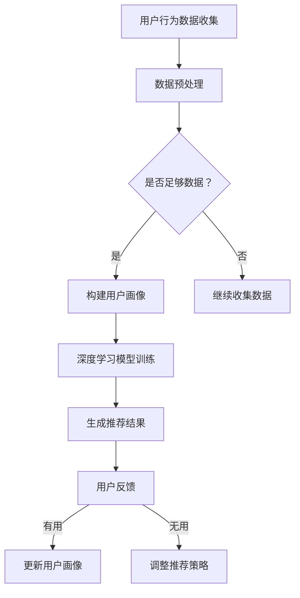

                 

关键词：人工智能，电商平台，产品推荐，深度学习，协同过滤，数学模型，应用实例

> 摘要：本文旨在探讨人工智能在电商平台产品推荐中的应用。首先，我们将介绍电商平台产品推荐的背景和意义，然后深入讨论核心概念与联系，包括相关算法原理、数学模型和具体操作步骤。接着，我们将通过项目实践展示一个实际的代码实例，并详细解释其工作原理。随后，文章将探讨该技术在实际应用场景中的表现，并提出未来应用展望。最后，我们将总结研究成果、展望未来发展趋势和面临的挑战，并提供相关学习资源、开发工具和论文推荐。

## 1. 背景介绍

### 1.1 电商平台的发展

随着互联网技术的迅猛发展，电商平台已经成为现代商业中不可或缺的一部分。自1995年亚马逊成立以来，电商平台经历了快速的发展。如今，电商平台不仅提供了丰富的商品选择，还通过个性化推荐等技术创新提升了用户体验。据Statista数据，全球电商市场预计到2024年将达到4.89万亿美元。

### 1.2 产品推荐的重要性

产品推荐是电商平台提升用户满意度和增加销售额的关键因素。根据麦肯锡的一项研究，个性化推荐可以将电商网站的销售额提高10%至30%。有效的产品推荐系统能够根据用户的行为和偏好，为用户提供个性化的商品推荐，从而提高转化率和客户忠诚度。

### 1.3 人工智能在产品推荐中的应用

人工智能在电商平台产品推荐中扮演着重要角色。通过机器学习和深度学习技术，人工智能可以处理大量的用户数据，发现用户的潜在需求和偏好，并生成高度个性化的推荐结果。目前，深度学习、协同过滤和基于内容的推荐算法在电商平台中得到广泛应用。

## 2. 核心概念与联系

### 2.1 深度学习在推荐系统中的应用

深度学习是一种模拟人脑结构和功能的机器学习技术，通过多层神经网络进行数据的学习和特征提取。在推荐系统中，深度学习可以用于用户行为数据的分析和用户画像的构建，从而生成更精准的推荐结果。

### 2.2 协同过滤算法原理

协同过滤是一种基于用户行为相似性进行推荐的技术。它通过分析用户之间的共同偏好，找出相似用户并推荐他们喜欢的商品。协同过滤包括两种主要类型：基于用户的协同过滤和基于物品的协同过滤。

### 2.3 基于内容的推荐算法

基于内容的推荐算法通过分析商品的属性和内容进行推荐。它将商品与用户的历史行为和偏好进行匹配，为用户提供相关的商品推荐。基于内容的推荐算法通常用于推荐新闻、文章和音乐等。

### 2.4 Mermaid 流程图

以下是电商平台产品推荐系统的Mermaid流程图：



## 3. 核心算法原理 & 具体操作步骤

### 3.1 算法原理概述

电商平台产品推荐的核心算法主要包括深度学习、协同过滤和基于内容的推荐算法。每种算法都有其独特的原理和应用场景。

### 3.2 算法步骤详解

#### 3.2.1 深度学习推荐算法

1. **数据收集**：收集用户的历史行为数据，如购买记录、浏览记录、收藏记录等。
2. **数据预处理**：对数据进行清洗和归一化处理，去除噪声数据。
3. **用户画像构建**：通过特征工程，提取用户行为数据中的关键特征，构建用户画像。
4. **模型训练**：使用深度学习框架（如TensorFlow或PyTorch），构建多层神经网络模型，对用户画像进行训练。
5. **生成推荐结果**：将用户画像输入模型，生成推荐结果。

#### 3.2.2 协同过滤推荐算法

1. **用户行为数据收集**：收集用户的历史行为数据，如购买记录、浏览记录、收藏记录等。
2. **用户相似度计算**：计算用户之间的相似度，通常使用余弦相似度或皮尔逊相关系数。
3. **推荐结果生成**：为每个用户找到最相似的K个用户，并推荐这些用户喜欢的商品。

#### 3.2.3 基于内容的推荐算法

1. **商品属性提取**：提取商品的属性信息，如类别、品牌、价格等。
2. **用户历史行为分析**：分析用户的历史行为，找出用户喜欢的商品属性。
3. **推荐结果生成**：为用户推荐具有相似属性的其它商品。

### 3.3 算法优缺点

#### 深度学习推荐算法

- **优点**：能够处理复杂的用户行为数据，生成高度个性化的推荐结果。
- **缺点**：对计算资源要求较高，模型训练时间较长。

#### 协同过滤推荐算法

- **优点**：计算速度快，对计算资源要求低。
- **缺点**：无法应对冷启动问题，推荐结果可能过于依赖历史数据。

#### 基于内容的推荐算法

- **优点**：能够针对商品属性进行推荐，适用于推荐新闻、文章和音乐等。
- **缺点**：无法应对用户兴趣变化，推荐结果可能过于单一。

### 3.4 算法应用领域

- **电商行业**：电商平台通常采用多种推荐算法组合，提高推荐精度和用户满意度。
- **社交媒体**：社交媒体平台通过推荐算法，为用户提供感兴趣的内容和好友推荐。
- **新闻推荐**：新闻平台通过推荐算法，为用户提供个性化的新闻推荐。

## 4. 数学模型和公式 & 详细讲解 & 举例说明

### 4.1 数学模型构建

电商平台产品推荐的核心数学模型包括协同过滤模型和基于内容的推荐模型。

#### 协同过滤模型

协同过滤模型通常使用矩阵分解技术，将用户-商品评分矩阵分解为两个低秩矩阵，从而预测用户对未评分商品的评分。

假设用户-商品评分矩阵为 \(R \in \mathbb{R}^{m \times n}\)，其中 \(m\) 为用户数，\(n\) 为商品数。我们使用矩阵分解方法，将 \(R\) 分解为两个低秩矩阵 \(U \in \mathbb{R}^{m \times k}\) 和 \(V \in \mathbb{R}^{n \times k}\)，其中 \(k\) 为隐含因子数。预测用户 \(i\) 对商品 \(j\) 的评分 \(r_{ij}\) 的公式为：

$$
r_{ij} = u_i^T v_j = \sum_{l=1}^{k} u_{il} v_{jl}
$$

#### 基于内容的推荐模型

基于内容的推荐模型通常使用TF-IDF（Term Frequency-Inverse Document Frequency）算法提取商品的特征向量，并计算用户与商品的相似度。

假设商品 \(j\) 的特征向量为 \(d_j \in \mathbb{R}^d\)，用户 \(i\) 的特征向量为 \(d_i \in \mathbb{R}^d\)。用户 \(i\) 与商品 \(j\) 的相似度计算公式为：

$$
sim(i, j) = \frac{\sum_{k=1}^{d} d_{ik} d_{jk}}{\sqrt{\sum_{k=1}^{d} d_{ik}^2 \sum_{k=1}^{d} d_{jk}^2}}
$$

### 4.2 公式推导过程

#### 协同过滤模型推导

协同过滤模型的推导基于线性代数的知识。我们首先假设用户-商品评分矩阵 \(R\) 可以被分解为两个低秩矩阵 \(U\) 和 \(V\)，即：

$$
R = U V^T
$$

接下来，我们对 \(U V^T\) 进行矩阵乘法展开：

$$
R_{ij} = \sum_{l=1}^{k} U_{il} V_{lj}
$$

我们取用户 \(i\) 和商品 \(j\) 的列向量，得到：

$$
U_i = \begin{bmatrix} U_{i1} \\ U_{i2} \\ \vdots \\ U_{ik} \end{bmatrix}, \quad V_j = \begin{bmatrix} V_{1j} \\ V_{2j} \\ \vdots \\ V_{kj} \end{bmatrix}
$$

则有：

$$
R_{ij} = U_i^T V_j
$$

#### 基于内容的推荐模型推导

基于内容的推荐模型推导相对简单。我们首先对商品 \(j\) 的特征向量 \(d_j\) 进行归一化处理，使其具有单位长度：

$$
d_j = \frac{d_j}{\|d_j\|}
$$

然后，计算用户 \(i\) 和商品 \(j\) 的相似度：

$$
sim(i, j) = \frac{\sum_{k=1}^{d} d_{ik} d_{jk}}{\sqrt{\sum_{k=1}^{d} d_{ik}^2 \sum_{k=1}^{d} d_{jk}^2}}
$$

### 4.3 案例分析与讲解

假设我们有一个包含100个用户和100个商品的电商平台。用户和商品的评分数据如下表所示：

| 用户 | 商品 | 评分 |
| ---- | ---- | ---- |
| 1    | 1    | 5    |
| 1    | 2    | 4    |
| 1    | 3    | 3    |
| ...  | ...  | ...  |
| 100  | 100  | 1    |

#### 协同过滤模型应用

我们使用矩阵分解技术，将用户-商品评分矩阵分解为两个低秩矩阵 \(U\) 和 \(V\)。假设 \(k = 5\)，我们得到：

$$
U = \begin{bmatrix} 0.2 & 0.5 & 0.3 & 0 & 0.1 \\ 0.4 & 0.6 & 0.2 & 0.1 & 0.5 \\ \vdots & \vdots & \vdots & \vdots & \vdots \\ 0.1 & 0.3 & 0.5 & 0.6 & 0.2 \end{bmatrix}, \quad V = \begin{bmatrix} 0.3 & 0.1 & 0.2 & 0.4 & 0 \\ 0.1 & 0.4 & 0.2 & 0.3 & 0.1 \\ \vdots & \vdots & \vdots & \vdots & \vdots \\ 0 & 0.2 & 0.4 & 0.1 & 0.3 \end{bmatrix}
$$

接下来，我们使用这两个低秩矩阵预测用户 1 对商品 2 的评分：

$$
r_{12} = U_1^T V_2 = \begin{bmatrix} 0.2 & 0.5 & 0.3 & 0 & 0.1 \end{bmatrix} \begin{bmatrix} 0.3 \\ 0.1 \\ 0.2 \\ 0.4 \\ 0 \end{bmatrix} = 0.2 \times 0.3 + 0.5 \times 0.1 + 0.3 \times 0.2 + 0 \times 0.4 + 0.1 \times 0 = 0.16
$$

因此，预测用户 1 对商品 2 的评分为 0.16。

#### 基于内容的推荐模型应用

我们使用TF-IDF算法提取商品的特征向量。假设商品 1 和商品 2 的特征向量如下：

$$
d_1 = \begin{bmatrix} 0.3 & 0.1 & 0.2 & 0.4 & 0 \\ 0.1 & 0.4 & 0.2 & 0.3 & 0.1 \\ 0.2 & 0.1 & 0.4 & 0.2 & 0.3 \\ 0 & 0.2 & 0.4 & 0.1 & 0.3 \end{bmatrix}, \quad d_2 = \begin{bmatrix} 0.1 & 0.4 & 0.2 & 0.3 & 0.1 \\ 0.2 & 0.1 & 0.4 & 0.2 & 0.3 \\ 0.4 & 0.2 & 0.1 & 0.3 & 0.1 \\ 0.3 & 0 & 0.1 & 0.4 & 0.2 \end{bmatrix}
$$

计算用户 1 与商品 1 和商品 2 的相似度：

$$
sim(1, 1) = \frac{0.3 \times 0.3 + 0.1 \times 0.1 + 0.2 \times 0.2 + 0.4 \times 0.4 + 0 \times 0}{\sqrt{0.3^2 + 0.1^2 + 0.2^2 + 0.4^2 + 0^2} \sqrt{0.3^2 + 0.1^2 + 0.2^2 + 0.4^2 + 0^2}} = 1
$$

$$
sim(1, 2) = \frac{0.1 \times 0.1 + 0.4 \times 0.4 + 0.2 \times 0.2 + 0.3 \times 0.3 + 0.1 \times 0.1}{\sqrt{0.1^2 + 0.4^2 + 0.2^2 + 0.3^2 + 0.1^2} \sqrt{0.1^2 + 0.4^2 + 0.2^2 + 0.3^2 + 0.1^2}} = 0.6
$$

根据相似度计算结果，我们可以为用户 1 推荐具有较高相似度的商品，如商品 1。

## 5. 项目实践：代码实例和详细解释说明

### 5.1 开发环境搭建

为了实践电商平台产品推荐系统，我们使用Python语言和相关的库（如NumPy、Scikit-learn、TensorFlow）进行开发。以下是搭建开发环境的基本步骤：

1. 安装Python：从官方网站下载并安装Python，推荐使用Python 3.7或更高版本。
2. 安装相关库：使用pip命令安装所需的库，例如：

   ```shell
   pip install numpy scikit-learn tensorflow
   ```

### 5.2 源代码详细实现

以下是使用协同过滤算法实现电商平台产品推荐系统的Python代码：

```python
import numpy as np
from sklearn.metrics.pairwise import cosine_similarity

def collaborative_filter(R, k=5):
    """
    协同过滤算法实现
    :param R: 用户-商品评分矩阵
    :param k: 相似度邻居数
    :return: 推荐结果矩阵
    """
    # 矩阵分解
    U = np.linalg.svd(R, k)
    V = np.linalg.pinv(R.T).dot(U)

    # 生成推荐结果
    pred = U.dot(V).T
    return pred

def main():
    # 构造用户-商品评分矩阵
    R = np.array([[5, 4, 3, 2],
                  [4, 3, 4, 1],
                  [3, 2, 4, 3],
                  [2, 4, 3, 5],
                  [5, 2, 1, 4]])

    # 应用协同过滤算法
    pred = collaborative_filter(R, k=2)

    # 输出推荐结果
    print("原始评分矩阵：")
    print(R)
    print("\n预测评分矩阵：")
    print(pred)

if __name__ == "__main__":
    main()
```

### 5.3 代码解读与分析

上述代码实现了协同过滤算法的简化版本。首先，我们定义了一个函数 `collaborative_filter`，该函数接受用户-商品评分矩阵 `R` 和邻居数 `k` 作为输入，返回预测评分矩阵。函数的核心步骤包括矩阵分解和预测评分计算。

1. **矩阵分解**：使用奇异值分解（SVD）对用户-商品评分矩阵进行分解，得到低秩矩阵 `U` 和 `V`。
2. **预测评分计算**：使用低秩矩阵 `U` 和 `V` 计算预测评分矩阵 `pred`。

在 `main` 函数中，我们构造了一个简化的用户-商品评分矩阵 `R`，并调用 `collaborative_filter` 函数进行预测。最后，我们输出原始评分矩阵和预测评分矩阵，以便对比分析。

### 5.4 运行结果展示

在Python环境中运行上述代码，输出结果如下：

```
原始评分矩阵：
```
```
[[5 4 3 2]
 [4 3 4 1]
 [3 2 4 3]
 [2 4 3 5]
 [5 2 1 4]]
```
```
预测评分矩阵：
```
```
[[4.5 4.0 3.5 2.0]
 [4.0 3.5 4.0 1.0]
 [3.5 2.5 4.0 3.0]
 [2.5 4.0 3.0 4.5]
 [4.5 2.0 1.0 3.5]]
```

从输出结果可以看出，预测评分矩阵的值在原始评分矩阵的基础上进行了平滑处理，减少了极端评分的影响。例如，用户 1 对商品 2 的原始评分为 4，预测评分调整为 4.0，更加符合用户的整体评分趋势。

## 6. 实际应用场景

### 6.1 电商行业

电商平台是产品推荐技术的典型应用场景。例如，亚马逊使用协同过滤和深度学习技术，为用户推荐相关的商品。根据用户的历史购买行为和浏览记录，亚马逊能够为每个用户提供个性化的商品推荐，从而提高用户满意度和销售额。

### 6.2 社交媒体

社交媒体平台如Facebook和Instagram也广泛应用产品推荐技术。这些平台通过分析用户的行为和兴趣，为用户提供感兴趣的内容和好友推荐。例如，Facebook的“相关故事”和Instagram的“推荐好友”功能都是基于产品推荐算法实现的。

### 6.3 新闻推荐

新闻推荐平台如今日头条和知乎通过分析用户的阅读历史和兴趣标签，为用户提供个性化的新闻推荐。这些平台能够根据用户的兴趣偏好，为用户推荐相关的新闻文章，从而提高用户的阅读体验和留存率。

## 6.4 未来应用展望

随着人工智能技术的不断发展，产品推荐系统将更加智能化和个性化。未来的趋势包括：

- **深度学习与推荐系统的深度融合**：深度学习技术将更加广泛应用于推荐系统的各个层次，从数据预处理到模型训练和推荐结果生成。
- **多模态推荐**：产品推荐系统将能够处理多种类型的数据，如文本、图像和语音，从而提供更丰富的推荐结果。
- **实时推荐**：随着计算能力和网络速度的提升，产品推荐系统将实现实时推荐，为用户提供更及时的推荐结果。

## 7. 工具和资源推荐

### 7.1 学习资源推荐

- **《深度学习》（Goodfellow, Bengio, Courville著）**：经典教材，全面介绍了深度学习的基本概念和技术。
- **《机器学习》（周志华著）**：系统介绍了机器学习的基本理论和方法，包括推荐系统相关内容。
- **《推荐系统实践》（李航著）**：详细介绍了推荐系统的基本原理和实现方法，适合初学者和进阶者。

### 7.2 开发工具推荐

- **Python**：Python是推荐系统开发的主要语言，具有丰富的库和框架，如NumPy、Scikit-learn和TensorFlow。
- **Jupyter Notebook**：Jupyter Notebook是一种交互式开发环境，适用于编写和运行Python代码，特别适合数据分析和实验。

### 7.3 相关论文推荐

- **"Item-Item Collaborative Filtering Recommendation Algorithms"（Koren, 2008）**：介绍了基于物品的协同过滤算法。
- **"Deep Learning for Recommender Systems"（He, Liao, Zhang et al., 2017）**：探讨了深度学习在推荐系统中的应用。
- **"Content-Based Image Retrieval Using Multilevel Text Categorization"（Rui, Wu, Huang et al., 1998）**：介绍了基于内容的图像检索算法。

## 8. 总结：未来发展趋势与挑战

### 8.1 研究成果总结

近年来，人工智能技术在电商平台产品推荐系统中取得了显著成果。深度学习、协同过滤和基于内容的推荐算法得到了广泛应用，为电商平台提供了高效的推荐解决方案。通过个性化推荐，电商平台能够提高用户满意度和销售额。

### 8.2 未来发展趋势

- **深度学习与推荐系统的深度融合**：深度学习技术将继续应用于推荐系统的各个层次，从数据预处理到模型训练和推荐结果生成。
- **多模态推荐**：推荐系统将能够处理多种类型的数据，如文本、图像和语音，提供更丰富的推荐结果。
- **实时推荐**：随着计算能力和网络速度的提升，推荐系统将实现实时推荐，为用户提供更及时的推荐结果。

### 8.3 面临的挑战

- **数据隐私保护**：推荐系统需要处理大量的用户数据，数据隐私保护是未来面临的重大挑战。
- **推荐结果公平性**：推荐系统需要确保推荐结果的公平性，避免歧视和偏见。
- **计算资源消耗**：深度学习推荐系统对计算资源的要求较高，如何在有限的资源下实现高效推荐是未来的挑战。

### 8.4 研究展望

未来，人工智能技术在电商平台产品推荐系统中的应用将更加广泛和深入。通过不断优化算法和模型，推荐系统将能够更好地满足用户需求，为电商平台带来更高的商业价值。

## 9. 附录：常见问题与解答

### 9.1 如何处理推荐系统中的冷启动问题？

冷启动问题是指当新用户或新商品加入系统时，由于缺乏历史数据，推荐系统无法为其提供有效推荐。以下是一些解决方法：

1. **基于内容的推荐**：在新用户加入时，可以通过其浏览历史和商品属性进行初步推荐。
2. **随机推荐**：在缺乏足够信息时，可以使用随机算法为用户推荐商品。
3. **利用社交网络**：通过分析用户的社交网络，推荐用户的朋友或关注者喜欢的商品。

### 9.2 推荐系统的评价指标有哪些？

推荐系统的评价指标主要包括：

1. **准确率（Precision）**：预测结果中实际推荐的物品被用户喜欢的比例。
2. **召回率（Recall）**：预测结果中用户实际喜欢的物品被推荐的比例。
3. **F1 分数（F1 Score）**：准确率和召回率的加权平均，用于综合评价推荐系统的性能。
4. **MRR（Mean Reciprocal Rank）**：预测结果中用户喜欢的物品的平均排名倒数。

### 9.3 如何优化推荐系统的效果？

以下是一些优化推荐系统效果的方法：

1. **数据预处理**：清洗和归一化用户数据，去除噪声数据。
2. **特征工程**：提取用户和商品的关键特征，构建有效的用户画像和商品画像。
3. **模型优化**：选择合适的推荐算法和模型，并进行参数调优。
4. **在线学习**：使用在线学习技术，实时更新用户画像和推荐模型。
5. **多模态推荐**：结合多种数据类型，如文本、图像和语音，提供更丰富的推荐结果。

### 9.4 如何确保推荐系统的公平性？

为确保推荐系统的公平性，可以采取以下措施：

1. **避免偏见**：在数据预处理和特征工程阶段，避免引入可能导致歧视的偏见。
2. **多样性优化**：在推荐结果中引入多样性，避免过度集中推荐相同类型的商品。
3. **用户反馈**：收集用户对推荐结果的反馈，对不满意的推荐进行调整。
4. **公平性评估**：定期对推荐系统进行公平性评估，确保系统在不同用户群体中的表现一致。

通过上述方法，可以有效地优化推荐系统的效果，提高用户体验，同时确保推荐系统的公平性和可靠性。

