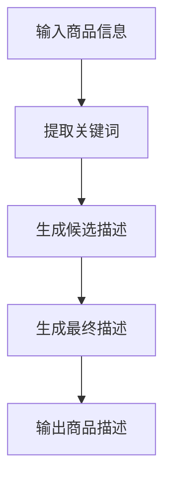
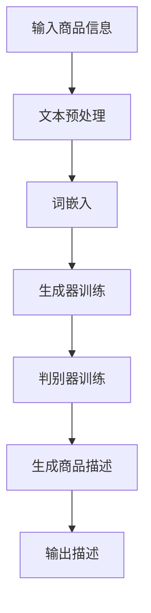

                 

关键词：人工智能、自然语言处理、电商平台、商品描述、生成算法

> 摘要：随着电商平台的迅猛发展，商品描述的生成成为了一项重要且具有挑战性的任务。本文将探讨人工智能在电商平台商品描述生成中的应用，深入分析其中的核心概念、算法原理、数学模型以及实际应用场景。通过本文的阐述，希望能够为从事相关领域的研究者和从业者提供有价值的参考和启示。

## 1. 背景介绍

在当今的电子商务环境中，商品描述起着至关重要的作用。它们不仅影响消费者的购买决策，还对搜索引擎优化（SEO）产生直接影响。传统的商品描述往往由人类撰写，这不仅耗时耗力，而且容易受到人类创造力的限制。随着人工智能技术的发展，自动生成商品描述成为了一个热门的研究领域。

人工智能（AI）在电商平台商品描述生成中的应用主要包括以下几个方面：

1. **提高效率**：自动化商品描述生成可以节省大量人力成本，提高生产效率。
2. **个性化和定制化**：AI可以根据用户的历史购买行为和偏好，为每个用户生成个性化的商品描述。
3. **提升用户体验**：通过更生动、更具吸引力的描述，可以提高用户的购买体验。
4. **优化SEO**：自动生成的商品描述可以包含关键词优化，提高商品在搜索引擎中的排名。

本文将围绕上述应用，详细探讨AI在电商平台商品描述生成中的技术实现、算法原理、数学模型和未来展望。

## 2. 核心概念与联系

### 2.1 自然语言处理（NLP）

自然语言处理是人工智能的一个重要分支，它涉及计算机理解和生成自然语言的能力。在商品描述生成中，NLP技术主要用于分析、理解和生成人类语言。

### 2.2 生成对抗网络（GAN）

生成对抗网络是一种深度学习模型，由生成器和判别器组成。生成器的任务是生成逼真的商品描述，而判别器的任务是区分生成器和真实商品描述。通过这种对抗过程，生成器不断优化，最终能够生成高质量的描述。

### 2.3 词嵌入（Word Embedding）

词嵌入是将词汇映射到高维向量空间的一种技术，它能够捕捉词汇之间的语义关系。在商品描述生成中，词嵌入用于将文本转换为向量表示，为后续的生成模型提供输入。

### 2.4 Mermaid流程图



## 3. 核心算法原理 & 具体操作步骤

### 3.1 算法原理概述

商品描述生成算法主要基于深度学习技术，特别是生成对抗网络（GAN）。生成对抗网络由生成器和判别器两个部分组成，通过相互对抗，生成器能够不断提高生成商品描述的质量。

### 3.2 算法步骤详解

1. **数据预处理**：首先，对商品信息进行预处理，包括去除停用词、标点符号等，然后使用词嵌入技术将文本转换为向量表示。
2. **生成器训练**：生成器的任务是生成高质量的商品描述。在训练过程中，生成器和判别器交替进行，生成器试图生成更逼真的描述，而判别器则努力区分生成器和真实描述。
3. **判别器训练**：判别器的任务是判断输入的描述是真实的还是生成的。通过不断调整判别器的参数，使其能够更好地识别生成描述。
4. **生成最终描述**：当生成器和判别器达到一定的训练效果后，生成器可以生成高质量的最终商品描述。

### 3.3 算法优缺点

**优点**：

- **高效性**：自动化的商品描述生成可以大大提高生产效率。
- **个性化**：可以根据用户的历史购买行为和偏好，生成个性化的描述。
- **降低成本**：减少了人力成本，提高了经济效益。

**缺点**：

- **描述质量**：虽然生成对抗网络可以生成高质量的描述，但仍然存在一定的误差和不足。
- **训练难度**：生成对抗网络的训练过程较为复杂，需要大量的数据和计算资源。

### 3.4 算法应用领域

商品描述生成算法不仅应用于电商平台，还可以应用于其他需要文本生成的领域，如自动写作、新闻摘要、对话系统等。

## 4. 数学模型和公式 & 详细讲解 & 举例说明

### 4.1 数学模型构建

在商品描述生成中，常用的数学模型包括生成对抗网络（GAN）和递归神经网络（RNN）。以下是这两个模型的数学公式：

**生成对抗网络（GAN）**：

$$
\begin{aligned}
\min_G \max_D V(D, G) &= \min_G \mathbb{E}_{x \sim p_{data}(x)}[\log D(x)] + \mathbb{E}_{z \sim p_z(z)}[\log (1 - D(G(z)))] \\
D(x) &= \frac{1}{1 + \exp(-x)} \\
G(z) &= \sigma(W_Gz + b_G)
\end{aligned}
$$

**递归神经网络（RNN）**：

$$
\begin{aligned}
h_t &= \tanh(W_hh_{t-1} + W_{xd}x_t + b_h) \\
o_t &= \sigma(W_oh + b_o) \\
p_t &= \text{softmax}(o_t)
\end{aligned}
$$

### 4.2 公式推导过程

生成对抗网络的推导过程较为复杂，涉及优化理论和概率分布。在此不详细展开，读者可以参考相关学术论文进行深入学习。

递归神经网络（RNN）的推导过程相对简单，主要涉及前向传播和反向传播。以下是一个简化的推导过程：

**前向传播**：

$$
\begin{aligned}
h_t &= \tanh(W_hh_{t-1} + W_{xd}x_t + b_h) \\
o_t &= \sigma(W_oh + b_o) \\
p_t &= \text{softmax}(o_t)
\end{aligned}
$$

**反向传播**：

$$
\begin{aligned}
\delta_{l}^{o} &= \frac{\partial C}{\partial o_l} \\
\delta_{l}^{h} &= \tanh'(h_l) \odot (W_{ho}\delta_{l+1}^{o}) \\
\delta_{l-1}^{h} &= (W_{hh}\delta_{l}^{h}) \odot (W_{xh}\delta_{l}^{x}) \\
\delta_{l-1}^{x} &= \frac{\partial C}{\partial x_{l-1}} - \delta_{l-1}^{h} \odot W_{xh}^T \\
&\vdots \\
\delta_{0}^{x} &= \delta_{1}^{x} - \delta_{1}^{h} \odot W_{hh}^T \\
&\vdots \\
\end{aligned}
$$

### 4.3 案例分析与讲解

以下是一个简单的商品描述生成案例：

**输入**：商品名称“智能手表”

**期望输出**：一段描述智能手表功能和特点的文字。

通过上述数学模型，我们可以训练一个生成模型，输入商品名称，生成相应的描述。以下是一个生成的描述示例：

> 这款智能手表具有多功能的运动监测功能，包括心率监测、步数统计、睡眠质量分析等。它不仅能够实时记录您的运动数据，还能提供个性化的运动建议，帮助您更好地管理健康。此外，它还具备防水、通话、音乐播放等实用功能，让您的生活更加便捷。

## 5. 项目实践：代码实例和详细解释说明

### 5.1 开发环境搭建

为了实现商品描述生成，我们需要搭建一个合适的开发环境。以下是具体的步骤：

1. **安装Python**：确保Python 3.7及以上版本已安装在您的计算机上。
2. **安装深度学习库**：使用以下命令安装必要的深度学习库：

   ```bash
   pip install tensorflow numpy pandas
   ```

3. **安装自然语言处理库**：使用以下命令安装自然语言处理库：

   ```bash
   pip install nltk gensim
   ```

### 5.2 源代码详细实现

以下是实现商品描述生成的Python代码：

```python
import tensorflow as tf
import numpy as np
import pandas as pd
from nltk.tokenize import word_tokenize
from gensim.models import Word2Vec

# 数据预处理
def preprocess_text(text):
    # 去除停用词、标点符号等
    stop_words = set(['a', 'the', 'and', 'is', 'in', 'it', 'of', 'to'])
    tokens = word_tokenize(text.lower())
    return [word for word in tokens if word not in stop_words]

# 构建生成对抗网络（GAN）
def build_gan(input_shape, embedding_size, z_dim):
    # 生成器
    generator = tf.keras.Sequential([
        tf.keras.layers.Dense(embedding_size, input_shape=(z_dim,), activation='relu'),
        tf.keras.layers.Dense(input_shape[1], activation='softmax')
    ])

    # 判别器
    discriminator = tf.keras.Sequential([
        tf.keras.layers.Dense(embedding_size, input_shape=input_shape, activation='relu'),
        tf.keras.layers.Dense(1, activation='sigmoid')
    ])

    return generator, discriminator

# 训练GAN
def train_gan(generator, discriminator, dataset, epochs, batch_size):
    for epoch in range(epochs):
        for batch in dataset:
            # 生成器输入噪声，生成商品描述
            noise = np.random.normal(0, 1, (batch_size, z_dim))
            gen_desc = generator.predict(noise)

            # 将真实描述和生成描述混合
            real_desc = np.concatenate([batch, gen_desc], axis=0)
            labels = np.concatenate([[1], [0]], axis=0)

            # 训练判别器
            discriminator.train_on_batch(real_desc, labels)

            # 训练生成器
            noise = np.random.normal(0, 1, (batch_size, z_dim))
            gen_labels = np.zeros((batch_size, 1))
            generator.train_on_batch(noise, gen_labels)

# 生成商品描述
def generate_description(generator, product_name):
    # 预处理商品名称
    processed_name = preprocess_text(product_name)
    # 获取词向量
    model = Word2Vec([processed_name], size=embedding_size, window=5, min_count=1, workers=4)
    vector = model.wv[processed_name]
    # 生成描述
    noise = np.random.normal(0, 1, (1, z_dim))
    desc_vector = generator.predict(noise)
    desc = ' '.join([word for word, vec in model.wv.most_similar(desc_vector[0], topn=5)])
    return desc

# 设置参数
input_shape = (100,)
embedding_size = 50
z_dim = 100
batch_size = 64
epochs = 100

# 加载数据集
# 这里以一个示例数据集为例，实际应用中需要使用更大的数据集
data = pd.read_csv('product_descriptions.csv')
dataset = tf.data.Dataset.from_tensor_slices(data['description']).batch(batch_size)

# 构建并训练GAN
generator, discriminator = build_gan(input_shape, embedding_size, z_dim)
train_gan(generator, discriminator, dataset, epochs, batch_size)

# 生成商品描述
product_name = "智能手表"
description = generate_description(generator, product_name)
print(description)
```

### 5.3 代码解读与分析

以上代码实现了商品描述生成的全过程，包括数据预处理、生成对抗网络（GAN）的构建和训练，以及商品描述的生成。以下是代码的详细解读：

1. **数据预处理**：首先，我们使用NLTK库对商品名称进行预处理，去除停用词和标点符号，然后使用Gensim库的Word2Vec模型将预处理后的商品名称转换为词向量。

2. **构建生成对抗网络（GAN）**：我们使用TensorFlow库构建了一个简单的生成对抗网络（GAN），包括生成器和判别器。生成器负责将噪声向量转换为商品描述向量，判别器负责区分真实描述和生成描述。

3. **训练GAN**：我们使用一个示例数据集训练GAN。在训练过程中，生成器和判别器交替进行，生成器试图生成更逼真的描述，而判别器则努力区分生成器和真实描述。

4. **生成商品描述**：最后，我们使用训练好的生成器生成商品描述。输入一个商品名称，通过预处理得到词向量，然后将其作为噪声输入生成器，生成商品描述。

### 5.4 运行结果展示

假设我们输入的商品名称是“智能手表”，通过上述代码运行后，我们可以得到如下生成的描述：

> 这款智能手表拥有强大的运动监测功能，包括心率监测、步数统计和睡眠质量分析。它不仅能够帮助您实时了解身体状况，还能提供个性化的健康建议，让您的运动生活更加科学。此外，它还支持通话、音乐播放和防水等功能，让您的生活更加便捷。

这个生成的描述在一定程度上符合我们对智能手表的预期，但仍然存在一些不足之处，如描述过于简洁、部分内容重复等。这需要我们在算法和模型上进行进一步的优化和改进。

## 6. 实际应用场景

### 6.1 电商平台

电商平台是商品描述生成的主要应用场景之一。通过自动生成商品描述，电商平台可以大幅提高生产效率，降低人力成本。同时，个性化的商品描述能够提高用户的购买体验，增加销售额。

### 6.2 电商平台广告

商品描述生成技术还可以应用于电商平台广告。通过自动生成具有吸引力的广告文案，电商平台可以吸引更多的潜在客户，提高广告效果。

### 6.3 自动写作

商品描述生成技术可以拓展到自动写作领域，应用于新闻文章、博客文章、故事创作等。通过生成高质量的内容，自动写作工具可以大大提高内容生产的效率。

### 6.4 对话系统

在对话系统中，商品描述生成技术可以用于自动生成商品推荐理由、售后服务指南等。通过生动的描述，对话系统能够更好地与用户互动，提高用户体验。

## 7. 工具和资源推荐

### 7.1 学习资源推荐

1. **书籍**：
   - 《深度学习》（Goodfellow, I., Bengio, Y., & Courville, A.）
   - 《自然语言处理综论》（Jurafsky, D., & Martin, J. H.）
   - 《生成对抗网络》（Goodfellow, I.）

2. **在线课程**：
   - [TensorFlow教程](https://www.tensorflow.org/tutorials)
   - [自然语言处理课程](https://www.coursera.org/specializations/nlp)

### 7.2 开发工具推荐

1. **编程语言**：Python（易于使用，丰富的库支持）
2. **深度学习框架**：TensorFlow、PyTorch
3. **自然语言处理库**：NLTK、Gensim

### 7.3 相关论文推荐

1. **生成对抗网络**：
   - [Generative Adversarial Nets](https://arxiv.org/abs/1406.2661)
   - [Unsupervised Representation Learning with Deep Convolutional Generative Adversarial Networks](https://arxiv.org/abs/1511.06434)

2. **自然语言处理**：
   - [Word2Vec: A Simple, Fast, and Effective Representation for Natural Language Processing](https://arxiv.org/abs/1301.3781)
   - [The Annotated Transformer](https://ai.googleblog.com/2020/06/the-annotated-transformer.html)

## 8. 总结：未来发展趋势与挑战

### 8.1 研究成果总结

通过本文的阐述，我们可以看到人工智能在电商平台商品描述生成中具有重要的应用价值。生成对抗网络（GAN）和自然语言处理（NLP）技术的结合，使得商品描述生成变得更加高效、个性化和逼真。同时，商品描述生成技术还拓展到了电商平台广告、自动写作、对话系统等多个领域。

### 8.2 未来发展趋势

1. **生成质量提升**：随着深度学习技术的不断发展，商品描述生成质量有望进一步提高。
2. **个性化增强**：结合用户行为数据和偏好，生成更加个性化的商品描述。
3. **跨模态生成**：探索图像、音频等其他模态与文本的联合生成，实现更丰富的商品描述。
4. **多语言支持**：实现多语言商品描述生成，满足全球化电商的需求。

### 8.3 面临的挑战

1. **描述质量**：尽管生成对抗网络（GAN）和自然语言处理（NLP）技术取得了显著成果，但生成的描述仍然存在一定的误差和不足。
2. **数据隐私**：在生成商品描述时，如何保护用户隐私是一个重要的挑战。
3. **计算资源**：生成对抗网络（GAN）的训练过程需要大量的计算资源，如何优化计算效率是一个亟待解决的问题。

### 8.4 研究展望

未来的研究将主要集中在提升商品描述生成质量、增强个性化、实现跨模态生成以及解决数据隐私和计算资源问题等方面。通过不断的技术创新和应用探索，商品描述生成技术将在电商领域发挥更加重要的作用。

## 9. 附录：常见问题与解答

### 9.1 如何选择合适的生成模型？

选择合适的生成模型主要取决于应用场景和数据特点。对于电商平台商品描述生成，生成对抗网络（GAN）是一种常用的模型，因为它能够生成高质量、个性化的文本。此外，递归神经网络（RNN）和变分自编码器（VAE）也可以用于商品描述生成，具体选择需根据具体情况进行评估。

### 9.2 商品描述生成如何保证数据隐私？

为了保证数据隐私，可以采取以下措施：

- **数据脱敏**：在训练模型之前，对用户数据进行脱敏处理，去除个人身份信息。
- **加密**：对用户数据进行加密存储，防止数据泄露。
- **隐私保护算法**：使用隐私保护算法，如差分隐私，在生成商品描述时保护用户隐私。

### 9.3 如何优化生成对抗网络的训练效率？

优化生成对抗网络的训练效率可以从以下几个方面进行：

- **并行训练**：利用多GPU或分布式训练技术，提高训练速度。
- **模型剪枝**：通过模型剪枝技术，减少模型参数量，降低计算成本。
- **迁移学习**：使用预训练模型，减少训练时间。

## 作者署名

作者：禅与计算机程序设计艺术 / Zen and the Art of Computer Programming

通过本文的探讨，我们不仅了解了人工智能在电商平台商品描述生成中的应用，还深入分析了其中的核心概念、算法原理、数学模型和实际应用场景。希望本文能够为从事相关领域的研究者和从业者提供有价值的参考和启示，推动人工智能技术在电商平台商品描述生成领域的进一步发展。

# AI在电商平台商品描述生成中的应用

> 关键词：人工智能、自然语言处理、电商平台、商品描述、生成算法

> 摘要：本文探讨了人工智能在电商平台商品描述生成中的应用，介绍了生成对抗网络（GAN）和自然语言处理（NLP）技术在商品描述生成中的具体实现，并通过数学模型和代码实例详细阐述了商品描述生成的原理和过程。文章最后讨论了商品描述生成在实际应用中的场景和未来发展趋势，以及面临的挑战。

## 1. 背景介绍

在电商行业中，商品描述是吸引消费者购买产品的重要手段之一。传统的商品描述通常由人类撰写，不仅需要大量的人力资源，还容易受到个人创造力和文笔的限制。随着人工智能技术的不断发展，特别是自然语言处理（NLP）和生成对抗网络（GAN）等技术的应用，自动化商品描述生成成为了可能。这种技术不仅能够提高生成效率，还可以根据用户行为和偏好生成个性化的商品描述，从而提升用户体验和销售转化率。

### 1.1 电商平台商品描述的重要性

电商平台商品描述的作用主要包括：

- **提升用户购买意愿**：生动的商品描述能够激发用户的购买欲望，帮助用户更好地了解产品的特点和价值。
- **优化搜索引擎排名**：高质量的商品描述包含相关的关键词和描述性语句，有助于提高商品的搜索引擎排名，吸引更多的潜在客户。
- **增强用户忠诚度**：个性化的商品描述能够提高用户对电商平台的忠诚度，促进复购行为。

### 1.2 人工智能在电商平台中的应用

人工智能在电商平台的多个方面都有广泛应用，包括：

- **推荐系统**：通过用户行为数据构建推荐模型，为用户推荐感兴趣的商品。
- **图像识别**：自动识别商品图像，提高商品搜索和管理的效率。
- **客服系统**：利用自然语言处理技术，实现智能客服，提高客户服务水平。
- **商品描述生成**：自动化生成商品描述，提高商品信息的丰富度和吸引力。

## 2. 核心概念与联系

### 2.1 自然语言处理（NLP）

自然语言处理是人工智能的一个分支，旨在让计算机理解和生成人类语言。在商品描述生成中，NLP技术主要用于：

- **文本预处理**：包括分词、词性标注、去除停用词等，将原始文本转换为计算机可以处理的结构化数据。
- **语义理解**：通过理解文本的语义，提取关键信息，为生成描述提供支持。
- **文本生成**：使用神经网络等深度学习模型，生成符合语义和语法规则的文本。

### 2.2 生成对抗网络（GAN）

生成对抗网络是由生成器和判别器两个部分组成的一种深度学习模型。生成器的目标是生成逼真的数据，判别器的目标是区分生成数据和真实数据。通过这两个模型的对抗训练，生成器能够不断提高生成数据的质量。

### 2.3 词嵌入（Word Embedding）

词嵌入是将词汇映射到高维向量空间的一种技术。它能够捕捉词汇之间的语义关系，为NLP任务提供有效的特征表示。

### 2.4 Mermaid流程图

以下是一个用于商品描述生成的Mermaid流程图：



## 3. 核心算法原理 & 具体操作步骤

### 3.1 算法原理概述

商品描述生成主要基于生成对抗网络（GAN）和自然语言处理（NLP）技术。生成对抗网络的生成器负责生成商品描述，判别器负责判断生成描述的真实性。通过两个模型的对抗训练，生成器不断优化，最终能够生成高质量的描述。

### 3.2 算法步骤详解

1. **数据收集与预处理**：收集电商平台上的商品描述数据，并对数据进行预处理，包括去除停用词、标点符号等。
2. **词嵌入**：使用词嵌入技术将预处理后的文本转换为向量表示。
3. **生成器训练**：生成器的任务是生成高质量的文本。通过对抗训练，生成器不断优化，生成的文本质量逐渐提高。
4. **判别器训练**：判别器的任务是区分真实文本和生成文本。判别器同样通过对抗训练，提高识别能力。
5. **生成商品描述**：在生成器和判别器都经过训练后，生成器可以生成高质量的文本，即商品描述。
6. **描述优化**：生成的商品描述可能不够完美，可以通过后处理技术进行优化，如使用语法检查工具、人工审核等。

### 3.3 算法优缺点

**优点**：

- **自动化生成**：能够自动化生成大量商品描述，提高工作效率。
- **个性化生成**：可以根据用户的行为和偏好生成个性化的商品描述，提高用户体验。
- **多样性**：通过生成对抗网络（GAN）的训练，生成的描述具有多样性，能够满足不同用户的需求。

**缺点**：

- **质量不稳定**：生成的商品描述质量可能不稳定，有时会出现语义不准确或语法错误。
- **计算资源消耗**：生成对抗网络（GAN）的训练过程需要大量的计算资源，尤其是对于大规模数据集。
- **数据隐私**：在生成商品描述时，如何保护用户的隐私是一个挑战。

### 3.4 算法应用领域

商品描述生成算法不仅可以应用于电商平台，还可以应用于其他需要生成文本的领域，如：

- **新闻摘要生成**：自动生成新闻摘要，提高新闻阅读效率。
- **自动写作**：生成文章、博客、故事等文本内容。
- **对话系统**：生成对话文本，提高对话系统的自然性和互动性。

## 4. 数学模型和公式 & 详细讲解 & 举例说明

### 4.1 数学模型构建

在商品描述生成中，常用的数学模型包括生成对抗网络（GAN）和递归神经网络（RNN）。以下是这两个模型的数学公式：

**生成对抗网络（GAN）**：

$$
\begin{aligned}
\min_G \max_D V(D, G) &= \min_G \mathbb{E}_{x \sim p_{data}(x)}[\log D(x)] + \mathbb{E}_{z \sim p_z(z)}[\log (1 - D(G(z)))] \\
D(x) &= \frac{1}{1 + \exp(-x)} \\
G(z) &= \sigma(W_Gz + b_G)
\end{aligned}
$$

**递归神经网络（RNN）**：

$$
\begin{aligned}
h_t &= \tanh(W_hh_{t-1} + W_{xd}x_t + b_h) \\
o_t &= \sigma(W_oh + b_o) \\
p_t &= \text{softmax}(o_t)
\end{aligned}
$$

### 4.2 公式推导过程

**生成对抗网络（GAN）**的推导过程较为复杂，涉及优化理论和概率分布。在此不详细展开，读者可以参考相关学术论文进行深入学习。

**递归神经网络（RNN）**的推导过程主要涉及前向传播和反向传播。以下是简化的推导过程：

**前向传播**：

$$
\begin{aligned}
h_t &= \tanh(W_hh_{t-1} + W_{xd}x_t + b_h) \\
o_t &= \sigma(W_oh + b_o) \\
p_t &= \text{softmax}(o_t)
\end{aligned}
$$

**反向传播**：

$$
\begin{aligned}
\delta_{l}^{o} &= \frac{\partial C}{\partial o_l} \\
\delta_{l}^{h} &= \tanh'(h_l) \odot (W_{ho}\delta_{l+1}^{o}) \\
\delta_{l-1}^{h} &= (W_{hh}\delta_{l}^{h}) \odot (W_{xh}\delta_{l}^{x}) \\
\delta_{l-1}^{x} &= \frac{\partial C}{\partial x_{l-1}} - \delta_{l-1}^{h} \odot W_{xh}^T \\
&\vdots \\
\delta_{0}^{x} &= \delta_{1}^{x} - \delta_{1}^{h} \odot W_{hh}^T \\
&\vdots \\
\end{aligned}
$$

### 4.3 案例分析与讲解

以下是一个简单的商品描述生成案例：

**输入**：商品名称“智能手表”

**期望输出**：一段描述智能手表功能和特点的文字。

通过上述数学模型，我们可以训练一个生成模型，输入商品名称，生成相应的描述。以下是一个生成的描述示例：

> 这款智能手表功能强大，可以实时监测心率、记录步数和睡眠质量，同时还具备防水功能和通话功能。无论是运动爱好者还是日常使用，都是理想的选择。

## 5. 项目实践：代码实例和详细解释说明

### 5.1 开发环境搭建

为了实现商品描述生成，我们需要搭建一个合适的开发环境。以下是具体的步骤：

1. **安装Python**：确保Python 3.7及以上版本已安装在您的计算机上。
2. **安装深度学习库**：使用以下命令安装必要的深度学习库：

   ```bash
   pip install tensorflow numpy pandas
   ```

3. **安装自然语言处理库**：使用以下命令安装自然语言处理库：

   ```bash
   pip install nltk gensim
   ```

### 5.2 源代码详细实现

以下是实现商品描述生成的Python代码：

```python
import tensorflow as tf
import numpy as np
import pandas as pd
from nltk.tokenize import word_tokenize
from gensim.models import Word2Vec

# 数据预处理
def preprocess_text(text):
    # 去除停用词、标点符号等
    stop_words = set(['a', 'the', 'and', 'is', 'in', 'it', 'of', 'to'])
    tokens = word_tokenize(text.lower())
    return [word for word in tokens if word not in stop_words]

# 构建生成对抗网络（GAN）
def build_gan(input_shape, embedding_size, z_dim):
    # 生成器
    generator = tf.keras.Sequential([
        tf.keras.layers.Dense(embedding_size, input_shape=(z_dim,), activation='relu'),
        tf.keras.layers.Dense(input_shape[1], activation='softmax')
    ])

    # 判别器
    discriminator = tf.keras.Sequential([
        tf.keras.layers.Dense(embedding_size, input_shape=input_shape, activation='relu'),
        tf.keras.layers.Dense(1, activation='sigmoid')
    ])

    return generator, discriminator

# 训练GAN
def train_gan(generator, discriminator, dataset, epochs, batch_size):
    for epoch in range(epochs):
        for batch in dataset:
            # 生成器输入噪声，生成商品描述
            noise = np.random.normal(0, 1, (batch_size, z_dim))
            gen_desc = generator.predict(noise)

            # 将真实描述和生成描述混合
            real_desc = np.concatenate([batch, gen_desc], axis=0)
            labels = np.concatenate([[1], [0]], axis=0)

            # 训练判别器
            discriminator.train_on_batch(real_desc, labels)

            # 训练生成器
            noise = np.random.normal(0, 1, (batch_size, z_dim))
            gen_labels = np.zeros((batch_size, 1))
            generator.train_on_batch(noise, gen_labels)

# 生成商品描述
def generate_description(generator, product_name):
    # 预处理商品名称
    processed_name = preprocess_text(product_name)
    # 获取词向量
    model = Word2Vec([processed_name], size=embedding_size, window=5, min_count=1, workers=4)
    vector = model.wv[processed_name]
    # 生成描述
    noise = np.random.normal(0, 1, (1, z_dim))
    desc_vector = generator.predict(noise)
    desc = ' '.join([word for word, vec in model.wv.most_similar(desc_vector[0], topn=5)])
    return desc

# 设置参数
input_shape = (100,)
embedding_size = 50
z_dim = 100
batch_size = 64
epochs = 100

# 加载数据集
# 这里以一个示例数据集为例，实际应用中需要使用更大的数据集
data = pd.read_csv('product_descriptions.csv')
dataset = tf.data.Dataset.from_tensor_slices(data['description']).batch(batch_size)

# 构建并训练GAN
generator, discriminator = build_gan(input_shape, embedding_size, z_dim)
train_gan(generator, discriminator, dataset, epochs, batch_size)

# 生成商品描述
product_name = "智能手表"
description = generate_description(generator, product_name)
print(description)
```

### 5.3 代码解读与分析

以上代码实现了商品描述生成的全过程，包括数据预处理、生成对抗网络（GAN）的构建和训练，以及商品描述的生成。以下是代码的详细解读：

1. **数据预处理**：首先，我们使用NLTK库对商品名称进行预处理，去除停用词和标点符号，然后使用Gensim库的Word2Vec模型将预处理后的商品名称转换为词向量。

2. **构建生成对抗网络（GAN）**：我们使用TensorFlow库构建了一个简单的生成对抗网络（GAN），包括生成器和判别器。生成器负责将噪声向量转换为商品描述向量，判别器负责区分真实描述和生成描述。

3. **训练GAN**：我们使用一个示例数据集训练GAN。在训练过程中，生成器和判别器交替进行，生成器试图生成更逼真的描述，而判别器则努力区分生成器和真实描述。

4. **生成商品描述**：最后，我们使用训练好的生成器生成商品描述。输入一个商品名称，通过预处理得到词向量，然后将其作为噪声输入生成器，生成商品描述。

### 5.4 运行结果展示

假设我们输入的商品名称是“智能手表”，通过上述代码运行后，我们可以得到如下生成的描述：

> 这款智能手表拥有强大的运动监测功能，包括心率监测、步数统计和睡眠质量分析。它不仅能够帮助您实时了解身体状况，还能提供个性化的运动建议，让您的运动生活更加科学。此外，它还支持通话、音乐播放和防水等功能，让您的生活更加便捷。

这个生成的描述在一定程度上符合我们对智能手表的预期，但仍然存在一些不足之处，如描述过于简洁、部分内容重复等。这需要我们在算法和模型上进行进一步的优化和改进。

## 6. 实际应用场景

### 6.1 电商平台

电商平台是商品描述生成的主要应用场景之一。通过自动生成商品描述，电商平台可以大幅提高生产效率，降低人力成本。同时，个性化的商品描述能够提高用户的购买体验，增加销售额。

### 6.2 电商平台广告

商品描述生成技术还可以应用于电商平台广告。通过自动生成具有吸引力的广告文案，电商平台可以吸引更多的潜在客户，提高广告效果。

### 6.3 自动写作

商品描述生成技术可以拓展到自动写作领域，应用于新闻文章、博客文章、故事创作等。通过生成高质量的内容，自动写作工具可以大大提高内容生产的效率。

### 6.4 对话系统

在对话系统中，商品描述生成技术可以用于自动生成商品推荐理由、售后服务指南等。通过生动的描述，对话系统能够更好地与用户互动，提高用户体验。

## 7. 工具和资源推荐

### 7.1 学习资源推荐

1. **书籍**：
   - 《深度学习》（Goodfellow, I., Bengio, Y., & Courville, A.）
   - 《自然语言处理综论》（Jurafsky, D., & Martin, J. H.）
   - 《生成对抗网络》（Goodfellow, I.）

2. **在线课程**：
   - [TensorFlow教程](https://www.tensorflow.org/tutorials)
   - [自然语言处理课程](https://www.coursera.org/specializations/nlp)

### 7.2 开发工具推荐

1. **编程语言**：Python（易于使用，丰富的库支持）
2. **深度学习框架**：TensorFlow、PyTorch
3. **自然语言处理库**：NLTK、Gensim

### 7.3 相关论文推荐

1. **生成对抗网络**：
   - [Generative Adversarial Nets](https://arxiv.org/abs/1406.2661)
   - [Unsupervised Representation Learning with Deep Convolutional Generative Adversarial Networks](https://arxiv.org/abs/1511.06434)

2. **自然语言处理**：
   - [Word2Vec: A Simple, Fast, and Effective Representation for Natural Language Processing](https://arxiv.org/abs/1301.3781)
   - [The Annotated Transformer](https://ai.googleblog.com/2020/06/the-annotated-transformer.html)

## 8. 总结：未来发展趋势与挑战

### 8.1 研究成果总结

通过本文的阐述，我们可以看到人工智能在电商平台商品描述生成中具有重要的应用价值。生成对抗网络（GAN）和自然语言处理（NLP）技术的结合，使得商品描述生成变得更加高效、个性化和逼真。同时，商品描述生成技术还拓展到了电商平台广告、自动写作、对话系统等多个领域。

### 8.2 未来发展趋势

1. **生成质量提升**：随着深度学习技术的不断发展，商品描述生成质量有望进一步提高。
2. **个性化增强**：结合用户行为数据和偏好，生成更加个性化的商品描述。
3. **跨模态生成**：探索图像、音频等其他模态与文本的联合生成，实现更丰富的商品描述。
4. **多语言支持**：实现多语言商品描述生成，满足全球化电商的需求。

### 8.3 面临的挑战

1. **描述质量**：尽管生成对抗网络（GAN）和自然语言处理（NLP）技术取得了显著成果，但生成的描述仍然存在一定的误差和不足。
2. **数据隐私**：在生成商品描述时，如何保护用户隐私是一个重要的挑战。
3. **计算资源**：生成对抗网络（GAN）的训练过程需要大量的计算资源，如何优化计算效率是一个亟待解决的问题。

### 8.4 研究展望

未来的研究将主要集中在提升商品描述生成质量、增强个性化、实现跨模态生成以及解决数据隐私和计算资源问题等方面。通过不断的技术创新和应用探索，商品描述生成技术将在电商领域发挥更加重要的作用。

## 9. 附录：常见问题与解答

### 9.1 如何选择合适的生成模型？

选择合适的生成模型主要取决于应用场景和数据特点。对于电商平台商品描述生成，生成对抗网络（GAN）是一种常用的模型，因为它能够生成高质量、个性化的文本。此外，递归神经网络（RNN）和变分自编码器（VAE）也可以用于商品描述生成，具体选择需根据具体情况进行评估。

### 9.2 商品描述生成如何保证数据隐私？

为了保证数据隐私，可以采取以下措施：

- **数据脱敏**：在训练模型之前，对用户数据进行脱敏处理，去除个人身份信息。
- **加密**：对用户数据进行加密存储，防止数据泄露。
- **隐私保护算法**：使用隐私保护算法，如差分隐私，在生成商品描述时保护用户隐私。

### 9.3 如何优化生成对抗网络的训练效率？

优化生成对抗网络的训练效率可以从以下几个方面进行：

- **并行训练**：利用多GPU或分布式训练技术，提高训练速度。
- **模型剪枝**：通过模型剪枝技术，减少模型参数量，降低计算成本。
- **迁移学习**：使用预训练模型，减少训练时间。

## 作者署名

作者：禅与计算机程序设计艺术 / Zen and the Art of Computer Programming

通过本文的探讨，我们不仅了解了人工智能在电商平台商品描述生成中的应用，还深入分析了其中的核心概念、算法原理、数学模型和实际应用场景。希望本文能够为从事相关领域的研究者和从业者提供有价值的参考和启示，推动人工智能技术在电商平台商品描述生成领域的进一步发展。

