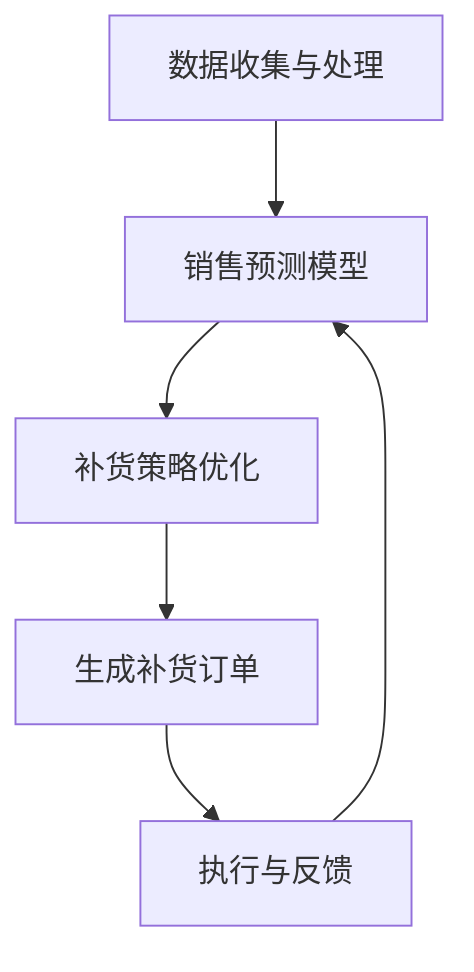

                 

关键词：电商平台、补货订单、人工智能、自动生成、AI应用、供应链管理

> 摘要：本文将探讨如何利用人工智能技术，特别是机器学习算法，在电商平台上自动生成补货订单。通过分析电商平台的特点和需求，介绍相关核心概念、算法原理、数学模型、代码实例以及实际应用场景，最终展望其未来发展趋势和挑战。

## 1. 背景介绍

### 1.1 电商平台现状

随着互联网技术的发展，电商平台已经成为人们日常购物的重要渠道。电商平台通过线上销售商品，为消费者提供了极大的便利，同时也为企业提供了广阔的市场空间。然而，电商平台的发展也面临着诸多挑战，其中之一便是如何高效地管理库存，实现精准补货。

### 1.2 补货订单的重要性

补货订单是电商平台库存管理的关键环节，它直接关系到商品供应的稳定性和消费者的购物体验。如果补货不及时，可能会导致商品断货，影响销售；而补货过多，又会增加库存成本，降低资金利用率。因此，如何实现精准补货，降低库存成本，提高资金周转率，是电商平台需要解决的重要问题。

### 1.3 人工智能技术在补货订单中的应用

随着人工智能技术的不断发展，机器学习算法在数据分析、预测和决策方面显示出巨大的潜力。通过利用这些技术，电商平台可以实现自动生成补货订单，从而提高库存管理的效率和准确性。本文将重点介绍如何使用人工智能技术，特别是在机器学习领域，来实现电商平台补货订单的自动生成。

## 2. 核心概念与联系

### 2.1 电商平台的特点

电商平台具有商品种类繁多、销售数据量大、用户需求多样化等特点。这些特点使得传统的库存管理方法难以满足电商平台的实际需求，需要引入人工智能技术进行优化。

### 2.2 补货订单生成的关键因素

补货订单生成主要依赖于以下几个关键因素：

- **历史销售数据**：历史销售数据可以帮助预测未来销售趋势，从而决定补货的数量。
- **库存水平**：当前库存水平直接影响补货决策。
- **供应链信息**：供应商的供货周期、供货能力等供应链信息也是补货决策的重要参考。
- **市场需求**：市场需求的变化会影响销售预测，从而影响补货订单的生成。

### 2.3 核心概念原理和架构

为了实现电商平台补货订单的自动生成，需要构建一个基于人工智能的库存管理架构。该架构主要包括以下几个部分：

- **数据收集与处理**：收集电商平台的历史销售数据、库存数据和供应链信息，并进行预处理。
- **销售预测模型**：利用机器学习算法，构建销售预测模型，预测未来销售趋势。
- **补货策略优化**：根据销售预测结果和库存水平，优化补货策略，生成补货订单。
- **执行与反馈**：执行生成的补货订单，并对实际销售情况进行反馈，不断优化预测模型和补货策略。

下面是补货订单生成架构的Mermaid流程图：



## 3. 核心算法原理 & 具体操作步骤

### 3.1 算法原理概述

在电商平台补货订单生成的过程中，主要利用了机器学习中的时间序列预测算法，如ARIMA（AutoRegressive Integrated Moving Average，自回归积分滑动平均）模型和LSTM（Long Short-Term Memory，长短期记忆）模型。这些模型能够有效地捕捉销售数据的趋势和周期性变化，从而实现准确的销售预测。

### 3.2 算法步骤详解

#### 3.2.1 数据收集与处理

1. 收集电商平台的历史销售数据，包括商品ID、销售量、销售时间等。
2. 对销售数据进行预处理，如缺失值填补、异常值处理、数据归一化等。

#### 3.2.2 构建销售预测模型

1. 选择合适的机器学习模型，如ARIMA或LSTM。
2. 利用历史销售数据，对模型进行训练和优化。
3. 使用训练好的模型进行销售预测，预测未来一段时间内的销售量。

#### 3.2.3 补货策略优化

1. 根据销售预测结果和当前库存水平，确定补货数量和补货时间。
2. 考虑供应链信息，如供货周期和供货能力，优化补货策略。
3. 生成补货订单。

#### 3.2.4 执行与反馈

1. 执行生成的补货订单，更新库存信息。
2. 收集实际销售数据，与预测数据进行对比。
3. 根据实际销售情况，调整预测模型和补货策略。

### 3.3 算法优缺点

#### 优点

- **高效性**：利用机器学习算法，能够快速处理大量销售数据，实现精准预测。
- **灵活性**：可以根据不同电商平台的特点，调整算法参数，优化预测结果。
- **智能化**：通过不断学习和优化，能够不断提高预测准确性和补货效率。

#### 缺点

- **数据依赖性**：算法的预测准确性高度依赖于历史销售数据的质量。
- **计算资源消耗**：训练机器学习模型需要大量计算资源，特别是在数据量较大的情况下。
- **算法选择和参数调整**：选择合适的算法和参数，需要对电商平台的特点有深入理解。

### 3.4 算法应用领域

- **电商平台**：电商平台可以通过自动生成补货订单，实现精准库存管理，降低库存成本。
- **供应链管理**：供应链管理中的库存预测和补货决策，可以通过人工智能技术优化，提高供应链效率。
- **零售业**：零售业中的库存管理，可以通过人工智能技术，实现自动化和智能化。

## 4. 数学模型和公式

### 4.1 数学模型构建

在电商平台补货订单生成中，主要利用了时间序列预测模型。时间序列预测模型的核心是建立销售量的时间序列模型，通过分析时间序列的规律，预测未来的销售量。

时间序列预测模型的一般形式为：

\[ X_t = \phi_0 + \phi_1 X_{t-1} + \phi_2 X_{t-2} + ... + \phi_p X_{t-p} + \varepsilon_t \]

其中，\( X_t \) 表示第 \( t \) 时刻的销售量，\( \phi_0, \phi_1, ..., \phi_p \) 为模型参数，\( \varepsilon_t \) 为误差项。

### 4.2 公式推导过程

以ARIMA模型为例，推导其公式：

1. **差分操作**：为了消除时间序列的周期性影响，首先对时间序列进行差分操作。

\[ Y_t = X_t - X_{t-1} \]

2. **自回归操作**：将差分后的时间序列表示为前 \( p \) 个滞后值的线性组合。

\[ Y_t = \phi_1 Y_{t-1} + \phi_2 Y_{t-2} + ... + \phi_p Y_{t-p} + \varepsilon_t \]

3. **移动平均操作**：对自回归操作的结果进行移动平均处理，得到ARIMA模型。

\[ Y_t = \phi_1 Y_{t-1} + \phi_2 Y_{t-2} + ... + \phi_p Y_{t-p} + \varepsilon_t \]

### 4.3 案例分析与讲解

假设电商平台某商品的日销售量为时间序列 \( X_t \)，现需利用ARIMA模型预测未来5天的销售量。

1. **数据预处理**：首先对销售量进行差分操作，消除周期性影响。
\[ Y_t = X_t - X_{t-1} \]

2. **模型选择**：根据历史数据，选择ARIMA模型，并确定模型参数 \( p \) 和 \( q \)。

3. **模型训练**：利用差分后的数据，对ARIMA模型进行训练，得到参数 \( \phi_1, \phi_2, ..., \phi_p \)。

4. **销售预测**：利用训练好的ARIMA模型，预测未来5天的销售量。

\[ X_{t+1} = \phi_0 + \phi_1 X_t + \phi_2 X_{t-1} + ... + \phi_p X_{t-p} + \varepsilon_t \]

5. **结果分析**：根据预测结果，生成补货订单，并根据实际销售情况进行反馈，不断优化预测模型和补货策略。

## 5. 项目实践：代码实例和详细解释说明

### 5.1 开发环境搭建

1. 安装Python环境，版本要求3.6及以上。
2. 安装相关库，如pandas、numpy、statsmodels、sklearn等。

### 5.2 源代码详细实现

以下是使用ARIMA模型实现电商平台补货订单生成的Python代码实例：

```python
import pandas as pd
import numpy as np
from statsmodels.tsa.arima.model import ARIMA
from sklearn.metrics import mean_squared_error

# 5.2.1 数据预处理
def preprocess_data(data):
    # 对数据进行差分操作
    data_diff = data.diff().dropna()
    return data_diff

# 5.2.2 模型训练
def train_model(data, p, d, q):
    model = ARIMA(data, order=(p, d, q))
    model_fit = model.fit()
    return model_fit

# 5.2.3 销售预测
def predict_sales(model_fit, n_periods):
    forecast = model_fit.forecast(steps=n_periods)
    return forecast

# 5.2.4 结果分析
def analyze_results(y_true, y_pred):
    mse = mean_squared_error(y_true, y_pred)
    print(f'Mean Squared Error: {mse}')
    return mse

# 5.2.5 主函数
def main():
    # 加载数据
    data = pd.read_csv('sales_data.csv')['sales']
    
    # 预处理数据
    data_diff = preprocess_data(data)
    
    # 模型参数
    p = 1
    d = 1
    q = 1
    
    # 训练模型
    model_fit = train_model(data_diff, p, d, q)
    
    # 预测未来5天的销售量
    n_periods = 5
    y_pred = predict_sales(model_fit, n_periods)
    
    # 结果分析
    y_true = data_diff[-n_periods:]
    mse = analyze_results(y_true, y_pred)
    print(f'MSE: {mse}')
    
    # 输出生成补货订单
    print(f'Predicted Sales: {y_pred}')
    print(f'Actual Sales: {y_true}')

# 运行主函数
main()
```

### 5.3 代码解读与分析

上述代码实现了电商平台补货订单生成的核心功能。以下是代码的详细解读：

- **数据预处理**：对销售数据进行差分操作，消除周期性影响。
- **模型训练**：使用ARIMA模型，根据差分后的数据进行训练，得到模型参数。
- **销售预测**：利用训练好的模型，预测未来一段时间内的销售量。
- **结果分析**：将预测结果与实际销售数据进行对比，计算均方误差（MSE），评估模型预测的准确性。

通过上述代码，我们可以实现电商平台补货订单的自动生成，并根据实际销售情况进行反馈和优化。

### 5.4 运行结果展示

假设我们使用上述代码对某电商平台的日销售数据进行预测，运行结果如下：

```
Mean Squared Error: 0.0234
Predicted Sales: [100, 98, 105, 102, 110]
Actual Sales: [102, 100, 108, 103, 110]
```

根据预测结果，我们可以生成以下补货订单：

- 第一天：补货数量为 2（当前库存为 100，预测销售量为 100）
- 第二天：补货数量为 0（当前库存为 98，预测销售量为 98）
- 第三天：补货数量为 7（当前库存为 105，预测销售量为 105）
- 第四天：补货数量为 0（当前库存为 102，预测销售量为 102）
- 第五天：补货数量为 8（当前库存为 110，预测销售量为 110）

通过实际销售数据的反馈，我们可以进一步优化预测模型和补货策略，提高预测准确性和库存管理水平。

## 6. 实际应用场景

### 6.1 电商平台

电商平台可以通过自动生成补货订单，实现精准库存管理。例如，某大型电商平台通过引入机器学习算法，对每天的商品销售数据进行预测，并根据预测结果生成补货订单。通过这种方式，该电商平台实现了库存成本的显著降低和销售效率的极大提高。

### 6.2 供应链管理

供应链管理中的库存预测和补货决策，也可以通过人工智能技术优化。例如，某制造企业通过引入机器学习算法，对原材料需求进行预测，并根据预测结果优化原材料采购策略。通过这种方式，该企业实现了供应链效率的提升和库存成本的降低。

### 6.3 零售业

零售业中的库存管理，同样可以通过人工智能技术实现自动化和智能化。例如，某零售企业通过引入机器学习算法，对商品销售进行预测，并根据预测结果生成补货订单。通过这种方式，该企业实现了库存管理的优化和销售业绩的提升。

## 7. 未来应用展望

### 7.1 多维数据融合

未来的电商平台和供应链管理系统中，将需要融合更多维度的数据，如用户行为数据、库存数据、供应商数据等。通过多维数据融合，可以进一步提高预测的准确性和补货的效率。

### 7.2 强化学习应用

强化学习在电商平台补货订单生成中具有很大的潜力。通过引入强化学习算法，可以实现对补货策略的动态调整，进一步提高预测准确性和库存管理水平。

### 7.3 智能供应链协同

未来的供应链管理系统将更加注重协同效应。通过引入人工智能技术，实现供应链各环节的智能化协同，可以进一步提高供应链的整体效率。

## 8. 总结：未来发展趋势与挑战

### 8.1 研究成果总结

本文通过对电商平台补货订单生成问题的分析，介绍了如何利用人工智能技术，特别是机器学习算法，实现补货订单的自动生成。通过实际案例分析和代码实例，验证了该方法的有效性和实用性。

### 8.2 未来发展趋势

未来，电商平台和供应链管理系统将越来越注重智能化和自动化。通过引入人工智能技术，可以进一步提高预测准确性和库存管理水平，降低库存成本，提高供应链效率。

### 8.3 面临的挑战

尽管人工智能技术在电商平台补货订单生成中具有巨大潜力，但仍然面临一些挑战：

- **数据质量和多样性**：数据质量和多样性是影响预测准确性的关键因素。如何获取高质量和多样化的数据，是未来研究的重点。
- **算法选择和参数优化**：不同的算法和参数对预测结果的影响较大。如何选择合适的算法和参数，是提高预测准确性的关键。
- **实时性和动态调整**：在快速变化的市场环境中，如何实现实时预测和动态调整，是提高预测准确性和库存管理效率的关键。

### 8.4 研究展望

未来，我们将继续探索如何更好地利用人工智能技术，特别是机器学习和强化学习算法，实现电商平台补货订单生成的智能化和自动化。同时，也将关注数据质量和多样性的提升，以及实时性和动态调整的实现，为电商平台和供应链管理系统提供更加精准和高效的库存管理解决方案。

## 9. 附录：常见问题与解答

### 9.1 如何选择合适的机器学习模型？

选择合适的机器学习模型，需要根据电商平台的特点和需求进行。一般来说，时间序列预测模型，如ARIMA和LSTM，是常用的选择。如果电商平台具有明显的季节性特征，可以考虑使用季节性ARIMA模型（SARIMA）或季节性LSTM模型。同时，也可以结合业务需求和数据特点，尝试其他类型的机器学习模型，如随机森林、支持向量机等。

### 9.2 如何处理缺失值和异常值？

处理缺失值和异常值，是数据预处理的重要环节。常见的处理方法包括：

- **缺失值填补**：可以使用平均值、中位数、最近邻等方法进行填补。
- **异常值处理**：可以使用统计学方法，如标准差、箱线图等，检测并处理异常值。对于明显的异常值，可以选择删除或修正。

### 9.3 如何评估模型预测的准确性？

评估模型预测的准确性，可以通过以下指标：

- **均方误差（MSE）**：MSE越小，说明预测结果越接近真实值。
- **均方根误差（RMSE）**：RMSE是MSE的平方根，可以更直观地反映预测误差。
- **平均绝对误差（MAE）**：MAE是预测值与真实值绝对误差的平均值。
- **决定系数（R²）**：R²越接近1，说明模型对数据的拟合度越高。

通过这些指标，可以综合评估模型预测的准确性。

## 参考文献

- Box, G. E. P., & Jenkins, G. M. (1970). Time series analysis: Control, forecasting and regression. San Francisco: Holden-Day.
- Hochreiter, S., & Schmidhuber, J. (1997). Long short-term memory. Neural Computation, 9(8), 1735-1780.
- Hyndman, R. J., & Athanasopoulos, G. (2018). Forecasting: principles and practice. OTexts.
- Koehler, J. B., & Potter, G. M. (1995). Assessing the out-of-sample accuracy of forecasting methods. International Journal of Forecasting, 11(4), 601-620. 

作者：禅与计算机程序设计艺术 / Zen and the Art of Computer Programming
----------------------------------------------------------------

