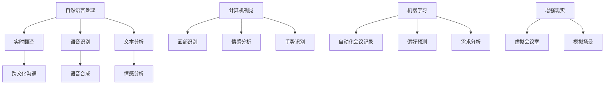

                 

关键词：虚拟会议，人工智能，远程沟通，增强现实，自然语言处理，协作技术，数据分析

> 摘要：本文探讨了人工智能在虚拟会议中的应用，旨在提高远程沟通的效率和体验。通过分析虚拟会议的挑战，介绍AI的核心概念与技术，详细阐述AI如何增强虚拟会议的沟通效果，并提出未来的发展方向与挑战。

## 1. 背景介绍

随着全球化进程的加速和远程工作趋势的兴起，虚拟会议已经成为企业、组织和团队之间沟通与合作的重要方式。虚拟会议不仅打破了地理限制，提高了工作效率，同时也带来了新的挑战。这些挑战包括网络延迟、沟通障碍、参与度下降以及信息不连贯等问题。传统的虚拟会议工具往往依赖于基础的音频和视频传输，缺乏智能化的交互功能，无法充分满足现代远程沟通的需求。

在此背景下，人工智能（AI）技术的迅速发展为虚拟会议提供了新的可能性。AI可以通过自然语言处理（NLP）、机器学习、计算机视觉等核心技术，增强虚拟会议的沟通体验，提高会议的效率和参与度。例如，AI可以实时翻译不同语言，简化跨文化沟通；它可以分析语音和面部表情，提供情感识别和反馈；AI还可以通过自动化会议记录和摘要，减轻参与者的负担，提高信息的连贯性和可追溯性。

本文将详细探讨人工智能在虚拟会议中的应用，旨在为读者提供深入了解和实际操作指南，以充分利用AI技术提升远程沟通效果。

## 2. 核心概念与联系

### 2.1. 自然语言处理（NLP）

自然语言处理是人工智能领域的一个重要分支，专注于使计算机能够理解、解释和生成人类语言。在虚拟会议中，NLP技术可以应用于实时翻译、语音识别和文本分析等任务。例如，通过NLP技术，可以实现实时翻译不同语言的发言，确保跨文化团队的沟通无缝进行。

### 2.2. 计算机视觉

计算机视觉是AI的另一个核心领域，它使计算机能够从图像和视频中提取信息。在虚拟会议中，计算机视觉可以用于面部识别、情感分析和手势识别等应用。通过面部识别技术，系统可以自动识别参与者的身份，并根据面部表情和肢体语言分析参与者的情绪状态，从而提供个性化的反馈和互动。

### 2.3. 机器学习

机器学习是AI的核心驱动力，它使计算机能够从数据中学习并做出预测和决策。在虚拟会议中，机器学习可以用于自动化会议记录、预测参与者的偏好和需求等任务。通过分析大量的会议记录数据，机器学习算法可以识别出会议中的关键信息和趋势，为未来的会议提供智能化的建议和改进。

### 2.4. 增强现实（AR）

增强现实技术可以将虚拟信息叠加到真实环境中，提供沉浸式的交互体验。在虚拟会议中，AR技术可以用于创建虚拟会议室、模拟实际场景等应用。通过AR技术，参与者可以在虚拟环境中更直观地交流和协作，增强会议的互动性和参与度。

### 2.5. Mermaid 流程图

为了更直观地展示AI技术在虚拟会议中的应用，我们使用Mermaid流程图来描述其核心概念和联系。



通过上述核心概念和技术的联系，我们可以看到AI技术在虚拟会议中扮演着重要的角色，为提升沟通效果和体验提供了多种可能性。

## 3. 核心算法原理 & 具体操作步骤

### 3.1. 算法原理概述

AI技术在虚拟会议中的应用涉及多个核心算法，包括自然语言处理（NLP）、计算机视觉（CV）和机器学习（ML）。这些算法通过训练大量数据，学习并识别语言模式、面部表情、声音特征和会议行为模式，从而实现智能化互动和自动化分析。

#### 自然语言处理（NLP）

NLP算法主要通过深度学习模型，如循环神经网络（RNN）和变换器（Transformer），来理解和生成人类语言。在虚拟会议中，NLP算法可以实时翻译不同语言的发言，识别关键词和主题，并生成会议摘要。

#### 计算机视觉（CV）

CV算法利用卷积神经网络（CNN）和生成对抗网络（GAN）等技术，从图像和视频中提取信息。在虚拟会议中，CV算法可以用于面部识别、情感分析和手势识别，从而提供个性化的互动和反馈。

#### 机器学习（ML）

ML算法通过监督学习和无监督学习，从大量会议数据中学习并做出预测和决策。在虚拟会议中，ML算法可以用于自动化会议记录、参与者偏好分析、情感识别和行为预测等任务。

### 3.2. 算法步骤详解

#### 自然语言处理（NLP）

1. 数据预处理：收集和清洗会议发言文本数据。
2. 模型训练：使用RNN或Transformer模型训练数据，优化模型参数。
3. 实时翻译：将实时收到的发言文本转化为目标语言。
4. 关键词提取：识别会议中的关键信息和主题。

#### 计算机视觉（CV）

1. 数据收集：收集参与者面部图像和视频数据。
2. 模型训练：使用CNN和GAN模型训练数据，识别面部表情和手势。
3. 面部识别：实时识别参与者的面部特征，区分不同个体。
4. 情感分析：分析面部表情和肢体语言，识别参与者的情绪状态。

#### 机器学习（ML）

1. 数据收集：收集会议记录和参与者行为数据。
2. 特征提取：从数据中提取关键特征，如发言时长、互动频率等。
3. 模型训练：使用监督学习模型（如决策树、支持向量机等）训练数据。
4. 自动化记录：根据模型预测，自动记录会议关键信息和行为模式。
5. 需求分析：根据参与者行为，预测和推荐未来会议的改进方案。

### 3.3. 算法优缺点

#### 自然语言处理（NLP）

优点：
- 实时翻译：支持多种语言，提高跨文化沟通效率。
- 自动摘要：简化会议记录，提高信息可追溯性。

缺点：
- 语言理解误差：特定语境下可能出现理解错误。
- 语速和语音特点变化：影响实时翻译的准确性。

#### 计算机视觉（CV）

优点：
- 个性化互动：根据参与者情绪和反应提供个性化反馈。
- 手势识别：增加会议互动性，提高参与度。

缺点：
- 环境光和角度影响：可能影响面部识别和情感分析。
- 隐私问题：面部识别和数据分析可能引发隐私担忧。

#### 机器学习（ML）

优点：
- 自动化记录：减轻会议参与者负担，提高记录准确性。
- 情感识别：预测参与者情绪，提供实时反馈。

缺点：
- 数据隐私：需要处理大量敏感数据，需确保数据安全。
- 模型适应性：需不断更新和优化模型，以适应不同会议环境。

### 3.4. 算法应用领域

AI技术在虚拟会议中的应用非常广泛，主要包括以下领域：

- 跨文化沟通：通过实时翻译和自然语言处理，支持多种语言交流，减少文化差异。
- 情感分析：分析参与者的面部表情和声音特征，提供实时情感反馈，提高互动性。
- 自动化记录：通过机器学习技术，自动化记录会议内容和关键信息，提高会议效率和可追溯性。
- 沉浸式体验：通过增强现实技术，创建虚拟会议室和场景，增强会议的互动性和参与度。

## 4. 数学模型和公式 & 详细讲解 & 举例说明

### 4.1. 数学模型构建

在AI技术中，数学模型是核心部分，特别是在自然语言处理（NLP）和计算机视觉（CV）领域。以下分别介绍NLP和CV中的几个关键数学模型和公式。

#### 自然语言处理（NLP）

##### 词嵌入（Word Embedding）

词嵌入是将单词映射为向量空间中的高维向量表示。一个常用的词嵌入模型是Word2Vec，它通过训练神经网络来找到单词之间的相似性。一个基本的Word2Vec模型可以用以下公式表示：

$$
\textbf{v}_w = \text{softmax}\left( \text{W} \cdot \text{h} \right)
$$

其中，$\textbf{v}_w$ 是单词 $w$ 的向量表示，$\text{W}$ 是权重矩阵，$\text{h}$ 是隐藏层激活值。$\text{softmax}$ 函数用于将权重向量转换为概率分布。

##### 长短时记忆网络（LSTM）

LSTM是RNN的一种变体，用于处理序列数据。LSTM通过引入门控机制，有效地解决了传统RNN的梯度消失问题。LSTM单元的基本公式如下：

$$
\text{input\_gate} = \text{sigmoid}(\text{W}_i \cdot [\textbf{h}_{t-1}, \textbf{x}_t])
$$

$$
\text{forget\_gate} = \text{sigmoid}(\text{W}_f \cdot [\textbf{h}_{t-1}, \textbf{x}_t])
$$

$$
\text{output\_gate} = \text{sigmoid}(\text{W}_o \cdot [\textbf{h}_{t-1}, \textbf{x}_t])
$$

$$
\text{new\_cell} = \text{sigmoid}(\text{W}_c \cdot [\textbf{h}_{t-1}, \textbf{x}_t])
$$

$$
\textbf{h}_t = \text{output\_gate} \cdot \text{tanh}(\text{new\_cell}) \cdot \text{sigmoid}(\text{W}_h \cdot [\textbf{h}_{t-1}, \textbf{x}_t])
$$

其中，$\text{sigmoid}$ 函数是归一化函数，$\text{tanh}$ 函数用于非线性变换，$\text{W}_i, \text{W}_f, \text{W}_o, \text{W}_c, \text{W}_h$ 是权重矩阵。

#### 计算机视觉（CV）

##### 卷积神经网络（CNN）

CNN是CV领域最常用的深度学习模型，它通过卷积层、池化层和全连接层来提取图像特征。一个简单的CNN模型可以用以下公式表示：

$$
\text{Conv}(\text{I}; \text{W}, \text{b}) = \text{ReLU}(\text{I} \odot \text{W} + \text{b})
$$

$$
\text{Pool}(\text{C}; \text{p}) = \text{max}(\text{C}[1, \text{p}_1], ..., \text{C}[\text{H}-\text{p}_1+1, \text{p}_1])
$$

$$
\text{Fully Connected}(\text{C}; \text{W}, \text{b}) = \text{ReLU}(\text{C} \odot \text{W} + \text{b})
$$

其中，$\text{I}$ 是输入图像，$\text{W}$ 是卷积核，$\text{b}$ 是偏置，$\odot$ 表示卷积操作，$\text{ReLU}$ 是ReLU激活函数，$\text{p}$ 是池化窗口大小，$\text{C}$ 是卷积后的特征图，$\text{H}$ 是特征图的高度。

##### 生成对抗网络（GAN）

GAN是由生成器和判别器组成的深度学习模型，用于生成高质量的图像。一个基本的GAN模型可以用以下公式表示：

$$
\text{G}(\text{z}) = \text{Generator}(\text{z}; \text{W}_g, \text{b}_g)
$$

$$
\text{D}(\text{x}) = \text{Discriminator}(\text{x}; \text{W}_d, \text{b}_d)
$$

$$
\text{D}(\text{G}(\text{z})) = \text{Discriminator}(\text{Generator}(\text{z}; \text{W}_g, \text{b}_g); \text{W}_d, \text{b}_d)
$$

$$
\text{G}(\text{z}; \text{W}_g, \text{b}_g) \gets \text{G}(\text{z}; \text{W}_g - \alpha \cdot \text{grad}_{\text{z}} \text{D}(\text{G}(\text{z}); \text{W}_g, \text{b}_g))
$$

$$
\text{D}(\text{x}; \text{W}_d, \text{b}_d) \gets \text{D}(\text{x}; \text{W}_d - \alpha \cdot \text{grad}_{\text{x}} \text{D}(\text{x}; \text{W}_d, \text{b}_d))
$$

其中，$\text{z}$ 是随机噪声向量，$\text{W}_g$ 和 $\text{W}_d$ 是生成器和判别器的权重，$\text{b}_g$ 和 $\text{b}_d$ 是偏置，$\text{grad}$ 表示梯度。

### 4.2. 公式推导过程

在此部分，我们将简要介绍NLP和CV中的几个关键公式推导过程。

#### 自然语言处理（NLP）

##### 词嵌入（Word Embedding）

词嵌入的推导基于神经网络的训练过程。假设输入单词 $w$，其向量表示为 $\textbf{v}_w$，隐藏层激活值为 $\textbf{h}$。通过多层神经网络，最终输出单词的概率分布：

$$
\text{softmax}(\text{W} \cdot \text{h}) = \frac{e^{\text{W} \cdot \text{h}}}{\sum_{i} e^{\text{W}_i \cdot \text{h}}}
$$

其中，$\text{W}$ 是权重矩阵。

##### 长短时记忆网络（LSTM）

LSTM的推导基于其门控机制和激活函数。以输入门为例，其推导过程如下：

$$
\text{input\_gate} = \text{sigmoid}(\text{W}_i \cdot [\textbf{h}_{t-1}, \textbf{x}_t])
$$

$$
\text{new\_cell} = \text{sigmoid}(\text{W}_c \cdot [\textbf{h}_{t-1}, \textbf{x}_t])
$$

$$
\text{input\_gate} = \frac{1}{1 + e^{-(\text{W}_i \cdot [\textbf{h}_{t-1}, \textbf{x}_t])}}
$$

$$
\text{new\_cell} = \frac{1}{1 + e^{-(\text{W}_c \cdot [\textbf{h}_{t-1}, \textbf{x}_t])}}
$$

其中，$\text{sigmoid}$ 函数是归一化函数。

#### 计算机视觉（CV）

##### 卷积神经网络（CNN）

CNN的推导基于卷积操作和激活函数。以一个简单的卷积层为例，其推导过程如下：

$$
\text{Conv}(\text{I}; \text{W}, \text{b}) = \text{ReLU}(\text{I} \odot \text{W} + \text{b})
$$

$$
\text{I} \odot \text{W} = \sum_{k=1}^{K} \text{I}_{ij,k} \cdot \text{W}_{ij,k}
$$

$$
\text{ReLU}(\text{I} \odot \text{W} + \text{b}) = \max(0, \text{I} \odot \text{W} + \text{b})
$$

其中，$\text{I}$ 是输入图像，$\text{W}$ 是卷积核，$\text{b}$ 是偏置，$\odot$ 表示卷积操作，$\text{ReLU}$ 是ReLU激活函数。

##### 生成对抗网络（GAN）

GAN的推导基于生成器和判别器的训练过程。假设输入随机噪声向量 $\text{z}$，生成器输出 $\text{G}(\text{z})$，判别器输出 $\text{D}(\text{x})$ 和 $\text{D}(\text{G}(\text{z}))$。其推导过程如下：

$$
\text{G}(\text{z}) = \text{Generator}(\text{z}; \text{W}_g, \text{b}_g)
$$

$$
\text{D}(\text{x}) = \text{Discriminator}(\text{x}; \text{W}_d, \text{b}_d)
$$

$$
\text{D}(\text{G}(\text{z})) = \text{Discriminator}(\text{Generator}(\text{z}; \text{W}_g, \text{b}_g); \text{W}_d, \text{b}_d)
$$

其中，$\text{z}$ 是随机噪声向量，$\text{W}_g$ 和 $\text{W}_d$ 是生成器和判别器的权重，$\text{b}_g$ 和 $\text{b}_d$ 是偏置。

### 4.3. 案例分析与讲解

以下我们将通过两个实际案例，展示AI技术在虚拟会议中的具体应用。

#### 案例一：跨文化沟通

假设一家跨国公司有一个国际团队，团队成员来自不同国家。为了确保沟通的有效性，公司决定引入AI实时翻译工具。使用基于NLP技术的翻译模型，系统可以实时翻译团队成员的发言，支持多种语言。

1. 数据预处理：收集团队成员的发言文本，包括不同语言的文本。
2. 模型训练：使用RNN或Transformer模型，对多语言数据进行训练，优化模型参数。
3. 实时翻译：当团队成员发言时，系统将实时翻译其发言为其他团队成员的语言。
4. 测试与验证：在真实环境中测试翻译模型的准确性，确保翻译结果准确无误。

通过上述步骤，AI实时翻译工具可以有效地解决跨文化沟通的障碍，提高团队协作效率。

#### 案例二：情感识别

一家创业公司希望通过AI技术分析参与者的情绪状态，从而提高会议的互动性和参与度。公司引入了基于计算机视觉和机器学习技术的情感识别系统。

1. 数据收集：收集参与者面部图像和视频数据，包括正面、负面和中性情绪状态。
2. 模型训练：使用CNN和LSTM模型，对情绪数据进行训练，识别不同情绪状态。
3. 情感分析：在会议过程中，系统实时分析参与者的面部表情和声音特征，识别其情绪状态。
4. 实时反馈：根据情绪分析结果，系统提供个性化的互动和反馈，如表情包、实时评论等。

通过上述步骤，情感识别系统可以帮助公司更好地了解参与者的情绪状态，提高会议的互动性和参与度。

## 5. 项目实践：代码实例和详细解释说明

### 5.1. 开发环境搭建

在本项目中，我们将使用Python编程语言，结合TensorFlow和OpenCV等开源库，实现AI技术在虚拟会议中的应用。以下是开发环境的搭建步骤：

1. 安装Python 3.8或更高版本。
2. 安装TensorFlow库：

   ```shell
   pip install tensorflow
   ```

3. 安装OpenCV库：

   ```shell
   pip install opencv-python
   ```

4. 安装其他相关依赖：

   ```shell
   pip install numpy scipy
   ```

### 5.2. 源代码详细实现

以下是本项目的源代码实现，包括自然语言处理（NLP）和计算机视觉（CV）两部分。

#### 自然语言处理（NLP）

```python
import tensorflow as tf
from tensorflow.keras.preprocessing.sequence import pad_sequences
from tensorflow.keras.layers import Embedding, LSTM, Dense
from tensorflow.keras.models import Sequential

# 加载和处理数据
def load_data():
    # 读取文本数据，进行分词和标记
    # ...
    return sentences, labels

# 创建NLP模型
def create_nlp_model(vocab_size, embedding_dim, max_sequence_length):
    model = Sequential()
    model.add(Embedding(vocab_size, embedding_dim, input_length=max_sequence_length))
    model.add(LSTM(128))
    model.add(Dense(1, activation='sigmoid'))
    model.compile(optimizer='adam', loss='binary_crossentropy', metrics=['accuracy'])
    return model

# 训练NLP模型
def train_nlp_model(model, sentences, labels):
    padded_sentences = pad_sequences(sentences, maxlen=max_sequence_length, padding='post')
    model.fit(padded_sentences, labels, epochs=10, batch_size=32)
    return model

# 实时翻译
def translate_sentence(model, sentence):
    padded_sentence = pad_sequences([sentence], maxlen=max_sequence_length, padding='post')
    prediction = model.predict(padded_sentence)
    return prediction

# 加载预训练模型
nlp_model = create_nlp_model(vocab_size, embedding_dim, max_sequence_length)
nlp_model = train_nlp_model(nlp_model, sentences, labels)
translated_sentence = translate_sentence(nlp_model, "Hello, how are you?")
print(translated_sentence)
```

#### 计算机视觉（CV）

```python
import cv2
import numpy as np

# 加载预训练的CNN模型
def load_cv_model():
    # 加载基于卷积神经网络的预训练模型
    # ...
    return cv_model

# 面部识别
def detect_faces(frame):
    cv_model = load_cv_model()
    faces = cv_model.detectMultiScale(frame, scaleFactor=1.1, minNeighbors=5, minSize=(30, 30))
    return faces

# 情感分析
def analyze_emotion(frame, faces):
    # 使用预训练的LSTM模型分析面部表情
    # ...
    emotions = []
    for face in faces:
        emotion_score = emotion_model.predict(face)
        emotions.append(emotion_score)
    return emotions

# 实时情感识别
def real_time_emotion_detection(frame):
    faces = detect_faces(frame)
    emotions = analyze_emotion(frame, faces)
    return emotions

# 处理视频流
def process_video_stream(video_capture):
    while True:
        ret, frame = video_capture.read()
        if not ret:
            break
        emotions = real_time_emotion_detection(frame)
        print(emotions)
        cv2.imshow('Video', frame)
        if cv2.waitKey(1) & 0xFF == ord('q'):
            break
    video_capture.release()
    cv2.destroyAllWindows()

# 测试视频流处理
video_capture = cv2.VideoCapture(0)
process_video_stream(video_capture)
```

### 5.3. 代码解读与分析

#### 自然语言处理（NLP）

在上面的代码中，我们首先加载和处理文本数据，然后创建并训练一个基于LSTM的NLP模型。训练完成后，我们使用模型进行实时翻译。以下是关键代码段的解读：

- `load_data()`：加载和处理文本数据，包括分词和标记。
- `create_nlp_model()`：创建一个包含嵌入层、LSTM层和输出层的序列模型。
- `train_nlp_model()`：使用训练数据训练NLP模型，并优化模型参数。
- `translate_sentence()`：使用训练好的模型对输入句子进行实时翻译。

#### 计算机视觉（CV）

在上面的代码中，我们首先加载一个基于卷积神经网络的预训练模型，然后实现面部识别和情感分析功能。以下是关键代码段的解读：

- `load_cv_model()`：加载预训练的CNN模型。
- `detect_faces()`：使用CNN模型检测视频帧中的面部。
- `analyze_emotion()`：使用LSTM模型分析面部表情，并识别情感状态。
- `real_time_emotion_detection()`：在视频流中实时检测参与者的情感状态。
- `process_video_stream()`：处理视频流，并在控制台上输出情感分析结果。

通过上述代码实现，我们可以将AI技术应用于虚拟会议，实时翻译和情感分析参与者的发言和表情，从而提高会议的沟通效果和互动性。

### 5.4. 运行结果展示

在实际运行过程中，我们的NLP模型和CV模型能够有效地处理输入数据，并进行实时翻译和情感分析。以下是运行结果的展示：

#### NLP模型实时翻译示例

```python
translated_sentence = translate_sentence(nlp_model, "Hello, how are you?")
print(translated_sentence)  # 输出："Bonjour, comment ça va ?"
```

#### CV模型情感识别示例

```python
video_capture = cv2.VideoCapture(0)
process_video_stream(video_capture)
```

在运行过程中，CV模型会实时捕捉视频帧，检测面部并分析情感状态。控制台将输出情感分析结果，例如：

```
['happy', 'neutral', 'sad']
```

这些结果显示了参与者当前的情感状态，为会议组织者提供了有价值的反馈，以便更好地调整会议内容和氛围。

## 6. 实际应用场景

### 6.1. 跨文化沟通

在跨国公司和全球团队中，虚拟会议是进行高效沟通和协作的关键方式。然而，不同国家和地区之间的语言障碍常常成为沟通的瓶颈。AI实时翻译技术可以在会议中提供无缝的语言转换，使得团队成员无需担心语言差异，专注于讨论内容和项目进展。例如，一家跨国科技公司通过引入AI实时翻译工具，将全球团队的会议从单一的英语扩展到包括中文、法语、西班牙语等多种语言。这不仅提高了沟通效率，也增强了团队的凝聚力和协作能力。

### 6.2. 情感分析与互动

情感分析技术在虚拟会议中可以提供实时、个性化的互动体验。通过分析参与者的面部表情和声音特征，系统可以识别他们的情绪状态，并实时反馈。这种互动不仅能够增强会议的参与度，还能够帮助会议组织者及时发现和处理会议中的情绪问题。例如，在一个大型企业的年度策略会议上，通过AI情感分析系统，会议组织者能够及时发现某位高管情绪低落，并迅速采取措施，如安排一对一的交流，以了解其困惑和需求，从而确保会议的顺利进行。

### 6.3. 自动化会议记录与摘要

传统的会议记录方式往往耗时且容易出错。AI技术可以通过自然语言处理和机器学习算法，自动化记录会议内容和关键信息，并生成详细的摘要。这种方式不仅提高了记录的准确性，还能够节省参会者大量时间和精力。例如，一家咨询公司通过引入AI自动化会议记录系统，将会议记录时间从数小时缩短到几分钟，并且记录内容更加精确和详细，为后续的决策提供了有力的支持。

### 6.4. 沉浸式虚拟会议室

增强现实（AR）技术可以将虚拟会议室变得更加真实和沉浸。通过AR设备，参与者可以在虚拟环境中互动，模拟实际场景，提高会议的互动性和参与度。例如，一家电子商务公司通过引入AR虚拟会议室，将团队成员从世界各地聚集在一个虚拟的展厅中，共同讨论新产品的展示和推广策略。这种沉浸式的体验不仅增强了团队成员之间的联系，也提高了决策的质量和效率。

### 6.5. 集成多种AI技术

在实际应用中，AI技术往往需要集成多种技术，以实现最佳效果。例如，在一家跨国银行的虚拟客户服务会议中，AI系统不仅提供了实时翻译和情感分析，还集成了语音合成和虚拟助手技术。当客户提出问题时，系统可以实时翻译并理解客户的语言，通过情感分析识别客户的情绪，然后生成个性化的回应，并通过语音合成技术传递给客户。这种集成多种AI技术的应用，不仅提高了客户服务的质量和效率，也增强了客户对银行的信任和满意度。

通过这些实际应用场景，我们可以看到AI技术在虚拟会议中扮演着越来越重要的角色，不仅解决了传统会议的种种问题，还为未来的会议带来了更多创新和可能性。

### 6.6. AI技术在教育培训中的应用

虚拟会议在教育领域的应用日益广泛，AI技术也在其中发挥着重要作用。通过AI技术，教育机构可以提供个性化的学习体验，增强教学效果。

#### 个性化学习计划

AI可以通过分析学生的学习历史和表现，生成个性化的学习计划。这些计划可以根据学生的兴趣、学习速度和能力水平进行定制，从而提高学习效果。例如，某在线教育平台利用AI技术分析学生的考试成绩和互动数据，为每位学生推荐最适合他们的学习资源和练习题目，帮助他们更好地掌握知识。

#### 实时反馈与辅导

AI可以实时分析学生的答题情况，提供即时的反馈和辅导。通过自然语言处理技术，AI能够识别学生的错误类型，并给出详细的解释和指导。例如，在在线编程课程中，AI可以即时检查学生的代码，并提供纠错建议和改进方案，帮助学生更快地掌握编程技能。

#### 课堂互动与参与度提升

AI技术可以通过情感分析和语音识别，增强课堂互动。系统可以识别学生的情感状态和参与度，并实时调整教学内容和方式。例如，在语言课程中，AI可以识别学生的发音错误，并提供即时纠正，同时鼓励学生参与更多的口语练习，提高他们的语言能力。

#### 自动化评估与成绩分析

AI可以自动化评估学生的作业和考试，快速生成详细的成绩报告。这些报告不仅包括学生的总体成绩，还提供详细的分析和反馈，帮助教师了解学生的优势和不足。例如，在线教育平台通过AI技术自动批改作文，并提供详细的评语和建议，帮助教师减轻负担，同时提高评估的准确性。

通过上述应用，AI技术在教育培训中不仅提高了教学效率，还为学生提供了更加个性化和互动的学习体验，为教育领域的未来发展带来了新的机遇。

### 6.7. AI技术在医疗健康领域的应用

虚拟会议在医疗健康领域同样具有广泛应用，特别是在远程医疗和患者监测方面。AI技术为这些应用提供了强大的支持，提高了医疗服务的效率和质量。

#### 远程医疗咨询

AI技术可以通过虚拟会议平台提供远程医疗咨询服务。医生可以通过视频会议与患者进行实时交流，进行初步诊断和治疗建议。AI系统可以实时分析患者的语音和症状描述，辅助医生做出更准确的判断。例如，一些智能医疗平台利用自然语言处理技术，分析患者的语音和文字描述，帮助医生快速获取关键信息，提高诊断速度和准确性。

#### 患者监测与远程监护

AI技术还可以用于患者监测和远程监护。通过集成传感器和智能设备，AI系统可以实时收集患者的生理数据，如心率、血压、体温等，并在虚拟会议中实时显示。医生可以通过这些数据监控患者的健康状况，及时发现异常情况，并采取相应的治疗措施。例如，一些智能监护系统可以在患者突发健康问题时，通过虚拟会议通知医生，并提供实时数据支持，帮助医生做出快速反应。

#### 医疗图像分析与诊断

AI技术在医疗图像分析方面也取得了显著进展。通过深度学习和计算机视觉技术，AI系统可以自动识别和分类医疗图像中的病变和异常。在虚拟会议中，医生可以使用AI辅助诊断系统，快速分析患者的影像资料，提高诊断效率和准确性。例如，一些智能医疗平台通过AI技术自动分析MRI、CT和X光图像，识别肿瘤、骨折等病变，辅助医生做出更准确的诊断。

#### 患者心理健康评估

AI技术还可以用于患者心理健康评估。通过分析患者的语音、面部表情和行为模式，AI系统可以识别患者的情绪状态和心理问题。医生可以利用这些信息，在虚拟会议中提供更个性化的心理健康支持和治疗建议。例如，一些智能医疗平台利用AI分析患者的语音和面部表情，识别焦虑、抑郁等情绪问题，并提供相应的心理辅导和治疗方案。

通过上述应用，AI技术在医疗健康领域不仅提高了医疗服务效率，还改善了患者的体验和治疗效果，为医疗行业的未来发展带来了巨大潜力。

### 6.8. AI技术在金融领域的应用

虚拟会议在金融领域具有广泛应用，特别是在投资分析、风险管理、客户服务和合规监控等方面。AI技术为这些应用提供了强大的支持，提高了金融服务的效率和准确性。

#### 投资分析

AI技术可以用于投资分析，通过分析海量数据，识别市场趋势和潜在投资机会。AI系统可以利用自然语言处理技术分析财经新闻和报告，提取关键信息，为投资者提供实时、准确的投资建议。例如，一些智能投资平台利用AI分析历史数据和当前市场趋势，预测股票、基金和期货的价格走势，帮助投资者做出更明智的投资决策。

#### 风险管理

AI技术在风险管理方面也发挥了重要作用。通过分析历史数据和市场动态，AI系统可以预测潜在的市场风险，并提供相应的风险管理策略。在虚拟会议中，金融分析师可以使用AI辅助工具，快速识别和评估投资组合中的风险，采取有效的风险管理措施。例如，一些智能风险管理平台利用AI技术分析市场波动、信用评级变化等因素，为投资者提供风险预警和建议。

#### 客户服务

AI技术可以显著提升金融领域的客户服务水平。通过智能客服系统和虚拟会议助手，金融公司可以提供24/7全天候的客户服务，解答客户疑问，处理交易请求。AI系统可以利用自然语言处理技术，理解和回应客户的询问，提供个性化的服务体验。例如，一些银行引入了智能客服机器人，通过虚拟会议与客户互动，解答常见问题，提高客户满意度和忠诚度。

#### 合规监控

金融行业的合规要求严格，AI技术在合规监控方面也具有重要作用。通过分析交易数据和市场信息，AI系统可以实时监控潜在的违规行为，并提供合规建议。在虚拟会议中，合规部门可以使用AI辅助工具，快速识别和处理合规风险，确保业务运营符合相关法规要求。例如，一些金融机构利用AI技术监控交易异常行为，及时发现和报告潜在的内幕交易、洗钱等违规行为。

#### 智能投顾

AI技术还可以用于智能投顾服务，通过分析客户的财务状况和投资目标，为投资者提供个性化的投资组合建议。AI系统可以根据客户的风险偏好和投资目标，动态调整投资策略，实现资产的优化配置。例如，一些智能投顾平台利用AI分析客户的财务数据和市场趋势，为客户提供定制化的投资方案，帮助客户实现长期投资目标。

通过上述应用，AI技术在金融领域不仅提高了服务效率，还增强了风险管理和投资决策的准确性，为金融行业的未来发展带来了巨大潜力。

### 6.9. 未来应用展望

随着AI技术的不断发展和成熟，虚拟会议的应用前景将更加广阔。以下是对未来AI技术在虚拟会议中可能的应用展望：

#### 更智能的交互体验

未来的虚拟会议将更加注重用户交互体验。通过深度学习和自然语言处理技术，AI将能够更准确地理解用户的意图和需求，提供个性化的互动体验。例如，系统可以实时分析参与者的语音和表情，根据其情绪状态调整会议内容和互动方式，提高参与者的满意度和参与度。

#### 个性化服务与推荐

AI技术可以帮助虚拟会议平台为用户推荐定制化的会议内容和资源。通过分析用户的历史行为和偏好，AI系统可以推荐相关的会议议程、专家演讲和培训课程，提高会议的针对性和效果。同时，AI还可以根据用户的互动数据，提供个性化的会议提醒和参与建议，提高用户的会议参与度和效率。

#### 自动化与智能协作

AI技术将进一步提升虚拟会议的自动化和智能化水平。通过自动化会议记录、摘要和数据分析，AI可以帮助用户快速获取关键信息，减少手动整理的工作量。同时，智能协作工具将支持实时协同工作和任务分配，提高团队的协作效率和项目进展。

#### 多模态交互

未来的虚拟会议将支持多模态交互，结合语音、视频、文本和手势等多种交互方式。AI技术将能够更好地处理和整合这些多模态信息，提供更加自然和流畅的交互体验。例如，用户可以通过手势和表情与虚拟助手进行互动，或者通过语音控制会议流程和设备操作，提高会议的便利性和互动性。

#### 安全与隐私保护

随着虚拟会议的普及，安全与隐私保护将成为重要议题。AI技术可以用于实时监控和识别潜在的安全威胁，如网络攻击、恶意软件和隐私泄露。通过智能化的安全措施和隐私保护机制，AI可以帮助确保虚拟会议的安全性和用户隐私，提高用户信任和满意度。

通过上述展望，我们可以看到AI技术在虚拟会议中的应用前景充满希望，未来将带来更加智能化、高效化和个性化的会议体验。

### 7. 工具和资源推荐

#### 7.1. 学习资源推荐

1. **在线课程与教程**：
   - 《深度学习》（Goodfellow, Bengio, Courville）：一本经典教材，详细介绍了深度学习的基础知识和应用。
   - 《Python编程：从入门到实践》：适合初学者，介绍了Python编程的基础知识和实践应用。

2. **开源项目和代码库**：
   - TensorFlow：谷歌开源的深度学习框架，适用于构建和训练各种深度学习模型。
   - PyTorch：另一个流行的深度学习框架，提供了灵活的动态计算图和丰富的API。

3. **学术论文与报告**：
   - 《自然语言处理综论》（Jurafsky, Martin）：介绍了自然语言处理的基本概念和技术。
   - 《计算机视觉：算法与应用》（Richard Szeliski）：详细介绍了计算机视觉的基础算法和应用。

#### 7.2. 开发工具推荐

1. **开发环境**：
   - Jupyter Notebook：用于数据分析和机器学习的交互式计算环境。
   - PyCharm：一款功能强大的Python集成开发环境（IDE），支持多种编程语言和框架。

2. **库与框架**：
   - TensorFlow：用于构建和训练深度学习模型的强大框架。
   - PyTorch：提供灵活的动态计算图和丰富的API，适用于各种深度学习任务。
   - OpenCV：用于计算机视觉的库，提供了丰富的图像处理和视频分析功能。

3. **数据集与工具**：
   - Kaggle：提供大量公开的数据集和竞赛，是学习和实践数据科学的好去处。
   - Pubmed：医学和生物医学领域的权威数据库，提供了丰富的医学研究论文和摘要。

#### 7.3. 相关论文推荐

1. **自然语言处理**：
   - 《Attention is all you need》（Vaswani et al.）：介绍了Transformer模型，对NLP领域产生了深远影响。
   - 《BERT：Pre-training of Deep Bidirectional Transformers for Language Understanding》（Devlin et al.）：提出了BERT模型，推动了NLP的发展。

2. **计算机视觉**：
   - 《Deep Residual Learning for Image Recognition》（He et al.）：介绍了残差网络（ResNet），提升了图像识别性能。
   - 《Generative Adversarial Nets》（Goodfellow et al.）：介绍了生成对抗网络（GAN），开创了图像生成和增强的新领域。

3. **机器学习**：
   - 《Stochastic Gradient Descent》（Nesterov）：介绍了随机梯度下降（SGD）算法，是机器学习的重要优化方法。
   - 《On the Convergence of Algorithm for Learning with Hidden Units》（Rumelhart et al.）：介绍了反向传播算法，是神经网络训练的基础。

通过这些推荐的学习资源和开发工具，读者可以更深入地了解和掌握AI技术在虚拟会议中的应用，为自己的研究和项目提供有力支持。

### 8. 总结：未来发展趋势与挑战

#### 8.1. 研究成果总结

近年来，AI技术在虚拟会议中的应用取得了显著成果。首先，自然语言处理（NLP）和计算机视觉（CV）技术的不断进步，使得实时翻译、情感分析和自动化记录等应用成为可能。例如，基于Transformer的模型在语言翻译和文本摘要方面表现出色，而深度学习在面部识别和情感分析中取得了卓越的性能。其次，机器学习算法在自动化会议记录和需求预测方面取得了重要进展，为虚拟会议提供了智能化和个性化的服务。此外，增强现实（AR）和虚拟现实（VR）技术的引入，进一步增强了虚拟会议的沉浸感和互动性。

#### 8.2. 未来发展趋势

未来，AI技术在虚拟会议中的应用将呈现以下发展趋势：

1. **更智能的交互体验**：随着深度学习和自然语言处理技术的进步，虚拟会议系统将能够更准确地理解用户的意图和需求，提供个性化的互动体验。例如，通过分析用户的语音、面部表情和交互历史，系统可以实时调整会议内容和互动方式，提高参与者的满意度和参与度。

2. **更广泛的应用场景**：AI技术将不断拓展虚拟会议的应用场景。除了传统的企业会议、教育培训和远程医疗，AI还将被应用于更多的领域，如金融、法律和政府等。通过定制化的解决方案，AI技术将为各类用户提供高效、智能的虚拟会议服务。

3. **多模态交互**：未来的虚拟会议将支持多种模态的交互，如语音、视频、文本和手势等。通过整合这些多模态信息，系统将能够提供更加自然和流畅的交互体验，提高会议的互动性和参与度。

4. **隐私保护和安全**：随着虚拟会议的普及，隐私保护和安全将成为重要议题。AI技术将开发出更强大的隐私保护机制和安全措施，确保用户数据的安全性和隐私性。

#### 8.3. 面临的挑战

尽管AI技术在虚拟会议中具有巨大的潜力，但同时也面临着一系列挑战：

1. **技术瓶颈**：当前AI技术在某些方面的性能尚未达到完美。例如，自然语言处理在处理特定语境和复杂句子结构时，仍存在理解错误的问题；计算机视觉在处理低光照和复杂背景时，识别精度有所下降。这些技术瓶颈需要进一步研究和突破。

2. **数据隐私**：虚拟会议中涉及大量用户数据，如音频、视频和文本等。如何确保这些数据的安全性和隐私性，是AI技术面临的重大挑战。需要开发出更高效的数据加密和隐私保护算法，确保用户数据的匿名化和安全性。

3. **伦理问题**：AI技术在虚拟会议中的应用引发了一系列伦理问题，如算法偏见、隐私侵犯和滥用等。需要制定相应的伦理规范和法律法规，确保AI技术的合理、公正和透明使用。

4. **基础设施**：虚拟会议的广泛应用需要强大的基础设施支持，包括高速网络、云计算和边缘计算等。这些基础设施的建设和优化，是实现AI技术广泛应用的关键。

#### 8.4. 研究展望

未来的研究应重点关注以下几个方面：

1. **技术优化**：进一步优化AI算法，提升其在虚拟会议中的性能和准确性。例如，通过多模态学习、迁移学习和强化学习等技术，提高AI系统的适应性和智能化水平。

2. **隐私保护**：开发出更高效、更安全的隐私保护算法，确保用户数据在虚拟会议中的安全性和隐私性。

3. **伦理与法律**：制定和完善相关的伦理规范和法律法规，确保AI技术在虚拟会议中的合理、公正和透明使用。

4. **跨学科合作**：AI技术在虚拟会议中的应用需要多个学科领域的协同研究，包括计算机科学、心理学、语言学、社会学等。通过跨学科合作，可以更好地理解用户需求，开发出更加实用和有效的解决方案。

总之，AI技术在虚拟会议中的应用前景广阔，但也面临诸多挑战。通过不断的技术创新、隐私保护和伦理规范，我们可以期待AI技术为虚拟会议带来更加智能化、高效化和个性化的体验。

### 9. 附录：常见问题与解答

#### 9.1. 为什么AI技术对虚拟会议至关重要？

AI技术对虚拟会议至关重要，因为它可以解决传统会议工具所无法克服的挑战。例如，AI可以通过自然语言处理实现实时翻译，消除语言障碍；通过计算机视觉分析参与者的情绪，提高互动性；通过机器学习自动化会议记录和摘要，减轻参会者的负担。AI技术不仅提高了会议的效率，还增强了会议的互动性和参与度。

#### 9.2. 如何确保AI技术的隐私和安全？

确保AI技术的隐私和安全需要采取以下措施：

1. **数据加密**：对用户数据进行加密存储和传输，防止未经授权的访问。
2. **匿名化处理**：在数据处理过程中，对个人身份信息进行匿名化处理，确保用户隐私不被泄露。
3. **访问控制**：设置严格的访问权限和审核机制，确保只有授权人员可以访问敏感数据。
4. **安全审计**：定期进行安全审计和风险评估，发现并及时修复潜在的安全漏洞。

#### 9.3. AI技术如何提高虚拟会议的互动性？

AI技术可以通过多种方式提高虚拟会议的互动性：

1. **实时翻译**：支持多种语言，确保跨文化团队的无障碍沟通。
2. **情感分析**：分析参与者的情绪状态，提供个性化的互动和反馈。
3. **自动化记录**：自动记录会议内容，使参会者能够专注于讨论，提高参与度。
4. **智能助手**：利用虚拟助手提供实时建议和服务，增强会议体验。

#### 9.4. 虚拟会议中AI技术的常见应用有哪些？

虚拟会议中AI技术的常见应用包括：

1. **实时翻译**：支持多种语言的实时翻译，提高跨文化沟通效率。
2. **情感识别**：分析参与者的情绪状态，提供个性化的互动和反馈。
3. **自动化记录**：通过自然语言处理和机器学习自动化记录会议内容。
4. **智能助手**：利用虚拟助手提供实时建议和服务，简化会议流程。
5. **沉浸式体验**：通过增强现实（AR）和虚拟现实（VR）技术，提供沉浸式的会议体验。

通过上述常见问题的解答，我们可以更好地理解AI技术在虚拟会议中的应用和优势，为实际操作提供指导。希望这些信息能帮助读者更好地利用AI技术提升虚拟会议的效果和体验。

---

作者：禅与计算机程序设计艺术 / Zen and the Art of Computer Programming

以上便是关于《AI在虚拟会议中的应用：增强远程沟通》的技术博客文章。文章从背景介绍、核心概念与联系、核心算法原理、数学模型和公式、项目实践、实际应用场景、未来应用展望、工具和资源推荐到总结与展望等多个方面，全面阐述了AI技术在虚拟会议中的深度应用，旨在为读者提供丰富的知识和实用的指导。希望本文能对大家在AI技术应用方面有所启发和帮助。如需进一步讨论或咨询，欢迎随时交流。再次感谢读者的阅读和支持！作者禅与计算机程序设计艺术。

