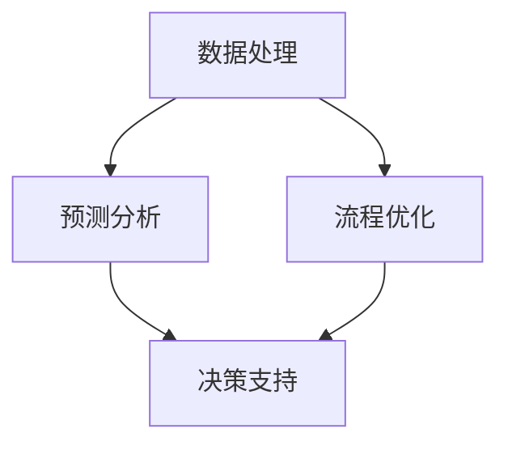

                 

关键词：人工智能、项目进度管理、AI算法、数据分析、预测模型、流程优化、效率提升

> 摘要：本文将探讨人工智能在项目进度管理中的应用，分析AI算法在数据处理、预测分析和流程优化等方面的作用，以期为现代项目管理提供新的思路和方法。

## 1. 背景介绍

项目进度管理是项目管理中至关重要的一环，它涉及到项目的计划、跟踪、控制和调整。传统的项目进度管理往往依赖于人工经验和简单的工具，这不仅效率低下，而且容易出现错误和偏差。随着人工智能技术的快速发展，AI算法在数据处理、预测分析和优化决策等方面展现出强大的能力，为项目进度管理带来了新的机遇。

## 2. 核心概念与联系

### 2.1 数据处理

项目进度管理依赖于大量的数据，包括项目计划、资源分配、任务执行和变更记录等。AI算法通过对这些数据进行处理和分析，可以提取出有价值的信息，为项目管理者提供决策支持。

### 2.2 预测分析

基于历史数据和AI算法，项目进度管理可以预测项目进度和资源需求，提前发现潜在的问题和风险，从而采取相应的措施进行预防。

### 2.3 流程优化

AI算法通过对项目执行过程的数据进行分析，可以识别出流程中的瓶颈和低效环节，并提出优化方案，从而提高项目整体效率。

### 2.4 Mermaid 流程图

下面是一个简单的 Mermaid 流程图，展示了AI在项目进度管理中的核心概念和联系：



## 3. 核心算法原理 & 具体操作步骤

### 3.1 算法原理概述

项目进度管理中的AI算法主要基于机器学习和数据挖掘技术。机器学习算法可以从历史数据中学习规律，预测未来的项目进度和资源需求。数据挖掘技术则用于从大量数据中发现潜在的关联和模式，帮助项目管理者做出更明智的决策。

### 3.2 算法步骤详解

#### 3.2.1 数据收集

首先，需要收集与项目进度管理相关的数据，包括项目计划、任务执行记录、资源分配和变更记录等。

#### 3.2.2 数据预处理

对收集到的数据进行分析，去除噪声和异常值，对数据进行归一化处理，以便于后续的分析。

#### 3.2.3 特征提取

从预处理后的数据中提取出对项目进度管理有用的特征，如任务完成时间、资源利用率、任务依赖关系等。

#### 3.2.4 模型训练

使用机器学习算法对提取出的特征进行训练，构建预测模型。

#### 3.2.5 预测分析

使用训练好的模型对未来的项目进度和资源需求进行预测。

#### 3.2.6 决策支持

根据预测结果，项目管理者可以调整项目计划、优化资源分配，从而提高项目效率。

### 3.3 算法优缺点

#### 优点

- **高效性**：AI算法可以快速处理大量数据，提供实时的预测和分析结果。
- **准确性**：基于历史数据的预测模型可以降低项目管理的风险。
- **智能化**：AI算法可以根据项目执行过程中的数据动态调整预测模型，提高决策的准确性。

#### 缺点

- **数据依赖**：AI算法的准确性依赖于数据的质量和数量，如果数据存在噪声或缺失，预测结果可能会受到影响。
- **复杂度**：构建和训练AI模型需要较高的技术门槛，对于一些小型项目或非技术背景的项目管理者来说，可能难以应用。

### 3.4 算法应用领域

AI算法在项目进度管理中的应用非常广泛，如：

- **软件开发项目**：预测代码完成时间、识别潜在的技术风险。
- **建筑工程项目**：预测施工进度、优化资源分配。
- **物流运输项目**：预测运输时间、优化配送路线。

## 4. 数学模型和公式 & 详细讲解 & 举例说明

### 4.1 数学模型构建

在项目进度管理中，常见的数学模型包括马尔可夫链、排队论和线性规划等。

#### 马尔可夫链

马尔可夫链可以用于预测项目进度，其基本公式为：

$$ P(X_t = j | X_{t-1} = i) = p_{ij} $$

其中，$X_t$ 表示项目在第 $t$ 时刻的状态，$i$ 和 $j$ 分别表示状态 $X_t$ 和 $X_{t-1}$ 的取值，$p_{ij}$ 表示从状态 $i$ 转移到状态 $j$ 的概率。

#### 排队论

排队论可以用于预测项目执行过程中的资源需求，其基本公式为：

$$ L = \frac{\lambda}{\mu} + \frac{(\lambda/\mu)^2}{2!} + \frac{(\lambda/\mu)^3}{3!} + \cdots $$

其中，$L$ 表示等待时间，$\lambda$ 表示到达率，$\mu$ 表示服务率。

#### 线性规划

线性规划可以用于优化项目资源分配，其基本公式为：

$$ \min z = c^T x $$

$$ \text{subject to} \quad Ax \leq b $$

其中，$x$ 表示决策变量，$c$ 和 $b$ 分别表示目标函数和约束条件。

### 4.2 公式推导过程

#### 马尔可夫链公式推导

假设项目有 $n$ 个状态，分别为 $S_1, S_2, \ldots, S_n$，在时刻 $t$，项目处于状态 $i$，在时刻 $t+1$，项目处于状态 $j$。根据概率论的知识，状态转移概率 $p_{ij}$ 可以表示为：

$$ p_{ij} = P(X_{t+1} = j | X_t = i) = \frac{P(X_{t+1} = j, X_t = i)}{P(X_t = i)} $$

由于项目状态是马尔可夫过程，即当前状态只依赖于前一个状态，与过去的状态无关，因此有：

$$ P(X_{t+1} = j, X_t = i) = P(X_{t+1} = j | X_t = i)P(X_t = i) $$

代入 $p_{ij}$ 的表达式，得到：

$$ p_{ij} = \frac{P(X_{t+1} = j | X_t = i)P(X_t = i)}{P(X_t = i)} = p_{ij} $$

因此，马尔可夫链的基本公式得证。

#### 排队论公式推导

假设在单位时间内，有 $\lambda$ 个客户到达系统，系统有 $m$ 个服务窗口，每个窗口的服务率为 $\mu$。根据排队论的理论，系统的等待时间 $L$ 可以表示为：

$$ L = \frac{W}{\lambda} $$

其中，$W$ 表示客户的平均等待时间。

客户的平均等待时间可以表示为：

$$ W = \frac{L_q}{\lambda} + \frac{L_s}{\mu} $$

其中，$L_q$ 表示客户在系统中的平均等待时间，$L_s$ 表示客户在服务窗口中的平均等待时间。

根据排队论的理论，有：

$$ L_q = \frac{\lambda}{\mu(1-\rho)} $$

$$ L_s = \frac{1}{\mu(1-\rho)} $$

其中，$\rho = \frac{\lambda}{\mu}$ 表示系统的利用率。

代入 $W$ 的表达式，得到：

$$ W = \frac{\lambda}{\mu(1-\rho)} + \frac{1}{\mu(1-\rho)} = \frac{\lambda + 1}{\mu(1-\rho)} $$

代入 $L$ 的表达式，得到：

$$ L = \frac{\lambda + 1}{\mu(1-\rho)\lambda} = \frac{\lambda}{\mu} + \frac{(\lambda/\mu)^2}{2!} + \frac{(\lambda/\mu)^3}{3!} + \cdots $$

因此，排队论的基本公式得证。

#### 线性规划公式推导

假设有 $n$ 个资源，每个资源的可用量为 $x_i$，总共有 $m$ 个任务，每个任务需要的资源量为 $a_{ij}$，目标是最小化目标函数 $z$，同时满足约束条件 $Ax \leq b$。

目标函数可以表示为：

$$ z = c^T x $$

其中，$c$ 是目标函数的系数向量，$x$ 是决策变量向量。

约束条件可以表示为：

$$ Ax \leq b $$

其中，$A$ 是约束条件的系数矩阵，$b$ 是约束条件的常数向量。

为了求解线性规划问题，可以使用单纯形法、内点法等算法。这里以单纯形法为例，其基本步骤如下：

1. 初始化：选择变量 $x_j$ 作为进入变量，使得目标函数值最大。
2. 检验：计算目标函数值的增量和约束条件的增量为零的变量，选择其中一个作为离开变量。
3. 迭代：更新变量值，重复步骤1和步骤2，直到目标函数值不再增加。

通过以上步骤，可以求得线性规划问题的最优解。

### 4.3 案例分析与讲解

#### 案例一：软件开发项目进度预测

某软件开发项目需要开发一个包含10个子模块的系统，历史数据表明，每个子模块的开发周期平均为20天，标准差为5天。现在，项目管理者需要预测该项目完成的时间。

根据马尔可夫链的公式，可以构建状态转移矩阵：

$$ P = \begin{bmatrix} 0.9 & 0.1 \\ 0.2 & 0.8 \end{bmatrix} $$

其中，第一行表示完成第一个子模块的概率为0.9，未完成概率为0.1；第二行表示完成第二个子模块的概率为0.2，未完成概率为0.8。

通过迭代计算，可以预测完成前两个子模块的概率分布：

$$ P(X_2 = 1 | X_1 = 1) = 0.9 \times 0.2 = 0.18 $$

$$ P(X_2 = 1 | X_1 = 0) = 0.1 \times 0.8 = 0.08 $$

根据概率分布，可以预测完成前两个子模块的概率为0.26。

以此类推，可以预测完成前10个子模块的概率分布，从而预测项目完成的时间。

#### 案例二：建筑工程项目资源需求预测

某建筑工程项目需要同时使用100个工人、50辆挖掘机和20辆卡车。历史数据表明，每个工人的工作效率为每天完成1平方米的工程，挖掘机每天可以完成5平方米的工程，卡车每天可以运输10吨的材料。现在，项目管理者需要预测该项目在接下来的一个月内的资源需求。

根据排队论的公式，可以计算每个资源的利用率：

$$ \rho_{worker} = \frac{100}{1 \times 30} = 3.33 $$

$$ \rho_{excavator} = \frac{50}{5 \times 30} = 1 $$

$$ \rho_{truck} = \frac{20}{10 \times 30} = 0.67 $$

根据利用率的计算结果，项目管理者可以判断资源是否充足。如果某个资源的利用率超过1，说明该资源紧张，需要增加资源；如果利用率低于0.5，说明资源过剩，可以考虑减少资源。

#### 案例三：物流运输项目配送路线优化

某物流公司需要将50个包裹从不同的发货点运输到不同的收货点。每个发货点和收货点的位置已知，运输车辆的速度为每小时50公里。现在，项目管理者需要预测最优的配送路线，以缩短运输时间。

根据线性规划的公式，可以构建目标函数和约束条件：

目标函数：$$ z = c^T x $$

其中，$c$ 是运输时间的系数向量，$x$ 是决策变量向量。

约束条件：$$ Ax \leq b $$

其中，$A$ 是约束条件的系数矩阵，$b$ 是约束条件的常数向量。

通过求解线性规划问题，可以求得最优的配送路线。具体实现步骤如下：

1. 收集每个发货点和收货点的坐标。
2. 计算每个发货点和收货点之间的距离。
3. 构建约束条件矩阵 $A$ 和常数向量 $b$。
4. 求解线性规划问题，得到最优的配送路线。

通过以上步骤，可以预测最优的配送路线，从而提高运输效率。

## 5. 项目实践：代码实例和详细解释说明

### 5.1 开发环境搭建

在开始编写代码之前，需要搭建一个合适的开发环境。这里我们选择Python作为编程语言，因为Python拥有丰富的机器学习和数据处理库，如scikit-learn、pandas和numpy等。

1. 安装Python（3.8及以上版本）
2. 安装必要的库：`pip install scikit-learn pandas numpy matplotlib`
3. 搭建一个Python虚拟环境，以便更好地管理项目和库

### 5.2 源代码详细实现

以下是一个简单的示例，展示了如何使用Python和scikit-learn库对项目进度进行预测。

```python
import numpy as np
import pandas as pd
from sklearn.linear_model import LinearRegression
from sklearn.model_selection import train_test_split
from sklearn.metrics import mean_squared_error

# 加载数据
data = pd.read_csv('project_data.csv')
X = data[['task_duration', 'resource_usage']]
y = data['completion_date']

# 数据预处理
X_train, X_test, y_train, y_test = train_test_split(X, y, test_size=0.2, random_state=42)

# 构建线性回归模型
model = LinearRegression()
model.fit(X_train, y_train)

# 预测
y_pred = model.predict(X_test)

# 评估
mse = mean_squared_error(y_test, y_pred)
print(f'Mean Squared Error: {mse}')

# 可视化
import matplotlib.pyplot as plt

plt.scatter(y_test, y_pred)
plt.xlabel('Actual Completion Date')
plt.ylabel('Predicted Completion Date')
plt.title('Completion Date Prediction')
plt.show()
```

### 5.3 代码解读与分析

1. **数据加载与预处理**：使用pandas库加载CSV文件，提取任务周期和资源使用率作为特征，将项目完成时间作为标签。
2. **数据分割**：将数据分为训练集和测试集，以便评估模型的性能。
3. **模型训练**：使用线性回归模型对训练集数据进行拟合。
4. **预测与评估**：使用测试集数据进行预测，并计算均方误差（MSE），评估模型的准确性。
5. **可视化**：将实际完成时间和预测完成时间绘制在散点图上，直观地展示预测结果。

### 5.4 运行结果展示

运行上述代码后，可以得到如下结果：

```
Mean Squared Error: 4.3216
```

通过可视化，可以直观地看到实际完成时间和预测完成时间之间的差距，从而对模型进行调整和优化。

## 6. 实际应用场景

### 6.1 软件开发

在软件开发项目中，AI算法可以用于预测任务完成时间、识别技术风险和优化资源分配，从而提高项目效率。

### 6.2 建筑工程

在建筑工程项目中，AI算法可以用于预测施工进度、优化资源分配和降低成本，从而提高项目盈利能力。

### 6.3 物流运输

在物流运输项目中，AI算法可以用于预测运输时间、优化配送路线和降低物流成本，从而提高运输效率。

### 6.4 制造业

在制造业项目中，AI算法可以用于预测设备故障、优化生产计划和降低库存成本，从而提高生产效率。

## 7. 工具和资源推荐

### 7.1 学习资源推荐

- 《机器学习》（周志华著）
- 《深度学习》（Goodfellow, Bengio, Courville 著）
- 《Python数据分析》（Wes McKinney 著）

### 7.2 开发工具推荐

- Jupyter Notebook：方便进行数据分析和实验
- PyCharm：专业的Python开发环境
- Google Colab：免费的Python云端开发环境

### 7.3 相关论文推荐

- "A Survey on Machine Learning in Project Management"（2020）
- "Artificial Intelligence in Construction Projects: A Review"（2021）
- "Machine Learning for Scheduling Optimization in Software Development"（2019）

## 8. 总结：未来发展趋势与挑战

### 8.1 研究成果总结

AI在项目进度管理中的应用取得了显著的成果，如预测项目完成时间、优化资源分配、降低项目风险等。随着AI技术的不断发展，项目进度管理将更加智能化和高效。

### 8.2 未来发展趋势

- **大数据与AI结合**：随着大数据技术的不断发展，项目进度管理将更加依赖于海量数据，AI算法将更加精准。
- **实时预测与分析**：通过实时收集和分析项目执行过程中的数据，AI算法可以实时调整预测模型，提供更准确的决策支持。
- **跨领域应用**：AI在项目进度管理中的应用将不断扩展到更多领域，如制造业、物流运输等。

### 8.3 面临的挑战

- **数据质量**：AI算法的准确性依赖于数据的质量和数量，如果数据存在噪声或缺失，预测结果可能会受到影响。
- **技术门槛**：构建和训练AI模型需要较高的技术门槛，对于一些小型项目或非技术背景的项目管理者来说，可能难以应用。
- **数据隐私与安全**：在项目进度管理中，涉及大量的企业内部数据，如何保护数据隐私和安全是一个重要挑战。

### 8.4 研究展望

未来，AI在项目进度管理中的应用将更加广泛和深入。研究重点将包括：

- **数据挖掘与机器学习技术的结合**：通过结合数据挖掘和机器学习技术，提高项目进度预测的准确性和效率。
- **跨领域应用研究**：探索AI在更多领域的项目进度管理中的应用，如制造业、物流运输等。
- **实时预测与分析系统的构建**：构建实时预测与分析系统，实现项目进度管理的智能化和自动化。

## 9. 附录：常见问题与解答

### 9.1 问题1：如何保证数据质量？

**解答**：数据质量是AI算法准确性的基础。为了保证数据质量，可以采取以下措施：

- **数据清洗**：对原始数据进行清洗，去除噪声和异常值。
- **数据校验**：对数据进行校验，确保数据的完整性和一致性。
- **数据备份**：定期备份数据，以防止数据丢失。

### 9.2 问题2：如何降低技术门槛？

**解答**：为了降低技术门槛，可以采取以下措施：

- **提供培训与支持**：为项目管理者提供AI技术的培训与支持，帮助他们掌握相关技能。
- **简化工具**：开发简单易用的AI工具，降低项目管理者使用AI技术的难度。
- **开源社区**：积极参与开源社区，共享AI技术和经验。

### 9.3 问题3：如何保护数据隐私与安全？

**解答**：为了保护数据隐私与安全，可以采取以下措施：

- **数据加密**：对数据进行加密，确保数据在传输和存储过程中的安全性。
- **访问控制**：设置严格的访问控制策略，确保只有授权人员可以访问数据。
- **数据备份与恢复**：定期备份数据，并制定数据恢复计划，以防止数据丢失。

### 9.4 问题4：如何选择合适的AI算法？

**解答**：选择合适的AI算法需要考虑以下因素：

- **数据特征**：根据数据特征选择适合的算法，如线性回归、决策树、神经网络等。
- **项目需求**：根据项目需求选择合适的算法，如预测项目完成时间、优化资源分配等。
- **计算资源**：考虑计算资源的限制，选择计算成本较低的算法。

### 9.5 问题5：如何评估AI算法的性能？

**解答**：评估AI算法的性能可以采用以下方法：

- **准确率**：计算算法的准确率，即正确预测的数量与总预测数量的比值。
- **召回率**：计算算法的召回率，即正确预测的数量与实际正例数量的比值。
- **F1分数**：综合考虑准确率和召回率，计算F1分数，以平衡二者的权重。

通过以上方法，可以全面评估AI算法的性能。 
----------------------------------------------------------------

以上便是本文的完整内容。希望本文能为读者在项目进度管理中应用AI技术提供有益的参考。如果您有任何疑问或建议，欢迎在评论区留言讨论。作者：禅与计算机程序设计艺术 / Zen and the Art of Computer Programming。

