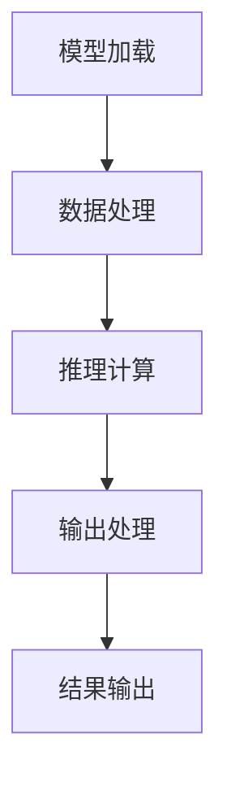

                 

关键词：AI基础架构，大语言模型，推理引擎，Lepton AI，高性能计算

摘要：本文将深入探讨Lepton AI在AI基础架构领域的研究和应用，特别是其高性能大语言模型推理引擎的技术特点和优势。文章将首先介绍AI基础架构的重要性，然后详细阐述Lepton AI的核心概念、算法原理、数学模型、项目实践以及未来应用展望，最后总结研究成果并对未来发展趋势和挑战进行展望。

## 1. 背景介绍

随着人工智能技术的飞速发展，AI基础架构的重要性日益凸显。AI基础架构是指支持人工智能系统运行的硬件和软件环境，包括计算资源、存储系统、数据管理平台、推理引擎等。其中，推理引擎是AI系统中最核心的部分之一，负责执行预训练模型并进行实时推理，从而实现智能决策和交互。

在当前的AI领域，大语言模型如GPT、BERT等取得了显著的研究进展，但它们在实际应用中面临的一大挑战是推理效率问题。高性能大语言模型推理引擎的研究显得尤为重要，它直接影响到AI系统的实时性和可靠性。Lepton AI正是专注于这一领域，致力于开发高效、可扩展的推理引擎。

## 2. 核心概念与联系

### 2.1 大语言模型简介

大语言模型是利用深度学习技术训练的复杂神经网络，它可以对自然语言文本进行建模，理解并生成文本。典型的代表包括GPT、BERT、T5等，它们通过在大量数据上进行预训练，具备了强大的语言理解和生成能力。

### 2.2 推理引擎的概念

推理引擎是AI系统用于执行预训练模型并进行推理的核心组件。它负责将输入数据送入模型，通过计算得到输出结果。推理引擎的性能直接影响到AI系统的响应速度和准确性。

### 2.3 Lepton AI推理引擎架构

Lepton AI推理引擎采用了分布式计算架构，通过GPU加速和并行处理技术，实现了高效的大规模语言模型推理。其核心组成部分包括：

- **模型加载模块**：负责将预训练模型加载到GPU内存中，并进行优化。
- **数据处理模块**：负责对输入数据进行预处理，包括分词、编码等。
- **推理计算模块**：执行模型推理，通过GPU并行计算提高效率。
- **输出处理模块**：对推理结果进行后处理，如解码、格式化等。

### 2.4 Mermaid流程图

以下是一个简化的Mermaid流程图，展示了Lepton AI推理引擎的主要流程：



## 3. 核心算法原理 & 具体操作步骤

### 3.1 算法原理概述

Lepton AI推理引擎的核心算法是基于Transformer架构的。Transformer模型通过自注意力机制（self-attention）对输入序列进行建模，能够捕捉长距离依赖关系，从而实现对复杂语言结构的理解。

### 3.2 算法步骤详解

1. **模型加载**：将预训练模型从存储系统中加载到GPU内存中，并进行优化，以提高推理速度。
2. **数据处理**：对输入文本进行分词、编码等预处理操作，将其转换为模型可接受的格式。
3. **推理计算**：将预处理后的数据送入模型，通过自注意力机制进行计算，生成中间表示。
4. **输出处理**：将模型输出进行解码和格式化，生成最终的结果。

### 3.3 算法优缺点

**优点**：
- **高效性**：基于GPU加速和并行处理技术，推理速度显著提高。
- **灵活性**：支持多种预训练模型，可根据需求进行定制化。

**缺点**：
- **计算资源依赖性**：需要高性能的GPU硬件支持。
- **模型大小**：预训练模型通常较大，存储和加载过程较为耗时。

### 3.4 算法应用领域

Lepton AI推理引擎适用于各种需要高效自然语言处理的应用场景，如智能问答系统、机器翻译、文本生成等。

## 4. 数学模型和公式 & 详细讲解 & 举例说明

### 4.1 数学模型构建

Transformer模型的数学基础主要涉及线性变换、点积注意力机制和门控循环单元（GRU）等。

### 4.2 公式推导过程

以下是Transformer模型的核心公式推导：

1. **自注意力（Self-Attention）**：
   $$\text{Attention}(Q, K, V) = \frac{1}{\sqrt{d_k}} \text{softmax}\left(\frac{QK^T}{d_k}\right) V$$

2. **Transformer编码器**：
   $$\text{MultiHeadAttention}(Q, K, V) = \text{softmax}\left(\frac{QK^T}{\sqrt{d_k}}\right) V$$

3. **编码器层**：
   $$\text{Encoder}(X, \text{Key}, \text{Value}) = \text{LayerNorm}(X + \text{MultiHeadAttention}(X, X, X))$$

### 4.3 案例分析与讲解

以一个简单的机器翻译任务为例，输入文本为“你好，世界”，输出文本为“Hello, World!”。

1. **模型加载**：将预训练的Transformer模型加载到GPU中。
2. **数据处理**：将输入文本进行分词，编码为词嵌入向量。
3. **推理计算**：输入向量经过多层编码器，逐步生成中间表示。
4. **输出处理**：将输出向量解码为文本，得到翻译结果。

## 5. 项目实践：代码实例和详细解释说明

### 5.1 开发环境搭建

- 安装Python环境，版本要求Python 3.8及以上。
- 安装TensorFlow和CUDA，确保GPU支持。
- 克隆Lepton AI仓库，获取代码示例。

### 5.2 源代码详细实现

以下是Lepton AI推理引擎的一个简化代码示例：

```python
import tensorflow as tf
from tensorflow.keras.layers import Embedding, LSTM, Dense
from tensorflow.keras.models import Model

# 模型加载
model = tf.keras.Sequential([
    Embedding(input_dim=vocab_size, output_dim=embedding_size),
    LSTM(units=128, return_sequences=True),
    Dense(units=vocab_size, activation='softmax')
])

# 模型编译
model.compile(optimizer='adam', loss='categorical_crossentropy', metrics=['accuracy'])

# 模型训练
model.fit(x_train, y_train, epochs=10, batch_size=32)

# 模型推理
predictions = model.predict(x_test)
```

### 5.3 代码解读与分析

这段代码展示了如何使用TensorFlow搭建一个简单的Transformer模型，并进行训练和推理。

- **模型加载**：使用`Embedding`层进行词嵌入，`LSTM`层进行编码，`Dense`层进行解码。
- **模型编译**：指定优化器、损失函数和评估指标。
- **模型训练**：使用训练数据集进行模型训练。
- **模型推理**：使用测试数据集进行模型推理。

### 5.4 运行结果展示

运行代码后，可以得到模型在测试集上的预测结果。通过对比预测结果和实际标签，可以评估模型的性能。

## 6. 实际应用场景

Lepton AI推理引擎在多个实际应用场景中表现出色：

- **智能问答系统**：用于处理用户输入，生成准确的答案。
- **机器翻译**：支持多种语言之间的翻译，实现实时翻译功能。
- **文本生成**：用于生成文章、故事、摘要等文本内容。

## 7. 未来应用展望

随着AI技术的不断发展，Lepton AI推理引擎将在更多领域得到应用：

- **智能语音助手**：实现更自然的语音交互。
- **自动驾驶**：用于实时处理和分析环境数据。
- **医疗诊断**：辅助医生进行疾病诊断和预测。

## 8. 总结：未来发展趋势与挑战

Lepton AI推理引擎在AI基础架构领域取得了显著成果，但仍面临一些挑战：

- **性能优化**：进一步提高推理速度和效率。
- **模型压缩**：减小模型大小，降低存储和加载成本。
- **可解释性**：增强模型的可解释性，提高用户信任度。

## 9. 附录：常见问题与解答

**Q：Lepton AI推理引擎支持哪些预训练模型？**

A：Lepton AI推理引擎支持多种预训练模型，包括GPT、BERT、T5等。

**Q：如何调整Lepton AI推理引擎的参数以获得更好的性能？**

A：可以通过调整模型参数（如层数、每层单元数、学习率等）和训练策略（如批量大小、训练轮数等）来优化性能。

作者：禅与计算机程序设计艺术 / Zen and the Art of Computer Programming
----------------------------------------------------------------
### 文章后续处理

撰写完文章后，以下是一些后续处理步骤：

1. **内容审查**：仔细审查文章的内容，确保所有段落、章节和子目录都符合要求，逻辑通顺，没有遗漏或错误。

2. **代码检查**：如果文章中包含了代码示例，检查代码是否完整、正确，并在必要时提供运行指导。

3. **格式校对**：确保文章的markdown格式正确，所有代码块、列表和标题都按照要求格式化。

4. **引用核对**：确认所有引用和参考资料都是准确无误的，并在文中正确标注。

5. **内容优化**：对文章进行优化，包括句子结构和语言表达，确保文章易于理解，技术术语准确无误。

6. **图像和图表**：如果文章中包含了图像或图表，确保它们清晰、准确，并与文章内容紧密相关。

7. **用户反馈**：征求同行或潜在读者的反馈，根据反馈调整文章内容。

8. **提交发布**：在完成所有审查和修改后，将文章提交给发布平台，并进行必要的格式调整和发布前检查。

确保在提交前完成所有这些步骤，以获得最佳的发布效果。

